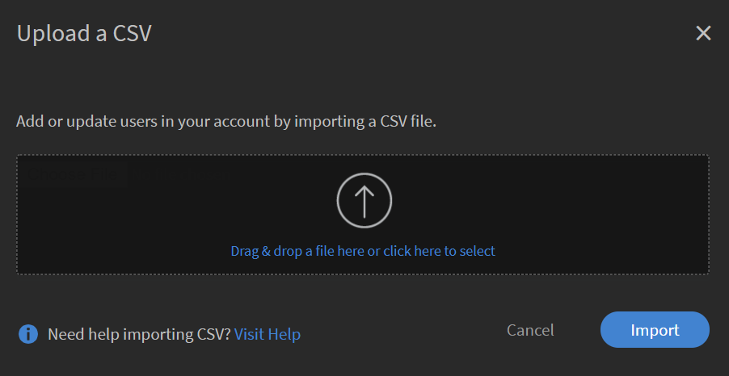

# Benutzer hinzufügen und Benutzergruppen erstellen

Erfahren Sie, wie Sie Benutzer oder Benutzergruppen in der Learning Manager-Anwendung hinzufügen.

<!---->

## Übersicht {#overview}

Im Adobe-Lern-Manager können Sie die folgenden Rollen übernehmen:

* **Administrator:** Ein Administrator definiert die Schulungsstrategie für das Unternehmen. Ein Administrator kann Teilnehmer hinzufügen, nach erforderlichen Kenntnissen für Teilnehmer suchen, Kurse verwalten und zuweisen, Lernpläne, Zertifizierungen und Lernprogramme erstellen und Berichte für das gesamte Unternehmen verwalten.
* **Autor:** Autoren sind Entwickler didaktischer Konzepte und Ersteller von Inhalten. Ein Autor kann Module und Kurse zum Learning Manager hinzufügen.
* **Manager:** Ein Manager verwaltet die Lernaktivitäten eines Teams. Ein Manager kann Teammitglieder für einen Kurs nominieren, Anfragen von Teammitgliedern genehmigen und Feedback zur Leistung ihrer Teammitglieder nach Abschluss der Schulung geben. Manager können auch Berichte für ihr Team anzeigen, um ihre Leistung zu verfolgen.
* **Teilnehmer:** Teilnehmer können auf Kurse, Lernprogramme und Zertifizierungen zugreifen, die ihnen zugewiesen wurden. Teilnehmer können auch alle verfügbaren Kurse mithilfe eines Katalogs durchsuchen und sich selbst für Kurse, Lernprogramme oder Zertifizierungen registrieren.

Als Administrator können Sie Benutzer auf drei Arten hinzufügen:

* Intern
* Extern
* Benutzergruppen

## Einen einzelnen Benutzer hinzufügen {#addasingleuser}

Um Benutzer hinzuzufügen,

1. Melden Sie sich bei Adobe Learning Manager als Administrator an.
1. Klicken Sie auf der Homepage auf **[!UICONTROL Benutzer hinzufügen]**. Auf dieser Seite können Sie mithilfe einer CSV-Datei einen einzelnen Benutzer oder mehrere Benutzer gleichzeitig hinzufügen. Sie können auch einen Link zur Selbstregistrierung für interne Mitarbeiter oder ein externes Teilnehmerprofil erstellen.
1. Um einen einzelnen Benutzer hinzuzufügen, klicken Sie auf **[!UICONTROL Hinzufügen]** oben rechts, und wählen Sie die Option **[!UICONTROL Einzelbenutzer]**.

   
   *Einen einzelnen internen Benutzer hinzufügen*

1. Im Fenster &quot; **[!UICONTROL Benutzer hinzufügen]** &quot; die Details des Teilnehmers ein. Für das Feld **[!UICONTROL Managername]** den Namen eines vorhandenen Benutzers im System aus.

   
   *Dialogfeld &quot;Benutzer hinzufügen&quot;*

1. Um den neuen Benutzer im Learning Manager hinzuzufügen, klicken Sie auf **[!UICONTROL Hinzufügen]**. Nachdem der Benutzer hinzugefügt wurde, erhält er eine Bestätigungs-E-Mail. Der Teilnehmer aktiviert dann das Konto und verwendet Learning Manager. Dieser Arbeitsablauf ist hilfreich, wenn Sie eine begrenzte Anzahl von Teilnehmern zu Ihrem Learning Manager-Konto hinzufügen müssen. Wenn Sie jedoch alle Mitarbeiter eines großen Unternehmens registrieren möchten, können Sie sie in einem einzigen Versuch hinzufügen. Weitere Informationen finden Sie im nächsten Abschnitt.

## Gleichzeitiges Hinzufügen mehrerer Benutzer {#addusersinbulk}

In der Regel arbeiten die meisten Organisationen mit einem HR Management System (HRMS), das alle Mitarbeiterdatensätze verwaltet, z. B. Bezeichnung, Standort, Beitrittsdatum oder Mitarbeiterhierarchie. Sie können diese Daten in einem CSV-Format exportieren. Führen Sie die folgenden Schritte aus, um eine CSV-Datei zu importieren:

1. Klicken **[!UICONTROL Hinzufügen]** in der oberen rechten Ecke und wählen Sie die Option **[!UICONTROL CSV hochladen]**.

   
   *CSV hochladen, um mehrere Benutzer gleichzeitig hinzuzufügen*

1. Die CSV-Datei, die Sie hochladen, besteht aus den Feldern, wie unten gezeigt:

   
   *Struktur der CSV-Datei*

   Sie müssen eine Master-CSV-Datei verwalten und alle Ergänzungen und Löschungen in der Master-CSV durchführen. Die Master-CSV-Datei enthält die folgenden Felder:

   * name &#42;
   * email &#42;
   * Profil
   * Betriebsleiter

   (&#42;) Erforderliches Feld.

1. Nachdem Sie auf die Option **[!UICONTROL CSV hochladen]** wird das folgende Dialogfeld angezeigt.

   
   *Dialogfeld &quot;CSV hochladen&quot;*

1. Wählen Sie die CSV-Datei aus oder ziehen Sie die Datei per Drag &amp; Drop. Nachdem Sie die Datei ausgewählt haben, ordnen Sie die Datenfelder den Feldern in der CSV-Datei zu. Klicken Sie auf die gewünschte Dropdownliste und wählen Sie das richtige Feld aus.

   
   *Zuordnungsfelder in CSV-Datei*

1. Um den Import der Benutzer zu starten, klicken Sie auf **[!UICONTROL Speichern]**. Eine Bestätigungsmeldung wird angezeigt.

   
   *Bestätigungsmeldung für erfolgreichen Upload der CSV-Datei*

1. Die neuen Benutzer werden jetzt Ihrem Adobe Learning Manager-Konto hinzugefügt. Um die neuen Benutzer auszuwählen, aktivieren Sie das Kontrollkästchen neben den Namen, sodass alle ausgewählt sind.

   
   *Neue Benutzer hinzugefügt*

>[!NOTE]
>
>Weitere Informationen finden Sie in den häufig gestellten Fragen, [Gleichzeitiges Hinzufügen mehrerer Benutzer](../add-users-in-bulk.md).

Nachdem Sie die Benutzer ausgewählt haben, können Sie Folgendes ausführen:

## Registrieren eines Benutzers {#registerauser}

Klicken Sie bei ausgewähltem Benutzer auf **[!UICONTROL Aktionen]** oben rechts, und klicken Sie auf **[!UICONTROL Registrieren]**.

Die ausgewählten Benutzer erhalten eine Begrüßungs-E-Mail. Wenn die Teilnehmer bereits über eine Adobe ID verfügen, können sie auf diesen Link klicken. Wenn sie keine Adobe ID haben, können sie auf den Begrüßungslink klicken, um eine Adobe ID zu erstellen und sie mit ihrem Learning Manager-Konto zu verknüpfen.

## Rolle zuweisen {#assignarole}

Wenn Sie nach dem Hinzufügen von Teilnehmern zum Adobe-Lern-Manager-Konto ihre Rollen ändern möchten, klicken Sie oben rechts auf der Seite auf &quot;Aktionen&quot;. Wählen Sie die Option **[!UICONTROL Rolle zuweisen]**. Hier können Sie entscheiden, ob Sie dem Teilnehmer Zugriff auf den Autor oder den Administrator gewähren möchten. Nachdem Sie eine Rolle zugewiesen haben, hat dieser Teilnehmer Autorenzugriff auf das Konto und kann Module hinzufügen und Kurse erstellen.

*Zuweisen einer Rolle zu einem Benutzer*

## Entfernen einer Rolle {#removearole}

Sie können den Autoren- oder Administratorzugriff für die Benutzer auch entfernen. Wählen Sie einen oder mehrere Teilnehmer aus und klicken Sie auf **[!UICONTROL Aktionen]** und wählen Sie **[!UICONTROL Rolle entfernen]**. Wählen Sie eine Option aus, z. B. **[!UICONTROL Autor entfernen]** und der Autorenzugriff wird für diesen Teilnehmer widerrufen.

>[!NOTE]
>
>Sie können einer Person im System nicht manuell eine Manager-Rolle zuweisen. Sie erhalten automatisch Zugriff auf das Manager-Dashboard, wenn ein oder mehrere Mitarbeiter unter ihnen hinzugefügt werden.

## Benutzer löschen {#deleteauser}

Klicken Sie zum Löschen eines Benutzers auf **[!UICONTROL Aktionen]** und wählen Sie **[!UICONTROL Benutzer löschen]**. Klicken Sie im Bestätigungsdialogfeld auf **[!UICONTROL Ja]** und der Teilnehmer wird gelöscht.

*Bestätigungsmeldung zum Löschen eines Benutzers*

## Benutzer bearbeiten {#editauser}

Wählen Sie in der Benutzerliste einen Benutzer aus und klicken Sie auf den Benutzer. Klicken Sie in den Benutzerdetails auf das Symbol **[!UICONTROL Bearbeiten]** ( ) klicken. Im Fenster &quot; **[!UICONTROL Benutzer bearbeiten]** &quot; die erforderlichen Änderungen vor und klicken Sie auf **[!UICONTROL Speichern]**.

*Dialogfeld &quot;Benutzer bearbeiten&quot;*

## Workflows für aktive Felder und aktive Feldwerte unter Beachtung der Groß- und Kleinschreibung

In dieser Version beachtet Learning Manager die Groß- und Kleinschreibung des Benutzerattributs und seines Werts. **Beispiel**, die Groß- und Kleinschreibung des Benutzerattributs &quot;location&quot; und der Wert &quot;PARIS&quot; werden beibehalten und auf die gleiche Weise angezeigt. Bei Problemen kann der Administrator jetzt den Attributnamen und die Attributwerte bearbeiten, um Fehler bei der Groß- und Kleinschreibung zu korrigieren.

Der Administrator kann das tun, indem er den &quot; **[!UICONTROL Admin-App]** > **[!UICONTROL Benutzer]** > **[!UICONTROL Benutzergruppen]** und klicken Sie auf den Gruppennamen.

Der Administrator kann zulässige Attributwerte für einen Teilnehmer über die Benutzeroberfläche hinzufügen und aktualisieren.

Typen aktiver Felder:

* Gruppierbar: Teilnehmer werden anhand der Werte gruppiert.
* Berichtsfähig: Berichte für Benutzergruppen werden basierend auf den aktiven Feldern erstellt.
* Exportfähig: Die Felder werden im exportierten Benutzergruppenbericht angezeigt.

## Link für die Selbstregistrierung erstellen {#createaselfregistrationlink}

Sie können auch Mitarbeitern in Ihrem Unternehmen die Möglichkeit geben, sich selbst als Teilnehmer beim Adobe des Learning Manager-Kontos zu registrieren, ohne die Hilfe von Ihnen als Administrator zu nutzen. Der Administrator kann einen Link für die Selbstregistrierung erstellen und ihn für die Mitarbeiter freigeben, die sich mithilfe ihrer Adobe-Anmeldedaten weiter beim Learning Manager registrieren können.

Klicken Sie oben rechts auf der Seite auf **[!UICONTROL Hinzufügen]** und wählen Sie **[!UICONTROL Selbstregistrierung]**.

*Link zur Selbstregistrierung als Teilnehmer erstellen*

Die **[!UICONTROL Selbstregistrierungsprofil hinzufügen]** &quot; wird angezeigt. Geben Sie diesem Profil einen Namen. Fügen Sie dann den Namen des Managers hinzu. Es ist wichtig zu wissen, dass der Manager bereits als Teilnehmer im Learning Manager registriert sein muss.

*Profil für Selbstregistrierung hinzufügen*

Nachdem Sie auf **[!UICONTROL Speichern]**, wird eine URL generiert, die Sie den Teilnehmern zur Verfügung stellen können, damit diese auf die URL klicken und sich selbst registrieren können.

## Externe Teilnehmer registrieren {#enrollexternallearners}

Im Adobe Learning Manager können Sie auch Registrierungs-Links für externe Partner oder Agenturen mit eingeschränktem Zugriff auf Ihr Konto erstellen und ihnen Lernmaterial zur Verfügung stellen.

Es gibt einige Unterschiede zwischen internen und externen Registrierungen.

<table>
 <tbody>
  <tr>
   <td>
    
<b>Interne Benutzer</b>
</td>
   <td>
    
<b>Externe Benutzer</b>
</td>
  </tr>
  <tr>
   <td>
    
Melden Sie sich mit Ihren Adobe ID- oder SSO-Anmeldeinformationen an.
</td>
   <td>
    
Melden Sie sich mit einer beliebigen E-Mail-ID an.
</td>
  </tr>
  <tr>
   <td>
    
Gamification ist verfügbar.
</td>
   <td>
    
Gamification ist nicht verfügbar.
</td>
  </tr>
  <tr>
   <td>
    
Es sind Teilnehmerhierarchien verfügbar.
</td>
   <td>
    
Teilnehmerhierarchien sind nicht verfügbar.
</td>
  </tr>
 </tbody>
</table>

Führen Sie die folgenden Schritte aus, um externe Benutzer zu registrieren:

1. Klicken Sie im linken Navigationsbereich auf **[!UICONTROL Extern]**.

   

   *Externe Benutzer registrieren*

1. Klicken Sie oben rechts auf der Seite auf **[!UICONTROL Hinzufügen]**.
1. Im Fenster &quot; **[!UICONTROL Externes Registrierungsprofil hinzufügen]** &quot; die folgenden Details hinzu:

   * Der Profilname der Partnerorganisation.
   * Die E-Mail-Adresse des Managers der Partnerorganisation.
   * Maximale Anzahl Lizenzen für die externe Registrierung für diesen Partner.
   * Ablaufdatum, um eine Frist festzulegen, nach der keine neuen Registrierungen für diese Gruppe mehr zulässig sind. Nach dem Ablaufdatum können nur die vorhandenen registrierten Benutzer auf diese Schulung zugreifen.

   

   *Dialogfeld &quot;Externes Registrierungsprofil hinzufügen&quot;*

   * Im Dialogfeld &quot; **[!UICONTROL Erweiterte Einstellungen]** geben Sie Folgendes ein:

      * **[!UICONTROL Anmeldeanforderung]:** Geben Sie einen Wert in Tagen an. Teilnehmer werden gelöscht, wenn sie sich nicht für die oben genannte Dauer anmelden.
      * **[!UICONTROL Zulässige Domänen]:** Eine durch Kommas getrennte Liste von auf die Positivliste gesetzten E-Mail-Domänennamen.
      * **[!UICONTROL E-Mail-Verifizierung erforderlich]:** Wählen Sie diese Option, um die E-Mail-Verifizierung für einen Teilnehmer verbindlich zu machen.

   

   *Geben Sie die Details im Abschnitt Erweiterte Einstellungen ein.*

1. Nachdem Sie auf **[!UICONTROL Speichern]** klicken, wird die folgende Bestätigungsmeldung angezeigt. Sie müssen die URL für Ihren externen Partner freigeben.

   

## Externes Profil aktivieren {#enableanexternalprofile}

Nachdem ein externes Profil erstellt wurde, müssen Sie seinen Status aktivieren. Wählen Sie aus der Liste der externen Profile das gewünschte Profil aus und klicken Sie auf die Statusschaltfläche.

*Externes Profil aktivieren*

Dadurch wird der Link Externe Registrierung aktiviert. Eine Begrüßungs-E-Mail wird automatisch an den Partner gesendet. Sie können den Link auch kopieren und für sie freigeben, indem Sie auf das Symbol URL kopieren () klicken. Sie können auch die Begrüßungs-E-Mail erneut an die Partnerorganisation senden, indem Sie auf das Symbol E-Mail klicken ().

Der Partner-Manager kann den Link mit den Mitarbeitern teilen, die die Schulung in PrLearning Manager absolvieren müssen. Wenn sie auf den Link klicken, können sie sich selbst registrieren, nachdem sie einige Details ausgefüllt haben, um ihr Profil in Learning Manager zu erstellen. Diese Benutzer werden nicht zusammen mit den internen Mitarbeitern auf der Registerkarte &quot;Teilnehmer&quot; angezeigt. Sie können ihre Namen unter dem **[!UICONTROL Externe Teilnehmer]** &quot; ändern.

## Externes Profil anhalten {#pause}

Nachdem Sie dem Lern-Manager eine externe Benutzergruppe hinzugefügt haben, können Sie auch den Registrierungsprozess der externen Benutzer anhalten. Wenn Sie die Wiedergabe anhalten, wird der Registrierungsprozess für externe Benutzer blockiert. Dieser Vorgang funktioniert jedoch nur, wenn die Benutzer sich noch nicht registriert haben, indem sie die Einladung annehmen.

Um die externen Benutzergruppen anzuhalten, wählen Sie eine Gruppe oder mehrere Gruppen aus und klicken Sie auf **[!UICONTROL Aktionen]** in der rechten oberen Ecke der Seite und klicken Sie auf **[!UICONTROL Anhalten]**.

## Fortsetzen eines externen Profils {#resumeanexternalprofile}

Sie können jederzeit den angehaltenen Status eines externen Partners widerrufen und die normalen Dienste wieder aufnehmen. Klicken **[!UICONTROL Aktionen]** in der oberen rechten Ecke der Seite und wählen Sie **[!UICONTROL Fortsetzen]**.

Die folgenden Zustände gelten für externe Benutzer:

* **Inaktiver Zustand** - In diesem Status ist die Registrierung der externen Benutzer abgelaufen. Administratoren legen das Ablaufdatum für die externen Benutzer fest, während sie sie über den Arbeitsablauf zum Hinzufügen von Benutzern hinzufügen.
* **Aktiver Zustand** - In diesem Status können sich die externen Benutzer bei der Learning Manager-Anwendung registrieren und bei der Anwendung anmelden.
* **Anhalten** - In diesem Status ist der Registrierungsprozess für externe Benutzer blockiert. Die vorhandenen Benutzer können sich jedoch weiterhin anmelden.

## Verwendete Lizenzen prüfen {#checkusedseats}

Klicken Sie in der Liste der externen Profile auf **[!UICONTROL Verwendete Sitzplätze]**. Sie können die Anzahl der Teilnehmer in der Partnerorganisation anzeigen, die hinzugefügt wurden.

*Verwendete Lizenzen prüfen*

## Benutzer löschen {#Deleteauser-1}

Wählen Sie einen Benutzer aus und klicken Sie in der rechten oberen Ecke auf **[!UICONTROL Aktionen]** > **[!UICONTROL Benutzer löschen]**.

## Profil ändern {#changeprofile}

Um einen Benutzer in ein anderes externes Profil zu verschieben, wählen Sie einen Benutzer aus und klicken Sie in der oberen rechten Ecke auf **[!UICONTROL Aktionen]** > **[!UICONTROL Profil ändern]**. Wählen Sie aus der Liste der Profile ein Profil aus und klicken Sie auf **[!UICONTROL Ändern]**.

## Rolle zuweisen {#Assignarole-1}

Wählen Sie einen Benutzer aus und klicken Sie in der rechten oberen Ecke auf **[!UICONTROL Aktionen]** > **[!UICONTROL Rolle zuweisen]** > **Erstellen`<role>`**. Der Benutzer erhält eine neue Rolle.

## Entfernen einer Rolle {#Removearole-1}

Wählen Sie einen Benutzer aus und klicken Sie in der rechten oberen Ecke auf **[!UICONTROL Aktionen]** > **[!UICONTROL Rolle entfernen]** > **Entfernen`<role>`**. Die ausgewählte Rolle wird aus der Liste der Rollen entfernt, die dem Benutzer zugewiesen wurden.

## Benutzergruppen erstellen {#createusergroups}

Eine Benutzergruppe ist eine Gruppe von Benutzern, die mit einer Kategorie verknüpft sind. Benutzergruppen helfen Administratoren dabei, Teilnehmer in ihrer Organisation auf der Grundlage ihrer Attribute auszuwählen, und weisen Sie ihnen dann Lerninhalte zu. Außerdem können Administratoren mit diesen Benutzergruppen Teilnehmern benutzerdefinierte Logos und Kataloge zuweisen und benutzerdefinierte Fortschrittsberichte anzeigen.

Um auf Benutzergruppen zuzugreifen, klicken Sie im linken Navigationsbereich auf **[!UICONTROL Benutzergruppen]**.

*Benutzergruppen erstellen*

Es gibt zwei Arten von Gruppen im Adobe-Lern-Manager: &quot;Benutzerdefiniert&quot; und &quot;Automatisch generiert&quot;. Wenn Sie Teilnehmer Ihrem Konto hinzufügen, werden einige Gruppen automatisch basierend auf ihren gemeinsamen Eigenschaften erstellt.

Um die automatisch erstellten Gruppen anzuzeigen, klicken Sie auf die Registerkarte **[!UICONTROL Automatisch generiert]**.

*Automatisch generierte Gruppen anzeigen*

Sie können sehen, dass es verschiedene Gruppen gibt, wie &quot;Alle internen Benutzer&quot;, &quot;Alle Manager&quot;, Gruppen, die auf der Kostenstelle basieren, die auf der Abteilung basieren und die auf den Teams der Manager basieren.

Zusätzlich zu automatisch generierten Gruppen können Sie benutzerdefinierte Gruppen erstellen. Um eine neue benutzerdefinierte Gruppe hinzuzufügen, klicken Sie oben rechts auf **[!UICONTROL Hinzufügen]**.

1. Geben Sie den Namen und die Beschreibung für die Gruppe ein.
1. Geben Sie den Benutzernamen oder das Profil in das Suchfeld ein, während Sie tippen, und wählen Sie aus der Dropdown-Liste aus, um Benutzer hinzuzufügen.
1. Um weitere Teilnehmer hinzuzufügen, klicken Sie **[!UICONTROL Weitere Benutzer hinzufügen].**
1. Klicken Sie zum Erstellen der Benutzergruppe auf **[!UICONTROL Speichern]**.

Diese benutzerdefinierte Gruppe wird jetzt erstellt und dem Profil hinzugefügt. Die von Ihnen erstellten Benutzergruppen sind dynamischer Natur. Wenn neue Benutzer mit ähnlichen Attributen hinzugefügt werden, werden sie automatisch der Benutzergruppe hinzugefügt.

## Ausschluss von Benutzergruppen

Es kann vorkommen, dass Sie eine kleine Benutzergruppe aus einer großen Benutzergruppe ausschließen möchten. Dies ist erforderlich, um diese bestimmte Benutzergruppe für Schulungen über Lernpläne zu registrieren oder um die richtige Sichtbarkeit von Katalogen einzurichten. In dieser Version des Lern-Managers können Sie Teilnehmer oder Benutzergruppen ausschließen, wenn Sie eine benutzerdefinierte Benutzergruppe erstellen. Im Dialogfeld &quot;Benutzergruppe hinzufügen&quot; können Sie dies im Abschnitt &quot;Teilnehmer ausschließen&quot; tun.

*Benutzergruppen ausschließen*

Wenn Sie beispielsweise einen Lernplan einrichten möchten, bei dem alle Benutzer mit dem Attribut &quot;Ort&quot; = Kalifornien registriert werden, mit Ausnahme von Store-5 (in Kalifornien).

## Erweiterte Einstellungen {#advancedsettings}

## Datenquellen {#datasources}

Sie können diese Funktion verwenden, wenn Sie die Benutzer oder Lerndaten aus der Datenbank Ihres Unternehmens in die Learning Manager-Anwendung importieren/synchronisieren möchten. Sie können auch die Häufigkeit dieser Synchronisierung einrichten.

Klicken **[!UICONTROL Datenquellen]** im linken Bereich unter **[!UICONTROL Erweitert]** Abschnitt.

*Datenquellen zum Importieren oder Synchronisieren von Benutzern*

Wählen Sie den Datenquellentyp aus dem Menü **[!UICONTROL Source]** die Aktualisierungshäufigkeit aus und klicken Sie auf **[!UICONTROL Jetzt synchronisieren]** wenn Sie sofort synchronisieren müssen oder klicken Sie auf **[!UICONTROL Speichern].** Datenquellentypen sind SFDC, FTP usw. für interne Benutzer.

Sie können mehrere Datenquellen hinzufügen.

## Aktive Felder {#activefields}

Mit dieser Funktion können Administratoren weitere aktive Felder hinzufügen, zusätzlich zu dem, was während der Benutzerregistrierung bereitgestellt wurde.

Klicken **Aktive Felder** auf der Seite &quot;Benutzer&quot; verfügbar. Teilnehmer können nur aus den Werten wählen, die in benutzerdefinierten Werten angegeben sind.

*Aktive Felder*

### Felder konfigurieren {#configurefields}

**Interne Benutzer**

Sie können benutzerdefinierte Werte für Benutzerfelder für interne Benutzer hinzufügen.

Führen Sie die folgenden Schritte aus, um benutzerdefinierte Werte hinzuzufügen:

1. Klicken  **[!UICONTROL Werte ändern]** für einen internen Benutzer.

   
   *Ändern von Werten für interne Benutzer*

1. Die **Werte im benutzerdefinierten Feld** &quot; wird angezeigt.

   
   *Werte im Dialogfeld &quot;Benutzerdefinierte Felder&quot;*

1. Wählen Sie den hinzuzufügenden Wert aus der Liste **[!UICONTROL Feld auswählen]** Dropdown-Menü.
1. Geben Sie neue Werte in das Feld **[!UICONTROL Neuer Wert]** ein.
1. Klicken **[!UICONTROL Fertig]**.
1. Klicken Sie in der rechten oberen Ecke auf Speichern , um **[!UICONTROL Speichern]** Änderungen.

**Externe Benutzer**

Fügen Sie benutzerdefinierte Werte hinzu, die denen für interne Benutzer ähneln.

*Ändern von Werten für externe Benutzer*

### Einstellungen {#settings}

**Benutzeranzeige**

Wenn die Option **Nur nicht ausgefüllte Felder bei der Teilnehmeranmeldung anzeigen** aktiviert ist, sieht ein Benutzer die leeren Felder nur bei der Anmeldung.

*Nicht ausgefüllte Felder anzeigen*

Mit dieser Option kann ein Administrator entscheiden, ob er die Felder ein- oder ausblenden möchte, nachdem diese ausgefüllt wurden.

## Aktive Felder in Berichten einschränken {#restrictactivefields}

Learning Manager 27.7 bietet zwei neue Optionen: **[!UICONTROL meldepflichtig]** und **[!UICONTROL Exportfähig]**, für aktive Felder.

*Optionen in aktiven Feldern*

Für CSV-Felder und manuell hinzugefügte Felder, wenn ein aktives Feld als **[!UICONTROL meldepflichtig]** klicken, kann das aktive Feld in einem Filter in einem Dashboard-Bericht gesucht werden.

*Filter in einem Dashboard-Bericht*

Wenn ein aktives Feld als **[!UICONTROL Exportfähig]** klicken, wird das aktive Feld in der Excel-Datei angezeigt, wenn ein Excel-Bericht heruntergeladen wird.

Diese Optionen werden sowohl für interne als auch für externe aktive Felder angezeigt.

Sie können nur ein benutzerdefiniertes aktives Feld löschen.

## Benutzeranzeige

Sie können die gesamte Seite &quot;Profil abschließen&quot; für die Teilnehmer ausblenden. Die Seite wird nicht mehr angezeigt, sobald sich der Teilnehmer anmeldet.

Beachten Sie, dass sich das vorhandene Standardverhalten nicht ändert. Dies ist eine optionale Funktion, die Administratoren jetzt zur Verfügung steht.

Aktivieren Sie die folgenden Optionen:

*Bereich &quot;Benutzeranzeige&quot;*

## Unterstützung manueller CSV-Felder durch FTP- und Box-Connectors {#import-connector}

Häufig möchten Benutzer, dass aktive Felder manuell bereitgestellt werden, wenn sich ein Teilnehmer beim Lernmanager anmeldet. Dies ist derzeit im Learning Manager möglich, wenn der Benutzer eine CSV-Datei manuell importiert.

Die CSV-Datei enthält möglicherweise nicht alle aktiven Felder. Für alle aktiven Felder, die nicht in der hochgeladenen CSV-Datei aktualisiert werden, muss der Benutzer die Daten für diese aktiven Felder eingeben.

Derzeit müssen alle aktiven Felder einem Feld aus der Quell-CSV zugeordnet werden.

Es kann vorkommen, dass ein Benutzer einem in der CSV-Datei angegebenen Feld kein aktives Feld zuordnen möchte. In solchen Fällen kann der Benutzer das Feld Aktiv dem Wert zuordnen. **[!UICONTROL DontImportFromSource]**. Wählen Sie diesen Wert aus der Dropdown-Liste aus, wenn Sie Benutzer von FTP- und Box-Connectors importieren.

## Benutzerdefinierte Rollen {#customroles}

Fügen Sie ein beliebiges Feld als Teil Ihrer Benutzerinformationen hinzu und klicken Sie auf **[!UICONTROL Speichern]**. Nachdem Sie die Felder hinzugefügt haben, können Sie auch die Verfügbarkeit der Felder im Dialogfeld &quot; **[!UICONTROL Benutzer bearbeiten]** &quot; ändern.

Nachdem Sie die Felder hinzugefügt haben, können Sie feststellen, dass die mit einem Häkchen markierten Felder aus der Datenquelle oder CSV stammen, wie in der Momentaufnahme unten beschrieben. Der Administrator kann diese Felder bearbeiten, indem er die Felder aktiviert oder deaktiviert.

**Werte für aktive Felder im Lern-Manager**

Die Werte für aktive Felder werden wie folgt abgerufen:

1. Die Learning Manager-Anwendung importiert Metadaten aus Datenquellen, die mit Ihrem Konto verknüpft sind.
1. Metadaten, die aus der manuell importierten CSV-Datei erfasst werden.
1. Teilnehmer füllen bei der Anmeldung Metadaten auf
1. Der Administrator gibt Daten für die Benutzer ein.

>[!NOTE]
>
>Die Learning Manager-Anwendung erstellt Benutzergruppen automatisch aus diesen Metadaten.

**Benutzerdefinierten Wert hinzufügen**

Sie können benutzerdefinierte Werte für Benutzerfelder in den internen und externen Benutzerfeldern hinzufügen.

Führen Sie die folgenden Schritte aus, um benutzerdefinierte Werte hinzuzufügen:

Benutzerdefinierte Felder können hinzugefügt und gelöscht werden und gelten für alle Benutzer. CSV-Felder können aktiviert oder deaktiviert werden und werden nur wirksam, wenn Sie CSV hochladen, nachdem Sie die Änderungen in aktiven Feldern vorgenommen haben. Alle internen aktiven Felder gelten für alle Arten von internen Benutzern. Externe Felder gelten nur für externe Benutzer. Wenn ein benutzerdefiniertes Feld in CSV vorhanden ist, wird es beim nächsten Upload automatisch in ein CSV-Feld konvertiert und aktiviert.

## Werte für CSV-Felder {#valuesforcsvfields}

Benutzer können nur aus vordefinierten Feldern für CSV-Felder auswählen, wenn das Attribut **[!UICONTROL Auswahl einschränken]** ist aktiviert.

*Kontrollkästchen &quot;Auswahl einschränken&quot;*

## Protokolle importieren {#importlogs}

In diesem Bereich können Sie den CSV-Importverlauf für die Benutzer anzeigen, die der Administrator mithilfe der Massenimportfunktion hinzugefügt hat. Sie können auch auf **Hinzufügen** in der oberen rechten Ecke der Seite, um Benutzer mit der CSV-Upload-Funktion hinzuzufügen.

## Aktive Felder mit mehreren Werten

Mit dieser Funktion können Sie mehr als ein Feld für ein aktives Feld verwenden. In einem Konto können maximal drei mehrwertige aktive Felder vorhanden sein. Die mehrwertigen aktiven Felder sind sowohl für externe als auch für interne Benutzer verfügbar.

Nachdem Sie ein aktives Feld als mehrwertig markiert haben, können Sie es nicht mehr zurück in einen einzelnen Wert konvertieren. Das ist unumkehrbar.

Ein vorhandenes einzelnes Wertfeld kann nicht als mehrwertiges Feld markiert werden.

Führen Sie die folgenden Schritte aus, um ein aktives Feld mit mehreren Werten zu erstellen:

1. Fügen Sie ein aktives Feld hinzu.

   
   *Aktives Feld hinzufügen*

1. Klicken Sie auf Hinzufügen.
1. Markieren Sie auf der Registerkarte Einstellungen das neue Feld als mehrwertig.

   
   *Als mehrwertig markieren*

   Es gibt ein weiteres Kontrollkästchen. **[!UICONTROL Teilnehmer konfigurierbar]**, wodurch der Teilnehmer nach der Deaktivierung das Feld nicht auf der Profilseite sehen kann.

1. Fügen Sie die Werte mithilfe einer CSV-Datei oder durch Klicken auf &quot;Werte ändern&quot; hinzu.

   
   *Werte hinzufügen.*

1. Klicken [!UICONTROL **Fertig**].

>[!NOTE]
>
>Sobald die Benutzergruppe erstellt und das Feld ausgefüllt wurde, können mehrere Werte nicht mehr in einzelne Werte konvertiert werden und umgekehrt.

### Aktives Feld mit mehreren Werten über CSV hinzufügen

Führen Sie die folgenden Schritte aus:

1. Erstellen Sie eine CSV-Datei mit den neuen aktiven Feldern als Spalten (durch Kommas getrennte oder einzelne Werte).
1. Importieren Sie die CSV-Datei.
1. Markieren Sie die Felder im Dialogfeld &quot;Werte in benutzerdefinierten Feldern&quot; als mehrwertig.
1. Importieren Sie die CSV-Datei erneut.

Die CSV-Datei muss eine Spalte mit demselben Namen wie das aktive Feld enthalten, das als mehrwertig gekennzeichnet wurde.

Die CSV-Datei enthält die folgenden Felder:

* **[!UICONTROL Benutzer]**: Als Rollen erstellte Benutzergruppen.
* **[!UICONTROL Rollen]**: Aktives Feld mit mehreren Werten und Werten.

Wenn die CSV-Datei erneut mit neuen Werten oder gelöschten Werten hochgeladen wird, werden auch die aktiven Felder und Gruppen entsprechend aktualisiert.

### Berichte

Alle Berichte enthalten die mehrwertigen aktiven Felder und ihre Werte.

Der Administrator kann automatisch generierte aktive Felder hinzufügen und Benutzeraktivitäten und Schulungsberichte konfigurieren.

Der Teilnehmertranskriptbericht enthält alle aktiven Felder und durch Kommas getrennte Werte. Der Administrator kann die Daten dann entsprechend filtern.

## Häufig gestellte Fragen {#faq}

+++Wie registriere ich Benutzer im Learning Manager?

Nachdem Sie einen Benutzer hinzugefügt und dem Benutzer eine Rolle zugewiesen haben, können Sie den Benutzer registrieren, indem Sie die folgenden Schritte ausführen:

1. Klicken Sie bei ausgewähltem Benutzer auf **[!UICONTROL Aktionen]** oben rechts, und klicken Sie auf **[!UICONTROL Registrieren]**.

1. Klicken Sie im Popup-Fenster auf **[!UICONTROL Ja]**.

Die ausgewählten Benutzer erhalten eine Willkommens-E-Mail. Wenn die Teilnehmer bereits über eine Adobe ID verfügen, können sie auf diesen Link klicken. Wenn sie keine Adobe ID haben, können sie auf den Begrüßungslink klicken, um eine Adobe ID zu erstellen und sie mit ihrem Learning Manager-Konto zu verknüpfen.

Das Klicken auf einen dieser Links in der E-Mail ist für die Teilnehmer obligatorisch, da es dem Lern-Manager hilft, das Konto des Teilnehmers zu überprüfen.

+++

+++Benutzerdaten bearbeiten

Um einen Benutzer zu bearbeiten, führen Sie die folgenden Schritte aus:

1. Klicken Sie in der Benutzerliste auf den Benutzer, für den Sie die Daten bearbeiten möchten.
1. Klicken Sie auf das Stiftsymbol, wie unten gezeigt.

Im Dialogfeld &quot; **[!UICONTROL Benutzer bearbeiten]** &quot; die Felder entsprechend aktualisieren. Klicken Sie zum Speichern der Änderungen auf **[!UICONTROL Speichern]**.

+++

+++Wie kann ich einen externen Benutzer im Learning Manager anhalten und fortsetzen?

Wählen Sie in der Liste der externen Benutzer den Benutzer aus, den Sie löschen möchten. Klicken Sie oben rechts auf **[!UICONTROL Aktionen]** > **[!UICONTROL Anhalten]**.

Weitere Informationen finden Sie unter [Externes Profil anhalten](add-users-user-groups.md#pause).

Nachdem Sie ein Profil angehalten haben, wird für das externe Profil der Status ***Angehalten***.

+++

+++Wie sende ich eine Begrüßungs-E-Mail an ein neu erstelltes externes Profil?

Wenn Sie einen externen Benutzer hinzufügen, wählen Sie im Dialogfeld &quot; **[!UICONTROL Externes Registrierungsprofil hinzufügen]** die E-Mail-Adresse des externen Managers ein. Wenn Sie auf &quot;Speichern&quot; klicken, wird auch eine Begrüßungs-E-Mail an die von Ihnen angegebene E-Mail-Adresse gesendet. Wenn Sie die Begrüßungs-E-Mail erneut senden möchten, klicken Sie auf das Briefumschlag-Symbol, wie unten gezeigt:

+++

+++Wie kann ich benutzerdefinierte Benutzergruppen erstellen?

Klicken **[!UICONTROL Benutzer]** > **[!UICONTROL Benutzergruppen]** auf der Seite Benutzergruppen auf **[!UICONTROL Hinzufügen]**. Fügen Sie im Dialogfeld &quot;Benutzergruppe hinzufügen&quot; die Benutzer sowohl einzeln als auch als Team hinzu.

+++

+++Wie kann ich bereits ausgefüllte aktive Felder deaktivieren?

Wenn Sie möchten, dass Teilnehmer nur die aktiven Felder sehen, die nicht von ihnen ausgefüllt werden, führen Sie die folgenden Schritte aus:

1. Klicken **[!UICONTROL Benutzer]** > **[!UICONTROL Aktive Felder]**.

1. Klicken **[!UICONTROL Einstellungen]** und aktivieren Sie die Option **[!UICONTROL Nur nicht ausgefüllte Felder bei der Teilnehmeranmeldung anzeigen]**.

1. Klicken **[!UICONTROL Speichern]**.

+++

+++Wie kann ich verhindern, dass Teilnehmer zufällige Werte in die aktiven Felder eingeben?

Sie können die Auswahl für Teilnehmer einschränken, sodass sie nur die vordefinierten Werte auswählen und keine zufälligen Werte eingeben können. Führen Sie die folgenden Schritte aus:

1. Klicken **[!UICONTROL Benutzer]** > **[!UICONTROL Aktive Felder]**.
1. Im Abschnitt **[!UICONTROL Felder konfigurieren]** auf **[!UICONTROL Werte ändern]**.

1. Option aktivieren **[!UICONTROL Auswahl einschränken]**.
1. Klicken **[!UICONTROL Fertig]**.

+++

+++Wie kann ich zwischen aktiven CSV-Feldern und benutzerdefinierten aktiven Feldern unterscheiden?

Sie können CSV-aktive Felder nur aktivieren oder deaktivieren, aber nicht löschen. Andererseits können Sie benutzerdefinierte aktive Felder nicht aktivieren oder deaktivieren.

+++
