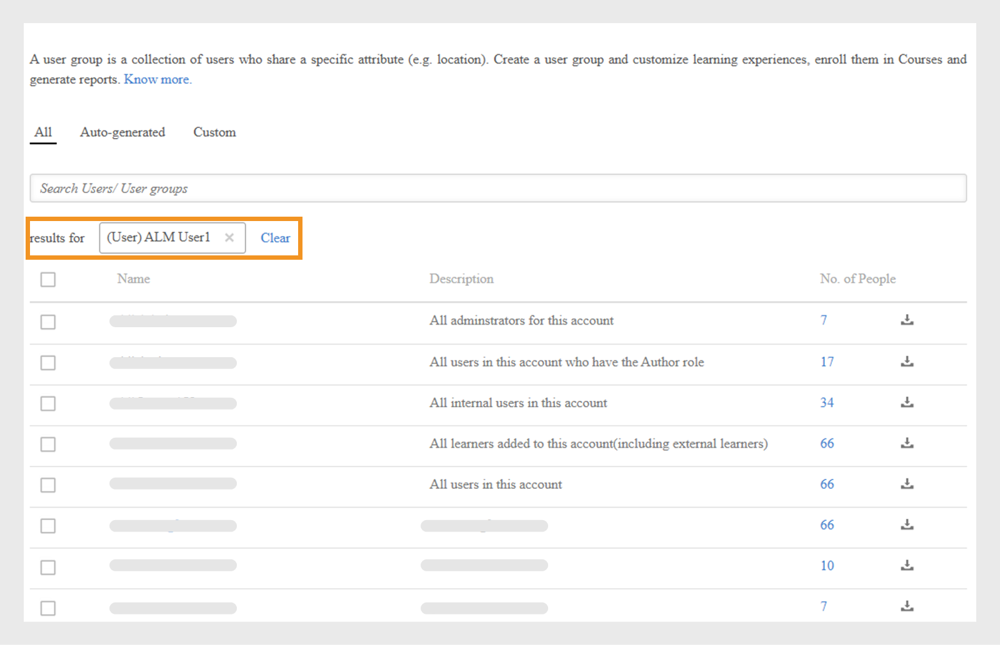
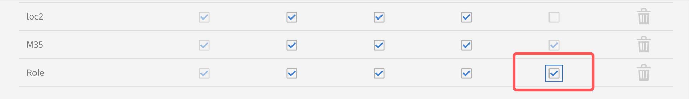

# Hinzufügen von Benutzern und Erstellen von Benutzergruppen

Erfahren Sie, wie Sie Benutzende oder Benutzendengruppen in der Learning Manager-Anwendung hinzufügen.

<!---->

## Verwalten von Benutzergruppen

>[!INFO]
>
>In dieser Schulung erfahren Sie, wie Sie eine Benutzergruppe anhand von Namen, E-Mail-IDs und dem Kombinieren mehrerer automatisch generierter Benutzergruppen erstellen.    

<!--[Launch training](https://learningmanager.adobe.com/app/learner?accountId=98632&sdid=QLD1P6BS&mv=display&mv2=display#/course/7555694)-->

<!--In this training, you will learn how to create a user group by names, email IDs, and combining multiple auto-generated user groups.-->

<!---->

Wenn Sie die Schulung nicht starten können, schreiben Sie an <almacademy@adobe.com>.

## Übersicht {#overview}

In Adobe Learning Manager können Sie die folgenden Rollen übernehmen:

* **Administrator:** Ein Administrator definiert die Trainingsstrategie für die Organisation. Ein Administrator kann Teilnehmer hinzufügen, nach Teilnehmern suchen, Kurse verwalten und zuweisen, Lernpläne, Zertifizierungen und Lernprogramme erstellen und Berichte für die gesamte Organisation verwalten.
* **Autor:** Autoren sind Unterrichts-Designer und Ersteller von Inhalten. Ein Autor kann Module und Kurse zu Learning Manager hinzufügen.
* **Manager:** Ein Manager verwaltet die Lernaktivitäten eines Teams. Ein Manager kann Teammitglieder für einen Kurs vorschlagen, Anforderungen von Teammitgliedern genehmigen und Feedback zur Leistung ihrer Teammitglieder nach Abschluss der Schulung geben. Manager können auch Berichte für ihr Team anzeigen, um ihre Leistung zu verfolgen.
* **Teilnehmer:** Teilnehmer können auf Kurse, Lernprogramme und ihnen zugewiesene Zertifizierungen zugreifen. Die Teilnehmer können auch alle verfügbaren Kurse mithilfe eines Katalogs durchsuchen und sich entweder für Kurse, Lernprogramme oder Zertifizierungen anmelden.

Als Administrator können Sie Benutzer auf drei Arten hinzufügen:

* interne
* Extern
* Benutzergruppen

## Einzelnen Benutzer hinzufügen {#addasingleuser}

Fügen Sie interne Teilnehmer mit einer Einzelbenutzeroption zum Adobe Learning Manager hinzu.

>[!INFO]
>
>In dieser Schulung erfahren Sie, wie Sie interne Teilnehmer zum Adobe Learning Manager hinzufügen.    

Wenn Sie die Schulung nicht starten können, schreiben Sie an <almacademy@adobe.com>.

Um Benutzer hinzuzufügen,

1. Melden Sie sich bei Adobe Learning Manager als Administrator an.
1. Klicken Sie auf der Startseite auf **[!UICONTROL Benutzer hinzufügen]**. Auf dieser Seite können Sie mit einer CSV einen einzelnen Benutzer oder mehrere Benutzer gleichzeitig hinzufügen. Sie können auch einen Selbstregistrierungslink für interne Mitarbeiter erstellen oder ein externes Lernprofil erstellen.
1. Um einen einzelnen Benutzer hinzuzufügen, klicken Sie oben rechts auf **[!UICONTROL Hinzufügen]** und wählen Sie die Option **[!UICONTROL Einzelner Benutzer]**.

1. Um einen einzelnen Benutzer hinzuzufügen, klicken Sie oben rechts auf **[!UICONTROL Hinzufügen]** und wählen Sie die Option **Einzelner Benutzer**.

   
   *Einen einzelnen internen Benutzer hinzufügen*

1. Geben Sie im Dialogfeld **[!UICONTROL Benutzer hinzufügen]** die Details des Teilnehmers ein. Wählen Sie für das Feld **[!UICONTROL Name des Managers]** den Namen eines vorhandenen Benutzers im System aus.

   
   *Dialogfeld &quot;Benutzer hinzufügen&quot;*

1. Um den neuen Benutzer in Learning Manager hinzuzufügen, klicken Sie auf **[!UICONTROL Hinzufügen]**. Nachdem der Benutzer hinzugefügt wurde, erhält der Benutzer eine Bestätigungs-E-Mail. Die Teilnehmenden aktivieren dann das Konto und verwenden Learning Manager. Dieser Arbeitsablauf ist hilfreich, wenn Sie eine begrenzte Anzahl von Teilnehmern zu Ihrem Learning Manager-Konto hinzufügen müssen. Wenn Sie jedoch vorhaben, alle Mitarbeiter einer großen Organisation einzuschreiben, können Sie sie in einem einzigen Versuch hinzufügen. Weitere Informationen finden Sie im folgenden Abschnitt:

## Hinzufügen von mehreren Benutzern gleichzeitig {#addusersinbulk}

### Verwalten von Benutzenden

In dieser Schulung erfahren Sie, wie Sie Rollen zuweisen und entfernen, eine Begrüßungs-E-Mail senden und Benutzer löschen und bereinigen.

Wenn Sie die Schulung nicht starten können, schreiben Sie an <almacademy@adobe.com>.

In der Regel arbeiten die meisten Organisationen mit einem HR-Management-System (HRMS), das alle Mitarbeiterdatensätze wie Bezeichnung, Standort, Beitrittsdatum oder Mitarbeiterhierarchie verwaltet. Sie können diese Daten in ein CSV-Format exportieren. Um einen Kurs zu erstellen, führen Sie die unten genannten Schritte aus:

1. Klicken Sie oben rechts auf **[!UICONTROL Hinzufügen]** und wählen Sie die Option **[!UICONTROL CSV hochladen]**.

   
   *CSV hochladen, um mehrere Benutzer gleichzeitig hinzuzufügen*

1. Die von Ihnen hochgeladene CSV besteht aus den folgenden Feldern:

   
   *Struktur der CSV-Datei*

   Sie müssen eine Master-CSV-Datei verwalten und alle Ergänzungen und Löschungen in der Master-CSV durchführen. Die heruntergeladene CSV-Datei enthält die folgenden Felder:

   * Name &#42;
   * E-Mail &#42;
   * profile
   * und vom Manager

   (&#42;) Pflichtfeld.

1. Nachdem Sie auf die Option **[!UICONTROL CSV hochladen]** geklickt haben, wird das folgende Dialogfeld angezeigt.

   
   *CSV-Dialogfeld hochladen*

1. Wählen Sie die CSV oder ziehen Sie die Datei per Drag &amp; Drop. Nachdem Sie die Datei ausgewählt haben, ordnen Sie die Datenfelder den Feldern in der CSV-Datei zu. Klicken Sie auf das gewünschte Dropdown-Menü und wählen Sie das richtige Feld aus.

   
   *Zuordnungsfelder in CSV*

1. Klicken Sie auf **[!UICONTROL Speichern]**, um den Import der Benutzer zu starten. Sie können eine Bestätigungsnachricht sehen.

   
   *Bestätigungsmeldung für erfolgreichen Upload der CSV-Datei*

1. Die neuen Benutzenden werden jetzt Ihrem Adobe Learning Manager-Konto hinzugefügt. Um die neuen Benutzer auszuwählen, aktivieren Sie das Kontrollkästchen neben den Namen, sodass alle ausgewählt sind.

   
   *Neue Benutzer hinzugefügt*

>[!NOTE]
>
>Weitere Informationen finden Sie in den häufig gestellten Fragen (FAQ) unter [Benutzer in großen Mengen hinzufügen](../add-users-in-bulk.md).

Nachdem Sie die Benutzer ausgewählt haben, können Sie Folgendes ausführen:

## Benutzer registrieren {#registerauser}

Klicken Sie bei ausgewähltem Benutzer oben rechts auf **[!UICONTROL Aktionen]** und dann auf **[!UICONTROL Registrieren]**.

Die ausgewählten Benutzer erhalten eine Begrüßungs-E-Mail. Wenn die Teilnehmer über eine vorhandene Adobe ID verfügen, können sie auf diesen Link klicken. Wenn sie keine Adobe ID haben, können sie auf den Begrüßungslink klicken, um eine Adobe ID zu erstellen und sie mit ihrem Learning Manager-Konto zu verknüpfen.

## Rolle zuweisen {#assignarole}

Wenn Sie nach dem Hinzufügen von Teilnehmenden zum Adobe Learning Manager-Konto ihre Rollen ändern möchten, klicken Sie oben rechts auf der Seite auf „Aktionen“. Wählen Sie die Option **[!UICONTROL Rolle zuweisen]**. Hier können Sie entscheiden, ob Sie dem Teilnehmer Autorenzugriff oder Administratorzugriff gewähren möchten. Nachdem Sie eine Rolle zugewiesen haben, hat dieser Teilnehmer Autorenzugriff auf das Konto und kann Module hinzufügen und Kurse erstellen.

*Rolle einem Benutzer zuweisen*

## Entfernen Sie eine Rolle {#removearole}

Sie können auch den Autor- oder Administratorzugriff für die Benutzer entfernen. Wählen Sie einen oder mehrere Teilnehmer, klicken Sie auf **[!UICONTROL Aktionen]**, und wählen Sie **[!UICONTROL Rolle entfernen]**. Wählen Sie eine Option aus, z. B. **[!UICONTROL Autor entfernen]**, und der Autorenzugriff wird für diesen Teilnehmer widerrufen.

>[!NOTE]
>
>Sie können niemandem im System manuell eine Manager-Rolle zuweisen. Sie erhalten automatisch Zugriff auf das Manager-Dashboard, wenn ihnen ein oder mehrere Mitarbeiter hinzugefügt werden.

## Benutzer löschen {#deleteauser}

Um einen Benutzer zu löschen, klicken Sie auf **[!UICONTROL Aktionen]** und wählen Sie **[!UICONTROL Benutzer löschen]**. Klicken Sie im Bestätigungsdialogfeld auf **[!UICONTROL Ja]** und der Teilnehmer wird gelöscht.

*Bestätigungsmeldung zum Löschen eines Benutzers*

## Benutzer bearbeiten {#editauser}

Wählen Sie in der Liste der Benutzer einen Benutzer aus und klicken Sie auf den Benutzer. Klicken Sie in den Benutzerdetails auf die Schaltfläche **[!UICONTROL Bearbeiten]** (). Nehmen Sie im Dialogfeld **[!UICONTROL Benutzer bearbeiten]** die notwendigen Änderungen vor und speichern Sie die Änderungen unter **[!UICONTROL Speichern]**.

*Dialogfeld &quot;Benutzer bearbeiten&quot;*

## Aktive Felder

&quot;Aktive Felder&quot; in Adobe Learning Manager sind anpassbare Metadatenfelder, die zum Speichern und Verwalten benutzerspezifischer Informationen verwendet werden. Mithilfe dieser Felder können Sie Schlüsselattribute oder -merkmale definieren, die mit den einzelnen Benutzern im System verknüpft sind.

### Benutzerattribute verwalten

>[!INFO]
>
>In dieser Schulung erfahren Sie, wie Sie aktive Felder hinzufügen, anpassen und konfigurieren.    

Wenn Sie die Schulung nicht starten können, schreiben Sie an <almacademy@adobe.com>.

Adobe Learning Manager behält die Groß- und Kleinschreibung des Benutzerattributs und seines Werts bei. **Die Groß-/Kleinschreibung eines Benutzerattributs ist z. B**. &quot;location&quot;, und sein Wert als &quot;PARIS&quot; wird beibehalten und auf die gleiche Weise angezeigt. Im Falle von Problemen kann der Administrator jetzt den Attributnamen und die Werte bearbeiten, um Fehler bei der Berücksichtigung der Groß-/Kleinschreibung zu korrigieren.

Der Administrator kann die **[!UICONTROL Admin-App]** > **[!UICONTROL Benutzer]** > **[!UICONTROL Benutzergruppen]** besuchen und auf den Gruppennamen klicken.

Ein Administrator kann zulässige Attributwerte für einen Teilnehmer über die Benutzeroberfläche hinzufügen und aktualisieren.

Typen aktiver Felder:

* Gruppierbar: Teilnehmer werden anhand der Werte gruppiert
* Berichtsfähig: Berichte für Benutzergruppen werden anhand der aktiven Felder erstellt
* Exportierbar: Die Felder werden im exportierten Benutzergruppenbericht angezeigt.

## Erstellen Sie einen Selbstregistrierungslink {#createaselfregistrationlink}

Sie können Mitarbeitenden in Ihrer Organisation auch die Möglichkeit geben, sich als Teilnehmende für Adobe Learning Manager Account zu registrieren, ohne Ihre Hilfe als Administrator in Anspruch zu nehmen. Der Administrator kann einen Link für die Selbstregistrierung erstellen und ihn für die Mitarbeiter freigeben, die sich mithilfe ihrer Adobe-Anmeldedaten weiter beim Learning Manager registrieren können.

Klicken Sie in der oberen rechten Ecke der Seite auf **[!UICONTROL Hinzufügen]**, und wählen Sie **[!UICONTROL Selbstregistrierung]** aus.

*Link zur Selbstregistrierung als Teilnehmer erstellen*

Das Dialogfeld **[!UICONTROL Selbstregistrierungsprofil hinzufügen]** wird angezeigt. Geben Sie diesem Profil einen Namen. Fügen Sie dann den Namen des Managers hinzu. Es ist wichtig zu wissen, dass der Manager bereits als Teilnehmer im Learning Manager registriert sein muss.

*Profil für Selbstregistrierung hinzufügen*

Nachdem Sie auf **[!UICONTROL Speichern ]** geklickt haben, wird eine URL generiert, die Sie den Teilnehmern zur Verfügung stellen können, damit diese auf die URL klicken und sich selbst registrieren können.

## Externe Teilnehmer registrieren {#enrollexternallearners}

In Adobe Learning Manager können Sie auch Registrierungslinks für externe Partner oder Agenturen mit eingeschränktem Zugriff auf Ihr Konto erstellen und ihnen Lernmaterial bereitstellen.

Es gibt einige Unterschiede zwischen internen und externen Registrierungen.

<table>
 <tbody>
  <tr>
   <td>
    
<b>Interne Benutzer</b>
</td>
   <td>
    
<b>Externe Benutzer</b>
</td>
  </tr>
  <tr>
   <td>
    
Melden Sie sich mit der Adobe ID oder SSO-Anmeldeinformationen an.
</td>
   <td>
    
Melden Sie sich mit einer beliebigen E-Mail-ID an.
</td>
  </tr>
  <tr>
   <td>
    
Gamification ist verfügbar.
</td>
   <td>
    
Gamification ist verfügbar. Der Administrator muss Gamification für externe Teilnehmer in den Gamification-Einstellungen aktivieren.
</td>
  </tr>
  <tr>
   <td>
    
Teilnehmerhierarchien sind verfügbar.
</td>
   <td>
    
Teilnehmerhierarchien sind nicht verfügbar.
</td>
  </tr>
 </tbody>
</table>

Führen Sie die folgenden Schritte aus, um externe Benutzer zu registrieren:

1. Klicken Sie im linken Navigationsbereich auf **[!UICONTROL Extern]**.

   

   *Externe Benutzer registrieren*

1. Klicken Sie in der rechten oberen Ecke der Seite auf **[!UICONTROL Hinzufügen]**.

1. Fügen Sie im Dialogfeld **Externes Registrierungsprofil hinzufügen** die folgenden Details hinzu:

   * Der Profilname der Partnerorganisation.
   * Die E-Mail-Adresse des Managers der Partnerorganisation.
   * Maximale Anzahl Lizenzen für die externe Registrierung für diesen Partner.
   * Ablaufdatum, um eine Frist festzulegen, nach der keine neuen Registrierungen für diese Gruppe mehr zulässig sind. Nach dem Ablaufdatum können nur die bereits registrierten Benutzer auf diese Schulung zugreifen.

   

   *Dialogfeld &quot;Externes Registrierungsprofil hinzufügen&quot;*

   * Geben Sie im Abschnitt **[!UICONTROL Erweiterte Einstellungen]** Folgendes ein:

      * **[!UICONTROL Anmeldeanforderung]:** Geben Sie einen Wert in Tagen an. Teilnehmer werden gelöscht, wenn sie sich für den oben genannten Zeitraum nicht anmelden.
      * **[!UICONTROL Zulässige Domänen]:** Eine durch Kommas getrennte Liste von Domänennamen in der Positivliste.
      * **[!UICONTROL E-Mail-Verifizierung erforderlich]:** Wählen Sie diese Option aus, um die E-Mail-Verifizierung für einen Teilnehmer als obligatorisch festzulegen.

   

   *Geben Sie die Details im Abschnitt &quot;Erweiterte Einstellungen&quot; ein*

1. Nachdem Sie auf **[!UICONTROL Speichern ]** geklickt haben, wird die folgende Bestätigungsmeldung angezeigt. Sie müssen die URL mit Ihrem externen Partner teilen.

   

## Aktivieren Sie ein externes Profil {#enableanexternalprofile}

Nachdem ein externes Profil erstellt wurde, müssen Sie dessen Status aktivieren. Wählen Sie aus der Liste der externen Profile das gewünschte Profil aus und wechseln Sie die Statusschaltfläche.

*Aktivieren eines externen Profils*

Dadurch wird der Link „Externe Registrierung“ aktiviert. Eine Willkommens-E-Mail wird automatisch an den Partner gesendet. Sie können den Link auch kopieren und mit ihnen teilen, indem Sie auf das Symbol URL kopieren () klicken, oder Sie können die Begrüßungs-E-Mail erneut an die Partnerorganisation senden, indem Sie auf das Mail-Symbol () klicken.

Der Partner-Manager kann den Link mit den Mitarbeitern teilen, die die Schulung in PrLearning Manager absolvieren müssen. Wenn sie auf den Link klicken, können sie sich selbst registrieren, nachdem sie einige Details ausgefüllt haben, um ihr Profil auf Learning Manager zu erstellen. Diese Benutzer werden nicht zusammen mit den internen Mitarbeitern auf der Registerkarte „Teilnehmer“ angezeigt. Sie können ihre Namen auf der Registerkarte **[!UICONTROL Externe Teilnehmer]** sehen.

## Halten Sie ein externes Profil an {#pause}

Nachdem Sie dem Lern-Manager eine externe Benutzergruppe hinzugefügt haben, können Sie auch den Registrierungsprozess der externen Benutzer anhalten. Wenn Sie die Wiedergabe anhalten, wird der Registrierungsprozess für externe Benutzer blockiert. Allerdings funktioniert dieses Vorgangs nur dann, wenn sich die Benutzer noch nicht registriert und die Einladung akzeptiert haben.

Um die externen Benutzergruppen anzuhalten, wählen Sie eine Gruppe oder Gruppen, klicken Sie auf **[!UICONTROL Aktionen]** in der oberen rechten Ecke der Seite und wählen Sie **[!UICONTROL Anhalten]**.

## Setzen Sie ein externes Profil fort {#resumeanexternalprofile}

Sie können jederzeit den angehaltenen Status eines externen Partners widerrufen und die normalen Dienste wieder aufnehmen. Klicken Sie auf **[!UICONTROL Aktionen]** in der oberen rechten Ecke der Seite und wählen Sie **[!UICONTROL Fortsetzen]**.

Die folgenden Status für externe Benutzer gelten: 

* **Inaktiver Status** - In diesem Status ist die Registrierung der externen Benutzer abgelaufen. Administratoren legen das Ablaufdatum für externe Benutzer fest und fügen sie über den Arbeitsablauf „Benutzer hinzufügen“ hinzu.
* **Aktiver Status** In diesem Status können sich die externen Benutzenden bei der Learning Manager-Anwendung registrieren und sich außerdem bei der Anwendung anmelden.
* **Anhalten** - In diesem Status ist der Registrierungsprozess für externe Benutzer gesperrt. Die vorhandenen Benutzer können sich aber weiterhin anmelden.

## Überprüfen Sie die benutzten Lizenzen {#checkusedseats}

Klicken Sie in der Liste der externen Profile auf **[!UICONTROL Verwendete Lizenzen]**. Sie können die Anzahl der hinzugefügten Teilnehmer in der Partnerorganisation anzeigen.

*Verwendete Lizenzen überprüfen*

## Benutzer löschen {#Deleteauser-1}

Wählen Sie einen Benutzer aus und klicken Sie in der oberen rechten Ecke auf **[!UICONTROL Aktionen]** > **[!UICONTROL Benutzer löschen]**.

## Profil ändern {#changeprofile}

Um einen Benutzer in ein anderes externes Profil zu verschieben, wählen Sie einen Benutzer in der oberen rechten Ecke aus und klicken Sie auf **[!UICONTROL Aktionen]** > **[!UICONTROL Profil ändern]**. Wählen Sie aus der Liste der Profile ein Profil aus und klicken Sie auf **[!UICONTROL Ändern]**.

## Rolle zuweisen {#Assignarole-1}

Wählen Sie einen Benutzer aus und klicken Sie in der oberen rechten Ecke auf **[!UICONTROL Aktionen]** > **[!UICONTROL Rolle zuweisen]** > **Erstellen`<role>`**. Der Benutzer erhält eine neue Rolle.

## Entfernen Sie eine Rolle {#Removearole-1}

Wählen Sie einen Benutzer aus und klicken Sie in der oberen rechten Ecke auf **[!UICONTROL Aktionen]** > **[!UICONTROL Rolle entfernen]** > **`<role>`** entfernen. Die ausgewählte Rolle wird aus der Liste der Rollen entfernt, die dem Benutzer zugewiesen wurden.

>[!NOTE]
>
>Das Zuweisen einer neuen Rolle wirkt sich nicht auf benutzerdefinierte Benutzergruppen aus. Dies wirkt sich jedoch auf automatisch generierte Benutzergruppen wie &quot;Alle Administratoren&quot;, &quot;Alle Autoren&quot; und ähnliche rollenbasierte Gruppen aus.

## Benutzergruppen erstellen {#createusergroups}

Eine Benutzergruppe ist eine Gruppe von Benutzern, die einer Kategorie zugeordnet sind. Mithilfe von Benutzergruppen können Administratoren Teilnehmer in ihrer Organisation anhand ihrer Attribute auswählen und ihnen dann Lerninhalte zuweisen. Diese Benutzergruppen helfen den Administratoren auch dabei, Teilnehmern benutzerdefinierte Logos und Kataloge zuzuweisen und benutzerdefinierte Berichte zu deren Fortschritten anzuzeigen.

Um auf Benutzergruppen zuzugreifen, klicken Sie im linken Navigationsbereich auf **[!UICONTROL Benutzergruppen]**.

*Benutzergruppen erstellen*

In Adobe Learning Manager gibt es zwei Arten von Gruppen: Benutzerdefiniert und automatisch generiert. Wenn Sie Ihrem Konto Teilnehmer hinzufügen, werden einige Gruppen automatisch anhand ihrer gemeinsamen Eigenschaften erstellt.

Um die automatisch erstellten Gruppen anzuzeigen, klicken Sie auf die Registerkarte **[!UICONTROL Automatisch generiert]**.

*Automatisch generierte Gruppen anzeigen*

Sie können sehen, dass es verschiedene Gruppen gibt, z. B. Alle internen Benutzer, Alle Manager, Gruppen basierend auf der Kostenstelle, basierend auf der Abteilung und basierend auf den Teams der Manager.

Zusätzlich zu automatisch generierten Gruppen können Sie benutzerdefinierte Gruppen erstellen. Um eine neue benutzerdefinierte Gruppe hinzuzufügen, klicken Sie in der oberen rechten Ecke auf **[!UICONTROL Hinzufügen]**.

1. Geben Sie den Namen und die Beschreibung der Gruppe ein.
1. Geben Sie den Benutzernamen oder das Profil in das Textfeld ein und wählen Sie ihn aus der Dropdown-Liste aus, die während des Tippens erscheint, um einen Benutzer hinzuzufügen.

1. Um weitere Teilnehmer hinzuzufügen, klicken Sie auf **[!UICONTROL Weitere Benutzer hinzufügen]**.

1. Klicken Sie zum Erstellen der Benutzergruppe auf **[!UICONTROL Speichern]**.

Diese benutzerdefinierte Gruppe wird nun erstellt und dem Profil hinzugefügt. Die von Ihnen erstellten Benutzergruppen sind dynamischer Natur. Wenn neue Benutzer mit ähnlichen Attributen hinzugefügt werden, werden sie automatisch der Benutzergruppe hinzugefügt.

Um die Liste der Gruppen anzuzeigen, zu denen ein Benutzer gehört, navigieren Sie zu **[!UICONTROL Benutzer]** > **[!UICONTROL Benutzergruppen]**, suchen Sie nach dem Benutzernamen und wählen Sie ihn aus. Dadurch werden alle Gruppen angezeigt, denen der Benutzer angehört.

### Herunterladen der Liste der Benutzer in einer Benutzergruppe

Um die Liste der Benutzer in einer bestimmten Benutzergruppe herunterzuladen, navigieren Sie zu **[!UICONTROL Benutzer]** > **[!UICONTROL Benutzergruppen]**, wählen Sie das **[!UICONTROL Downloadsymbol]** neben der Gruppe aus. Dadurch wird eine CSV-Datei generiert, die die Liste der Benutzer in dieser Gruppe enthält.

## Ausschluss von Benutzergruppen

Es kann vorkommen, dass Sie eine kleine Benutzergruppe aus einer großen Benutzergruppe ausschließen möchten. Dies ist erforderlich, um diese bestimmte Benutzergruppe für Schulungen über Lernpläne zu registrieren oder um die richtige Sichtbarkeit von Katalogen einzurichten. In dieser Version des Lern-Managers können Sie Teilnehmer oder Benutzergruppen ausschließen, wenn Sie eine benutzerdefinierte Benutzergruppe erstellen. Im Dialogfeld „Benutzergruppe hinzufügen“ können Sie dies im Abschnitt „Teilnehmer ausschließen“ tun.

*Benutzergruppen ausschließen*

Wenn Sie z. B. einen Lernplan erstellen möchten, bei dem alle Benutzer mit dem Attribut „Ort“ und dem Feldwert „Kalifornien“ registriert werden, mit Ausnahme von „Store-5“ (ebenfalls in Kalifornien).

## Erweiterte Einstellungen {#advancedsettings}

### Datenquellen {#datasources}

Sie können diese Funktion verwenden, wenn Sie die Benutzer oder Lerndaten aus der Datenbank Ihres Unternehmens in die Learning Manager-Anwendung importieren/synchronisieren möchten. Sie können außerdem die Häufigkeit der Synchronisierung einrichten.

Klicken Sie im linken Bereich unter dem Abschnitt **[!UICONTROL Advanced]** auf **[!UICONTROL Datenquellen]**.

*Datenquellen zum Importieren oder Synchronisieren von Benutzern*

Wählen Sie den Datenquellentyp aus dem Dropdown-Menü **[!UICONTROL Quelle]** aus, wählen Sie die Aktualisierungsfrequenz aus, und klicken Sie auf **[!UICONTROL Jetzt synchronisieren]**, wenn Sie sofort synchronisieren müssen, oder klicken Sie auf **[!UICONTROL Speichern].** Datenquellentypen sind SFDC, FTP usw. für interne Benutzer.

Sie können mehrere Datenquellen hinzufügen.

### Aktive Felder {#activefields}

Mit dieser Funktion können Administratoren weitere aktive Felder hinzufügen, zusätzlich zu dem, was bei der Benutzerregistrierung bereitgestellt wurde.

Klicken Sie auf **[!UICONTROL Aktive Felder]**, die auf der Benutzerseite verfügbar sind. Teilnehmer können nur aus den Werten wählen, die in benutzerdefinierten Werten angegeben sind.

*Aktive Felder*

### Felder konfigurieren {#configurefields}

**Interne Benutzer**

Sie können benutzerdefinierte Werte für Benutzerfelder für interne Benutzer hinzufügen.

Führen Sie die folgenden Schritte aus, um benutzerdefinierte Werte hinzuzufügen:

1. Klicken Sie auf **[!UICONTROL Werte ändern]** für einen internen Benutzer.

   
   *Werte für interne Benutzer ändern*

1. Das Dialogfeld &quot;**Werte in benutzerdefiniertem Feld &quot;**&quot; wird angezeigt.

   
   *Werte im Dialogfeld &quot;Benutzerdefinierte Felder&quot;*

1. Wählen Sie den hinzuzufügenden Wert aus der Dropdown-Liste **[!UICONTROL Ausgewähltes Feld]**.
1. Geben Sie neue Werte in das Feld **[!UICONTROL Neuer Wert]** ein.
1. Klicken Sie auf **[!UICONTROL Fertig]**.
1. Klicken Sie in der oberen rechten Ecke auf **[!UICONTROL Speichern]**, um die Änderungen zu speichern.

**Externe Benutzer**

Fügen Sie benutzerdefinierte Werte hinzu, die denen für interne Benutzer ähneln.

*Werte für externe Benutzer ändern*

### Einstellungen {#settings}

**Benutzeranzeige**

Wenn die Option **Nur nicht ausgefüllte Felder bei der Teilnehmeranmeldung anzeigen** aktiviert ist, sieht ein Benutzer die leeren Felder nur bei der Anmeldung.

*Nicht ausgefüllte Felder anzeigen*

Mit dieser Option kann ein Administrator entscheiden, ob er die Felder anzeigen oder ausblenden möchte, sobald diese ausgefüllt wurden.

## Beschränken Sie aktive Felder in Berichten {#restrictactivefields}

Learning Manager 27.7 führt zwei neue Optionen **[!UICONTROL für aktive Felder ein: Berichtbar]** und **[!UICONTROL Exportierbar]**.

*Optionen in aktiven Feldern*

Wenn für CSV-Felder und manuell hinzugefügte Felder ein aktives Feld als **[!UICONTROL Bericht]** markiert ist, kann das aktive Feld in einem Filter in einem Dashboard-Bericht gesucht werden.

*Filter in einem Dashboard-Bericht*

Wenn ein aktives Feld als **[!UICONTROL Exportfähig]** markiert ist, wird das aktive Feld in der Excel-Datei angezeigt, wenn ein Excel-Bericht heruntergeladen wird.

Diese Optionen werden sowohl für interne als auch für externe aktive Felder angezeigt.

Sie können nur ein benutzerdefiniertes aktives Feld löschen.

## Benutzeranzeige

Sie können die gesamte Seite &quot;Profil abschließen&quot; für die Teilnehmer ausblenden. Die Seite wird nicht mehr angezeigt, sobald sich der Teilnehmer anmeldet.

Beachten Sie, dass sich das vorhandene Standardverhalten nicht ändert. Dies ist eine optionale Funktion, die Administratoren jetzt zur Verfügung steht.

Aktivieren Sie die folgenden Optionen:

*Benutzeranzeigeabschnitt*

## Unterstützung manueller CSV-Felder durch FTP- und Box-Connectors {#import-connector}

Häufig möchten Benutzer, dass aktive Felder manuell bereitgestellt werden, wenn sich ein Teilnehmer beim Lernmanager anmeldet. Dies ist derzeit im Learning Manager möglich, wenn der Benutzer eine CSV-Datei manuell importiert.

Die CSV-Datei enthält möglicherweise nicht alle aktiven Felder. Für alle aktiven Felder, die nicht in der hochgeladenen CSV-Datei aktualisiert werden, muss der Benutzer die Daten für diese aktiven Felder eingeben.

Derzeit müssen alle aktiven Felder einem Feld aus der Quell-CSV zugeordnet werden.

Es kommt vor, dass ein Benutzer manchmal ein aktives Feld nicht einem in der CSV angegebenen Feld zuordnen möchte. In solchen Fällen kann der Benutzer das Feld &quot;Aktiv&quot; dem Wert **[!UICONTROL &quot;DontImportFromSource&quot;]** zuordnen. Wählen Sie diesen Wert aus der Dropdown-Liste aus, wenn Sie Benutzer aus FTP- und Box-Connectors importieren.

## Benutzerdefinierte Rollen {#customroles}

Fügen Sie ein beliebiges Feld als Teil Ihrer Benutzerinformationen hinzu und klicken Sie auf **[!UICONTROL Speichern]**. Nach dem Hinzufügen der Felder können Sie auch die Verfügbarkeit der Felder im Dialogfeld &quot;**[!UICONTROL Benutzer bearbeiten]**&quot; überprüfen.

Nachdem Sie die Felder hinzugefügt haben, können Sie feststellen, dass die Felder, die mit einem Häkchen markiert sind, aus der Datenquelle oder CSV stammen, wie in der Momentaufnahme unten gezeigt. Der Administrator kann diese Felder bearbeiten, indem er die Felder aktiviert bzw. deaktiviert.

**Werte für aktive Felder im Learning Manager**

Die Werte für aktive Felder werden wie folgt abgerufen:

1. Die Learning Manager-Anwendung importiert Metadaten aus Datenquellen, die mit Ihrem Konto verbunden sind.
1. Metadaten, die von den manuell importierten CSV-Datei erfasst wurden.
1. Teilnehmer füllen Metadaten auf, wenn sie sich anmelden.
1. Administrator gibt Daten für Benutzer ein.

>[!NOTE]
>
>Learning Manager-Anwendung erstellt Benutzergruppen automatisch aus diesen Metadaten.

**Benutzerdefinierten Wert hinzufügen**

Sie können benutzerdefinierte Werte für Benutzerfelder in den internen und externen Benutzerfeldern hinzufügen.

Führen Sie die folgenden Schritte aus, um benutzerdefinierte Werte hinzuzufügen:

Benutzerdefinierte Felder können hinzugefügt und gelöscht werden und sind auf alle Benutzer anwendbar. CSV-Felder können aktiviert oder deaktiviert werden und werden nur gültig, wenn Sie CSV hochladen, nachdem die Änderungen in den aktiven Feldern vorgenommen wurden. Alle interne aktive Felder sind für alle Typen von internen Benutzern anwendbar. Externe Felder sind nur für externe Benutzer anwendbar. Wenn ein benutzerdefiniertes Feld in CSV vorhanden ist, wird es beim nächsten Upload automatisch in ein CSV-Feld konvertiert und aktiviert.

## Werte für CSV-Felder {#valuesforcsvfields}

Benutzer können nur aus vordefinierten Feldern für CSV-Felder auswählen, wenn das Kontrollkästchen **[!UICONTROL Auswahl einschränken]** aktiviert ist.

*Kontrollkästchen &quot;Auswahl einschränken&quot;*

## Protokolle importieren {#importlogs}

In diesem Bereich können Sie den CSV-Importverlauf für die Benutzer, die der Administrator als Massen-Import hinzugefügt hat, anzeigen. Sie können auch auf **[!UICONTROL Hinzufügen]** in der oberen rechten Ecke der Seite klicken, um Benutzer mithilfe der CSV-Upload-Funktion hinzuzufügen.

## Aktive Felder mit mehreren Werten

Mit dieser Funktion können Sie mehrere Felder als aktives Feld verwenden. In einem Konto können maximal drei mehrwertige aktive Felder vorhanden sein. Die mehrwertigen aktiven Felder sind sowohl für externe als auch für interne Benutzende verfügbar.

Nachdem Sie ein aktives Feld als mehrwertig markiert haben, können Sie es nicht mehr als einzelwertig zurückkonvertieren. Das ist unumkehrbar.

Ein vorhandenes Einzelwertfeld kann nicht als mehrwertiges Feld markiert werden.

Führen Sie die folgenden Schritte aus, um ein aktives mehrwertiges Feld zu erstellen:

1. Fügen Sie ein aktives Feld hinzu.

   
   *Aktives Feld hinzufügen*

1. Klicken Sie auf „Hinzufügen“.
1. Markieren Sie auf der Registerkarte Einstellungen das neue Feld als mehrwertig.

   
   *Als mehrwertig markieren*

   Es gibt ein weiteres Kontrollkästchen, **[!UICONTROL Teilnehmer konfigurierbar]**. Wenn es deaktiviert ist, kann der Teilnehmer das Feld nicht auf der Profilseite sehen.

1. Fügen Sie die Werte mithilfe einer CSV-Datei oder durch Klicken auf &quot;Werte ändern&quot; hinzu.

   
   *Hinzufügen von Werten*

1. Klicken Sie auf [!UICONTROL **Fertig**].

>[!NOTE]
>
>Sobald die Benutzergruppe erstellt und das Feld ausgefüllt ist, können Mehrfachwerte nicht mehr in Einzelwerte umgewandelt werden und umgekehrt.

### Aktives Feld mit mehreren Werten über CSV hinzufügen

Führen Sie die unten genannten Schritte aus:

1. Erstellen Sie eine CSV-Datei mit den neuen aktiven Feldern als Spalten (durch Kommas getrennte oder einzelne Werte).
1. Importieren Sie die CSV-Datei.
1. Markieren Sie die Felder im Dialogfeld &quot;Werte in benutzerdefinierten Feldern&quot; als mehrwertig.
1. Importieren Sie die CSV-Datei erneut.

Die CSV-Datei muss eine Spalte mit demselben Namen wie das aktive Feld enthalten, das als mehrwertig gekennzeichnet wurde.

Die CSV-Datei enthält die folgenden Felder:

* **[!UICONTROL Benutzer]**: Als Rollen erstellte Benutzergruppen.
* **[!UICONTROL Rollen]**: Aktives Feld mit mehreren Werten mit Werten.

Wenn die CSV-Datei erneut mit neuen Werten oder gelöschten Werten hochgeladen wird, werden auch die aktiven Felder und Gruppen entsprechend aktualisiert.

### Berichte

Alle Berichte enthalten die mehrwertigen aktiven Felder und ihre Werte.

Der Administrator kann automatisch generierte aktive Felder hinzufügen und Benutzeraktivitäten und Schulungsberichte konfigurieren.

Der Teilnehmertranskriptbericht enthält alle aktiven Felder und durch Kommas getrennte Werte. Der Administrator kann die Daten dann entsprechend filtern.

## Bericht der Benutzergruppe

Der neue Benutzergruppenbericht von Adobe Learning Manager unterstützt die Verwaltung von Benutzergruppen, indem er Einblick in Gruppen bietet, die nicht verwaltet wurden, als Administratoren das Unternehmen verließen. Administratoren können auf die Berichte im **[!UICONTROL Abschnitt Benutzer]** > **[!UICONTROL Benutzergruppe]** zugreifen. Es enthält detaillierte Informationen zu jeder Gruppe, einschließlich:

* Benutzergruppentyp
* Gruppenname
* Beschreibung
* Erstellt von (Name)
* Erstellt von (E-Mail)
* Erstellt am (UTC-Zeitzone)
* Anzahl der Benutzer

Führen Sie die folgenden Schritte aus, um den Bericht herunterzuladen:

1. Melden Sie sich als **[!UICONTROL Administrator]** an.
2. Wählen Sie **[!UICONTROL Benutzer]** > **[!UICONTROL Benutzergruppe]**.
3. Wählen Sie **[!UICONTROL Aktionen]** > **[!UICONTROL Benutzergruppenbericht herunterladen]**.

_Benutzergruppenbericht herunterladen_

## Häufig gestellte Fragen {#faq}

+++Wie registriere ich Benutzer im Learning Manager?

Nachdem Sie einen Benutzer hinzugefügt und dem Benutzer eine Rolle zugewiesen haben, können Sie den Benutzer registrieren, indem Sie die folgenden Schritte ausführen:

1. Klicken Sie bei ausgewähltem Benutzer in der oberen rechten Ecke auf **[!UICONTROL Aktionen]** und dann auf **[!UICONTROL Registrieren]**.

1. Klicken Sie im Popup-Fenster auf **[!UICONTROL Ja]**.

Die ausgewählten Benutzer erhalten eine Begrüßungs-E-Mail. Wenn die Teilnehmer über eine vorhandene Adobe ID verfügen, können sie auf diesen Link klicken. Wenn sie keine Adobe ID haben, können sie auf den Begrüßungslink klicken, um eine Adobe ID zu erstellen und sie mit ihrem Learning Manager-Konto zu verknüpfen.

Das Klicken auf einen dieser Links in der E-Mail ist für die Teilnehmer obligatorisch, da es dem Lern-Manager hilft, das Konto des Teilnehmers zu überprüfen.

+++

+++Benutzerdaten bearbeiten

Um Benutzer zu bearbeiten, gehen Sie wie folgt vor:

1. Klicken Sie in der Liste der Benutzer auf den Benutzer, für den Sie die Daten bearbeiten möchten.
1. Klicken Sie auf das Stiftsymbol.

Aktualisieren Sie im Dialogfeld **Benutzer bearbeiten** die Felder entsprechend. Um die Änderungen zu speichern, klicken Sie auf **[!UICONTROL Speichern]**.

+++

+++Wie kann ich einen externen Benutzer im Learning Manager anhalten und fortsetzen?

Wählen Sie in der Liste der externen Benutzer den Benutzer aus, den Sie löschen möchten. Klicken Sie in der oberen rechten Ecke auf **[!UICONTROL Aktionen]** > **[!UICONTROL Pause]**.

Weitere Informationen finden Sie unter [Halten Sie ein externes Profil an](add-users-user-groups.md#pause).

Nachdem Sie ein Profil angehalten haben, wird für das externe Profil der Status ***Angehalten*** angezeigt.

+++

+++Wie sende ich eine Begrüßungs-E-Mail an ein neu erstelltes externes Profil?

Geben Sie beim Hinzufügen eines externen Benutzers im Dialogfeld &quot;**[!UICONTROL Externes Registrierungsprofil hinzufügen]**&quot; die E-Mail des externen Managers ein. Wenn Sie auf „Speichern“ klicken, wird auch eine Willkommens-E-Mail an die von Ihnen angegebene E-Mail-Adresse gesendet. Wenn Sie die Willkommens-E-Mail erneut senden möchten, klicken Sie auf das Briefumschlag-Symbol, wie unten gezeigt:

+++

+++Wie kann ich benutzerdefinierte Benutzergruppen erstellen?

Klicken Sie auf **[!UICONTROL Benutzer]** > **[!UICONTROL Benutzergruppen]** und klicken Sie auf der Seite Benutzergruppen auf **[!UICONTROL Hinzufügen]**. Fügen Sie im Dialogfeld &quot;Benutzergruppe hinzufügen&quot; die Benutzer sowohl einzeln als auch als Team hinzu.

+++

+++Wie kann ich bereits ausgefüllte aktive Felder deaktivieren?

Wenn Sie möchten, dass Teilnehmer nur die aktiven, nicht von ihnen ausgefüllten Felder sehen können, führen Sie die folgenden Schritte aus:

1. Klicken Sie auf **[!UICONTROL Benutzer]** > **[!UICONTROL Aktive Felder]**.

1. Klicken Sie auf **[!UICONTROL Einstellungen]** und aktivieren Sie die Option **[!UICONTROL Nur nicht ausgefüllte Felder bei der Teilnehmeranmeldung anzeigen]**.

1. Klicken Sie auf **[!UICONTROL Speichern]**.

+++

+++Wie kann ich verhindern, dass Teilnehmer zufällige Werte in die aktiven Felder eingeben?

Sie können die Auswahl für Teilnehmer einschränken, sodass sie nur die vordefinierten Werte auswählen und keine willkürlichen Werte eingeben können. Führen Sie die unten genannten Schritte aus:

1. Klicken Sie auf **[!UICONTROL Benutzer]** > **[!UICONTROL Aktive Felder]**.
1. Aktivieren Sie die Option **[!UICONTROL Auswahl einschränken]**.
1. Klicken Sie auf **[!UICONTROL Fertig]**.

+++

+++Wie kann ich zwischen aktiven CSV-Feldern und benutzerdefinierten aktiven Feldern unterscheiden?

Sie können CSV-aktive Felder nur aktivieren oder deaktivieren, nicht jedoch löschen. Ebenfalls können Sie benutzerdefinierte aktive Felder nicht aktivieren oder deaktivieren.

+++
