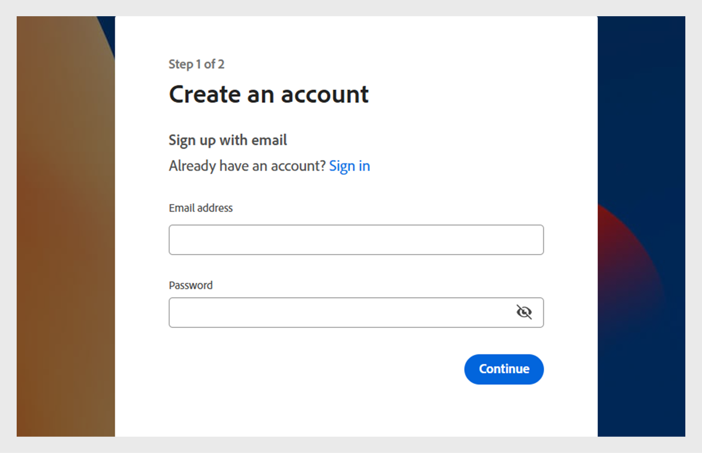

# Hinzufügen von Benutzern in Adobe Learning Manager

In Adobe Learning Manager sind Benutzer Teilnehmer, die die Plattform zum Lernen oder für Schulungen verwenden. Es gibt zwei Arten von Benutzern: interne und externe Benutzer.

Interne Benutzer sind Mitarbeiter oder Teammitglieder aus Ihrer Organisation.

Externe Benutzer sind Teilnehmer außerhalb Ihres Unternehmens, z. B. Kunden, Partner, Anbieter oder Kunden, die auf Ihre Lerninhalte zugreifen können.

Mit Adobe Learning Manager (ALM) können Administratoren interne und externe Benutzer mit verschiedenen Methoden integrieren und verwalten, einschließlich manueller Eingabe, CSV-Upload, Selbstregistrierung und Systemintegrationen.

## Interne Benutzer

Interne Benutzer in Adobe Learning Manager beziehen sich auf Mitarbeiter oder Teammitglieder in Ihrem Unternehmen. Sie können sie manuell hinzufügen, gesammelt hochladen oder über Systemintegrationen importieren. Nachdem Sie diese Benutzer hinzugefügt haben, können Sie sie in Gruppen organisieren, Kurse zuweisen und ihren Lernfortschritt überwachen.

Die Benutzer in Adobe Learning Manager können je nach zugewiesenen Rollen unterschiedliche Aufgaben übernehmen und verschiedene Aufgaben verwalten. Jede Rolle, einschließlich Administrator, Autor, Kursleiter und Integrationsadministrator, bietet eine Reihe spezifischer Funktionen, die auf die Verantwortlichkeiten des Benutzers innerhalb der Plattform zugeschnitten sind.

### Methoden zum Hinzufügen interner Benutzer

Administratoren können interne Benutzer mit den folgenden Methoden hinzufügen:

* **Einen einzelnen Benutzer hinzufügen**: Fügen Sie manuell jeweils einen Benutzer hinzu.
* **Selbstregistrierungsprofil**: Ermöglichen Sie Teilnehmern, sich selbst als Teilnehmer in Adobe Learning Manager zu registrieren, indem Sie einen vom Administrator erstellten Registrierungslink verwenden.
* **Massen-Upload über CSV**: Laden Sie eine CSV-Datei hoch, um mehrere Benutzer gleichzeitig hinzuzufügen.

### Internen Benutzer manuell hinzufügen

Administratoren können Benutzer manuell hinzufügen, indem sie ihren Namen, ihre E-Mail-Adresse, ihre eindeutige Kennung und den Namen des Managers angeben. Der eindeutige Bezeichner in der Adobe Learning Manager ist ein erforderlicher Bezeichner, den Administratoren beim Erstellen eines Benutzers zuweisen. Es muss für jeden Benutzer eindeutig sein und als einheitliche Referenz im gesamten System dienen.

>[!INFO]
>
>In dieser Schulung der ALM Academy erfahren Sie, wie Sie Einzelbenutzer zu Adobe Learning Manager hinzufügen.  

So fügen Sie Adobe Learning Manager einen einzelnen Benutzer hinzu:

1. Melden Sie sich als Administrator an.
2. Wählen Sie **Benutzer** und anschließend **Intern**.
3. Wählen Sie **Hinzufügen** und anschließend **Einzelbenutzer** aus.

   
   _Administratoroberfläche, die die Option zum manuellen Hinzufügen eines einzelnen internen Benutzers anzeigt_
4. Geben Sie an der Eingabeaufforderung **Benutzer hinzufügen** den **Namen**, **E-Mail** und **Profil** (Jobtitel) des Benutzers ein.

   
   _Felder zum Eingeben des Namens, der E-Mail-Adresse, des eindeutigen Bezeichners und des Profils für einen neuen Benutzer_
5. Suchen Sie nach dem Manager des Benutzers und wählen Sie den Namen aus der Liste der Manager aus.
6. Wählen Sie **Hinzufügen** aus.
Der Benutzer erhält eine Begrüßungs-E-Mail mit einer Anmelde-URL für den Zugriff.

### Selbstregistrierung für interne Benutzer zulassen

Die Selbstregistrierung ist ein Self-Service-Onboarding-Prozess, bei dem Benutzer eine Registrierungs-URL aufrufen, ihre Daten eingeben und sich automatisch für die Plattform registrieren können. Diese Methode minimiert den administrativen Aufwand, indem sie es Benutzern ermöglicht, sich über die bereitgestellte URL zu registrieren.

So erstellen Sie eine URL für die Selbstregistrierung eines Benutzers:

1. Melden Sie sich als Administrator an.
2. Wählen Sie **Benutzer** und anschließend **Intern**.
3. Wählen Sie **Hinzufügen** aus, und wählen Sie dann **Selbstregistrierung.**

   
   _Dropdown-Menü zum Auswählen der Selbstregistrierungsoption_
4. Geben Sie in der Eingabeaufforderung &quot;**Selbstregistrierungsprofil hinzufügen**&quot; das Profil in das Feld &quot;**Profilname**&quot; (Arbeitstitel des Benutzers) ein.
5. Wählen Sie den Manager des Benutzers aus, indem Sie im Feld &quot;**Name des Managers**&quot; nach dem Manager suchen. Der Manager, der dem Selbstregistrierungsprofil zugewiesen ist, muss in Adobe Learning Manager registriert sein.

   
   _Eingabefelder zum Festlegen des Profilnamens und zum Zuweisen eines Managers zu einem Selbstregistrierungsprofil_
6. Wählen Sie ein Bild mit der Option **Bild hinzufügen** aus. Dieses Bild wird den Teilnehmern im Profilabschnitt angezeigt.
7. Wählen Sie **Speichern**.

   Adobe Learning Manager erstellt ein Benutzerprofil und generiert eine URL für die Selbstregistrierung, die den Benutzern zur Durchführung der Registrierung zur Verfügung gestellt werden kann.

   
   _Bestätigungsmeldung, dass eine URL für die Selbstregistrierung erfolgreich erstellt wurde_
8. Geben Sie die URL für die Benutzer frei, die sich selbst registrieren möchten.

   Die URL kann für mehrere Benutzer zur Registrierung freigegeben werden. Sie können beispielsweise eine URL für das Profil **Sales Associate** generieren und sie für das Sales Associate-Team freigeben, damit sich diese selbst registrieren können.

_Link zur Selbstregistrierung öffnet eine Anmeldeseite_

### Liste der URLs für die Selbstregistrierung anzeigen

Anzeigen der Liste der Selbstregistrierungs-URLs:

1. Wählen Sie **Benutzer** und anschließend **Intern**.
2. Wählen Sie **Selbstregistrierung** aus.

   Administratoren können die Liste der URLs für die Selbstregistrierung anzeigen.

_Listenansicht mit vorhandenen URLs für die Selbstregistrierung, die für interne Benutzer verfügbar sind_

### Interne Benutzer als Massen-Upload

Administratoren können mehrere Benutzer gleichzeitig hinzufügen, indem sie eine CSV-Datei mit Benutzerinformationen wie Name, E-Mail-Adresse und Name des Managers hochladen. Diese Funktion für Massen-Uploads spart Zeit und Aufwand, verglichen mit dem Hinzufügen einzelner Benutzer.

>[!INFO]
>
>Sehen Sie sich diese Schulung der ALM Academy an, um zu erfahren, wie Sie Benutzer in großen Mengen über eine CSV-Datei hinzufügen.   

Mehrere Benutzer hinzufügen:

1. Melden Sie sich als Administrator an.
2. Wählen Sie **Benutzer** und anschließend **Intern**.
3. Wählen Sie &quot;**Hinzufügen**&quot; aus und wählen Sie dann &quot;**CSV hochladen**&quot;.

   
   _Option zum Hochladen einer CSV-Datei für den Massenbenutzerimport_

4. Bereiten Sie eine CSV-Datei mit den folgenden Feldern vor:

   * Name des Mitarbeiters*
   * E-Mail-Adresse des Mitarbeiters*
   * Profil/Bezeichnung des Mitarbeiters
   * Manager-ID/E-Mail\
     (*) Erforderliche Felder.

5. Bevor Sie die E-Mail-ID eines Managers für einen Mitarbeiter hinzufügen, stellen Sie sicher, dass der Manager bereits als Mitarbeiter in der CSV-Datei enthalten ist. Sehen Sie sich beispielsweise den Mitarbeiter mit dem Namen Howard Walters in der Momentaufnahme unten an.

   
   _Bild der Beispiel-CSV mit allen Feldern_

6. Laden Sie die CSV-Datei hoch und ordnen Sie die Datenfelder entsprechend zu.

   
   _CSV-Zuordnungsschnittstelle zum Ausrichten von Tabellenspalten an Systemfeldern_
7. Wählen Sie **Speichern** aus, um die Benutzer zu importieren.

   Nach erfolgreichem Upload wird eine Bestätigungsmeldung angezeigt.

   
   _Image zeigt den Status des CSV-Uploads als erfolgreich an_

>[!NOTE]
>
>Verwalten einer Master-CSV für alle Hinzufügungen und Löschungen. Das Aktualisieren und erneute Hochladen einer vorhandenen CSV-Datei wird nicht unterstützt.

Wenn Sie eine CSV-Datei hochladen, um Benutzer hinzuzufügen, ist es wichtig, alle zugehörigen Informationen in der richtigen Reihenfolge anzugeben. Wenn Sie einem Mitarbeiter die E-Mail-ID eines Managers zuweisen, müssen die Details des Managers früher in der CSV-Datei angezeigt werden. Dadurch wird sichergestellt, dass das System den Manager als vorhandenen Benutzer erkennt, bevor es ihn mit seinen Teammitgliedern verknüpft. Wenn Howard Walters beispielsweise ein Manager ist, fügen Sie seine vollständigen Benutzerdetails in die CSV-Datei ein, bevor Sie Mitarbeiter auflisten, die ihm Bericht erstatten.

### Benutzerregistrierung verwalten

Nachdem Sie Benutzer einzeln oder mehrere gleichzeitig hinzugefügt haben, müssen Sie sie registrieren, um ihre Konten zu aktivieren. Dadurch können Benutzer auf Adobe Learning Manager zugreifen und die Plattform verwenden.

So registrieren Sie die Benutzer:

1. Wählen Sie **Benutzer** auf der Startseite des Administrators aus.
2. Aktivieren Sie die Kontrollkästchen neben den Namen der Benutzer, die Sie registrieren möchten.
3. Wählen Sie **Aktionen** und anschließend **Register** aus.

   
   _Schaltfläche &quot;Registrieren&quot;, um ausgewählte Benutzer in Adobe Learning Manager zu aktivieren_

4. Wählen Sie **Ja**, um den Benutzer zu aktivieren.

An den Benutzer wird eine Bestätigungs-E-Mail gesendet. Der Benutzer muss den Link in der E-Mail auswählen, um sein Konto zu aktivieren und Adobe Learning Manager zu verwenden.

## Externe Benutzer

Mit Adobe Learning Manager können Sie Benutzer außerhalb Ihres Unternehmens hinzufügen, z. B. Kunden, Partner, Anbieter oder Kunden, um auf die Lerninhalte zuzugreifen. Nachdem sie hinzugefügt wurden, können Sie sie gruppieren, Kurse zuweisen und den Lernfortschritt verfolgen.

Das Hinzufügen externer Benutzer in Adobe Learning Manager umfasst die folgenden Schritte:

* Erstellen eines externen Registrierungsprofils
* Aktivieren des Registrierungsprofils
* Den Registrierungslink für externe Benutzer freigeben
* Anhalten oder Fortsetzen des Profils bei Bedarf

Adobe Learning Manager unterstützt die Registrierung solcher Benutzer über externe Registrierungsprofile.

Um einen externen Benutzer zu erstellen, führen Sie die folgenden Schritte aus:

1. Melden Sie sich als Administrator an.
2. Wählen Sie **Benutzer** und anschließend **Extern**.
3. Wählen Sie **Hinzufügen** aus, um eine Registrierung für einen externen Benutzer zu erstellen.
4. Geben Sie im Dialogfeld &quot;**Externes Registrierungsprofil hinzufügen**&quot; Folgendes an:

   * **Profilname:** Geben Sie den Namen ein.
   * **Manager-E-Mail:** Geben Sie die E-Mail-Adresse des Managers ein.
   * **Maximale Anzahl von Lizenzen:** Legen Sie die maximal zulässige Anzahl von Registrierungen fest.
   * **Ablauf:** Definieren Sie das letzte Datum für neue Registrierungen. Nach Ablauf dieses Zeitraums funktioniert der Link bei der Registrierung neuer Benutzer nicht mehr.

   
   _Dialogfeld zur Eingabe des Profilnamens, der E-Mail-Adresse des Managers, der Sitzplatzbeschränkung und des Ablaufdatums_

5. Wählen Sie ein Bild mit der Option **Bild hinzufügen** aus. Dieses Bild wird den Teilnehmern im Profilabschnitt angezeigt.
6. Wählen Sie den Abschnitt **Erweiterte Einstellungen**, um ihn zu erweitern, und geben Sie die erforderlichen Details ein:
   * **Anmeldeanforderung:** Geben Sie die Anzahl der Tage ein. Wenn Teilnehmer für den gesamten Zeitraum inaktiv bleiben, werden sie automatisch entfernt.
   * **Zulässige Domänen:** Geben Sie die durch Kommas getrennte Liste zulässiger E-Mail-Domänen ein. Nur Benutzer mit E-Mail-Adressen von zugelassenen Domänen können sich registrieren.
   * **E-Mail-Verifizierung erforderlich:** Wählen Sie diese Option aus, um die E-Mail-Verifizierung während der Registrierung zu erzwingen.

   
   _Bereich &quot;Erweiterte Einstellungen&quot; zum Festlegen von Anmeldeanforderungen, zugelassenen Domänen und E-Mail-Verifizierung_

7. Wählen Sie **Speichern**.

Es wird eine Registrierungs-URL generiert.

### Externes Profil aktivieren

So aktivieren Sie das externe Profil:

1. Suchen Sie das neu erstellte Profil in der Liste der externen Profile.
2. Wählen Sie die Umschaltfläche **Status** aus, um sie zu aktivieren.

Der Administrator kann diese URL für den externen Partner freigeben, damit er sich anmelden und sich damit bei Adobe Learning Manager anmelden kann.

_Wählen Sie den Schalter aus, um das externe Profil zu aktivieren_

### Registrierungs-URL des externen Profils kopieren und freigeben

Die Registrierungs-URL für ein externes Profil kann aus dem Abschnitt **Externe Benutzer** kopiert werden.

_Registrierungs-URL eines externen Profils kopieren_

### Wichtige Unterschiede zwischen internen und externen Benutzerregistrierungen

Es gibt einige Unterschiede zwischen internen und externen Registrierungen:

| Interne Benutzer | Externe Benutzer |
|---|---|
| Anmeldung mit Adobe ID- oder SSO-Anmeldeinformationen möglich. | Anmeldung mit einer beliebigen E-Mail-ID möglich. |
| Gamification ist verfügbar. | Gamification ist verfügbar. Der Administrator muss Gamification für externe Teilnehmer in den [Gamification-Einstellungen](https://experienceleague.adobe.com/de/docs/learning-manager/using/admin/gamification) aktivieren. |

### Externes Registrierungsprofil anhalten

In Adobe Learning Manager können Administratoren die Registrierung externer Benutzer verwalten, indem sie ihre Profile anhalten. Dies ist hilfreich, wenn Sie neue Benutzer vorübergehend davon abhalten möchten, mit einem bestimmten externen Registrierungsprofil teilzunehmen. Wenn Sie ein Profil anhalten, können Benutzer, die Einladungen erhalten haben, sich aber noch nicht registriert haben, den Anmeldevorgang nicht abschließen. Diese Aktion hat keine Auswirkungen auf Benutzer, die ihre Registrierung bereits abgeschlossen haben.

Anhalten eines externen Profils:

1. Wählen Sie **Aktionen** in der oberen rechten Ecke der Seite **Externe Benutzer** aus.
2. Wählen Sie **Pause**, um das externe Registrierungsprofil anzuhalten.

Dadurch werden neue Registrierungen für Benutzer blockiert, die ihre Einladungen nicht angenommen haben. Beachten Sie, dass diese Aktion nur Benutzer betrifft, die ihre Registrierung noch nicht abgeschlossen haben.

_Option zum Anhalten eines vorhandenen externen Registrierungsprofils über das Aktionsmenü_

### Externes Registrierungsprofil fortsetzen

Wenn ein externes Profil zuvor angehalten wurde, können Administratoren es fortsetzen, damit neue Benutzer ihre Registrierung abschließen können. Dadurch wird der Registrierungsprozess für Benutzer wieder aktiviert, die eingeladen wurden, aber ihre Registrierung nicht abgeschlossen haben.

So setzen Sie einen externen Benutzer fort:

1. Wählen Sie **Aktionen** in der oberen rechten Ecke der Seite aus.
2. Wählen Sie **Fortsetzen**, um den Zugriff eines angehaltenen Partners fortzusetzen.

_Option zum Fortsetzen eines zuvor angehaltenen externen Registrierungsprofils_

### Externe Nutzung der Lizenz überwachen

Administratoren können die Anzahl der Benutzer verfolgen, die jedem externen Profil in Adobe Learning hinzugefügt wurden.

So überprüfen Sie die verwendeten Lizenzen:

1. Wählen Sie in der Liste der externen Profile **Verwendete Lizenzen** aus.

Sie können die Anzahl der Teilnehmer anzeigen, die der Partnerorganisation hinzugefügt wurden, und ob die Teilnehmer aktiv sind.

## Verwalten von Benutzenden

Administratoren können Benutzerdetails bearbeiten, Benutzer löschen, Rollen zuweisen und Rollen entfernen. Dadurch wird sichergestellt, dass jeder Benutzer den richtigen Zugriff und die richtigen Aufgaben hat.

>[!INFO]
>
>Sehen Sie sich diese Schulung der ALM Academy an, um zu erfahren, wie Sie Rollen zuweisen und entfernen, eine Begrüßungs-E-Mail senden und Benutzer löschen und bereinigen können. [[Schaltfläche]](https://content.adobelearningmanageracademy.com/app/learner?accountId=98632#/course/7555586) 

### Benutzer bearbeiten

Verwenden Sie die Option **Benutzer bearbeiten** in Adobe Learning Manager, um die Profilinformationen eines Benutzers zu aktualisieren, z. B. Name, E-Mail-Adresse, eindeutige Kennung, Profil und Managername. Administratoren können diese Änderungen vornehmen, um sicherzustellen, dass die Benutzerdaten korrekt und auf dem neuesten Stand sind.

So bearbeiten Sie einen Benutzer:

1. Wählen Sie **Benutzer** auf der Startseite des Administrators aus.
2. Wählen Sie den zu bearbeitenden Benutzer aus der Liste **Benutzer** aus.
3. Wählen Sie **Profil bearbeiten** aus.

   
   Option _Benutzer löschen im Menü &quot;Aktionen&quot;, um einen Benutzer von der Plattform zu entfernen_

4. Wählen Sie **Ja**, um den Benutzer zu löschen.

Eine Bestätigungsmeldung wird angezeigt, wenn der Benutzer erfolgreich gelöscht wurde.

## Weisen Sie einem Benutzer eine Rolle zu

Benutzerrollen in Adobe Learning Manager definieren, welche Aktionen jede Person im System ausführen kann. Jede Rolle verfügt über spezifische Berechtigungen, die auf den Verantwortlichkeiten des Benutzers basieren.

Adobe Learning Manager unterstützt die folgenden Benutzerrollen:

* **Administrator**: Verwaltet Benutzer und Benutzergruppen, weist Rollen zu und konfiguriert systemweite Voreinstellungen wie Datenquellen, zulässige Domänen und Anzeigeoptionen. Administratoren sind auch für das Erstellen und Organisieren von Lerninhalten, das Verfolgen des Lernfortschritts von Teilnehmern, das Generieren von Berichten und das Einrichten von Integrationen mit externen Systemen verantwortlich.
* **Autor**: Erstellt und verwaltet Inhalte, einschließlich Module und Kurse.
* **Manager**: Überwacht die Lernaktivitäten des Teams, nominiert Teammitglieder für Kurse, genehmigt Anfragen und gibt Feedback.
* **Integrationsadministrator**: Verwaltet Systemintegrationen und Datenverbindungen zwischen ALM und externen Plattformen.
* **Benutzerdefinierte Rollen**: Administratoren können benutzerdefinierte Rollen erstellen, um Benutzern maßgeschneiderten Zugriff auf der Grundlage ihrer Zuständigkeiten zu gewähren. Weitere Informationen zu den benutzerdefinierten Rollen finden Sie in diesem [Artikel](/help/migrated/administrators/feature-summary/custom-role.md).

So weisen Sie Benutzern Rollen zu:

1. Wählen Sie **Benutzer** auf der Startseite des Administrators aus.
2. Wählen Sie den Benutzer aus, dem Sie eine Rolle zuweisen möchten.
3. Wählen Sie in der oberen rechten Ecke **Aktionen** aus.
4. Wählen Sie **Rolle zuweisen**.
5. Wählen Sie die gewünschte Rolle aus.

   
   _Optionen des Menüs &quot;Rolle zuweisen&quot; zeigen verfügbare Rollen für den ausgewählten Benutzer an_

6. Wählen Sie im Bestätigungsdialogfeld **Ja** aus.

## Entfernen Sie eine Rolle

Durch Entfernen einer Benutzerrolle werden die von dieser Rolle gewährten Berechtigungen widerrufen.

So entfernen Sie Rollen aus Benutzern:

1. Wählen Sie auf der Administrator-Homepage **Benutzer** aus.
2. Wählen Sie die Benutzer aus, deren Rollen Sie entfernen möchten.
3. Wählen Sie **Aktionen** und anschließend **Rolle entfernen** aus.

   
   _Option zum Entfernen zugewiesener Rollen von einem Benutzer im Aktionsmenü_

4. Wählen Sie im Bestätigungsdialogfeld **Ja** aus.

