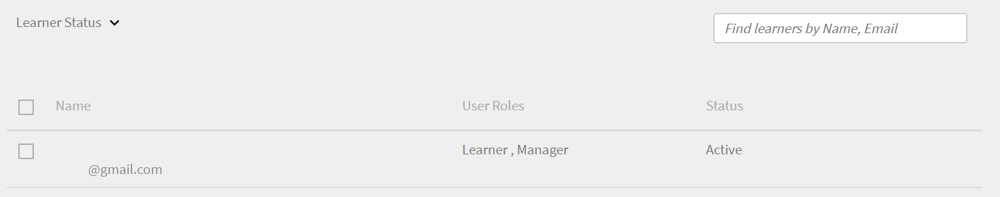

# Hinzufügen von Benutzern in Adobe Learning Manager

In Adobe Learning Manager sind Benutzer Teilnehmer, die die Plattform zum Lernen oder für Schulungen verwenden. Es gibt zwei Arten von Benutzern: interne und externe Benutzer.

Interne Benutzer sind Mitarbeiter oder Teammitglieder aus Ihrer Organisation.

Externe Benutzer sind Teilnehmer außerhalb Ihres Unternehmens, z. B. Kunden, Partner, Anbieter oder Kunden, die auf Ihre Lerninhalte zugreifen können.

Mit Adobe Learning Manager (ALM) können Administratoren interne und externe Benutzer mit verschiedenen Methoden integrieren und verwalten, einschließlich manueller Eingabe, CSV-Upload, Selbstregistrierung und Systemintegrationen.

## Interne Benutzer

Interne Benutzer in Adobe Learning Manager beziehen sich auf Mitarbeiter oder Teammitglieder in Ihrem Unternehmen. Sie können sie manuell hinzufügen, gesammelt hochladen oder über Systemintegrationen importieren. Nachdem Sie diese Benutzer hinzugefügt haben, können Sie sie in Gruppen organisieren, Kurse zuweisen und ihren Lernfortschritt überwachen.

Die Benutzer in Adobe Learning Manager können je nach zugewiesenen Rollen unterschiedliche Aufgaben übernehmen und verschiedene Aufgaben verwalten. Jede Rolle, einschließlich Administrator, Autor, Kursleiter und Integrationsadministrator, bietet eine Reihe spezifischer Funktionen, die speziell auf die Verantwortlichkeiten des Benutzers innerhalb der Plattform zugeschnitten sind.

Adobe Learning Manager unterstützt die folgenden Benutzerrollen:

* **Administrator**: Verwaltet Benutzer und Benutzergruppen, weist Rollen zu und konfiguriert systemweite Voreinstellungen wie Datenquellen, zulässige Domänen und Anzeigeoptionen. Administratoren sind auch für das Erstellen und Organisieren von Lerninhalten, das Verfolgen des Lernfortschritts von Teilnehmern, das Generieren von Berichten und das Einrichten von Integrationen mit externen Systemen verantwortlich.
* **Autor**: Erstellt und verwaltet Inhalte, einschließlich Module und Kurse.
* **Manager**: Überwacht die Lernaktivitäten des Teams, nominiert Teammitglieder für Kurse, genehmigt Anfragen und gibt Feedback.
* **Integrationsadministrator**: Verwaltet Systemintegrationen und Datenverbindungen zwischen ALM und externen Plattformen.
* **Benutzerdefinierte Rollen**: Administratoren können benutzerdefinierte Rollen erstellen, um Benutzern maßgeschneiderten Zugriff auf der Grundlage ihrer Zuständigkeiten zu gewähren. Weitere Informationen zu den benutzerdefinierten Rollen finden Sie in diesem Artikel.

### Methoden zum Hinzufügen interner Benutzer

Administratoren können interne Benutzer mit den folgenden Methoden hinzufügen:

* **Einen einzelnen Benutzer hinzufügen**: Fügen Sie manuell jeweils einen Benutzer hinzu.
* **Selbstregistrierungsprofil**: Ermöglichen Sie Teilnehmern, sich selbst als Teilnehmer in Adobe Learning Manager zu registrieren, indem Sie einen vom Administrator erstellten Registrierungslink verwenden.
* **Massen-Upload über CSV**: Laden Sie eine CSV-Datei hoch, um mehrere Benutzer gleichzeitig hinzuzufügen.

### Internen Benutzer manuell hinzufügen

Administratoren können einzelne Benutzer manuell hinzufügen, indem sie ihren Namen, ihre E-Mail-ID, ihre eindeutige ID und den Namen des Managers eingeben. Der eindeutige Bezeichner in der Adobe Learning Manager ist ein erforderlicher Bezeichner, den Administratoren beim Erstellen eines Benutzers zuweisen. Es muss für jeden Benutzer eindeutig sein und als einheitliche Referenz im gesamten System dienen.

>[!INFO]
>
>In dieser Schulung der ALM Academy erfahren Sie, wie Sie Einzelbenutzer zu Adobe Learning Manager hinzufügen.  

So fügen Sie Adobe Learning Manager einen einzelnen Benutzer hinzu:

1. Melden Sie sich als Administrator an.
2. Wählen Sie **Benutzer** und anschließend **Intern**.
3. Wählen Sie **Hinzufügen** und anschließend **Einzelbenutzer** aus.

   
   _Administratoroberfläche, die die Option zum manuellen Hinzufügen eines einzelnen internen Benutzers anzeigt_
4. Geben Sie an der Eingabeaufforderung **Benutzer hinzufügen** den **Namen**, **E-Mail** und **Profil** (Jobtitel) des Benutzers ein.

   
   _Felder zum Eingeben des Namens, der E-Mail-Adresse, des eindeutigen Bezeichners und des Profils für einen neuen Benutzer_
5. Suchen Sie nach dem Manager des Benutzers und wählen Sie den Namen aus der Liste der Manager aus.
6. Wählen Sie **Hinzufügen** aus.
Der Benutzer erhält eine Begrüßungs-E-Mail mit einer Anmelde-URL für den Zugriff.

### Selbstregistrierung für interne Benutzer zulassen

Die Selbstregistrierung ist ein Self-Service-Onboarding-Prozess, bei dem Benutzer eine Registrierungs-URL aufrufen, ihre Daten eingeben und sich automatisch für die Plattform registrieren können. Diese Methode minimiert den administrativen Aufwand, indem sie es Benutzern ermöglicht, sich über die bereitgestellte URL zu registrieren.

So erstellen Sie eine URL für die Selbstregistrierung eines Benutzers:

1. Melden Sie sich als Administrator an.
2. Wählen Sie **Benutzer** und anschließend **Intern**.
3. Wählen Sie in der oberen rechten Ecke **Hinzufügen** aus und wählen Sie dann **Selbstregistrierung.**

   
   _Dropdown-Menü zum Auswählen der Selbstregistrierungsoption_
4. Geben Sie in der Eingabeaufforderung &quot;**Selbstregistrierungsprofil hinzufügen**&quot; das Profil in das Feld &quot;**Profilname**&quot; (Arbeitstitel des Benutzers) ein.
5. Wählen Sie den Manager des Benutzers aus, indem Sie im Feld &quot;**Name des Managers**&quot; nach dem Manager suchen. Der Manager, der dem Selbstregistrierungsprofil zugewiesen ist, muss in Adobe Learning Manager registriert sein.

   
   _Eingabefelder zum Festlegen der Stellenbezeichnung und zum Zuweisen eines Managers zu einem Selbstregistrierungsprofil_
6. Wählen Sie ein Bild mit der Option **Bild hinzufügen** aus. Dieses Bild wird den Teilnehmern im Profilabschnitt angezeigt.
7. Wählen Sie **Speichern**.

   Adobe Learning Manager erstellt ein Benutzerprofil und generiert eine URL für die Selbstregistrierung, die den Benutzern zur Durchführung der Registrierung zur Verfügung gestellt werden kann.

   
   _Bestätigungsmeldung, dass eine URL für die Selbstregistrierung erfolgreich erstellt wurde_
8. Geben Sie die URL für die Benutzer frei, die sich selbst registrieren möchten.

   Die URL kann für mehrere Benutzer zur Registrierung freigegeben werden. Sie können beispielsweise eine URL für das Profil **Sales Associate** generieren und sie für das Sales Associate-Team freigeben, damit sich diese selbst registrieren können.

_Link zur Selbstregistrierung öffnet eine Anmeldeseite_

### Liste der URLs für die Selbstregistrierung anzeigen

Anzeigen der Liste der Selbstregistrierungs-URLs:

1. Wählen Sie **Benutzer** und anschließend **Intern**.
2. Wählen Sie **Selbstregistrierung** aus.

   Administratoren können die Liste der URLs für die Selbstregistrierung anzeigen.

_Listenansicht mit vorhandenen URLs für die Selbstregistrierung, die für interne Benutzer verfügbar sind_

### Interne Benutzer als Massen-Upload

Mit Adobe Learning Manager können Administratoren mehrere Benutzer gleichzeitig hinzufügen, indem sie eine CSV-Datei hochladen, die die Benutzerinformationen enthält, einschließlich Name, E-Mail-ID und Name des Managers. Diese Funktion für Massen-Uploads spart Zeit und Aufwand, verglichen mit dem Hinzufügen einzelner Benutzer.

>[!INFO]
>
>Sehen Sie sich diese Schulung der ALM Academy an, um zu erfahren, wie Sie Benutzer in großen Mengen über eine CSV-Datei hinzufügen.   

Mehrere Benutzer hinzufügen:

1. Melden Sie sich als Administrator an.
2. Wählen Sie **Benutzer** und anschließend **Intern**.
3. Wählen Sie in der oberen rechten Ecke **Hinzufügen** aus und wählen Sie **CSV hochladen**.

   
   _Option zum Hochladen einer CSV-Datei für den Massenbenutzerimport_

4. Bereiten Sie eine CSV-Datei mit den folgenden Feldern vor:

   * Name des Mitarbeiters*
   * E-Mail-Adresse des Mitarbeiters*
   * Profil/Bezeichnung des Mitarbeiters
   * Manager-ID/E-Mail\
     (*) Erforderliche Felder.

5. Bevor Sie die E-Mail-ID eines Managers für einen Mitarbeiter hinzufügen, stellen Sie sicher, dass der Manager bereits als Mitarbeiter in der CSV-Datei enthalten ist. Sehen Sie sich beispielsweise den Mitarbeiter mit dem Namen Howard Walters in der Momentaufnahme unten an.

   
   _Bild der Beispiel-CSV mit allen Feldern_

6. Laden Sie die CSV-Datei hoch und ordnen Sie die Datenfelder entsprechend zu.

   
   _CSV-Zuordnungsschnittstelle zum Ausrichten von Tabellenspalten an Systemfeldern_
7. Wählen Sie **Speichern** aus, um die Benutzer zu importieren.

   Nach erfolgreichem Upload wird eine Bestätigungsmeldung angezeigt.

   
   _Image zeigt den Status des CSV-Uploads als erfolgreich an_

>[!NOTE]
>
>Verwalten einer Master-CSV für alle Hinzufügungen und Löschungen. Das Aktualisieren und erneute Hochladen einer vorhandenen CSV-Datei wird nicht unterstützt.

Wenn Sie eine CSV-Datei hochladen, um Benutzer hinzuzufügen, ist es wichtig, alle zugehörigen Informationen in der richtigen Reihenfolge anzugeben. Wenn Sie einem Mitarbeiter die E-Mail-ID eines Managers zuweisen, müssen die Details des Managers früher in der CSV-Datei angezeigt werden. Dadurch wird sichergestellt, dass das System den Manager als vorhandenen Benutzer erkennt, bevor es ihn mit seinen Teammitgliedern verknüpft. Wenn Howard Walters beispielsweise ein Manager ist, fügen Sie seine vollständigen Benutzerdetails in die CSV-Datei ein, bevor Sie Mitarbeiter auflisten, die ihm Bericht erstatten.

### Benutzerregistrierung verwalten

Nachdem Sie Benutzer einzeln oder mehrere gleichzeitig hinzugefügt haben, müssen Sie sie registrieren, um ihre Konten zu aktivieren. Dadurch können Benutzer auf Adobe Learning Manager zugreifen und die Plattform verwenden.

So registrieren Sie die Benutzer:

1. Wählen Sie **Benutzer** auf der Startseite des Administrators aus.
2. Aktivieren Sie die Kontrollkästchen neben den Namen der Benutzer, die Sie registrieren möchten.
3. Wählen Sie **Aktionen** und anschließend **Register** aus.

   
   _Schaltfläche &quot;Registrieren&quot;, um ausgewählte Benutzer in Adobe Learning Manager zu aktivieren_

4. Wählen Sie **Ja**, um den Benutzer zu aktivieren.

An den Benutzer wird eine Bestätigungs-E-Mail gesendet. Der Benutzer muss den Link in der E-Mail auswählen, um sein Konto zu aktivieren und Adobe Learning Manager zu verwenden.

## Externe Benutzer

Mit Adobe Learning Manager können Sie Benutzer außerhalb Ihres Unternehmens hinzufügen, z. B. Kunden, Partner, Anbieter oder Kunden, um auf die Lerninhalte zuzugreifen. Nachdem sie hinzugefügt wurden, können Sie sie gruppieren, Kurse zuweisen und den Lernfortschritt verfolgen.

Das Hinzufügen externer Benutzer in Adobe Learning Manager umfasst die folgenden Schritte:

* Erstellen eines externen Registrierungsprofils
* Aktivieren des Registrierungsprofils
* Den Registrierungslink für externe Benutzer freigeben
* Anhalten oder Fortsetzen des Profils bei Bedarf

Adobe Learning Manager unterstützt die Registrierung solcher Benutzer über externe Registrierungsprofile.

Um einen externen Benutzer zu erstellen, führen Sie die folgenden Schritte aus:

1. Melden Sie sich als Administrator an.
2. Wählen Sie **Benutzer** und anschließend **Extern**.
3. Wählen Sie in der oberen rechten Ecke **Hinzufügen** aus, um eine Registrierung für einen externen Benutzer zu erstellen.
4. Geben Sie im Dialogfeld &quot;**Externes Registrierungsprofil hinzufügen**&quot; Folgendes an:

   * **Profilname:** Geben Sie den Namen der Partnerorganisation ein, die auf Adobe Learning Manager zugreifen möchte.
   * **Manager-E-Mail:** Geben Sie die E-Mail-Adresse des Managers für den Benutzer ein.
   * **Maximale Anzahl von Lizenzen:** Legen Sie die maximal zulässige Anzahl von Registrierungen fest.
   * **Ablauf:** Definieren Sie das letzte Datum für neue Registrierungen. Nach Ablauf dieses Zeitraums funktioniert der Link bei der Registrierung neuer Benutzer nicht mehr.

   
   _Dialogfeld zur Eingabe des Profilnamens, der Manager-E-Mail, der Sitzungsbeschränkung und des Ablaufdatums_

5. Wählen Sie ein Bild mit der Option **Bild hinzufügen** aus. Dieses Bild wird den Teilnehmern im Profilabschnitt angezeigt.
6. Wählen Sie den Abschnitt **Erweiterte Einstellungen**, um ihn zu erweitern, und geben Sie die erforderlichen Details ein:
   * **Anmeldeanforderung:** Geben Sie die Anzahl der Tage ein. Wenn Teilnehmer für den gesamten Zeitraum inaktiv bleiben, werden sie automatisch entfernt.
   * **Zulässige Domänen:** Geben Sie die durch Kommas getrennte Liste zulässiger E-Mail-Domänen ein. Nur Benutzer mit E-Mail-Adressen von zugelassenen Domänen können sich registrieren.
   * **E-Mail-Verifizierung erforderlich:** Wählen Sie diese Option aus, um die E-Mail-Verifizierung während der Registrierung zu erzwingen.

   
   _Bereich &quot;Erweiterte Einstellungen&quot; zum Festlegen von Anmeldeanforderungen, zugelassenen Domänen und E-Mail-Verifizierung_

7. Wählen Sie **Speichern**.

Es wird eine Registrierungs-URL generiert.

### Externes Profil aktivieren

So aktivieren Sie das externe Profil:

1. Suchen Sie das neu erstellte Profil in der Liste der externen Profile.

2. Wählen Sie die Umschaltfläche **Status** aus, um sie zu aktivieren.

Der Administrator kann diese URL für den externen Partner freigeben, damit er sich anmelden und sich damit bei Adobe Learning Manager anmelden kann.

_Wählen Sie den Schalter aus, um das externe Profil zu aktivieren_

### Registrierungs-URL des externen Profils kopieren und freigeben

Die Registrierungs-URL für ein externes Profil kann aus dem Abschnitt **Externe Benutzer** kopiert werden.

_Registrierungs-URL eines externen Profils kopieren_

### Wichtige Unterschiede zwischen internen und externen Benutzerregistrierungen

Es gibt einige Unterschiede zwischen internen und externen Registrierungen:

| Interne Benutzer | Externe Benutzer |
|---|---|
| Anmeldung mit Adobe ID- oder SSO-Anmeldeinformationen möglich. | Anmeldung mit einer beliebigen E-Mail-ID möglich. |
| Gamification ist verfügbar. | Gamification ist verfügbar. Der Administrator muss Gamification für externe Teilnehmer in den [Gamification-Einstellungen](https://experienceleague.adobe.com/de/docs/learning-manager/using/admin/gamification) aktivieren. |

### Externes Registrierungsprofil anhalten

In Adobe Learning Manager können Administratoren die Registrierung externer Benutzer verwalten, indem sie ihre Profile anhalten. Dies ist hilfreich, wenn Sie neue Benutzer vorübergehend davon abhalten möchten, mit einem bestimmten externen Benutzerprofil teilzunehmen. Wenn Sie ein Profil anhalten, können Benutzer, die Einladungen erhalten haben, sich aber noch nicht registriert haben, den Anmeldevorgang nicht abschließen. Diese Aktion hat keine Auswirkungen auf Benutzer, die ihre Registrierung bereits abgeschlossen haben.

Anhalten eines externen Profils:

1. Wählen Sie **Aktionen** in der oberen rechten Ecke der Seite **Externe Benutzer** aus.
2. Wählen Sie **Pause**, um das externe Benutzerprofil anzuhalten.

Dies blockiert den Registrierungsprozess für Benutzer, die ihre Einladungen noch nicht angenommen haben. Beachten Sie, dass diese Aktion nur Benutzer betrifft, die ihre Registrierung noch nicht abgeschlossen haben.

_Option zum Anhalten eines vorhandenen externen Benutzerprofils über das Aktionsmenü_

### Externes Registrierungsprofil fortsetzen

Wenn ein externes Profil zuvor angehalten wurde, können Administratoren es fortsetzen, damit neue Benutzer ihre Registrierung abschließen können. Dadurch wird der Registrierungsprozess für Benutzer wieder aktiviert, die eingeladen wurden, aber ihre Registrierung nicht abgeschlossen haben.

So setzen Sie einen externen Benutzer fort:

1. Wählen Sie **Aktionen** in der oberen rechten Ecke der Seite aus.
2. Wählen Sie **Fortsetzen**, um den Zugriff eines angehaltenen Partners fortzusetzen.

_Option zum Fortsetzen eines zuvor angehaltenen externen Benutzerprofils_

### Externe Nutzung der Lizenz überwachen

Administratoren können die Anzahl der Benutzer verfolgen, die jedem externen Profil in Adobe Learning hinzugefügt wurden.

So überprüfen Sie die verwendeten Lizenzen:

1. Wählen Sie in der Liste der externen Profile **Verwendete Lizenzen** aus.

Sie können die Anzahl der Teilnehmer anzeigen, die der Partnerorganisation hinzugefügt wurden, und ob die Teilnehmer aktiv sind.

## Verwalten von Benutzenden

Administratoren können Benutzerdetails bearbeiten, Benutzer löschen, Rollen zuweisen und Rollen entfernen. Dadurch wird sichergestellt, dass jeder Benutzer den richtigen Zugriff und die richtigen Aufgaben hat.

>[!INFO]
>
>Sehen Sie sich diese Schulung der ALM Academy an, um zu erfahren, wie Sie Rollen zuweisen und entfernen, eine Begrüßungs-E-Mail senden und Benutzer löschen und bereinigen können. [[Schaltfläche]](https://content.adobelearningmanageracademy.com/app/learner?accountId=98632#/course/7555586) 

### Benutzer bearbeiten

Verwenden Sie die Option **Benutzer bearbeiten** in Adobe Learning Manager, um die Profilinformationen eines Benutzers zu aktualisieren, z. B. Name, E-Mail-Adresse, eindeutige Kennung, Profil und Managername. Administratoren können diese Änderungen vornehmen, um sicherzustellen, dass die Benutzerdaten korrekt und auf dem neuesten Stand sind.

So bearbeiten Sie einen Benutzer:

1. Wählen Sie **Benutzer** auf der Startseite des Administrators aus.
2. Wählen Sie den zu bearbeitenden Benutzer aus der Liste **Benutzer** aus.
3. Wählen Sie **Profil bearbeiten** aus.

   
   Option _Benutzer löschen im Menü &quot;Aktionen&quot;, um einen Benutzer von der Plattform zu entfernen_

4. Wählen Sie **Ja**, um den Benutzer zu löschen.

Eine Bestätigungsmeldung wird angezeigt, wenn der Benutzer erfolgreich gelöscht wurde.

## Weisen Sie einem Benutzer eine Rolle zu

Benutzerrollen in Adobe Learning Manager definieren, welche Aktionen jede Person im System ausführen kann. Jede Rolle verfügt über spezifische Berechtigungen, die auf den Verantwortlichkeiten des Benutzers basieren.

So weisen Sie Benutzern Rollen zu:

1. Wählen Sie **Benutzer** auf der Startseite des Administrators aus.
2. Wählen Sie den Benutzer aus, dem Sie eine Rolle zuweisen möchten.
3. Wählen Sie in der oberen rechten Ecke **Aktionen** aus.
4. Wählen Sie **Rolle zuweisen**.
5. Wählen Sie die gewünschte Rolle aus.

   
   _Optionen des Menüs &quot;Rolle zuweisen&quot; zeigen verfügbare Rollen für den ausgewählten Benutzer an_

6. Wählen Sie im Bestätigungsdialogfeld **Ja** aus.

## Entfernen Sie eine Rolle

Durch Entfernen einer Benutzerrolle werden die von dieser Rolle gewährten Berechtigungen widerrufen.

So entfernen Sie Rollen aus Benutzern:

1. Wählen Sie auf der Administrator-Homepage **Benutzer** aus.
2. Wählen Sie die Benutzer aus, deren Rollen Sie entfernen möchten.
3. Wählen Sie **Aktionen** und anschließend **Rolle entfernen** aus.

   
   _Option zum Entfernen zugewiesener Rollen von einem Benutzer im Aktionsmenü_

4. Wählen Sie im Bestätigungsdialogfeld **Ja** aus.
<!--# Add users and create user groups

Learn how to add users or user groups in Learning Manager application.

<!---->

<!--## Overview {#overview}

In Adobe Learning Manager, you can assume the following roles:

* **Administrator:** An Administrator defines the training strategy for the organization. An Administrator can add learners, search required skills for learners, manage and assign courses, create learning plans, certifications, and learning programs, and manage reports for the entire organization.
* **Author:** Authors are Instructional Designers and content creators. An Author can add modules and courses to Learning Manager.
* **Manager:** A Manager manages the learning activities of a team. A Manager can nominate team members to take a course, approve requests from team members, and provide feedback on performance of their team members post-completion of training. Managers can also view reports for their team to track their performance.
* **Learner:** Learners can access courses, learning programs, and certifications assigned to them. Learners can also browse through all the available courses by using a catalog and enroll themselves for either courses, learning programs, or certifications.

As an Administrator, you can add users in three ways:

* Internal
* External
* User groups

## Add a single user {#addasingleuser}

Add internal learners to the Adobe Learning Manager using a single user option.

>[!INFO]
>
>In this training, you will learn how to add internal learners to the Adobe Learning Manager.    

If you're unable to launch the training, write to <almacademy@adobe.com>.

To add users,

1. Log into Adobe Learning Manager as an Administrator. 
1. On the home page, click **[!UICONTROL Add Users]**. On this page, you can add a single user or multiple users at a time using a CSV. You can also create a self-registration link for internal employees or create an external learner profile.
1. To add a single user, click **[!UICONTROL Add]** on the upper-right corner and choose the option **[!UICONTROL Single User]**.

1. To add a single user, click **[!UICONTROL Add]** on the upper-right corner and choose the option **Single User**.

   
   *Add a single internal user*

1. On the **[!UICONTROL Add User]** dialog, enter the details of the learner. For the field **[!UICONTROL Manager's Name]**, pick the name of an existing user in the system.

   
   *Add user dialog box*

1. To add the new user in Learning Manager, click **[!UICONTROL Add]**. After the user is added, the user receives a verification mail. The Learner then activates the account and starts using Learning Manager. This workflow is helpful if you need to add limited number of learners to your Learning Manager Account. But if you're planning to enroll all the employees of a large organization, you can add them in a singe attempt. For more information, see the next section.

## Add users in bulk {#addusersinbulk}

Typically, most organizations work with an HR Management System (HRMS), which maintains all employee records, such as, designation, location, date of joining, or employee hierarchy. You can export this data in a CSV format. To import a CSV, follow the steps below:

1. Click **[!UICONTROL Add]** on the upper-right corner, and choose the option **[!UICONTROL Upload a CSV]**.

   
   *Upload a CSV to add users in bulk*

1. The CSV that you upload consists of the fields, as shown below:

   
   *Structure of the CSV*

   You must maintain a master CSV and perform perform all additions and deletions on the master CSV. The master CSV contains the following fields:

   * name &#42;
   * email &#42;
   * profile
   * manager

   (&#42;) Required field.

1. After you click the option **[!UICONTROL Upload a CSV]**, the following dialog displays.

   
   *Upload a CSV dialog*

1. Choose the CSV or drag-and-drop the file. After you've chosen the file, map the data fields with the ones in the CSV file. Click the required drop-down and choose the right field.

   
   *Map fields in CSV*

1. To start importing the users, click **[!UICONTROL Save]**. You can see a confirmation message.

   
   *Confirmation message for successful upload of the CSV*

1. The new users are now added to your Adobe Learning Manager account. To select the new users, select the check-box next to the names so that everybody is selected. 

   
   *New users added*

>[!NOTE]
>
>For more information, see the FAQ, [Add users in bulk](../add-users-in-bulk.md).

>[!INFO]
>
>In this training, you will learn how to add users in bulk through a CSV.    

If you're unable to launch the training, write to <almacademy@adobe.com>.

## Register a user {#registerauser}

With the user selected, click **[!UICONTROL Actions]** on the upper-right corner and click **[!UICONTROL Register]**.

The selected users receive a Welcome email. If the learners have an existing Adobe ID, they can click this link. If they don't have an existing Adobe ID, they can go ahead and click the Welcome link to create an Adobe ID and link it to their Learning Manager account.

### Manage users

In this training, you will learn how to assign and remove roles, send a welcome email, and delete and purge users. 

If you're unable to launch the training, write to <almacademy@adobe.com>.

## Assign a role {#assignarole}

After adding learners to the Adobe Learning Manager account, if you want to change their roles, click Actions on the upper-right corner of the page. Choose the option **[!UICONTROL Assign Role]**. Here you can decide whether you want to give Author access or Admin access to the learner. After you have assigned a role, this learner has Author access to the account and can add modules and create courses. 

*Assign a role to a user*

## Remove a role {#removearole}

You can also remove Author or Admin access for the users. Select one or more learners, click **[!UICONTROL Actions]**, and select **[!UICONTROL Remove Role]**. Choose an option, for example, **[!UICONTROL Remove Author]**, and the author access gets revoked for this learner. 

>[!NOTE]
>
>You cannot manually assign a Manager role to someone in the system. They automatically get access to the Manager dashboard when one or more employees are added under them.

## Delete a user {#deleteauser}

To delete a user, click **[!UICONTROL Actions]**, and choose **[!UICONTROL Delete User]**. On the confirmation dialog, click **[!UICONTROL Yes]**, and the learner gets deleted.

*Confirmation message to delete a user*

## Edit a user {#editauser}

On the list of users, choose a user, and click the user. On the user details, click the **[!UICONTROL Edit]** ( ) button. On the **[!UICONTROL Edit User]** dialog, make the necessary edits and to save the changes, click **[!UICONTROL Save]**.

*Edit User dialog*

## Active fields

Active Fields in Adobe Learning Manager are customizable metadata fields used to store and manage user-specific information. These fields help define key attributes or characteristics associated with each user in the system.

### Manage user attributes

>[!INFO]
>
>In this training, you will learn how to add, customize, and configure Active Fields.    

If you're unable to launch the training, write to <almacademy@adobe.com>.

Adobe Learning Manager preserves the case sensitivity of the user attribute and its value. **For example**, the case sensitivity of a user attribute is 'location' and its value as 'PARIS' will be preserved and displayed in the same manner. In case of any issues, the Administrator can now edit the attribute name and values to correct any case sensitivity errors. 

The Administrator can do this by visiting **[!UICONTROL Admin app]** > **[!UICONTROL Users]** > **[!UICONTROL User groups]** and clicking on the group name.  

An Admin can add and update allowed attribute values for a learner through UI.

Types of active fields:

* Groupable: Learners would get grouped on the basis of the Values
* Reportable: Reporting user groups would be created based on the active fields
* Exportable: The fields will be seen in exported in user group report.

## Create a self-registration link {#createaselfregistrationlink}

You can also enable employees in your organization to register themselves as Learners to Adobe Learning Manager Account, without taking help from you as an administrator. The administrator can create a Self-Registration link and share with the employees, who can further register to Learning Manager using their Adobe credentials.

On the upper-right corner of the page, click **[!UICONTROL Add]**, and select **[!UICONTROL Self-Registration]**.

*Create link to self-register as learner*

The **[!UICONTROL Add Self-Registration Profile]** dialog appears. Give this profile a name. Then add the manager's name. It's important to know that the manager must already be registered learner in Learning Manager.

*Add profile for self-registration*

After you click **[!UICONTROL Save]**, a URL gets generated, which you can share with the learners, so that they can click the URL and self-register themselves.

## Enroll external learners {#enrollexternallearners}

In Adobe Learning Manager, you can also create Registration links for external partners or agencies with limited access to your account and provide them learning material.

There are a few differences between internal and external registrations.

<table>
 <tbody>
  <tr>
   <td>
    
<b>Internal users</b>
</td>
   <td>
    
<b>External users</b>
</td>
  </tr>
  <tr>
   <td>
    
Log in using Adobe ID or SSO credentials.
</td>
   <td>
    
Log in using any email ID.
</td>
  </tr>
  <tr>
   <td>
    
Gamification is available.
</td>
   <td>
    
Gamification is available. The admin must enable gamification for external learners in the Gamification settings.
</td>
  </tr>
  <tr>
   <td>
    
Learner hierarchies are available.
</td>
   <td>
    
Learner hierarchies are not available.
</td>
  </tr>
 </tbody>
</table>

To enroll external users, follow the steps below:

1. In the left navigation pane, click **[!UICONTROL External]**.

   
   
   *Enroll external users*

1. On the upper-right corner of the page, click **[!UICONTROL Add]**.

1. On the **Add External Registration Profile** dialog, add the following details:

   * The profile name of the partner organization.
   * The email address of the manager of the partner organization.
   * Seat limit for external enrollment for this partner.
   * Expiry date to set a deadline to stop allowing new registrations to this group. After the Expiry date, only the existing registered users can access this training.

   

   *Add External Registration Profile dialog*

   * In the **[!UICONTROL Advanced Settings]** section, enter the following:

     * **[!UICONTROL Login Requirement]:** Specify a value in days. Learners get deleted if they do not login for the above duration.
     * **[!UICONTROL Allowed Domains]:** A comma-separated list of whitelisted email domain names.
     * **[!UICONTROL Email Verification Required]:** Select this option to make email verification mandatory for a learner.

   

   *Enter the details in the Advanced Settings section* 

1. After you click **[!UICONTROL Save]**, you can see the following confirmation message. You must share the URL with your external partner.

   

## Enable an external profile {#enableanexternalprofile}

After an external profile has been created, you must enable its status. From the list of external profiles, choose the required profile, and toggle the status button.

*Enable an external profile*

This enables the External Enrollment link. A welcome email is automatically be sent to the partner. You can also copy the link and share with them by clicking the Copy URL icon (), or you can resend the welcome email to the partner organization by clicking the Mail icon ().

The partner manager can share the link with the employees who must take the training in PrLearning Managerime. When they click the link, they can self-enroll themselves after filling out some details to create their profile on Learning Manager. These users will not appear on the Learners tab along with the internal employees. You can see their names under the **[!UICONTROL External Learners]** tab.

## Pause an external profile {#pause}

After adding an external user group to Learning Manager, you can also pause the external users' registration process. When you pause, the external users' registration process is blocked. However, this process works only when the users haven't registered yet by accepting the invitation.

To pause the external user groups, choose a group or groups, click **[!UICONTROL Actions]** from the upper-right corner of the page, and click **[!UICONTROL Pause]**.

## Resume an external profile {#resumeanexternalprofile}

At any time, you can always revoke the paused state of an external partner and resume normal services. Click **[!UICONTROL Actions]** at the upper-right corner of the page and select **[!UICONTROL Resume]**.

The following states are applicable for external users:

* **Inactive state** - In this state, the external users' registration is expired. Administrators set the expiry date for the external users while adding them through the add user workflow.
* **Active state** - In this state, the external users can register to the Learning Manager application, and log in to the application.
* **Pause** - In this state, the registration process for external users is blocked. However, the existing users can continue to log in.

## Check used seats {#checkusedseats}

On the list of external profiles, click **[!UICONTROL Seats Used]**. You can view the number of learners in the partner organization who have been added.

*Check used seats*

## Delete a user {#Deleteauser-1}

Choose a user, and from the upper-right corner, click **[!UICONTROL Actions]** > **[!UICONTROL Delete User]**.

## Change profile {#changeprofile}

To move a user to another external profile, choose a user, from the upper-right corner, click **[!UICONTROL Actions]** > **[!UICONTROL Change Profile]**. From the list of profiles, choose a profile, and click **[!UICONTROL Change]**.

## Assign a role {#Assignarole-1}

Choose a user, and from the upper-right corner, click **[!UICONTROL Actions]** > **[!UICONTROL Assign Role]** > **Make `<role>`**. The user gets a new role.

## Remove a role {#Removearole-1}

Choose a user, and from the upper-right corner, click **[!UICONTROL Actions]** > **[!UICONTROL Remove Role]** > **Remove `<role>`**. The selected role gets removed from the list of roles that were assigned to the user.

>[!NOTE]
>
>Assigning a new role will not affect custom user groups. However, it will impact auto-generated user groups such as All Admins, All Authors, and similar role-based groups.

## Create user groups {#createusergroups}

A User Group is a set of users who are related to a category. User Groups help administrators to select learners in their organization based on their attributes, and then assign learning content to them. Also, these User Groups enable administrators to assign customized logos and catalogs to learners and show customized reports on their progress.

To access User Groups, on the left navigation pane, click **[!UICONTROL User Groups]**.

*Create user groups*

### Manage user groups

>[!INFO]
>
>In this training, you will learn how to create a user group by names, email IDs, and combining multiple auto-generated user groups.    

If you're unable to launch the training, write to <almacademy@adobe.com>.

There are two types of groups in Adobe Learning Manager, Custom and Auto-generated. When you add learners to your account, some groups are automatically created based on their common properties.

To see the automatically created groups, click the tab **[!UICONTROL Auto-generated]**.

*View Auto-generated groups*

You can see that there are different groups, like All Internal Users, All Managers, groups based on the Cost Center, based on the department, and based on the teams of the managers.

In addition to Auto-generated groups, you can create Custom groups. To add a new Custom Group, on the upper-right corner, click **[!UICONTROL Add]**. 

1. Enter the name, and description for the group.
1. Enter user name or profile in search-as-you-type field and select from the drop-down list, to add users.

1. To add more learners, click **[!UICONTROL Add More Users]**.

1. To create the user group, click **[!UICONTROL Save]**.

This Custom Group is now created and added to the profile. The User Groups that you create are dynamic in nature. If new users are added with similar attributes, they're automatically added to the User Group.

To view the list of groups a user belongs to, navigate to **[!UICONTROL User]** > **[!UICONTROL User Groups]**, search for the user's name, and select it. This will display all the groups the user is part of.

### Download the list of users in a user group

To download the list of users in a specific user group, navigate to **[!UICONTROL User]** > **[!UICONTROL User Groups]**, select the **[!UICONTROL Download icon]** next to the group. This will generate a CSV file containing the list of users in that group.

 

## Exclusion of user groups

At times you would want to exclude a small set of users from a large user group. This is required to enroll this specific set of users into training via Learning Plans or to setup the correct visibility of catalogs. In this release of Learning Manager, you can exclude learners or User Groups when you create a custom user group. In the Add User Group dialog, the Exclude Learners section enables you to achieve so.

*Exclude user groups*

For example, if you want to set up a Learning Plan so that all users belonging to location = California except Store-5 (located in California) get enrolled. 

## Advanced settings {#advancedsettings}

### Data Sources {#datasources}

You can use this feature when you want to import/sync the users or learning data from your organization's database in to the Learning Manager application. You can also set up the frequency of this sync. 

Click **[!UICONTROL Data Sources]** on the left pane under **[!UICONTROL Advanced]** section. 

*Data sources to iport or sync users*

Choose the data source type from the **[!UICONTROL Source]** drop-down, select the update frequency, and click **[!UICONTROL Sync now]** if you need to sync immediately or click **[!UICONTROL Save].** Data source types are SFDC, FTP, and so on for internal users. 

You can add multiple data sources. 

### Active Fields {#activefields}

This feature enables administrators to add more active fields in addition to what has been provided during user registration. 

Click **[!UICONTROL Active Fields]** available inside users page. Learners can only choose from the values given in custom values.

*Active fields*

### Configure Fields {#configurefields}

**Internal users**

You can add custom value for user fields for internal users.

To add  custom values, follow these steps:

1. Click  **[!UICONTROL Modify Values]** for an Internal user. 

   
   *Modify values for internal users*

1. The **Values in Custom field** dialog box appears.

   
   *Values in Custom Fields dialog box*

1. Select the value to add from the **[!UICONTROL Select Field]** drop-down menu.
1. Enter new values in the **[!UICONTROL New Value]** field.
1. Click **[!UICONTROL Done]**. 
1. Click Save on the top right corner to **[!UICONTROL Save]** changes.

**External users**

Add custom values similar to that for internal users.

*Modify values for external users*

### Settings {#settings}

**User Display**

If the option **Show only unfilled fields on Learner login** is enabled, a user only sees the blank fields upon login.

*Show unfilled fields*

Using this option, an Administrator can decide whether he/she wants to show the fields or hide them once these have been populated.

## Restrict Active Fields in reports {#restrictactivefields}

Learning Manager 27.7 introduces two new options- **[!UICONTROL Reportable]** and **[!UICONTROL Exportable]**, for Active Fields.

*Options in Active Fields*

For CSV fields and manually added fields, if an Active Field is marked as **[!UICONTROL Reportable]**, the Active Field becomes searchable in a filter inside a dashboard report.

*Filters in a dashboard report*

If an Active Field is marked as **[!UICONTROL Exportable]**, then the Active Field appears in the Excel file upon downloading any Excel report.

These options appear for both internal and external Active Fields.

You can only delete a custom Active Field.

## User Display

You can hide the entire 'Complete your profile' page from the learners. The page will not pop up once the learner logs in.

Note that the existing default behavior does not change. This is an optional capability now available to Administrators. 

Enable the options below:

*User Display section*

## Support for manual CSV fields by FTP and Box connectors {#import-connector}

Often, users want Active fields to be manually provided when a learner logs in to Learning Manager. This is possible in Learning Manager at present, when the user imports a CSV manually.

The CSV may not contain all the Active fields. For all the Active fields that are not updated in the uploaded CSV, the user needs to enter the data for such Active fields.

Presently, all Active fields must be mapped to some field from the source CSV.

It so happens that sometimes a user does not want to map an Active field to a field specified in the CSV. In such cases, the user can map the Active field to the value **[!UICONTROL DontImportFromSource]**. Select this value from the drop-down list, when importing users from FTP and Box connectors.

## Custom Roles {#customroles}

Add any field of your choice as part of your user information and click **[!UICONTROL Save]**. After adding the fields, you can also cross check the availabilities of the fields in the **[!UICONTROL Edit users]** dialog. 

After adding the fields, you can notice that the fields marked with tick mark are sourced from data source or CSV as mentioned in the below snapshot. Administrator can edit these sourced fields by enabling or disabling the fields. 

**Values for active fields in Learning Manager**

The values for active fields are fetched in the following ways: 

1. Learning Manager application imports metadata from data sources associated with your account. 
1. Metadata captured from the manually imported CSV file. 
1. Learners fill up metadata when they log in
1. Administrator enters data for the users. 

>[!NOTE]
>
>Learning Manager application creates user groups automatically, from these metadata. 

**Add custom value**

You can add custom value for user fields in the Internal and External user fields.

To add  custom values, follow these steps:

Custom fields can be added and deleted, they are applicable to all users. CSV fields can be enabled or disabled, they come into effect only when you upload CSV after making the modifications in Active fields. All internal active fields are applicable to all types of Internal users. External fields are applicable only to external users. If a custom field is present in CSV, on next upload it gets converted to a CSV field automatically and it is enabled. 

## Values for CSV fields {#valuesforcsvfields}

Users can only choose from predefined fields for CSV fields if the **[!UICONTROL Restrict Selection]** check-box is enabled.

*Restrict selection check-box*

## Import Logs {#importlogs}

In this space, you can view the CSV import history for the users the administrator has added using bulk import feature. You can also click **[!UICONTROL Add]** at the upper-right corner of the page to add users using CSV upload feature. 

## Multi-valued Active Fields

With this feature, you can have more than one field for an active field. In an account, there can be at most three multi-valued active fields. The multi-valued active fields are available for both external and internal users.

Once you mark an active field as multi-valued, you cannot convert it back to single valued. This is irreversible.

An existing single valued field cannot be marked as multi-valued field.

To create a multi-valued active field, follow the steps below:

1. Add an active field.

   
   *Add an active field*

1. Click Add.
1. In the Settings tab, mark the new field as multi-valued.

   
   *Mark as multi-valued*

   There is another checkbox, **[!UICONTROL Learner Configurable]**, which when disabled, the learner will not be able to see the field on the Profile page.

1. Add the values using a CSV or by clicking Modify Values.

   
   *Add values*

1. Click [!UICONTROL **Done**].

>[!NOTE]
>
>Once is the user group is created and the field is populated, multi values cannot be converted to single values, and vice versa.

### Add multi-valued active field via CSV

Follow the steps below:

1. Create a CSV with the new active fields as columns (comma-separated or single values).
1. Import the CSV.
1. Mark the fields as multi-valued in the Values in Custom Fields dialog.
1. Import the CSV again.

The CSV must have a column with the same name as that of an active field that was marked as multi-valued.

The CSV contains the fields:

* **[!UICONTROL User]**: User groups created as roles.
* **[!UICONTROL Roles]**: Multi-valued active field with values.

If the CSV is re-uploaded with new values or deleted values, the active fields and groups also get updated accordingly.

### Reports

All reports include the multi-valued active fields and their values.

The Administrator can add auto-generated active fields, and configure user activity and training reports.

The Learner Transcript report contains all the active fields and comma-separated values. The Administrator can then filter the data accordingly.

## User group report

Adobe Learning Manager's new User Group Report helps manage user groups by providing visibility into groups left unmanaged when admins left. Admins can access the reports under the **[!UICONTROL Users]** > **[!UICONTROL User Group]** section. It provides detailed information about each group, including:

* User group type
* Group name
* Description
* Created by (Name)
* Created by (Email)
* Created on (UTC Timezone)
* Number of Users

To download the report, follow these steps:

1. Log in as an **[!UICONTROL Admin]**.
2. Select **[!UICONTROL Users]** > **[!UICONTROL User Group]**.
3. Select **[!UICONTROL Actions]** > **[!UICONTROL Download User Group Report]**.

 
_Download the User Group report_

## Frequently Asked Questions {#faq}

+++How to register users in Learning Manager?

After adding a user and assigning a role to the user, you can register the user by performing the steps below:

1. With the user or users selected, click **[!UICONTROL Actions]** on the upper-right corner, and click **[!UICONTROL Register]**.

1. On the pop-up window, click **[!UICONTROL Yes]**.

The selected user(s) receive a Welcome email. If the learners have an existing Adobe ID, they can click this link. If they don't have an existing Adobe ID, they can go ahead and click the Welcome link to create an Adobe ID and link it to their Learning Manager account.

Clicking one of these links in the email is mandatory for the learners as it helps Learning Manager to verify the learner's account.

+++

+++How to edit user data?

To edit a user, follow the steps below:

1. In the list of users, click the user for who you want to edit the data.
1. Click the pencil icon, as shown below.

In the **Edit User** dialog, update the fields accordingly. To save the changes, click **[!UICONTROL Save]**.

+++

+++How to pause and resume an external user in Learning Manager?

In the list of External Users, choose the user that you want to delete. On the upper-right corner, click **[!UICONTROL Actions]** > **[!UICONTROL Pause]**.

For more information, see [Pause an external profile](add-users-user-groups.md#pause).

After you pause a profile, the external profile displays the status as ***Paused***.

+++

+++How to send welcome email to newly created external profile?

When adding an external user, in the **[!UICONTROL Add External Registration Profile]** dialog, enter the email of the external manager. When you click Save, a welcome email also gets sent to the email address that you had specified. If you want to send the welcome mail again, click the envelope icon, as shown below:

+++

+++How to create Custom User Groups?

Click **[!UICONTROL Users]** > **[!UICONTROL User Groups]** and on the User Groups page, click **[!UICONTROL Add]**. In the Add User Group dialog, add the users both individually and as a team.

+++

+++How to disable already filled active fields?

If you want learners to only see the active fields that are not filled by them, then follow the steps below:

1. Click **[!UICONTROL Users]** > **[!UICONTROL Active Fields]**.  

1. Click **[!UICONTROL Settings]** and enable the option **[!UICONTROL Show only unfilled fields on Learner login]**.

1. Click **[!UICONTROL Save]**.

+++

+++How to prevent learners from entering random values in the active fields.?

You can restrict the selection for learners so that they can only select the values that are pre-defined and not enter any random values. Follow the steps below:

1. Click **[!UICONTROL Users]** > **[!UICONTROL Active Fields]**.
1. Enable the option **[!UICONTROL Restrict Selection]**.
1. Click **[!UICONTROL Done]**.

+++

+++How do I differentiate CSV active fields and Custom Active fields?

You can only enable or disable CSV active fields, but cannot delete them. On the other hand, you cannot enable or disable custom active fields.

+++-->