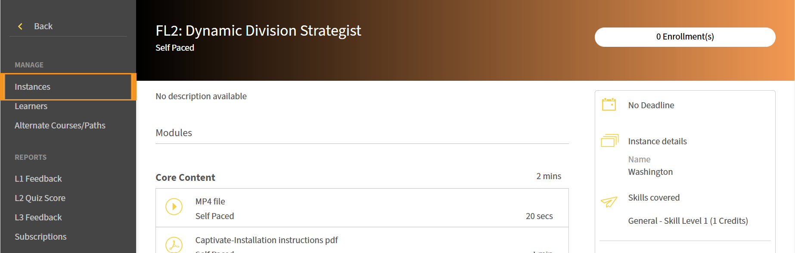

# Einrichten der Registrierung mit einem Klick in Adobe Learning Manager

## So funktioniert die Registrierung mit einem Klick

Für Anmeldungen mit einem Klick sind zwei Adobe Learning Manager-Funktionen (ALM) erforderlich, die zusammenarbeiten:
Deep-Links bieten eine direkte URL zu einem bestimmten Kurs oder Lernobjekt in ALM. Sie können diese Links (direkte URLs zu Modulen) in E-Mails, Intranet-Portale oder Anwendungen von Drittanbietern einbetten. Wenn ein Teilnehmer nicht bereits angemeldet ist, wenn er auf den Link klickt, fordert ALM ihn auf, sich zu authentifizieren, und leitet ihn dann direkt zum Kurs weiter.

Dies ist in der Regel nützlich, wenn die Teilnehmer mitten in der Arbeit sind und Slack oder Teams verwenden oder wenn sie eine kurze zweiminütige Auffrischungsschulung benötigen, bevor sie verreisen oder an einem Meeting oder einem Verkaufsgespräch teilnehmen. Sie können sofort auf die Inhalte zugreifen und sich schulen lassen.
Die Services für die Registrierung registrieren einen Teilnehmer automatisch für einen Kurs, bevor der Deep-Link den Kurs-Player startet. Dadurch wird der manuelle Registrierungsschritt entfernt, der sonst die Erfahrung des Teilnehmers unterbrechen würde.

Wenn ein Teilnehmer einen Registrierungslink mit einem Klick auswählt, registriert ALM sie über die API im Hintergrund und leitet sie dann mithilfe des Deep-Links zum Kurs weiter. Der Kursspieler wird sofort geöffnet.

>[!NOTE]
>
>Die Registrierung erfolgt nur auf Kursebene, nicht jedoch bei Lernobjekten höherer Ordnung (Lernpfade oder Zertifizierungen).

## Deep-Link für ein Modul erstellen

1. Melden Sie sich bei Adobe Learning Manager als Administrator an.
2. Wählen Sie im linken Navigationsbereich **Kurse** aus.
   
3. Kurs auswählen
4. Wählen Sie **Instanzen** aus.
   
5. Wählen Sie den Abschnitt &quot;**Module**&quot; für die Instanz aus, deren Modul-Deep-Links Sie kopieren möchten. Die Moduldetails werden im erweiterten Abschnitt am unteren Rand der Instanz angezeigt.
   
6. Navigieren Sie zu dem Modul, dessen Link Sie kopieren möchten.
   
7. Wählen Sie **Link kopieren**. Der Deep-Link wird nun kopiert. Dieser tiefe Link ist ein Link, um das bestimmte Modul in einem Kurs zu öffnen.

Sie können diesen Deep-Link jetzt verwenden, um ihn an einen Teilnehmer zu senden.
