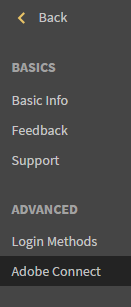

# Integration mit Adobe Connect

Administratoren eines Unternehmens können die Einstellungen des Learning Manager-Kontos konfigurieren, um die Adobe Connect-Integration zu aktivieren.

## Adobe Connect konfigurieren {#configureadobeconnect}

1. Klicken Sie in der Administratoranmeldung auf **[!UICONTROL Einstellungen]** im linken Bereich, um die grundlegenden Informationen zu Ihrem Unternehmen anzuzeigen. Klicken **[!UICONTROL Adobe Connect]** im linken Bereich.

   

   *Wählen Sie im linken Fensterbereich Adobe Connect aus*

1. Klicken **[!UICONTROL Jetzt konfigurieren]** link in **[!UICONTROL Adobe Connect-Konfiguration]** Abschnitt.

   <!---->

1. Geben Sie den Domänennamen und die Anmeldedaten Ihres Unternehmens für die Adobe Connect an.

   

   *Domänennamen und Anmeldeinformationen hinzufügen*

   Beispiel für eine Adobe Connect-URL: mycompany.adobeconnect.com\
   Sie müssen die E-Mail-ID des Administrators des Adobe Connect-Kontos angeben.

   Nur von Adobe gehostete Connect-Konten werden im Lern-Manager unterstützt. Beispiel; &#39;.adobeconnect.com&#39;.

1. Klicken **[!UICONTROL einbinden].**

   Nach der Authentifizierung der E-Mail-ID zeigt Learning Manager die Meldung an, dass Connect erfolgreich integriert wurde. Sie können damit beginnen, Ihre Kurse im virtuellen Klassenzimmer automatisch mit Adobe Connect anzuzeigen.

   Der Adobe Connect-Kontoadministrator muss die Nutzungsbedingungen von Adobe Connect akzeptieren. Wenn dies nicht akzeptiert wird, schlägt die Authentifizierung Ihrer Anmeldung möglicherweise fehl. Melden Sie sich nach der Erstellung des Adobe Connect-Kontos einmal bei dem Konto an. Bei der ersten Anmeldung wird eine Seite mit Nutzungsbedingungen angezeigt.

   <!---->

## Informationen für Sitzung im virtuellen Klassenzimmer hinzufügen {#addvirtualclassroomsessioninformation}

Wenn der Autor eines Kurses im virtuellen Klassenzimmer keine Sitzungsinformationen angegeben hat, kann der Administrator die Sitzungsdetails einbeziehen.

Klicken Sie in der Administratoranmeldung auf den VC-Kursnamen. Klicken **[!UICONTROL Instanzen]** im linken Bereich und klicken Sie auf **[!UICONTROL Sitzungsdetails]**.  Klicken Sie in der rechten Ecke der Seite &quot;Sitzungsdetails&quot; auf das Symbol &quot;Bearbeiten&quot;, um die Sitzungsinformationen hinzuzufügen.

*Informationen für Sitzung im virtuellen Klassenzimmer hinzufügen*

Mit der Integration von Adobe Learning Manager und Adobe Connect zum Erstellen von Modulen oder Sitzungen vom Typ &quot;Virtuelles Klassenzimmer&quot;, sollte Ihr Connect-Konto Meetingräume mit einer ausreichenden Anzahl von Räumen und Benutzer gleichzeitig für Ihren Anwendungsfall unterstützen. Diese Meetingräume werden zum Hosten von Modulen des virtuellen Klassenzimmers in Learning Manager verwendet. Ein neuer Connect-Meetingraum wird vom Learning Manager für jedes Modul oder jede Sitzung eines virtuellen Klassenzimmers in Learning Manager dynamisch erstellt.

Sie müssen Adobe Connect separat erwerben, unabhängig vom Adobe Learning Manager.

## Teilnehmeranwesenheit {#learnersattendance}

Wenn der Veranstalter des Kurses im virtuellen Klassenzimmer nicht an der Sitzung teilnimmt, wird die Anwesenheit der Teilnehmer, die an der Sitzung teilgenommen haben, nicht automatisch registriert. In solchen Fällen kann der Administrator die Anwesenheit manuell aufzeichnen.

Klicken Sie auf den Kurs im virtuellen Klassenzimmer, klicken Sie im linken Teilfenster der folgenden Seite auf &quot;Anwesenheit&quot; und erfassen Sie die Anwesenheit.
