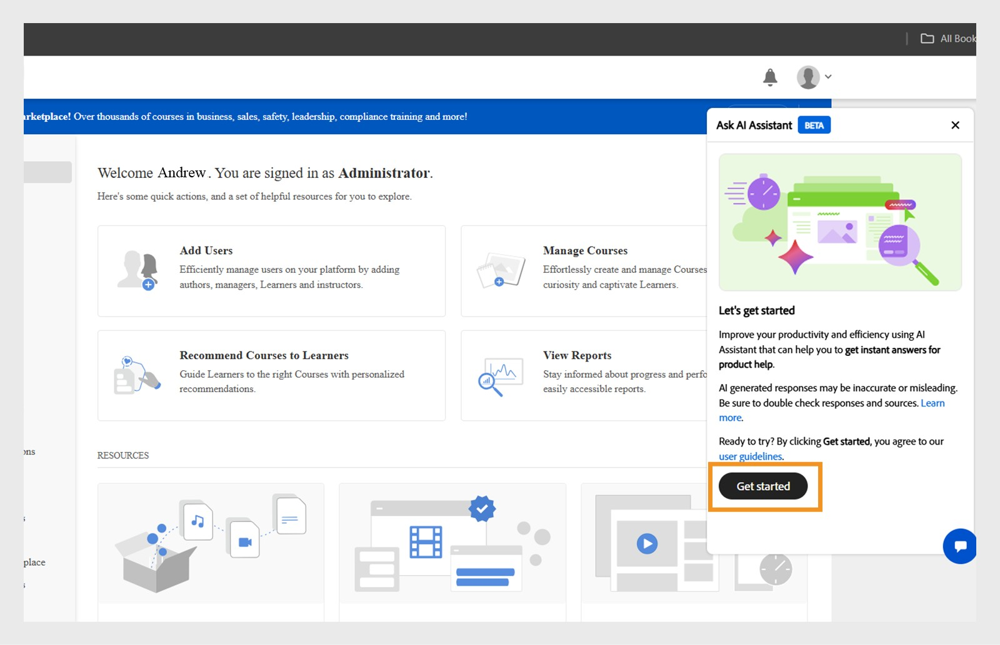

# Admin AI Assistant (Beta) in Adobe Learning Manager

Bei komplexen Lernkonfigurationen können Administratoren aufgrund komplizierter Menüs und unverbundener Arbeitsabläufe Schwierigkeiten haben, Inhalte zu finden oder Aufgaben abzuschließen. Für Aufgaben wie das Ausführen von Berichten oder den Zugriff auf bestimmte Informationen ist es beispielsweise erforderlich, auf mehreren Bildschirmen zu navigieren. Der Admin AI Assistant (Beta) hilft Ihnen dabei, die richtigen Informationen zu finden, um Aufgaben effizient zu verstehen und durchzuführen.

Der Admin AI Assistant (Beta) in Adobe Learning Manager hilft Administratoren dabei, schnell Antworten auf häufige Fragen zu finden, Systemfunktionen zu erkunden und zu verstehen, wie sie wichtige Aufgaben erledigen können, indem sie sie einfach in verständlicher Sprache stellen. Unabhängig davon, ob Sie Adobe Learning Manager noch nicht kennen oder nach schnelleren Möglichkeiten zur Fehlerbehebung suchen: Der Admin AI Assistant (Beta) vereinfacht Ihren Workflow, indem er kontextbezogene Hilfe direkt auf der Plattform bereitstellt.

Es nutzt die KI-Funktionen von Adobe, um Anfragen in natürlicher Sprache über Lerninhalte und System-Workflows hinweg zu ermöglichen.  Administratoren können Fragen stellen wie **Benutzer zu Adobe Learning Manager hinzufügen** oder **Lernpfade hinzufügen**. Der Adobe Learning Manager Admin AI Assistant (Beta) ist ausschließlich in öffentlich zugänglichen, Adobe-eigenen Dokumentationen geschult, wie z. B. Ressourcen, die auf **[!UICONTROL Experience League]** gehostet werden. Es lernt nicht aus Kundeninhalten, internem Schulungsmaterial oder benutzergenerierten Daten und greift nicht darauf zu.

Dieser Assistent reduziert die Abhängigkeit von manueller Navigation, verkürzt die Erkennungszeit und hilft dabei, schnell verwertbare Erkenntnisse zu gewinnen.

<!--## Key benefits

* Perform common administrator tasks faster with conversational guidance.
* Get instant answers without browsing through extensive menus.
* Gain real-time insights and step-by-step guidance for administrative workflows.-->

>[!IMPORTANT]
>
>Es ist nur für Administratoren verfügbar und unterstützt derzeit nur Englisch.

## Datenschutz, Sicherheit und Governance.

Der Admin AI Assistant (Beta) wurde entwickelt, um die Sicherheit und den Datenschutz im Fokus zu halten. Hier das, was ihr erwartet:

* Der Admin AI Assistant (Beta) verwendet keine personenbezogenen Daten, einschließlich Schulungszwecken.
* Es hat keinen Zugriff auf Lerndaten oder -inhalte, die in Adobe Learning Manager gespeichert sind.
* Der Admin AI Assistant (Beta) greift nicht auf personenbezogene Daten (PII) zu oder gibt diese frei und gibt keine privaten oder sensiblen Informationen weiter.
* Von Benutzern bereitgestellte Eingabeaufforderungen (z. B. Fragen oder Abfragen) werden nicht an andere Kunden weitergegeben.

>[!IMPORTANT]
>
>Der Admin AI Assistant (Beta) wird in Phasen eingeführt, wobei Kunden eine Vorankündigung von zwei Wochen erhalten. Wenden Sie sich an Ihren Customer Success Manager (CSM), wenn Sie Unterstützung benötigen.

## So greifen Sie auf den Admin AI Assistant (Beta) zu

Führen Sie die folgenden Schritte aus, um den Admin AI Assistant (Beta) zu starten:

1. Melden Sie sich als ein Administrator an.
2. Klicken Sie auf das Chat-Symbol, um den Admin AI Assistant (Beta) zu starten.

   
   _Wählen Sie die Chat-Sprechblase aus, um den Admin AI Assistant (Beta) zu starten_

   >[!NOTE]
   >
   >Wenn Sie den Admin AI Assistant (Beta) zum ersten Mal starten, müssen Sie Ihre Zustimmung geben, bevor Sie ihn verwenden können. Das Zustimmungsdialogfeld wird nur während dieses ersten Starts angezeigt. Für alle nachfolgenden Starts werden Sie direkt zum Admin AI Assistant (Beta) weitergeleitet, wo Sie Ihre Eingabeaufforderungen eingeben können.

3. Wählen Sie **[!UICONTROL Erste Schritte]**. Sie können jetzt den Admin AI Assistant (Beta) verwenden.

   
   _Aufforderung, die Nutzungsrichtlinie vor der ersten Verwendung zu akzeptieren_

## So verwenden Sie den Admin AI Assistant (Beta)

So verwenden Sie den Admin AI Assistant (Beta):

1. Geben Sie Ihre Eingabeaufforderung ein und drücken Sie die **[!UICONTROL Eingabetaste]**. Die Antwort wird im Admin AI Assistant (Beta) angezeigt.

   
   _Eine Beispielabfrage und Antwort vom Admin AI Assistant (Beta)_

### Beispielaufforderungen

Im Folgenden finden Sie einige Beispiel-Eingabeaufforderungen, die Administratoren verwenden können, um den Admin AI Assistant (Beta) effektiv zu nutzen:

* **Kurs einem Benutzer zuweisen**
   * **Eingabeaufforderung**: &quot;Wie kann ich einem Benutzer einen Kurs zuweisen?&quot;

  
  _Antwort auf die Eingabeaufforderung Wie weise ich einem Benutzer einen Kurs zu_

* **Neuester Registrierungsbericht**
   * **Eingabeaufforderung**: Zeigt den neuesten Registrierungsbericht an.

  
  _Antwort auf die Eingabeaufforderung Letzten Registrierungsbericht anzeigen_

* **Benutzer löschen**
   * **Eingabeaufforderung**: &quot;Wie kann ich einen Benutzer löschen?&quot;

  
  _Antwort auf die Eingabeaufforderung Wie kann ich einen Benutzer löschen_

### Tipps für die effektive Verwendung des Admin AI Assistant (Beta)

* **Geben Sie Ihre Eingabeaufforderungen genau an**: Wenn Sie eine Frage stellen, geben Sie einen klaren Kontext und Details an. Anstatt zu fragen, wie ich einen Benutzer in Adobe Learning Manager hinzufüge, fragen Sie beispielsweise: &quot;Wie weise ich einem Benutzer in Adobe Learning Manager einen Kurs zu?&quot;
* **Klare und prägnante Formulierungen verwenden**: Halten Sie Ihre Fragen einfach und zielgerichtet. Dadurch kann der Admin AI Assistant (Beta) Ihre Absicht verstehen und eine genauere Antwort darauf geben.
* **Verschiedene Möglichkeiten erkunden**: Fragen Sie nach einer Vielzahl von Funktionen, wie Registrierungsberichten, Teilnehmerfortschritt, Inhaltszuweisung oder Zertifizierungsverfolgung, um den gesamten verfügbaren Support zu erfahren.
* **Feedback geben**: Nachdem Sie eine Antwort erhalten haben, teilen Sie uns mit, ob diese hilfreich war. Verwenden Sie die Funktionen &quot;Daumen hoch&quot;, &quot;Daumen runter&quot;, &quot;Bericht&quot; oder &quot;Kommentar&quot;, um Ihr Feedback zu teilen. Ihr Feedback spielt eine Schlüsselrolle bei der Verbesserung des Assistenten.

## Feedback zu den Antworten des Admin AI Assistant (Beta) geben

Ihr Feedback zu den vom Admin AI Assistant (Beta) generierten Antworten trägt dazu bei, die Genauigkeit, Relevanz und Gesamtleistung des Assistenten zu verbessern.

### Antwort mögen oder ablehnen

* Wählen Sie **[!UICONTROL Miniaturansichten]**, wenn die Antwort hilfreich und korrekt war.
* Wählen Sie **[!UICONTROL Miniaturansichten]**, wenn die Antwort falsch oder nicht hilfreich war.

### Markieren von Antworten

Führen Sie die folgenden Schritte aus, um eine Antwort zu markieren:

1. Wählen Sie am Ende der Antwort **[!UICONTROL Flag]** aus.

   
   _Bericht im Bildschirm &quot;Admin AI Assistant&quot; auswählen_

2. Wählen Sie einen oder mehrere Gründe aus, fügen Sie bei Bedarf Kommentare hinzu, und wählen Sie dann **[!UICONTROL Senden]** aus.

   
   _Administratoren bewerten die Antwort mithilfe der Daumen nach oben oder unten mit optionalen Kommentaren_

Adobe verwendet dieses Feedback, um den Admin AI Assistant (Beta) im Laufe der Zeit zu verbessern.

## Häufig gestellte Fragen

+++Kann ich den Admin AI Assistant (Beta) als Teilnehmer verwenden?

Anzahl Dieser Assistent ist nur für Administratoren verfügbar.

+++

+++Ist sie in der mobilen App verfügbar?

Zu diesem Zeitpunkt nicht.

+++

+++Kann sie Administratoraktionen ausführen?

Anzahl Der Admin AI Assistant (Beta) bietet nur Anleitung.

+++

+++Wird sie weitere Sprachen unterstützen?

Das Adobe Learning Manager-Team bewertet die Unterstützung mehrerer Sprachen für zukünftige Updates.

+++
