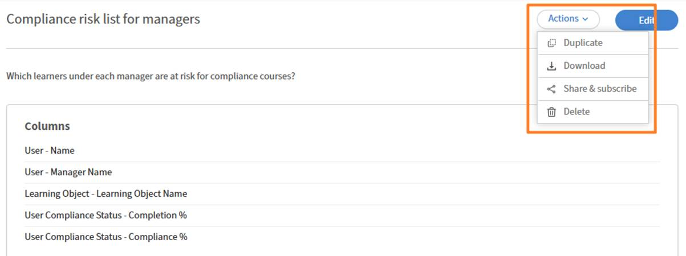

# Hinzufügen und Kombinieren von Filtern in einem Bericht

Mit Filtern können Sie den Umfang Ihres Berichts genau an die Datensätze anpassen, die Sie benötigen. Sie können einen einzelnen Filter anwenden, mehrere Filter mit UND- oder ODER-Logik kombinieren und verschachtelte Gruppen für komplexe Bedingungen erstellen.

## Filter hinzufügen.

Verwenden Sie Filter, um den Bericht auf einen bestimmten Teil der Daten zu beschränken, anstatt alles anzuzeigen.

Beispielsweise möchten Sie möglicherweise wissen, wie viele Teilnehmer sich in den letzten 365 Tagen für Kurse registriert haben. In diesem Fall wenden Sie einen Datumsfilter auf das Registrierungsdatum an, um nur die letzten Aktivitäten einzuschließen.

1. Starten Sie den Report Builder, und wählen Sie **Bericht erstellen**.
2. Geben Sie den Namen und die Beschreibung des Berichts ein\.
3. Wählen Sie die folgenden Spalten aus: &lt;`dataset>:<column name>`
a. Registrierungsdatum
b. Benutzername
   
4. Wählen Sie im Abschnitt &quot;Berichte&quot; **Filter hinzufügen**.
5. Suchen Sie nach dem Feld, nach dem Sie filtern möchten, oder navigieren Sie zu diesem Feld. Wählen Sie in diesem Beispiel **Registrierungsdatum**.
   
6. Wählen Sie **Hinzufügen** aus.
7. Wählen Sie einen Operator. Die verfügbaren Operatoren hängen vom Datentyp des Felds ab:
a. Zeichenfolgenfelder - enthält, entspricht, beginnt mit
b. Numerische Felder - größer als, kleiner als, gleich, zwischen
c. Datumsfelder — ist gleich, vorher, nachher, dazwischen, letzte N Tage
d. Listenfelder (Enumerationsfelder) - ist in, ist nicht in
8. In diesem Fall wählen Sie **innerhalb des letzten Jahres**.
   
9. Wählen Sie **Bericht speichern** aus, und wählen Sie **Aktionen** > **Download** aus, um den Bericht herunterzuladen.

Der heruntergeladene Bericht listet alle Benutzer auf, die sich in den letzten 365 Tagen für ein Lernobjekt registriert haben.

### Hinzufügen mehrerer Filter mit UND/ODER-Logik

Wenn Sie einen zweiten Filter hinzufügen, lautet die Standardbeziehung zwischen Filtern AND; Beide Bedingungen müssen wahr sein, damit eine Zeile angezeigt wird.

Beispielsweise können Sie Teilnehmer identifizieren, die sich in den letzten 365 Tagen für Kurse registriert haben UND einen Bericht an einen bestimmten Manager senden. In diesem Fall müssen beide Bedingungen wahr sein, d. h., Filter werden mithilfe der UND-Logik kombiniert.

1. Starten Sie den Report Builder, und wählen Sie **Bericht erstellen**.
2. Geben Sie den Namen und die Beschreibung des Berichts ein.
3. Wählen Sie die folgenden Spalten aus: `<dataset>:<column name>`
a. Benutzername
b. Name des Benutzer-Managers
c. Registrierungsdatum
   

4. Gruppieren Sie nach der Spalte &quot;**Benutzer-Manager-Name**&quot;.
5. Wählen Sie im Abschnitt **Filter** die folgenden Filter aus:
a. Registrierungsdatum **liegt innerhalb des letzten Jahres**
b. Der Benutzer-Manager-Name &quot;**&quot; beginnt mit N**.
c. Der Benutzer-Manager-Name &quot;**&quot; ist nicht leer.**
   
6. Wählen Sie **Bericht speichern** aus, und wählen Sie **Aktionen** > **Download** aus, um den Bericht herunterzuladen.

Der heruntergeladene Bericht listet alle Benutzer auf, die sich in den letzten 365 Tagen für ein Lernobjekt registriert haben, und berichtet an einen Manager, dessen Name mit N beginnt.

### Verschachtelte Filtergruppen erstellen

Mit verschachtelten Gruppen können Sie Bedingungen mit mehreren logischen Ebenen erstellen, die Klammern in einer Formel entsprechen\. Beispiel: (Katalog = Sicherheit ODER Katalog = Hygiene) UND Ausfülldatum sind die letzten 90 Tage.

Verwenden Sie verschachtelte Filtergruppen, wenn Ihre Logik eine Mischung aus AND- und OR-Bedingungen enthält, die zusammen ausgewertet werden müssen.

Verwenden Sie beispielsweise eine verschachtelte Filterlogik, um unvollständige Registrierungen zu identifizieren, bei denen die Teilnehmer einen Fortschritt von unter 50 % oder eine überfällige Schulung haben, was zeigt, wie UND- und ODER-Bedingungen zusammenwirken.

1. Starten Sie **Report Builder**, und wählen Sie **Bericht erstellen** aus.
2. Geben Sie den Namen und die Beschreibung des Berichts ein.
3. Wählen Sie die folgenden Spalten aus: `<dataset>:<column name>`
a. Registrierung - Status
b. Registrierung - Fortschritt in Prozent
c. Registrierung - Überfällig
   
4. Wählen Sie im Abschnitt **Filter** die folgenden Filter aus:
a. Der Registrierungsstatus **entspricht keinem von** Abgeschlossen.
b. Wählen Sie **+** aus.
c. Suchen Sie nach &quot;Enrollment-Progress Percent&quot;.
d. Wählen Sie den Filter aus.
e. Wählen Sie **Als Gruppe hinzufügen**.
   
f. Registrierungsfortschritt hinzufügen: Prozent **kleiner als** 50
   
g. Wählen Sie **+** aus.
h. Suchen Sie nach &quot;Registrierungsüberfällig&quot;.
i. Wählen Sie den Filter aus.
j. Wählen Sie **Als Gruppe hinzufügen**.
   
k. &quot;Überfällige Einschreibung hinzufügen&quot; ist gleich &quot;TRUE&quot;.
l Ändern Sie das verschachtelte AND in OR.
   
5. Wählen Sie **Bericht speichern** aus, und wählen Sie **Aktionen** > **Download** aus, um den Bericht herunterzuladen.

Der heruntergeladene Bericht listet alle Registrierungen auf, die ausgeführt werden oder nicht gestartet wurden, deren Fortschritt in Prozent weniger als 50 % beträgt oder überfällig sind.
