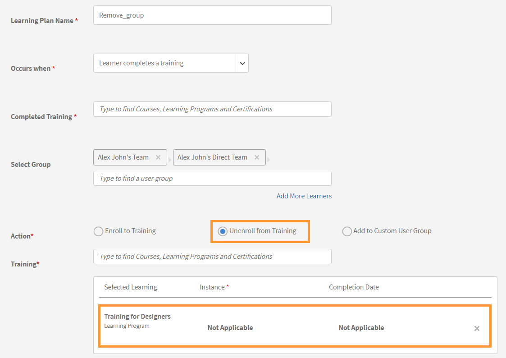

# Erstellen eines Trendberichts im Report Builder

Trendberichte zeigen, wie sich Metriken wie Kursanzahl, Anzahl der Registrierungen oder Abschlüsse im Laufe der Zeit ändern. Sie wählen eine Datumsspalte und eine Trendgranularität (Tag, Woche oder Monat) aus, und der Report Builder gruppiert die Daten nach diesem Zeitraum.

## Was Trenddaten bedeuten

Trendberichte im Report Builder enthalten **einen aktuellen Snapshot der Daten, gruppiert nach Datum**. Sie zeigen nicht den historischen Status der Daten zu jedem früheren Datum an.

Beispielsweise zeigt ein Trend zu monatlichen Anmeldungen die Anzahl der Anmeldungen an, die heute vorhanden sind und über die Monate, in denen sie erstellt wurden, verteilt sind. Wenn sich ein Teilnehmer im Januar registriert und später die Registrierung aufgehoben hat, wird dieser Registrierungsdatensatz möglicherweise nicht mehr angezeigt. Der Bericht spiegelt den aktuellen Stand der Aufzeichnungen wider, nicht das, was im Januar der Fall war.

Dies ist eine wichtige Unterscheidung für Prüfungszwecke. Wenn Sie historische Point-in-Time-Daten benötigen, verwenden Sie diesen Bericht für die Analyse von Richtungstrends und nicht für präzise historische Datensätze.

## Erstellen eines Trendberichts zur Kursanzahl

Dieser Bericht zeigt, wie viele Kurse dem Konto monatlich hinzugefügt wurden.

1. Wählen Sie **Berichte** > **Report Builder** aus und wählen Sie dann die Registerkarte **Berichte** aus.
2. Wählen Sie **Bericht erstellen**. Geben Sie einen Namen ein, z. B. Kursanzahl MoM.
3. Fügen Sie **Lernobjekt-ID** aus dem **Lernobjekt**-Dataset hinzu.
4. Fügen Sie **Erstellungsdatum** aus dem **Lernobjekt**-Datensatz hinzu.
   
5. **Gruppe von** anwenden auf **Erstellungsdatum**. Legen Sie die Trendgranularität auf **Monat** fest.
   
6. Wenden Sie **Anzahl** auf **Lernobjekt-ID** an. Geben Sie die Anzahl der Alias-Kurse ein.
   
7. Sortieren Sie nach **Erstellungsdatum** aufsteigend, um den Trend chronologisch anzuzeigen.
   
8. Wählen Sie **Bericht speichern** aus, und wählen Sie **Aktionen** > **Download** aus, um den Bericht herunterzuladen.

Die heruntergeladene Datei besteht aus einem monatlichen Trend zur Kurserstellung und zeigt die Anzahl der im Laufe der Zeit erstellten Kurse an. Es hilft dabei, Kursproduktionsmuster, Spitzen, Rückgänge und das allgemeine Inhaltswachstum zu verfolgen.

## Erstellen eines Trendberichts zu katalogbezogenen Abschlüssen

Dieser Bericht zeigt die monatlichen Abschlusssummen pro Katalog über einen definierten Zeitraum an.

1. Wählen Sie **Berichte** > **Report Builder** aus und wählen Sie dann die Registerkarte **Berichte** aus.
2. Wählen Sie **Bericht erstellen**. Geben Sie einen Namen ein, z. B. &quot;Catalog completed MoM&quot; (Katalogabschlüsse).
3. Fügen Sie **Katalogname** aus dem **Katalog**-Dataset hinzu.
4. Fügen Sie **Abgeschlossenes Datum** aus dem **Modultranskript**-Dataset hinzu.
5. Fügen Sie **Lernobjekt-ID** aus dem **Lernobjekt**-Datensatz hinzu, um die Abschlüsse zu zählen.
6. **Gruppe von** auf **Katalogname** anwenden. Wenden Sie außerdem **Gruppe von** am **Abgeschlossen am** mit **Monat** Granularität an.
   
7. Wenden Sie **Anzahl** auf **Lernobjekt-ID** an. Geben Sie den Alias &quot;Abschlüsse insgesamt&quot; ein.
8. Filter hinzufügen: **Katalog** befindet sich in Sicherheit, POS, Lieferung (oder den für Ihr Konto relevanten Katalogen).
9. Filter hinzufügen: **Das Abschlussdatum** liegt innerhalb des letzten Jahres.
   
10. Sortieren nach **Abgeschlossen am** aufsteigend.
   
11. Wählen Sie **Bericht speichern** aus, und wählen Sie **Aktionen** > **Download** aus, um den Bericht herunterzuladen.

## Best Practices

* Verwenden Sie **Abschlussdatum** für Abschlusstrends und **Registrierungsdatum** für Registrierungstrends. Das Verwenden des falschen Datumsfelds führt zu irreführenden Ergebnissen.
* Fügen Sie einen Datumsfilter hinzu, um den Trend auf ein aussagekräftiges Fenster zu beschränken, z. B. die letzten 12 Monate für einen monatlichen Trend oder die letzten 8 Wochen für einen wöchentlichen Trend.
* Kennzeichnen Sie Ihren Trendbericht mit der Granularität und dem Datumsbereich im Namen, z. B. &quot;Catalog completed MoM - last 3 months&quot; (Katalog schließt MoM ab - letzte 3 Monate), sodass klar ist, wann Sie ihn später anzeigen.
