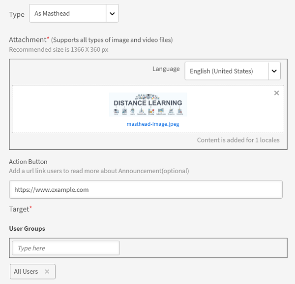

# Ankündigungen

Eine Ankündigung ist eine Multimedia-Nachricht (Text, Bild oder Video), die ein Administrator an eine definierte Gruppe von Benutzern sendet.

Der Administrator kann Ankündigungen an Teilnehmer senden, um sie über das Eintreten eines Ereignisses oder eine Aktivität zu informieren. Die Ankündigung kann eine Kombination aus Text, Bildern oder Videos sein. Sie können Lernobjekte wie Kurse, Lernprogramme und Zertifizierungen mit einer Ankündigung verknüpfen.

Es gibt vier Arten von Ankündigungen:

* Benachrichtigung
* Mastertitel
* Empfehlung
* Email

## Benachrichtigung {#notification}

1. Klicken Sie als Administrator im linken Bereich auf &quot;Ankündigungen&quot;.
1. Klicken Sie in der rechten oberen Ecke der Seite auf Hinzufügen .
1. Wählen Sie in der Dropdownliste &quot;Typ&quot; die Option **Als Benachrichtigung**.
1. Fügen Sie im Feld Nachricht die Nachricht für die Ankündigung hinzu. Hier können Sie auch eine Ankündigungs-URL hinzufügen. Sie müssen die URL jedoch im HTML-Formular hinzufügen.

   Beispiel:  `code <a href="http://www.w3schools.com" target="_blank">Visit W3Schools</a>.`

   Wenn Sie &quot;target=&quot;_blank&quot;&quot;&quot; angegeben haben und ein Benutzer auf die Ankündigungs-URL klickt, wird der Link auf einer neuen Registerkarte geöffnet. Wenn Sie &quot;target&quot; nicht angeben, wird der Link im selben Browser geöffnet.

1. Optional können Sie Anhänge wie Bilder oder Videodateien zur Ankündigung hinzufügen.
1. Wählen Sie die Zielbenutzergruppen oder die Ziel-Lernobjekte aus. Sie können für eine Ankündigung nur jeweils eines davon auswählen.

   Beginnen Sie mit der Eingabe des Namens der Benutzergruppe in das Textfeld und wählen Sie den Namen aus der Dropdown-Liste aus. Wählen Sie auf dieselbe Weise die Schulung, indem Sie den Objektnamen in das Textfeld eingeben.

1. Klicken Sie im Dialogfeld auf &quot;Erweiterte Einstellungen&quot;. Sie können die folgenden Aktionen ausführen:

   * Aktivieren Sie das Kontrollkästchen &quot;Ankündigungsnotizen aktivieren&quot;, um diese Ankündigung in eine Kurznotiz umzuwandeln.
   * Wählen Sie die Lieferzeit für die Ankündigung aus.

1. Auswählen **[!UICONTROL An einem Datum]** , wenn Sie die Ankündigung für ein späteres Datum planen möchten, und klicken Sie auf den Textbereich daneben. Ein Kalenderpopup wird angezeigt, in dem Sie das Startdatum auswählen können. Wählen Sie auf dieselbe Weise das Enddatum.
1. Klicken **[!UICONTROL Speichern]**.
1. Klicken Sie auf der Registerkarte &quot;Entwürfe&quot; auf das Symbol &quot;Einstellungen&quot; neben einer Ankündigung und dann auf &quot;Senden&quot;.

Wenn die Multimedia-Anlage sehr groß ist, kann der Upload etwas Zeit in Anspruch nehmen. Nachdem Sie auf &quot;Speichern&quot; geklickt haben, wird ein Popup mit einer Meldung angezeigt, während der Upload verarbeitet wird. Sie erhalten eine Benachrichtigung, nachdem der Anhang erfolgreich hochgeladen wurde.

## Mastertitel {#masthead}

Wenn Sie diese Option auswählen, wird jede Mediendatei, die Sie auswählen, auf der Teilnehmer-Startseite als Mastertitel angezeigt. Der Mastertitel fungiert als Aktionsaufruf für die Teilnehmer, für die er bestimmt ist.

*Den Mastertitel anpassen*

1. Wählen Sie ein Bild aus, das den Mastertitel repräsentiert. Die empfohlene Größe beträgt 1280 x 360 px.
1. Wählen Sie das Gebietsschema aus, dem Sie einen Mastertitel hinzufügen möchten. Für jede Sprache müssen Sie ein Mastertitel-Asset auswählen.
1. Im Dialogfeld &quot; **[!UICONTROL Aktionsschaltfläche]** eine URL hinzu, sodass Teilnehmer zu dieser URL umgeleitet werden, wenn sie auf die Schaltfläche auf dem Mastertitel klicken. Dieses Feld ist optional.
1. Wählen Sie die Zielbenutzergruppen oder die Ziel-Lernobjekte aus. Sie können für eine Ankündigung nur jeweils eines davon auswählen.

   Beginnen Sie mit der Eingabe des Namens der Benutzergruppe in das Textfeld und wählen Sie den Namen aus der Dropdown-Liste aus. Wählen Sie auf dieselbe Weise die Schulung, indem Sie den Objektnamen in das Textfeld eingeben.

1. Im Dialogfeld &quot; **[!UICONTROL Erweiterte Einstellungen]** &quot; haben Sie die folgenden Optionen:

   * Klicken **[!UICONTROL Sofort]** , wenn die Ankündigung sofort veröffentlicht werden soll.
   * Klicken **[!UICONTROL Nie]** , wenn Ihre Ankündigung nicht ablaufen soll.
   * Wählen Sie das **[!UICONTROL Start]** und **[!UICONTROL Ende]** die Termine für die Ankündigung.

   

   *Festlegen der Anzeigedauer eines Mastertitels*

**Gibt es eine Beschränkung der Anzahl der Live-Ankündigungen von Mastertiteln?**

Sie sehen nur die letzten 10 Mastertitel-Ankündigungen.

## Empfehlung {#recommendation}

Wenn Sie diese Option auswählen, wird jede von Ihnen ausgewählte Schulung bestimmten Benutzergruppen empfohlen. Die Empfehlungen basieren auf einem Machine Learning-Algorithmus.

*Auswählen der empfohlenen Schulung, die einem Teilnehmer angezeigt werden soll*

1. Wählen Sie die Schulung aus, die Sie den Teilnehmern empfehlen möchten. Sie können bis zu 10 Schulungen hinzufügen.

   Teilnehmer sehen nur die nicht registrierten Schulungen in &quot;Empfehlung nach Organisation&quot;. Abhängig von der Katalogsichtbarkeit hat der Teilnehmer Zugriff auf die Schulung.

1. Wählen Sie die Zielbenutzergruppen oder die Ziel-Lernobjekte aus. Sie können für eine Ankündigung nur jeweils eines davon auswählen.

   Beginnen Sie mit der Eingabe des Namens der Benutzergruppe in das Textfeld und wählen Sie den Namen aus der Dropdown-Liste aus. Wählen Sie auf dieselbe Weise die Schulung, indem Sie den Objektnamen in das Textfeld eingeben.

1. Im Abschnitt &quot;Erweiterte Einstellungen&quot; stehen Ihnen die folgenden Optionen zur Verfügung:

   * Klicken **[!UICONTROL Sofort]** , wenn die Ankündigung sofort veröffentlicht werden soll.
   * Klicken **[!UICONTROL Nie]** , wenn Ihre Ankündigung nicht ablaufen soll.
   * Wählen Sie das **[!UICONTROL Start]** und **[!UICONTROL Ende]** die Termine für die Ankündigung.

   <!---->

Wenn Sie auf **[!UICONTROL Speichern]** können Sie die Ankündigung entweder sofort veröffentlichen oder später. Die Ankündigung befindet sich bis dahin in einem Entwurfsstatus.

* Mastertitel/Recommendations lösen keine Benachrichtigungen aus.
* Mastertitel/Recommendations werden im Bericht zu Ankündigungen nicht angezeigt.

## Listen für Entwürfe, geplante und gesendete Ankündigungen {#draftscheduledandsentlist}

Bei der Administratoranmeldung können Sie alle Ankündigungen in drei Registerkarten wie Entwürfe, Geplant und Gesendet anzeigen.

<!---->

### Entwurf {#draft}

Auf der Registerkarte &quot;Entwürfe&quot; können Sie alle Ankündigungen anzeigen, die von einem Administrator erstellt, aber noch nicht für die Übermittlung eingeplant oder gesendet wurden.

Standardmäßig wird für alle Ankündigungen die sofortige Übermittlung festgelegt. Wenn Sie bei einer nicht geplanten Ankündigung die Option &quot;Einstellungen&quot; > &quot;Senden&quot; auswählen, wird die Ankündigung sofort gesendet. Um einen Sendezeitpunkt für eine Ankündigung festzulegen, müssen Sie in den erweiterten Einstellungen das Start- und Enddatum wählen.

### Geplant {#scheduled}

Auf der Registerkarte &quot;Geplant&quot; können Sie alle Ankündigungen anzeigen, die für die Übermittlung zu einem späteren Zeitpunkt geplant sind.

### Gesendet {#sent}

Auf der Registerkarte &quot;Gesendet&quot; können Sie alle Ankündigungen anzeigen, die bereits gesendet wurden.

## Als E-Mail

Verwenden Sie diese Option, um gezielte Ad-hoc-E-Mails an Teilnehmer einer ausgewählten Benutzergruppe oder an Teilnehmer zu senden, die an einer bestimmten Schulung angemeldet sind.

*Ad-hoc-E-Mails an Teilnehmer senden*

*Der Administrator erstellt eine E-Mail-Ankündigung*

1. Auswählen **[!UICONTROL Als E-Mail-Adresse eingeben]**.
1. Geben Sie den E-Mail-Betreff und den Nachrichtentext ein.
1. Im Abschnitt &quot;Ziel&quot; haben Sie folgende Möglichkeiten:

   * Benutzergruppe auswählen ODER
   * Wählen Sie einen Kurs aus. Wenn der Kurs mehrere Instanzen hat, können Sie die gewünschte Instanz auswählen.

1. Klicken **[!UICONTROL Speichern]**.
