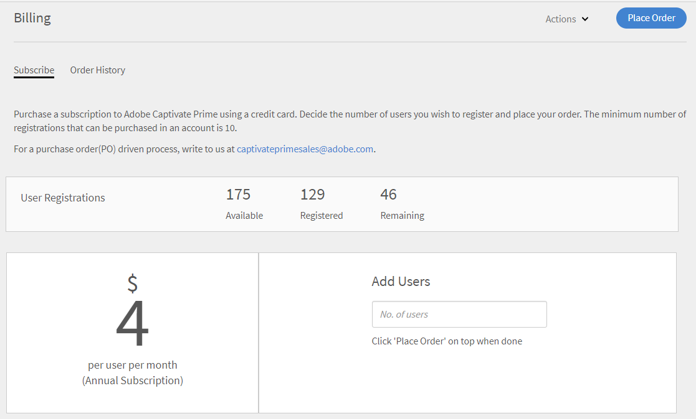
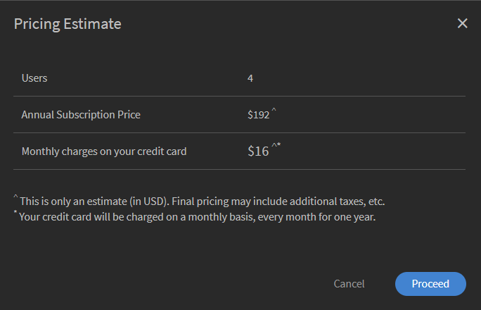
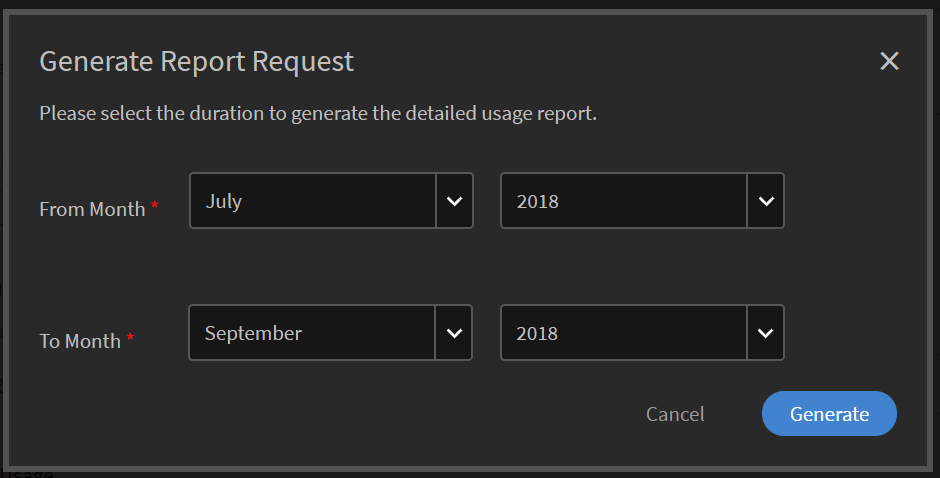

# Verwalten von Learning Manager-Bestellungen und -Abrechnungen

Kreditkartenbasierte Käufe sind nur in der Region [USA](http://learningmanager.adobe.com/) verfügbar.

Verwalten Sie die Learning Manager-Abrechnung, erteilen Sie Bestellungen mit einer Kreditkarte, abonnieren Sie mit einer Bestellung oder über einen monatlichen Aktivbenutzerplan.

Das Preisgestaltungsmodell von Adobe Learning Manager ist flexibel, kundenfreundlich und eines der besten für die Bedürfnisse Ihres Unternehmens. Weitere Informationen finden Sie auf der [Learning Manager](https://www.adobe.com/products/learningmanager.html)-Seite.

Nur Administratoren Ihres Unternehmens können die Rechnungsfunktion verwalten.

Wenn Sie mit Adobe Kontakt aufnehmen möchten, um weitere Informationen zum Abonnement und zur Abrechnung von Learning Manager zu erhalten, senden Sie eine E-Mail an [learningmanagersales@adobe.com](mailto:learningmanagersales@adobe.com).

## Die Abrechnungsseite

Um auf die Abrechnungsseite zuzugreifen, melden Sie sich bei Adobe Learning Manager als Administrator an und wählen im linken Navigationsbereich **[!UICONTROL Abrechnung]** aus.

Die Seite &quot;Abrechnung&quot; enthält die folgenden Registerkarten:

| Tabulator | Zweck |
|---|---|
| **Abonnement** | Hier können Sie Kontodetails, Lizenzberechtigungen und Lizenznutzung anzeigen. Planaktivierung verwalten. |
| **Bestellverlauf** | Überprüfen Sie frühere Bestellungen für das Konto. |

### Registerkarte &quot;Abonnement&quot;

**Kontodetails**

Die Karte **Kontodetails** oben auf der Registerkarte **Abonnement** zeigt vier schreibgeschützte Bezeichner für Ihr Konto an.

| Feld | Beschreibung |
|---|---|
| **ECCID** | Adobe-Referenznummer für Ihr Konto. Wenden Sie sich an den Adobe-Support. |
| **Konto-ID** | Deine eindeutige Adobe Learning Manager-Kontokennung. |
| **Kontoname** | Der Anzeigename Ihres Adobe Learning Manager-Kontos. |
| **IMS-Organisations-ID** | Die mit diesem Konto verknüpfte Adobe Admin Console-Organisation. Leer, falls noch nicht verknüpft. |

**Lizenzen**

Im Abschnitt **Lizenzen** werden alle aktiven Lizenzen oder Berechtigungen für das Konto aufgelistet. Jeder Block enthält den Lizenznamen, ggf. eine Planbeschreibung und eine Statistikzeile mit den Verbrauchszahlen für die aktuelle Vertragslaufzeit.

Die Spalten in der Statuszeile variieren je nach Lizenztyp:

| Lizenztyp | Angezeigte Spalten |
|---|---|
| Bezahlte Lizenz (z. B. Adobe Learning Manager Ultimate) | Gekauft/verwendet/Von Peer-Konten verwendet/Verbleibend |
| Testlizenz (z. B. Virtual Coach) | Verfügbar/Verwendet/Verbleibend |

Wählen Sie **[!UICONTROL Nutzungsdetails anzeigen]** unterhalb der Statistikzeile aus, um eine Inline-Aufschlüsselung zu erweitern. Im erweiterten Abschnitt wird Folgendes angezeigt:

- Ein Dropdown-Menü **Zeitraum auswählen** zum Filtern nach Vertragszeitraum, einschließlich historischer Zeiträume
- Eine **Tabelle für die Gesamtnutzung** mit Spalten: Von diesem Konto erworben/verwendet/Von Peer-Konten verwendet/Verbleibend
- Ein Link **Kontoaufschlüsselung anzeigen**, um die über einzelne Peer-Konten verteilte Nutzung anzuzeigen
- Ein Link **Detaillierten Bericht herunterladen**, um Nutzungsdaten als Datei zu exportieren

**Agent Orchestrator-Lizenzblock**

Wenn eine Agent Orchestrator-Lizenz verknüpft ist, wird in der Statuszeile Folgendes angezeigt:

| Spalte | Beschreibung |
|---|---|
| **Gekauft** | Für die Vertragslaufzeit erworbene KI-Credits der Generation insgesamt. |
| **Verwendet** | Credits, die über alle Services genutzt werden, die diese Lizenz verwenden. |
| **Wird von ALM verwendet** | Credits, die speziell von Adobe Learning Manager belegt werden. |
| **Verbleibend** | Credits sind noch verfügbar. |

Wenn Ihre Organisation übergeordnete und untergeordnete Konten verwendet, wird im Abschnitt &quot;**Lizenzen**&quot; des übergeordneten Kontos eine Spalte &quot;**Von Peer-Konten verwendet**&quot; angezeigt, die den Kreditverbrauch aller verknüpften untergeordneten Konten widerspiegelt. Untergeordnete Konten zeigen ihre Zuordnung als **Lizenzen sanktioniert** an, nicht als gekauft.

## Verknüpfen Ihres Adobe Learning Manager-Kontos mit Adobe Admin Console

Bevor die Funktionen von Gen AI aktiviert werden können, muss Ihr Adobe Learning Manager-Konto mit einer Adobe Admin Console-Organisation verbunden sein. Nach dem Verknüpfen erkennt Adobe Learning Manager die Agent Orchestrator-Lizenz und stellt die Registerkarte **Credits** zur Verfügung.

Die Verknüpfung wird automatisch eingerichtet, wenn Ihr Konto über den Standardbestellvorgang von Adobe erworben wurde oder wenn Sie Ihr Konto über einen Aktivierungsschlüssel aktiviert haben. Sie können den Link auf der Registerkarte **Abonnement** überprüfen. Wenn das Feld **IMS-Organisations-ID** in **Kontodetails** ausgefüllt ist, ist das Konto bereits verknüpft.

### Ihr Konto manuell verknüpfen

Wenn Ihr Konto unabhängig eingerichtet wurde und das Feld **IMS-Organisations-ID** leer ist, erstellen Sie eine manuelle Verknüpfung.

**Voraussetzungen:**
- Sie müssen Administrator des Adobe Learning Manager-Kontos sein.
- Sie müssen die Systemadministratorrolle in der Adobe Admin Console-Organisation innehaben, die Sie verknüpfen möchten.
- Die Adobe Admin Console-Organisation muss über eine aktive Agent Orchestrator-Lizenz verfügen.

1. Wählen Sie **[!UICONTROL Abrechnung]** und dann die Registerkarte **[!UICONTROL Abonnement]** aus.
2. Wählen Sie auf der Karte **Kontodetails** die Option **[!UICONTROL IMS-Organisation verknüpfen]** aus.
3. Ein Anmeldefenster wird geöffnet. Geben Sie die Anmeldeinformationen für Ihr Adobe-Konto ein und wählen Sie Ihr Unternehmen aus der Liste aus. Adobe Learning Manager bestätigt, dass für das angemeldete Konto die Rolle &quot;Systemadministrator&quot; in der Adobe Admin Console-Organisation und für das gleiche Konto die Rolle &quot;Administrator&quot; in Adobe Learning Manager vorhanden ist.
4. Wenn beide Prüfungen erfolgreich verlaufen, wird die Verknüpfung hergestellt. Das Feld **IMS-Organisations-ID** wird mit dem Bezeichner Ihrer Organisation aktualisiert, und das Guthaben wird im Abschnitt **Lizenzen** angezeigt.
5. Wenn eine der beiden Prüfungen fehlschlägt, wird eine Fehlermeldung angezeigt. Bestätigen Sie die oben genannten Voraussetzungen und versuchen Sie es erneut.

### Verknüpfung Ihres Kontos aufheben

Nach dem Aufheben der Verknüpfung werden die Funktionen von Gen AI für alle Teilnehmer deaktiviert, und die Registerkarte **Credits** ist nicht verfügbar, bis das Konto erneut verknüpft wird.

1. Wählen Sie **[!UICONTROL Abrechnung]** und dann die Registerkarte **[!UICONTROL Abonnement]** aus.
2. Wählen Sie auf der Karte **Kontodetails** die Option **[!UICONTROL Verknüpfung der IMS-Organisation aufheben]** aus.
3. Melden Sie sich erneut an, um Ihre Administratorrolle in der Organisation zu bestätigen.
4. Der Link wird entfernt. Das Feld **IMS-Organisations-ID** ist wieder leer, und die Registerkarte **Credits** ist ausgeblendet.

Wiederholen Sie die oben genannten manuellen Verknüpfungsschritte, um den Zugriff wiederherzustellen.

## Bestellen über Kreditkarte {#placeordersusingcreditcards}

Sie können über eine einzige Kreditkartenbestellung ein Abonnement für maximal 3.500 Teilnehmer erwerben. Die erste Bestellung für Ihr Konto muss mindestens 10 Teilnehmer umfassen.

1. Auf der Administrator-App, klicken Sie auf **[!UICONTROL Abrechnung]** im linken Navigationsbereich.

   

   *Adobe Learning Manager-Abrechnung starten*

1. Fügen Sie auf der Seite **[!UICONTROL Rechnungsinformationen]** die Anzahl der Benutzer im Feld **[!UICONTROL Benutzer hinzufügen]** hinzu. Wenn Sie eine Kreditkarte für Prepaid-Abonnements verwenden, können Sie die Anzahl der Benutzer anzeigen, die Sie für das Abonnement hinzufügen können. Die Anzahl der Benutzer, die Sie hinzufügen können, darf die im Abschnitt “Übrige“ angegebene Anzahl nicht überschreiten.1.

   

   *Anzahl der Benutzer hinzufügen*

1. Nachdem Sie die Anzahl der hinzuzufügenden Benutzer festgelegt haben, klicken Sie oben rechts auf der Seite auf „Bestellung aufgeben“.

   

1. Überprüfen Sie die Schätzung, die auf dem Bildschirm angezeigt wird.

   

   *Bestellung aufgeben*

   Die jährliche Abonnementgebühr wird basierend auf der Anzahl der Benutzer berechnet, die für das Abonnement hinzugefügt wurden. Wenn beispielsweise vier Benutzer hinzugefügt werden, wird die jährliche Gebühr mit dem Ausdruck 4 BenutzerX $ 4X $ 12 berechnet, der 192 $ ergibt.

   Klicken Sie auf **[!UICONTROL Fortfahren]**.

   *Schätzung überprüfen*

1. Auf der Seite „Zahlungsdetails“ können Sie den geschätzten Preis der Bestellung anzeigen. Die Währung wird basierend auf dem aktuellen Gebietsschema angezeigt.

   

   *Zahlungsdetails anzeigen*

   Sie können das Gebietsschema auch ändern, indem Sie das Land aus der Dropdown-Liste auswählen.

   

   *Abrechnungsland auswählen*

1. Geben Sie Ihre Kontaktinformationen ein, wählen Sie den Kreditkartentyp und geben Sie die Details der Kreditkarte an. Nachdem Sie die erforderlichen Details eingegeben haben, klicken Sie auf **[!UICONTROL Bestellung abschließen]**.
1. Nachdem Sie die Bestellung aufgegeben haben, klicken Sie auf der Seite **[!UICONTROL Abrechnung]** auf die Registerkarte **[!UICONTROL Bestellverlauf]**, um die kürzlich bestellten Pakete anzuzeigen.

   

   *Bestellverlauf anzeigen*

## Überprüfen Sie den Bestellstatus. {#checkorderstatus}

Alle Bestellungen können einen der vier Status haben:

**Aktiv:** Eine Bestellung ist aktiv und Benutzer wurden erfolgreich registriert.

**Ausgesetzt:** Eine Bestellung erhält in den folgenden Szenarien den Status &quot;Ausgesetzt&quot;:

- Verzögerung bei Zahlungseingang von der Kreditkarte
- Ablauf der Kreditkarte.
- Die Zahlung wird für einen wiederkehrenden Zahlungszyklus abgelehnt.

**Stornierung eingeleitet:** Eine Bestellung erhält diesen Status unverzüglich, wenn der Learning Manager-Administrator das Konto deaktiviert. Hierauf erhält die Bestellung den Status „Storniert“, nachdem die Stornierungsbestätigung der Bestellung eingegangen ist.

## Aktualisieren Sie die Abonnementdetails {#updatesubscriptiondetails}

1. Klicken Sie in der Auftragsliste auf **[!UICONTROL Bearbeiten]**.

   

   *Abonnementdetails aktualisieren*

1. Klicken Sie auf der Seite mit den Abonnementdetails auf **[!UICONTROL Abonnement bearbeiten]**.
1. Wählen Sie das Element aus, das Sie bearbeiten möchten:

   - Zahlungsweise: Verwenden Sie diese Option, um Zahlungsdetails wie die Kreditkarte zu aktualisieren.
   - Adresse: Verwenden Sie diese Option, um die Adressdetails zu aktualisieren.

## Abo kündigen {#cancelasubscription}

So stornieren Sie eine Bestellung:

1. Klicken Sie im linken Bereich der Administrator-Seite auf „Abrechnung“.
1. Wählen Sie auf der Abrechnungsseite in der oberen rechten Ecke **[!UICONTROL Aktionen]** > **[!UICONTROL Konto deaktivieren]**.
1. Sobald der Administrator das Konto deaktiviert hat, werden alle bestehenden Bestellungen auf dem Konto ab dem nächsten Abrechnungszyklus storniert.

Wenn ein Konto vom Kunden deaktiviert wird, befindet es sich für die nächsten 30 Tage in einem Teststatus. Der Kontoinhaber erhält drei Erinnerungs-E-Mails, um das Konto wieder zu aktivieren. Wenn der Eigentümer das Konto nicht neu aktiviert, kann außer dem Eigentümer keiner der Benutzer auf Learning Manager zugreifen.

## Bestellungen über Kaufauftrag aufgeben {#placeordersusingpurchaseorder}

Als alternative Zahlungsmethode können Sie das Bestellverfahren wählen. Voraussetzung ist, dass das Konto Ihres Unternehmens bei der Adobe registriert ist. Bei diesem Verfahren wird Ihr Unternehmenskonto belastet. Das Konto wird basierend auf den Aktivitäten eines Teilnehmers belastet. Es werden nur Aktivitäten auf Lernobjektebene berechnet. So erteilen Sie eine Bestellung über Kaufauftrag:

1. Senden Sie eine E-Mail an [learningmanagersales@adobe.com](mailto:learningmanagersales@adobe.com) und erwähnen Sie die Anzahl der erforderlichen Teilnehmenden.
1. Das Learning Manager-Team schickt Ihnen einen Aktivierungscode.
1. Geben Sie auf der Abrechnungsseite der Administrator-App den Aktivierungsschlüssel ein.
1. Klicken Sie in der rechten oberen Ecke der Seite auf „Aktivieren“.

## Überprüfen Sie den Kontostatus {#checkaccountstatus}

Nachdem ein Konto aktiviert wurde, kann sich das Konto in einem der folgenden Status befinden:

- **Testversion** - Sie können ein Adobe Learning Manager-Konto erstellen und es für einen Zeitraum von 30 Tagen kostenlos verwenden. Es gibt während dieses Testzeitraums keine Beschränkung der Anzahl der Teilnehmer.
- **Aktiv** - In diesem Status sind aktive Teilnehmerabonnements mit wiederkehrenden monatlichen Zahlungen gemäß Abonnementauftrag im Konto vorhanden.
- **Inaktiv** - Ein Konto erhält in den folgenden Szenarien den Status &quot;inaktiv&quot;:

  - Nach Ablauf des Testzeitraums, wenn keine aktiven Abonnementbestellungen für das Konto vorhanden sind.
  - Der Administrator deaktiviert das Konto, was dazu führt, dass alle vorhandenen Bestellungen in einem Konto ab dem nächsten Abrechnungszyklus des Abonnements storniert werden.
  - Die Zahlung wird für aktive Bestellungen im Konto auch nach den vorgesehenen Mahnungen abgelehnt.

Ein inaktiver Status storniert Ihr Konto nicht unverzüglich. Sie erhalten mindestens einige Erinnerungen vom Learning Manager-Team, in denen Sie aufgefordert werden, die neuesten Informationen zu Ihrer Kreditkarte bereitzustellen, wenn diese abgelaufen ist. In einem inaktiven Status kann sich nur ein Administrator beim Adobe Learning Manager-Konto anmelden. Alle anderen Benutzer können nicht auf das Konto zugreifen.

- **Aktivierung erforderlich** - Ihr Konto erhält diesen Status, wenn der Learning Manager-Administrator das Konto deaktiviert. Alle Bestellungen auf diesem Konto werden storniert. Die Einziehung der Zahlung für diese Bestellungen erfolgt nicht ab dem nächsten Rechnungszyklus. Der Status des Kontos bleibt in diesem Zustand bis zum Tag des letzten Abrechnungszyklus. In diesem Status können alle Benutzer die Anwendung weiterhin ohne Auswirkungen verwenden, bis das letzte wiederkehrende Zahlungsdatum eintritt.

## Abo kündigen {#Cancelasubscription-1}

Um ein aktives Abonnement zu kündigen, wenden Sie sich an das Support-Team von Learning Manager.

## Gebühr für die Kontoauflösung {#accountterminationfee}

Wenn Sie das Abonnement vor Ablauf der jährlichen Laufzeit kündigen möchten, wird eine Gebühr für vorzeitige Beendigung fällig. Die Kündigungsgebühr entspricht 50 % des Abonnementpreises für die verbleibende Laufzeit.

## Monatlicher Plan für aktive Benutzer (MAU) {#monthlyactiveusersmauplan}

Sie können einen MAU-Tarif als bevorzugte Abrechnungsmethode auswählen. Diese Option erstellt Rechnungen, basierend auf der Anzahl der monatlichen individuellen aktiven Benutzer. Die monatlichen individuellen aktiven Benutzer werden kumulativ während einer Zeitdauer von 12 Monaten, beginnend vom Monat, in dem der Plan aktiviert wurde, hinzugefügt. Diese Zahl wird für die Berechnung während des Zeitraums verwendet.

Verwenden Sie das folgende Beispiel, um zu verstehen, wie der berechnet wird.

Wenn die Anzahl von Benutzern pro Monat wie folgt ist:

- Monat 1 = 50
- Monat 2 = 500
- Monat 3 = 5000
- Monat 4 bis 12 = 10

Monatliche aktive Benutzer insgesamt, die eine Rechnung erhalten = Monat 1 + 2 + 3 + 4 bis 12 = 50 + 500 + 5000 + 90 = 5640.

Die Rechnung für diesen Zeitraum ist für 5640 Benutzer.

Nach Ablauf der 12 Monate wird die Verwendungsanzahl wieder auf Null gesetzt und der neue Zeitraum für den MAU-Plan beginnt. Sie können mehrere Aktivierungsschlüssel hinzufügen, um die erworbene Lizenzen zu erhöhen.

Jeder Benutzer, der die folgenden Aktionen ausführt oder aufgrund von Aktionen, die von anderen ausgeführt werden, abgeschlossen wird, wird als monatlicher eindeutiger aktiver Benutzer für diesen Kalendermonat betrachtet.

- Einen Kurs, ein Lernprogramm oder eine Zertifizierung absolvieren.
- Konsumieren, Herunterladen einer Jobhilfe oder von Kursanhängen.
- Persönliche Notizen nutzen, herunterladen oder erstellen.
- Teilnahme am sozialen Lernen durch Erstellen von Foren, Beiträgen oder Kommentaren.
- Erzielen von Abschlüssen aufgrund von Genehmigungen zur Einreichung externer Zertifikate oder der Teilnahme an einem Klassenzimmer/einer virtuellen Klassenzimmersitzung.

## Nutzungsdetails anzeigen {#viewusagedetails}

1. Um die Anzahl der aktiven Benutzer pro Monat anzuzeigen, klicken Sie auf **[!UICONTROL Nutzungsdetails anzeigen]**.

   

   *Aktive Benutzer nach Monat anzeigen*

1. Auf der angezeigten Seite können Sie Folgendes anzeigen:

   - **Allgemeine Nutzung:** Sie können die Gesamtzahl der aktiven Benutzer, der Benutzer, die Learning Manager in einem Monat nutzen, und der Benutzer, die sich noch nicht für einen Kurs angemeldet haben, überprüfen.
   - **Monatliche Nutzung:** Sie können eine Tabelle mit eindeutigen aktiven Benutzern pro Monat anzeigen.

## Nutzungsbericht herunterladen {#downloadusagereport}

Sie können auch die Daten der Anzahl der aktiven Benutzer nach Monat und Jahr herunterladen. Klicken Sie zum Herunterladen auf **[!UICONTROL Detaillierten Bericht herunterladen]**.

Geben Sie im Dialogfeld **Berichtsanforderung generieren** die erforderlichen Monate und das Jahr ein und klicken Sie auf **[!UICONTROL Generieren]**.

*Bericht über aktive Nutzung herunterladen*

Wenn Sie den Browser schließen, wird der Download gestartet, sobald Sie Learning Manager das nächste Mal nutzen.

Die Berichte werden im Ordner „Downloads“ in Ihrem Browser gespeichert.

## Abo kündigen

Um ein aktives Abonnement zu kündigen, wenden Sie sich an das Support-Team von Learning Manager.

<!--
## Gen AI credits {#genaicredits}

### How Gen AI credits work

Gen AI credits are consumed each time a learner interacts with an AI-powered feature — for example, when asking a question through the AI Assistant or generating a personalized learning recommendation. Before each interaction begins, Adobe Learning Manager checks that credits are available. If credits are available, the interaction proceeds. If the balance has been exhausted, the learner sees a message that the feature is temporarily unavailable.

Credits are purchased as part of an Adobe Experience Platform Agent Orchestrator license. That license is managed in your Adobe Admin Console, and Adobe Learning Manager connects to it automatically to detect available credits.

**Credit priority rule:** If your Adobe Learning Manager plan includes bundled Gen AI credits and you also have an Agent Orchestrator license, the bundled credits are consumed first. Agent Orchestrator credits are used only after the bundled credits are exhausted.

**Shared credit pools:** If your organization has multiple Adobe Learning Manager accounts all linked to the same Adobe Admin Console organization, all accounts draw from a single shared credit pool.

>[!IMPORTANT]
>
>All Gen AI features are turned off by default. You must enable each feature and set a credit usage limit before learners can access it.

### Access the Gen AI Credits tab

1. Select **[!UICONTROL Admin]** > **[!UICONTROL Billing]**.
2. Select the **[!UICONTROL Credits]** tab.

The **Credits** tab is visible only when Gen AI credits have been purchased or were historically active on the account. If the tab is not visible, verify that your account is linked to an Adobe Admin Console organization that has an active Agent Orchestrator license.

### Gen AI Features table

The **Gen AI Features** table lists every AI feature available on the account.

| Column | Description |
|---|---|
| **Feature Name** | Name of the AI feature. Select the name to go to that feature's settings page. |
| **Status** | Whether the feature is on or off. Toggle the feature from its settings page. |
| **Max Credits Usage Limit** | Maximum credits this feature can consume during the contract period. Must be set before the feature can be enabled. Applies to learner-facing features only. |
| **Credits Used** | Total credits consumed by this feature since the contract start date, updated in real time. |

### Enable a Gen AI feature

1. On the **[!UICONTROL Credits]** tab, locate the feature in the **Gen AI Features** table.
2. In the **Max Credits Usage Limit** column, enter the maximum number of credits this feature can consume during the contract period.
3. Select the feature name to go to its **Feature Settings** page.
4. On the **Feature Settings** page, toggle the feature on.
5. Complete any additional configuration, such as assigning learners and catalogs to the AI Assistant.

### What happens when credits run out

- If a feature reaches its **Max Credits Usage Limit**, learners see a message that the feature is temporarily unavailable. Raise the limit at any time from the **Credits** tab.
- If overall account credits are exhausted, all Gen AI features stop working for learners until additional credits are purchased. Usage reports and credit metrics remain accessible to admins.
- If a learner is mid-interaction when credits are exhausted, that interaction completes. All subsequent interactions are blocked.
- Admins can set a credit limit higher than the number of purchased credits. Over-allocation is permitted, and a true-up can happen at renewal.

### Monthly Credits Usage chart

Below the Gen AI Features table, a **Monthly Credits Usage** chart shows credits consumed per feature per month. By default, the chart shows the current contract year period based on the Agent Orchestrator contract start date. Select **[!UICONTROL Download]** to export the monthly report for the selected period. Report generation is asynchronous — you receive an in-app notification and email when the file is ready.

### Gen AI usage reports

Adobe Learning Manager provides two Gen AI usage reports under **[!UICONTROL Reports]** > **[!UICONTROL AI Reports]**.

**Monthly credits usage report**

Shows credits consumed per feature per month. Useful for budget planning and contract renewal.

- **Columns:** Month | Feature | Credits Used
- **Filter:** Select a date range spanning one or more contract periods
- **Download:** Asynchronous — you receive an in-app notification and email when the file is ready

**Learner Gen AI credits usage report**

An audit trail showing which learners used which features and how many credits each interaction consumed.

- **Columns:** Date | Learner Name | Learner Email | Feature | Credits Used
- **Filter:** Select the date range you want to audit
- **Download:** Asynchronous — you receive an in-app notification and email when the file is ready

### Credit usage alerts

Adobe Learning Manager automatically notifies you when credit consumption crosses key thresholds. Notifications are delivered both in-app and by email.

| Trigger | Notification |
|---|---|
| Account credits reach 90% of total purchased | Warning — credits are nearly exhausted at the account level |
| Account credits reach 100% of total purchased | Alert — all credits are consumed and Gen AI features stop for learners |
| A feature reaches its individual Max Credits Usage Limit | Alert — names the specific feature; that feature stops for learners |

When you receive a 90% warning, contact your Adobe account team to purchase additional credits before the 100% threshold is reached.
-->

## Häufig gestellte Fragen {#frequentlyaskedquestions}

**Wie können Abonnements zu einem Konto hinzugefügt/entfernt werden?**

Um Abonnements zu einem Konto hinzuzufügen, fügen Sie die Anzahl der Benutzer hinzu, für die Sie Abonnements erwerben möchten. Klicken Sie dann in der oberen rechten Ecke auf **[!UICONTROL Bestellung aufgeben]**. Überprüfen Sie die Schätzung und klicken Sie auf **[!UICONTROL Fortfahren]**. Geben Sie Ihre Kontoinformationen und Ihre Kreditkarteninformationen ein. Um die Abonnements dann zu erwerben, klicken Sie auf **[!UICONTROL Bestellung abschließen]**.

Um ein aktives Abonnement zu entfernen, wenden Sie sich an das Support-Team von Learning Manager.

**Wie lässt sich die Kreditkarte für Abonnements ändern?**

Klicken Sie auf der Registerkarte **[!UICONTROL Bestellverlauf]** für ein aktives Konto auf **[!UICONTROL Bearbeiten]**. Klicken Sie dann auf der Seite mit den Abonnementdetails auf **[!UICONTROL Abonnement bearbeiten]**. Geben Sie Ihre neuen Kreditkarteninformationen ein und klicken Sie auf **[!UICONTROL Zahlungsmethode aktualisieren]**.

*Kreditkarteninformationen anzeigen*

**Wie aktualisieren Sie die Rechnungsinformationen in Learning Manager?**

Um die Rechnungsinformationen zu aktualisieren, führen Sie die folgenden Schritte aus:

1. Melden Sie sich als **Administrator** an und klicken Sie auf **[!UICONTROL Abrechnung]**.
1. Klicken Sie in der Auftragsliste auf **[!UICONTROL Bearbeiten]**.
1. Klicken Sie auf der Seite mit den Abonnementdetails auf **[!UICONTROL Abonnement bearbeiten]**.

Wählen Sie das Element aus, das Sie bearbeiten möchten:

1. **[!UICONTROL Zahlungsmethode]:** Verwenden Sie diese Option, um Zahlungsdetails wie Kreditkarte zu aktualisieren.
1. **[!UICONTROL Adresse]:** Verwenden Sie diese Option, um die Adressdetails zu aktualisieren.

**Kann ich ein Abonnement teilweise kündigen?**

Nein, Sie können ein Abonnement nicht teilweise kündigen. Wenn Sie die Anzahl Ihrer Lizenzen verringern möchten, kündigen Sie das Abonnement am Ende des Abrechnungszeitraums und erwerben Sie dann die benötigte Anzahl von Lizenzen.

**Wie erhalte ich eine Rechnung für meine Kreditkartenzahlungen?**

Wenden Sie sich an [FastSpring](https://fastspring.com/), um eine Rechnung für Ihre Zahlungen zu erhalten, indem Sie eine der folgenden Methoden verwenden:

- Erstellen Sie eine Serviceanforderung mit FastSpring über den Link &quot;`https://questionacharge.com`&quot;.
- Senden Sie eine E-Mail an FastSpring am `orders@fastspring.com`, um die Rechnung anzufordern.

<!--
## Troubleshoot Gen AI credit issues

| Issue | Solution |
|---|---|
| **Credits tab is not visible** | Gen AI credits have not been purchased or applied to this account. Verify your Agent Orchestrator license in your Adobe Admin Console, then confirm an organization is linked under **[!UICONTROL Billing]** > **[!UICONTROL Subscription]** > **Account details**. |
| **IMS Org ID field is blank** | Your account is not yet linked. Select **[!UICONTROL Link IMS Org]** in the **Account details** card and follow the linking steps above. |
| **Linking fails with an error** | Confirm that you have the Administrator role in both Adobe Learning Manager and the Adobe Admin Console organization you are trying to link. Both checks must pass for the link to be established. |
| **IMS Org ID field is blank after applying an activation key** | Automatic linking occurs only for accounts activated through Adobe's standard ordering flow. For independently set-up accounts, complete the manual linking steps above after activating the key. |
| **After unlinking, Gen AI features are unavailable** | Unlinking removes access to all Gen AI features and hides the Credits tab. Re-link your account to an Adobe Admin Console organization with an active Agent Orchestrator license to restore access. |
-->

<!-- 
# Manage Learning Manager orders and billing

Credit card-based purchase is only available in the [US region](http://learningmanager.adobe.com/).

Manage Learning Manager billing, place orders by using a credit card, subscribe using a Purchase Order, or via a Monthly Active Users plan.

Adobe Learning Manager has a flexible, customer-friendly, and one of the best pricing models to cater to your organization needs. For more information, see the [Learning Manager](https://www.adobe.com/products/learningmanager.html) page.

Only the Administrators of your organization can manage billing.

If you want to contact Adobe for more information about Learning Manager subscription and billing, write to us at [learningmanagersales@adobe.com](mailto:learningmanagersales@adobe.com).

## Place orders using credit cards {#placeordersusingcreditcards}

You can buy a subscription for a maximum of 3500 learners through any single credit card payment order. The first order in the account must be for a minimum of 10 learners.

1. On the Administrator app, click **[!UICONTROL Billing]** on the left navigation pane.

   

   *Launch Adobe Learning Manager billing*

1. On the **[!UICONTROL Billing Information]** page, add the number of users in the **[!UICONTROL Add Users]** field. When using a credit card for pre-paid subscriptions, you can see the number of users that you can add for the subscription. The number of users you can add must not exceed the number mentioned in the section Remaining.1. 

   

   *Add number of users*

1. After specifying the number of users to add, click Place Order in the upper-right corner of the page.

   

1. Review the estimate that appears on the screen.

   

   *Place an order*

   The annual subscription fee is calculated based on the number of users who are added for the subscription. For example, if four users are being added, the annual fee is calculated using the expression 4 usersX$4X$12, which returns $192.

   Click **[!UICONTROL Proceed]**.

   *Review the estimate*

1. On the Payment Details page, you can view the estimated price of the order. The currency appears based on the current locale.

   

   *View payment details*

   You can also change the locale by choosing the country from the drop-down list.

   

   *Select the country of billing*

1. Enter your contact information, choose the credit card type, and provide the details of the credit card. After you've entered the required details, click **[!UICONTROL Complete Order]**.
1. After you've placed the order, to see the recently ordered packages, click the **[!UICONTROL Order History]** tab on the **[!UICONTROL Billing]** page.

   

   *View order history*

## Check order status {#checkorderstatus}

All orders can have one of the four statuses:

**Active:** An order is active, and users are registered successfully.

**Suspended:** An order moves into suspended state in the following scenarios:

* Delay in receipt of payment from the credit card
* Expiry of the credit card.
* Payment is declined for any recurring payment cycle.

**Canceled initiated:** An order moves into this state when the Learning Manager Administrator deactivates the account. The order then moves into a canceled state after receiving the cancellation confirmation of the order.

## Update subscription details {#updatesubscriptiondetails}

1. In the list of orders, click **[!UICONTROL Edit]**.

   

   *Update subscription details*

1. In the Subscription details page, click **[!UICONTROL Edit Subscription]**.
1. Choose the item that you want to edit:

   * Payment method: Use this option to update payment details, such as, credit card.
   * Address: Use this option to update address details.

## Cancel a subscription {#cancelasubscription}

To cancel an order:

1. In the left pane of the Administrator page, click Billing.
1. In the Billing page, on the upper-right corner, choose **[!UICONTROL Actions]** > **[!UICONTROL Deactivate Account]**.
1. Once the Administrator deactivates the account, all existing orders in the account are canceled from the next billing cycle.

When an account is deactivated by the customer, it enters a trial state for the next 30 days. The account owner receives three reminder emails to revive the account. If the owner does not reactivate the account, none of the users are able to access Learning Manager apart from the owner.

## Place orders using Purchase Order {#placeordersusingpurchaseorder}

You can choose purchase order process as an alternative mode of payment. As a pre-requisite, your organization's account must be registered with Adobe. Your organization account is charged for this process. The account is charged based on a learner's activities. Only Learning Object-level activities are charged. To place an order using PO:

1. Send an email to [learningmanagersales@adobe.com](mailto:learningmanagersales@adobe.com) and mention the number of required learners.
1. The Learning Manager team sends you an activation key.
1. In the Billing page of the Administrator app, enter the activation key.
1. Click Activate in the upper-right corner of the page.

## Check account status {#checkaccountstatus}

After an account gets activated, the account can be in any of the following states:

* **Trial** - You can create an Adobe Learning Manager account and use it without any payment for a period of 30 days. There is no limit on the number of learners registered during the trial period.
* **Active** - In this state, the account has active learner subscriptions with recurring monthly payment as per the subscription order.
* **Inactive** - An account moves into inactive state in the following scenarios:

  * After the trial period if there are no active subscription orders in the account.
  * Administrator deactivates the account, which results in canceling all the existing orders in an account from the next billing cycle of subscription.
  * Payment is declined for active orders in an account even after reminders.

An inactive state does not cancel your account with immediate effect. You receive at least a couple of reminders from the Learning Manager team asking you to provide the latest information about

your credit card if it has expired. In an inactive state, only an administrator can log in to the Captivate

Learning Manager account. All other users cannot access the account.

* **Activation required** - Your account moves into this state when the Learning Manager administrator chooses to deactivate the account. All the orders of this account get canceled. The collection of payment for these orders does not happen from the next billing cycle. The status of the account remains in this state until the day of the last billing cycle. In this state, all users can continue to use the application without any impact until the end of the last recurring payment date.

## Cancel a subscription {#Cancelasubscription-1}

To cancel an active subscription, contact the Learning Manager support team.

## Account termination fee {#accountterminationfee}

If you want to cancel the subscription before the completion of the annual term, an early termination fee is charged. The termination fee is equivalent to 50% of the subscription price of the remaining commitment period.

## Monthly Active Users (MAU) plan {#monthlyactiveusersmauplan}

You can choose a MAU plan as your preferred way of billing. This option generates billing based on the number of monthly unique active users. The monthly unique active users are added cumulatively for a period of 12 months starting from the month of plan activation. This number is used for billing for the period.

Use the following example to understand how MAU is calculated.

Let there be a case where the number of users per month are as follows:

* Month 1 = 50
* Month 2 = 500
* Month 3 = 5000
* Month 4 to 12 = 10

Total Monthly Active Users that are billed = Month 1 + Month 2 + Month 3 + Month 4 to 12 = 50 + 500 + 5000 + 90 = 5640.

The billing for the period would be for 5640 users.

At the end of the 12-month period, the usage count is reset back to zero and a new period for MAU plan starts. You can add multiple activation keys to increase the purchased number of seats.

Any user who performs the following actions or achieves completions due to actions taken by others is considered as a monthly unique active user for that calendar month.

* Consuming a course, learning program or certification.
* Consuming, downloading a Job Aid or course attachments.
* Consuming, downloading or creating personal notes.
* Participating in Social Learning by creating Boards, posts or comments.
* Achieving completions due to External Certificate submission approvals or attendance for a classroom/virtual classroom sessions.

## View usage details {#viewusagedetails}

1. To view the number of active users by month, click **[!UICONTROL View Usage Details]**.

   

   *View active users by month*

1. On the page that displays, you can view the following:

   * **Overall usage:** You can check the total number of active users, users who are consuming Learning Manager in a month, and the number of users who have not yet signed up for any course.

   * **Monthly usage:** You can see a table of unique active users per month.

## Download usage report {#downloadusagereport}

You can also download the data of the number of active users by month and year. To download, click **[!UICONTROL Download Detailed Report]**.

On the **Generate Report Request** dialog, enter the required months and year, and click **[!UICONTROL Generate]**.

*Download active usage report*

If you close the browser window, the download starts the next time you visit Learning Manager.

The reports are saved in the Downloads folder of your browser.

## Cancel a subscription

To cancel an active subscription, contact the Learning Manager support team.

## Frequently Asked Questions {#frequentlyaskedquestions}

+++How to add/remove subscriptions from an account?

To add subscriptions in an account, add the number of users for who you'd like to purchase subscriptions. Then on the upper-right corner, click **[!UICONTROL Place Order]**. Review the estimate and click **[!UICONTROL Proceed]**. Enter your account details and also your credit card details. Then to purchase the subscriptions, click **[!UICONTROL Complete Order]**.

To remove an active subscription, contact the Learning Manager support team.
+++

+++How to change a credit card for subscriptions?

In the **[!UICONTROL Order History]** tab, for an active account, click **[!UICONTROL Edit]**. Then on the Subscription Details page, click **[!UICONTROL Edit Subscription]**. Enter your new credit card details and click **[!UICONTROL Update Payment Method]**.

*View credit card details*
+++

+++How to update the Billing information on Learning Manager?

To update the billing information, follow the steps below:

1. Log in as **Admin** and click **[!UICONTROL Billing]**.
1. In the list of orders, click **[!UICONTROL Edit]**.
1. In the Subscription details page, click **[!UICONTROL Edit Subscription]**.

Choose the item that you want to edit:

1. **[!UICONTROL Payment method]:** Use this option to update payment details, such as, credit card.
1. **[!UICONTROL Address]:** Use this option to update address details.
+++

+++Can I partially cancel a subscription?

No, you cannot cancel a subscription partially. If you need to reduce the number of seats that you have purchased, you can cancel the subscription at the end of the billing cycle and then purchase the number of seats required.
+++

+++How do I get an Invoice for my Credit card payments?

Contact [FastSpring](https://fastspring.com/) to get an invoice for your payments, using one of the following ways:

* Create a service request with FastSpring using the link `https://questionacharge.com`.
* Send an email to FastSpring on `orders@fastspring.com` requesting for the invoice.
-->
