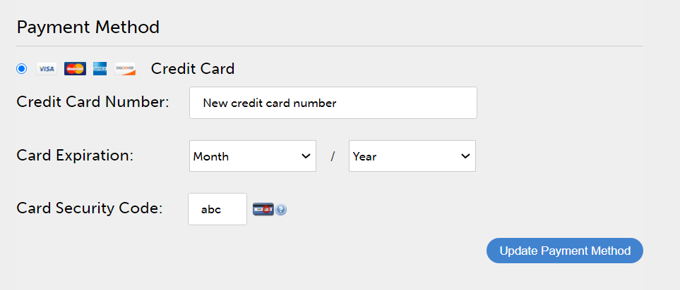

# Verwalten von Learning Manager-Bestellungen und -Abrechnungen

Kreditkartenbasierte Käufe sind nur in der Region [USA](http://learningmanager.adobe.com/) verfügbar.

Verwalten Sie die Learning Manager-Abrechnung, erteilen Sie Bestellungen mit einer Kreditkarte, abonnieren Sie mit einer Bestellung oder über einen monatlichen Aktivbenutzerplan.

Das Preisgestaltungsmodell von Adobe Learning Manager ist flexibel, kundenfreundlich und eines der besten für die Bedürfnisse Ihres Unternehmens. Weitere Informationen finden Sie auf der [Learning Manager](https://www.adobe.com/products/learningmanager.html)-Seite.

Nur Administratoren Ihres Unternehmens können die Rechnungsfunktion verwalten.

Wenn Sie mit Adobe Kontakt aufnehmen möchten, um weitere Informationen zum Abonnement und zur Abrechnung von Learning Manager zu erhalten, senden Sie eine E-Mail an [learningmanagersales@adobe.com](mailto:learningmanagersales@adobe.com).

## Bestellen über Kreditkarte {#placeordersusingcreditcards}

Sie können über eine einzige Kreditkartenbestellung ein Abonnement für maximal 3.500 Teilnehmer erwerben. Die erste Bestellung für Ihr Konto muss mindestens 10 Teilnehmer umfassen.

1. Auf der Administrator-App, klicken Sie auf **[!UICONTROL Abrechnung]** im linken Navigationsbereich.

   

   *Adobe Learning Manager-Abrechnung starten*

1. Fügen Sie auf der Seite **[!UICONTROL Rechnungsinformationen]** die Anzahl der Benutzer im Feld **[!UICONTROL Benutzer hinzufügen]** hinzu. Wenn Sie eine Kreditkarte für Prepaid-Abonnements verwenden, können Sie die Anzahl der Benutzer anzeigen, die Sie für das Abonnement hinzufügen können. Die Anzahl der Benutzer, die Sie hinzufügen können, darf die im Abschnitt &quot;Übrige&quot; angegebene Anzahl nicht überschreiten.1.

   

   *Anzahl der Benutzer hinzufügen*

1. Nachdem Sie die Anzahl der hinzuzufügenden Benutzer festgelegt haben, klicken Sie oben rechts auf der Seite auf „Bestellung aufgeben“.

   

1. Überprüfen Sie die Schätzung, die auf dem Bildschirm angezeigt wird.

   

   *Bestellung aufgeben*

   Die jährliche Abonnementgebühr wird basierend auf der Anzahl der Benutzer berechnet, die für das Abonnement hinzugefügt wurden. Wenn beispielsweise vier Benutzer hinzugefügt werden, wird die jährliche Gebühr mit dem Ausdruck 4 BenutzerX $ 4X $ 12 berechnet, der 192 $ ergibt.

   Klicken Sie auf **[!UICONTROL Fortfahren]**.

   *Schätzung überprüfen*

1. Auf der Seite „Zahlungsdetails“ können Sie den geschätzten Preis der Bestellung anzeigen. Die Währung wird basierend auf dem aktuellen Gebietsschema angezeigt.

   

   *Zahlungsdetails anzeigen*

   Sie können das Gebietsschema auch ändern, indem Sie das Land aus der Dropdown-Liste auswählen.

   

   *Abrechnungsland auswählen*

1. Geben Sie Ihre Kontaktinformationen ein, wählen Sie den Kreditkartentyp und geben Sie die Details der Kreditkarte an. Nachdem Sie die erforderlichen Details eingegeben haben, klicken Sie auf **[!UICONTROL Bestellung abschließen]**.
1. Nachdem Sie die Bestellung aufgegeben haben, klicken Sie auf der Seite **[!UICONTROL Abrechnung]** auf die Registerkarte **[!UICONTROL Bestellverlauf]**, um die kürzlich bestellten Pakete anzuzeigen.

   

   *Bestellverlauf anzeigen*

## Überprüfen Sie den Bestellstatus. {#checkorderstatus}

Alle Bestellungen können einen der vier Status haben:

**Aktiv:** Eine Bestellung ist aktiv und Benutzer wurden erfolgreich registriert.

**Ausgesetzt:** Eine Bestellung erhält in den folgenden Szenarien den Status &quot;Ausgesetzt&quot;:

* Verzögerung bei Zahlungseingang von der Kreditkarte
* Ablauf der Kreditkarte.
* Die Zahlung wird für einen wiederkehrenden Zahlungszyklus abgelehnt.

**Stornierung eingeleitet:** Eine Bestellung erhält diesen Status unverzüglich, wenn der Learning Manager-Administrator das Konto deaktiviert. Hierauf erhält die Bestellung den Status „Storniert“, nachdem die Stornierungsbestätigung der Bestellung eingegangen ist.

## Aktualisieren Sie die Abonnementdetails {#updatesubscriptiondetails}

1. Klicken Sie in der Auftragsliste auf **[!UICONTROL Bearbeiten]**.

   

   *Abonnementdetails aktualisieren*

1. Klicken Sie auf der Seite mit den Abonnementdetails auf **[!UICONTROL Abonnement bearbeiten]**.
1. Wählen Sie das Element aus, das Sie bearbeiten möchten:

   * Zahlungsmethode: Verwenden Sie diese Option, um Zahlungsdetails wie die Kreditkarte zu aktualisieren.
   * Adresse: Verwenden Sie diese Option, um die Adressdetails zu aktualisieren.

## Abo kündigen {#cancelasubscription}

So stornieren Sie eine Bestellung:

1. Klicken Sie im linken Bereich der Administrator-Seite auf „Abrechnung“.
1. Wählen Sie auf der Abrechnungsseite in der oberen rechten Ecke **[!UICONTROL Aktionen]** > **[!UICONTROL Konto deaktivieren]**.
1. Sobald der Administrator das Konto deaktiviert hat, werden alle bestehenden Bestellungen auf dem Konto ab dem nächsten Abrechnungszyklus storniert.

Wenn ein Konto vom Kunden deaktiviert wird, befindet es sich für die nächsten 30 Tage in einem Teststatus. Der Kontoinhaber erhält drei Erinnerungs-E-Mails, um das Konto wieder zu aktivieren. Wenn der Eigentümer das Konto nicht neu aktiviert, kann außer dem Eigentümer keiner der Benutzer auf Learning Manager zugreifen.

## Bestellungen über Kaufauftrag aufgeben {#placeordersusingpurchaseorder}

Als alternative Zahlungsmethode können Sie das Bestellverfahren wählen. Voraussetzung ist, dass das Konto Ihres Unternehmens bei der Adobe registriert ist. Bei diesem Verfahren wird Ihr Unternehmenskonto belastet. Das Konto wird basierend auf den Aktivitäten eines Teilnehmers belastet. Es werden nur Aktivitäten auf Lernobjektebene berechnet. So erteilen Sie eine Bestellung über Kaufauftrag:

1. Senden Sie eine E-Mail an [learningmanagersales@adobe.com](mailto:learningmanagersales@adobe.com) und erwähnen Sie die Anzahl der erforderlichen Teilnehmenden.
1. Das Learning Manager-Team schickt Ihnen einen Aktivierungscode.
1. Geben Sie auf der Abrechnungsseite der Administrator-App den Aktivierungsschlüssel ein.
1. Klicken Sie in der rechten oberen Ecke der Seite auf „Aktivieren“.

## Überprüfen Sie den Kontostatus {#checkaccountstatus}

Nachdem ein Konto aktiviert wurde, kann sich das Konto in einem der folgenden Status befinden:

* **Testversion** - Sie können ein Adobe Learning Manager-Konto erstellen und es für einen Zeitraum von 30 Tagen kostenlos verwenden. Es gibt während dieses Testzeitraums keine Beschränkung der Anzahl der Teilnehmer.
* **Aktiv** - In diesem Status sind aktive Teilnehmerabonnements mit wiederkehrenden monatlichen Zahlungen gemäß Abonnementauftrag im Konto vorhanden.
* **Inaktiv** - Ein Konto erhält in den folgenden Szenarien den Status &quot;inaktiv&quot;:

   * Nach Ablauf des Testzeitraums, wenn keine aktiven Abonnementbestellungen für das Konto vorhanden sind.
   * Der Administrator deaktiviert das Konto, was dazu führt, dass alle vorhandenen Bestellungen in einem Konto ab dem nächsten Abrechnungszyklus des Abonnements storniert werden.
   * Die Zahlung wird für aktive Bestellungen im Konto auch nach den vorgesehenen Mahnungen abgelehnt.

Ein inaktiver Status storniert Ihr Konto nicht unverzüglich. Sie erhalten mindestens ein paar Erinnerungen vom Learning Manager-Team, in denen Sie aufgefordert werden, die neuesten Informationen zu

Ihre Kreditkarte, wenn sie abgelaufen ist. In einem inaktiven Status kann sich nur ein Administrator bei der Captivate anmelden

Learning Manager-Konto. Alle anderen Benutzer können nicht auf das Konto zugreifen.

* **Aktivierung erforderlich** - Ihr Konto erhält diesen Status, wenn der Learning Manager-Administrator das Konto deaktiviert. Alle Bestellungen auf diesem Konto werden storniert. Die Einziehung der Zahlung für diese Bestellungen erfolgt nicht ab dem nächsten Rechnungszyklus. Der Status des Kontos bleibt in diesem Zustand bis zum Tag des letzten Abrechnungszyklus. In diesem Status können alle Benutzer die Anwendung weiterhin ohne Auswirkungen verwenden, bis das letzte wiederkehrende Zahlungsdatum eintritt.

## Abo kündigen {#Cancelasubscription-1}

Um ein aktives Abonnement zu kündigen, wenden Sie sich an das Support-Team von Learning Manager.

## Gebühr für die Kontoauflösung {#accountterminationfee}

Wenn Sie das Abonnement vor Ablauf der jährlichen Laufzeit kündigen möchten, wird eine Gebühr für vorzeitige Beendigung fällig. Die Kündigungsgebühr entspricht 50 % des Abonnementpreises für die verbleibende Laufzeit.

## Monatlicher Plan für aktive Benutzer (MAU) {#monthlyactiveusersmauplan}

Sie können einen MAU-Tarif als bevorzugte Abrechnungsmethode auswählen. Diese Option erstellt Rechnungen, basierend auf der Anzahl der monatlichen individuellen aktiven Benutzer. Die monatlichen individuellen aktiven Benutzer werden kumulativ während einer Zeitdauer von 12 Monaten, beginnend vom Monat, in dem der Plan aktiviert wurde, hinzugefügt. Diese Zahl wird für die Berechnung während des Zeitraums verwendet.

Verwenden Sie das folgende Beispiel, um zu verstehen, wie der berechnet wird.

Wenn die Anzahl von Benutzern pro Monat wie folgt ist:

* Monat 1 = 50
* Monat 2 = 500
* Monat 3 = 5000
* Monat 4 bis 12 = 10

Monatliche aktive Benutzer insgesamt, die eine Rechnung erhalten = Monat 1 + 2 + 3 + 4 bis 12 = 50 + 500 + 5000 + 90 = 5640.

Die Rechnung für diesen Zeitraum ist für 5640 Benutzer.

Nach Ablauf der 12 Monate wird die Verwendungsanzahl wieder auf Null gesetzt und der neue Zeitraum für den MAU-Plan beginnt. Sie können mehrere Aktivierungsschlüssel hinzufügen, um die erworbene Lizenzen zu erhöhen.

Jeder Benutzer, der die folgenden Aktionen ausführt oder aufgrund von Aktionen, die von anderen ausgeführt werden, abgeschlossen wird, wird als monatlicher eindeutiger aktiver Benutzer für diesen Kalendermonat betrachtet.

* Einen Kurs, ein Lernprogramm oder eine Zertifizierung absolvieren.
* Konsumieren, Herunterladen einer Jobhilfe oder von Kursanhängen.
* Persönliche Notizen nutzen, herunterladen oder erstellen.
* Teilnahme am sozialen Lernen durch Erstellen von Foren, Beiträgen oder Kommentaren.
* Erzielen von Abschlüssen aufgrund von Genehmigungen zur Einreichung externer Zertifikate oder der Teilnahme an einem Klassenzimmer/einer virtuellen Klassenzimmersitzung.

## Nutzungsdetails anzeigen {#viewusagedetails}

1. Um die Anzahl der aktiven Benutzer pro Monat anzuzeigen, klicken Sie auf **[!UICONTROL Nutzungsdetails anzeigen]**.

   

   *Aktive Benutzer nach Monat anzeigen*

1. Auf der angezeigten Seite können Sie Folgendes anzeigen:

   * **Allgemeine Nutzung:** Sie können die Gesamtzahl der aktiven Benutzer, der Benutzer, die Learning Manager in einem Monat nutzen, und der Benutzer, die sich noch nicht für einen Kurs angemeldet haben, überprüfen.

   * **Monatliche Nutzung:** Sie können eine Tabelle mit eindeutigen aktiven Benutzern pro Monat anzeigen.

## Nutzungsbericht herunterladen {#downloadusagereport}

Sie können auch die Daten der Anzahl der aktiven Benutzer nach Monat und Jahr herunterladen. Klicken Sie zum Herunterladen auf **[!UICONTROL Detaillierten Bericht herunterladen]**.

Geben Sie im Dialogfeld **Berichtsanforderung generieren** die erforderlichen Monate und das Jahr ein und klicken Sie auf **[!UICONTROL Generieren]**.

*Bericht über aktive Nutzung herunterladen*

Wenn Sie den Browser schließen, wird der Download gestartet, sobald Sie Learning Manager das nächste Mal nutzen.

Die Berichte werden im Ordner „Downloads“ in Ihrem Browser gespeichert.

## Abo kündigen

Um ein aktives Abonnement zu kündigen, wenden Sie sich an das Support-Team von Learning Manager.

## Häufig gestellte Fragen {#frequentlyaskedquestions}

+++Wie können Abonnements zu einem Konto hinzugefügt/entfernt werden?

Um Abonnements zu einem Konto hinzuzufügen, fügen Sie die Anzahl der Benutzer hinzu, für die Sie Abonnements erwerben möchten. Klicken Sie dann in der oberen rechten Ecke auf **[!UICONTROL Bestellung aufgeben]**. Überprüfen Sie die Schätzung und klicken Sie auf **[!UICONTROL Fortfahren]**. Geben Sie Ihre Kontoinformationen und Ihre Kreditkarteninformationen ein. Um die Abonnements dann zu erwerben, klicken Sie auf **[!UICONTROL Bestellung abschließen]**.

Um ein aktives Abonnement zu entfernen, wenden Sie sich an das Learning Manager-Supportteam.
+++

+++Wie lässt sich die Kreditkarte für Abonnements ändern?

Klicken Sie auf der Registerkarte **[!UICONTROL Bestellverlauf]** für ein aktives Konto auf **[!UICONTROL Bearbeiten]**. Klicken Sie dann auf der Seite mit den Abonnementdetails auf **[!UICONTROL Abonnement bearbeiten]**. Geben Sie Ihre neuen Kreditkarteninformationen ein und klicken Sie auf **[!UICONTROL Zahlungsmethode aktualisieren]**.

*Kreditkarteninformationen anzeigen*
+++

+++Wie aktualisieren Sie die Rechnungsinformationen in Learning Manager?

Um die Rechnungsinformationen zu aktualisieren, führen Sie die folgenden Schritte aus:

1. Melden Sie sich als **Administrator** an und klicken Sie auf **[!UICONTROL Abrechnung]**.
1. Klicken Sie in der Auftragsliste auf **[!UICONTROL Bearbeiten]**.
1. Klicken Sie auf der Seite mit den Abonnementdetails auf **[!UICONTROL Abonnement bearbeiten]**.

Wählen Sie das Element aus, das Sie bearbeiten möchten:

1. **[!UICONTROL Zahlungsmethode]:** Verwenden Sie diese Option, um Zahlungsdetails wie Kreditkarte zu aktualisieren.
1. **[!UICONTROL Adresse]:** Verwenden Sie diese Option, um die Adressdetails zu aktualisieren.
+++

+++Kann ich ein Abonnement teilweise kündigen?

Nein, Sie können ein Abonnement nicht teilweise kündigen. Wenn Sie die Anzahl der erworbenen Lizenzen reduzieren müssen, können Sie das Abonnement am Ende des Abrechnungszeitraums kündigen und dann die Anzahl der erforderlichen Lizenzen erwerben.
+++

+++Wie erhalte ich eine Rechnung für meine Kreditkartenzahlungen?

Wenden Sie sich an [FastSpring](https://fastspring.com/), um eine Rechnung für Ihre Zahlungen zu erhalten, indem Sie eine der folgenden Methoden verwenden:

* Erstellen Sie eine Serviceanforderung mit FastSpring über den Link &quot;`https://questionacharge.com`&quot;.
* Senden Sie eine E-Mail an FastSpring am `orders@fastspring.com`, um die Rechnung anzufordern.
+++
