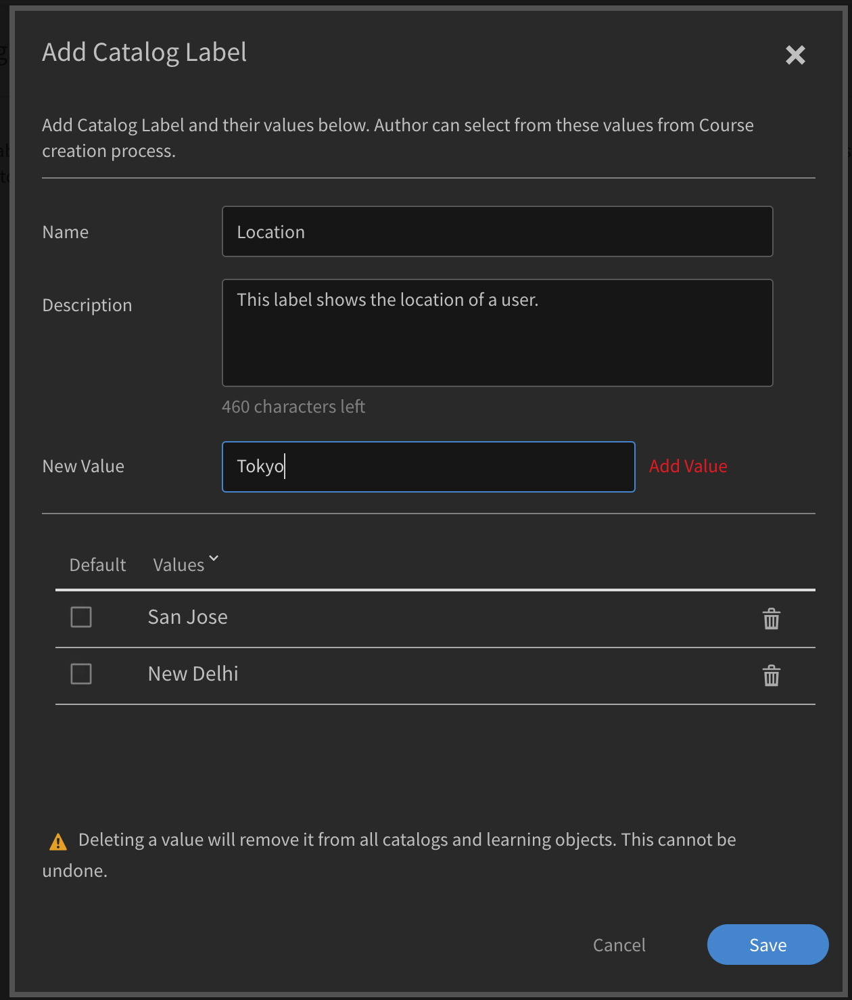

# Katalogbeschriftungen

Mithilfe von Katalogbeschriftungen können Sie Lernobjekte mit bestimmten Feldern markieren und einen oder mehrere Werte anwenden. Wenn diese Option aktiviert ist, können Administratoren und Autoren Katalogbeschriftungen und Werte festlegen und sie mit Lernobjekten verknüpfen.

Verwenden Sie diese Funktion, um Daten einfach zu kategorisieren. Zum Beispiel, wenn Sie Lernobjekte basierend auf ihrem Standort, ihrer Abteilung oder ihren Kenntnissen kategorisieren möchten. Sie können diese Felder anwenden und Daten filtern.

Gehen Sie folgendermaßen vor um Katalogbeschriftungen zu aktivieren:

* Öffnen Sie als Administrator **[!UICONTROL Einstellungen]** > **[!UICONTROL Allgemein]** > **[!UICONTROL Katalogbeschriftung anzeigen]**.
* Aktivieren Sie das Kontrollkästchen, um die Beschriftung zu aktivieren.

## Katalogbeschriftungen hinzufügen {#addcataloglabels}

Gehen Sie folgendermaßen vor, um Katalogbeschriftungen hinzuzufügen:

1. Öffnen Sie **[!UICONTROL Einstellungen]** > **[!UICONTROL Katalogbeschriftungen]** unter der Option **[!UICONTROL Erweitert]**. Die Seite [!UICONTROL Katalogbeschriftungen] öffnet sich.

   

1. Klicken Sie in der rechten oberen Ecke auf **[!UICONTROL Katalogbeschriftung hinzufügen]** oder auf **[!UICONTROL Hinzufügen]**. Das Dialogfeld **[!UICONTROL Katalogtitel hinzufügen]** wird angezeigt.
1. Fügen Sie den Katalognamen und ihre Werte in die Felder ein. Ein benutzerdefiniertes Feld kann mehrere Werte enthalten. Autoren können während der Erstellung des Kurses aus diesen Werten auswählen.

   

1. Klicken Sie auf **[!UICONTROL Speichern]**.
1. Wenn Sie die Beschriftung speichern, wird sie auf der Seite „Katalogbeschriftungen“ angezeigt. Sie können wählen, ob Sie einen Pflichtwert festlegen möchten oder nicht.

   

## Beschriftungen auf Kataloge anwenden {#applylabelstocatalogs}

Nachdem Sie Katalogbeschriftungen erstellt haben, können Sie sie mithilfe der folgenden Schritte auf bestimmte Kataloge anwenden:

1. Öffnen Sie im linken Bereich **[!UICONTROL Kataloge.]** Die Seite „Katalog“ öffnet sich mit der Liste der Kataloge.
1. Wählen Sie den Katalog aus und wenden Sie ihn auf die Beschriftung an.
1. Öffnen Sie im linken Bereich „Katalogbeschriftungen“.
1. Klicken Sie in der rechten oberen Ecke auf **[!UICONTROL Bearbeiten]**. Die Seite zeigt die Liste der verfügbaren „Katalogbeschriftungen“.
1. Um eine Beschriftung zum Katalog hinzuzufügen, klicken Sie auf **[!UICONTROL Zum Katalog hinzufügen]**.
1. Um vorhandene Beschriftungen, die einem Katalog hinzugefügt wurden, zu entfernen, klicken Sie auf **[!UICONTROL Entfernen]**.

Wenn das benutzerdefinierte Feld zum Katalog hinzugefügt wird, gilt es für alle Lernobjekte, die Teil des Katalogs sind.
