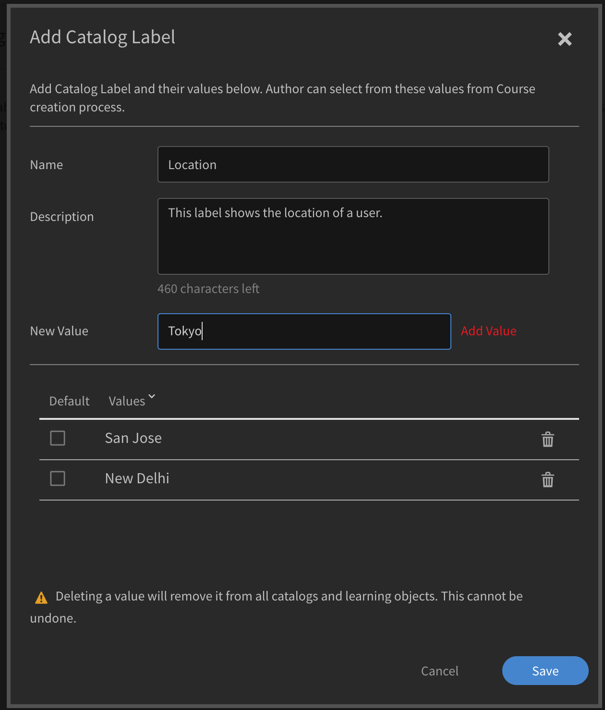

# Katalogbeschriftungen

Mit Katalogbeschriftungen können Sie Lernobjekte mit bestimmten Feldern markieren und einen oder mehrere Werte anwenden. Wenn diese Option aktiviert ist, können Administratoren und Autoren Katalogbeschriftungen und Werte festlegen und sie mit Lernobjekten verknüpfen.

Verwenden Sie diese Funktion, um Daten einfach zu kategorisieren. Beispiel: Sie möchten Lernobjekte basierend auf ihrem Standort, ihrer Abteilung oder ihren Kenntnissen kategorisieren. Sie können diese Felder anwenden und Daten filtern.

Führen Sie die folgenden Schritte aus, um Katalogbeschriftungen zu aktivieren:

* Öffnen Sie als Administrator **[!UICONTROL Einstellungen]** > **[!UICONTROL Allgemein]** > **[!UICONTROL Katalogbeschriftung anzeigen]**.
* Aktivieren Sie das Kontrollkästchen, um die Beschriftung zu aktivieren.

## Katalogbeschriftungen hinzufügen {#addcataloglabels}

Um Katalogbeschriftungen hinzuzufügen, gehen Sie wie folgt vor:

1. Öffnen  **[!UICONTROL Einstellungen]** > **[!UICONTROL Katalogbeschriftungen]** im Abschnitt **[!UICONTROL Erweitert]** aus. Die [!UICONTROL Katalogbeschriftungen] wird geöffnet.

   

1. Klicken **[!UICONTROL Katalogbeschriftung hinzufügen]** oder **[!UICONTROL Hinzufügen]** in der oberen rechten Ecke. Die **[!UICONTROL Katalogbeschriftung hinzufügen]** &quot; wird angezeigt.
1. Fügen Sie eine Katalogbeschriftung und ihre Werte in die Felder ein. Ein benutzerdefiniertes Feld kann mehrere Werte haben. Autoren können während des Kurserstellungsprozesses aus diesen Werten auswählen.

   

1. Klicken **[!UICONTROL Speichern]**.
1. Wenn Sie die Beschriftung speichern, wird sie auf der Seite &quot;Katalogbeschriftungen&quot; angezeigt. Sie können auswählen, ob Sie einen obligatorischen Wert festlegen möchten oder nicht.

   

## Beschriftungen auf Kataloge anwenden {#applylabelstocatalogs}

Nachdem Sie Katalogbeschriftungen erstellt haben, können Sie sie auf bestimmte Kataloge anwenden, indem Sie die folgenden Schritte ausführen:

1. Öffnen **[!UICONTROL Kataloge]** im linken Bereich. Die Katalogseite wird geöffnet und zeigt die Liste der Kataloge an.
1. Wählen Sie den Katalog aus und wenden Sie ihn auf die Beschriftung an.
1. Öffnen Sie im linken Bereich &quot;Katalogbeschriftungen&quot;.
1. Klicken **[!UICONTROL Bearbeiten]** in der oberen rechten Ecke. Die Seite zeigt die Liste der verfügbaren Katalogbeschriftungen an.
1. Um eine Beschriftung zum Katalog hinzuzufügen, klicken Sie auf **[!UICONTROL Zum Katalog hinzufügen]**.
1. Um vorhandene Beschriftungen, die einem Katalog hinzugefügt wurden, zu entfernen, klicken Sie auf **[!UICONTROL Entfernen]**.

Wenn das benutzerdefinierte Feld zum Katalog hinzugefügt wird, gilt es für alle Lernobjekte, die Teil des Katalogs sind.
