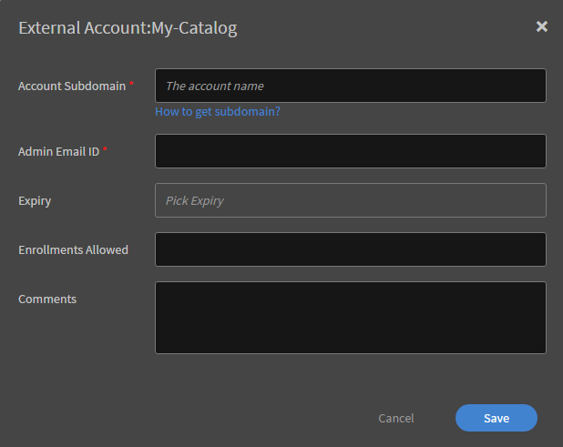

# Kataloge

Kataloge sind eine Sammlung von Lerninhalten – Kurse, Lernprogramme und Zertifizierungen. Verwenden Sie Kataloge, um den Teilnehmern den Zugriff auf einen benutzerdefinierten Lernsatz zu ermöglichen. Sie können Lernprogramme während der Erstellung eines neuen Katalogs einem Katalog zuordnen.

Als Administrator können Sie benutzerdefinierte Kataloge erstellen, wenn Sie selektive Kurse für verschiedene Teilnehmern in Ihrem Konto oder über Konten hinweg verfügbar machen möchten.

## Einführung in Kataloge

In dieser Schulung erfahren Sie, wie Sie Kataloge erstellen und verwalten.

Wenn Sie die Schulung nicht starten können, schreiben Sie an <almacademy@adobe.com>.

## Katalog erstellen {#createacatalog}

Um einen Katalog zu erstellen, führen Sie die folgenden Schritte aus:

1. Klicken Sie als Administrator im linken Bereich auf Kataloge. Auf dieser Seite befindet sich ein Standardkatalog, der automatisch erstellt wird, wenn Sie ein Learning Manager-Konto erstellen. Standardmäßig werden alle Lernobjekte in diesem Katalog für alle Teilnehmer freigegeben.
1. Klicken Sie in der rechten oberen Ecke der Seite auf **[!UICONTROL Erstellen]**. Optional können Sie auch auf die Option **[!UICONTROL Katalog erstellen]** klicken, die sich unterhalb der Liste der Kataloge befindet.
1. Geben Sie auf der Seite **[!UICONTROL Katalog erstellen]** den Namen und die Beschreibung des Katalogs ein, den Sie erstellen möchten.

   

   Klicken Sie zum Fortfahren auf **[!UICONTROL Weiter]**.

   Die Miniaturen können nur in der immersiven Benutzeroberfläche und nicht in der klassischen Benutzeroberfläche angezeigt werden.

1. Auf der Katalogseite können Sie dem neuen Katalog Folgendes hinzufügen:

   * [Kurse](catalogs.md#course)
   * [Lernprogramme](catalogs.md#lp)
   * [Zertifizierungen](catalogs.md#cert)
   * [Arbeitshilfen](catalogs.md#job)

## Kurs zum Katalog hinzufügen {#course}

1. Wählen Sie aus der Liste der Kurse einen Kurs aus, den Sie dem Katalog hinzufügen möchten.

   

   *Erstellen eines Katalogs*

   Sie können dem Katalog mehrere Kurse hinzufügen.
1. Sie können die Kurse nach Fähigkeiten, Rollen und Sprache filtern. Der ausgewählte Kurs wird Lernenden empfohlen, die an diesen Fähigkeiten und Rollen interessiert sind.

   * **[!UICONTROL Kenntnisse]**: Mit Kenntnisfiltern können Benutzer Kurse finden, die sich auf bestimmte Kenntnisse konzentrieren.
   * **[!UICONTROL Rollen]**: Rollenfilter helfen Benutzern, auf Kurse zuzugreifen, die auf die Verantwortlichkeiten und Anforderungen verschiedener Rollen zugeschnitten sind.
   * **[!UICONTROL Sprache]**: Sprachfilter unterstützen Benutzer bei der Auswahl von Kursen, die in ihrer bevorzugten oder erforderlichen Sprache verfügbar sind

1. Speichern Sie das Änderungen. Kehren Sie zur Liste der Kataloge zurück und klicken Sie auf den neuen Katalog in der Liste.
1. Klicken Sie auf der Seite für den neuen Katalog im linken Bereich auf **[!UICONTROL Inhalt]**.

   

   *Wählen Sie einen Kurs aus, der dem Katalog hinzugefügt werden soll*

   Der von Ihnen hinzugefügte Kurs wird auf der Registerkarte **[!UICONTROL Kurse]** angezeigt.

## Lernprogramm zum Katalog hinzufügen {#lp}

1. Wählen Sie in der Liste der Lernprogramme ein Lernprogramm aus, das Sie dem Katalog hinzufügen möchten.
1. Speichern Sie das Änderungen. Kehren Sie zur Liste der Kataloge zurück und klicken Sie auf den neuen Katalog in der Liste.
1. Klicken Sie auf der Seite für den neuen Katalog im linken Bereich auf **[!UICONTROL Inhalt]**.

   Das von Ihnen hinzugefügte Lernprogramm wird auf der Registerkarte **[!UICONTROL Lernprogramme]** angezeigt.

## Zertifizierung zum Katalog hinzufügen {#cert}

1. Wählen Sie aus der Liste der Zertifizierungen eine Zertifizierung aus, den Sie dem Katalog hinzufügen möchten.
1. Speichern Sie das Änderungen. Kehren Sie zur Liste der Kataloge zurück und klicken Sie auf den neuen Katalog in der Liste.
1. Klicken Sie auf der Seite für den neuen Katalog im linken Bereich auf **[!UICONTROL Inhalt]**.

   Die Zertifizierung, die Sie hinzugefügt haben, wird auf der Registerkarte **[!UICONTROL Zertifizierungen]** angezeigt.

## Arbeitshilfe zum Katalog hinzufügen {#job}

1. Wählen Sie aus der Liste der Arbeitshilfen eine Arbeitshilfe aus, die Sie dem Katalog hinzufügen möchten.
1. Speichern Sie das Änderungen. Kehren Sie zur Liste der Kataloge zurück und klicken Sie auf den neuen Katalog in der Liste.
1. Klicken Sie auf der Seite für den neuen Katalog im linken Bereich auf **[!UICONTROL Inhalt]**.

   Die Arbeitshilfe, die Sie hinzugefügt haben, wird auf der Registerkarte **[!UICONTROL Arbeitshilfen]** angezeigt.

Der Inhalt wird auf jeder dieser Registerkarten angezeigt, wenn er bereits im Konto vorhanden ist. Andernfalls müssen Sie den Inhalt zunächst erstellen. Wenn Sie beispielsweise noch keine Kurse oder Lernprogramme in der Learning Manager-Anwendung hinzugefügt haben, müssen Sie diese zunächst erstellen.

## Massenentfernung von Kursen, Lernpfaden oder Arbeitshilfen

Administratoren oder benutzerdefinierte Administratoren können Kurse, Lernpfade oder Arbeitshilfen gesammelt entfernen. Gehen Sie zu **[!UICONTROL Kataloge]** und wählen Sie einen Katalog aus. Wählen Sie auf der **[!UICONTROL Seite Inhalt]** die Option Inhalt ]**bearbeiten aus**[!UICONTROL . Wählen Sie dann die **[!UICONTROL Option Entfernen]** neben den Kursen, Lernpfaden oder Arbeitshilfen aus und wählen Sie Speichern ]**aus**[!UICONTROL .

## Deep-Link zum Katalog für Teilnehmer {#deep-link}

Ein Administrator kann einen Deep-Link für einen Katalog generieren, der die Teilnehmer zur entsprechenden Katalogseite führen kann.

Bewegen Sie den Mauszeiger auf der Seite **[!UICONTROL Kataloge]** auf den Katalog, für den Sie den Deep-Link generiert haben, und klicken Sie auf das hervorgehobene Symbol.

*Deep Link für Teilnehmer generieren*

## Katalog aktivieren {#enablethecatalog}

Nachdem Sie einen Katalog erstellt und Lernobjekte hinzugefügt haben, müssen Sie den Katalog aktivieren, damit der Katalog für die Teilnehmer sichtbar wird.

Um den Katalog zu aktivieren,

1. Aktivieren Sie in der Liste der Kataloge die Option neben dem Katalog, den Sie aktivieren möchten. Alternativ können Sie das Kontrollkästchen neben dem Katalog aktivieren, klicken Sie oben rechts auf **[!UICONTROL Aktionen]** und dann auf **[!UICONTROL Aktivieren]**.

1. Sie können auch mehrere Kataloge in der Liste aktivieren. Wählen Sie die Kataloge aus und aus dem Menü **[!UICONTROL Aktion]** wählen Sie die Option **[!UICONTROL Aktivieren]**.

## Katalog deaktivieren {#disablethecatalog}

Um einen Katalog zu deaktivieren, deaktivieren Sie die Option neben dem Katalog.

Alternativ können Sie das Kontrollkästchen neben dem Katalog aktivieren, auf &quot;Aktionen&quot; in der oberen rechten Ecke klicken und auf **[!UICONTROL Deaktivieren]** klicken.

Sie können auch mehrere Kataloge in der Liste deaktivieren. Wählen Sie die Kataloge aus, und wählen Sie im Menü &quot;Aktion&quot; die Option **[!UICONTROL Deaktivieren]**.

## Katalog löschen {#deletethecatalog}

Um einen Katalog zu löschen, wählen Sie einen Katalog in der Liste aus. Klicken Sie entweder auf die Schaltfläche &quot;Löschen&quot; neben dem Katalog oder auf **[!UICONTROL Aktionen]** > **[!UICONTROL Löschen]**.

Sie können auch mehrere Kataloge löschen.

## Katalog freigeben {#shared}

Administratoren können die Kataloge mit internen Benutzern eines Unternehmens oder mit externen Benutzer teilen. Allerdings ist Teilen exklusiv. Das heißt, dass ein intern freigegebenen Katalog nicht mit externen Gruppen geteilt werden kann und umgekehrt.

Kurse, Lernprogramme, Arbeitshilfen und Zertifizierungen sind die unterstützten Lernobjekte in einem Katalog, den Sie freigeben möchten.

### Kataloge freigeben

In dieser Schulung erfahren Sie, wie Sie Kataloge für interne Benutzergruppen und externe Adobe Learning Manager-Konten freigeben.

Wenn Sie die Schulung nicht starten können, schreiben Sie an <almacademy@adobe.com>.

## Teilen Sie den Katalog intern {#int}

Wählen Sie einen Katalog aus, den Sie intern freigeben möchten.

Klicken Sie im linken Bereich auf **[!UICONTROL Intern freigeben]**.

Wenn keine Gruppen vorhanden sind, müssen Sie eine interne Benutzergruppe hinzufügen.

Um eine interne Benutzergruppe hinzuzufügen, klicken Sie auf **[!UICONTROL Benutzergruppen hinzufügen]**.

*Einen Katalog intern freigeben*

Sie können eine freigegebene Benutzergruppe nicht aktivieren/deaktivieren. Für die Deaktivierung müssen Sie die Benutzergruppe löschen. Zum Löschen bewegen Sie der Mauszeiger über den drei Punkten und klicken Sie auf das Symbol „Löschen“. Alternativ dazu können Sie im Dropdownmenü auf „Aktionen“ in der rechten oberen Ecke der Seite klicken.

## Teilen Sie den Katalog extern {#ext}

Klicken Sie auf der Seite „Kataloge“ auf den Katalog, den Sie freigeben möchten. Klicken Sie im linken Bereich auf **[!UICONTROL Extern freigeben]**.

*Einen Katalog extern freigeben*

Geben Sie die Subdomäne ein, die mit Ihrem Learning Manager-Konto verknüpft ist. Klicken Sie auf **[!UICONTROL Wie erhalte ich eine Subdomäne?]** , um mehr über die Verwendung von Subdomains zu erfahren. Sie können auch auf der Administrator-Startseite im linken Fensterbereich auf Branding ]**klicken**[!UICONTROL , um die Unterdomäne anzuzeigen, die Ihrem Organisationskonto zugeordnet ist.

**Einschränkungen für die Registrierung** 

Sie können den Grenzwert für die Anzahl der Registrierung pro Kurs im freigegebenen Katalog festlegen, indem Sie die Anzahl der Registrierungen im Feld **Zugelassene Registrierungen** hinzufügen. Der Empfänger des freigegebenen Katalogs kann die Kurse mit Registrierungseinschränkungen in Lernplänen nicht verwenden.

**Ablauf**

Sie können die Gültigkeit des freigegebenen Katalogs festlegen, indem Sie ein Ablaufdatum im **[!UICONTROL Feld Ablaufdatum]** festlegen. Nach dem Ablaufdatum des freigegebenen Katalogs, sind Registrierungen für die Kurse nicht mehr zulässig. Vorhandene Teilnehmer können immer noch Zugriff auf die Inhalte haben. Lernobjekte werden eingestellt, aber die Abzeichen und Qualifikationen sind aktiv. In diesem Zustand kann der Empfänger des freigegebenen Katalogs die zurückgezogenen Lernobjekte nicht außer Betrieb nehmen.

Klicken Sie auf **[!UICONTROL Speichern]**, nachdem alle erforderlichen Informationen hinzugefügt wurden. Klicken Sie auf das Dropdownmenü **[!UICONTROL Aktionen]** in der oberen rechten Ecke der Seite und klicken Sie auf **[!UICONTROL Freigeben]**, um den Katalog mit externen Konten freizugeben.

Die Kataloge, die dem freigebenden Kontoinhaber gehören, können nur mit externen Konten geteilt werden. Sie können die Kataloge nicht freigeben, die bereits von anderen Konten für Sie freigegeben wurden.

Der Administrator des externen freigegebenen Kontos erhält eine Benachrichtigung in der Anwendung und in der E-Mail. Der Empfänger muss auf die eindeutige URL klicken, die in der E-Mail bereitgestellt wurde oder er muss auf die Benachrichtigung klicken und die freigegebene Kataloganforderung akzeptieren. In der Anwendung kann der Empfänger auf „Akzeptieren“ oder „Ablehnen“ klicken. Bevor Sie den freigegebenen Katalog akzeptieren, kann der Empfänger die Katalogdetails, z. B. von wem freigegeben, wann freigegeben, Ablaufdatum etc. anzeigen.

Der freigegebene Katalog wird im Empfängerkonto angezeigt. Die Lernobjekte, die mit dem freigegebenen Katalog verknüpft sind, werden in den jeweiligen Administrator- und Autorenrollen der Anwendung angezeigt. Sie können die freigegebenen Kataloge, die von Ihnen erhalten wurden, unterscheiden, indem Sie das &lt;-- Pfeilsymbol suchen, dass für die Kataloge, die von Ihnen erworben wurden, angezeigt wird.

Die Lernobjekte mit offenem/aktivem Status für die Registrierung werden nur den freigegebenen Katalogen hinzugefügt.

**Freigabe für Kataloge aufheben**

Die Aufhebung der Freigabe eines Katalogs ist die Deaktivierung eines externen Kontos in der Anwendung. Um die Freigabe für einen Katalog aufzuheben, klicken Sie auf **[!UICONTROL Aktionen]** in der oberen rechten Ecke der Seite und dann auf **[!UICONTROL Freigabe aufheben]**. Sie können die Freigabe für einen Katalog jederzeit aufheben. Wenn die Freigabe für einen Katalog aufgehoben wurde, wechseln alle Lernobjekte in diesem freigegebenen Katalog in den Status „Eingestellt“. Die deaktivierten Kataloge werden in der Empfängeranwendung als zurückgezogen angezeigt.

Sie können ein externes Konto aus einer freigegebenen Liste nur entfernen, bevor der Empfänger die Anforderung akzeptiert.

**Kataloge löschen**

Um einen freigegebenen Katalog zu löschen, klicken Sie auf **[!UICONTROL das Dropdown-Menü &quot;Aktionen]** &quot; und dann auf **[!UICONTROL &quot;Löschen]**&quot;.

* Sie können einen Standardkatalog mit externen Konten nicht freigeben.
* Sie können einen Katalog nicht löschen, der von Ihnen extern freigegeben wurde.
* Sie können einen Katalog nicht löschen, der mit Ihnen von anderen Konten aus geteilt wurde.

## Aktivieren Sie die vollständige Kontrolle über den freigegebenen Katalog {#enablefullcontrolofsharedcatalog}

Sie können externen Konten vollen Zugriff auf Ihren Katalog gewähren. Der Administrator des Kontos kann dann den Katalog akzeptieren und dementsprechend Lerninhalte oder Module hinzufügen oder löschen.

Weitere Informationen finden Sie unter [Vollzugriff auf den freigegebenen Katalog](shared-catalog-full-control.md).

## Eigenschaften von Lernobjekten für freigegebene Kataloge {#sharedcataloglearningobjectsproperties}

Alle Änderungen, die für Lernobjekte in der Besitzeranwendung durchgeführt werden, werden an den freigegebenen Katalogempfänger weitergeleitet. Eine Liste der Lernobjekteigenschaften, die in der Empfängeranwendung widergespiegelt werden, wird wie folgt angezeigt:

<table>
 <tbody>
  <tr>
   <td>
    
<strong>Kurs</strong>
</td>
   <td>
    
Name, Beschreibung und andere Felder im Kursobjekt außer Gamification-Punkten und badgeId
</td>
  </tr>
  <tr>
   <td>
    
<strong>Lernprogramm</strong>
</td>
   <td>
    
Name, Beschreibung und andere Felder im LP-Objekt mit Ausnahme von badgeId, außer
</td>
  </tr>
  <tr>
   <td>
    
<strong>Zertifizierung</strong>
</td>
   <td>
    
Alle Eigenschaften des Zertifizierungsobjekts mit Ausnahme von badgeId, Zurückziehen der Zertifizierung
</td>
  </tr>
  <tr>
   <td>
    
<strong>Abzeichen</strong>
</td>
   <td>
    
Name und Ausscheiden aus dem Abonnement
</td>
  </tr>
  <tr>
   <td>
    
<strong>Kategorie </strong>
</td>
   <td>
    
Name, Beschreibung, Farbe und Einstellung der Kategorie, Hinzufügung einer neuen Ebene
</td>
  </tr>
  <tr>
   <td>
    
<strong>Job-Hilfe</strong>
</td>
   <td>
    
Alle Eigenschaften des jobAid-Objekts
</td>
  </tr>
  <tr>
   <td>
    
<strong>Modul</strong>
</td>
   <td>
    
Alle Eigenschaften des Modulobjekts
</td>
  </tr>
 </tbody>
</table>

## Freigegebene Katalogfunktionen in der Empfängeranwendung {#sharedcatalogfeaturesinreceiverapplication}

* Lernobjekte des freigegebenen Katalogs werden in der Autoren- und Admin-Anwendung angezeigt, aber die Module werden nicht aufgelistet. Sie sind ausgeblendet.
* Freigegebene Lernobjekte können für alle Arbeitsabläufe in dem Konto des Empfängers verwendet werden. Beispielsweise Hinzufügen von freigegebenen Kursen zu Lernprogrammen, Katalogen, Zertifizierungen, aber jene Lernprogramme, Zertifizierungen und Kataloge können nicht erneut freigegeben werden (weil sie bereits ein freigegebenes Lernobjekt von einem anderen Konto haben).
* Alle Arbeitshilfen, die mit dem Kurs/Lernprogramm/der Zertifizierung verknüpft, aber kein Teil des Katalogs sind, werden in das Konto des Empfängers kopiert.
* Freigegebene Katalogempfängern dürfen Lernobjekte nicht zum freigegebenen Katalog hinzufügen.
* Der freigegebene Katalogempfänger kann Module von freigegebenen Lernobjekten nicht ändern.
* Der freigegebene Katalogempfänger kann Kurse nicht hinzufügen, um das Lernprogramm/die Zertifizierung hinzuzufügen.
* Duplizierung oder erneute Freigabe von freigegebenen Lernobjekten ist nicht zulässig.
* Neu hinzugefügte Assets zum freigegebenen Katalog werden automatisch für den Empfänger sichtbar.
* Die Qualifikationen, die mit Lernobjekten verknüpft sind, werden in die freigegebenen Katalogempfängerkonten kopiert.

* Wenn das freigegebene Katalogempfängerkonto bereits denselben Qualifikationsnamen hatte, wird eine neue Qualifikation erstellt, indem &#42; nach dem Namen hinzugefügt wird.
* Daten (z. B. Abzeichen L1, L3, Benachrichtigungen) in den Standardinstanzen von Kursen und Lernprogrammen werden ebenfalls in das Konto des Empfängers zusammen mit den Kursen und Lernprogrammen kopiert.

Wiederkehrende Zertifizierungen können nicht Teil eines extern freigegebenen Katalogs sein. Der Empfänger kann erworbene Lernobjekte in wiederkehrenden Zertifizierungen nicht verwenden, wenn sie Registrierungseinschränkungen oder ein Ablaufdatum im Katalog haben.

## Weitergabe von geteilten Katalogfunktionen {#propagation}

Administratoren auf allen Konten in einem Unternehmen können die Kataloge auf mehrere Konten teilen. Die Empfänger der gemeinsam genutzten Kataloge können die Lernobjekte erwerben, die mit den geteilten Katalogen verknüpft sind. Abgesehen von dieser Funktion können die Empfänger ab der November 2016-Version von Learning Manager die Eigenschaften von Lernobjekten, die über Kataloge geteilt werden, erwerben.

Wenn ein Administrator eines Kontos Änderungen an den Lernobjekten vornimmt, werden nach dem Teilen der Kataloge dieselben Änderungen für alle Lernobjekten weitergegeben, die vom Empfänger der geteilten Kataloge erworben wurden.

Die Lernobjekte, die als Teil dieser Propagierungsfunktion unterstützt werden, lauten wie folgt:

* Kenntnisse
* Kurse
* Lernprogramme
* Zertifizierungen
* Arbeitshilfen
* Standardinstanzen von Kursen und Lernprogrammen

Wenn die Empfänger geteilter Kataloge eines der empfangenen Lernobjektfelder in der Learning Manager-Anwendung ändern, findet keine weitere Weitergabe von Updates für diese Lernobjekte in diese Felder statt. Wenn beispielsweise der Empfänger die Kursfelder z. B. Kursname oder Kurzbeschreibung bearbeitet, findet keine Weitergabe statt, wenn der Eigentümer diese Felder ändert. Das heißt, derartig bearbeitete Lernobjektfelder werden für das Learning Manager-Konto des Empfängers lokal.

## Häufig gestellte Fragen {#frequentlyaskedquestions}

+++Wie füge ich einem Katalog Kurse, LP und Zertifizierungen hinzu?

Informationen zum Hinzufügen von Kursen, Zertifizierungen und Lernprogrammen zum Katalog finden Sie in den [Schritten](catalogs.md#q1), um diese in den Katalog aufzunehmen.

+++

+++Wie kann ich einen Katalog extern und intern freigeben?

Informationen zum internen oder externen Freigeben des Katalogs finden Sie in den folgenden Abschnitten:

* [Intern freigeben](catalogs.md#int)
* [Extern freigeben](catalogs.md#ext)

+++

+++Wie kann ich den Lernenden die Möglichkeit geben, den gesamten Katalog zu sehen, an dem sie beteiligt sind?

Kataloge können für Teilnehmer in Ihrem Unternehmen über die Benutzergruppen freigegeben werden. Führen Sie die folgenden Schritte aus, damit Teilnehmer die Kataloge anzeigen können, zu denen sie gehören:

1. Öffnen Sie einen Katalog und klicken Sie auf **[!UICONTROL Intern freigeben]**.
1. Klicken Sie in der rechten oberen Ecke der Seite auf **[!UICONTROL Hinzufügen]**, um Teilnehmer hinzuzufügen.
1. Im Dialogfeld **[!UICONTROL Benutzergruppen]**, beginnen Sie Teilnehmer hinzuzufügen.
1. Klicken Sie auf **[!UICONTROL Speichern]**.

Wenn sich Teilnehmende bei Learning Manager anmelden, haben sie Zugriff auf die Kataloge, die für sie freigegeben wurden.

+++

+++Wie erstelle und verwende ich Katalogetiketten?

Katalogbezeichnungen ermöglichen es Ihnen, Lernobjekte mit relevanten Feldwertinformationen zu verknüpfen. Katalogbezeichnungen und -werte sind nur für Administratoren und Autoren sichtbar. Weitere Informationen finden Sie unter [***Katalogbezeichnungen***](/help/migrated/administrators/feature-summary/catalog-labels.md).

Nachdem Sie Katalogbeschriftungen erstellt haben, können Sie sie mithilfe der folgenden Schritte auf bestimmte Kataloge anwenden:

1. Öffnen Sie im linken Bereich &quot;Kataloge&quot;.
1. Wählen Sie den Katalog aus und wenden Sie ihn auf die Beschriftung an.
1. Öffnen Sie im linken Bereich „Katalogbeschriftungen“.
1. Klicken Sie in der rechten oberen Ecke auf **[!UICONTROL Bearbeiten]**. Die Seite zeigt die Liste der verfügbaren „Katalogbeschriftungen“.
1. Um eine Beschriftung zum Katalog hinzuzufügen, klicken Sie auf **[!UICONTROL Zum Katalog hinzufügen]**.
1. Um vorhandene Beschriftungen zu entfernen, die einem Katalog hinzugefügt wurden, klicken Sie auf **[!UICONTROL Entfernen]**.

+++

+++Wie kann ich neu angelegten externen Benutzern Zugriff auf bestimmte Kataloge gewähren?

1. Wählen Sie als Administrator den Katalog aus, auf den Sie einem externen Benutzerprofil Zugriff gewähren möchten.
1. Intern freigeben > Weitere hinzufügen > Entsprechendes externes Benutzerprofil auswählen
1. Schalten Sie die Option um, um den Katalog zu aktivieren.

+++

+++Wie kann ich festlegen, dass Benutzer nur bestimmte Kataloge sehen?

Deaktivieren Sie den Standardkatalog, und aktivieren Sie nur den Katalog, der erstellt und externen Benutzern Zugriff gewährt wurde.

+++
