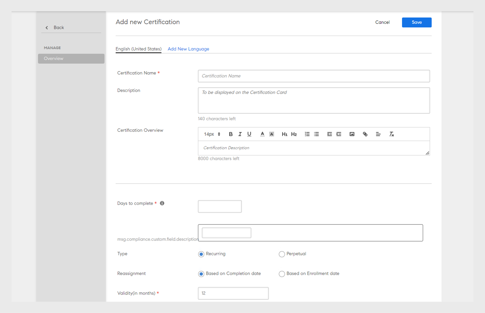

# Zertifizierungen

Erfahren Sie, wie Sie Zertifizierungen erstellen, Teilnehmer registrieren und veröffentlichte Zertifizierungen bearbeitet.

Mithilfe dieser Funktion können Sie einmalige oder regelmäßig wiederkehrende Zertifizierungen für Ihre Teilnehmer vergeben. Nur Administratoren können die Zertifizierungen für Teilnehmer definieren.

Als Administrator können Sie ein Zertifizierungsprogramm entweder intern gehostet oder von einer Drittpartei durchgeführt erstellen. Im Falle einer internen Zertifizierung definieren Sie die Kurse, die ein Teilnehmer absolvieren muss, um ein Zertifikat zu erhalten. Veröffentlichen Sie das Programm und weisen Sie es Teilnehmern zu.

## Zertifizierung erstellen {#createacertification}

1. Klicken **[!UICONTROL Zertifizierung]** im linken Bereich.\
   Eine Seite mit einer Liste aller Zertifizierungen im Status Entwurf und veröffentlicht wird angezeigt.

1. Zertifizierungen in verschiedenen Modi anzeigen:

   1. Klicken **[!UICONTROL Entwurf]** &quot; alle Zertifizierungen im Entwurfsstatus an. Sie müssen die Erstellung dieser Zertifizierungen abschließen.
   1. Klicken **[!UICONTROL Veröffentlicht]** , um alle von Ihnen veröffentlichten Zertifizierungen anzuzeigen.
   1. Klicken **[!UICONTROL Alle]** , um die Zertifizierungen in allen Status anzuzeigen.
   1. Sortieren Sie die Liste der Zertifizierungen in aufsteigender oder absteigender Reihenfolge oder nach dem Datum ihrer Aktualisierung.

1. Klicken Sie auf **[!UICONTROL Hinzufügen]**.

   Eine neue Zertifizierungsseite wird angezeigt.

*Seite zum Hinzufügen einer Zertifizierung anzeigen*

1. Fügen Sie den Namen und die Beschreibung des Zertifikats hinzu.

<table>
 <tbody>
  <tr>
   <th>Feld</th>
   <th>Beschreibung</th>
  </tr>
  <tr>
   <td>Tage bis zum Abschluss</td>
   <td>Termin für die Zertifizierung. Geben Sie einen numerischen Wert ein.</td>
  </tr>
  <tr>
   <td>Typ</td>
   <td>
    
Die Art der Zertifizierung:

    <ul>
     <li><b>Wiederkehrend</b> – Wählen Sie diese Option, wenn die Zertifizierung nach jedem Jahr, nach zwei Jahren oder drei Jahren erfolgen soll.</li>
     <li><b>Unbefristet</b> – Wählen Sie diese Option, wenn die Zertifizierung nur einmal erforderlich sein soll.</li>
    </ul></td>
  </tr>
  <tr>
   <td>Neuzuweisung</td>
   <td>Wählen Sie aus, ob das Zertifikat basierend auf dem Abschlussdatum oder basierend auf dem Registrierungsdatum zugewiesen werden soll. </td>
  </tr>
  <tr>
   <td>Gültigkeit (in Monaten)  </td>
   <td>Geben Sie an, wie lange die Zertifizierung gültig bleiben kann.</td>
  </tr>
  <tr>
   <td>Abfolge von Kursen </td>
   <td>Entscheiden Sie, ob Teilnehmer die Kurse in geordneter oder ungeordneter Weise absolvieren sollen. </td>
  </tr>
  <tr>
   <td>Registrierung widerrufen </td>
   <td>Aktivieren oder deaktivieren Sie die Option, um Teilnehmern zu ermöglichen, sich selbst zu registrieren.</td>
  </tr>
  <tr>
   <td>Zertifizierungsaussteller </td>
   <td>
    
Auswählen <b>Intern</b> , wenn sie zu Ihrer Organisation gehört, oder wählen Sie <b>Extern</b> für Zertifizierungen externer Unternehmen.

    
Wenn Sie <b>Externe Zertifizierung</b>wählen, sehen Sie zwei weitere Optionen:

    <ul>
     <li>Wie Datum der Genehmigung </li>
     <li>Eingereicht von Teilnehmer </li>
    </ul>
    
Teilnehmer können das richtige Abschlussdatum für externe Zertifizierungen angeben. In früheren Versionen wurde das Abschlussdatum standardmäßig von Prime basierend auf dem Genehmigungsdatum des Managers festgelegt. Das vom Teilnehmer angegebene Abschlussdatum sollte größer sein als das Erstellungsdatum des Zertifikats.
</td>
  </tr>
  <tr>
   <td>Dauer</td>
   <td>Wenn Sie „Externe Zertifizierung“ ausgewählt haben, geben Sie die Dauer in Minuten an.</td>
  </tr>
  <tr>
   <td>Tags</td>
   <td>Geben Sie die Tags ein, die Sie dem Zertifikat zuordnen möchten. Tags sind hilfreich, wenn Sie nach dem Zertifikat suchen möchten.</td>
  </tr>
  <tr>
   <td>Kataloge auswählen </td>
   <td>Wählen Sie den Katalog aus, in dem das Zertifikat enthalten ist.</td>
  </tr>
 </tbody>
</table>

Wählen Sie die Produkt-, Rollen- und Rollenebene im Dialogfeld &quot; **[!UICONTROL Für]** , um den Benutzern, die Interesse an diesen Produkten und Rollen bekundet haben, diesen Lernpfad vorzuschlagen.

Wählen Sie die Kurse aus, die der Zertifizierung hinzugefügt werden sollen **[!UICONTROL Kurse]** > **[!UICONTROL Katalog]** &quot; ändern.

Bewegen Sie die Maus über jede Kurskachel und klicken Sie auf &quot;+&quot;, um sie zur Zertifizierung hinzuzufügen. Klicken **[!UICONTROL Vorschau]** , um den Kurs als Teilnehmer anzuzeigen, bevor Sie ihn hinzufügen.

1. Klicken **[!UICONTROL Lehrplan]** &quot; die Liste der Kurse an, die Sie hinzugefügt haben.
1. Klicken **[!UICONTROL Veröffentlichen]**.

## Kursinstanzzuordnung für Zertifizierungen {#courseinstancemappingforcertifications}

Zuordnung des Kurses und der Instanz für Zertifizierungen:

1. Klicken Sie im linken Teilfenster auf „Zertifizierungen“.
1. Wählen Sie in der Liste der Zertifizierungen „Zertifizierung anzeigen“ für die Zertifizierung, für die Sie den Kurs und die Instanz zuordnen wollen.
1. Klicken Sie im linken Teilfenster auf „Kurse“. Die Kurse für die Zertifizierung werden angezeigt. Klicken Sie auf „Bearbeiten“.
1. Bewegen Sie den Mauszeiger über den Kurs, für den Sie die Instanzzuordnung festlegen wollen, wählen Sie „Kursinstanzzuordnung“.
1. Wählen Sie im Popup-Menü die Instanz des Kurses, der für die ausgewählte Zertifizierung bereitgestellt werden soll.
1. Klicken Sie auf „Speichern“.

Ein Administrator kann einem Lernprogramm Klassenzimmer und Kurse vom Typ &quot;Virtueller Klassenzimmer&quot; hinzufügen. Die vom Autor beim Erstellen des Kurses angegebene Sitzung wird als Standardinstanz festgelegt. Wenn der Administrator dem Lernprogramm Kurse hinzufügt, werden diese der Standardinstanz für alle Kurse zugeordnet, der Administrator kann die Instanzzuordnung jedoch ändern. Die Anzahl der einem Lernprogramm hinzugefügten Kurse wird darüber hinaus wie unten angegeben auf der Instanzenseite angezeigt.

## Vollständige Katalogsteuerung aktivieren {#catalog}

Wie die vollständige [Katalogsteuerung für Teilnehmerergebnisse oder Module](shared-catalog-full-control.md) können Sie auch die vollständige Katalogsteuerung für Zertifizierungen gewähren.

## Teilnehmer für eine Zertifizierung registrieren oder ihre Registrierung aufheben {#enrollorunenrolllearnerstothecertification}

Weitere Informationen zum Registrieren von Teilnehmern und zu den folgenden Schritten finden Sie unter [Registrieren von Teilnehmern](courses.md#main-pars_header_1058138132).

## Registrierung für Teilnehmer aufheben {#unenrollmentforlearners}

Beim Erstellen von Zertifizierungen kann der Administrator auswählen, ob Teilnehmer selbst die Registrierung für die Zertifizierungen aufheben können. Wenn der Administrator die Option auswählt, können Teilnehmer selbst die Registrierung aufheben.

*Auswählen, um die Registrierung von Teilnehmern aufzuheben*

## Als abgeschlossen markieren {#markcompletion}

Administratoren können mithilfe der für sie verfügbaren Option eine Zertifizierung als abgeschlossen markieren. Gehen Sie wie folgt vor, um eine Zertifizierung als abgeschlossen zu markieren.

1. Öffnen **[!UICONTROL Zertifizierung]** > **[!UICONTROL Teilnehmer]**.

   Die Seite &quot;Teilnehmer&quot; wird mit der Liste der registrierten Teilnehmer geöffnet.

1. Wählen Sie einen, mehrere oder alle Teilnehmer aus, um den Abschluss der Zertifizierung mithilfe des für jeden Teilnehmer verfügbaren Kontrollkästchens zu markieren.
1. Klicken  **[!UICONTROL Aktion]** > **[!UICONTROL Als abgeschlossen markieren.]**

   Beachten Sie, dass bei einer Zertifizierung mit mehreren Kursen der Abschluss für alle Kurse markiert wird.

## Pflichtkurse für externe Zertifizierung {#mandatory}

In früheren Versionen von Learning Manager war das Absolvieren eines Kurses durch Teilnehmende in der externen Zertifizierung nicht zwingend erforderlich, um ein Zertifikat zu erlangen.

Sie können jetzt Kurse verbindlich festlegen, indem Sie die Option **[!UICONTROL Erforderliche Kurse als obligatorisch für den Abschluss des Zertifikats festlegen]** auf der Registerkarte &quot;Stundenplan&quot;, während Sie die Zertifizierungen bearbeiten.

## Bearbeiten einer veröffentlichten Zertifizierung {#editingapublishedcertification}

Eine Zertifizierung kann von einem Administrator in einem veröffentlichten Status bearbeitet werden. In diesem Status kann der Administrator alle Abschnitte einer Zertifizierung bearbeiten und erneut veröffentlichen.

Um eine veröffentlichte Zertifizierung zu bearbeiten, klicken Sie auf die Zertifizierungskarte und dann auf **[!UICONTROL Bearbeiten]** oben rechts auf der Seite.

Wenn die Seite beim Bearbeiten der Abschnitte einer Zertifizierung verlassen müssen, müssen Sie die Zertifizierung erneut veröffentlichen. Es wird ein Dialogfeld für die Bestätigung zur erneuten Veröffentlichung der Zertifizierung angezeigt.

## Abonnement {#subscription}

Administratoren können Berichte zu Quizpunktzahlen und Teilnehmerstatus abrufen. Dabei können sie die Häufigkeit der Berichte, den E-Mail-Betreff und die E-Mail-ID des Empfängers festlegen. Der Empfänger erhält in den festgelegten Abständen E-Mails mit dem Bericht als Anhang.

*Berichtshäufigkeit und andere Eigenschaften festlegen*
