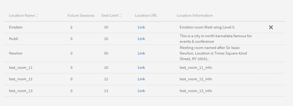
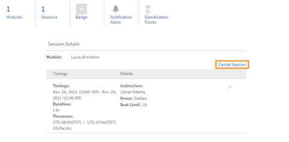

# Klassenzimmer

## Übersicht

Administratoren können jetzt eine Bibliothek mit Speicherorten für Klassenzimmer einrichten. Für jeden Speicherort des Klassenzimmers können die Administratoren die Metadaten festlegen, die den Standortnamen, die Sitzplatzbeschränkung sowie zusätzliche Informationen wie die Standort-URL enthalten. Autoren und Administratoren können diese vorkonfigurierten Klassenzimmerorte dann zum Einrichten von Schulungsereignissen mit Kursleiter (Klassenzimmermodule) verwenden.

Sie können die folgenden zwei Möglichkeiten verwenden, um einen Speicherort für ein Klassenzimmer hinzuzufügen.

## Klassenzimmer über die Benutzeroberfläche hinzufügen

Sie können einen Speicherort für ein Klassenzimmer hinzufügen, indem Sie die Benutzeroberfläche verwenden:

1. Klicken Sie in der Admin-App (der Benutzeroberfläche für Administratorrollen) auf **[!UICONTROL Einstellungen]** > **[!UICONTROL Standorte für Klassenzimmer]**.

1. Klicken Sie auf **[!UICONTROL Mehr hinzufügen]** klicken.

1. Im Dialogfeld &quot; **[!UICONTROL Speicherort des Klassenzimmers]** die folgenden Details ein:

   * Geben Sie die **[!UICONTROL Name des Klassenzimmerstandorts]**. Verwenden Sie einen eindeutigen Namen. Andernfalls zeigt der Lern-Manager eine Fehlermeldung an.
   * Geben Sie die Positionsbeschreibung in das Feld **[!UICONTROL Standortinformationen]** ein. Dieses Feld ist optional.
   * Geben Sie die **[!UICONTROL URL der Position]**. Der Teilnehmer kann diese Informationen in den Details des Klassenzimmers sehen. Bei Bedarf kann die URL auch eine URL für den Kartenspeicherort sein. Dieses Feld ist optional.
   * Geben Sie die Anzahl der verfügbaren Lizenzen in das Feld **[!UICONTROL Sitzplatzbeschränkung]** ein. Dies gibt die Sitzplatzkapazität des Klassenzimmers an. Dieser Wert kann beim Erstellen des tatsächlichen Schulungsereignisses mit Kursleiter geändert werden.

   

   *Fügen Sie einen Speicherort für das Klassenzimmer hinzu*

Nachdem Sie den Speicherort hinzugefügt haben, zeigt der Katalog **[!UICONTROL Einstellungen]** > **[!UICONTROL Standorte für Klassenzimmer]** &quot; werden die Meetingräume aufgeführt:

*Alle Meetingräume anzeigen*

Die Liste enthält die folgenden Felder:

**[!UICONTROL Name des Speicherorts]** - Name des Klassenzimmerstandorts.

**[!UICONTROL Künftige Sitzungen]** - Anzahl der Ereignisse, die an der entsprechenden Position auftreten. Klicken Sie auf die Zahl, um die Details in einem Dialogfeld anzuzeigen.

*Zukünftige Sessions anzeigen*

Im Dialogfeld werden die Details jeder Sitzung angezeigt, einschließlich des Namens der Sitzung, des Namens der Schulung, die die Sitzung enthält, und des Sitzungszeitplans. Die angezeigte Zeit ist mit der Systemzeitzone des Teilnehmers ausgerichtet.

Die **[!UICONTROL Künftige Sitzungen]** Feldanzeigen **Null** wenn das Klassenzimmer nicht für eine Sitzung verwendet wird oder wenn das Klassenzimmer mit früheren Sitzungen verknüpft ist.

**URL der Position** - URL, die Sie beim Erstellen des Klassenzimmerspeicherorts angegeben haben.

**Standortinformationen** - die Informationen zum Klassenzimmer, die Sie beim Erstellen des Klassenzimmers angegeben haben.

## Klassenzimmer über CSV hinzufügen

Alternativ können Sie einen oder mehrere Speicherorte für Klassenzimmer hinzufügen, indem Sie eine CSV-Datei importieren, die die Informationen zum Klassenzimmer enthält.

In **[!UICONTROL Admin-App]** > **[!UICONTROL Einstellungen]** > **[!UICONTROL Standorte für Klassenzimmer]** auf die Schaltfläche **[!UICONTROL Speicherorte in CSV importieren]** klicken. Navigieren Sie zum Speicherort der CSV-Datei und wählen Sie die Datei aus.

In der CSV-Datei werden diese Felder verwendet, um Details zu einem oder mehreren Speicherorten für Klassenzimmer zu speichern:

* name
* Info
* url
* seatLimit

Sie können die Kopfzeilen anpassen.

Die CSV-Datei muss zwingend alle Spalten in der hier angegebenen Reihenfolge enthalten.

Nachdem das System die CSV-Datei importiert hat, werden die Speicherorte der Bibliothek hinzugefügt.

## Klassenzimmer suchen

Ein Autor oder Administrator kann mit der Eingabe des Speicherortnamens beginnen, um die relevanten Ergebnisse anzuzeigen, die angezeigt werden. Ein Autor oder Administrator kann dann einen Speicherort aus den angezeigten Ergebnissen auswählen. Wenn in den Typeahead-Ergebnissen kein Speicherort angezeigt wird, kann der Benutzer dennoch den neuen Klassenzimmerstandortnamen hinzufügen. Beachten Sie, dass der Name des Speicherorts, der mit dem Arbeitsablauf für die Sitzungserstellung erstellt wurde, nicht der vom Administrator erstellten Speicherortbibliothek hinzugefügt wird.

Wenn ein Klassenzimmer hinzugefügt wird, zeigt die Lernplattform auch an, ob das Klassenzimmer bereits für den genannten Zeitraum gebucht ist. Es bietet sogar alternative Zeitfenster als Vorschläge an. Dadurch kann der Autor die Meetingzeit anpassen, wenn er beschließt, denselben Speicherort für das Klassenzimmer zu verwenden.

*Klassenzimmer suchen*

## Auf vordefinierte Liste von Kursleitern beschränken

Derzeit können die Benutzer jeden registrierten Benutzer als Kursleiter hinzufügen, wenn sie ein Klassenzimmer oder eine virtuelle Klassenzimmersitzung erstellen. Diese Funktionalität bleibt in dieser Version unverändert.

Administratoren haben jetzt jedoch eine zusätzliche Option, um zu steuern, wer als Kursleiter auf der Lernplattform zugewiesen wird. Dadurch wird verhindert, dass beim Erstellen einer Sitzung versehentlich ein neuer Kursleiter hinzugefügt wird.

## Administrator

Ein Administrator kann die Option **[!UICONTROL Kursleiter-Management]** (verfügbar unter **[!UICONTROL Admin-App]** > **[!UICONTROL Einstellungen]** > **[!UICONTROL Allgemein]**), um sicherzustellen, dass nur die Benutzer, die vordefinierte Kursleiter sind, als Kursleiter für eine Sitzung hinzugefügt werden können.

Um einen Kursleiter einzurichten, können Administratoren **[!UICONTROL VERWALTEN]** > **[!UICONTROL Benutzer]** , um die Benutzerverwaltungsseite zu öffnen, wählen Sie einen Benutzer aus und weisen Sie dann dem Benutzer die Kursleiterrolle zu (mit **[!UICONTROL Aktionen]** > **[!UICONTROL Rolle zuweisen]**).

## Autor

Wenn der Administrator die Option **[!UICONTROL Kursleiter-Management]** kann ein Autor nur nach den Benutzern mit der Kursleiterrolle suchen und sie den Klassenzimmersitzungen, virtuellen Klassenzimmersitzungen, Checklisten und Dateiübermittlungsmodulen hinzufügen.

Darüber hinaus kann ein Autor:

* Fügen Sie Kursleiter zu den vorhandenen Sitzungen hinzu und entfernen Sie sie.
* Fügen Sie Kursleiter zu den vorhandenen Sitzungen hinzu, die bereits über einen oder mehrere Kursleiter verfügen.

Nachdem ein Administrator also das **[!UICONTROL Kursleiter-Management]** können nur Benutzer mit der Kursleiterrolle als Kursleiter hinzugefügt werden.

>[!NOTE]
>
>Dies gilt nicht, wenn Sie Sitzungen mithilfe der CSV-Datei der Sitzungen migrieren. In diesem Fall kann ein Benutzer, der nicht über die Kursleiterrolle verfügt, als Kursleiter hinzugefügt werden.

## Bestehende Sitzung abbrechen

Ein Autor oder Administrator kann eine Sitzung abbrechen und bei Bedarf neu planen.

Wenn ein Benutzer eine Sitzung abbricht, sendet das System eine E-Mail zum Abbruch der Sitzung an alle registrierten Teilnehmer und Kursleiter. Die E-Mail enthält die aktualisierten Sitzungsdetails.

Es gibt eine Vorlage namens **[!UICONTROL Sitzungsabbruch]** , die das Abbrechen einer Sitzung erleichtert.

Im Fenster &quot; **[!UICONTROL Kursinstanz]** &quot; enthält jede Sitzung, die unter einer Kursinstanz aufgeführt ist, eine Option zum Abbrechen der Sitzung.

*Bestehende Sitzung abbrechen*

Wenn Sie auf die Schaltfläche **[!UICONTROL Sitzung abbrechen]** Link, wird eine Warnmeldung angezeigt.

Wenn Sie im Dialogfeld mit der Warnmeldung auf **[!UICONTROL Fortfahren]** klicken, bricht das System die Sitzung ab.

Das System löscht auch die folgenden Details, nachdem eine Sitzung abgebrochen wurde:

* Datum des Sitzungsbeginns
* Enddatum der Sitzung
* Startzeit der Sitzung
* Endzeit der Sitzung
* Kursleiter, die der Sitzung hinzugefügt wurden
* URL des virtuellen Klassenzimmers
* Ort/Ort, der der Sitzung hinzugefügt wurde
* Limit für Warteliste, das vom Kursleiter hinzugefügt wurde

## Administrator

Im Fenster &quot; **[!UICONTROL Kursinstanz]** &quot; kann ein Administrator eine oder mehrere Sitzungen abbrechen. Nachdem der Administrator eine Sitzung abgebrochen hat, löscht das System alle Sitzungsdetails mit Ausnahme der Sitzplatzbeschränkung.

Darüber hinaus kann ein Administrator:

* Anzeigen der registrierten Teilnehmer und der auf die Warteliste gesetzten Teilnehmer einer Sitzung.
* Heben Sie die Registrierung von Teilnehmern für einen Kurs mit mindestens einer abgebrochenen Sitzung auf.
* Teilnahme für abgebrochene Sitzungen vermerken.
* Markieren Sie einen Kurs als abgeschlossen, der eine oder mehrere abgebrochene Sitzungen enthält.
* Planen Sie eine Sitzung neu, die abgebrochen wurde.
* Fügen Sie einen Kursleiter zu einer abgebrochenen Sitzung hinzu, wenn Sie ihn neu planen.

Beachten Sie, dass die Teilnehmer, die sich für die Schulungsinstanz registriert haben, auch nach der Kündigung weiterhin angemeldet bleiben. Ihr Registrierungsstatus - einschließlich bestätigter Registrierung, Warteliste und Genehmigung durch den Manager - ändert sich nicht. Dies ist nützlich, da der Administrator die abgebrochene Sitzung in Zukunft einrichten und neu planen kann.

## Autor

Im Fenster &quot; **[!UICONTROL Kursinstanz]** können Autoren eine oder mehrere Sitzungen abbrechen. Nachdem der Autor eine Sitzung abgebrochen hat, löscht das System alle Sitzungsdetails mit Ausnahme der Sitzplatzbeschränkung.

Daher kann ein Autor die **[!UICONTROL Sitzung abbrechen]** Links zum Stornieren einer oder mehrerer Sitzungen im Schulungsraum oder virtueller Sitzungen, die in derselben oder in verschiedenen Kursinstanzen verfügbar sind.
