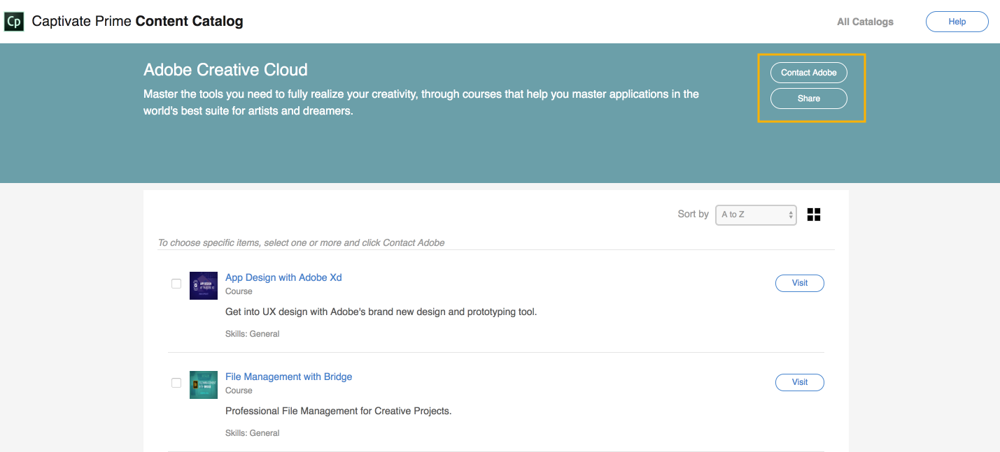

# Learning Manager-Inhaltskatalog

<!--Learning Manager introduces Content Catalog-->

Der Inhaltskatalog wird in einer Azure-Instanz von Learning Manager nicht unterstützt.

* **Kurs** ist eine einzelne Konsolidierung von Arbeits- und eLearning-Modulen zu einem bestimmten Thema, die mit Adobe Learning Manager erstellt und dem Kunden bereitgestellt wird.
* **Inhaltsanbieter** ist der proprietäre Eigentümer von Kursen, der Adobe autorisiert hat, solche Kurse in Adobe Learning Manager anzubieten und Unterlizenzen dafür zu vergeben.

Learning Manager führt den Inhaltskatalog ein, eine Reihe gebrauchsfertiger Inhaltsdatenbanken, die Sie erwerben können. In unserem Marktplatz für kuratierte Inhalte können Sie Standardkurse etwa zu Geschäftskompetenzen, Compliance am Arbeitsplatz, Adobe Creative Cloud und Technologie kaufen.

Klicken Sie im linken Bereich auf Content Marketplace und dann auf **[!UICONTROL Creative Cloud Training]**.

<!---->

Um die Katalogdetails und Kurse in jedem Katalog anzuzeigen, klicken Sie auf **[!UICONTROL Ansicht]**. Das neue Fenster zeigt alle Kurse an.

<!---->

Um die Details des Kurses anzuzeigen, klicken Sie auf **[!UICONTROL Besuchen]**. Verwenden Sie die Kontrollkästchen, um die Kurse auszuwählen, an denen Sie interessiert sind.

* Sie können die ausgewählten Kurse für Ihre Kollegen freigeben, indem Sie **[!UICONTROL Freigeben]** auswählen.
* Sie können die Adobe kontaktieren, indem Sie **[!UICONTROL Adobe kontaktieren]** auswählen.

<!---->

Ihr E-Mail-Client wird standardmäßig in beiden Fällen geöffnet. Wenn Sie bestimmte Kurse über die Kontrollkästchen ausgewählt haben, werden ihre URLs automatisch zum E-Mail-Text hinzugefügt.

Wenn Ihr E-Mail-Client standardmäßig nicht geöffnet wird, können Sie Ihr Interesse per E-Mail an `learningmanagercontentcontentadmin@adobe.com` senden.

Sie müssen bei Learning Manager angemeldet sein, um auf den Inhaltskatalog zugreifen zu können.
