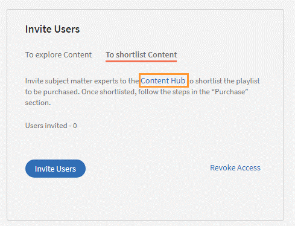
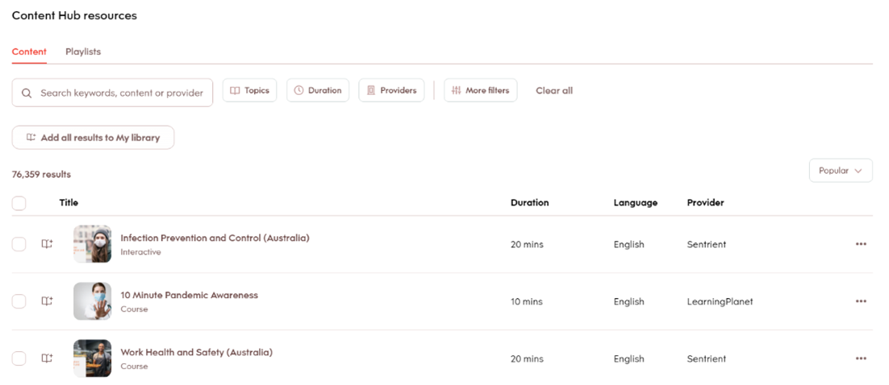

# Inhalts-Marketplace

Inhaltsbibliothek bietet jetzt den Inhalts-Marketplace an, auf dem Sie Schulungen durchsuchen und erwerben können. Lernen Sie mehr als 70.000 Kurse kennen, die eine Vielzahl von Themen abdecken und in mehreren Formaten verfügbar sind. Wählen Sie aus kuratierten Wiedergabelisten, die eine Vielzahl von Rollen abdecken sowie Ihre Lern- und Weiterbildungsanforderungen erfüllen.

In der Administrator-App gibt es eine neue Option **[!UICONTROL Content Marketplace]**, den Sie im linken Bereich finden.

Benutzer können ihre Kaufauswahl aus kuratierten Wiedergabelisten treffen, die verschiedene Themen abdecken, oder den gesamten Katalog erwerben.

Auf der Seite sehen Sie zwei Kacheln: Unternehmensschulung und Creative Cloud-Schulung. Die erste Kachel startet den Marketplace, über den Sie Kurse für Ihre Teilnehmer erwerben können. Die zweite Kachel startet den Inhaltskatalog.

Auf der Seite &quot;Unternehmensschulung&quot; in der Administrator-App können Sie Benutzer einladen, den Interessenbericht herunterladen und den gesamten Katalog oder die kuratierte Wiedergabeliste erwerben.

**Benutzer einladen**

Laden Sie Benutzer zum Inhalts-Marketplace ein, um Inhalte zu entdecken und ihr Interesse auszudrücken. Als Administrator können Sie entweder alle Teilnehmer im Konto oder ausgewählte Teilnehmer einladen. Um Teilnehmern Zugriff zu gewähren, müssen Sie sie einladen.

Ein Teilnehmer kann auch von der Inhalts-Marketplace-Option widerrufen werden. Um den Zugriff zu widerrufen, klicken Sie auf das **[!UICONTROL Zugriff widerrufen]** Link.  Benutzer können die Seite &quot;Inhalts-Marketplace&quot; in der Teilnehmer-App nicht mehr sehen.

Diese Option ist standardmäßig für alle neuen Konten ausgewählt. Bei vorhandenen Konten muss der Administrator die Benutzer einladen, den Marktplatz zu erkunden.

## Kaufen

Sie erhalten unbegrenzten Zugriff auf die gesamte Kursbibliothek. Klicken Sie auf **[!UICONTROL Kaufen]** , um ein Kaufanfrageformular herunterzuladen.

*Geben Sie die Anzahl der Lizenzen für den Kauf ein.*

Geben Sie die Anzahl der Lizenzen an, für die Sie die Kurse erwerben möchten. Laden Sie das Kaufanfrageformular herunter, und senden Sie das Formular dann an das Vertriebsteam von Learning Manager.

Das Team überprüft daraufhin die Informationen und generiert einen Schlüssel, der Ihnen bereitgestellt wird. Dies ist der Aktivierungsschlüssel, mit dem Sie Ihren Benutzern Zugriff auf das Inhaltsangebot gewähren.

Wenn der Schlüssel vom CSAM-Team erzeugt wurde, kann der Administrator ihn verwenden, um die Kurse zu importieren und sie in den vorhandenen Katalog oder den neuen Katalog zu migrieren.

Während der Migration von Kursen wird der Status als **[!UICONTROL Kurse importieren]** angezeigt. Sobald die Migration abgeschlossen ist, erhält der Administrator eine Benachrichtigung, dass die Migration erfolgreich abgeschlossen wurde.

Die **[!UICONTROL Lizenzen]** zeigt dann alle Lizenzen an, die für das Konto erworben wurden.

Der Administrator kann die Links der gekauften Kataloge auf der Seite „Katalogübersicht“ sehen.

Sobald die Kurse dem Katalog hinzugefügt wurden, kann der Administrator den verschiedenen Benutzern oder Benutzergruppen Zugriff auf die Schulungen gewähren.

*Benutzern und Benutzergruppen Zugriff auf Schulungen gewähren*

## Interessenbericht

Wenn ein Teilnehmer in der Teilnehmer-App auf „Interesse bekunden“ klickt, wird das Interesse in einem Interessenbericht aufgezeichnet. Der Administrator kann den Bericht herunterladen. Der Bericht (CSV) enthält die folgenden Felder:

* Name des Katalogs
* Anzahl der interessierten Benutzer
* E-Mail-Adresse des interessierten Benutzers

## E-Mail-Vorlagen

Es stehen drei E-Mail-Vorlagen zur Verfügung, die Sie für diesen Arbeitsablauf verwenden können:

1. **[!UICONTROL Inhaltsaktivierung erfolgreich]:** Diese E-Mail wird versendet, wenn der Kauf eines Inhalts mit einem Schlüsselnamen erfolgreich war. Alle erworbenen Schulungen sind jetzt verfügbar.
1. **[!UICONTROL Fehler bei automatischem Benutzerupload]:** Diese E-Mail wird gesendet, wenn die automatische Aktualisierung der CSV-Datei im Konto aus irgendeinem Grund fehlschlägt.
1. **[!UICONTROL Benutzer einladen, Inhalte zu entdecken]:** Dies ist eine Einladungs-E-Mail, die an Teilnehmer gesendet wird, wenn der Administrator Kurse erworben hat. Der Administrator kann den Interessenbericht anzeigen, um die allgemeinen Anforderungen zu verstehen und die Kaufentscheidung zu treffen.

1. Erworbene Kurse können nicht zu wiederholten Zertifikaten hinzugefügt werden.
1. Erworbene Kurse können nicht mit Peer-Konten geteilt werden.
1. Die erworbenen Kurse können von allen Benutzern genutzt werden, die Zugriff darauf erhalten. Konfigurieren Sie die Katalogsichtbarkeit, um die Sichtbarkeit erworbener Kurse auf bestimmte Benutzer zu beschränken.
1. Erworbene Kurse können nicht mehr genutzt werden, wenn der Aktivierungsschlüssel abgelaufen ist. Bitte kaufen/aktivieren Sie einen anderen Schlüssel, um die Nutzung zu ermöglichen.

## Materialien-Hub auf dem Inhalts-Marketplace

Mit dem Materialien-Hub können Administratoren und Fachexperten (Subject Matter Experts, SMEs) benötigte Wiedergabelisten aus der Teilnehmer-App in die Auswahlliste aufnehmen. Nach der Aufnahme in die Auswahlliste können Administratoren das Kaufanfrageformular herunterladen und es für den Adobe-Vertriebsmitarbeiter freigeben.

Ein Administrator kann SMEs einladen, die Wiedergabeliste, an der sie interessiert sind, in die Auswahlliste aufzunehmen.

*Starten des Content Hub auf dem Marktplatz*

Das Materialien-Hub ist in der Teilnehmerrolle für alle Administratoren verfügbar. Administratoren ermöglichen es SMEs, die Wiedergabeliste, die sie erwerben möchten, in die Auswahlliste aufzunehmen.

Die Seite „Materialien-Hub“ ist für Administratoren in ihrer Teilnehmerrolle ständig sichtbar, damit sie unkompliziert Wiedergabelisten in Auswahllisten aufnehmen können. Um Sie beim Aufnehmen der richtigen Wiedergabeliste in die Auswahlliste zu unterstützen, können Administratoren diese Seite für eingeschränkte SMEs in ihrem Konto zugänglich machen. Rufen Sie dazu einfach auf Administratorseite die Seite „Unternehmensschulung“ auf und führen Sie die erforderlichen Schritte aus, um den Zugriff zu gewähren.

*Ressourcen im Materialien-Hub anzeigen*

In Learning Manager können Administratoren außerdem eine in der Auswahlliste aufgeführte Wiedergabeliste herunterladen und sie für das Adobe-Vertriebsteam freigeben. Besuchen Sie vor dem Herunterladen der Auswahlliste den Materialien-Hub und nehmen Sie eine Wiedergabeliste in die Auswahlliste auf, indem Sie sie zu Ihrer Bibliothek hinzufügen.

Klicken Sie dann als Administrator auf **[!UICONTROL Content Marketplace]** > **[!UICONTROL Unternehmensschulung]** > **[!UICONTROL Abschnitt &quot;Kaufen&quot;]** > **[!UICONTROL Kuratierte Wiedergabelisten]**. Klicken Sie auf die Schaltfläche **[!UICONTROL Kaufen]**, um das Kaufanfrageformular herunterzuladen, das die Details zu Ihrer in der Auswahlliste aufgeführten Wiedergabeliste enthält.

*Kaufanfrageformular herunterladen*

Die Kurse und Wiedergabelisten, die Sie im Materialien-Hub sehen, sind dieselben wie im Inhalts-Marketplace. Der Materialien-Hub bietet Administratoren und eingeschränkten SMEs einfach die Möglichkeit, Wiedergabelisten für den Kauf in eine Auswahlliste aufzunehmen.
