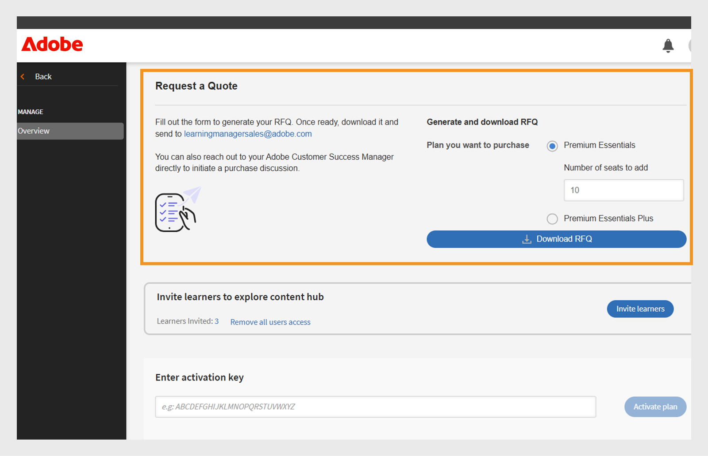

# Inhalts-Marketplace

Schulungsadministratoren stehen oft vor Herausforderungen beim Beschaffen und Hochladen qualitativ hochwertiger Inhalte. Der Inhalts-Marketplace in Adobe Learning Manager vereinfacht dies, indem die Lizenzierung von Premium-Kursen von vertrauenswürdigen Anbietern ermöglicht wird, was eine schnellere, skalierbare Lernbereitstellung ermöglicht. Mithilfe des Inhalts-Marketplace kann der Administrator Kurse von Drittanbietern durchsuchen, in der Vorschau anzeigen und lizenzieren.

Der Inhalts-Marketplace bietet die folgenden Abos für das Erwerben von Inhalten:

* **[!UICONTROL Premium Essentials]**
* **[!UICONTROL Premium Essentials Plus]**

| **[!UICONTROL Premium Essentials]** | **[!UICONTROL Premium Essentials Plus]** |
|---|---|
| Zugriff auf mehr als 90.000 Kurse | Zugriff auf mehr als 100.000 Kurse |
| Inhalte von mehr als 250 Anbietern | Enthält alle Premium Essentials-Inhalte |
| Exklusive Inhalte von vertrauenswürdigen Anbietern wie:<li>EasyLama</li><li>Skillshub</li><li>Thomson Reuters</li><li>Emtrain</li><li>Harvard ManageMentor</li> | Exklusive Kurse von führenden Anbietern wie: <li>Blinkist</li><li>Pluralsight</li>Skillsoft</li><li>Traliant</li><li>Coursera</li> |

<!--**[!UICONTROL Premium Essentials]**:
A cost-effective solution designed to enhance employee engagement. 

* Access to over 90,000 courses
* Content from more than 250 providers
* Focus on compliance and skill improvement
* Exclusive content from trusted providers such as:
   * EasyLlama
   * Skillshub
   * Thomson Reuters
   * Emtrain
   * Harvard ManageMentor

**[!UICONTROL Premium Essentials Plus]**:

* Access to more than 100,000 courses
* Includes all Premium Essentials content
* Exclusive courses from top providers like:
   * Blinkist
   * Pluralsight
   * Skillsoft
   * Traliant
   * Coursera

Select the plan that best meets your organization's learning goals and budget.-->

## Inhalte von Anbietern abrufen

Führen Sie die folgenden Schritte aus, um Inhalte von Inhaltsanbietern zu suchen und abzurufen:

1. Wählen Sie **[!UICONTROL Content Marketplace]** auf der Startseite des Administrators aus. Die Seite **[!UICONTROL Inhalts-Marketplace]** wird angezeigt.

   
   _Kaufpläne auf der Seite &quot;Inhalts-Marketplace&quot; anzeigen_

2. Administratoren können eine Vorschau des Inhalts-Hub für **[!UICONTROL Premium Essentials]**- und **[!UICONTROL Premium Essentials Plus]**-Abos anzeigen und durchsuchen.

Inhaltsanbieter verwalten die Entfernung veralteter Inhalte und stellen sicher, dass kein Lernmaterial ohne vorherige Ankündigung eingestellt wird.

<!--Learning Manager now offers Content Marketplace for you to explore and purchase trainings. Explore 70,000+ courses that cover a wide range of topics, available in multiple formats. Choose from curated playlists that cater to a vast variety of roles and meet your learning and upskilling needs.

In the Administrator app, there is a new option **[!UICONTROL Content Marketplace]**, which you'll find on the left panel.

Users can purchase from curated playlists covering various topics or purchase the entire catalog. 

On the page, you can see two tiles, Enterprise Training and Creative Cloud Training. The first tile launches the marketplace, using which you can acquire courses for your learners. The latter launches the content catalog.

The Enterprise Training page in the Administrator app enables you to invite users and download the Express Interest report, and also purchase the entire catalog or curated playlist.-->

## Angebot anfordern

Administratoren können ein Abo wie Premium Essentials oder Premium Essentials Plus auswählen, die Anzahl der erforderlichen Lizenzen angeben und ein herunterladbares Formular für die Angebotsanforderung generieren. Nach dem Ausfüllen wird das Formular zur Verarbeitung an das Vertriebsteam von Adobe Learning Manager gesendet. Mit dem Prozess &quot;Angebotsanfrage&quot; kann Adobe auch individuelle Preise anbieten, die auf den Anforderungen der Organisation basieren.

Führen Sie die folgenden Schritte aus, um die häufig gestellten Fragen herunterzuladen:

1. Wählen Sie den **[!UICONTROL Inhalts-Marketplace]** auf der Administrator-Homepage aus.

2. Wählen Sie den Lizenztyp aus, und geben Sie die Anzahl der Lizenzen ein, um das Angebot im Abschnitt **[!UICONTROL Angebot anfordern]** zu erstellen.

3. Wählen Sie **[!UICONTROL Angebotsanforderung herunterladen]**, um das Angebot herunterzuladen.

_Laden Sie die Angebotsanfrage herunter, nachdem Sie ein Abo ausgewählt haben_

Senden Sie das Angebot zum Aktivieren Ihrer Lizenz an [learningmanagersales@adobe.com](mailto:learningmanagersales@adobe.com). Sie können sich auch an Ihren Adobe Customer Success Manager wenden, um den Kaufvorgang zu starten.

## Teilnehmer zum Materialien-Hub einladen

Laden Sie Teilnehmer zum Inhalts-Marketplace ein, um Inhalte zu entdecken und ihr Interesse auszudrücken. Als Administrator können Sie entweder alle Teilnehmer im Konto oder ausgewählte Teilnehmer einladen. Die Teilnehmer müssen eingeladen werden, bevor sie den Inhalt erkunden können. Weitere Informationen zum Inhalts-Hub finden Sie im [Artikel](/help/migrated/administrators/feature-summary/content-marketplace.md#content-hub).

So laden Sie Teilnehmer ein:

1. Wählen Sie den **[!UICONTROL Inhalts-Marketplace]** auf der Administrator-Homepage aus.
2. Wählen Sie **[!UICONTROL Teilnehmer einladen]** und wählen Sie die erforderlichen Teilnehmer aus.
3. Wählen Sie **[!UICONTROL Teilnehmer einladen]**.

Administratoren können den Zugriff auf den **[!UICONTROL Inhalts-Hub]** auch widerrufen, indem sie den Link **[!UICONTROL Zugriff für alle Benutzer entfernen]** auswählen. Sobald der Zugriff widerrufen wurde, sehen die Teilnehmer die Seite &quot;Materialien-Hub&quot; nicht mehr in ihrer Teilnehmer-App.

_Benutzer einladen, auf den Materialien-Hub zuzugreifen_

Diese Option ist standardmäßig für alle neuen Konten aktiviert. Bei vorhandenen Konten müssen Administratoren die Teilnehmer manuell einladen, auf den Inhalts-Marketplace zuzugreifen.

<!--## Purchase

You get unlimited access to the entire library of courses. Click the **[!UICONTROL Purchase]** button to download a Purchase Request form.

*Enter the number of seats to purchase*

Specify the number of seats for which you want to purchase the courses for. Download the purchase request form and then send the form to the sales team of Learning Manager.

The team will then validate the information and then generate a key, which will be provided to you. This is the activation key using which you'll grant access to your users to the content offering.

After the key is generated by the CSAM team, the Administrator can use the key to import the courses, and migrate the courses into the existing catalog or the new catalog.

During migration of courses, the status displays as **[!UICONTROL Importing Courses]**. Once the migration completes, the Administrator gets a notification that migration is complete and successful.

The **[!UICONTROL Licenses]** section then displays all the licenses that are acquired for the account.

The Administrator can see the links of the purchased catalogs in the Catalog Overview page.

Once the courses are added to the catalog, the Administrator can then grant access to the trainings to various user or user groups.

*Grant access to training to users and user groups*-->

<!--## Express interest report

When a learner clicks Express interest to Catalog in the Learner app, the interest is recorded in an Express interest report. The Administrator can download the report. The report (csv) contains the following fields:

* Name of the catalog
* Number of users expressing interest
* Email of the user expressing interest-->

## Materialien-Hub

Mit dem Materialien-Hub können Administratoren erforderliche Wiedergabelisten aus der Teilnehmer-App in eine Auswahlliste aufnehmen. Die Seite &quot;Materialien-Hub&quot; ist für Administratoren in ihrer Teilnehmerrolle ständig sichtbar, da sie so die Möglichkeit hat, Wiedergabelisten einfach in Auswahllisten aufzunehmen. Um Ihnen beim Aufnehmen der richtigen Wiedergabeliste in die Auswahlliste zu helfen, können Administratoren diese Seite für eingeschränkte Fachexperten in ihrem Konto zugänglich machen.

Adobe Learning Manager wird regelmäßig mit dem Materialien-Hub synchronisiert, um sicherzustellen, dass neue Ergänzungen und Aktualisierungen automatisch in der Plattform übernommen werden.

Der gesamte Inhalt wird unterstützten Sprachen zugeordnet, sodass Administratoren Inhalte auf der Grundlage von Sprachvoreinstellungen effektiver filtern und verwalten können.

## E-Mail-Vorlagen

Adobe Learning Manager bietet vorkonfigurierte E-Mail-Vorlagen, die Administratoren und Teilnehmer über den Kauf von Inhalten, Systemaktualisierungen und Lernaktivitäten informieren.

Es gibt drei E-Mail-Vorlagen, die Sie verwenden können:

1. **[!UICONTROL Inhaltsaktivierung erfolgreich]:** Nach erfolgreichem Kauf von Inhalten von Drittanbietern an Administratoren gesendet. Mit dieser Benachrichtigung wird bestätigt, dass die Aktivierung abgeschlossen ist und die erworbenen Inhalte jetzt im System für die Teilnehmerzuweisung verfügbar sind.
2. **[!UICONTROL Fehler beim automatischen Benutzerupload]:** Wird ausgelöst, wenn ein automatisierter Benutzerimport über CSV fehlschlägt. Diese Warnung hilft Administratoren dabei, Probleme in geplanten Benutzeraktualisierungen schnell zu erkennen, sodass Korrekturmaßnahmen ergriffen werden können.
3. **[!UICONTROL Benutzer einladen, Inhalte zu entdecken]:** Eine Einladungs-E-Mail, die an Teilnehmer gesendet wird, sobald der Administrator Inhalte vom Marketplace erwirbt. Danach können Benutzer sofort mit dem Lernen beginnen.

<!--Purchased courses cannot be added in recurring certificates.
Purchased courses cannot be shared to peer accounts.
Purchased courses can be consumed by all users who get access to it. Configure the catalog visibility to restrict the visibility of purchased courses to limited users.
Purchased courses cannot be consumed once the activation key expires. Please purchase/activate another key to allow consumption.-->

<!--## Content Hub in Content Marketplace

Content Hub allows Administrators and Subject Matter Experts (SMEs) to shortlist required playlists from learner app. Once shortlisted, Admins can download the Purchase Request Form and share it with the Adobe Sales agent.

An Admin can invite SMEs to shortlist the playlist which they are interested in. 

*Launch Content Hub from the marketplace*

Content Hub is available in Learner role for all Administrators. Administrators allow SMEs to shortlist the playlist which they are interested in purchasing.

The Content Hub page is visible to Administrators in their learner role all the time as it allows them to shortlist playlists easily. To help you in shortlisting the right playlist, Admins can make this page accessible to limited Subject matter experts in their account. Just visit the Enterprise Training page on Admin side and take steps to provide access.  

*View resources in the Content hub*

Learning Manager also enables Administrators to download a shortlisted playlist and share it with Adobe Sales team. Before downloading the shortlist, visit the Content Hub and shortlist a playlist by adding a playlist to your library. 

Then as Administrator, click **[!UICONTROL Content Marketplace]** > **[!UICONTROL Enterprise Training]** > **[!UICONTROL Purchase section]** > **[!UICONTROL Curated Playlists]**. Click the **[!UICONTROL Purchase]** button to download the Purchase request form which contains the details of your shortlisted playlist.

*Download the Purchase Request form*

The courses and Playlist which you see in the Content Hub are the same as what you see in the Content Marketplace. Content Hub simply provides an ability for Administrators and limited SMEs to shortlist playlist easily for purchase.-->
