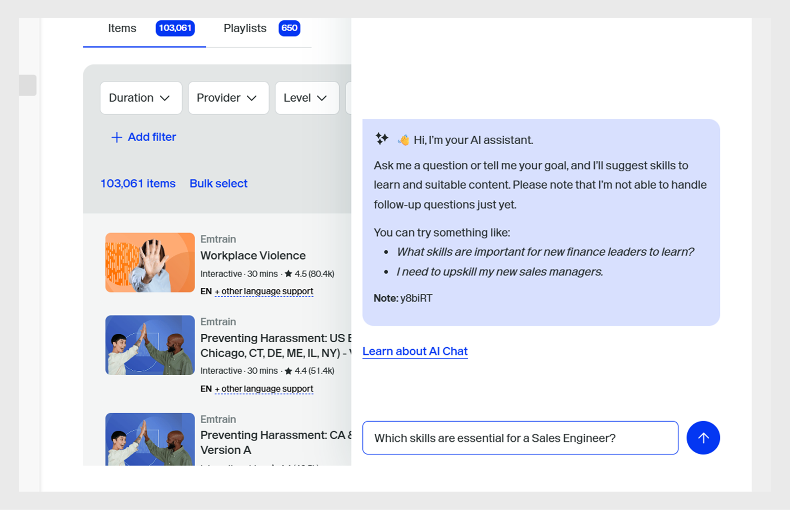
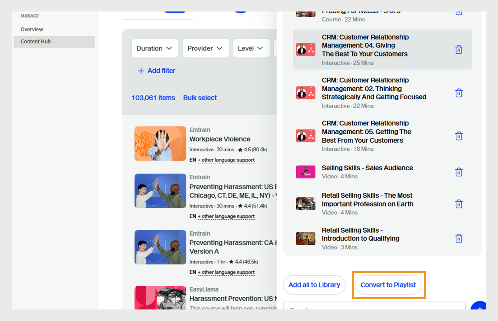
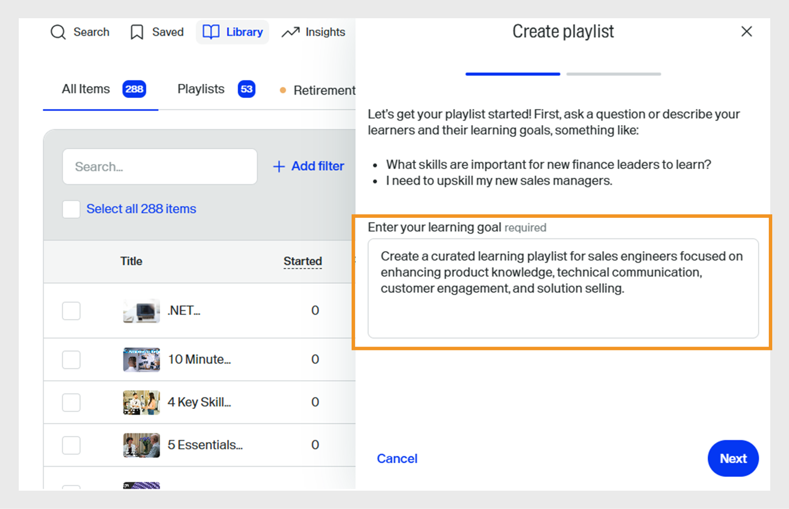

# Kuratieren von Go1-Kursen zu einem Lernpfad

Administratoren müssen oft Kurse aus mehreren Repositorys oder Katalogen kuratieren, wodurch es schwierig ist, die besten Optionen zu identifizieren. Dies ist besonders schwierig bei Go1, wo Tausende von Kursen verfügbar sind. Um dies zu vereinfachen, stellen wir eine KI-gestützte Kurationsfunktion direkt im Erstellungsfluss für Lernpfade bereit. Dadurch können Administratoren die relevantesten Kurse schnell ermitteln und auswählen.

Fügen Sie Go1-Kurse direkt zu Lernpfaden und Zertifizierungen hinzu. Erstellen Sie Lernpfade, die Go1-Kurse enthalten, damit Teilnehmer im Rahmen ihrer Schulung auf ausgewählte Go1-Kurse zugreifen können.

>[!INFO]
>
>Sie benötigen eine aktive Go1-Lizenz, um Go1-Kurse zu Lernpfaden oder Zertifizierungen hinzuzufügen. In diesem [Artikel](/help/migrated/administrators/feature-summary/content-marketplace.md) finden Sie weitere Informationen zu Go1-Lizenzdetails.

## Lernpfad erstellen

So erstellen Sie einen Lernpfad mit Go1-Kursen:

1. Melden Sie sich bei Adobe Learning Manager als Administrator an.
2. Wählen Sie im linken Navigationsbereich **[!UICONTROL Lernpfade]** aus.
3. Wählen Sie **[!UICONTROL Hinzufügen]** aus.

   
   _Wählen Sie Hinzufügen im Abschnitt &quot;Lernpfade&quot; aus, um neue strukturierte Schulungsprogramme für Ihre Teilnehmer zu erstellen und zu organisieren_

4. Geben Sie die erforderlichen Details ein und wählen Sie **[!UICONTROL Speichern]**. Weitere Informationen finden Sie in diesem [Artikel](/help/migrated/administrators/feature-summary/learning-paths.md).
5. Sie können einem Lernpfad auf folgende Weise Kurse hinzufügen:

   * **[!UICONTROL Kurse oder Lernpfade hinzufügen]**: Fügen Sie vorhandene Kurse oder Lernpfade hinzu, die in Adobe Learning Manager verfügbar sind.
   * **[!UICONTROL Kuratieren Sie Inhalte von Go1]**: Fügen Sie Kurse von der Go1-Plattform hinzu.
6. Wählen Sie **[!UICONTROL Inhalt aus Go1]** kuratieren.

   
   _Fügen Sie Ihrer Wiedergabeliste für Vertriebsingenieure für die Qualifikationsentwicklung Go1-Kurse hinzu, um die Lernoptionen mit kuratierten Inhalten von Drittanbietern zu erweitern_
7. Administratoren können eine Wiedergabeliste auf folgende Weise erstellen:

   * **[!UICONTROL Go1 AI Assistant]** wird verwendet. Weitere Informationen finden Sie unter [Go1 AI Assistant](/help/migrated/administrators/feature-summary/content-marketplace/curate-go1-playlist.md#go1-ai-assistant).
   * Wählen Sie in der **[!UICONTROL Bibliothek]** die Option **[!UICONTROL Wiedergabeliste erstellen]** aus und wählen Sie eine der folgenden Optionen aus:
a. **[!UICONTROL mit KI]**: Erstellen Sie mithilfe von KI eine Playlist. Weitere Informationen finden Sie in diesem [Abschnitt](/help/migrated/administrators/feature-summary/content-marketplace/curate-go1-playlist.md#create-a-playlist-with-ai).
b. **[!UICONTROL von mir]**: Erstellen Sie eine Playlist, indem Sie ihr manuell Kurse hinzufügen. Weitere Informationen finden Sie in diesem [Abschnitt](/help/migrated/administrators/feature-summary/content-marketplace//curate-go1-playlist.md#create-a-playlist-manually).

### Go1 AI Assistant

Adobe Learning Manager bietet KI-gestützte Unterstützung, die Administratoren die Kurskuration erleichtert. Mit dem KI-Assistenten auf der Content Hub-Seite können Administratoren Fragen stellen, personalisierte Empfehlungen erhalten und sofort Playlists erstellen. Darüber hinaus ist die KI-Unterstützung in den Erstellungsfluss für Lernpfade integriert, sodass Administratoren die relevantesten Kurse aus großen Katalogen wie Go1 schnell identifizieren können. Diese Funktionen optimieren den Kurationsprozess, sparen Zeit und stellen sicher, dass die Teilnehmer die besten Inhalte erhalten.

Erstellen einer Wiedergabeliste mit KI:

1. Wählen Sie die Option **[!UICONTROL Mit AI chatten]** im Go1 Content Hub aus.

   
   _Der Bildschirm &quot;Content Hub&quot; zeigt die Option &quot;Chat mit AI&quot; an, auf der Administratoren mit dem AI-Assistenten interagieren können, um Fragen zu stellen_

2. Geben Sie die Frage ein und wählen Sie **[!UICONTROL Senden]**.

   
   _AI Assistant-Bildschirm, auf dem Administratoren ihre Fragen eingeben, Kursempfehlungen abrufen und sofort eine auf ihre Bedürfnisse zugeschnittene Wiedergabeliste erstellen können_
3. Wählen Sie die Qualifikationen aus, und wählen Sie dann **[!UICONTROL In eine Liste kompilieren]**.

   
   _AI-Assistent-Bildschirm mit den relevanten Kenntnissen zum Auswählen und Kompilieren in der Wiedergabeliste_
4. Wählen Sie **[!UICONTROL In Wiedergabeliste konvertieren]** aus.

   
   _AI Assistant-Bildschirm mit der Option &quot;In Wiedergabeliste konvertieren&quot;, um alle Kurse in eine Wiedergabeliste zu kompilieren_

5. Wählen Sie **[!UICONTROL Wiedergabeliste anzeigen]** aus.

   
   _Bildschirm &quot;AI-Assistent&quot; mit der Option &quot;Wiedergabeliste anzeigen&quot; zum Veröffentlichen und Importieren der Wiedergabeliste in den Lernpfad_

6. Wählen Sie **[!UICONTROL Publish]** aus, um die Wiedergabeliste zu erstellen. Sie können zusätzliche Wiedergabelisten in Go1 erstellen und sie einem Lernpfad hinzufügen.
7. Wählen Sie in der Bestätigungsmeldung **Ja** aus.
8. Wählen Sie die Wiedergabeliste aus **[!UICONTROL Wiedergabeliste zum Importieren der Eingabeaufforderung auswählen]**.

   
   _Wählen und importieren Sie die Wiedergabeliste für die Verbesserung der Vertriebsingenieur-Kenntnisse aus der Go1-Bibliothek in Adobe Learning Manager_

9. Wählen Sie **[!UICONTROL Wiedergabelisten zum Lernpfad hinzufügen]** und anschließend **[!UICONTROL Publish]**.

Die Kurse in der Wiedergabeliste werden dem Lernpfad hinzugefügt. Administratoren können dann Teilnehmer registrieren, die sofort mit den Kursen beginnen können.

### Playlist mit KI erstellen

Administratoren können die Beschreibung der Wiedergabeliste in die AI-Eingabeaufforderung eingeben. Die KI kuratiert die entsprechenden Kurse und erstellt eine auf den Anforderungen basierende Wiedergabeliste. AI generiert die Playlist, indem es das vom Benutzer bereitgestellte Lernziel oder die vom Benutzer bereitgestellte Eingabeaufforderung interpretiert. Beim Erstellen einer Wiedergabeliste können Administratoren Inhalte &quot;mit KI&quot; kuratieren, sodass das System große Sprachmodelle verwenden kann, um die angegebenen Lernziele und Inhaltsvoreinstellungen wie Dauer und Typ zu verstehen. Die KI durchsucht dann die Inhaltsbibliothek nach relevanten Lernobjekten, die diesen Kriterien entsprechen.

1. Wählen Sie **[!UICONTROL Wiedergabeliste erstellen]** aus, und wählen Sie dann **[!UICONTROL mit AI aus]**.

   
   _Erstellen kuratierter Wiedergabelisten mit KI, die automatisierte Kursempfehlungen ermöglicht, die auf die Anforderungen der Teilnehmer zugeschnitten sind_

2. Geben Sie im Textfeld **[!UICONTROL Lernziel eingeben]** eine kurze Beschreibung zu Ihrer Wiedergabeliste ein. _Erstellen Sie beispielsweise eine kuratierte Lernliste für Vertriebsingenieure, die sich auf die Verbesserung des Produktwissens, der technischen Kommunikation, der Kundeninteraktion und des Lösungsverkaufs konzentrieren_.

   
   _Geben Sie Ihr Lernziel ein, um eine benutzerdefinierte Playlist zu erstellen, damit Adobe Learning Manager zielgerichtete Kurse empfehlen kann, die auf die Bedürfnisse Ihrer Teilnehmer zugeschnitten sind_

3. Wählen Sie **[!UICONTROL Weiter]**. Die Eingabeaufforderung zeigt die erforderlichen Kenntnisse, die Kursdauer und den Kurstyp für die Auswahl an.
4. Wählen Sie die erforderlichen Kenntnisse aus.

   
   _Wählen Sie die Kenntnisse aus der Liste aus, um die Kurse für den Sales Engineer zu kuratieren_

5. Wählen Sie die Kursdauer und geben Sie die Dauer für Ihre Wiedergabeliste ein.
   
   _Wählen Sie die Dauer und den Kurstyp aus, um die Kurse für den Sales Engineer zu kuratieren_

6. Wählen Sie **[!UICONTROL Wiedergabeliste generieren]**. Die Wiedergabeliste wird mit 10 Kursen auf 2 Seiten erstellt und Administratoren können sie verwenden, um einen Lernpfad zu erstellen.

   
   _Überprüfen Sie Ihre kuratierte Wiedergabeliste für die Verbesserung der Verkaufsfähigkeiten in Adobe Learning Manager_

7. Durchsuchen Sie die Wiedergabeliste und fügen Sie ein Bild hinzu, indem Sie **[!UICONTROL Bild auswählen]** auswählen.
8. Ändern Sie den Titel mithilfe der verfügbaren AI-Optionen:

   * **[!UICONTROL Das Schreiben verbessern]**: Verfeinern Sie den vorhandenen Titel, um ihn deutlicher zu machen.
   * **[!UICONTROL Titel generieren]**: Erstellen Sie automatisch einen neuen Titel basierend auf dem Inhalt oder dem Kontext.

   
   _Bildschirm zur Erstellung der Wiedergabeliste &quot;Go1&quot; mit AI-Optionen zur Verbesserung des Titels der Wiedergabeliste_

9. Ändern Sie die Beschreibung mithilfe der verfügbaren AI-Optionen:
   * **[!UICONTROL Das Schreiben verbessern]**: Verfeinern Sie die vorhandene Beschreibung, um sie deutlicher zu machen.
   * **[!UICONTROL Beschreibung generieren]**: Erstellen Sie automatisch eine neue Beschreibung basierend auf dem Inhalt oder Kontext.
   * **[!UICONTROL Verkürzen]**: Kürzen Sie den Text oder Titel, während Sie die Hauptidee beibehalten.

   
   _Bildschirm zur Erstellung der Wiedergabeliste &quot;Go1&quot; mit AI-Optionen zur Verbesserung der Beschreibung der Wiedergabeliste_

10. Wählen Sie **[!UICONTROL Element hinzufügen]**, um weitere Kurse zur Wiedergabeliste hinzuzufügen.

11. Wählen Sie **[!UICONTROL Publish]** aus, um die Wiedergabeliste zu erstellen. Sie können zusätzliche Wiedergabelisten in Go1 erstellen und sie einem Lernpfad hinzufügen.
12. Wählen Sie in der Bestätigungsmeldung **Ja** aus.
13. Wählen Sie die Wiedergabeliste aus **[!UICONTROL Wiedergabeliste zum Importieren der Eingabeaufforderung auswählen]**.

   
   _Wählen und importieren Sie die Wiedergabeliste für die Verbesserung der Vertriebsingenieur-Kenntnisse aus der Go1-Bibliothek in Adobe Learning Manager_

14. Wählen Sie **[!UICONTROL Wiedergabelisten zum Lernpfad hinzufügen]** und anschließend **[!UICONTROL Publish]**.

Die Kurse in der Wiedergabeliste werden dem Lernpfad hinzugefügt. Administratoren können dann Teilnehmer registrieren, die sofort mit den Kursen beginnen können.

>[!NOTE]
>
>Administratoren können Wiedergabelisten auch direkt auf der Seite &quot;Materialien-Hub&quot; erstellen. Weitere Informationen finden Sie unter [Inhalts-Hub](/help/migrated/administrators/feature-summary/content-marketplace.md#content-hub).

## Manuelles Erstellen einer Wiedergabeliste

Wählen Sie manuell Kurse aus, die den Anforderungen der Teilnehmer am besten entsprechen, und kuratieren Sie zusätzliche relevante Kurse.

So erstellen Sie manuell eine Wiedergabeliste:

1. Wählen Sie **[!UICONTROL Wiedergabeliste erstellen]** aus, und wählen Sie dann selbst **[!UICONTROL aus]**.

   
   _Manuelles Erstellen einer Wiedergabeliste, die Administratoren die vollständige Kontrolle über die Kursgestaltung auf der Grundlage bestimmter Teilnehmeranforderungen gibt_

2. Durchsuchen Sie die Wiedergabeliste und fügen Sie ein Bild hinzu, indem Sie **[!UICONTROL Bild auswählen]** auswählen.
3. Geben Sie den Titel und die Beschreibung Ihrer Playlist ein.

   
   _Fügen Sie Ihrer Playlist in Adobe Learning Manager einen Titel und eine Beschreibung hinzu, um den Zweck klar zu definieren und die Teilnehmer bei der Entwicklung zielgerichteter Fähigkeiten zu unterstützen_

4. Wählen Sie **[!UICONTROL Erstellen]** aus.
5. Wählen Sie **[!UICONTROL Element hinzufügen]**, um die zugehörigen Kurse hinzuzufügen.

   
   _Fügen Sie Ihrer Wiedergabeliste für Vertriebsingenieure für die Entwicklung von Kenntnissen in Adobe Learning Manager Elemente hinzu, um zielgerichtete Kurse zu kuratieren_

6. Suchen und wählen Sie die erforderlichen Kurse aus.
7. Wählen Sie **[!UICONTROL Publish]** aus. Die Playlist wurde mit zugehörigen Kursen erstellt.
8. Wählen Sie in der Bestätigungsmeldung **Ja** aus.
9. Wählen Sie die Wiedergabeliste aus **[!UICONTROL Wiedergabeliste zum Importieren der Eingabeaufforderung auswählen]**.
10. Wählen Sie **[!UICONTROL Wiedergabelisten zum Lernpfad hinzufügen]** und anschließend **[!UICONTROL Publish]**.

Die Kurse in der Wiedergabeliste werden dem Lernpfad hinzugefügt. Administratoren können dann Teilnehmer registrieren, die sofort mit den Kursen beginnen können.

## Go1-Wiedergabelisten verwalten

Administratoren können erstellte Go1-Wiedergabelisten verwalten, indem sie sie duplizieren, freigeben oder löschen.

### Wiedergabeliste duplizieren

So duplizieren Sie die Wiedergabeliste:

1. Melden Sie sich bei Adobe Learning Manager als Administrator an.
2. Wählen Sie **[!UICONTROL Content Marketplace]** aus.
3. Wählen Sie **[!UICONTROL Content Hub]** und anschließend **[!UICONTROL Library]** aus.
4. Wählen Sie die Wiedergabeliste aus und wählen Sie dann **[!UICONTROL Bearbeiten]**.
   
   _Go1-Wiedergabeliste mit Optionen zum Bearbeiten der Wiedergabeliste_
5. Wählen Sie die Auslassungspunkte aus und wählen Sie dann **[!UICONTROL Duplizieren]**.
   
   _Verwaltungsbildschirm der Wiedergabeliste, Hervorhebung der Option &quot;Duplizieren&quot;_

Die ausgewählte Wiedergabeliste wird dupliziert und der Go1-Inhaltsbibliothek hinzugefügt.

### Playlist löschen

So löschen Sie die Wiedergabeliste:

1. Melden Sie sich bei Adobe Learning Manager als Administrator an.
2. Wählen Sie **[!UICONTROL Content Marketplace]** aus.
3. Wählen Sie **[!UICONTROL Content Hub]** und anschließend **[!UICONTROL Library]** aus.
4. Wählen Sie die Wiedergabeliste aus und wählen Sie dann **[!UICONTROL Bearbeiten]**.
   
   _Bildschirm &quot;Go1-Playlist&quot; mit Optionen zum Bearbeiten der Playlist_
5. Wählen Sie die Auslassungspunkte aus und wählen Sie dann **[!UICONTROL Wiedergabeliste löschen]**.
   
   _Verwaltungsbildschirm der Wiedergabeliste, Hervorhebung der Option &quot;Wiedergabeliste löschen&quot;_

Die ausgewählte Wiedergabeliste wird aus der Go1-Bibliothek gelöscht.

## Kurslimit überschritten

Beim Hinzufügen von Go1-Kursen zu einem Lernpfad wird Administratoren möglicherweise ein Fehler angezeigt, wenn die neu hinzugefügten Kurse noch nicht mit Adobe Learning Manager synchronisiert wurden. Diese Kurse sind innerhalb von 48 bis 72 Stunden verfügbar.

Wenn Sie die Wiedergabeliste jetzt hinzufügen, werden nur die Kurse einbezogen, die bereits synchronisiert sind.

Um alle Kurse einzuschließen, wird empfohlen, bis zum Abschluss der Synchronisierung zu warten, bevor Sie die Wiedergabeliste einem Lernpfad hinzufügen.

## Go1-Kurse in Zertifizierungen

Administratoren können in Adobe Learning Manager Go1-Kurse zu Zertifizierungsprogrammen hinzufügen. Beim Erstellen einer Zertifizierung können Administratoren Kurse aus dem Go1-Inhaltskatalog suchen und auswählen. Alle über das Go1-Abo importierten Go1-Kurse können im Rahmen des Zertifizierungs-Workflows ausgewählt werden.

Zertifizierungen, die Go1-Kurse enthalten, können entweder als unbefristet oder als wiederkehrend konfiguriert werden. Bei wiederkehrenden Zertifizierungen wird das Zertifikat nach dem festgelegten Zeitintervall automatisch verlängert, sodass Teilnehmer die Go1-Kurse erneut absolvieren und ihren Zertifizierungsstatus beibehalten können.

Weitere Informationen zum Erstellen von Zertifikaten finden Sie unter [Zertifizierungen](/help/migrated/administrators/feature-summary/certifications.md).
