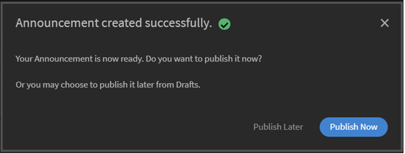
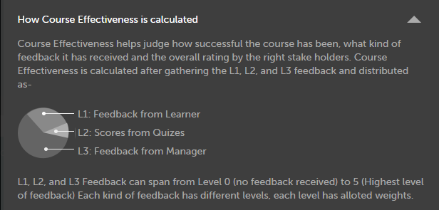

# Erstellen von Kursinstanzen und Lernpfaden

Dieses Dokument enthält Hilfethemen, um Kursmodule, Instanzen und Kurse für Administratorrollen zu erstellen.

Autoren erstellen Kurse. Teilnehmer können Kurse absolvieren und Administratoren können die Leistung der Teilnehmer basierend darauf, ob und wie die Kurse konsumiert werden, verfolgen.

## Übersicht {#overview}

Autoren erstellen Kurse. Teilnehmer können Kurse absolvieren und Administratoren können die Leistung der Teilnehmer basierend darauf, ob und wie die Kurse konsumiert werden, verfolgen. Administratoren können von Autoren erstellte Kurse anzeigen und die in diesem Abschnitt beschriebenen Aktivitäten ausführen. Als Administrator können Sie aus einem vordefinierten Satz von Kursen für die Teilnehmer spezielle Lernprogramme erstellen.

## Instanz eines Kurses erstellen {#createinstanceofacourse}

### Instanzen verwalten

>[!INFO]
>
>In dieser Schulung lernen Sie, wie Sie Instanzdetails und Instanzeigenschaften bearbeiten.    

Wenn Sie die Schulung nicht starten können, schreiben Sie an <almacademy@adobe.com>.

### Instanz erstellen

Nachdem ein Autor einen Kurs erstellt hat, können Sie Instanzen des Kurses erstellen. Indem Sie Instanzen eines Kurses erstellen, können Sie Ihren Teilnehmern denselben Kurs zu verschiedenen Zeiten anbieten. Teilnehmer können eine beliebige Instanz auswählen und sich registrieren. Sie können jede Instanz so konfigurieren, dass sie über einen eigenen Satz von Ausweisen, Rückmeldungen und anderen Einstellungen verfügt.

Instanz erstellen

1. Auf der Administrator-Webanwendung, klicken Sie auf **[!UICONTROL Kurse]** auf der linken Seite.
1. Wählen Sie in der Liste der Kurse den gewünschten Kurs aus und klicken Sie auf **[!UICONTROL Kurs anzeigen]**.

   

   *Kurs anzeigen*

1. Klicken Sie zum Erstellen von Instanzen im linken Bereich auf **[!UICONTROL Instanzen]**. Jeder Kurs hat standardmäßig eine Instanz. Sie können entweder die Standardinstanz ändern oder Instanzen hinzufügen. Sie können diese Kursinstanz nicht löschen.
1. Klicken Sie in der rechten oberen Ecke der Kursinformationen auf **[!UICONTROL Neue Instanz hinzufügen]**, um eine neue Instanz zu erstellen. Eine neue Instanz des Kurses wird angezeigt.
1. Geben Sie die Eigenschaften der Instanz ein:

   * Geben Sie im Feld **[!UICONTROL Instanzname]** den Namen der Instanz ein, die Sie dem Kurs zuordnen möchten. Stellen Sie sicher, dass Sie einen eindeutigen Namen für die Instanz verwenden.
   * Geben Sie den Fertigstellungstermin für die Instanz an. Die Teilnehmer müssen bis zu diesem Datum den Abschlussstatus erreichen.
   * Klicken Sie auf **[!UICONTROL Weitere Optionen anzeigen]**, um andere Fristoptionen anzuzeigen.
   * **[!UICONTROL Registrierungsfrist]:** Dies ist das Datum, bis zu dem ein Teilnehmer sich bei Selbstregistrierung für ein Lernobjekt anmelden soll.
   * **[!UICONTROL Abmeldefrist]:** Sie können die Abmeldefrist durch den Teilnehmer selbst einschränken, indem Sie eine Abmeldefrist haben.
   * **[!UICONTROL Zeitzone]:** Suche und wählen Sie dann die **[!UICONTROL Zeitzone]** aus der Dropdownliste aus.

   Ein Administrator kann sich entscheiden, die Abschlussfristen für einen Kurs oder ein Lernprogramm je nach Bedarf festzulegen. Es wird jedoch empfohlen, eine für Schulungen im Klassenzimmer/virtuellen Klassenzimmer vorzusehen.

   

   *Termin für Abschluss festlegen*

### Eigenschaften der Instanz anzeigen {#viewpropertiesoftheinstance}

*Eigenschaften der Instanz anzeigen*

1. **Module:** Die Anzahl der vom Autor des Kurses erstellten Module
1. **Registrierte Teilnehmer:** Die Anzahl der Teilnehmer, die vom Administrator für den Kurs eingeschrieben wurden.
1. **Sitzungen:** Die Anzahl der virtuellen Klassenräume und Klassenraummodule im Kurs.
1. **Feedback aktiviert:** Zeigt an, ob L1-, L2- und L3-Feedbacks für diesen Kurs aktiviert sind.

>[!NOTE]
>
>Der Administrator bricht die Sitzungen ab, indem er zu Instanzen > Sitzungen geht und Sitzung abbrechen auswählt.

### Instanz einstellen {#retireaninstance}

Führen Sie die folgenden Schritte aus, um eine Instanz einzustellen.

1. Wählen Sie in der Instanz das Dropdown-Menü aus und wählen Sie die Option **[!UICONTROL Instanz einstellen]**.

   

   *Instanz einstellen*

1. Um alle eingestellten Instanzen zu suchen, klicken Sie auf der Seite „Instanzen“ auf die Registerkarte **[!UICONTROL Eingestellt]**.

### Instanz wiederherstellen {#restoreaninstance}

Führen Sie die folgenden Schritte aus, um eine eingestellte Instanz in einen aktivierten Zustand zu versetzen:

1. Klicken Sie in der Instanz auf das Dropdown-Menü und wählen Sie die Option **[!UICONTROL Instanz erneut öffnen]**.

   

   *Instanz wiederherstellen*

1. Die Instanz wird nun in einen aktiven Modus wiederhergestellt.

### Instanz löschen

Administratoren können die Instanz mit der Option **Diese Instanz löschen** unmittelbar nach der Erstellung löschen. Sie können keine Instanzen löschen, wenn eine Sitzung damit verknüpft ist oder wenn sich Teilnehmer dafür registriert haben.

*Instanz löschen*

>[!NOTE]
>
>Sie können die Standardinstanz nicht löschen.

### E-Mails auf Instanzebene senden

So senden Sie E-Mails auf Instanzebene an registrierte Teilnehmende:

1. Wählen Sie auf der Seite **[!UICONTROL Instanzen]** die Optionen für eine beliebige Instanz aus und klicken Sie dann auf **[!UICONTROL Registrierte Teilnehmer per E-Mail senden]**.

*Registrierte E-Mail-Teilnehmer für die Instanz*

1. Wählen Sie im Dialogfeld **[!UICONTROL Ankündigung erstellen]** die Option &quot;Als E-Mail-Adresse eingeben&quot; aus. Geben Sie Betreff und Nachricht ein und klicken Sie auf **[!UICONTROL Speichern]**. Die Schulung wird automatisch ausgewählt.

   

   *Ankündigung als E-Mail erstellen*

1. Nachdem Sie auf **[!UICONTROL Speichern]** geklickt haben, wird eine Bestätigungsmeldung zur erfolgreichen Erstellung der Ankündigung angezeigt. Um die Ankündigung zu veröffentlichen, klicken Sie auf **[!UICONTROL Jetzt veröffentlichen]**.

   

## Registrieren Sie Teilnehmer für Kurse

In dieser Schulung erfahren Sie, wie Sie Teilnehmer registrieren, die Registrierung aufheben und sich erneut registrieren.

Wenn Sie die Schulung nicht starten können, schreiben Sie an <almacademy@adobe.com>.

### Teilnehmende in verschiedenen Instanzen registrieren

1. Wählen Sie einen Kurs aus der Liste der Kurse aus.
1. Wählen Sie **[!UICONTROL Teilnehmer]** im linken Bereich.
1. Wählen Sie **[!UICONTROL Registrieren]**.

   

   *Publish des Kurses*

1. Im Dialogfeld [!UICONTROL **Registrierung von Kursteilnehmern**] können Sie Folgendes tun:

   * Wählen Sie eine Instanz aus, um einen Teilnehmer aus der Dropdown-Liste Instanz auswählen zu registrieren.
   * Wählen Sie im Feld &quot;Teilnehmer einschließen&quot; den Benutzer oder die Benutzergruppe oder beide aus.
   * Wählen Sie im Feld &quot;Teilnehmer ausschließen&quot; die Teilnehmer aus, die von der Instanz ausgeschlossen werden sollen.
   * Wählen Sie unten im Dialogfeld Ja aus, wenn ein oder mehrere Teilnehmer für die ausgewählte Instanz registriert werden sollen.

1. **[!UICONTROL Fortfahren]** auswählen.

   

   *Weiter zur Registrierung von Teilnehmern*

### Registrierungsbericht einer Instanz anzeigen

1. Wählen Sie einen Kurs aus der Liste der Kurse aus.
1. Wählen Sie **[!UICONTROL Teilnehmer]** im linken Bereich.
1. Wählen Sie **[!UICONTROL Aktionen]** > **[!UICONTROL Exportieren]**.

Die Excel-Datei enthält Arbeitsblätter für jede Instanz. Ein Arbeitsblatt besteht aus folgenden Feldern:

* Teilnehmer
* E-Mail
* Eindeutige ID des Benutzers
* Kursname
* LO Eindeutige ID
* Status
* Auswahlkriterien
* Registrierungsdatum/Abmeldungsdatum (UTC-Zeitzone)
* Abschlussdatum (UTC-Zeitzone)
* Fälligkeitsdatum (UTC-Zeitzone)
* Startdatum (UTC-Zeitzone)
* Punktzahl für Quiz
* Managername
* Adresse
* Benutzerstatus
* Fachgebiet
* Anmerkungen
* Anzahl der Besuche
* Besuchdaten
* Zeitstempel (UTC-Zeitzone)
* Aufgewandte Zeit (Minuten)

>[!NOTE]
>
>Wenn Sie die Mehrfachregistrierung aktivieren, werden dem Teilnehmertranskriptbericht für jeden Kurs mehrere Zeilen hinzugefügt (eine Zeile für jede Instanz).
>
>Wenn Sie die Berichtsautomatisierung eingerichtet haben, die nur eine Zeile pro Kurs vorwegnimmt, müssen Sie die erforderlichen Anpassungen an der Berichtsautomatisierung vornehmen, bevor Sie die Funktion zur Mehrfacheinschreibung aktivieren.

### Verwalten der Teilnehmerliste für einen Kurs {#managelearnerslistforacourse}

1. Klicken Sie in der Kursminiaturansicht auf den Kursnamen.
1. Klicken Sie im linken Teilfenster auf **[!UICONTROL Teilnehmer]**.

*Teilnehmer in einem Kurs auswählen*

Sie können die folgenden Aktionen auf der Seite „Teilnehmer“ durchführen:

* Wählen Sie den Teilnehmer aus, den Sie entfernen möchten, und klicken Sie auf [!UICONTROL **Aktionen**] > [!UICONTROL **Entfernen**].
* Wählen Sie den Teilnehmer aus, dessen Anwesenheit Sie markieren möchten, und klicken Sie auf [!UICONTROL **Aktionen**] > [!UICONTROL **Als abgeschlossen markieren**].

Damit Teilnehmer ein Modul zurücksetzen und erneut nutzen können, klicken Sie auf [!UICONTROL **Zurücksetzen**]. Klicken Sie im angezeigten Dialogfeld auf „Ja“, um das Zurücksetzen zu bestätigen. Module, die abgeschlossen wurden, können nicht zurückgesetzt werden. Nur fehlgeschlagene oder unvollständige Module können zurückgesetzt werden.

Sie können die Teilnehmerliste auch in ein Excel-Arbeitsblatt exportieren. Um die Teilnehmerliste zu exportieren, klicken Sie auf [!UICONTROL **Aktionen**] > [!UICONTROL **Exportieren**].

>[!NOTE]
>
>Wenn es mehrere Instanzen eines Kurses gibt, wird die Excel-Teilnehmerliste jeweils auf getrennten Registerkarten angezeigt. Die Teilnehmerliste enthält Namen, Status und Auswahlkriterien der Teilnehmer. Der Teilnehmerstatus kann **Nicht gestartet** oder **In Bearbeitung** oder **Abgeschlossen** sein.

### Teilnehmer mit dem Status „Genehmigung ausstehend“ exportieren

Ein Administrator, Manager oder benutzerdefinierter Administrator kann Daten von Teilnehmern mit dem Registrierungsstatus „Genehmigung ausstehend“ exportieren. Sie können die Daten über die Registerkarte **Kurs > Teilnehmer** exportieren und auf die Dropdown-Liste „Aktion“ klicken.

Die Option ist vorhanden, wenn kein Teilnehmer für den vom Manager genehmigten Kurs registriert wurde bzw. die Genehmigung aussteht, und ein leerer Bericht wird generiert. Sie können auch exportieren, wenn Teilnehmer den Status &quot;Genehmigung ausstehend&quot;, &quot;Registriert&quot;, &quot;Ausstehend&quot; und &quot;Nicht registriert&quot; aufweisen.

Der Bericht enthält Daten von aktiven, gelöschten und gesperrten Benutzern, wenn die Genehmigung aussteht. Der Bericht enthält auch Daten von internen und externen Benutzern mit dem Status &quot;Genehmigung ausstehend&quot;.

Wenn ein Teilnehmer, der zuvor den Status „Genehmigung ausstehend“ aufwies, seine Registrierung löscht, wird sein Datensatz im Bericht nicht angezeigt. Wenn ein Teilnehmer, der zuvor den Status „Genehmigung ausstehend“ aufwies, von einem Administrator/Manager/benutzerdefinierten Administrator für den Kurs registriert wird, ist sein Datensatz im Bericht vorhanden.

## Warteliste

Im Abschnitt &quot;Warteliste&quot; können Teilnehmer auf die Warteliste für Klassenzimmerkurse gesetzt werden, wenn die Lizenzen begrenzt sind, basierend auf ihrer Reihenfolge der Registrierung. Administratoren können dies verwalten, indem sie Teilnehmer auf der Warteliste auswählen und Lizenzen zuweisen, die über das ursprüngliche Limit hinausgehen. Sobald der Administrator eine Lizenz zugewiesen hat, wird der Teilnehmer sofort für den Kurs registriert.

## Teilnehmeranwesenheit exportieren {#attendance}

Für jeden Klassenzimmer- und VC-Kurs können Sie die Liste der anwesenden Teilnehmer herunterladen.

Klicken Sie auf der Kurs-Detailseite auf **[!UICONTROL Anwesenheit und Punktzahl]** auf der rechten Seite.

Klicken Sie rechts oben auf der Seite auf die Dropdown-Liste **[!UICONTROL Aktionen]**. Klicken Sie dann auf die Option **[!UICONTROL Teilnehmerliste exportieren (PDF)]**.

*Teilnehmerliste als PDF exportieren*

In der PDF-Datei können Sie dieselbe Gruppe von Teilnehmern anzeigen wie ein Kursleiter.

Wenn Sie das PDF herunterladen, sehen Sie die Zeitzone (in UTC), die beim Erstellen des Kurses verwendet wurde.

## L1- und L3-Feedback hinzufügen {#addl1andl3feedback}

Während der Kurserstellung können Sie L1- und L3-Feedbackoptionen hinzufügen:

1. Melden Sie sich dafür zuerst als Administrator an und klicken Sie dann im linken Teilfenster auf „Kurse“. Auf der rechten Seite wird eine Liste aller Kurse angezeigt.
1. Klicken Sie auf die Kurskachel, für die Sie L1- oder L3-Feedback hinzufügen möchten.
1. Klicken Sie im linken Teilfenster auf „Standardwerte für Instanz“.
1. Um L1-Feedback oder L3-Feedback auszuwählen, klicken Sie auf der Umschaltfläche neben der betreffenden Option auf den Kreis.
1. Fügen Sie die L3-Feedbackfrage im Textbereich unter „L3-Frage“ hinzu.

### Obligatorisches L1-Feedback {#mandatory-l1-feedback}

Sie können alle Fragen oder die erste Frage in einem L1-Feedback als Pflichtfragen definieren.

*Alle Fragen oder die erste Frage in einem L1-Feedback als Pflichtfragen definieren*

Jetzt können Sie die Fragen erstellen, die jetzt Pflichtfragen werden.

*Fragen erstellen*

Wenn die beiden Pflichtfragen aus irgendeinem Grund keinen Text enthalten, werden die Fragen nicht im Feedbackformular angezeigt.

>[!NOTE]
>
>Es reicht nicht aus, dass Sie diese Einstellungen in der Lernprogramminstanz aktivieren. Sie müssen diese Einstellungen auch auf Kursinstanzebene für jeden Kurs im Lernprogramm aktivieren.

Wenn Sie auf der Seite &quot;Standardwerte für Instanz&quot; die Option **[!UICONTROL Alle Fragen sollen Pflichtfragen sein]** aktivieren, übernehmen alle danach erstellten neuen Instanzen diese Einstellungen.

*Seite mit den Instanzvorgaben anzeigen*

### L1-Feedback auf Kursebene {#l1-feedback-course-level}

In früheren Versionen von Learning Manager konnte ein Administrator L1-Feedback für das Lernprogramm aktivieren.

In dieser Version von Learning Manager kann der Administrator L1-Feedback für alle Kurse senden, die Teil des Lernprogramms sind. Der Administrator muss sicherstellen, dass L1-Feedback für alle Kurse auf Kursinstanzebene aktiviert ist.

1. Um L1-Feedback für jeden Kurs zu aktivieren, klicken Sie in der Admin-App auf **[!UICONTROL Lernprogramme]** > **[!UICONTROL Lernprogramm anzeigen]**.

1. Klicken Sie auf **[!UICONTROL Instanzen]** > **[!UICONTROL L1-Feedback aktiviert]**.

1. Aktivieren Sie die Option **[!UICONTROL Für jeden Kurs aktivieren]**.

   

   *Kursfeedback aktivieren*

   Nur wenn Sie diesen Umschalter auf Lernprogrammebene aktivieren, wird das L1-Feedback für die Kurse innerhalb dieses Programms nicht ausgelöst. Um das L1-Feedback zu aktivieren, gehen Sie zu jedem Kurs im Lernprogramm und aktivieren Sie die L1-Feedback-Umschaltfläche.

   

   *L1-Feedback für jeden Kurs aktivieren*

   Wenn L1-Feedback für alle Kurse aktiviert, aber in der Lernprogramminstanz deaktiviert ist, wird das L1-Feedback für die Kurse nicht ausgelöst.

### Sprachspezifische Quizberichte

Quizberichte helfen bei der Bewertung der Leistung eines Teilnehmers nach Abschluss eines Lernprogramms oder Kurses.

Learning Manager erleichtert derzeit das Lernen in 13 Benutzeroberflächensprachen und 32 Inhaltssprachen. Obwohl diese Option teilnehmerfreundlich ist und unsere Teilnehmer weltweit unterstützt, ist es für Administratoren nicht einfach, Berichte abzurufen, die in verschiedenen Sprachen generiert wurden.

Quizberichte zeigen Daten in verschiedenen Sprachen an, sofern der Kurs in mehreren Sprachen angeboten wird. Bisher wurden in vom Administrator generierten Berichten Antworten untereinander angezeigt, unabhängig von der Sprache, in der das Quiz absolviert wurde. **Beispiel:**: Wenn ein Benutzer ein Quiz auf Niederländisch absolviert hat, kann der Administrator nur die Quizberichte anzeigen, die von Benutzern auf Niederländisch generiert wurden. Der Administrator, der Englisch als Benutzeroberflächensprache ausgewählt hat, kann Berichte für alle Benutzer nicht gleichzeitig anzeigen, unabhängig davon, in welchem Gebietsschema diese generiert wurden.

Dies wurde nun behoben, da der Administrator jetzt alle Berichte in der jeweiligen Sprache anzeigen kann, die der Teilnehmer verwendet hat, und zwar unabhängig vom gewählten Inhaltsgebietsschema. Quizversuche in verschiedenen Sprachen werden als zusätzliche Spalten im Quizbericht hinzugefügt.

### L1-Feedback auf Kontoebene aktivieren {#l1-feedback-account-level}

*L1-Feedback auf Kontoebene aktivieren*

Ein Administrator kann L1-Feedback für neu erstellte Kurse und ein Lernprogramm aktivieren, indem er diese Einstellung auf Kontoebene aktiviert. Die Aktivierung dieser Einstellung wirkt sich jedoch nicht auf die vorhandenen Kurse und Lernprogramme aus

Wenn diese Option aktiviert ist, ist das Feedback für alle neuen Schulungen und Instanzen standardmäßig aktiviert. Wenn ein Autor/Administrator die Instanz besucht, stellt die Instanz den Standard her und deaktiviert diese Einstellung manuell, dann wird sie berücksichtigt.

Um L1-Feedback zu aktivieren, klicken Sie in der Admin-App auf **[!UICONTROL Einstellungen]** > **[!UICONTROL Feedback]**.

*Seite mit den Feedbackeinstellungen anzeigen*

Klicken Sie in der oberen rechten Ecke auf **[!UICONTROL Bearbeiten]** und aktivieren Sie die Option zum Aktivieren des L1-Feedbacks.

Wenn ein Autor einen Kurs erstellt, wird auf der Instanzseite der Admin-App das **[!UICONTROL L1-Feedback]** automatisch für den neuen Kurs aktiviert.

<!---->

Sie können das L1-Feedback auch deaktivieren, indem Sie die Option **[!UICONTROL Aktivieren]** umschalten, wie unten gezeigt:

*L1-Feedback aktivieren oder deaktivieren*

### Fügen Sie beschreibende Fragen für L1- und L3-Feedback hinzu {#descriptive}

Als Teil der November-Version von Learning Manager wurde eine Option zum Hinzufügen beschreibender Fragen bereitgestellt. Administratoren haben die Möglichkeit, diese Fragen Teilnehmer hinzuzufügen. Dies ergänzt den Standardsatz der Fragen von Learning Manager. Sie können sie bei Bedarf auch obligatorisch machen, indem Sie die Option unter der Frage auswählen.

Sie können zwei beschreibende Fragen für L1-Feedback und eine beschreibende Frage für L3-Feedback hinzufügen.

Nachdem Sie L1-Feedback aktivieren, können Sie die Optionen, wie in der folgenden Darstellung gezeigt, anzeigen.

*Beschreibende Fragen für L1- und L3-Feedback hinzufügen*

Wenn der Fragebogen für den Teilnehmer direkt nach Kursabschluss angezeigt werden soll, können Sie die Option entsprechend wählen.

Eine Beispielausgabe des L1-Fragebogens wird als Referenz zur Verfügung gestellt. Teilnehmer können den Fragebogen im folgenden Format ansehen. Test-1 und Test-2 sind die beschreibenden Fragen.

*Beispielfragen zu Kursfeedback*

Sobald Sie das L3-Feedback aktiviert haben, können Sie die Optionen wie in der folgenden Momentaufnahme gezeigt anzeigen:

*L3-Feedback aktivieren*

Frage 2 ist die beschreibende Frage für L3-Feedback. Sie können es obligatorisch machen, indem Sie entsprechend auf die Option unter der Frage klicken.

Eine Beispielausgabe des L3-Fragebogens wird als Referenz zur Verfügung gestellt. Teilnehmer können den Fragebogen im folgenden Format ansehen.

*L3-Feedbackausgabe anzeigen*

### L1- und L3-Feedbackfragebogen einrichten {#setupl1andl3feedbackquestionnaire}

Auf Kontoebene können Sie L1- und L3-Feedbackfragebogen einrichten und Erinnerungen festlegen.

1. Klicken Sie im linken Teilfenster auf **[!UICONTROL Einstellungen]** und anschließend auf **[!UICONTROL Feedback]**, nachdem Sie sich als Administrator angemeldet haben.\
   Die Seite mit den Feedbackeinstellungen wird mit zwei Registerkarten angezeigt: **[!UICONTROL L1 Feedback]** und **[!UICONTROL L3 Feedback]**.\
   Die Registerkarte **[!UICONTROL L1-Feedback]** enthält eine Liste mit standardmäßigen **[!UICONTROL L1-Feedback]**-Fragebogen für Präsenzkurse und Kurse zum Selbststudium sowie Erinnerungseinstellungen. Auf der Registerkarte **[!UICONTROL L3-Feedback]** können Sie die Standardanweisung und Erinnerungseinstellungen für L3-Feedback anzeigen.

1. Klicken Sie in der rechten oberen Ecke der Seite auf „Bearbeiten“, um den vorhandenen Fragebogen zu ändern.\
   Auf der Registerkarte **[!UICONTROL L1-Feedback]** können Sie jede Frage aktivieren/deaktivieren, indem Sie auf die Schaltfläche Ja/Nein klicken.\
   Auf der Registerkarte **[!UICONTROL L3-Feedback]** können Sie die Standard-Feedbackanweisung ändern.\
   Klicken Sie unten auf der Seite auf **[!UICONTROL Neue Erinnerung hinzufügen]** und wählen Sie aus, wann die Erinnerungen gesendet werden sollen.

1. Klicken Sie in der rechten oberen Ecke der Seite auf **[!UICONTROL Speichern]**.

Beim L1-Feedback sehen Sie zwei Fragebogen-Sets sowie eine Standardfrage. Das erste Fragebogen-Set bezieht sich auf Kurse zum Selbststudium, kann aber auch für aktivitätsorientierte Kurse verwendet werden. Das zweite Fragebogen-Set ist für Präsenzkurse und für Kurse im virtuellen Klassenzimmer vorgesehen.

## L1- und L3-Feedback anzeigen {#viewl1andl3feedback}

Sie können das L1-Feedback der Teilnehmer zu einem Kurs und das L3-Feedback der Manager an die Teilnehmer anzeigen.

1. Klicken Sie auf eine beliebige Kurskachel der Kursliste.
1. Klicken Sie im linken Teilfenster auf L1-Feedback oder L3-Feedback, um das erhaltene Feedback anzuzeigen.
1. Wählen Sie in der Dropdownliste die Instanz aus, für die Sie Feedback anzeigen möchten.

## Diskussions-Dashboard

Mit der Diskussions-Dashboard-Funktion können Teilnehmer die Kursdiskussionen anzeigen. Als Administrator haben Sie die Möglichkeit, Kommentare nach Bedarf zu löschen. Administratoren können diese Option in den Kurseinstellungen aktivieren.

## Kursmoderation {#coursemoderation}

Jedes Mal, wenn ein Autor Module hinzufügt, aktualisiert oder löscht und einen Kurs neu veröffentlicht, erhalten alle Administratoren Benachrichtigungen darüber. Als Administrator können Sie anschließend die Änderungen anzeigen, alte und neue Inhalte mithilfe des Links vergleichen sowie die Änderungen entweder genehmigen oder ablehnen.

Um die Kursmoderation zu aktivieren, klicken Sie auf **[!UICONTROL Einstellungen]** > **[!UICONTROL Allgemein]**. Aktivieren Sie das Kontrollkästchen **[!UICONTROL Kursmoderation]**.

*Kursmoderation aktivieren*

Klicken Sie auf die Benachrichtigung, um die Änderungen anzuzeigen, die der Autor an einem Kurs vorgenommen hat. Genehmigen Sie die Änderungen, die vom Autor gemacht wurden oder lehnen Sie diese ab. Wenn Sie die Änderungen genehmigen, wird der Kurs erneut veröffentlicht. Wenn Sie die Updates ablehnen, wird die vorherige Version des Kurses weiterhin vorhanden sein. In beiden Fällen wird eine Benachrichtigung an den Autor gesendet.

*Autorenanforderungen für Kursupdates*

Wenn es mehrere Autoren gibt, die denselben Kurs aktualisieren, wird die letzte oder zuletzt ausgeführte Änderung in der Benachrichtigung des Administrators angezeigt. Sie können dann die zuletzt vorgenommenen Änderungen genehmigen oder ablehnen.

## Checklistendaten exportieren {#export-checklist-data}

Öffnen Sie in der Liste der Kurse einen Kurs, der eine Checkliste enthält. Im linken Bereich wird eine Option **[!UICONTROL Checkliste]** angezeigt.

*Checklistendaten exportieren*

Klicken Sie auf die Option und führen Sie auf der Kursseite die folgenden Schritte aus:

1. Wählen Sie die Instanz und das Modul aus.
1. Klicken Sie auf **[!UICONTROL Aktionen]** > **[!UICONTROL Exportieren]** und exportieren Sie dann den Bericht der Teilnehmercheckliste.

Auf der Seite **[!UICONTROL Checkliste]** kann ein Kursleiter den Checklistenbericht aus der Dropdownliste **[!UICONTROL Aktionen]** exportieren.

Der CSV-Bericht enthält die folgenden Felder:

* Benutzername
* E-Mail-Adresse des Benutzers
* Name und E-Mail-Adresse des Managers
* Schulungsname
* Schulungsinstanz
* Name und E-Mail-Adresse des Kursleiters
* Eingereicht am
* Auswertungsstatus
* Fragen mit tatsächlichem Text
* Benutzerstatus
* Profil
* Aktive(s) Feld(er)

Wenn Sie einen Bericht herunterladen, nachdem Sie einen Statusfilter ausgewählt haben, enthält der heruntergeladene Teilnehmertranskriptbericht die Teilnehmerdaten basierend auf dem angewendeten Statusfilter. Dieser hinzugefügte Filter wird auch dem benutzerdefinierten Administrator und Manager angezeigt, wenn sie ein Teilnehmertranskript erstellen.

## Anzeigen von Kursen {#viewingcourses}

Als Administrator können Sie eine Liste aller verfügbaren Kurse anzeigen.   Klicken Sie im linken Teilfenster auf **[!UICONTROL Kurse]**, um die Liste der Kurse mit Such- und Filteroptionen anzuzeigen. In den Kursminiaturansichten können Sie darüber hinaus die Effektivität der einzelnen Kurse als Prozentwert anzeigen.

>[!NOTE]
>
>Sie können Kurse sowohl einstellen (zurückziehen), nachdem sie von Teilnehmern absolviert wurden, als auch zu jedem anderen Zeitpunkt nach der Veröffentlichung. Kurse können erst nach der Veröffentlichung eingestellt werden. Durch Klicken auf die Registerkarte **[!UICONTROL Eingestellt]** können Sie eine Liste aller eingestellten Kurse anzeigen.

## Punktzahl für Quiz anzeigen {#viewquizscores}

1. Klicken Sie in der Kursminiaturansicht auf den Kursnamen.
1. Klicken Sie im linken Fensterbereich auf „Punktzahl für Quiz“.

Sie können die Quiz-Punktzahlen eines bestimmten Kurses nach Benutzernamen oder Frage anzeigen. Wählen Sie dafür die Registerkarten „Nach Benutzer“ oder „Nach Frage“.

Wählen Sie den Instanzentyp aus der Dropdownliste, um die Ergebnisse nach den Instanzen des Kurses anzuzeigen.

## Standardinstanz

Administratoren können auf der Seite **[!UICONTROL Standardinstanz]** Standardabzeichen, Gamification-Einstellungen und Erinnerungen festlegen. Um die Standardinstanzeinstellungen zu ändern, wählen Sie **[!UICONTROL Standardinstanz]** > **[!UICONTROL Bearbeiten]**.

* **[!UICONTROL Abzeichen]**: Wählen Sie die Standard-Abzeichen aus dem Dropdown-Menü aus.
* **[!UICONTROL Gamification]**: Konfigurieren Sie Gamification-Einstellungen, einschließlich Punkten für Abschluss, vorzeitigen Abschluss und rechtzeitigen Abschluss. Administratoren haben die Möglichkeit, Einstellungen auf Kontoebene auszuwählen oder die Gamification-Punkte für diese Instanz anzupassen.
* **[!UICONTROL L1-Reaktionsfeedback]**: Aktivieren Sie vordefinierte Fragen für Teilnehmer-Feedback nach Kursabschluss, mit Optionen zum Pflichtfragen.
***[!UICONTROL L3-Feedback zu Verhaltensänderungen]**: Aktivieren Sie Feedback-Fragen für den Manager des Teilnehmers nach Kursabschluss.
***[!UICONTROL Erinnerungseinstellungen]**: Legen Sie Erinnerungen für Fristen fest und verwalten Sie sie, mit Optionen für eine Eskalation.

### Eskalationsstufe festlegen {#escalation}

Zum Senden der E-Mail-Benachrichtigungen muss ein Administrator explizit die Eskalationsstufe auswählen:

* Manager
* Allgemeiner Manager und Manager zum Überspringen einer Stufe

*Eskalationsstufe festlegen*

## Kursvorschau {#previewcourses}

Der Administrator kann eine Vorschau der Kurse anzeigen, indem er beim Anzeigen der Kursmodule auf die Option **[!UICONTROL Vorschau als Teilnehmer]** klickt.

1. Klicken Sie im linken Teilfenster auf **[!UICONTROL Kurse]**, nachdem Sie sich als Administrator angemeldet haben.
1. Klicken Sie auf der Seite auf eine beliebige Kachel der Kursliste.
1. Klicken Sie im linken Teilfenster auf „Vorschau als Teilnehmer“ und klicken Sie auf der Seite auf den Modulnamen, um im Player eine Vorschau des Kursmoduls anzuzeigen.

## Kurseffektivität {#courseeffectiveness}

Die Kurseffektivität wird ausgewertet, um festzustellen, wie nützlich die Kurse für die Teilnehmer sind. Dies ist eine Kombination der Ergebnisse des Teilnehmer-Feedbacks zu den Kursinhalten, der Ergebnisse des Kursquiz für einen Teilnehmer und des vom Manager gegebenen Feedbacks, mit dem die Lernfortschritte des Teilnehmers im Kurs bewertet werden.

Administratoren können die Bewertung der Kurseffektivität in den Kursminiaturansichten anzeigen, siehe die nachfolgende Abbildung. Dieser Kurs hat eine Bewertung von „100“.

<!---->

Der Wert der Kurseffektivität wird auf Basis der Werte der L1-, L2- und L3-Feedbacks berechnet. Um die Aufschlüsselung für jedes Feedback zu sehen, klicken Sie auf den Kurseffektivitätswert. Es wird ein Popupfenster angezeigt (siehe unten).

*Kurseffektivität für L1-, L2- und L3-Feedback anzeigen*

Im Beispiel dieser Abbildung hat 1 von 1 Benutzer alle drei Feedbacks erhalten, daher lautet das Ergebnis 100/100. Die folgende Tabelle zeigt, inwiefern sich das Fehlen eines der drei Feedbacks (L1, L2 und L3) negativ auf die Gesamteffektivität auswirkt. Klicken Sie in der rechten unteren Ecke des Popupmenüs auf den Abwärtspfeil, um anzuzeigen, wie die Kurseffektivität berechnet wird.

*Berechnung der Kurseffektivität*

Wie aus dem obigen Kreisdiagramm hervorgeht, wird das L3-Feedback des Managers am höchsten gewichtet.

## Kurse und Lernprogramme suchen {#searchingcoursesandlearningprograms}

Mit Adobe Learning Manager fällt es Ihnen leichter, schnell Kurse/Lernprogramme Ihrer Wahl zu finden. Für die Suche nach Kursen haben Sie zwei Möglichkeiten:

1. Über das Suchfeld. Klicken Sie auf das Suchsymbol in der rechten oberen Ecke. Ein Suchfeld erscheint. Geben Sie den Kursnamen oder beliebige zu Ihren Kursen passende Schlüsselwörter ein, um nach Ihren Kursen/Lernprogrammen zu suchen. Sie können auch mit vordefinierten Tags wie Captivate, C, Java und HTML suchen. Nach Tags können Sie im Suchfeld suchen, was bedeutet, dass die Tags im Suchfeld angezeigt werden, während Sie tippen.
1. Indem Sie die Liste der Kurse bzw. Lernprogramme mit den angebotenen Filtern filtern. Sie können die Kurse nach Status filtern, z. B. „Alle“, „Veröffentlicht“, „Entwurf“ und „Eingestellt“. Im Administratormodus wird der Filter „Entwurf“ nicht angezeigt.

Sie können basierend auf Kompetenzen suchen, indem Sie die Kompetenzen anklicken und auswählen. Als Administrator können Sie die Kurse auf vier Arten sortieren, um den gewünschten Kurs besser zu finden. Klicken Sie auf Sortieren nach und wählen Sie alphabetisch aufsteigende Reihenfolge, alphabetisch absteigende Reihenfolge, Datum der Kursaktualisierung oder Kurseffektivität.

<!---->

Sie können Lernprogramme auf drei Arten sortieren: in alphabetisch aufsteigender Reihenfolge, in alphabetisch absteigender Reihenfolge und nach dem Datum der Kursaktualisierung.

## Teilnehmer registrieren {#enrollinglearners}

Sie können die gleichen Schritte befolgen, um Teilnehmer in Kursen, Lernprogrammen und Zertifizierungen einzuschreiben. Manager können ihnen unterstellte Teilnehmer auch wie folgt registrieren.

Gemäß den Vorgaben des Unternehmens registriert der Administrator einige Teilnehmer für obligatorische Kurse:

1. Bewegen Sie die Maus über alle veröffentlichten Kurskacheln und klicken Sie auf &quot;Teilnehmer registrieren&quot;.\
   Alternativ können Sie auf die Kachel eines veröffentlichten Kurses klicken und auf Teilnehmer im linken Teilfenster klicken. Es wird eine Seite mit einer Teilnehmerliste angezeigt. Klicken Sie auf „Registrieren“.\
   Das Dialogfeld &quot;Teilnehmer registrieren&quot; wird angezeigt.

1. Wählen Sie die Instanz aus der Dropdown-Liste „Instanz wählen“. In der Dropdown-Liste werden alle Instanzen aufgeführt, einschließlich aktiver, eingestellter und abgelaufener Instanzen.

>[!NOTE]
>
>Der Administrator kann die für einen Kurs registrierten Teilnehmer entfernen, indem er auf der Teilnehmerseite auf den Dropdownpfeil klickt und auf **[!UICONTROL Aktionen]** > **[!UICONTROL Entfernen]** klickt.

*Kommentare hinzufügen, während Teilnehmer registriert werden*

*Teilnehmer registrieren*

## Benutzer

+++Teilnehmer einbeziehen

Wählen Sie die Benutzergruppen und die einzelnen Teilnehmer aus (über ihre E-Mail-ID oder ihren Namen), die Sie einbeziehen möchten. Fügen Sie alle Benutzergruppen an einem Schnittpunkt unter derselben Gruppe hinzu. Um eine weitere Benutzergruppe zur Union hinzuzufügen, verwenden Sie ein neues Einbeziehungsset.

+++

+++Teilnehmer ausschließen

Wählen Sie die Benutzergruppen und die einzelnen Teilnehmer aus (über ihre E-Mail-ID oder ihren Namen), die Sie ausschließen möchten. Fügen Sie alle Benutzergruppen an einem Schnittpunkt unter derselben Gruppe hinzu. Um eine weitere Benutzergruppe in der Verknüpfung hinzuzufügen, verwenden Sie ein neues Einbeziehungsset.

+++

## Benutzer-E-Mail-ID

+++Email ID

Kopieren Sie die E-Mail-IDs der zu registrierenden Teilnehmer und fügen Sie sie durch Semikolon, Kommas oder Zeilenabstand getrennt ein. Verwenden Sie die Option **[!UICONTROL Eindeutige IDs für validieren]**, um die Einträge zu validieren. Alle ungültigen Einträge werden rot markiert. Entfernen oder korrigieren Sie diese Einträge und setzen Sie den Vorgang fort, indem Sie auf **[!UICONTROL Weiter]** klicken.

*Teilnehmer registrieren*

Das Dialogfeld mit der Zusammenfassung wird angezeigt. Es zeigt die Anzahl der Benutzer im Einbeziehungsset, im Ausschlussset sowie die Anzahl der bereits für die Kursinstanz registrierten Benutzer an.

+++

### Fügen Sie Kommentare hinzu, während Sie Teilnehmer registrieren {#enroll-comments}

<!----->

Als Administrator oder Manager können Sie Kommentare hinzufügen, während Sie Teilnehmer für einen Kurs registrieren. Sie können zusätzliche Informationen über die Kohorte der angemeldeten Benutzer angeben. Diese Daten werden in Kursberichten exportiert.

Der Kommentar ist **nicht**, der dem Teilnehmer angezeigt wird.

Wenn ein Administrator den Kursbericht des Teilnehmers erstellt, wird ein eventuell hinzugefügter Kommentar im Bericht angezeigt. Das Dialogfeld mit der Zusammenfassung wird angezeigt. Es zeigt die Anzahl der Benutzer im Einbeziehungsset, im Ausschlussset sowie die Anzahl der bereits für die Kursinstanz registrierten Benutzer an.

Erweitern Sie im Dialogfeld **[!UICONTROL Teilnehmer registrieren]** die Option **[!UICONTROL Erweiterte Optionen]**. Geben Sie im Feld **[!UICONTROL Zusätzlicher Kommentar]** den erforderlichen Kommentar ein.

*Kommentare für Teilnehmer hinzufügen*

## Registrierte Benutzer suchen {#searchforusers}

Suchen Sie im Lernbereich des Lernobjekts nach angemeldeten Benutzern, indem Sie die Type-Ahead-Suche verwenden. Mit der Type-Ahead-Suche können Sie schrittweise nach registrierten Benutzern suchen, indem Sie Name, E-Mail-ID und UUID verwenden.

*exemplarische Vorgehensweise für die Suche nach registrierten Benutzern*

Diese Art der Suche wird manchmal auch als automatische Vervollständigung, inkrementelle Suche, Suche nach Eingabe, Inline-Suche oder Sofortsuche bezeichnet.

Wenn Sie im Suchfeld nach einem Teilnehmer oder einer Benutzergruppe suchen, wird eine oder mehrere Übereinstimmungen für die Suchbegriffe gefunden und Ihnen sofort angezeigt.

Der Vorgang ermöglicht es Ihnen, das Gesuchte viel schneller und weniger umständlich zu finden, als mehrere Suchvorgänge hintereinander auszuführen.

Teilnehmer oder Benutzergruppen werden nach einer Suche in allen Instanzen angezeigt. Für jeden Teilnehmer wird die Instanz, in der der Teilnehmer registriert ist, in der Spalte **[!UICONTROL Instanz]** angezeigt.

*Suchergebnisse anzeigen*

Mit type-ahead können Sie:

* alle Benutzer anzeigen, unabhängig von den registrierten Instanzen.
* alle Benutzergruppen anzeigen, für die mindestens ein Benutzer registriert ist.

Nachdem eine Suche ausgeführt wurde, können Sie die Teilnehmer nicht mehr nach Instanzen filtern. Die Option eine Instanz aus der Dropdown-Liste **[!UICONTROL Instanz auswählen]** auszuwählen ist deaktiviert.

Darüber hinaus können Sie mithilfe der Suchergebnisse einen Teilnehmer oder eine Benutzergruppe auswählen und die folgenden Aktionen ausführen:

* Registrierung aufheben
* Als abgeschlossen markieren
* Modul zurücksetzen

Während der Durchführung einer Suche ist die Option &quot;Registrierung aufheben > Masse&quot; in der Dropdown-Liste Aktionen für den Kurs/das Lernprogramm deaktiviert.

## Teilen Sie den QR-Code mit den Teilnehmern, die sich anmelden möchten, oder beides {#shareqrcodewithlearnerstoenrollcompleteorboth}

Administratoren in Adobe Learning Manager können die QR-Codes für Teilnehmer freigeben, um sich schnell für den Kurs zu registrieren. Die drei verschiedenen QR-Codes werden verwendet, um die &quot;Registrierung&quot;, &quot;Abschluss&quot; oder &quot;Registrierung und Abschluss&quot; eines Kurses zu markieren.

Teilnehmende können den jeweiligen QR-Code einfach mit der Geräte-App von Adobe Learning Manager scannen.

**So laden Sie den QR-Code herunter**:

1. Klicken Sie im linken Navigationsbereich auf **[!UICONTROL Kurse]** aus dem Abschnitt &quot;Lernen&quot;.
1. Wählen Sie einen Kurs aus > **[!UICONTROL Kurs anzeigen]**.
1. Klicken Sie auf **[!UICONTROL Instanzen]** > **[!UICONTROL Mehr]** > **[!UICONTROL QR-Code]**.

   <!---->

1. Aktivieren Sie den QR-Code, und klicken Sie auf die Download-Symbole „Registrieren“, „Abschließen“ und „Registrieren und Abschließen“, um eine PDF-Datei mit dem jeweiligen QR-Code herunterzuladen. Der Administrator kann dann den QR-Code mit den Teilnehmern teilen.

   

   *QR-Code für andere freigeben*

## Lebenszyklus von Kursen {#courselifecycle}

Ein typischer Lebenszyklus von Kursen sieht wie folgt aus:

**Entwurf** - Wenn ein Autor einen Kurs fertig erstellt und gespeichert hat. In diesem Status ist der Kurs für Teilnehmer noch nicht verfügbar. Sie können einen Kurs in diesem Status löschen.

**Veröffentlicht** - Wenn ein Autor einen Kurs veröffentlicht hat. In diesem Status ist der Kurs für Teilnehmer verfügbar. Sie können sich für einen solchen Kurs registrieren.

**Eingestellt** - Nach der Veröffentlichung kann ein Autor den Kurs wieder einstellen, wenn er ihn aus dem Kurskatalog für die Teilnehmer entfernen möchte. Sie können einen Kurs in diesem Status erneut veröffentlichen oder löschen.

**Gelöscht** - Ein Kurs hat den Status &quot;Gelöscht&quot;, wenn er vollständig aus der Adobe Learning Manager-Anwendung entfernt wurde. Kurse können von Autoren nur gelöscht werden, wenn sie den Status „Entwurf“ haben. Sie können auch Kurse im Status &quot;Eingestellt&quot; löschen.

*Arbeitsablauf eines Kurslebenszyklus*

## Benachrichtigungseinstellungen {#notificationsettings}

Als Administrator können Sie die Benachrichtigungseinstellungen anpassen. Weitere Informationen finden Sie unter [Benachrichtigungen.](user-notifications.md)

## Häufig gestellte Fragen {#frequentlyaskedquestions}

+++Wie kann ich das Modul als Administrator zurücksetzen?

Wählen Sie auf der Teilnehmerseite für einen Kurs den Teilnehmer oder die Teilnehmer oder eine Gruppe aus und klicken Sie auf **[!UICONTROL Aktionen]** > **[!UICONTROL Module zurücksetzen]**.

*Option zum Zurücksetzen von Modulen anzeigen*

Nachdem Sie auf die Option geklickt haben, wird der Status der Module aller ausgewählten Teilnehmer zurückgesetzt. Die abgeschlossenen Module werden nicht zurückgesetzt.

+++

+++Wie kann ich eine Kurs-URL hinzufügen, damit Teilnehmer direkt zum Kurs umgeleitet werden?

Bewegen Sie den Mauszeiger auf eine Kurskarte und klicken Sie auf **[!UICONTROL URL kopieren]**. Nachdem Sie die URL kopiert haben, können Teilnehmer direkt über die URL auf den Kurs zugreifen.

+++

+++Instanz erneut öffnen

Um eine inaktive Instanz erneut zu öffnen, klicken Sie auf das Dropdown-Menü in der Instanz und dann auf **[!UICONTROL Instanz erneut öffnen]**.

+++
