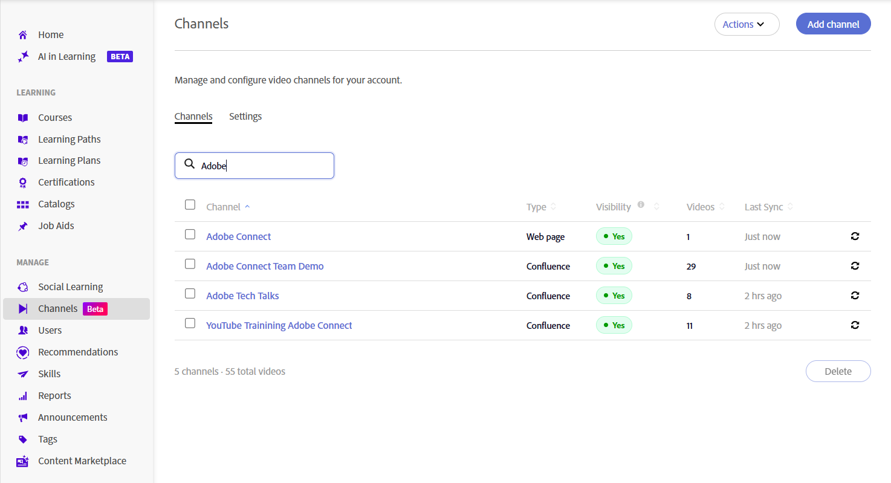

# Kanäle erstellen

Unternehmen speichern Wissensvermittlungssitzungen, Schulungsaufzeichnungen und andere Videoinhalte oft in informellen Lerninhalten, die im Web und auf Confluence Cloud-Seiten kuratiert werden. Durch Kanäle wird Adobe Learning Manager mit diesen Inhaltsquellen verbunden, was die Erkennung und Nutzung von Videos vereinfacht, ohne dass die Teilnehmer in mehreren Systemen navigieren müssen. Mit Kanälen können Sie videobasierte Lerninhalte von Unternehmens-Webseiten und Confluence Cloud-Seiten an einem einzigen, durchsuchbaren Ort organisieren und freigeben. Anstatt mehrere interne Sites zu durchsuchen, können Teilnehmer relevante Aufzeichnungen direkt aus Adobe Learning Manager entdecken und darauf zugreifen. Weitere Informationen finden Sie unter [Kanäle entdecken und mit ihnen interagieren](../../learners/feature-summary/discover-and-engage-with-channels.md).

Als Administrator können Sie Kanäle erstellen und verwalten, Sichtbarkeitseinstellungen konfigurieren, Inhalte mit der Quelle synchronisieren und überprüfen, ob Videos verfügbar sind, bevor Sie den Kanal für Teilnehmer zugänglich machen. In diesem Artikel wird erläutert, wie diese Kanalverwaltungsaufgaben ausgeführt werden.

**Wichtigste Vorteile**

- Konsolidieren Sie videobasierte Lerninhalte aus mehreren internen Quellen an einem Ort.
- Kuratieren Sie Videoinhalte aus mehreren Intranet-Speicherorten in Webseiten, die dann in ALM als Kanäle angezeigt werden.
- Ermöglichen Sie es Teilnehmern, Inhalte zu finden, wiederzugeben und mit ihnen zu interagieren, ohne zu mehreren Websites navigieren zu müssen.
- Inhalte müssen mit der ursprünglichen Quelle synchronisiert sein.

## Kanäle aktivieren

Kanäle ist eine Funktion, die Administratoren für das Konto aktivieren. Nach der Aktivierung können Sie Kanäle erstellen, die eine Verbindung zu Unternehmenswebseiten und zu Cloud Confluence-Seiten mit Videoinhalten herstellen.

Der Kanal-Crawler extrahiert zuverlässig Videos aus Quellseiten, die ihren Inhalt in den folgenden Formaten präsentieren:

- Tabellen
- Aufzählungslisten
- Artikel

So aktivieren Sie die Funktion **Kanäle**:

1. Melden Sie sich bei Adobe Learning Manager als Administrator an.

1. Wählen Sie in der linken Navigation **Kanäle** aus.
     Die Seite **Kanäle** wird geöffnet.

1. Wählen Sie die Registerkarte **Einstellungen** aus.

   

   *Aktivieren Sie die Kanalfunktion auf der Registerkarte **Einstellungen**, damit Administratoren Kanäle für das Konto erstellen können.*

1. Aktivieren Sie das **Kanalfeature**.

     Die Kanäle sind für das Konto aktiviert.

## Kanal erstellen

Erstellen Sie einen Kanal, um die Inhaltsquelle zu definieren, die Adobe Learning Manager nach Videos durchsucht, und passen Sie das Erscheinungsbild des Kanals und der Videoseite an.

1. Navigieren Sie zur Registerkarte **Kanäle** und wählen Sie **Kanal hinzufügen** aus.
     Die Seite **Kanal erstellen** wird geöffnet.

   

   *Definieren Sie die Inhaltsquelle, und konfigurieren Sie Sichtbarkeit und Synchronisierungsoptionen beim Erstellen eines Kanals.*

1. Geben Sie im Abschnitt **Kanal** den **Kanalnamen** und die **Beschreibung** ein.

1. Wählen Sie im Dropdownmenü einen **Quelltyp** aus. Die folgenden Optionen sind verfügbar:

   1. **Webseite**: Wählen Sie diese Option, um eine Webseite zu durchsuchen und Videolinks zusammen mit den zugehörigen Metadaten zu importieren.

   1. **Confluence-Seite**: Wählen Sie diese Option, um Video-Links und Metadaten von einer Confluence Cloud-Seite abzurufen. Um eine Verbindung mit Confluence Cloud herzustellen, geben Sie die folgenden Details an:
      - **Atlassische E-Mail-Adresse**: Geben Sie die E-Mail-Adresse ein, die Ihrem Atlassian-Konto zugeordnet ist.
      - **Atlassian API-Token**: Geben Sie das API-Token ein, das von Ihrem Atlassian-Konto generiert wurde. Wählen Sie **Erstellen eines API-Tokens**, um Anweisungen zum Generieren eines Tokens zu erhalten. Dieses Token wird für die Authentifizierung beim Crawlen der Quelle verwendet und verschlüsselt gespeichert.

      

      *Geben Sie die Atlassian-E-Mail-Adresse und das API-Token ein, die für die Authentifizierung bei Confluence Cloud verwendet werden.*

1. Geben Sie die **Quell-URL** des ausgewählten Quelltypinhalts ein.

1. Konfigurieren Sie im Abschnitt **Status** die folgenden Optionen:

   1. **Sichtbar für Teilnehmer**: Aktivieren Sie diese Option, um den Kanal Teilnehmern zur Verfügung zu stellen. Deaktivieren Sie diese Option, um den Kanal auszublenden, während Sie mit der Konfiguration oder dem Testen fortfahren.

   1. **Automatisch synchronisieren**: Aktivieren Sie diese Option, um den Kanal automatisch zu aktualisieren, wenn der Quelle neue Videos hinzugefügt werden. Deaktivieren Sie sie, wenn Sie den Kanal manuell synchronisieren möchten.

1. (Optional) Wählen Sie **Erweiterte Einstellungen anzeigen** aus, und konfigurieren Sie dann die folgenden Optionen nach Bedarf:

   1. **Farbe des Kanalthemas**: Wählen Sie eine Farbe aus, um das Erscheinungsbild des Kanals anzupassen.

   1. **Durchforstungstiefe**: Geben Sie die Durchforstungstiefe für verknüpfte Seiten ein, damit nach Videoinhalten gesucht werden kann. Es unterstützt eine maximale Durchforstungstiefe von **2**.

   1. **Durchforstungsfrequenz (in Stunden)**: Geben Sie an, wie oft Adobe Learning Manager die Quelle auf neue oder aktualisierte Inhalte überprüfen soll.

      

      *Wählen Sie Erweiterte Einstellungen anzeigen aus, um die Farbe des Kanalthemas, die Kriechtiefe und die Kriechfrequenz zu konfigurieren.*

1. Wählen Sie **Jetzt testen** aus, um die Quelle zu validieren. Die Beispielvideos werden aus der konfigurierten Quelle abgerufen und angezeigt.

   

   *Verwenden Sie **Jetzt testen**, um zu bestätigen, dass Videos von der Quelle abgerufen wurden, bevor Sie den Kanal erstellen.*

1. Wählen Sie **Kanal erstellen**. Der Kanal wird erstellt und der Liste **Kanäle** hinzugefügt.

## Nach einem Kanal suchen

Verwenden Sie das Suchfeld, um einen Kanal schnell anhand seines Namens zu finden.

1. Wählen Sie die Registerkarte **Kanäle** aus.
1. Wählen Sie das Feld **Suchkanäle** aus.
1. Geben Sie den Kanalnamen oder einen Teil davon in das Feld **Kanäle durchsuchen** ein.
     Die Liste wird so gefiltert, dass nur die Kanäle angezeigt werden, die Ihrer Suche entsprechen.

   

   *Geben Sie einen Kanalnamen in das Suchfeld ein, um die Liste **Kanäle**zu filtern.*

## Sichtbarkeit von Kanälen verwalten

Verwenden Sie das Menü **Aktionen**, um einen oder mehrere Kanäle gleichzeitig zu deaktivieren oder auszublenden.

### Kanäle deaktivieren

Deaktivieren Sie einen oder mehrere Kanäle, um zu verhindern, dass Teilnehmer auf ihre Inhalte zugreifen und gleichzeitig die Kanalkonfiguration beibehalten.

So deaktivieren Sie Kanäle:

1. Navigieren Sie zu **Channels**.
1. Aktivieren Sie das Kontrollkästchen neben einem oder mehreren Kanälen und wählen Sie dann **Aktionen** aus.

   
   *Wählen Sie im Menü &quot;Aktionen&quot; die Option &quot;Deaktivieren&quot; aus, um einen oder mehrere ausgewählte Kanäle zu deaktivieren.*
1. Wählen Sie **Deaktivieren**. . Das Popup-Fenster **Kanäle deaktivieren** wird angezeigt.
1. Wählen Sie **Deaktivieren**. . Die ausgewählten Kanäle sind deaktiviert.

### Kanäle für Teilnehmer ausblenden

Blenden Sie einen oder mehrere Kanäle aus, damit sie für Teilnehmer nicht verfügbar sind, ohne sie zu löschen.

So blenden Sie Kanäle für Teilnehmer aus:

1. Navigieren Sie zu **Channels**.
1. Aktivieren Sie das Kontrollkästchen neben einem oder mehreren Kanälen und wählen Sie dann **Aktionen** aus.
1. Wählen Sie **Für Teilnehmer ausblenden**.  Das Popupfenster **Für Teilnehmer ausblenden** wird angezeigt.

   
   *Kanäle für Teilnehmer ausblenden, ohne die Kanalkonfiguration zu löschen.*

1. Wählen Sie **Für Teilnehmer ausblenden**.
     Die ausgewählten Kanäle sind für die Teilnehmer ausgeblendet.

## Kanal bearbeiten

Sie können einen vorhandenen Kanal bearbeiten, um seine Konfiguration und Einstellungen zu aktualisieren.

Bearbeiten eines Kanals:

1. Wählen Sie den erforderlichen Kanal aus der Liste **Kanäle** aus.
     Die Seite **Kanal bearbeiten** wird geöffnet und zeigt die aktuelle Kanalkonfiguration an.

1. Aktualisieren Sie die Kanaleinstellungen nach Bedarf.

   

   *Aktualisieren Sie den Namen, die Beschreibung, die Quelle und die Einstellungen eines Kanals von der Seite **Kanal bearbeiten**.*

1. (Optional) Wählen Sie **Jetzt testen**.

1. Wählen Sie **Änderungen speichern**.
     Die aktualisierten Kanaleinstellungen werden gespeichert.

## Kanal löschen

Sie können einen oder mehrere Kanäle löschen, die nicht mehr benötigt werden.

1. Navigieren Sie zur Registerkarte **Kanäle**.

1. Aktivieren Sie das Kontrollkästchen neben jedem Kanal, den Sie löschen möchten.

1. Wählen Sie **Löschen** rechts unten in der Kanalliste aus. 2  Das Popupfenster **Kanäle löschen** wird angezeigt.

   

   *In einem Bestätigungsdialogfeld werden die von Ihnen ausgewählten Kanäle aufgelistet.*

1. Wählen Sie **Löschen** aus.
     Die ausgewählten Kanäle werden endgültig gelöscht. Diese Aktion kann nicht rückgängig gemacht werden.
