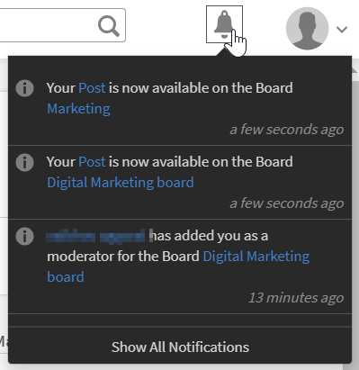

# Kenntnisse Kenntnisdomänen zuordnen

Um einen Beitrag, der von einem Benutzer der KI-fähigen Kurations-Engine für eine bestimmte Kenntnisdomäne gepostet wurde, automatisch zu kuratieren, müssen die benutzerdefinierten Kenntnisse des Benutzers den unterstützten Kenntnisdomänen im Learning Manager-LMS zugeordnet werden.

Während der Erstellung von Kenntnissen kann ein Administrator sie den relevanten von Learning Manager unterstützten Kenntnisdomänen zuordnen. Dies wird im automatischen Kurationsprozess weiter berücksichtigt. Learning Manager LMS listet die folgenden Kenntnisse auf:

* Verwaltung der Lieferkette
* Buchhaltung
* Wissenschaftliche Forschung und Technik
* Computersicherheit
* Strategisches Management
* Soziale Medien
* Medizin
* Finanzen
* Sicherheit am Arbeitsplatz
* Sozialkompetenz
* Wirtschaftsrecht
* Management
* Personalmanagement
* Technische Kommunikation
* Wirtschaftsethik
* Kundenbeziehungsmanagement
* Informationstechnologie
* Produktion und Fertigung
* Marketing
* Qualitätsmanagement
* Geschäftsprozess
* Lernprogramm
* Design
* Analysen
* Verkauf

Um eine Kenntnisdomäne hinzuzufügen, gehen Sie wie folgt vor:

1. Klicken Sie im linken Bereich der Administrator-App auf **[!UICONTROL Kenntnisse]**.
1. Um Kenntnisse hinzuzufügen, klicken Sie oben rechts auf der Seite auf **[!UICONTROL Hinzufügen]**.
1. Fügen Sie im Dialogfeld **[!UICONTROL Kenntnisse hinzufügen]** Kenntnisse und eine Beschreibung der Kenntnisse hinzu.
1. Fügen Sie im Abschnitt **[!UICONTROL Kenntnisdomäne]** die Kenntnisdomänen hinzu. Wenn Sie eine Domäne eingeben, werden die Domänen hinzugefügt. Diese Domänen werden aus der oben genannten Liste befüllt.

   

   *Fügen Sie die Kenntnisdomänen im Abschnitt Kenntnisdomäne hinzu*

1. Um die Änderungen zu speichern, klicken Sie auf **[!UICONTROL Speichern]**.

Wenn ein Benutzer einen Inhalt in einem Forum veröffentlicht, wird der Inhalt kuratiert und genehmigt oder abgelehnt, abhängig von der Vertrauensbewertung gegenüber der dem Forum zugeordneten Kenntnissen.

<!---->

Abhängig davon, ob der hochgeladene Inhalt eine Vertrauensbewertung von mehr als 50 % aufweist, wird der Inhalt in das Forum hochgeladen. Wenn Ihr Inhalt die Kriterien erfüllt, wird eine Benachrichtigung angezeigt, die besagt, dass der Inhalt erfolgreich kuratiert wurde und jetzt im Forum verfügbar ist.

*Benachrichtigungen in Abhängigkeit vom Confidence-Ergebnis anzeigen*

