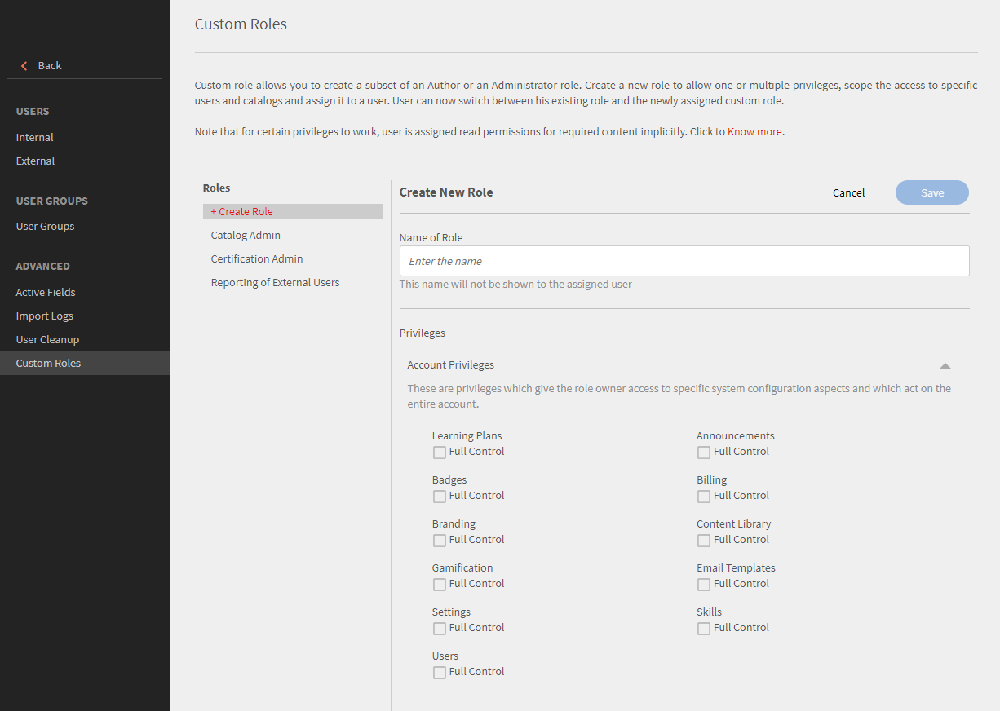
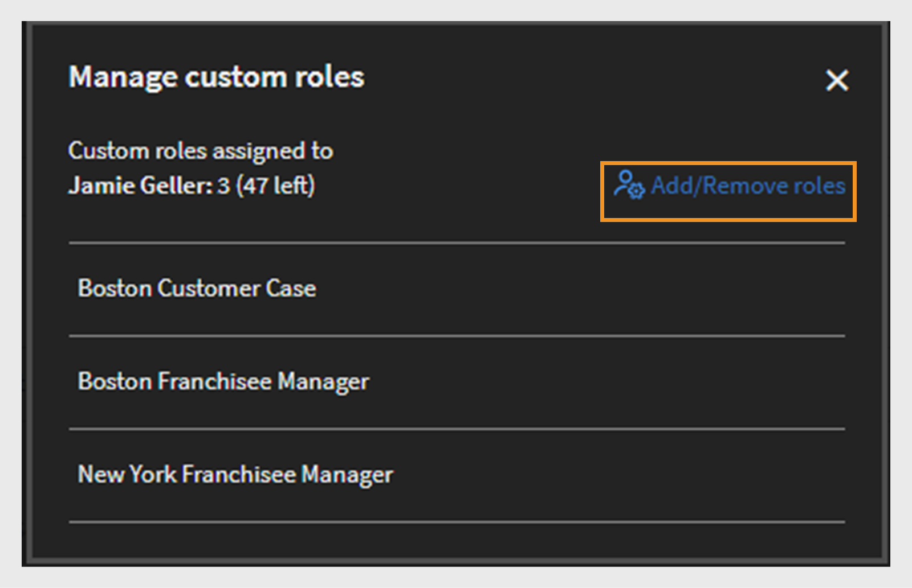
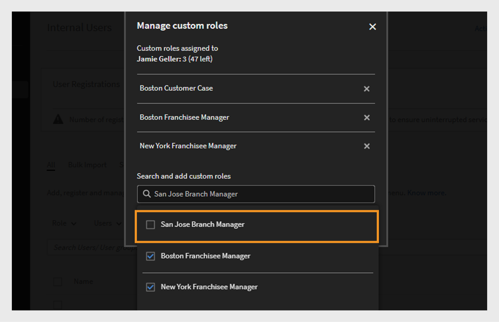
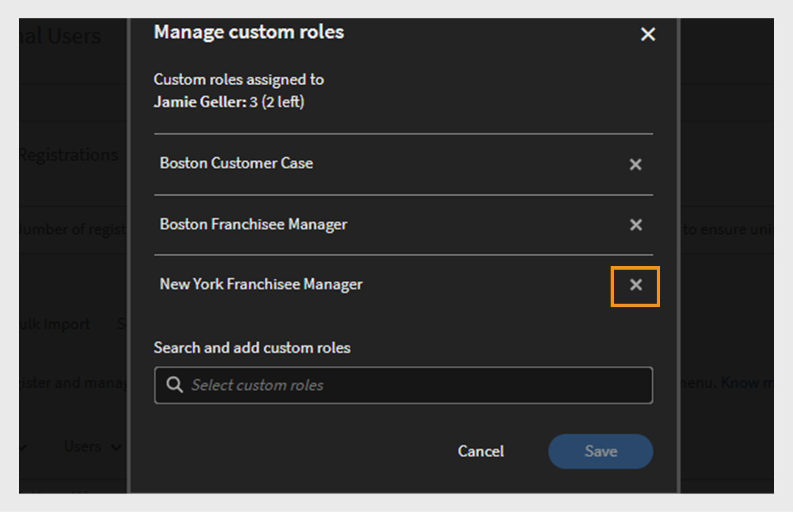
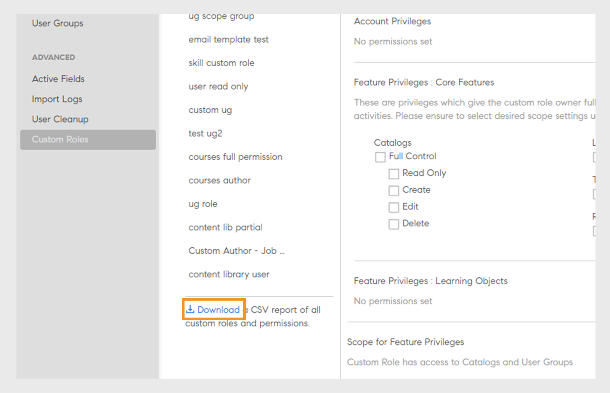
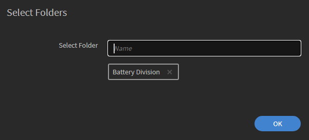
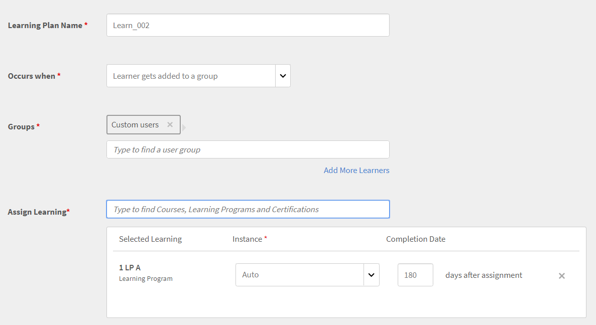

# Benutzerdefinierte Rollen

Mit dieser Funktion können Sie benutzerdefinierte Rollen definieren und bestimmten Benutzergruppen bestimmte Verantwortlichkeiten zuweisen. Mit dieser Funktion können Sie Verantwortlichkeiten zuweisen, die nicht in den Bereich der bestehenden Rolle der Person fallen.

Mit Adobe Learning Manager können vollständige Administratoren die Verantwortung für die Verwaltung benutzerdefinierter Rollen an vertrauenswürdige benutzerdefinierte Administratoren delegieren. Dazu gehört auch das Erstellen, Bearbeiten und Zuweisen benutzerdefinierter Rollen, ohne dass sie vollständige Administratoranmeldeinformationen erhalten. Mit dieser Funktion können benutzerdefinierte Administratoren andere Rollen verwalten, ohne Administratoren mit Aufgaben zu überlasten. Dies wird über die Berechtigungsebene **Advanced** im Abschnitt **Users** einer benutzerdefinierten Rollendefinition gesteuert. Weitere Informationen finden Sie unter [Was die erweiterte Benutzerberechtigung freigibt](#advanced-user).

Organisationen verwenden diese Funktion, um die routinemäßige Rollenverwaltung an bestimmte benutzerdefinierte Administratoren zu delegieren. Beispielsweise, um einem dedizierten Team zu ermöglichen, ständig Herausgeber- oder Autorenrollen zu erstellen und zuzuweisen, oder um einem Operations-Team zu ermöglichen, Konten von Benutzern zu bereinigen, die das Unternehmen verlassen haben. Dadurch entfällt die Notwendigkeit, diesen Teams uneingeschränkten Administratorzugriff zu gewähren, der umfassendere Berechtigungen als ihre Verantwortlichkeiten erfordert.

Sie können eine benutzerdefinierte Rolle erstellen, um Authoring-Funktionen für einen bestimmten Katalog bereitzustellen. Sie können auch eine dedizierte Rolle erstellen, um Berichterstellung zu verwalten. Solche Rollen können dann Personen zugeordnet werden, die diese spezifischen Aufgaben übernehmen sollen.

>[!NOTE]
>
>Das Hinzufügen einer neuen benutzerdefinierten Rolle hat keine Auswirkungen auf vorhandene benutzerdefinierte Benutzergruppen oder rollenbasierte Gruppen wie Alle Administratoren, Alle Autoren usw.

Administratoren haben die Möglichkeit, benutzerdefinierte Administrator- und Autorenrollen mit maßgeschneiderten Berechtigungen für jede Rolle zu erstellen. Im Folgenden finden Sie einen Überblick über die Berechtigungen, die jeder Rolle zugeordnet sind:

**Benutzerdefinierte Autorenrollenberechtigungen**

Benutzerdefinierte Autoren können die folgenden Aufgaben ausführen:

* Zugriff auf die Inhaltsbibliothek zum Hinzufügen, Bearbeiten oder Löschen von Kerninhalten.
* Erstellen, Bearbeiten und Löschen:
  * Kurse
  * Arbeitshilfen
  * Zertifizierungen
  * Lernpfade
  * Lernpläne

Administratoren und Autoren, einschließlich benutzerdefinierter Administratoren und benutzerdefinierter Autoren, haben die Möglichkeit, Lernobjekte (LOs) für extern freigegebene Kataloge freizugeben. Administratoren und Autoren sollten in der Lage sein, beim Erstellen von Lernobjekten nach extern freigegebenen Katalogen zu suchen.

**Benutzerdefinierte Administratorrollenberechtigungen**

Die benutzerdefinierte Administratorrolle repliziert eine Reihe von Administratoraufgaben, einschließlich des Zugriffs auf Berechtigungen auf Kontoebene. Benutzerdefinierte Administratoren erhalten Berechtigungen zum Verwalten wichtiger Funktionen im Zusammenhang mit Lernaktivitäten, z. B.:

* Lernpläne
* Kataloge
* Berichte
* Tags

Darüber hinaus können benutzerdefinierte Administratoren:

* Verwalten Sie Kurse und Arbeitshilfen, einschließlich der Registrierung und des Löschens von Benutzern.
* Zertifizierungen, Lernpfade und Lernpläne erstellen, bearbeiten und löschen.
* Greifen Sie auf Berichts- und Registrierungsfunktionen für alle Lernobjekte (LOs) zu.

Administratoren können jetzt in Adobe Learning Manager Berechtigungen anzeigen, die mit CSV erstellt wurden. Die Option &quot;Filtern nach&quot; filtert benutzerdefinierte Rollen nach vom Administrator erstellten und über eine CSV importierten Rollen. Nachdem Sie eine benutzerdefinierte Rolle ausgewählt haben, werden die Berechtigungen angezeigt.

_Benutzerdefinierte Rollen filtern_

## Benutzerdefinierte Rolle erstellen {#create-role}

1. Melden Sie sich als Administrator an. Öffnen Sie **[!UICONTROL Benutzer]** > **[!UICONTROL Benutzerdefinierte Rolle]**.
2. Wählen Sie **[!UICONTROL Rolle erstellen]** aus. Die Registerkarte **[!UICONTROL Neue Rolle erstellen]** wird geöffnet.

   

   *Benutzerdefinierte Rolle erstellen*

3. Geben Sie den Namen in das Feld &quot;**[!UICONTROL Name&quot; der Rolle &quot;]**&quot; ein.
4. **[!UICONTROL Kontoberechtigungen]**: Mit diesen Berechtigungen erhalten die Rolleneigentümer Zugriff auf bestimmte Systemkonfigurationsaspekte, die für das gesamte Konto gelten. Wählen Sie die Zugriffsberechtigungen. Der Benutzer hat die volle Kontrolle über die zugewiesenen Berechtigungen.

   Administratoren können detaillierte Berechtigungen für den Abschnitt &quot;Benutzer&quot; erteilen, der interne/externe Benutzer, Benutzergruppen und erweiterte Benutzer enthält.

   >[!NOTE]
   >
   >   Der Geltungsbereich gilt nicht für diese Berechtigungen.

   

   *Bereich festlegen*

   &#x200B;### Das Layout der E-Mail-Vorlage erfordert die Kontoberechtigung für E-Mail-Vorlagen .

   Um eine E-Mail-Vorlage auf Kursebene anzuzeigen, deren Layout korrekt gerendert wurde, benötigt eine benutzerdefinierte Rolle **beide** der folgenden Elemente:

   * Vollständiger Zugriff auf **Kurse** unter Funktionsberechtigungen - Lernobjekte
   * Zugriff auf **E-Mail-Vorlagen** unter Kontoberechtigungen

5. **Funktionsberechtigungen - Kernfunktionen**: Wird verwendet, um Zugriff auf bestimmte Funktionen zum Verwalten von Lernaktivitäten zu gewähren. Über diese Option können Berechtigungen für die folgenden Funktionen erteilt werden.

   Administratoren können detaillierte Berechtigungen wie schreibgeschützte Berechtigungen zum Erstellen, Bearbeiten und Löschen von Berechtigungen für die Kataloge bereitstellen.

   * Kataloge
   * Berichte
   * Tags

   

   *Umfang für Kataloge, Berichte und Tags festlegen*

6. **Funktionsberechtigungen - Lernobjekte:** Verwenden Sie diese Option, um Zugriff auf LOs-bezogene Funktionen zu gewähren. Administratoren können detaillierte Berechtigungen für alle Lernobjekte bereitstellen, einschließlich Kursen, Lernpfaden, Zertifizierungen und Arbeitshilfen. Sie können Benutzern Berechtigungen wie Erstellen, Bearbeiten, Löschen oder schreibgeschützten Zugriff zuweisen.

   * Zertifizierungen
   * Kurse
   * Arbeitshilfen
   * Lernprogramme

   Sie können den Lernobjekten auch eine bestimmte Vorgangskontrolle zuweisen. Die Berechtigung kann eine der folgenden sein:

   * Schreibgeschützt
   * Erstellen
   * Bearbeiten
   * Löschen
   * Registrierung
   * Bericht

   Sie können auch die vollständige Kontrolle über die LOs gewähren.

   

   *Gewähren bestimmter Berechtigungen*

7. **Umfang für Funktionsberechtigungen:** Der Umfang der Funktionsberechtigungen, die dieser Rolle zugewiesen sind, kann auf eine bestimmte Benutzergruppe oder einen oder mehrere Kataloge beschränkt werden.

   Kataloge: Verwenden Sie das Optionsfeld, um die Kontrolle über **[!UICONTROL Alle Kataloge]** bereitzustellen, oder verwenden Sie die Option **[!UICONTROL Zugriff über Katalog festlegen]**, um den Zugriff auf bestimmte Kataloge zu ermöglichen. Sie können auch mehrere Kataloge auswählen.

   Benutzergruppen: Gewähren Sie Zugriff auf **[!UICONTROL Alle Benutzergruppen]** oder verwenden Sie die Option **[!UICONTROL Zugriff auf Benutzergruppe festlegen]**, um den Zugriff auf bestimmte Benutzergruppen zu ermöglichen. Es kann nur eine einzige Benutzergruppe angegeben werden.

   >[!NOTE]
   >
   >Wenn Sie &quot;Ankündigung&quot;, &quot;Gamifizierung&quot;, &quot;E-Mail-Vorlagen&quot;, &quot;Kenntnisse&quot; und &quot;Benutzer&quot; unter &quot;Kontoberechtigungen&quot; ausgewählt haben, wird der Benutzergruppenzugriff standardmäßig für alle Benutzergruppen bereitgestellt, und diese Option ist deaktiviert.

   Wenn Sie unter „Kontoberechtigungen“ „Lernpläne“ ausgewählt haben, wird standardmäßig der Zugriff auf alle Kataloge und Benutzergruppen bereitgestellt, und diese Optionen sind unter „Umfang“ deaktiviert.

   

   *Umfang der Berechtigungen definieren*

>[!NOTE]
>
>   In Learning Manager 27.6 können Sie eine benutzerdefinierte Rolle erstellen, die über mehrere Kataloge erweitert werden soll, wobei jedem Katalog unterschiedliche Berechtigungen erteilt werden.

Führen Sie die folgenden Schritte aus, um den Katalogen verschiedene Berechtigungen zu erteilen:

1. Klicken Sie auf die Option **[!UICONTROL Zugriff pro Katalog festlegen]**.
1. Wählen Sie die Kataloge aus, und Sie können die Berechtigungsstufe für jeden Katalog anzeigen. Folgende Berechtigung stehen zur Verfügung:

   <table>
        <tbody>
        <tr>
          <td>
          
<b>Berechtigung</b>
</td>
          <td>
          
<b>Beschreibung</b>
</td>
        </tr>
        <tr>
          <td>
          
Vollständige Kontrolle
</td>
          <td>
          
Gewährt volle Kontrolle auf alle Lernobjekte. Zu den Berechtigungen gehören Hinzufügen, Bearbeiten, Löschen, Lesen, Registrieren und Bericht. 
</td>
        </tr>
        <tr>
          <td>
          
Bericht
</td>
          <td>
          
Erteilt nur Zugriff auf die Registerkarte „Berichte“ des Lernobjekts.
</td>
        </tr>
        <tr>
          <td>
          
Registrieren
</td>
          <td>
          
Erteilt die Berechtigung, sich nur für das Lernobjekt anzumelden.
</td>
        </tr>
        <tr>
          <td>
          
Schreibgeschützt
</td>
          <td>
          
Erteilt die Berechtigung, nur die Lernobjekte im Katalog anzuzeigen.
</td>
        </tr>
        </tbody>
      </table>

1. Aktivieren oder deaktivieren Sie die Berechtigungen gemäß Ihren Anforderungen.
1. Um die Änderungen zu speichern, klicken Sie auf **[!UICONTROL OK]**. Klicken Sie anschließend auf **[!UICONTROL Speichern]**, um die Änderungen für die benutzerdefinierte Rolle zu speichern.

Betrachten Sie beispielsweise das folgende Szenario.

Die resultierende Berechtigung, die ein benutzerdefinierter Benutzer für ein Lernobjekt haben würde, ist eine Schnittmenge aus der Berechtigung für Lernobjekte und der Katalogberechtigung.

Ein benutzerdefinierter Benutzer verfügt über die vollständige Berechtigung für Kurse und nur über den schreibgeschützten Zugriff auf Katalog A, aber über die vollständige Berechtigung für Katalog B. Die Ergebnisse sind ein Zugriff „Schreibgeschützt“ auf die Kurse von Katalog A und volle Kontrolle über die Kurse von Katalog B.

Ein Benutzer mit einer benutzerdefinierten Rolle kann Folgendes:

* Nur Inhalte aus den Katalogen anzeigen, auf die er Zugriff hat.
* Greifen Sie auf jedes Lernobjekt zu, basierend auf den Berechtigungen des Katalogs, zu dem das Lernobjekt gehört.

  Als Administrator haben Sie folgende Möglichkeiten:

* Wählen Sie mehr als einen Katalog für eine benutzerdefinierte Rolle.
* Ändern Sie die Berechtigungen eines Katalogs jederzeit.
* Entfernen Sie die Kataloge aus einem Bereich, für den Sie keine Berechtigungen mehr erteilen möchten.
* Erteilen Sie einem Katalog implizit die Berechtigung „Schreibgeschützt“, wenn Sie Berechtigungen für den Katalog erteilen.

  Die folgende Tabelle zeigt, wie Berechtigungen erteilt werden.

  <table>
    <tbody>
     <tr>
      <td>
       
<strong> </strong>
</td>
      <td>
       
<strong>Genehmigung auf Katalogebene</strong>
</td>
     </tr>
     <tr>
      <td>
       
<strong>Berechtigung auf Lernobjektebene</strong>

       
<strong>(Z. B.: Kurse)</strong>
</td>
      <td>
       
Vollständige Kontrolle
</td>
      <td>
       
Registrieren
</td>
      <td>
       
Bericht
</td>
      <td>
       
Schreibgeschützt
</td>
     </tr>
     <tr>
      <td>
       
Vollständige Kontrolle
</td>
      <td>
       
Vollständige Kontrolle
</td>
      <td>
       
Registrieren
</td>
      <td>
       
Bericht
</td>
      <td>
       
Schreibgeschützt
</td>
     </tr>
     <tr>
      <td>
       
Registrieren
</td>
      <td>
       
Registrieren
</td>
      <td>
       
Registrieren
</td>
      <td>
       
Schreibgeschützt
</td>
      <td>
       
Schreibgeschützt
</td>
     </tr>
     <tr>
      <td>
       
Bearbeiten &amp; Löschen
</td>
      <td>
       
Bearbeiten &amp; Löschen
</td>
      <td>
       
Schreibgeschützt
</td>
      <td>
       
Schreibgeschützt
</td>
      <td>
       
Schreibgeschützt
</td>
     </tr>
     <tr>
      <td>
       
Bericht
</td>
      <td>
       
Bericht
</td>
      <td>
       
Schreibgeschützt
</td>
      <td>
       
Bericht
</td>
      <td>
       
Schreibgeschützt
</td>
     </tr>
    </tbody>
   </table>

1. **Benutzer:** Verwenden Sie diese Option, um festzulegen, welche Benutzer dieser Rolle zugewiesen sind. Sie können einen oder mehrere Benutzer über das Suchfeld auswählen.

   **Benutzer zu CSV-Upload für benutzerdefinierte Rolle hinzufügen:** Um Benutzer über hochgeladene CSV hinzuzufügen, fügen Sie der CSV-Datei, die der Administrator zum Importieren von Benutzern verwendet hat, eine Spalte für benutzerdefinierte Rollen hinzu. Geben Sie die Rolle des Benutzers in der Spalte Benutzerdefinierte Rolle für die Benutzer ein, denen Sie eine benutzerdefinierte Rolle zuweisen möchten. Klicken Sie zum Hochladen der CSV-Datei auf **[!UICONTROL Hinzufügen > CSV hochladen]**.

   * Sie können keine Benutzergruppen durchsuchen.
   * Sie können keine Benutzer durchsuchen, denen bereits eine Administratorrolle zugewiesen wurde.
   * Die Zuweisung einer neuen benutzerdefinierten Rolle zu einem Benutzer überschreibt die vorherige benutzerdefinierte Rolle des Benutzers.

   <!---->

   * Ein benutzerdefinierter Administrator, der die Berechtigung für Einstellungen hat, kann den Zeitplan für die Synchronisierung oder die Synchronisierung von Benutzern aus der Datenquelle konfigurieren, auch wenn er keine Berechtigung für die Entität &quot;Benutzer&quot; hat.
   * Wenn ein benutzerdefinierter Administrator über Berechtigungen für die Entität &quot;Benutzer&quot; verfügt, können sie sich selbst eine Administratorrolle zuweisen und ein Standardadministrator werden.

## Was die erweiterte Benutzerberechtigung freigibt {#whatadvanceduserpermissionunlocks}

Wenn ein vollständiger Administrator den **erweiterten**-Zugriff unter **Benutzer** in einer benutzerdefinierten Rolle aktiviert, erhält der benutzerdefinierte Administrator Zugriff auf vier zusätzliche Abschnitte: **Benutzerdefinierte Rollen**, **Protokolle importieren**, **Aktive Felder** und **Benutzerbereinigung**.

Es stehen zwei Zugriffsebenen zur Verfügung:

* **Schreibgeschützt**: Der benutzerdefinierte Administrator kann Informationen anzeigen und Berichte herunterladen, aber keine Änderungen vornehmen.
* **Vollständige Kontrolle**: Der benutzerdefinierte Administrator kann benutzerdefinierte Rollen erstellen, bearbeiten und löschen, Benutzer importieren und gelöschte Benutzer bereinigen.

### Vererbung von Berechtigungen und Umfang

Wenn ein benutzerdefinierter Administrator eine neue benutzerdefinierte Rolle erstellt oder eine vorhandene Rolle ändert, sind die Berechtigungen und der Umfang, die er zuweisen kann, auf das beschränkt, was er selbst besitzt. Ein benutzerdefinierter Administrator kann einer Rolle keine Berechtigungen erteilen, die ihre eigenen überschreiten, und kann den Umfang einer Rolle nicht über ihren eigenen zugewiesenen Bereich hinaus erweitern.

Dies bedeutet, dass ein benutzerdefinierter Administrator mit Zugriff auf einen bestimmten Katalog nur Rollen erstellen kann, die für diesen Katalog oder eine Teilmenge davon gelten. Ebenso können sie nur Berechtigungen zuweisen, die sie persönlich für die von ihnen erstellten Rollen besitzen.

Wenn Sie einer von Ihnen erstellten Rolle Benutzer zuweisen, können Sie jeden Benutzer im Konto suchen und hinzufügen. Benutzerbezogene Berechtigungen in benutzerdefinierten Rollen gelten immer für den gesamten Benutzergruppenbereich und den gesamten Katalogbereich. Benutzergruppen- oder Katalogbereiche gelten nicht, wenn eine benutzerdefinierte Rolle Benutzerverwaltungsberechtigungen enthält.

Wenn ein vollständiger Administrator Ihren Umfang reduziert oder eine Berechtigung aus Ihrer Rolle entfernt, sind zuvor erstellte Rollen nicht sofort davon betroffen. Für diese Rollen gelten weiterhin ihre bestehenden Berechtigungen, bis ein voller Administrator geöffnet wird und jede einzelne einzeln speichert.

>[!IMPORTANT]
>
>**Nur manuell erstellte Rollen**: Die erweiterten Funktionen für die Verwaltung benutzerdefinierter Rollen gelten nur für Rollen, die über die Adobe Learning Manager-Administratoroberfläche erstellt wurden. Über CSV-Upload importierte Rollen werden nicht unterstützt.

## Benutzerberechtigungen für eine benutzerdefinierte Rolle erteilen

Vollständige Administratoren führen dieses Verfahren aus, um die erweiterte Benutzerverwaltung für eine benutzerdefinierte Rolle zu aktivieren.

1. Melden Sie sich bei Adobe Learning Manager als Administrator an.
2. Wählen Sie in der linken Navigationsleiste **Benutzer** aus und anschließend **Benutzerdefinierte Rollen**.
3. Wählen Sie **Benutzerdefinierte Rolle erstellen** aus, um eine neue Rolle zu erstellen, oder wählen Sie eine vorhandene Rolle aus, um sie zu bearbeiten.
4. Suchen Sie unter **Kontoberechtigungen** den Abschnitt **Benutzer**.
5. Wählen Sie im Abschnitt **Erweiterte Benutzer** die Option **Schreibgeschützt** oder **Vollständige Kontrolle** basierend auf der erforderlichen Zugriffsebene aus.
6. Fügen Sie der Rolle im Abschnitt **Benutzer** Benutzer hinzu.
7. Wählen Sie **Speichern**.

Die zugewiesenen Benutzer können jetzt nach der Anmeldung auf die Abschnitte **Benutzerdefinierte Rollen**, **Aktive Felder**, **Protokolle importieren** und **Benutzerbereinigung** zugreifen.

## Benutzerdefinierte Administratoren können mit schreibgeschütztem Zugriff darauf zugreifen.

### Protokolle importieren

Benutzerdefinierte Administratoren mit Schreibschutzzugriff können alle Importprotokolle im Konto anzeigen. Die Schaltfläche **Hinzufügen** ist nicht verfügbar. Es können keine neuen Importe initiiert werden.

### Benutzerbereinigung

Der Abschnitt **Benutzerbereinigung** ist im schreibgeschützten Modus verfügbar. Benutzerdefinierte Administratoren haben folgende Möglichkeiten:

* Liste der gelöschten Benutzer anzeigen
* Nach bestimmten Benutzern suchen
* Gelöschte Benutzer nach Löschmonat filtern
* Andere Benutzer im Konto anzeigen

Unter dem Zugriff **Schreibgeschützt** sind keine Aktionen, wie z. B. Bereinigen, verfügbar.

### Benutzerdefinierte Rollen

Benutzerdefinierte Administratoren können alle benutzerdefinierten Rollendefinitionen im Konto anzeigen, einschließlich der ihnen zugewiesenen Berechtigungen und Benutzerlisten. Sie können den Bericht zu benutzerdefinierten Rollen herunterladen. Sie können keine Rolle bearbeiten, erstellen oder löschen.

## Was benutzerdefinierte Administratoren mit Vollzugriff tun können

**Protokolle importieren**

Benutzerdefinierte Administratoren mit vollständiger Kontrolle können alle Protokolle anzeigen und neue Benutzer über CSV hinzufügen oder importieren.

**Benutzerbereinigung**

Mit &quot;Vollzugriff&quot; haben Sie Zugriff auf alle Benutzerbereinigungsaktionen:

* Gelöschte Benutzer nach Löschmonat anzeigen, suchen und filtern
* Einzelne Benutzer oder alle auswählen
* Löschen gelöschter Benutzer aus dem System
* Andere Benutzer suchen und bereinigen

**Benutzerdefinierte Rollen**

Benutzerdefinierte Administratoren mit voller Kontrolle können:

* Erstellen Sie neue benutzerdefinierte Rollen mit Berechtigungen, die denen der eigenen Rollen entsprechen oder darunter liegen
* Vorhandene benutzerdefinierte Rollen bearbeiten
* Benutzerdefinierte Rollen löschen
* Benutzer benutzerdefinierten Rollen zuweisen
* Benutzer aus benutzerdefinierten Rollen entfernen
* Bericht über benutzerdefinierte Rollen herunterladen
* Filtern der Rollenliste nach **Alle**, **Von der Benutzeroberfläche erstellt** oder **Von CSV erstellt**

>[!NOTE]
>
>Benutzerdefinierte Administratoren können sich selbst nicht einer anderen Rolle hinzufügen und auch ihre eigene Rolle mit höheren Berechtigungen nicht bearbeiten.

>[!IMPORTANT]
>
>Von einem benutzerdefinierten Administrator erstellte Rollen können den Zugriff auf benutzerdefinierte Rollen enthalten, einschließlich der erweiterten Benutzerberechtigung, die die Verwaltung benutzerdefinierter Rollen ermöglicht. Dies bedeutet, dass ein benutzerdefinierter Administrator mit vollständiger Kontrolle Rollen erstellen kann, die anderen Benutzern dieselben benutzerdefinierten Rollenfunktionen zuweisen, über die sie verfügen. Die während der Rollenerstellung verfügbaren Berechtigungen unterliegen weiterhin dem Standarddelegierungsmodell. Der benutzerdefinierte Administrator kann nur Berechtigungen zuweisen, die er persönlich besitzt, es sei denn, für das Konto ist die erweiterte Rollenverwaltung aktiviert.

### Beispiel - Erstellen von Rollen mit Umfang als benutzerdefinierter Administrator

Ein vollständiger Administrator gewährt einem benutzerdefinierten Administrator vollständige Kontrolle mit Zugriff auf zwei Produktkataloge. Der benutzerdefinierte Administrator hat dann folgende Möglichkeiten:

1. Erstellt eine Herausgeberrolle, die für den ersten Katalog gilt, und weist Autoren zu.
1. Erstellt eine zweite Herausgeberrolle, die sich auf den zweiten Katalog bezieht, und weist einen anderen Satz von Autoren zu
1. Weist neue Autoren, die dem Team beitreten, der entsprechenden Rolle zu, ohne den vollständigen Administrator einzubeziehen

Jede vom benutzerdefinierten Administrator erstellte Rolle erbt eine Teilmenge der Berechtigungen des benutzerdefinierten Administrators. Die Autoren, die diesen Rollen zugewiesen sind, können auf Inhalte in ihren jeweiligen Katalogen zugreifen und diese veröffentlichen. Sie können benutzerdefinierte Rollen nicht selbst verwalten, da der Abschnitt &quot;Benutzerdefinierte Rollen&quot; in Rollen, die von benutzerdefinierten Administratoren erstellt wurden, nicht verfügbar ist.

## Funktionsvergleich

| Abschnitt | Schreibgeschützt | Vollständige Kontrolle |
|---|---|---|
| Protokolle importieren: Protokolle anzeigen | ✓ | ✓ |
| Protokolle importieren: Hinzufügen oder Importieren von Benutzern über CSV | — | ✓ |
| Benutzerbereinigung: gelöschte Benutzer anzeigen, suchen, filtern | ✓ | ✓ |
| Benutzerbereinigung: gelöschte Benutzer bereinigen | — | ✓ |
| Benutzerdefinierte Rollen: Alle Rollen und Definitionen anzeigen | ✓ | ✓ |
| Benutzerdefinierte Rollen: Bericht über benutzerdefinierte Rollen herunterladen | ✓ | ✓ |
| Benutzerdefinierte Rollen: Erstellen, Bearbeiten und Löschen von Rollen | — | ✓ |
| Benutzerdefinierte Rollen: Benutzer zuweisen und entfernen | — | ✓ |

## Abwärtskompatibilität

Wenn für ein Konto benutzerdefinierte Rollen mit aktiviertem **erweiterten**-Zugriff vorhanden sind, enthalten diese Rollen beim Aktualisieren Ihres Kontos automatisch Zugriff auf Importprotokolle. Wenn der erweiterte Zugriff für eine Rolle derzeit deaktiviert ist, gibt es keine Änderung. Die Rolle verhält sich weiterhin wie zuvor.

>[!NOTE]
>
>Wenn Erweiterte Zugriffsoptionen für Benutzer aktiviert sind, überprüfen Sie, welche Rollen über diese Berechtigung verfügen, und bestätigen Sie, dass diese Rollen dazu bestimmt sind, diese beizubehalten.

## Audit-Protokoll für benutzerdefinierte Rollenänderungen

Alle Änderungen an benutzerdefinierten Rollen, einschließlich Erstellung, Bearbeitung, Löschung und Benutzerzuweisung, werden im Audit-Bericht für benutzerdefinierte Rollen aufgezeichnet. Der Audit-Bericht zeigt jetzt den Namen der benutzerdefinierten Rolle an, die für jede Änderung verantwortlich ist, und nicht eine generische Administratorbeschriftung. Zum Aktivieren dieses Verhaltens ist keine Konfiguration erforderlich.

Vollständige Administratoren können über den Abschnitt **Berichte** auf den Audit-Bericht zugreifen.

## Nutzungsszenarien in der Praxis

### Rollenverwaltungsteam

Ein großes Unternehmen verfügt über ein dediziertes Team, das für das Erstellen und Zuweisen von Autorenrollen für Dutzende von Produktkatalogen verantwortlich ist. Früher benötigte jede neue Rolle einen vollständigen Administrator, um sie zu erstellen. Mit vollständigem Steuerungszugriff kann das Rollenverwaltungsteam Herausgeber- und Autorenrollen für bestimmte Kataloge erstellen, neue Autoren zuweisen und diese Rollen unabhängig verwalten, ohne dass ein vollständiger Administratorzugriff für Routinevorgänge besteht.

### HR-Abläufe und User Lifecycle Management

Ein HR-Betriebsteam ist für die Bereinigung von Konten verantwortlich, wenn Mitarbeiter das Unternehmen verlassen. Sie müssen gelöschte Benutzer regelmäßig bereinigen, sollten aber keinen Zugriff auf Kursinhalte, Teilnehmerdaten oder Systemeinstellungen haben. Durch Gewähren eines erweiterten Vollzugriff, der nur auf die Benutzerverwaltung beschränkt ist, erhält das HR-Team den spezifischen Zugriff, den es für die Benutzerbereinigung und den Import benötigt, ohne dass andere administrative Funktionen verfügbar gemacht werden.

### Compliance- und Auditteam

Ein internes Überwachungsteam muss regelmäßig überprüfen, welche benutzerdefinierten Rollen vorhanden sind, welche Berechtigungen darin enthalten sind und wer über jede Rolle verfügt. Mit dem Schreibschutzzugriff kann das Überwachungsteam alle Rollendefinitionen anzeigen und den Bericht für benutzerdefinierte Rollen zur Überprüfung herunterladen, aber keine Änderungen vornehmen.

## Was benutzerdefinierte Administratoren tun können

Die folgenden Prozeduren gelten für benutzerdefinierte Administratoren mit **Vollzugriff**. Melden Sie sich als benutzerdefinierter Administrator an und navigieren Sie zu **Benutzer** > **Benutzerdefinierte Rollen**, um mit zu beginnen.

### Vorhandene benutzerdefinierte Rollen überprüfen

1. Wählen Sie **Benutzer** > **Benutzerdefinierte Rollen** aus.
1. Verwenden Sie das Filter-Dropdown, um die Liste einzugrenzen:

   * **Alle**: jede Rolle im Konto
   * **Erstellt von der Benutzeroberfläche**: Rollen, die manuell erstellt wurden
   * **Aus CSV erstellt**: Über CSV importierte Rollen

1. Wählen Sie einen Rollennamen aus, um die vollständige Definition einschließlich Berechtigungen, Umfang und zugewiesenen Benutzern zu öffnen.

### Erstellen einer neuen benutzerdefinierten Rolle

1. Wählen Sie **Benutzer** > **Benutzerdefinierte Rollen** aus, und wählen Sie dann **Rolle erstellen** aus.
1. Geben Sie einen Namen für die Rolle ein.
1. Konfigurieren Sie unter **Kontoberechtigungen** die Berechtigungen. Nur Berechtigungen in Ihrem eigenen Bereich können ausgewählt werden. Berechtigungen außerhalb Ihres Bereichs werden als deaktiviert angezeigt.
1. Legen Sie den Katalog und den Benutzergruppenbereich für die Rolle fest.
1. Suchen Sie im Abschnitt **Benutzer** nach den Benutzern, die diese Rolle besitzen, und fügen Sie sie hinzu.
1. Wählen Sie **Speichern**.

>[!NOTE]
>
>Sie können sich selbst nicht einer von Ihnen erstellten Rolle hinzufügen und Sie können keine Rolle mit Berechtigungen erstellen, die Ihre eigenen überschreiten. Wenn eine Berechtigung während der Rollenerstellung deaktiviert wird, befindet sie sich außerhalb Ihres aktuellen Gültigkeitsbereichs.

### Benutzerdefinierte Rolle bearbeiten

1. Wählen Sie **Benutzer** > **Benutzerdefinierte Rollen** aus und öffnen Sie die Rolle, die Sie aktualisieren möchten.
1. Wählen Sie **Bearbeiten**.
1. Aktualisieren Sie den Namen, die Berechtigungen, den Umfang oder die Benutzerzuweisungen nach Bedarf.
1. Wählen Sie **Speichern**.

>[!NOTE]
>
>Sie können die Berechtigungen Ihrer eigenen benutzerdefinierten Rolle nicht bearbeiten. Wenden Sie sich an einen vollständigen Administrator, wenn Änderungen an Ihrer eigenen Rolle erforderlich sind.

### Benutzer einer benutzerdefinierten Rolle zuweisen

1. Öffnen Sie die benutzerdefinierte Rolle von **Benutzer** > **Benutzerdefinierte Rollen**.
1. Suchen Sie im Abschnitt **Benutzer** nach dem Benutzer, den Sie hinzufügen möchten.
1. Wählen Sie den Benutzer aus, um ihn der Rolle hinzuzufügen.
1. Wählen Sie **Speichern**.

### Benutzer aus einer benutzerdefinierten Rolle entfernen

1. Öffnen Sie die benutzerdefinierte Rolle von **Benutzer** > **Benutzerdefinierte Rollen**.
1. Suchen Sie im Abschnitt **Benutzer** den Benutzer, den Sie entfernen möchten.
1. Wählen Sie die Aktion &quot;Entfernen&quot; neben ihrem Namen aus.
1. Wählen Sie **Speichern**.

### Gelöschte Benutzer löschen

1. Wählen Sie in der linken Navigation **Benutzer** aus.
1. Wählen Sie **Benutzerbereinigung** aus.
1. Verwenden Sie das Suchfeld oder den Filter &quot;Löschmonat&quot;, um die Benutzer zu finden, die Sie entfernen möchten.
1. Aktivieren Sie das Kontrollkästchen neben einzelnen Benutzern oder wählen Sie **Alle auswählen**, um alle Ergebnisse auszuwählen.
1. Wählen Sie **Aktionen** > **Benutzer bereinigen**.

## Benutzer mehrere benutzerdefinierte Rollen zuweisen

Sie können Benutzern auf folgende Weise mehrere benutzerdefinierte Rollen zuweisen:

* Über die Benutzeroberfläche: Sie können einem Benutzer direkt über die Adobe Learning Manager-Oberfläche mehr als eine benutzerdefinierte Rolle zuweisen.
* CSV-Upload verwenden: Sie können eine CSV-Datei hochladen, um mehreren Benutzern gleichzeitig mehrere benutzerdefinierte Rollen zuzuweisen.

Dies erleichtert die Verwaltung des Benutzerzugriffs und die Kontrolle der Berechtigungen im gesamten System.

### Mehrere benutzerdefinierte Rollen über die Benutzeroberfläche zuweisen

Die Zuweisung mehrerer benutzerdefinierter Rollen über die Admin Console in Adobe Learning Manager ist eine schnelle und intuitive Option, die sich ideal für Onboarding, Berechtigungsanpassungen oder kleinere Aktualisierungen eignet. Rollen können visuell zugewiesen werden, ohne dass CSV-Uploads erforderlich sind. Dadurch wird das Fehlerrisiko verringert und die Anzeige in Echtzeit verbessert. Diese Methode unterstützt schnelle Aktualisierungen, wenn sich die Zuständigkeiten ändern, und ermöglicht Rollenwechsel und Delegierung nach Bedarf.

Führen Sie die folgenden Schritte aus, um einem Benutzer mehrere benutzerdefinierte Rollen zuzuweisen:

1. Melden Sie sich als Administrator an und wählen Sie **[!UICONTROL Benutzer]**.
2. Wählen Sie im linken Bereich **[!UICONTROL Benutzerdefinierte Rollen]** aus.
3. Erstellen Sie eine neue benutzerdefinierte Rolle und fügen Sie Kontoberechtigungen, Kataloge, Lernobjekte oder Bereiche hinzu. Lesen Sie die hier aufgeführten [Schritte](#create-a-custom-role).
4. Benutzer zur benutzerdefinierten Rolle hinzufügen.

   
   _Benutzer einer benutzerdefinierten Rolle zuweisen_

5. Wählen Sie **[!UICONTROL Speichern]**.

Wählen Sie je nach Bedarf mehrere benutzerdefinierte Rollen für einen Benutzer aus. Jeder Benutzer kann bis zu 50 benutzerdefinierte Rollenzuweisungen haben. Die Anzahl der verfügbaren Rollen nimmt mit jeder Zuweisung ab.

Nachdem Sie Benutzer einer zusätzlichen benutzerdefinierten Rolle zugewiesen haben, können Sie anzeigen, wie viele Rollenzuweisungen für die einzelnen Benutzer noch verfügbar sind.

>[!NOTE]
>
>Sie können jedem Benutzer bis zu 50 Rollen zuweisen und jeder Rolle bis zu 3500 Benutzer hinzufügen.

### Mit CSV mehrere benutzerdefinierte Rollen zuweisen

Das Hochladen einer CSV-Datei in Adobe Learning Manager ermöglicht die effiziente Massenzuweisung benutzerdefinierter Rollen. Dieser Prozess ist besonders nützlich für das Onboarding einer großen Anzahl von Mitarbeitern, die Neuorganisation von Teams oder die Aktualisierung des Zugriffs auf neue Schulungen. CSV-Importe sparen manuellen Aufwand, gewährleisten konsistente Zuweisungen und reduzieren Fehler. Diese Methode ist besonders bei Fusionen, abteilungsweiten Updates oder globalen Schulungen nützlich. Mit dieser Methode können Administratoren Zeit sparen, Rollen standardisieren und die Governance sicherstellen.

Sie können einem Benutzer jetzt über den CSV-Import mehrere Rollen zuweisen, indem Sie zwei Dateien in Box hochladen:

* [role.csv](assets/role.csv)
* [user_role.csv](assets/user_role.csv)

Die Datei &quot;user_role.csv&quot; enthält die Felder Benutzerdefinierte Rolle und Benutzer-IDs.

Die Datei role.csv enthält die Felder, benutzerdefinierte Rolle, Quelle der Erstellung und detaillierte Informationen für Kataloge, Benutzer, Kurse, Lernpfade und mehr.

Wenn die CSV-Datei falsche Daten enthält oder die Grenzwerte überschreitet (50 Rollen pro Benutzer und 3500 Benutzer pro Rolle), wird eine Meldung mit den Fehlern angezeigt.

_Fehlerbenachrichtigung für benutzerdefinierte Rollen_
Benutzer erhalten E-Mail-Benachrichtigungen, wenn Rollen zugewiesen werden, einschließlich des Namens der Rolle.

### Benutzerdefinierte Rollen verwalten

Administratoren können benutzerdefinierte Rollen für Benutzer in Adobe Learning Manager aktualisieren, hinzufügen oder entfernen, wenn sich die Zuständigkeiten ändern. Dadurch wird sichergestellt, dass der Zugriff den aktuellen Rollen entspricht, ohne den Lernverlauf oder die Registrierungsdaten zu beeinträchtigen. Auf der Seite &quot;**[!UICONTROL Benutzer]**&quot; kann der Administrator nach Benutzern suchen, deren Rollen anzeigen und diese mithilfe der Option &quot;Benutzerdefinierte Rollen verwalten&quot; anpassen. Diese geführte Oberfläche ermöglicht das einfache Hinzufügen oder Entfernen von Rollen bei gleichzeitiger Aufrechterhaltung von Governance und Sicherheit.

>[!NOTE]
>
>Benutzerdefinierte Administratoren können benutzerdefinierte Rollen nicht verwalten (benutzerdefinierte Rolle hinzufügen oder entfernen) oder sich selbst auf die Administratorrolle hochstufen.

Nachdem Sie Benutzern benutzerdefinierte Rollen zugewiesen haben, können Sie benutzerdefinierte Rollen der Seite **[!UICONTROL Benutzer]** hinzufügen oder daraus entfernen.

1. Suchen Sie auf der Seite **[!UICONTROL Benutzer]** nach einem Benutzer.

   
   _Benutzer auf der Benutzerseite suchen_

2. Wählen Sie den Dropdown-Pfeil am Ende der Zeile aus, in der der Benutzername angezeigt wird, und wählen Sie dann **[!UICONTROL Benutzerdefinierte Rollen verwalten]**.

   
   _Auswählen von &quot;Benutzerdefinierte Rollen verwalten&quot; auf der Benutzerseite_

3. Ein Dialogfeld wird angezeigt, in dem die Liste der benutzerdefinierten Rollen angezeigt wird, die dem Benutzer zugewiesen sind. Wählen Sie **[!UICONTROL Rollen hinzufügen/entfernen]**, um dem Benutzer zugewiesene benutzerdefinierte Rollen hinzuzufügen oder zu entfernen.

   
   _Wählen Sie in der Eingabeaufforderung &quot;Benutzerdefinierte Rollen verwalten&quot; die Option &quot;Rollen hinzufügen/entfernen&quot; aus._

4. Suchen Sie nach anderen benutzerdefinierten Rollen, die dem Benutzer zugewiesen werden sollen. Wenn Sie eine Rolle gefunden haben, wählen Sie die benutzerdefinierte Rolle aus.

   
   _Benutzerdefinierte Rolle auswählen_

5. Wählen Sie **[!UICONTROL Speichern]**. Ein Bestätigungsdialogfeld für die Änderung der benutzerdefinierten Rolle wird angezeigt. Wählen Sie **[!UICONTROL Ja]** aus.

   
   _Wählen Sie in der Bestätigungsmeldung &quot;Ja&quot; aus._

Eine dritte benutzerdefinierte Rolle wird dem Benutzer zugewiesen.

Führen Sie die folgenden Schritte aus, um die benutzerdefinierten Rollen zu entfernen:

1. Suchen Sie auf der Seite **[!UICONTROL Benutzer]** nach einem Benutzer.
2. Wählen Sie das Dropdown-Menü neben dem Benutzer aus und wählen Sie **[!UICONTROL Benutzerdefinierte Rollen verwalten]**.
3. Wählen Sie **[!UICONTROL Rollen hinzufügen/entfernen]**, um benutzerdefinierte Rollen hinzuzufügen oder zu entfernen.
4. Wählen Sie das Symbol **[!UICONTROL Entfernen]** aus, um die benutzerdefinierte Rolle zu löschen.

   
   _Benutzerdefinierte Rollen entfernen_

### Benutzerdefinierte Rollen wechseln

Verwenden Sie die Option **[!UICONTROL Benutzerdefinierte Rolle wechseln]**, um benutzerdefinierte Rollen anzuzeigen und auszuwählen, die Ihnen zugewiesen wurden.

_Benutzerdefinierte Rollen auswählen_

Benutzer erhalten E-Mail-Benachrichtigungen, wenn ihnen die benutzerdefinierten Rollen zugewiesen wurden. Die E-Mails enthalten jetzt Rollennamen, um eine bessere Übersichtlichkeit zu gewährleisten.

## Benutzerdefinierten Rollenbericht herunterladen

Administratoren können einen CSV-Bericht herunterladen, in dem alle benutzerdefinierten Rollen und die zugehörigen Berechtigungen aufgelistet sind. Der Bericht gibt an, ob jede Rolle manuell oder per CSV-Upload erstellt wurde, und enthält eine Zusammenfassung des Zugriffs und der Berechtigungen, die jeder Rolle zugewiesen wurden.

Führen Sie die folgenden Schritte aus, um den Bericht herunterzuladen:

1. Melden Sie sich als **[!UICONTROL Administrator]** an.
2. Wählen Sie **[!UICONTROL Benutzer]** > **[!UICONTROL Benutzerdefinierte Rollen]** aus.
3. Wählen Sie die Option **[!UICONTROL Download]**, um den CSV-Bericht herunterzuladen.

_Bericht über benutzerdefinierte Rollen herunterladen_

Der Bericht enthält zwei CSV-Dateien: role.csv und user_role.csv zugreifen. Die Datei role.csv enthält:

* Benutzerdefinierte Rolle
* Benutzer-IDs
* Quelle der Erstellung.

Die Datei &quot;user_role.csv&quot; enthält die Felder, benutzerdefinierte Rolle, Quelle der Erstellung und detaillierte Informationen für Kataloge, Benutzer, Kurse, Lernpfade und mehr.

## Audit-Protokoll für benutzerdefinierte Rollen

Administratoren können den Audit-Bericht für benutzerdefinierte Rollen herunterladen, um alle Änderungen an den benutzerdefinierten Rollen zu verfolgen, einschließlich des Erstellens, Änderns und Löschens benutzerdefinierter Rollen sowie des zugehörigen Funktionszugriffs.

Weitere Informationen finden Sie in diesem Artikel [Prüfprotokoll für benutzerdefinierte Rollen](/help/migrated/administrators/feature-summary/reports.md#audit-trail-for-custom-roles).

## Ordnerzugriff für benutzerdefinierte Autoren einschränken {#folder-custom-author}

Learning Manager unterstützt bereits die Möglichkeit, über benutzerdefinierte Rollen Zugriff auf die Inhaltsbibliothek zu gewähren. Alle benutzerdefinierten Autoren, die bereits Zugriff auf die Inhaltsbibliothek haben, haben weiterhin Zugriff auf alle Inhaltsdateien, selbst wenn Inhaltsordner konfiguriert sind. So wird das alte Verhalten beibehalten. Administratoren müssen keine Änderungen vornehmen, wenn sie das aktuelle Verhalten fortsetzen möchten.

Wenn sie den Zugriff auf diese benutzerdefinierten Autoren einschränken möchten, müssen Administratoren die vorhandene benutzerdefinierte Rolle bearbeiten und konfigurieren, indem sie nur Zugriff auf bestimmte Inhaltsordner gewähren.

*Ordnerzugriff für benutzerdefinierte Autoren einschränken*

Beim Erstellen eines benutzerdefinierten Autors können Sie dem Autor jetzt Inhaltsordner zuweisen. Wählen Sie die Option **Ausgewählte Ordner**.

Nachdem Sie auf die Option geklickt haben, wird ein neues Dialogfeld geöffnet, in dem Sie die Ordner dem benutzerdefinierten Autor zuweisen können.

*Ordner für den benutzerdefinierten Autor auswählen*

Wählen Sie die Ordner aus und klicken Sie auf **[!UICONTROL OK]**.

## Dashboard für die Lernzusammenfassung für benutzerdefinierten Administrator {#custom-admin-dashboard}

Benutzerdefinierte Administratoren können dieselbe Ansicht wie Administratoren nutzen. Ein benutzerdefinierter Administrator kann Daten außerhalb seines Bereichs speichern. Dies gilt nur, wenn der Bereich des benutzerdefinierten Administrators nicht eingeschränkt ist. Wenn Sie beim Erstellen eines benutzerdefinierten Administrators den uneingeschränkten Bereich zuweisen möchten, aktivieren Sie im Kontoübersichtsbericht die Option **[!UICONTROL Vollständige Kontrolle]**.

*Benutzerdefinierte Rolle erstellen*

Daher werden die Optionen **[!UICONTROL Alle Kataloge]** und **[!UICONTROL Alle Benutzergruppen]** ausgewählt und die übrigen deaktiviert.

*Umfang der Berechtigungen definieren*

## Implizite Berechtigungen {#implicitpermissions}

Wenn einem Benutzer eine Rolle mit einer bestimmten Entität zugewiesen wird, kann es vorkommen, dass er auch auf andere Entitäten zugreifen muss, um Aufgaben für die erteilte Entität ausführen zu können. Wenn ein Benutzer zum Beispiel der Zugriff „Erstellen“ auf die Entität „Kurs“ erhält, muss er Zugriff auf die Entitäten „Kenntnisse“ und „Tag“ erhalten, damit sie mit dem erstellten Kurs verknüpfen werden können. In dieser Tabelle finden Sie Informationen zu diesen impliziten Berechtigungen.

<table>
 <tbody>
  <tr>
   <th>Zugriffstyp</th>
   <th>Entitätsberechtigung, die von Admin erteilt wurde</th>
   <th>Implizite Entitätsberechtigung</th>
   <th>Implizierter Zugriff</th>
  </tr>
  <tr>
   <td>Verwalten</td>
   <td>Benutzer</td>
   <td>Gruppe</td>
   <td>Crud</td>
  </tr>
  <tr>
   <td>Registrieren</td>
   <td>Alle Lernobjekte (Kurs, Arbeitshilfe, Lernprogramm, Zertifizierung)</td>
   <td>Benutzer 
     Lernplan</td>
   <td>Lesen</td>
  </tr>
  <tr>
   <td>Erstellen</td>
   <td>
    
Inhaltsgruppe 
      Arbeitshilfe 
</td>
   <td>Tag</td>
   <td>Lesen</td>
  </tr>
  <tr>
   <td>Erstellen</td>
   <td>Kurs</td>
   <td>Inhaltsgruppe 
     Tag 
     Kenntnisse 
     Ausweis 
     Arbeitshilfe</td>
   <td>Alles lesen</td>
  </tr>
  <tr>
   <td>Erstellen</td>
   <td>Lernprogramm 
     Zertifizierung </td>
   <td>Kurs 
     Tag 
     Kenntnisse 
     Ausweis</td>
   <td>Lesen</td>
  </tr>
  <tr>
   <td>Erstellen</td>
   <td>Lernplan</td>
   <td>Katalog 
     Gruppe 
     Kenntnisse 
     Alle Lernobjekte (Kurs, Arbeitshilfe, Lernprogramm, Zertifizierung)</td>
   <td>Lesen</td>
  </tr>
  <tr>
   <td>Erstellen</td>
   <td>Ankündigung</td>
   <td>Benutzer 
     Gruppe 
     Alle Lernobjekte (Kurs, Arbeitshilfe, Lernprogramm, Zertifizierung)</td>
   <td>Lesen</td>
  </tr>
  <tr>
   <td>Erstellen</td>
   <td>Gamification</td>
   <td>Branding</td>
   <td>Schreiben</td>
  </tr>
  <tr>
   <td>*</td>
   <td>Benutzer</td>
   <td>Rechnungen</td>
   <td>Lesen</td>
  </tr>
  <tr>
   <td>*</td>
   <td>Katalog</td>
   <td>Gruppe 
     Alle Lernobjekte (Kurs, Arbeitshilfe, Lernprogramm, Zertifizierung)</td>
   <td>Lesen</td>
  </tr>
  <tr>
   <td>*</td>
   <td>Einstellung</td>
   <td>Branding 
     Benutzer</td>
   <td>Lesen</td>
  </tr>
  <tr>
   <td>*</td>
   <td>Branding</td>
   <td>Einstellung</td>
   <td>Lesen</td>
  </tr>
  <tr>
   <td>*</td>
   <td>Rechnungen 
     Gamification</td>
   <td>Benutzer</td>
   <td>Lesen</td>
  </tr>
 </tbody>
</table>

## Auf eine benutzerdefinierte Rolle zugreifen {#accessacustomrole}

Wenn ein Administrator eine benutzerdefinierte Rolle zuweist, erhalten Sie eine E-Mail-Benachrichtigung.

Hinweis: Wenn Sie bereits bei Learning Manager unter einer benutzerdefinierten Rolle angemeldet sind, müssen Sie sich erneut bei Learning Manager anmelden, um auf die neue Rolle zugreifen zu können.

Um zwischen den Rollen zu wechseln, klicken Sie auf Ihr Profilsymbol in der oberen rechten Ecke von Learning Manager und wählen Sie die Rolle aus.

## Lernpläne nach konfigurierbaren Rollen {#scopeconfigure}

In früheren Versionen von Learning Manager konnte jede benutzerdefinierte Rolle mit der Berechtigung zum Erstellen von Lernplänen den Lernplan für alle Arten von Benutzergruppen und Lernobjekten anzeigen.

Die Umfangseinstellung war früher deaktiviert, als der Zugriff auf den Lernplan gewährt wurde, wodurch der Benutzer standardmäßig auf alle Kataloge und alle Benutzergruppen zugreifen konnte.

Alle von einem Administrator erstellten Lernpläne gelten standardmäßig für alle Benutzer. Benutzern können auch beliebige Lernobjekte zugewiesen werden. Auf der anderen Seite haben Benutzer mit benutzerdefinierten Rollen Zugriff auf vollständige Bereiche, z. B. alle Kataloge, Lernobjekte oder Benutzergruppen. Dies bedeutete, dass Administratoren nicht wie erwartet benutzerdefinierte Rollen erstellen konnten, die Benutzern mit begrenztem Umfang den Zugriff auf Lernpläne ermöglichten.

In diesem Update von Learning Manager können Sie benutzerdefinierte Rollen für Lernpläne erstellen, um den Umfang für alle Benutzer und Lernobjekte festzulegen. Mit anderen Worten, Lernpläne können mit einem begrenzten Bereich erstellt werden, der vom Rollenbereich eines benutzerdefinierten Administrators abgeleitet wird.

Jetzt kann ein Administrator den Umfang definieren oder einschränken, während er Zugriff auf die Lernplanverwaltung gewährt.

Benutzerdefinierte Administratoren können Lernpläne mit einem begrenzten Umfang erstellen, der vom Umfang der konfigurierbaren Rolle des benutzerdefinierten Administrators abhängt. Solche Lernpläne sind nur für benutzerdefinierte Administratoren mit derselben Rolle zugänglich, außerdem für reguläre Administratoren. Darüber hinaus können die benutzerdefinierten Administratoren keine anderen Lernpläne im Konto sehen.

Bestehende benutzerdefinierte Administratoren, die Zugriff auf Lernpläne haben, haben (per Definition) immer den vollen Umfang. Sie haben wie normale Administratoren Zugriff auf alle Lernpläne im Konto. Neue benutzerdefinierte Rollen, die mit vollem Umfang erstellt wurden, und neue benutzerdefinierte Administratoren, die diesen Rollen hinzugefügt wurden, haben weiterhin Zugriff auf alle Lernpläne.

Lernpläne, die vom Administrator erstellt wurden, und benutzerdefinierte Administratoren mit vollem Umfang werden wie gewohnt erstellt und sind nicht durch den Umfang beschränkt.

Im Abschnitt **Umfang für Funktionsberechtigungen** gewähren Sie Zugriff auf Benutzergruppen und/oder den Katalog für die benutzerdefinierte Rolle.

*Zugriff auf Benutzergruppen und/oder den Katalog für die benutzerdefinierte Rolle gewähren*

Weisen Sie einen Benutzer der benutzerdefinierten Rolle zu.

*Benutzer einer benutzerdefinierten Rolle zuweisen*

Der Benutzer meldet sich jetzt als benutzerdefinierter Administrator beim Learning Manager an und fügt einen Lernplan hinzu.

Wenn ein neuer Teilnehmer hinzugefügt wird, kann der benutzerdefinierte Administrator eine Schulung nur aus den Katalogen mit dem Umfang der konfigurierbaren Rolle auswählen.

Dieser Lernplan gilt jetzt nur für den Teilnehmer, wenn der Benutzer auch der Gruppe innerhalb der Benutzergruppe mit dem Umfang des Lernplans hinzugefügt wird. Alle anderen Teilnehmer werden von diesem Lernplan ausgenommen.

## Teilnehmer wird zu der Gruppe hinzugefügt {#learnergetsaddedtothegroup}

<!---->

Der benutzerdefinierte Administrator kann jede Benutzergruppe mit Benutzern aus der Benutzergruppe mit dem Umfang der Rolle auswählen.

Wenn ein Benutzer zur angegebenen Gruppe hinzugefügt wird, wird nur Benutzern das Lernobjekt zugewiesen, die bereits Teil der Benutzergruppe mit dem Umfang des Lernplans sind und der angegebenen Benutzergruppe hinzugefügt wurden.

## Änderung des Umfangs {#changeinscope}

Wenn der Administrator den Umfang der benutzerdefinierten Rolle ändert, wird die Änderung auch auf den benutzerdefinierten Administrator übertragen. Wenn der benutzerdefinierte Administrator einen Lernplan auswählt, der bereits im Umfang einer vorherigen benutzerdefinierten Rolle enthalten ist, wird eine Meldung angezeigt, wie unten gezeigt:

*Meldung nach Bereichsänderungen*

Der benutzerdefinierte Administrator muss jetzt den früheren Bereich auf den neuen Bereich aktualisieren bzw. den neuen Bereich aktualisieren.

Durch Klicken auf **[!UICONTROL Umfang aktualisieren]** wird der Umfang aktualisiert. Es wird eine Warnmeldung angezeigt.

*Warnmeldung nach dem Aktualisieren eines Bereichs*

Durch Klicken auf **[!UICONTROL Ja]** wird der Umfang aktualisiert.

## Gamification-Bericht zu einer benutzerdefinierten Rolle hinzufügen {#gamification-custom}

Ein Administrator kann Gamification-Berichte für einen benutzerdefinierten Benutzer aktivieren.

1. Geben Sie auf der Seite **[!UICONTROL Benutzerdefinierte Rollen]** den Namen der benutzerdefinierten Rolle ein.
1. In den **[!UICONTROL Funktionsberechtigungen: Kernfunktionen]**-Abschnitt: Aktivieren Sie die Option **[!UICONTROL Vollzugriff]** für die Kategorie **[!UICONTROL Berichte]**.

1. Wählen Sie im Abschnitt **[!UICONTROL Benutzer]** den Benutzer aus, dem die neu erstellte benutzerdefinierte Rolle zugewiesen werden soll.
1. Klicken Sie auf **[!UICONTROL Speichern]**.

Wenn sich ein Benutzer als benutzerdefinierter Administrator anmeldet und im linken Bereich auf **[!UICONTROL Berichte]** klickt, werden die Transkripte wie folgt angezeigt:

*Gamification-Transkripte herunterladen*

Klicken Sie auf **[!UICONTROL Gamification-Transkripte]**, wählen Sie einen Benutzer aus und erstellen Sie den Bericht.

Wenn ein Administrator die Stufenpunkte ändert, werden in den Berichten die Stufen entsprechend den aktuellen Punkten angezeigt.

Durch das Zurücksetzen von Gamification wird die erreichte Stufe nicht zurückgesetzt.

## Häufige Fragen

**Was passiert, wenn ein vollständiger Administrator eine Berechtigung aus meiner benutzerdefinierten Rolle entfernt?**

Ihre Rolle behält ihre bestehenden Berechtigungen bei, bis ein vollständiger Administrator das nächste Mal Ihre Rollendefinition öffnet und speichert. Die Änderung wird nicht sofort wirksam. Ihre aktuellen Berechtigungen bleiben bestehen, bis Ihre Rolle explizit bearbeitet und gespeichert wird.

**Kann ich Rollenkatalogzugriff auf Kataloge gewähren, auf die ich nicht zugreifen kann?**

Anzahl Der Umfang jeder von Ihnen erstellten Rolle ist auf die Kataloge und Benutzergruppen innerhalb Ihres eigenen Gültigkeitsbereichs beschränkt. Sie können keine Rolle mit einem breiteren Zugriff erstellen, als Sie selbst besitzen, es sei denn, Ihr Administrator hat Ihr Konto so konfiguriert, dass eine erweiterte Rollenverwaltung zugelassen wird.

**Was ist der Unterschied zwischen &quot;Schreibgeschützt&quot; und &quot;Vollzugriff&quot;?**

**Schreibgeschützt** bietet Ihnen die Möglichkeit, **benutzerdefinierte Rollen**, aktive Felder, **Importprotokolle** und **Benutzerbereinigung** anzuzeigen. Sie können Berichte durchsuchen, suchen und herunterladen, aber keine Aktion ausführen. **Vollständige Kontrolle** bietet Ihnen all diese Funktionen sowie die Möglichkeit, Rollen zu erstellen, zu bearbeiten und zu löschen, Benutzer über CSV zu importieren, Benutzer Rollen zuzuweisen und daraus zu entfernen sowie gelöschte Benutzer zu löschen.

**Kann ich einer Rolle eine Rolle zuweisen, für die ich dieselben Berechtigungen erstellt habe?**

Ja. Sie können den von Ihnen erstellten Rollen alle Berechtigungen zuweisen, die Ihnen persönlich zustehen. Sie können Ihren eigenen Berechtigungssatz nicht überschreiten, aber Sie können Rollen mit der gleichen Zugriffsebene oder einer Untergruppe davon erstellen.

**Zeigt das Audit-Protokoll an, wer ich bin, wenn ich Änderungen vornehme?**

Ja. Der Audit-Bericht listet Ihre benutzerdefinierte Rolle als Quelle jeder Änderung auf. Dies bedeutet, dass vollständige Administratoren sehen können, welche benutzerdefinierte Rolle eine bestimmte Änderung am System vorgenommen hat.

**Was passiert mit vorhandenen Rollen, wenn diese Funktion für das Konto aktiviert ist?**

Vorhandene benutzerdefinierte Rollen mit **erweitertem**-Zugriff werden automatisch auf **Protokolle importieren** zugreifen. Alle anderen bestehenden Verhaltensweisen bleiben unverändert. Rollen, für die der erweiterte Zugriff nicht aktiviert ist, sind davon nicht betroffen.

