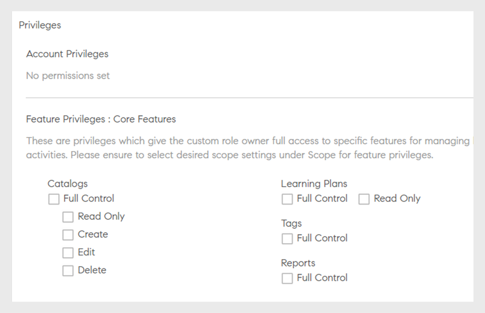
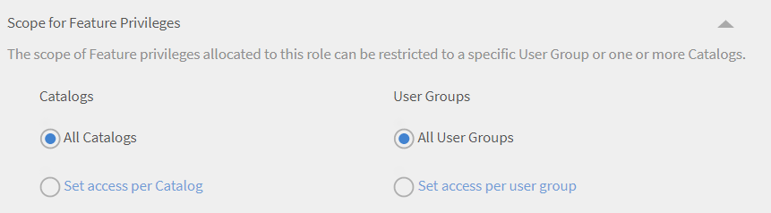
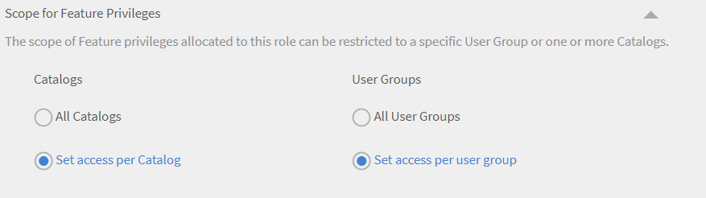

# Benutzerdefinierte Rollen

Mit dieser Funktion können Sie benutzerdefinierte Rollen definieren und bestimmten Benutzergruppen bestimmte Verantwortlichkeiten zuweisen. Mit dieser Funktion können Sie Verantwortlichkeiten zuweisen, die nicht in den Bereich der bestehenden Rolle der Person fallen.

Sie können eine benutzerdefinierte Rolle erstellen, um Authoring-Funktionen bereitzustellen, die auf einen bestimmten Katalog beschränkt sind. Sie können auch eine dedizierte Rolle erstellen, um Berichte zu verwalten. Solche Rollen können dann Personen zugewiesen werden, die diese spezifischen Aufgaben übernehmen sollen.

## Erstellen einer benutzerdefinierten Rolle {#create-role}

1. Melden Sie sich als Administrator an. Öffnen **[!UICONTROL Benutzer]** > **[!UICONTROL Benutzerdefinierte Rolle]**.
1. Auswählen **[!UICONTROL Rolle erstellen]**. Die **[!UICONTROL Neue Rolle erstellen]** &quot; wird geöffnet.

   

   *Erstellen einer benutzerdefinierten Rolle*

1. Geben Sie den Namen in das Feld **[!UICONTROL Name der Rolle]** ein.
1. **[!UICONTROL Kontoberechtigungen]**: Mit diesen Berechtigungen erhalten die Rolleneigentümer Zugriff auf bestimmte Systemkonfigurationsaspekte, die für das gesamte Konto gelten. Wählen Sie die Zugriffsberechtigungen aus. Der Benutzer erhält die volle Kontrolle über die zugewiesenen Berechtigungen.

>[!NOTE]
>
>   Der Geltungsbereich gilt nicht für diese Berechtigungen.

*Festlegen des Suchbereichs*

1. **Funktionsberechtigungen - Kernfunktionen**: Wird verwendet, um Zugriff auf bestimmte Funktionen zum Verwalten von Lernaktivitäten zu gewähren. Mit dieser Option können Berechtigungen für die folgenden Funktionen erteilt werden.

   * Kataloge
   * Berichte
   * Tags

   

   *Festlegen des Suchbereichs für Kataloge, Berichte und Tags*

1. **Funktionsberechtigungen - Lernobjekte:**  Verwenden Sie diese Option, um Zugriff auf Funktionen in Bezug auf LOs zu gewähren. Sie können Zugriff auf die folgenden LOs gewähren.

   * Zertifikationen
   * Kurse
   * Arbeitshilfen
   * Lernprogramme

   Sie können auch eine bestimmte Vorgangskontrolle für die LOs gewähren. Die Berechtigung kann eine der folgenden sein:

   * Vollständige Kontrolle
   * Bearbeiten und Löschen
   * Registrierung
   * Bericht

   

   *Gewähren bestimmter Berechtigungen*

1. **Umfang für Funktionsberechtigungen:** Der Umfang der dieser Rolle zugewiesenen Funktionsberechtigungen kann auf eine bestimmte Benutzergruppe oder einen oder mehrere Kataloge beschränkt werden.

   Kataloge: Verwenden Sie das Optionsfeld, um die Steuerung der **[!UICONTROL Alle Kataloge]** , oder verwenden Sie den Katalog **[!UICONTROL Zugriff pro Katalog festlegen]** , um den Zugriff auf bestimmte Kataloge zu ermöglichen. Sie können auch mehrere Kataloge auswählen.

   Benutzergruppen: Ermöglicht den Zugriff auf **[!UICONTROL Alle Benutzergruppen]** , oder verwenden Sie den Katalog **[!UICONTROL Zugriff pro Benutzergruppe festlegen]** , um Zugriff auf bestimmte Benutzergruppen zu gewähren. Es kann nur eine einzelne Benutzergruppe angegeben werden.

   >[!NOTE]
   >
   >Wenn Sie &quot;Ankündigung&quot;, &quot;Gamifizierung&quot;, &quot;E-Mail-Vorlagen&quot;, &quot;Kenntnisse&quot; und &quot;Benutzer&quot; unter &quot;Kontoberechtigungen&quot; ausgewählt haben, wird der Benutzergruppenzugriff standardmäßig für alle Benutzergruppen bereitgestellt, und diese Option ist deaktiviert.

   Wenn Sie unter &quot;Kontoberechtigungen&quot; die Option &quot;Lernpläne&quot; ausgewählt haben, wird standardmäßig der Zugriff auf alle Kataloge und Benutzergruppen bereitgestellt, und diese Optionen sind unter &quot;Umfang&quot; deaktiviert.

   

   *Umfang der Berechtigungen definieren*

>[!NOTE]
>
>   In Learning Manager 27.6 können Sie eine benutzerdefinierte Rolle erstellen, die über mehrere Kataloge erweitert werden soll, wobei jedem Katalog unterschiedliche Berechtigungen erteilt werden.

Führen Sie die folgenden Schritte aus, um den Katalogen verschiedene Berechtigungen zu erteilen:

1. Klicken Sie auf die Option **[!UICONTROL Zugriff pro Katalog festlegen]**.
1. Wählen Sie die Kataloge aus, und Sie können die Berechtigungsstufe für jeden Katalog anzeigen. Die Berechtigungen lauten wie folgt:

   <table>
        <tbody>
        <tr>
          <td>
          
<b>Berechtigung</b>
</td>
          <td>
          
<b>Beschreibung</b>
</td>
        </tr>
        <tr>
          <td>
          
Vollständige Kontrolle
</td>
          <td>
          
Gewährt volle Kontrolle auf alle Lernobjekte. Zu den Berechtigungen gehören Hinzufügen, Bearbeiten, Löschen, Lesen, Registrieren und Bericht. 
</td>
        </tr>
        <tr>
          <td>
          
Bericht
</td>
          <td>
          
Erteilt nur Zugriff auf die Registerkarte "Berichte" des Lernobjekts.
</td>
        </tr>
        <tr>
          <td>
          
Registrieren
</td>
          <td>
          
Erteilt die Berechtigung, sich nur für das Lernobjekt anzumelden.
</td>
        </tr>
        <tr>
          <td>
          
Schreibgeschützt
</td>
          <td>
          
Erteilt die Berechtigung, nur die Lernobjekte im Katalog anzuzeigen.
</td>
        </tr>
        </tbody>
      </table>

1. Aktivieren oder deaktivieren Sie die Berechtigungen gemäß Ihren Anforderungen.
1. Klicken Sie zum Speichern der Änderungen auf **[!UICONTROL OK]**. Um die Änderungen für die benutzerdefinierte Rolle zu speichern, klicken Sie anschließend auf **[!UICONTROL Speichern]**.

Betrachten Sie beispielsweise das folgende Szenario.

Die resultierende Berechtigung, die ein benutzerdefinierter Benutzer für ein Lernobjekt haben würde, ist eine Schnittmenge aus der Berechtigung für Lernobjekte und der Katalogberechtigung.

Ein benutzerdefinierter Benutzer verfügt über die vollständige Berechtigung für Kurse und nur über den schreibgeschützten Zugriff auf Katalog A, aber über die vollständige Berechtigung für Katalog B. Die Ergebnisse sind ein Zugriff &quot;Schreibgeschützt&quot; auf die Kurse von Katalog A und vollständige Kontrolle über die Kurse von Katalog B.

Ein Benutzer mit einer benutzerdefinierten Rolle kann Folgendes:

* Nur Inhalte aus den Katalogen anzeigen, auf die er Zugriff hat.
* Greifen Sie auf jedes Lernobjekt zu, basierend auf den Berechtigungen des Katalogs, zu dem das Lernobjekt gehört.

Als Administrator haben Sie folgende Möglichkeiten:

* Wählen Sie mehr als einen Katalog für eine benutzerdefinierte Rolle aus.
* Ändern Sie die Berechtigungen eines Katalogs jederzeit.
* Entfernen Sie die Kataloge aus einem Bereich, für den Sie keine Berechtigungen mehr erteilen möchten.
* Erteilen Sie einem Katalog implizit die Berechtigung &quot;Schreibgeschützt&quot;, wenn Sie Berechtigungen für den Katalog erteilen.

Die folgende Tabelle zeigt, wie Berechtigungen erteilt werden.

<table>
    <tbody>
     <tr>
      <td>
       
<strong> </strong>
</td>
      <td>
       
<strong>Genehmigung auf Katalogebene</strong>
</td>
     </tr>
     <tr>
      <td>
       
<strong>Berechtigung auf Lernobjektebene</strong>

       
<strong>(Z. B.: Kurse)</strong>
</td>
      <td>
       
Vollständige Kontrolle
</td>
      <td>
       
Registrieren
</td>
      <td>
       
Bericht
</td>
      <td>
       
Schreibgeschützt
</td>
     </tr>
     <tr>
      <td>
       
Vollständige Kontrolle
</td>
      <td>
       
Vollständige Kontrolle
</td>
      <td>
       
Registrieren
</td>
      <td>
       
Bericht
</td>
      <td>
       
Schreibgeschützt
</td>
     </tr>
     <tr>
      <td>
       
Registrieren
</td>
      <td>
       
Registrieren
</td>
      <td>
       
Registrieren
</td>
      <td>
       
Schreibgeschützt
</td>
      <td>
       
Schreibgeschützt
</td>
     </tr>
     <tr>
      <td>
       
Bearbeiten &amp; Löschen
</td>
      <td>
       
Bearbeiten &amp; Löschen
</td>
      <td>
       
Schreibgeschützt
</td>
      <td>
       
Schreibgeschützt
</td>
      <td>
       
Schreibgeschützt
</td>
     </tr>
     <tr>
      <td>
       
Bericht
</td>
      <td>
       
Bericht
</td>
      <td>
       
Schreibgeschützt
</td>
      <td>
       
Bericht
</td>
      <td>
       
Schreibgeschützt
</td>
     </tr>
    </tbody>
   </table>
1. **Benutzer:** Verwenden Sie diese Option, um zu bestimmen, welchen Benutzern diese Rolle zugewiesen ist. Sie können einen oder mehrere Benutzer über das Suchfeld auswählen.

**Benutzer zum CSV-Upload für benutzerdefinierte Rollen hinzufügen:** Um Benutzer über ein CSV-Update hinzuzufügen, fügen Sie der CSV-Datei eine Spalte &quot;CustomRole&quot; hinzu, die der Administrator zum Importieren von Benutzern verwendet hat. Geben Sie die Rolle des Benutzers in der Spalte Benutzerdefinierte Rolle für die Benutzer ein, denen Sie eine benutzerdefinierte Rolle zuweisen möchten. Zum Hochladen der CSV-Datei klicken Sie auf  **[!UICONTROL Hinzufügen > CSV hochladen]**.

CustomRole columnNote:

* Sie können keine Benutzergruppen durchsuchen.
* Sie können keine Benutzer suchen, denen bereits eine Administratorrolle zugewiesen wurde.
* Die Zuweisung einer neuen benutzerdefinierten Rolle zu einem Benutzer überschreibt die vorherige benutzerdefinierte Rolle des Benutzers.

<!---->

* Ein benutzerdefinierter Administrator, der die Berechtigung für Einstellungen hat, kann den Zeitplan für die Synchronisierung oder die Synchronisierung von Benutzern aus der Datenquelle konfigurieren, auch wenn er keine Berechtigung für die Entität &quot;Benutzer&quot; hat.
* Wenn ein benutzerdefinierter Administrator über Berechtigungen für die Entität &quot;Benutzer&quot; verfügt, können Sie ihm eine Administratorrolle zuweisen und ein Standardadministrator werden.

## Ordnerzugriff für benutzerdefinierte Autoren einschränken {#folder-custom-author}

Learning Manager unterstützt bereits die Möglichkeit, mithilfe benutzerdefinierter Rollen Zugriff auf die Inhaltsbibliothek zu gewähren. Alle benutzerdefinierten Autoren, die bereits Zugriff auf die Inhaltsbibliothek haben, haben weiterhin Zugriff auf alle Inhaltsdateien, selbst wenn Inhaltsordner konfiguriert sind. Dies dient dazu, das alte Verhalten beizubehalten. Administratoren müssen keine Änderungen vornehmen, wenn sie das aktuelle Verhalten fortsetzen möchten.

Wenn sie den Zugriff auf diese benutzerdefinierten Autoren einschränken möchten, müssen Administratoren die vorhandene benutzerdefinierte Rolle bearbeiten und konfigurieren, indem sie nur Zugriff auf bestimmte Inhaltsordner gewähren.

*Ordnerzugriff für benutzerdefinierte Autoren einschränken*

Beim Erstellen eines benutzerdefinierten Autors können Sie dem Autor jetzt Inhaltsordner zuweisen. Wählen Sie die Option **Ausgewählte Ordner**.

Nachdem Sie auf die Option geklickt haben, wird ein neues Dialogfeld geöffnet, in dem Sie die Ordner dem benutzerdefinierten Autor zuweisen können.

*Ordner für den benutzerdefinierten Autor auswählen*

Wählen Sie die Ordner aus und klicken Sie auf **[!UICONTROL OK]**.

## Dashboard für die Lernzusammenfassung für benutzerdefinierte Administratoren {#custom-admin-dashboard}

Benutzerdefinierte Administratoren können dieselbe Ansicht wie Administratoren nutzen. Ein benutzerdefinierter Administrator kann Daten außerhalb seines Bereichs speichern. Dies gilt nur, wenn der Bereich des benutzerdefinierten Administrators nicht eingeschränkt ist. Um beim Erstellen eines benutzerdefinierten Administrators den uneingeschränkten Bereich zu gewähren, aktivieren Sie die Option **[!UICONTROL Vollständige Kontrolle]** im Kontoübersichtsbericht.

*Erstellen einer benutzerdefinierten Rolle*

Daher werden die Optionen, **[!UICONTROL Alle Kataloge]** und **[!UICONTROL Alle Benutzergruppen]** wird ausgewählt und der Rest deaktiviert.

*Umfang der Berechtigungen definieren*

## Implizite Berechtigungen {#implicitpermissions}

Wenn einem Benutzer eine Rolle mit einer bestimmten Entität zugewiesen wird, kann es Fälle geben, in denen er Zugriff auf andere Entitäten benötigt, um Aufgaben für die gewährte Entität ausführen zu können. Wenn ein Benutzer beispielsweise Zugriff auf &quot;Erstellen&quot; für die Kurseinheit erhält, benötigt er Zugriff auf die Entitäten &quot;Kenntnisse&quot; und &quot;Tag&quot;, damit er sie mit dem erstellten Kurs verknüpfen kann. In dieser Tabelle finden Sie Informationen zu diesen impliziten Berechtigungen.

<table>
 <tbody>
  <tr>
   <th>Zugriffstyp</th>
   <th>Entitätsberechtigung, die vom Administrator erteilt wurde</th>
   <th>Implizite Entitätsberechtigung</th>
   <th>Impliziter Zugriff</th>
  </tr>
  <tr>
   <td>Verwalten</td>
   <td>Benutzer</td>
   <td>Gruppe</td>
   <td>Crud</td>
  </tr>
  <tr>
   <td>Registrieren</td>
   <td>Alle Lernobjekte (Kurs, Arbeitshilfe, Lernprogramm, Zertifizierung)</td>
   <td>Benutzer 
     Lernplan</td>
   <td>Lesen</td>
  </tr>
  <tr>
   <td>Erstellen</td>
   <td>
    
Inhaltsgruppe 
      Arbeitshilfe 
</td>
   <td>Tag</td>
   <td>Lesen</td>
  </tr>
  <tr>
   <td>Erstellen</td>
   <td>Kurs</td>
   <td>Inhaltsgruppe 
     Tag 
     Kenntnisse 
     Ausweis 
     Arbeitshilfe</td>
   <td>Weiterlesen</td>
  </tr>
  <tr>
   <td>Erstellen</td>
   <td>Lernprogramm 
     Zertifizierung </td>
   <td>Kurs 
     Tag 
     Kenntnisse 
     Ausweis</td>
   <td>Lesen</td>
  </tr>
  <tr>
   <td>Erstellen</td>
   <td>Lernplan</td>
   <td>Katalog 
     Gruppe 
     Kenntnisse 
     Alle Lernobjekte (Kurs, Arbeitshilfe, Lernprogramm, Zertifizierung)</td>
   <td>Lesen</td>
  </tr>
  <tr>
   <td>Erstellen</td>
   <td>Ankündigung</td>
   <td>Benutzer 
     Gruppe 
     Alle Lernobjekte (Kurs, Arbeitshilfe, Lernprogramm, Zertifizierung)</td>
   <td>Lesen</td>
  </tr>
  <tr>
   <td>Erstellen</td>
   <td>Gamification</td>
   <td>Branding</td>
   <td>Schreiben</td>
  </tr>
  <tr>
   <td>*</td>
   <td>Benutzer</td>
   <td>Abrechnung</td>
   <td>Lesen</td>
  </tr>
  <tr>
   <td>*</td>
   <td>Katalog</td>
   <td>Gruppe 
     Alle Lernobjekte (Kurs, Arbeitshilfe, Lernprogramm, Zertifizierung)</td>
   <td>Lesen</td>
  </tr>
  <tr>
   <td>*</td>
   <td>Einstellung</td>
   <td>Branding 
     Benutzer</td>
   <td>Lesen</td>
  </tr>
  <tr>
   <td>*</td>
   <td>Branding</td>
   <td>Einstellung</td>
   <td>Lesen</td>
  </tr>
  <tr>
   <td>*</td>
   <td>Abrechnung 
     Gamification</td>
   <td>Benutzer</td>
   <td>Lesen</td>
  </tr>
 </tbody>
</table>

## Auf eine benutzerdefinierte Rolle zugreifen {#accessacustomrole}

Wenn ein Administrator eine benutzerdefinierte Rolle zuweist, erhalten Sie eine E-Mail-Benachrichtigung.

Hinweis: Wenn Sie bereits beim Lern-Manager unter einer benutzerdefinierten Rolle angemeldet sind, müssen Sie sich erneut beim Lern-Manager anmelden, um auf die neue Rolle zuzugreifen.

Um zwischen Rollen zu wechseln, klicken Sie auf Ihr Profilsymbol in der oberen rechten Ecke des Lern-Managers und wählen Sie die Rolle aus.

## Lernpläne nach konfigurierbaren Rollen {#scopeconfigure}

In früheren Versionen des Lern-Managers konnte jede benutzerdefinierte Rolle mit der Berechtigung zum Erstellen von Lernplänen den Lernplan für alle Arten von Benutzergruppen und Lernobjekten anzeigen.

Die Umfangseinstellung war früher deaktiviert, als der Zugriff auf den Lernplan gewährt wurde, wodurch der Benutzer standardmäßig auf alle Kataloge und alle Benutzergruppen zugreifen konnte.

Alle von einem Administrator erstellten Lernpläne gelten standardmäßig für alle Benutzer. Benutzern können auch beliebige Lernobjekte zugewiesen werden. Auf der anderen Seite haben Benutzer mit benutzerdefinierten Rollen Zugriff auf vollständige Bereiche, z. B. alle Kataloge, Lernobjekte oder Benutzergruppen. Dies bedeutete, dass Administratoren nicht wie erwartet benutzerdefinierte Rollen erstellen konnten, die Benutzern mit begrenztem Umfang den Zugriff auf Lernpläne ermöglichten.

In diesem Update des Lern-Managers können Sie benutzerdefinierte Rollen für Lernpläne erstellen, die den Umfang für Benutzer und Lernobjekte festlegen. Mit anderen Worten, Lernpläne können mit einem begrenzten Umfang erstellt werden, der vom Rollenbereich eines benutzerdefinierten Administrators abgeleitet wird.

Jetzt kann ein Administrator den Umfang definieren oder einschränken, während er Zugriff auf die Lernplanverwaltung gewährt.

Benutzerdefinierte Administratoren können Lernpläne mit einem begrenzten Umfang erstellen, der vom Umfang der konfigurierbaren Rolle des benutzerdefinierten Administrators abhängt. Solche Lernpläne sind nur für benutzerdefinierte Administratoren mit derselben Rolle zugänglich, außerdem für reguläre Administratoren. Darüber hinaus können die benutzerdefinierten Administratoren keine anderen Lernpläne im Konto sehen.

Bestehende benutzerdefinierte Administratoren, die Zugriff auf Lernpläne haben, haben (per Definition) immer den vollen Umfang. Sie haben wie normale Administratoren Zugriff auf alle Lernpläne im Konto. Neue benutzerdefinierte Rollen, die mit vollem Umfang erstellt wurden, und neue benutzerdefinierte Administratoren, die diesen Rollen hinzugefügt wurden, haben weiterhin Zugriff auf alle Lernpläne.

Von Administratoren erstellte Lernpläne und benutzerdefinierte Administratoren mit vollem Umfang werden wie gewohnt erstellt und sind nicht durch den Umfang beschränkt.

Im Abschnitt **Umfang für Funktionsberechtigungen** Zugriff auf Benutzergruppen und/oder den Katalog für die benutzerdefinierte Rolle zu gewähren.

*Zugriff auf Benutzergruppen und/oder den Katalog für die benutzerdefinierte Rolle gewähren*

Weisen Sie einen Benutzer der benutzerdefinierten Rolle zu.

*Benutzer einer benutzerdefinierten Rolle zuweisen*

Der Benutzer meldet sich jetzt als benutzerdefinierter Administrator beim Learning Manager an und fügt einen Lernplan hinzu.

Wenn ein neuer Teilnehmer hinzugefügt wird, kann der benutzerdefinierte Administrator eine Schulung nur aus den Katalogen der konfigurierbaren Rolle auswählen.

Dieser Lernplan gilt jetzt nur für den Teilnehmer, wenn der Benutzer auch der Gruppe innerhalb der Benutzergruppe mit dem Umfang des Lernplans hinzugefügt wird. Alle anderen Teilnehmer werden von diesem Lernplan ausgenommen.

## Der Teilnehmer wird der Gruppe hinzugefügt {#learnergetsaddedtothegroup}

<!---->

Der benutzerdefinierte Administrator kann jede Benutzergruppe mit Benutzern aus der Benutzergruppe mit dem Umfang der Rolle auswählen.

Wenn ein Benutzer zur angegebenen Gruppe hinzugefügt wird, wird nur Benutzern das Lernobjekt zugewiesen, die bereits Teil der Benutzergruppe mit dem Umfang des Lernplans sind und der angegebenen Benutzergruppe hinzugefügt wurden.

## Änderung des Umfangs {#changeinscope}

Wenn der Administrator den Umfang der benutzerdefinierten Rolle ändert, wird die Änderung auch auf den benutzerdefinierten Administrator übertragen. Wenn der benutzerdefinierte Administrator einen Lernplan auswählt, der bereits im Umfang einer vorherigen benutzerdefinierten Rolle enthalten ist, wird eine Meldung angezeigt, wie unten gezeigt:

*Meldung nach Bereichsänderungen*

Der benutzerdefinierte Administrator muss jetzt den früheren Bereich auf den neuen Bereich aktualisieren bzw. aktualisieren.

Klicken **[!UICONTROL Umfang aktualisieren]** aktualisiert den Umfang. Es wird eine Warnmeldung angezeigt.

*Warnmeldung nach Aktualisieren eines Bereichs*

Klicken **[!UICONTROL Ja]** aktualisiert den Umfang.

## Gamification-Bericht zu einer benutzerdefinierten Rolle hinzufügen {#gamification-custom}

Ein Administrator kann Gamification-Berichte für einen benutzerdefinierten Benutzer aktivieren.

1. Im Dialogfeld &quot; **[!UICONTROL Benutzerdefinierte Rollen]** den Namen der benutzerdefinierten Rolle ein.
1. Im Dialogfeld &quot; **[!UICONTROL Funktionsberechtigungen: Kernfunktionen]** die Option **[!UICONTROL Vollständige Kontrolle]** für die Kategorie **[!UICONTROL Berichte]**.

1. Im Abschnitt **[!UICONTROL Benutzer]** den Benutzer aus, dem die neu erstellte benutzerdefinierte Rolle zugewiesen werden soll.
1. Klicken **[!UICONTROL Speichern]**.

Wenn sich ein Benutzer als benutzerdefinierter Administrator anmeldet und auf **[!UICONTROL Berichte]** im linken Bereich werden die Transkripte wie folgt angezeigt:

*Gamification-Transkripte herunterladen*

Klicken **[!UICONTROL Gamification-Protokolle]**, wählen Sie einen Benutzer aus und generieren Sie den Bericht.

Wenn ein Administrator die Stufenpunkte ändert, werden in den Berichten die Stufen entsprechend den aktuellen Punkten angezeigt.

Durch das Zurücksetzen von Gamification wird die erreichte Stufe nicht zurückgesetzt.

## Häufig gestellte Fragen {#frequentlyaskedquestions}

+++Wie erstelle ich eine benutzerdefinierte Rolle?

Eine benutzerdefinierte Rolle ist wie eine Untergruppe einer Autoren- oder Administratorrolle. Lassen Sie eine oder mehrere Berechtigungen zu, definieren Sie den Umfang und weisen Sie die Rolle einem Benutzer zu.

Klicken **[!UICONTROL Benutzer]** > **[!UICONTROL Benutzerdefinierte Rollen]**. Klicken Sie auf der Seite Benutzerdefinierte Rollen auf **[!UICONTROL Rolle erstellen]**. Geben Sie den Namen der benutzerdefinierten Rolle ein und legen Sie die Berechtigungen für die Rolle fest. Weitere Informationen finden Sie unter [Erstellen einer benutzerdefinierten Rolle](custom-role.md#create-role).
+++
