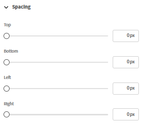
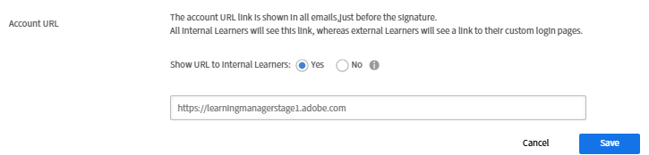
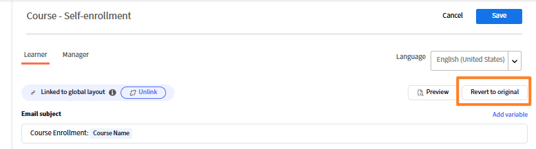

## Komponentenbasierter E-Mail-Generator.

Adobe Learning Manager umfasst einen komponentenbasierten E-Mail-Generator, mit dem Administratoren und Autoren E-Mails für Unternehmensanforderungen, einschließlich Branding, mithilfe eines modernen visuellen Editors erstellen können, ohne einen HTML schreiben zu müssen. Jede E-Mail, die euer Unternehmen sendet - von Anmeldebestätigungen bis hin zu Erinnerungen an Sitzungen -, kann dem Look-and-Feel eurer Marke entsprechen.

**Für Administratoren:** Erstellen Sie ein globales Layout einmal* als wiederverwendbare Kopf- und Fußzeile, die jede E-Mail automatisch umschließt, und passen Sie dann einzelne Vorlagen nach Bedarf an. Verfassen Sie E-Mails in einem Inline-Drag-and-Drop-Editor mit umfangreichen Komponenten: mit Rich-Text-Formatierung, Bildern, Bannern, Buttons, Social-Media-Links, Trennern und mehr.

**Für Autoren:** Wenden Sie die gleichen Editorfunktionen auf E-Mails an, die für bestimmte Kurse und Instanzen spezifisch sind, sodass Schulungsmitteilungen auf jedes Lernerlebnis zugeschnitten werden können, ohne die Einstellungen für das gesamte Konto zu beeinträchtigen.

Der Builder unterstützt ein hierarchisches Modell: kann dieselbe E-Mail-Vorlage auf Instanz-, Kurs- oder Kontoebene konfiguriert werden. Wenn eine Vorlage nicht einzeln bearbeitet wurde, übernimmt sie automatisch die Einstellungen der übergeordneten Ebene. Wenn Sie ein vollständig benutzerdefiniertes Design benötigen, heben Sie die Verknüpfung der Vorlage auf und übernehmen die vollständige Kontrolle. Mit einer integrierten Vorschau können Sie überprüfen, wie eine E-Mail in den Posteingängen der Empfänger angezeigt wird, bevor sie gesendet wird.

## Funktionsweise des E-Mail-Vorlagensystems

Jede ausgehende E-Mail in Adobe Learning Manager besteht aus drei strukturellen Teilen:

* **Kopfzeile:** das Bannerbild oder die Bannerfarbe und den Organisationsnamen
* **Haupttext:** die dynamische Inhaltszone, die für jeden E-Mail-Typ eindeutig ist; enthält den Nachrichtentext und die Platzhalter für Variablen
* **Fußzeile:** Konto-URL, E-Mail-Signatur, Hilfelink und andere Elemente

Das **globale Layout** ist das Masterdesign, das gleichzeitig auf alle über 130 E-Mail-Vorlagen angewendet wird. Wenn Sie das globale Layout aktualisieren, spiegelt jede noch damit verknüpfte Vorlage die Änderung automatisch wider. Die Verknüpfung von Vorlagen mit dem globalen Layout kann jederzeit aufgehoben werden, um eine unabhängige Anpassung zu ermöglichen.

### Die E-Mail-Hierarchie

Einstellungen und Design fließen durch Vererbung von einer höheren Ebene zu einer niedrigeren Ebene. Jede Ebene kann das, was sie erbt, überschreiben oder vollständig anpassen.

| Stufe | Wer konfiguriert es? | Standardstatus | Was kann bearbeitet werden? |
| --- | --- | --- | --- |
| **Globales Layout** | Administrator | Root; kein Elternteil | Vollständiges Layout: alle Teile, alle Bauteile |
| **Konto-E-Mail-Vorlage** | Administration | Mit globalem Layout verknüpft | Nur Haupttext (verknüpft); vollständiges Layout (ohne Verknüpfung) |
| **Autor - LO-Layout** | Autor | Mit Kontovorlage verknüpft | Vollständiges Layout im LO-Bereich |
| **Autor - LO-E-Mail-Vorlage** | Autor | Mit LO-Layout verknüpft | Nur Haupttext (verknüpft); vollständiges Layout (ohne Verknüpfung) |
| **E-Mail-Vorlage für Autoreninstanz** | Autor | Mit LO-Vorlage verknüpft | Nur Haupttext (verknüpft); vollständiges Layout (ohne Verknüpfung) |

### Grundlegende Vererbungsregeln

* Jede Ebene beginnt mit der unmittelbar übergeordneten Ebene verknüpft, bis sie explizit geändert wird.
* Durch Bearbeiten des **-Textkörpers** einer Vorlage wird die Verknüpfung nicht aufgehoben. Kopf- und Fußzeile spiegeln weiterhin das übergeordnete Element wider.
* Durch Bearbeiten des **Layouts** oder Auswählen von **Verknüpfung aufheben** wird nur die übergeordnete Verbindung für diese Vorlage unterbrochen.
* **Auf Original zurücksetzen** verknüpft die Vorlage erneut mit der übergeordneten Vorlage und setzt sowohl Layout als auch Haupttext auf die übergeordnete Version zurück.
* Das Aufheben der Verknüpfung auf einer Ebene hat keine Auswirkungen auf Ebenen darüber oder darunter.

## Globales Layout einrichten

Das globale Layout definiert die freigegebene Kopf- und Fußzeile sowie den strukturellen Wrapper, der in jede verknüpfte E-Mail fließt. Konfigurieren Sie sie zuerst, damit alle Vorlagen mit einem konsistenten Branding beginnen.

### Öffnen Sie den Editor für globale Layouts

1. Melden Sie sich bei Adobe Learning Manager als Administrator an.
2. Wählen Sie in der linken Navigation **E-Mail-Vorlagen** aus.
3. Wählen Sie die Registerkarte **Globales Layout** aus.

   Die Editor-Arbeitsfläche wird mit dem aktuellen globalen Layout geladen. Die Zone **Dynamischer Haupttext**, die als Platzhalter in der Mitte angezeigt wird, stellt den Bereich dar, in dem der eindeutige Nachrichteninhalt jeder Vorlage angezeigt wird. Sie können den dynamischen Haupttext nicht über das globale Layout bearbeiten.

   

### E-Mail-Container konfigurieren

Der E-Mail-Container ist der äußerste Wrapper für jede E-Mail. Die Einstellungen wirken sich auf den visuellen Rahmen um den gesamten Inhalt aus.

1. **Bearbeiten** in der Nähe von **Layout für globale E-Mails auswählen**
2. Wählen Sie auf der Arbeitsfläche den E-Mail-Container aus.
3. Legen Sie im Bereich **Eigenschaften** auf der rechten Seite Folgendes fest:
   * **Hintergrundfarbe:** die Farbe hinter allen E-Mail-Inhalten

   

   * **Rahmen:** Stil, Breite und Farbe des äußeren Rahmens

   

   * **Abstand:** Abstand um die Richtungen des E-Mail-Inhalts

   

   * **Zeilenabstand:** der vertikale Abstand, der zwischen allen Zeilen im Layout angewendet wird

   

### Arbeiten mit Zeilen und Spalten

Der gesamte Inhalt im E-Mail-Editor wird in **Zeilen** platziert. Jede Zeile enthält eine oder mehrere **Spalten** und jede Spalte enthält eine oder mehrere **Komponenten**.

So fügen Sie eine Zeile hinzu

1. Wählen Sie oben auf der Arbeitsfläche **Zeile** aus.

   

2. Wählen Sie ein Spaltenlayout: **1 Spalte**, **2 Spalten**, **3 Spalten** oder **4 Spalten**.

   

   Die neue Zeile wird auf der Arbeitsfläche angezeigt und ist bereit für Komponenten.

So konfigurieren Sie eine Zeile:

1. Wählen Sie die Zeile auf der Arbeitsfläche aus.

   

2. Legen Sie im Bereich **Eigenschaften** Folgendes fest:
   * **Hintergrundfarbe:** Hintergrundfarbe auf Zeilenebene überschreibt die Containerfarbe für diese Zeile
   * **Rahmen:** Zeilenbegrenzungsformat, Breite und Farbe
   * **Abstand:** horizontaler Abstand zwischen den Spalten in dieser Zeile

   

**So ordnen Sie Zeilen neu an:**

* Ziehe eine beliebige Zeile an ihrem Griff nach oben oder unten, wenn du mit dem Cursor über den linken Rand fährst.

**So löschen Sie eine Zeile:**

* Wählen Sie die Zeile aus, und wählen Sie in der Symbolleiste der Zeile das Symbol **Löschen**.

### Komponenten hinzufügen und anordnen

Komponenten sind Bausteine für E-Mail-Inhalte. Ziehen Sie sie aus dem Bereich **Komponenten** oben und legen Sie sie in eine beliebige Spaltenzelle ab. Verwenden Sie den Bereich **Eigenschaften** auf der linken Seite, um die ausgewählte Komponente anzupassen.

Beim Ziehen und Ablegen einer Komponente zeigt ein blaues &quot;+&quot;-Symbol an, wo die Komponente platziert werden kann.

**So fügen Sie eine Komponente hinzu:**

1. Suchen Sie im Bedienfeld Komponente die gewünschte Komponente.

   

2. Ziehen Sie sie in eine Spaltenzelle auf der Arbeitsfläche.

   

3. Die Komponente wird zu dieser Zelle hinzugefügt. Wählen Sie sie aus, um ihre Eigenschaften im rechten Fenster zu öffnen.

   

**So verschieben Sie eine Komponente:**

* Ziehen Sie die Komponente an ihrem Ziehpunkt an eine andere Spalten- oder Zeilenposition.

**So löschen Sie eine Komponente:**

* Wählen Sie die Komponente aus und wählen Sie in der Komponentensymbolleiste das Symbol **Löschen**.

### Vorgabenkomponenten bearbeiten

Das **globale Layout** enthält integrierte Vorgabekomponenten, die den in den E-Mail-Einstellungen konfigurierten freigegebenen Feldern entsprechen. Vorgabenkomponenten können direkt auf der Arbeitsfläche bearbeitet oder vollständig entfernt werden.

| Vorgabenkomponente | Standardinhalt | Kann entfernt werden? |
| --- | --- | --- |
| **Banner** | Standardbannerbild oder -farbe | Ja |
| **Anrede** | &quot;Hallo {{user}},&quot; | Ja |
| **Dynamischer Textkörper** | Platzhalter für Inhalt pro Vorlage | Kein - erforderlich |
| **Konto-URL** | Plattform-URL Ihres Kontos | Ja |
| **Signatur** | Konfigurierter Signaturtext | Ja |

**Bearbeiten einer Vorgabenkomponente:**

1. Fügen Sie die voreingestellte Komponente hinzu, z. B. ein Banner.

   

2. Wählen Sie das Banner auf der Arbeitsfläche aus.
3. Ändern Sie im Bereich **Eigenschaften** die Schriftart, den Schriftgrad und andere visuelle Eigenschaften des Banners.

   

**So entfernen Sie eine voreingestellte Komponente aus allen E-Mails:**

1. Wählen Sie auf der Arbeitsfläche die voreingestellte Komponente aus.
2. Wählen Sie in der Komponentensymbolleiste **Löschen** aus.

Wenn Sie eine voreingestellte Komponente aus dem globalen Layout entfernen, wird sie aus jeder verknüpften E-Mail entfernt. Nicht verknüpfte Vorlagen behalten die Komponente bei, bis Sie sie manuell aus jeder entfernen.

### Speichern des globalen Layouts

Wählen Sie **Speichern** aus, wenn das Layout abgeschlossen ist. Das aktualisierte Design wird sofort auf alle E-Mail-Vorlagen angewendet, die noch mit dem globalen Layout verknüpft sind.

## Konfigurieren globaler E-Mail-Vorgaben

Definiert allgemeine Elemente wie Banner, Anrede und Unterschrift, um sie in allen E-Mails wiederzuverwenden. Diese können im globalen Layout oder in individuellen ereignisbasierten E-Mail-Vorlagen in Adobe Learning Manager verwendet werden. Die hier vorgenommenen Änderungen werden automatisch dort übernommen, wo diese Vorgaben verwendet werden. Sie können diese Vorgaben auch überschreiben und benutzerdefinierte Elemente direkt im E-Mail-Generator entwerfen.

Konfigurieren Sie Folgendes:

### E-Mail-Banner

1. Wählen Sie **Bearbeiten** neben **E-Mail-Banner.**
2. Lade ein Bannerbild hoch, oder lege eine einfarbige Hintergrundfarbe fest.

   

3. Wählen Sie **Speichern.**

### E-Mail-Anrede

1. Wählen Sie **Bearbeiten** neben **E-Mail-Anrede**
2. Der Standardwert lautet &quot;Hallo {{user}}&quot; - die Variable &quot;{{user}}&quot; wird zur Laufzeit mit dem Namen des Empfängers ausgefüllt.

   

3. Ändern Sie den Grußtext oder entfernen Sie die Anrede vollständig.
4. Wählen Sie **Speichern**.

### Konto-URL

1. Wählen Sie **Bearbeiten** neben **Konto-URL.**
2. Geben Sie die URL Ihrer Lernplattform ein. wird in allen ausgehenden E-Mails angezeigt.

   

3. Wählen Sie **Speichern**.

### E-Mail-Signatur

1. **Bearbeiten** neben **E-Mail-Signatur** auswählen
2. Schließenden Text eingeben.

   

3. Wählen Sie **Speichern**.

## Einzelne Komponenten hinzufügen und konfigurieren

### Textkomponente

Die Textkomponente unterstützt die Rich-Text-Bearbeitung.

1. Ziehen Sie eine **Text**-Komponente in eine Spaltenzelle.
2. Wähle den Clip aus, um den Bearbeitungsmodus zu aktivieren.

   

3. Geben Sie Ihren Inhalt ein oder fügen Sie ihn ein.
4. Wenden Sie die folgenden Formatierungsoptionen an:
   * **Schriftart:** Wählen Sie aus websicheren Schriftarten (Arial, Helvetica, Georgia und andere) oder benutzerdefinierten Schriftarten, die für Ihr Konto konfiguriert sind.
   * **Größe:** Schriftgröße in Punkt
   * **Bold**, **Italic**, **Underline**, **Durchstreichen**
   * **Hochgestellt** und **Tiefgestellt**
   * **Textfarbe** und **Hintergrundfarbe** (Textmarkierung)
   * **Ausrichtung:** links, zentriert, rechts oder Blocksatz
   * **Zeilenabstand:** Zeilenhöhenmultiplikator
   * **Horizontaler und vertikaler Abstand:** interner Abstand innerhalb des Textblocks
5. Hinzufügen eines Hyperlinks:
   * Wählen Sie den zu verknüpfenden Text aus
   * Wählen Sie das Symbol **Link** in der Symbolleiste aus.
   * Ziel-URL eingeben

   

6. **Anwenden** auswählen

### Bildkomponente

1. Ziehen Sie eine **Image**-Komponente in eine Spaltenzelle.
2. Wählen Sie **Hochladen**, um eine neue Bilddatei hochzuladen (JPEG und GIF werden unterstützt), oder wählen Sie **Durchsuchen**, um eine Bildbibliothek auszuwählen.
3. Konfigurieren Sie bei ausgewähltem Bild Folgendes:

   

   * **Bild ändern:** Laden Sie ein neues Bild hoch, oder ersetzen Sie das derzeit ausgewählte Bild.
   * **Bild-URL:** Gibt die Quell-URL des anzuzeigenden Bilds an. Das Bild wird von diesem Speicherort geladen.
   * **Link:** Fügt dem Bild einen klickbaren Hyperlink hinzu. Benutzer werden zur angegebenen URL umgeleitet, wenn auf das Bild geklickt wird.
   * **Randtyp:** Definiert den Stil des Bildrands. Zu den verfügbaren Optionen gehören &quot;Ohne&quot;, &quot;Durchgezogen&quot; und &quot;Gepunktet&quot;.
   * **Rahmenfarbe:** Legt die Farbe des Bildrands fest, wenn ein Rahmenstil angewendet wird.
   * **Eckenradius:** Steuert die Rundheit der Bildecken. Höhere Werte erzeugen abgerundetere Ecken.
   * **Rahmenlinie:** Passt die Dicke (Breite) des Bildrahmens an.
   * **Oberer Abstand:** Fügt einen Abstand über dem Bild hinzu.
   * **Unterer Abstand:** Fügt einen Abstand unter dem Bild hinzu.
   * **Linker Abstand:** Fügt der linken Seite des Bildes einen Leerraum hinzu.
   * **Rechter Abstand:** Fügt der rechten Seite des Bildes einen Leerraum hinzu.
   * **Horizontale Ausrichtung:** Bestimmt die Bildposition innerhalb des Containers. Zu den Optionen gehören in der Regel die linke, zentrierte und rechte Ausrichtung.

### Schaltflächenkomponente

1. Ziehen Sie eine **Button**-Komponente in eine Spaltenzelle.
2. Wählen Sie diese Option und konfigurieren Sie:

   

   * **Beschriftung:** Schaltflächentext
   * **Link:** die Ziel-URL, wenn auf die Schaltfläche geklickt wird
   * **Schriftart:** Schriftfamilie und -größe für die Schaltflächenbeschriftung
   * **Textfarbe:** Beschriftungsfarbe
   * **Hintergrundfarbe:** Schaltflächenfüllfarbe
   * **Größe:** Schaltflächenbreite und -höhe
   * **Eckenformat:** Abgerundet, Quadrat oder Kreissegment
   * **Ausrichtung:** links, zentriert oder rechts in der Spalte
   * **Auffüllung:** interner Abstand zwischen dem Beschriftungstext und den Schaltflächenrändern

### Teile- und Abstandhalterkomponenten

**Unterteilung:** fügt eine sichtbare horizontale Linie zwischen Inhaltsabschnitten hinzu.

1. Ziehen Sie eine **Divider**-Komponente in eine Spalte.
2. Legen Sie im Eigenschaftenfenster den Stil **Linie** (durchgehend, gestrichelt, gepunktet), **Farbe**, **Breite** und **Höhe** (vertikaler Abstand über und unter der Linie) fest.

   **Spacer:** fügt einen unsichtbaren vertikalen Abstand zwischen Elementen ohne sichtbare Linie hinzu.

3. Ziehen Sie eine **Spacer**-Komponente und legen Sie ihre **Höhe** im Eigenschaftenfenster fest.

## Einfügen und Verwalten von Variablen

Variablen sind dynamische Platzhalter, die beim Senden einer E-Mail durch reale Daten ersetzt werden. Die verfügbaren Variablen hängen vom jeweiligen Vorlagentyp ab. Eine Registrierungsbestätigungs-E-Mail enthält verschiedene Variablen einer Sitzungserinnerung.

### Einfügen einer Variablen mithilfe der Auswahl

1. Platzieren Sie den Cursor an einer Textkomponente, an der die Variable angezeigt werden soll.
2. Wählen Sie **Variable** in der Text-Editor-Symbolleiste einfügen. Die Variablenauswahl wird geöffnet und zeigt alle für diesen Vorlagentyp verfügbaren Variablen an.
3. Wählen Sie eine Variable. Beispiel: **Kursname**, **Teilnehmername** oder **Lernpfadname**.

   

### Einfügen einer Variablen durch Eingabe

Geben Sie den Variablennamen direkt umgeben von doppelten geschweiften Klammern ein: {\{variable_name}\}. Der Editor erkennt es automatisch als Variablentoken und hebt es hervor.

**Beispiele für allgemeine Variablen:**

| Variable | Ersetzt durch |
| --- | --- |
| Vollständiger Name des Empfängers | {\{learnerName}\} |
| E-Mail des Empfängers | {\{learnerEmail}\} |
| Benutzername des Empfängers | {\{user}\} |
| Benutzertyp | {\{userType}\} |
| Name der Organisation | {\{organizationName}\} |
| Kursname | {\{courseName}\} |
| Kursbeschreibung | {\{courseDescription}\} |
| Kursverfasser | {\{courseAuthor}\} |
| Kurslink | {\{courseLink}\} |
| Für den Kurs erforderliche Kenntnisse | {\{courseSkillDetails}\} |
| Abzeichen im Kurs | {\{courseBadge}\} |
| Frist für Kursanmeldung | {\{courseEnrollmentDeadline}\} |
| Frist für Kursabschluss | {\{courseCompletionDeadline}\} |
| Abschlussdatum des Kurses | {\{courseCompletionDate}\} |
| Name des Lernpfads | {\{LPName}\} |
| Lernpfadlink | {\{LPLink}\} |
| Anmeldeschluss für Lernpfad | {\{LPEnrollmentDeadline}\} |
| Termin für Abschluss des Lernpfads | {\{LPCompletionDeadline}\} |
| Abschlussdatum des Lernpfads | {\{LPCompletionDate}\} |
| Zertifizierungsname | {\{certificationName}\} |
| Registrierungsfrist für Zertifizierung | {\{certificationEnrollmentDeadline}\} |
| Abschlussdatum der Zertifizierung | {\{certificationCompletionDate}\} |
| Dauer der Kursfrist | {\{deadlineDuration}\} |
| Kursablauffrist | {\{expiryDuration}\} |
| Ablaufdatum des Kurses | \{\{expiryDate\}\} |
| Sitzungsname | \{\{sessionName\}\} |
| Startdatum der Sitzung | \{\{sessionDate\}\} |
| Enddatum der Sitzung | \{\{endSessionDate\}\} |
| Startzeit der Sitzung | \{\{sessionTime\}\} |
| Ende der Sitzung | \{\{endSessionTime\}\} |
| Name des Ortes | \{\{venueName\}\} |
| Veranstaltungsort | \{\{venueInfo\}\} |
| Veranstaltungs-URL | \{\{venueURL\}\} |
| Veranstaltungsort | \{\{venueRegion\}\} |
| URL des virtuellen Klassenzimmers | \{\{vcUrl\}\} |
| Anbieterkonto für virtuelles Klassenzimmer erforderlich | \{\{VCProviderAccountReq\}\} |
| Kursleitername | \{\{instructorName\}\} |
| Modulname | \{\{moduleName\}\} |
| Name des Lernobjekts | \{\{learningObjectName\}\} |
| Abschlussdatum des Lernobjekts | \{\{loCompletionDate\}\} |
| Alternative Lernobjektnamen | \{\{alternativeLoNameList\}\} |
| Alternative Lernobjektverknüpfungen | \{\{alternativeLoNameListLinks\}\} |
| Alternatives Lernobjekt entfernt | \{\{removedAlternateLo\}\} |
| Erforderlicher Text | \{\{preRequisiteText\}\} |
| Anzahl der Voraussetzungen | \{\{preRequisiteCountText\}\} |
| CI-Name | \{\{ciName\}\} |
| Name des Berichts-Dashboards | \{\{reportDashboardName\}\} |
| Name der Arbeitshilfe | \{\{jobAidName\}\} |
| Inhalt der Ankündigung | \{\{announcementContentText\}\} |
| Profilname | \{\{profileName\}\} |
| Sitzplatzbeschränkung für Kurs | \{\{seatLimit\}\} |
| Link zur Startseite des Hilfedokuments | \{\{captivatePrimeHelp\}\} |
| Link zur Hilfeseite | \{\{helpPageLink\}\} |
| Count | \{\{count\}\} |

>[!NOTE]
>
>Variablen sind vorlagenspezifisch. Nicht jede Variable ist in jeder Vorlage verfügbar. Verwenden Sie die **Variable einfügen**-Auswahl, um nur die Variablen anzuzeigen, die für die zu bearbeitende Vorlage gelten. Wenn Sie einen unbekannten Variablennamen in geschweiften Klammern eingeben, wird im Editor kein Fehler generiert, dieser wird jedoch als wörtlicher Text in der gesendeten E-Mail angezeigt.

### Variablen im Banner

1. Die E-Mail-Betreffzeile unterstützt auch Variablen. So fügen Sie dem Motiv eine Variable hinzu:
2. Öffnen Sie eine Vorlage, und suchen Sie das Feld **E-Mail-Betreff**.
3. Geben Sie die Variable direkt ein. Beispiel: &quot;Ihre Registrierung für {\{course_name}\} ist bestätigt&quot;. Die Variable wird mit dem tatsächlichen Kursnamen gerendert, wenn die E-Mail gesendet wird.
4. Wählen Sie alternativ **Variable hinzufügen** und anschließend **Kurs** aus.

   

### Variablen und das globale Layout

Variablen im globalen Layout sind vorlagenunabhängig und werden je nach Kontext unterschiedlich aufgelöst. Verwenden Sie im globalen Layout nur universell anwendbare Variablen wie {\{user}\} und {\{account_url}\}. Vorlagenspezifische Variablen (z. B. {\{course_name}\}) sollten in einzelnen Vorlagentexten platziert werden, nicht im globalen Layout.

## Vorlagen verknüpfen und die Verknüpfung aufheben

### Verknüpfter und nicht verknüpfter Status

Jede Vorlage ist **mit der übergeordneten Vorlage** oder **nicht verknüpft** und vollständig unabhängig.

**Bei Verknüpfung:**

* Die Kopf- und Fußzeile wird im Editor **ausgegraut** angezeigt. Dies ist der visuelle Hinweis darauf, dass die Vorlage verknüpft ist.

* Nur der Textkörper kann bearbeitet werden.
* Änderungen am übergeordneten Layout werden automatisch in diese Vorlage übernommen.

**Wenn die Verknüpfung aufgehoben wurde:**

* Die Kopf- und Fußzeile können vollständig bearbeitet werden. Es sind keine ausgegrauten Bereiche vorhanden.
* Die Vorlage ist völlig unabhängig. Elternänderungen wirken sich nicht auf sie aus.
* Die Vorlage beginnt mit dem Design des übergeordneten Elements, wenn die Verknüpfung aufgehoben wird

**Schlüsselregel:** Durch Bearbeiten des **Haupttexts** wird die Verknüpfung einer Vorlage nie aufgehoben. Wenn Sie das **Layout** bearbeiten oder **Verknüpfung aufheben** explizit auswählen, wird die übergeordnete Verbindung unterbrochen.

### Wann werden Hyperlinks erstellt? (Verknüpfte bleiben)

* Sie möchten, dass das globale Branding weiterhin automatisch zum Tragen kommt.
* Sie müssen nur den Nachrichtentext oder die Variablen in dieser Vorlage ändern.
* Sie führen eine große Bibliothek mit Vorlagen und möchten die Markenkontrolle zentralisieren.

### Wann soll die Verknüpfung aufgehoben werden?

* Sie benötigen ein anderes Banner, Farbschema oder strukturelles Layout für eine bestimmte Vorlage.
* Sie erstellen ein individuelles Markenerlebnis für einen bestimmten Kurs, eine bestimmte Zertifizierung oder eine bestimmte Zielgruppe
* Sie sind ein Autor, der vollständige Design-Kontrolle für ein Lernobjekt oder eine Instanz benötigt

### Verknüpfung einer Vorlage auf Kontoebene aufheben - Administrator

1. Wählen Sie **E-Mail-Vorlagen** aus und öffnen Sie eine Vorlage. Beispiel: Kurs - Selbstregistrierung.
2. Wählen Sie **Verknüpfung aufheben**.

   

3. Lesen Sie die Bestätigungsmeldung und wählen Sie **Ja**.
4. Die Kopf- und Fußzeile können vollständig bearbeitet werden.
5. Teile einer Vorlage anpassen.
6. Wählen Sie **Speichern**.

Die Vorlage behält das Layout des übergeordneten Elements als Ausgangspunkt bei, erhält aber keine zukünftigen Aktualisierungen des übergeordneten Elements mehr.

### Vorlage auf die übergeordnete Version zurücksetzen

Mit &quot;Auf Original zurücksetzen&quot; wird die Vorlage erneut verknüpft und exakt auf das zurückgesetzt, was das übergeordnete Element bietet.

* Wenn die Vorlage nur **Textkörper bearbeitet wurde** (noch verknüpft): setzt die Standardnachricht auf die Standardnachricht des übergeordneten Elements zurück. Die Kopf- und Fußzeile bleiben unverändert, da sie bereits vom übergeordneten Element stammen.
* Wenn die Vorlage **vollständig nicht verknüpft** war: ersetzt alles - Kopfzeile, Textkörper und Fußzeile - durch die übergeordnete Version. Alle unabhängigen Anpassungen werden dauerhaft entfernt.

>[!CAUTION]
>
>Das Zurücksetzen auf das Original kann nicht rückgängig gemacht werden. Kopieren Sie alle Inhalte, die Sie behalten möchten, bevor Sie sie wiederherstellen.

**Zurücksetzen:**

1. Öffnen Sie die Vorlage im Editor.
2. Wählen Sie **Auf Original zurücksetzen**.

   

### Verknüpfung einer Vorlage auf Instanzebene aufheben - Autor

1. Öffnen Sie einen Kurs und wählen Sie **E-Mail-Vorlagen** aus.
2. Öffnen Sie eine Vorlage, z. B. &quot;Kursabschluss&quot;.
3. Wählen Sie **Verknüpfung aufheben**, und bestätigen Sie den Vorgang.
4. Nehmen Sie Änderungen vor und wählen Sie **Speichern**.

Dies betrifft nur diese Instanz. Andere Instanzen sind davon nicht betroffen. Die Instanzvorlage beginnt mit dem Vorlagendesign auf LO-Ebene, wenn die Verknüpfung aufgehoben wird, und nicht mit dem globalen Layout.

Admin-Vorlagen werden auf die globale Layout-Version zurückgesetzt und erneut mit dem globalen Layout verknüpft. LO-Vorlagen für Autoren werden auf die Vorlagenversion des Administratorkontos zurückgesetzt. Vorlagen für Autoreninstanzen werden auf die LO-Vorlagenversion (oder die Kontovorlage, wenn die LO-Vorlage verknüpft ist) zurückgesetzt.

## Einzelne Vorlage anpassen.

### Navigieren zu einer Vorlage

1. Wählen Sie in **E-Mail-Vorlagen** eine Kategorie aus der Liste aus. Beispiel: **Allgemein**, **Lernaktivität** oder **Erinnerungen und Updates**.
2. Suchen Sie die Vorlage anhand ihres Namens. Vorlagen werden mit ihrem Auslöserereignis und dem aktuellen Aktivierungs-/Deaktivierungsstatus aufgelistet.
3. Wählen Sie den Namen der Vorlage aus, um sie im Editor zu öffnen.

### Text bearbeiten (verknüpfte Vorlage)

Wenn eine Vorlage verknüpft ist, kann nur der Textkörper bearbeitet werden. Die Kopf- und Fußzeile werden ausgegraut angezeigt.

1. Öffnen Sie die Vorlage. Vergewissern Sie sich, dass Kopf- und Fußzeile ausgegraut sind (verknüpfter Status).
2. Wählen Sie eine beliebige Stelle im Textkörper aus, um in den Bearbeitungsmodus zu wechseln.
3. Bearbeiten Sie den Nachrichtentext, die Formatierung, Variablen und alle Komponenten im Textkörper.
4. Wählen Sie **Speichern**.

### Vollständig angepasste Vorlage bearbeiten (nicht verknüpft)

Nach dem Aufheben der Verknüpfung können alle drei Teile - Kopfzeile, Textkörper und Fußzeile - mit demselben Drag-and-Drop-Editor wie das globale Layout bearbeitet werden.

1. Sie können Zeilen und Komponenten in einem beliebigen Teil hinzufügen, entfernen oder neu anordnen.
2. Bearbeiten Sie voreingestellte Komponenten (Banner, Anrede, Signatur, Konto-URL) unabhängig.
3. Fügen Sie spezifische Variablen für diesen Vorlagentyp ein.
4. Wählen Sie **Speichern**.

### Vorlagen in mehreren Sprachen bearbeiten

Jede Vorlage unterstützt alle für Ihr Konto konfigurierten Inhaltssprachen.

1. Öffnen Sie die Vorlage.
2. Wählen Sie das Dropdown-Menü **Sprache** aus. Es werden alle für Ihr Konto verfügbaren Sprachen angezeigt.
3. Wählen Sie die Sprache aus, die Sie bearbeiten möchten.
4. Bearbeiten Sie den Textkörper (und das Layout, sofern nicht verknüpft) für diese Sprache.
5. Wählen Sie **Speichern**.

Jede Sprachversion wird unabhängig gespeichert. Die Bearbeitung einer Sprache hat keine Auswirkungen auf andere. Wenn eine Sprachversion nicht angepasst wurde, erhalten Teilnehmer den Standardinhalt für diese Sprache.

>[!NOTE]
>
>Wenn die Verknüpfung einer Vorlage aufgehoben wird und Sie ihr Layout in einer Sprache bearbeiten, gilt die Layoutänderung nur für diese Sprachversion. Andere Sprachversionen behalten ihre eigenen Status bei.

### Vorschau im Editor (visuelle Prüfung)

1. Wählen Sie **Vorschau** in der Editor-Symbolleiste aus.
2. Ein Vorschaumodal wird geöffnet, in dem die E-Mail so angezeigt wird, wie sie den Empfängern angezeigt wird.
3. Review von Layout, Abständen, Bildern und variablen Platzhaltertoken.
4. Schließen Sie die Vorschau, um mit der Bearbeitung fortzufahren.

## Abwärtskompatibilität

### Bestehende Konten

Alle zuvor konfigurierten E-Mail-Vorlagen werden genau so beibehalten, wie sie waren. Der neue Builder ist neben dem vorhandenen Editor verfügbar. Vorlagen, die vor dem Update konfiguriert wurden, werden nicht automatisch in das neue Format migriert. Sie funktionieren weiterhin wie bisher.

### Neue Konten

Beginnen Sie mit dem neuen Builder und einem sauberen globalen Standardlayout. Das Standardlayout verwendet ein vereinfachtes Design, das die bekannten Rendering-Probleme (z. B. Fehler bei der Anzeige von Bannerbildern) vermeidet, die in älteren Konfigurationen auftreten.

Wenn Ihr Konto sowohl über Vorlagen im alten als auch im neuen Format verfügt, bestehen die beiden ohne Konflikte nebeneinander. Sie können einzelne Vorlagen in Ihrem eigenen Tempo in das neue Format migrieren, indem Sie sie im neuen Editor öffnen und speichern.

## Fehlerbehebung bei E-Mail-Vorlagen

**Globale Layoutänderungen werden in einer Vorlage nicht angezeigt**

Die Verknüpfung der Vorlage wurde aufgehoben. So bestätigen und korrigieren Sie:

1. Öffnen Sie die Vorlage.
2. Wenn die Kopf- und Fußzeile **bearbeitbar** (nicht ausgegraut) sind, wird die Verknüpfung der Vorlage aufgehoben.
3. Um die globale Layoutvererbung wiederherzustellen, wählen Sie **Auf Original** zurücksetzen aus, und bestätigen Sie das.

**Eine Vorlage sieht anders aus als das globale Layout**

Die gleiche Ursache wie oben. Die Verknüpfung der Vorlage wurde aufgehoben, entweder absichtlich oder aufgrund einer vorherigen Layoutbearbeitung. Auf Original zurücksetzen , um es erneut zu verknüpfen.

**Variablen werden als wörtlicher Text in gesendeten E-Mails gerendert**

Der Variablenname ist entweder falsch geschrieben oder für diesen Vorlagentyp nicht verfügbar.

1. Öffnen Sie die Vorlage und suchen Sie die Variable.
2. Löschen Sie sie und fügen Sie sie mithilfe der **Variable einfügen**-Auswahl erneut ein.
3. Die Auswahl zeigt nur Variablen an, die für diese Vorlage gültig sind. Wählen Sie aus der Liste aus, um Tippfehler zu vermeiden.
