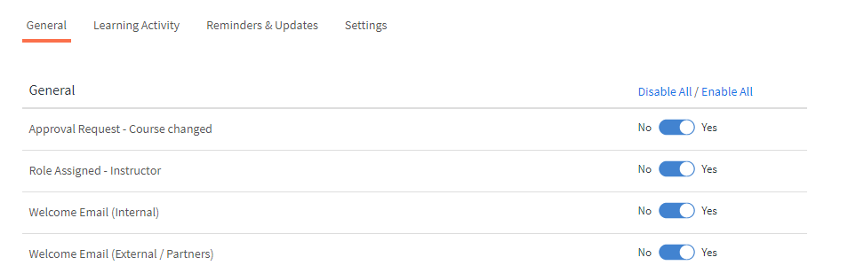
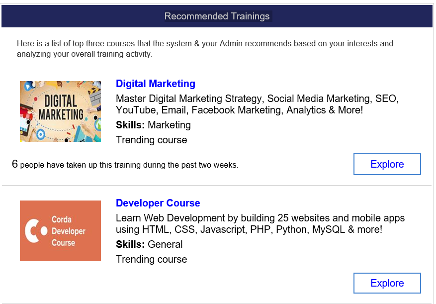

# E-Mail-Vorlagen

Die Ereignisse in Ihrer Schulungsaktivität lösen E-Mails aus, die an Teilnehmer gesendet werden. Sie als Administrator können diese E-Mail-Vorlagen einfach aktivieren, deaktivieren oder ändern.

Learning Manager verschickt E-Mail-Benachrichtigungen ereignisgesteuert an mehrere Benutzerrollen.

Als Administrator können Sie E-Mail-Vorlagen anpassen, indem Sie Inhalte hinzufügen oder ändern und Benachrichtigungen für verschiedene Ereignisse, die von Teilnehmern, Managern und Autoren ausgelöst wurden, an Benutzer senden.

Die Administratoren können auch festlegen, dass bei bestimmten Ereignissen keine E-Mail-Benachrichtigungen gesendet werden.

## Einführung in E-Mail-Vorlagen

In dieser Schulung erfahren Sie, wie Sie einzelne E-Mail-Vorlagen anpassen und Einstellungen auf Kurs- und Kontoebene für E-Mail-Vorlagen anpassen.

<!--In this training, you will learn how to create a user group by names, email IDs, and combining multiple auto-generated user groups.-->

Wenn Sie die Schulung nicht starten können, schreiben Sie an <almacademy@adobe.com>.

## Konfigurieren Sie E-Mail-Vorlagen {#configureemailtemplates}

Sie als Administrator können diese E-Mail-Vorlagen einfach aktivieren, deaktivieren oder ändern.

1. Um auf die Vorlagen zuzugreifen, klicken Sie auf **[!UICONTROL E-Mail-Vorlagen]** im linken Bereich. Auf dieser Seite werden drei verschiedene Kategorien von Vorlagen angezeigt: **[!UICONTROL Allgemein]**, **[!UICONTROL Lernaktivität]** und **[!UICONTROL Erinnerungen und Updates]**. Es gibt eine vierte Registerkarte, **[!UICONTROL Einstellungen]**, auf der Sie die Vorlagen konfigurieren können.

   

   *Registerkarte &quot;Allgemein&quot; auswählen*

1. Klicken Sie auf eine beliebige Registerkarte, um die Liste der E-Mail-Vorlagen anzuzeigen.

   

   *Liste der E-Mail-Vorlagen anzeigen*

   Sie können diese E-Mail-Benachrichtigungen einfach aktivieren oder deaktivieren, indem Sie auf die Umschaltfläche klicken.

1. Um den Inhalt der Vorlage zu ändern, klicken Sie auf den Vorlagennamen. Hier sehen Sie, dass Sie für verschiedene Benutzertypen unterschiedliche Vorlagen haben.

   

   *Vorlage einer E-Mail anzeigen*

1. Klicken Sie auf den Text der E-Mail, um den Inhalt dieser E-Mail-Vorlage zu ändern. Nehmen Sie nun die Änderungen an der Vorlage vor. Sie können den Text ändern und eine dieser Variablen in Ihrer E-Mail verwenden. Die am Textabschnitt vorgenommenen Änderungen können nur auf diese E-Mail-Vorlage angewendet werden. Wenn Sie jedoch Änderungen an der Signatur dieser E-Mail vornehmen, kann diese global auf alle Vorlagen angewendet werden.

   Um die Namen der Symbole anzuzeigen, zeigen Sie mit der Maus darauf.

   

   *E-Mail-Vorlage ändern*

   Sie können durch Klicken auf den Link **[!UICONTROL Zurück zum Original]** über der Vorlage, den Hauptteil der Nachricht auf den Standardtext zurückgesetzt.

1. Klicken Sie auf „Speichern“, um die an dieser Vorlage vorgenommenen Änderungen zu bestätigen. Jetzt können Benutzer mithilfe der geänderten E-Mail-Vorlage E-Mail-Benachrichtigungen erhalten.

## Einstellungen einer E-Mail-Vorlage anpassen {#customizesettingsofanemailtemplate}

1. Um die Seite „Einstellungen“ zu öffnen, klicken Sie auf **[!UICONTROL Einstellungen]**. Sie können jetzt Ihre E-Mail-Vorlagen Ihren Erfordernissen anpassen.
1. Um den Namen und die E-Mail-ID anzupassen, von denen die Teilnehmer E-Mails erhalten, bearbeiten Sie **[!UICONTROL Name und Adresse des Absenders].**

   Wenden Sie sich an den [***Adobe-Support***](https://helpx.adobe.com/contact/enterprise-support.other.html#learning-manager), um diese Informationen zu konfigurieren oder zu ändern.

1. Passen Sie Ihr E-Mail-Banner von der Option **[!UICONTROL E-Mail-Banner]** an. Ändern Sie die Farbe des Banners, indem Sie **[!UICONTROL Bannerhintergrund]** auswählen.

   Sie können ein benutzerdefiniertes Bild als Banner verwenden, indem Sie die Option **[!UICONTROL Benutzerdefiniertes Bild]** auswählen. Nach Abschluss der Änderungen klicken Sie auf **[!UICONTROL Speichern]**.

    

   *Bild eines Banners anpassen*

   Die benutzerdefinierte Bildgröße muss 1240x200px sein und .jpg, .jpeg und.png unterstützen.

1. Bearbeiten Sie Ihre E-Mail-Signatur, indem Sie auf **[!UICONTROL Bearbeiten]** klicken. Nehmen Sie die erforderlichen Änderungen vor, und speichern Sie die Änderung.

   

   *E-Mail-Signatur anpassen*

1. Bearbeiten Sie Ihre Konto-URL, indem Sie bei der Option **[!UICONTROL Konto-URL]** auf &quot;Bearbeiten&quot; klicken.

   Der Konto URL-Link wird in allen E-Mails unmittelbar vor der Signatur angezeigt. Geben Sie die gewünschte URL ein und klicken Sie auf **[!UICONTROL Speichern]**. Beachten Sie, dass diese URL für interne Benutzer sichtbar ist.

   

   *Konto-URL anpassen*

1. Konfigurieren Sie, ob Manager ebenfalls E-Mails erhalten sollen, die an die ihnen direkt unterstellten Mitarbeiter gesendet werden. Aktivieren Sie dazu das Kontrollkästchen unter der Option **[!UICONTROL Optionale Manager-E-Mail]**.

## E-Mail auf Rollenebene aktivieren oder deaktivieren

Der Administrator kann E-Mail-Vorlagen basierend auf der Rolle des Empfängers aktivieren oder deaktivieren, z. B. Teilnehmer, Manager oder Kursleiter. Dadurch haben Administratoren mehr Kontrolle darüber, welche Benachrichtigungen gesendet werden, und können Art und Häufigkeit der Kommunikation besser verwalten.

E-Mail-Vorlagen aktivieren oder deaktivieren:

1. Melden Sie sich bei Adobe Learning Manager als Administrator an.
2. Wählen Sie im linken Bereich **[!UICONTROL E-Mail-Vorlagen]** aus.
3. Um mehrere E-Mail-Vorlagen für eine bestimmte Rolle zu aktivieren oder zu deaktivieren, wählen Sie die Auslassungspunkte (...) in der Spaltenüberschrift aus und aktivieren Sie alle entsprechenden Rollen in **[!UICONTROL E-Mail-Empfänger]**.

   
   _Alle E-Mail-Vorlagen auf Rollenebene senden_

4. Um eine bestimmte E-Mail-Vorlage für eine Rolle zu aktivieren oder zu deaktivieren, wählen Sie die Auslassungspunkte (...) für diese Vorlage aus und wählen Sie eine Rolle aus bzw. heben Sie ihre Auswahl auf.

   
   _E-Mail-Vorlage auf Rollenebene senden_

## Häufigkeit von Auswahl-E-Mails festlegen {#setfrequencyofdigestemails}

Auf der Seite **[!UICONTROL E-Mail-Vorlagen]** > **[!UICONTROL Einstellungen]** kann der Administrator die Häufigkeit ändern, mit der Auswahl-E-Mails an Teilnehmer gesendet werden.

Klicken Sie im Abschnitt **[!UICONTROL Einstellungen für Auswahl-E-Mail]** auf **[!UICONTROL Bearbeiten]**.

Wählen Sie in der Dropdown-Liste entweder **[!UICONTROL Vierzehntägig]** oder **[!UICONTROL Monatlich]**.

* **[!UICONTROL Vierzehntägig]:** Wenn Sie die Häufigkeit auf **[!UICONTROL Vierzehntägig]** festlegen, erhalten die Teilnehmer die E-Mail einmal alle zwei Wochen.

* **[!UICONTROL Monatlich]:** Wenn Sie die Häufigkeit auf **[!UICONTROL Monatlich]** festlegen, erhalten die Teilnehmer die E-Mail einmal im Monat.

*Häufigkeit von Auswahl-E-Mails festlegen*

Wenn Sie diese Option aktivieren, wird die Häufigkeit für vorhandene/neue aktive Konten standardmäßig auf **[!UICONTROL Vierzehntägig]** festgelegt.

### DND-Liste der Teilnehmer

In einer DND-Liste enthaltene Teilnehmer können die Benutzereinstellungen für Auswahl-E-Mails nicht sehen. Die Option bleibt deaktiviert und die Teilnehmer erhalten keine E-Mails.

## Beispiel für eine an Teilnehmer gesendete Auswahl-E-Mail {#digest-email}

Die folgenden Beispiele zeigen die E-Mail, die ein Teilnehmer erhält.

*Beispiel-E-Mail*

### Schulungsaktivität

*E-Mail der Schulungsaktivität*

### Empfohlene Schulungen

*E-Mail der empfohlenen Schulung*

### Leaderboard

*E-Mail des Leaderboards*

### Aktuelle Beiträge

*E-Mail der neuesten Beiträge*

### E-Mail-Zugriffsbericht herunterladen

Sie können den E-Mail-Zugriffsbericht herunterladen, indem Sie auf die Schaltfläche **[!UICONTROL Herunterladen]** klicken. Dieser Bericht enthält die Anzahl der Benutzer, die die E-Mail erhalten haben, sowie die Anzahl der Benutzer, die die Links geöffnet und darauf geklickt haben.

## E-Mail-Domäne anpassen {#customizeemaildomain}

Um die E-Mail-Domäne und die E-Mail-ID anzupassen, von denen die Teilnehmer Benachrichtigungen erhalten, wenden Sie sich an den [***Learning Manager-Support***](https://helpx.adobe.com/contact/enterprise-support.other.html#learning-manager), und stellen Sie die Details der Domäne, die Sie hinzufügen möchten, und Ihre neue E-Mail-ID bereit.

Ihre Anforderung wird bearbeitet und eine E-Mail mit Bestätigungs-Link wird an Sie unter der neuen E-Mail-Adresse gesendet. Klicken Sie auf den Bestätigungslink in der E-Mail, um den Überprüfungsprozess zu bestätigen und abzuschließen.

## Konfigurieren Sie E-Mail nicht stören {#dnd}

Als Administrator können Sie auswählen, wer E-Mails von Learning Manager erhält und wer nicht.

Sie können dies mithilfe der Option **[!UICONTROL Bitte nicht stören]** auf der Registerkarte **[!UICONTROL Einstellungen]** ausführen. Benutzer können dieser Liste mit ihrem Namen, ihrer E-Mail-ID oder ihrer eindeutigen Benutzer-ID hinzugefügt werden.

Suchen Sie nach einem Benutzer, der der Liste hinzugefügt werden soll.

<!---->

## Blockierte E-Mails {#blockedemails}

Wählen Sie in der Dropdownliste **Blockierte E-Mails** für jeden Benutzer die E-Mail-Typen aus, die für ihn blockiert werden sollen.

<!---->

Die folgenden Optionen sind verfügbar:

* **Direkte E-Mails an Teilnehmer:** Diese Option beschränkt oder erlaubt das Senden von E-Mails an den Teilnehmer.
* **Eskalation von E-Mails an Manager des Teilnehmers**: Diese Option beschränkt oder erlaubt das Senden von E-Mails an den Lerner-Manager.
* **Über direkte Berichte**: Diese Option beschränkt oder erlaubt eingehende Eskalations-E-Mails, die an die Benutzer über ihre direkten Berichte gesendet werden.
* **Über Berichte zum Überspringen eines Levels**: Diese Option beschränkt oder erlaubt eingehende Eskalations-E-Mails, die an die Benutzer über ihre Berichte der zweiten Ebene gesendet werden.

Wenn Sie einen Benutzer aus der Liste löschen möchten, können Sie die Löschoption verwenden, die auf der Registerkarte Benutzer für jeden Benutzer einzeln verfügbar ist.

Sie können Benutzer mithilfe von CSV-Dateien der Liste „Bitte nicht stören“ hinzufügen. Geben Sie für jede der folgenden Spalten den Wert &quot;true&quot;, &quot;false&quot; oder &quot;blank&quot; an:

* Direkte E-Mails blockieren
* Benutzer-Eskalationen blockieren
* Eingehende direkte Eskalationen blockieren
* Eingehende Eskalationen der übernächsten Stufe blockieren

Geben Sie im Wertefeld &quot;true&quot; ein, um zu verhindern, dass Benutzer E-Mails für die ausgewählte Option erhalten. Wenn Sie den Wert „false“ eingeben, wird eine bestehende Blockierung für den Benutzer aufgehoben. Wenn Sie die Spalte leer lassen, bleibt die bisherige Auswahl unverändert.

## Flexibilität bei der Anpassung der Vorlagen

E-Mail-Vorlagen im Learning Manager enthalten jetzt vollständig bearbeitbare Abschnitte, was eine größere Flexibilität bei der Anpassung der E-Mail-Kommunikation basierend auf Messaging- und Branding-Präferenzen bietet.

Die wichtigsten Verbesserungen beim Anpassen von E-Mail-Vorlagen sind:

### E-Mail-Anrede auf Kontoebene anpassen

Wählen Sie **[!UICONTROL E-Mail-Vorlagen]** > **[!UICONTROL Einstellungen]**. Wählen Sie **[!UICONTROL Bearbeiten]** im Abschnitt **[!UICONTROL E-Mail-Anrede]** aus.

*E-Mail-Anrede anpassen*

Sie können außerdem Folgendes anpassen:

* E-Mail-Banner und E-Mail-Signatur auf Kursebene und Instanzebene
* E-Mail-Fußzeile bearbeiten Der Fußzeilenbereich enthält vordefinierte Variablen für die Konto-URL, die Signatur und beliebigen freien Text, den der Benutzer hinzufügt.

Die Vorlagen unterstützen auch erweiterte Bearbeitungsfunktionen, etwa dass die Formatierung erhalten bleibt, wenn Inhalte kopiert und in Microsoft Word eingefügt werden.

## Inline-Einladungen {#inlineinvitations}

Learning Manager-Benutzer erhalten jetzt Inline-E-Mail-Einladungen. ICS-Anhänge werden nicht mehr zum Senden von Einladungen verwendet. Alle Änderungen in der Einladung werden automatisch in Ihrem Kalender widergespiegelt.

<!---->

## Häufig gestellte Fragen {#frequentlyaskedquestions}

+++Wie deaktiviere ich die Hilfe in E-Mail-Vorlagen?

Derzeit ist es in Learning Manager nicht möglich, **Hilfe** in E-Mail-Vorlagen zu deaktivieren.

+++

+++Wie ändere ich E-Mail-Vorlagen?

1. Melden Sie sich bei Ihrem Learning Manager-Konto als Administrator an.
1. Auf der linken Seite, klicken Sie auf **[!UICONTROL E-Mail-Vorlagen]** und wählen die E-Mail-Vorlage, die Sie ändern möchten.
1. Klicken Sie zum Anpassen der einzelnen Vorlagen auf den Text im Hauptteil der Vorlage. Sie können in den Text Variablen einfügen, indem Sie auf die entsprechenden Symbole klicken (siehe Abbildung). Bewegen Sie den Mauszeiger über jedes Symbol, um die Namen anzuzeigen und auf die Vorlage anzuwenden.
1. Nachdem Sie Änderungen an der Vorlage vorgenommen haben, klicken Sie auf **[!UICONTROL Speichern]**.

+++

+++Wie erstelle ich eigene E-Mail-Vorlagen?

Derzeit ist es nicht möglich, benutzerdefinierte E-Mail-Vorlagen zu erstellen. Sie können jedoch vorhandene Vorlagen bearbeiten und ändern.

+++

+++Wie deaktiviere ich die E-Mail-Vorlagen?

Um die E-Mail-Vorlage zu deaktivieren, wählen Sie die Vorlage aus, die deaktiviert werden soll, und klicken Sie auf die kreisförmige Umschalttaste Ja/Nein.

+++

+++Wie ändere ich den Absendernamen und die Absenderadresse in der Vorlage?

Wenden Sie sich an den [Adobe Learning Manager-Support](https://helpx.adobe.com/contact/enterprise-support.other.html#learning-manager), um den Absendernamen und die E-Mail-Adresse zu ändern.

+++
