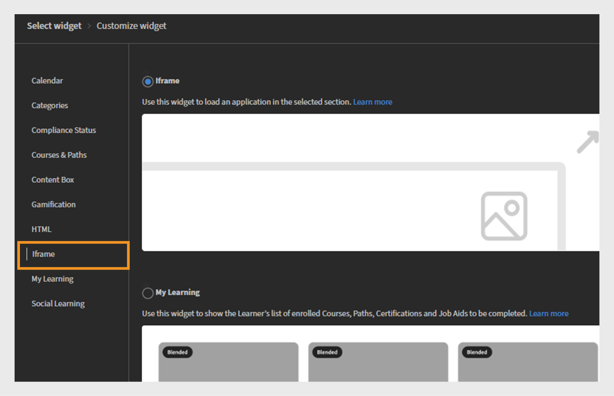

# Widgets hinzufügen und konfigurieren

## Kalender-Widget

Das Kalender-Widget zeigt Ihre geplanten Sitzungen und Schulungen an. Sie können den Kalender durchsuchen, um die für die nächsten Monate geplanten Schulungen anzuzeigen. Es ermöglicht die Anzeige von Schulungssitzungen nach Monat mit der Möglichkeit, nach links oder rechts zu scrollen.

Das Kalender-Widget kann von einem Administrator zu einer Seite hinzugefügt werden, um Schulungszeitpläne anzuzeigen. Die Teilnehmer können mit dem Kalender interagieren, indem sie durch die Monate scrollen, um die bevorstehenden Sitzungen anzuzeigen. Sie können Sitzungen filtern, um schnell relevante Schulungen zu finden.

### Kalender-Widget hinzufügen

In einem Finanzunternehmen mit separaten Teams für Vertrieb und Customer Success Manager (CSM) können Administratoren dieses Widget verwenden, um teamspezifische Schulungssitzungen hervorzuheben. Beispiel:

* Das Vertriebsteam kann anstehende Sitzungen zu Produkt-Updates, Compliance-Schulungen und Pitch-Workshops sehen.
* Das CSM-Team kann Onboarding-Workshops, Schulungen zur Kundenkommunikation und Service Excellence-Programme anzeigen.

So konfigurieren Sie das Kalender-Widget:

1. Melden Sie sich bei Adobe Learning Manager als Administrator an.
2. Wählen Sie im linken Navigationsbereich **[!UICONTROL Branding]** aus.
3. Wählen Sie **[!UICONTROL Benutzerdefinierte Seiten]** aus.
4. Wählen Sie die gewünschte Seite aus, und wählen Sie dann **[!UICONTROL Seitendesign]**.
5. Wählen Sie **[!UICONTROL Bearbeiten]** und anschließend das Layout aus.
6. Wählen Sie **[!UICONTROL Widget hinzufügen]**.
7. Wählen Sie **[!UICONTROL Kalender]** aus, und wählen Sie dann **[!UICONTROL Weiter]**.

   
   _Bildschirm zur Widget-Auswahl, in dem die Kalenderwidget-Option hervorgehoben wird, um Schulungssitzungen in einem Kalender anzuzeigen_

8. Geben Sie einen **[!UICONTROL Widget-Titel]** und eine **[!UICONTROL Widget-Beschreibung]** ein.

   
   _Bildschirm zur Anpassung des Kalender-Widgets, auf dem Administratoren den Widget-Titel, die Beschreibung und die Kataloge festlegen können_

9. Wählen Sie einen Katalog aus, indem Sie nach seinen Kursen und Lernpfaden innerhalb des **[!UICONTROL Kalender]**-Widgets suchen.
10. Wählen Sie **[!UICONTROL Widget hinzufügen]**.

Das Kalender-Widget wird der Seite hinzugefügt. Der Administrator kann andere Widgets hinzufügen und die Seite veröffentlichen.

>[!NOTE]
>
>Wenn keine Kataloge ausgewählt sind, werden Sitzungen aus allen Katalogen angezeigt.

## Kategorienwidget

Das Widget &quot;Kategorien&quot; zeigt nach Katalogen, Produkten oder Rollen organisierte Lerninhalte als Kategorien an. Sie hilft Teilnehmern dabei, Schulungen leicht zu durchsuchen und nach Themen, Abteilungen, Kenntnissen oder anderen relevanten Klassifizierungen gruppiert zu finden.

Administratoren fügen das Widget &quot;Kategorien&quot; zu einer Seite hinzu, um kategorisierte Lernoptionen anzuzeigen. Die Teilnehmer verwenden das Widget, um Schulungen zu erkunden, indem sie eine Interessenkategorie auswählen, die dann verwandte Kurse oder Pfade anzeigt.

Lesen Sie [Kataloge](/help/migrated/administrators/feature-summary/catalogs.md) und [Recommendations](/help/migrated/recommendations-adobe-learning-manager.md) Artikel, um mehr über das Konfigurieren von Katalogen und Empfehlungen zu erfahren.

<b>Hinweis</b>: Wenn &quot;Katalog&quot; im Widget &quot;Kategorien&quot; ausgewählt ist, wird die Liste standardmäßig nach Erstellungsdatum sortiert. Zuletzt erstellte Kataloge werden zuerst angezeigt.

### Kategorie-Widget hinzufügen

In einem Finanzdienstleistungsunternehmen benötigen verschiedene Teams häufig Zugriff auf rollenspezifische Schulungen. Das Widget &quot;Kategorien&quot; hilft dabei, Lerninhalte in übersichtlichen, anklickbaren Kacheln zu organisieren, sodass Vertriebs- und CSM-Teams die benötigten Informationen schnell finden können.

So konfigurieren Sie das Kategorien-Widget:

1. Melden Sie sich bei Adobe Learning Manager als Administrator an.
2. Wählen Sie im linken Navigationsbereich **[!UICONTROL Branding]** aus.
3. Wählen Sie **[!UICONTROL Benutzerdefinierte Seiten]** aus.
4. Wählen Sie die gewünschte Seite aus, und wählen Sie dann **[!UICONTROL Seitendesign]**.
5. Wählen Sie **[!UICONTROL Bearbeiten]** und anschließend das Layout aus.
6. Wählen Sie **[!UICONTROL Widget hinzufügen]**.
7. Wählen Sie **[!UICONTROL Kategorien]** aus, und wählen Sie dann **[!UICONTROL Weiter]** aus.

   
   _Bildschirm zur Widget-Auswahl, in dem die Widget-Option für Kategorien hervorgehoben wird, um Lerninhalte nach Katalog, Produkt oder Rolle für eine einfache Navigation zu organisieren_

8. Wählen Sie die auf den Kategoriekarten anzuzeigenden Details aus:

   * **[!UICONTROL Kategoriebild]**
   * **[!UICONTROL Beschreibung der Kategorie]**

9. Geben Sie einen **[!UICONTROL Widget-Titel]** und eine **[!UICONTROL Widget-Beschreibung]** ein.
10. Suchen Sie nach einem Katalog und wählen Sie ihn aus der **[!UICONTROL Kategoriequelle]** aus.

    
    _Konfigurieren Sie Widget-Optionen für Kategorien, um Widget-Titel und -Beschreibung festzulegen, und wählen Sie die Kategoriequelle aus_

11. Wählen Sie **[!UICONTROL Widget hinzufügen]**.

Das Widget &quot;Kategorien&quot; wird der Seite hinzugefügt. Administratoren können andere Widgets hinzufügen und die Seite veröffentlichen.

## Kompatibilitäts-Widget

Das Widget &quot;Konformitätsstatus&quot; zeigt den Fortschritt eines Teilnehmers bei der Erfüllung von Compliance- oder Zertifizierungsanforderungen an. Hier wird der Status der dem Benutzer zugewiesenen obligatorischen Schulung angezeigt, einschließlich abgeschlossener, ausstehender oder überfälliger Kurse.

Administratoren fügen das Widget &quot;Konformitätsstatus&quot; zu Seiten hinzu, um Einblick in den Fortschritt der Compliance-Schulung zu geben. Die Teilnehmer verwenden sie, um schnell zu überprüfen, welche obligatorischen Kurse sie abgeschlossen haben und welche noch Aufmerksamkeit erfordern.

### Hinzufügen eines Widgets für den Konformitätsstatus

Bei einem Finanzdienstleistungsunternehmen müssen sowohl das Vertriebsteam als auch das Team des Customer Success Manager (CSM) die Compliance-Schulung pünktlich abschließen. Das Widget &quot;Konformitätsstatus&quot; erleichtert es Teilnehmern, anstehende Fristen und ihren Schulungsfortschritt direkt über ihre teamspezifischen Seiten zu verfolgen.

Konfigurieren des Kompatibilitäts-Widgets

1. Melden Sie sich bei Adobe Learning Manager als Administrator an.
2. Wählen Sie im linken Navigationsbereich **[!UICONTROL Branding]** aus.
3. Wählen Sie **[!UICONTROL Benutzerdefinierte Seiten]** aus.
4. Wählen Sie die gewünschte Seite aus, und wählen Sie dann **[!UICONTROL Seitendesign]**.
5. Wählen Sie **[!UICONTROL Bearbeiten]** und anschließend das Layout aus.
6. Wählen Sie **[!UICONTROL Widget hinzufügen]**.
7. Wählen Sie **[!UICONTROL Kompatibilitätsstatus]** aus, und wählen Sie dann **[!UICONTROL Weiter]**.

   
   _Bildschirm zur Widgetauswahl, auf dem das Widget &quot;Konformitätsstatus&quot; hervorgehoben wird, das verwendet wurde, um Teilnehmerregistrierungen mit Fristen und Statusanzeigen anzuzeigen_

8. Geben Sie einen **[!UICONTROL Widget-Titel]** und eine **[!UICONTROL Widget-Beschreibung]** ein.

   
   _Bildschirm für das Widget &quot;Konformitätsstatus&quot;, auf dem Administratoren den Widget-Titel und die Beschreibung festlegen können, um Registrierungsfristen und den Status für Teilnehmer anzuzeigen_

9. Wählen Sie **[!UICONTROL Widget hinzufügen]**.

Das Widget &quot;Konformitätsstatus&quot; wird der Seite hinzugefügt. Administratoren können andere Widgets hinzufügen und die Seite veröffentlichen.

## Kurs- und Pfad-Widget

Das Widget &quot;Kurse und Pfade&quot; zeigt empfohlene Kurse und Lernpfade an, die auf die Rolle, die Interessen oder den Schulungsbedarf des Teilnehmers zugeschnitten sind.

Administratoren fügen das Widget &quot;Kurse und Pfade&quot; Seiten hinzu, um wichtige Lerninhalte für bestimmte Zielgruppen hervorzuheben. Teilnehmer verwenden das Widget, um empfohlene Kurse oder Pfade zu durchsuchen, und können sich direkt für die Kurse registrieren.

### Widget &quot;Kurse und Pfade&quot; hinzufügen

Ein Finanzunternehmen möchte rollenspezifische Schulungsseiten für seine beiden Teams erstellen: Vertriebs- und Customer Success Manager (CSM). Das Widget &quot;Kurse und Pfade&quot; kann verwendet werden, um die relevantesten Lernprogramme für jedes Team anzuzeigen.

So konfigurieren Sie das Widget &quot;Kurse und Pfade&quot;:

1. Melden Sie sich bei Adobe Learning Manager als Administrator an.
2. Wählen Sie im linken Navigationsbereich **[!UICONTROL Branding]** aus.
3. Wählen Sie **[!UICONTROL Benutzerdefinierte Seiten]** aus.
4. Wählen Sie die gewünschte Seite aus, und wählen Sie dann **[!UICONTROL Seitendesign]**.
5. Wählen Sie **[!UICONTROL Bearbeiten]** und anschließend das Layout aus.
6. Wählen Sie **[!UICONTROL Widget hinzufügen]**.
7. Wählen Sie **[!UICONTROL Kurse und Pfade]** aus.

   
   _Bildschirm zur Widgetauswahl, auf dem das Widget &quot;Kurse und Pfade&quot; für die Anzeige von Kursen, Lernpfaden, Zertifizierungen und Arbeitshilfen als interaktive Karten für Teilnehmer hervorgehoben wird_

8. **[!UICONTROL Fortfahren]** auswählen.
9. Geben Sie **[!UICONTROL Widget title]** und **[!UICONTROL Widget description]** ein.
10. Wählen Sie die Kataloge aus oder wählen Sie bis zu 25 anzuzeigende Kurse manuell aus.

_Widget &quot;Kurse und Pfade&quot;, in dem Administratoren den Titel und die Beschreibung des Widgets festlegen und Kurse oder Lernpfade auswählen, die als interaktive Karten angezeigt werden sollen_
&#x200B;11. Wählen Sie **[!UICONTROL Widget hinzufügen]**.

Das Widget &quot;Kurse und Pfade&quot; wird der Seite hinzugefügt. Administratoren können andere Widgets hinzufügen und die Seite veröffentlichen.

## Inhaltsbox-Widget

Mit dem Widget &quot;Inhaltsfeld&quot; können Administratoren angepassten Inhalt wie Text, Bilder, Ankündigungen oder Links zu einer Seite hinzufügen. Es bietet einen flexiblen Raum für den Austausch wichtiger Informationen, Tipps, Updates oder Werbebotschaften direkt in der Lernumgebung.

### Hinzufügen eines Inhaltsfeld-Widgets

Ein Finanzunternehmen möchte rollenspezifische Schulungsseiten für seine beiden Teams erstellen: Vertriebs- und Customer Success Manager (CSM). Das Widget &quot;Inhaltsfeld&quot; kann verwendet werden, um benutzerdefinierte Abschnitte mit Titeln, Beschreibungen, Bildern und Call-to-Action-Schaltflächen hinzuzufügen, die zielgerichtete Ressourcen, Updates und Motivationsmeldungen freigeben.

So konfigurieren Sie das Inhaltsfeld-Widget:

1. Melden Sie sich bei Adobe Learning Manager als Administrator an.
2. Wählen Sie im linken Navigationsbereich **[!UICONTROL Branding]** aus.
3. Wählen Sie **[!UICONTROL Benutzerdefinierte Seiten]** aus.
4. Wählen Sie die gewünschte Seite aus, und wählen Sie dann **[!UICONTROL Seitendesign]**.
5. Wählen Sie **[!UICONTROL Bearbeiten]** und anschließend das Layout aus.
6. Wählen Sie **[!UICONTROL Widget hinzufügen]**.
7. Wählen Sie **[!UICONTROL Inhaltsfeld]** aus, und wählen Sie dann **[!UICONTROL Weiter]** aus.

   
   _Bildschirm zur Widgetauswahl, auf dem das Inhaltsfeld-Widget zur Anzeige benutzerdefinierter Bilder, Texte und Aktionsschaltflächen hervorgehoben wird, um die Interaktion der Teilnehmer zu verbessern_

8. Geben Sie **[!UICONTROL Titel]** und **[!UICONTROL Beschreibung]** ein.
9. Geben Sie den Text in die **[!UICONTROL Aktionsschaltflächenbezeichnung]** ein und geben Sie einen Link an.
10. Wählen Sie eine der Optionen für die Hintergrundfüllung aus:

    * **[!UICONTROL Farbe]**: Wählen Sie die Farbe im Farbwähler aus, oder geben Sie den Farbcode in das Textfeld ein.
    * **[!UICONTROL Image]**: Durchsuchen Sie ein Bild und laden Sie es hoch.

11. Passen Sie die Höhe des Felds mithilfe der Option **[!UICONTROL Höhe des Inhaltsfelds]** an.
12. Wählen Sie die Textformatierungsoptionen aus.

    
    _Anpassungsbildschirm für das Inhaltsfeld-Widget, auf dem Administratoren einen Titel, eine Beschreibung, eine Aktionsschaltflächenbezeichnung und einen Link eingeben können_

13. Wählen Sie **[!UICONTROL Widgets hinzufügen]**.

Das Inhaltsfeld-Widget wird der Seite hinzugefügt. Administratoren können andere Widgets hinzufügen und die Seite veröffentlichen.

## Gamification-Widget

Administratoren fügen das Gamification-Widget zu benutzerdefinierten Seiten hinzu, um die Leistungen der Teilnehmer anzuzeigen, z. B. erworbene Abzeichen, gesammelte Punkte und Ranglisten für die Rangliste. Die Teilnehmer können ihren Fortschritt verfolgen und die Ergebnisse mit Gleich gesinnten vergleichen, was Motivation und nachhaltige Teilnahme fördert.

### Gamification-Widget hinzufügen

Ein Finanzunternehmen möchte das Engagement und die Motivation der Teilnehmer in seinen beiden großen Teams fördern: Vertriebs- und Customer Success Manager (CSM). Das Gamification-Widget kann verwendet werden, um Teilnehmer mit Punkten, Abzeichen und Ranglisten für den Abschluss von Schulungen und die aktive Teilnahme zu belohnen.

Für das Vertriebsteam könnte sich Gamification auf die Belohnung von Erfolgen in Bezug auf Verkaufsfähigkeiten, Produktkenntnisse und Schulung zur Kundeninteraktion konzentrieren. Im CSM-Team kann der Schwerpunkt auf Kundendienstzertifizierungen, Compliance-Schulungen und Client-Management-Kenntnissen liegen.

Konfigurieren des Gamification-Widgets:

1. Melden Sie sich bei Adobe Learning Manager als Administrator an.
2. Wählen Sie im linken Navigationsbereich **[!UICONTROL Branding]** aus.
3. Wählen Sie **[!UICONTROL Benutzerdefinierte Seiten]** aus.
4. Wählen Sie die gewünschte Seite aus, und wählen Sie dann **[!UICONTROL Seitendesign]**.
5. Wählen Sie **[!UICONTROL Bearbeiten]** und anschließend das Layout aus.
6. Wählen Sie **[!UICONTROL Widget hinzufügen]**.
7. Wählen Sie **[!UICONTROL Gamification]** und anschließend **[!UICONTROL Fortfahren]**.

   
   _Auswahlbildschirm für Widgets, in dem das Gamification-Widget hervorgehoben wird, das zum Anzeigen von Lernaktivitäten und -leistungen auf der Rangliste verwendet wurde_

8. Geben Sie den **[!UICONTROL Widget-Titel]** und die **[!UICONTROL Widget-Beschreibung]** ein.
9. Wählen Sie **[!UICONTROL Widgets hinzufügen]**.

Das Gamification-Widget wird der Seite hinzugefügt. Administratoren können andere Widgets hinzufügen und die Seite veröffentlichen.

## HTML-Widget

Mit dem HTML-Widget können Administratoren benutzerdefinierten HTML-Code direkt in eine Seite einbetten. Dies bietet Flexibilität, um maßgeschneiderte Inhalte hinzuzufügen, Tools von Drittanbietern zu integrieren oder interaktive Elemente einzubeziehen, die über die Standard-Widget-Funktionen hinausgehen. Es unterstützt umfassende Anpassungsmöglichkeiten durch HTML, CSS und sogar JavaScript und ermöglicht so einzigartige Designs und externe Integrationen innerhalb der Lernplattform.

### Hinzufügen eines HTML-Widgets

Ein Finanzunternehmen möchte maßgeschneiderte, interaktive Inhalte anbieten, die auf seine beiden Hauptteams - Sales und Customer Success Manager (CSM) - zugeschnitten sind. Das HTML-Widget kann verwendet werden, um benutzerdefinierte HTML-basierte Ressourcen wie Finanz-Dashboards, Datenvisualisierungen, interaktive Formulare oder Marktanalysetools direkt in ihre Schulungs- oder Teamseiten einzubetten.

HTML-Widget konfigurieren:

1. Melden Sie sich bei Adobe Learning Manager als Administrator an.
2. Wählen Sie im linken Navigationsbereich **[!UICONTROL Branding]** aus.
3. Wählen Sie **[!UICONTROL Benutzerdefinierte Seiten]** aus.
4. Wählen Sie die gewünschte Seite aus, und wählen Sie dann **[!UICONTROL Seitendesign]**.
5. Wählen Sie **[!UICONTROL Bearbeiten]** und anschließend das Layout aus.
6. Wählen Sie **[!UICONTROL Widget hinzufügen]**.
7. Wählen Sie **[!UICONTROL HTML]** und anschließend **[!UICONTROL Fortfahren]**.

   
   _Bildschirm zur Widget-Auswahl, in dem das HTML-Widget zur Anpassung von Seiten mithilfe von HTML-, CSS- und JavaScript-Code hervorgehoben wird_

8. Geben Sie den **[!UICONTROL HTML]**-, **[!UICONTROL CSS]**- und **[!UICONTROL JavaScript]**-Code in die entsprechenden Felder ein.
9. Wählen Sie **[!UICONTROL Widget hinzufügen]**.

Das HTML-Widget wird der Seite hinzugefügt. Administratoren können andere Widgets hinzufügen und die Seite veröffentlichen.

## IFrame-Widget

Das IFrame-Widget zeigt den Inhalt einer externen URL direkt auf einer Seite der Lernplattform an. Es bettet eine externe Website, ein externes Tool oder eine externe Anwendung in einen Rahmen ein, sodass Teilnehmer diese Inhalte anzeigen und damit interagieren können, ohne das LMS zu verlassen.

### Hinzufügen eines IFrame-Widgets

Ein Finanzunternehmen möchte externe Tools und Ressourcen nahtlos in seine internen Schulungs- und Collaboration-Seiten für seine Vertriebs- und Customer Success Manager (CSM)-Teams einbetten. Das Iframe-Widget kann verwendet werden, um Finanz-Dashboards von Drittanbietern, Marktanalyseplattformen oder Client-Management-Portale direkt in der LMS-Oberfläche anzuzeigen.

So konfigurieren Sie das Iframe-Widget:

1. Melden Sie sich bei Adobe Learning Manager als Administrator an.
2. Wählen Sie im linken Navigationsbereich **[!UICONTROL Branding]** aus.
3. Wählen Sie **[!UICONTROL Benutzerdefinierte Seiten]** aus.
4. Wählen Sie die gewünschte Seite aus, und wählen Sie dann **[!UICONTROL Seitendesign]**.
5. Wählen Sie **[!UICONTROL Bearbeiten]** und anschließend das Layout aus.
6. Wählen Sie **[!UICONTROL Widget hinzufügen]**.
7. Wählen Sie **[!UICONTROL Iframe]** aus, und wählen Sie dann **[!UICONTROL Weiter]** aus.

   
   _Bildschirm zur Widget-Auswahl, in dem das Iframe-Widget zum Einbetten von externen Anwendungen oder Webseiten in einen ausgewählten Abschnitt hervorgehoben wird_

8. Geben Sie die URL in die Option **[!UICONTROL Seite, die mit der Aktionsschaltfläche]** verknüpft ist, ein.
9. Passen Sie die Framehöhe mithilfe der Option **[!UICONTROL Framehöhe]** an.

   
   _Bildschirm zur Anpassung des IFrame-Widgets, auf dem Administratoren eine Seiten-URL eingeben und die IFrame-Höhe angeben können, um externe Inhalte einzubetten_

10. Wählen Sie **[!UICONTROL Widget hinzufügen]**.

Das Iframe-Widget wird der Seite hinzugefügt. Administratoren können andere Widgets hinzufügen und die Seite veröffentlichen.

Administratoren müssen das Zugriffstoken als Abfrageparameter in die iframe-URL aufnehmen, um die richtigen Details abzurufen. Wenn beispielsweise Informationen aus Adobe Learning Manager in einem iframe angezeigt werden sollen, sollte die URL folgende Parameter enthalten:

* userId: Eindeutige ID des Teilnehmers
* accountId: Die dem Teilnehmer zugeordnete Konto-ID
* Token: Das für API-Aufrufe erforderliche Authentifizierungstoken
* Gebietsschema: Die Sprach- oder Gebietsschema-Voreinstellung des Teilnehmers

## Eigenes Lern-Widget

Das Widget &quot;Eigenes Lernen&quot; bietet Teilnehmern eine personalisierte Ansicht aller Kurse, Lernprogramme und Zertifizierungen, die ihnen zugewiesen wurden oder für die sie registriert sind. Es organisiert Lerninhalte nach Typ und Termin, sodass Teilnehmer ihren Fortschritt einfach verfolgen und auf Lernmaterialien zugreifen können. Dieses Widget hilft Teilnehmern, sich auf die erforderliche Schulung zu konzentrieren und die bevorstehenden Fristen kurz zu sehen.

### Widget &quot;Eigenes Lernen&quot; hinzufügen

Ein Finanzunternehmen möchte personalisierte Lernerlebnisse anbieten, die auf die beiden großen Teams - Sales und Customer Success Manager (CSM) - zugeschnitten sind. Das Widget &quot;Eigenes Lernen&quot; kann verwendet werden, um jedem Teammitglied eine konsolidierte Ansicht seiner zugewiesenen Kurse, laufenden Lernpfade und Zertifizierungen anzubieten.

So konfigurieren Sie das Widget &quot;Eigenes Lernen&quot;:

1. Melden Sie sich bei Adobe Learning Manager als Administrator an.
2. Wählen Sie im linken Navigationsbereich **[!UICONTROL Branding]** aus.
3. Wählen Sie **[!UICONTROL Benutzerdefinierte Seiten]** aus.
4. Wählen Sie die gewünschte Seite aus, und wählen Sie dann **[!UICONTROL Seitendesign]**.
5. Wählen Sie **[!UICONTROL Bearbeiten]** und anschließend das Layout aus.
6. Wählen Sie **[!UICONTROL Widget hinzufügen]**.
7. Wählen Sie **[!UICONTROL Eigenes Lernen]** und anschließend **[!UICONTROL Fortfahren]**.

   
   _Auswahlbildschirm für Widgets, in dem das Widget &quot;Eigenes Lernen&quot; hervorgehoben wird, das verwendet wurde, um die personalisierte Liste der registrierten Kurse des Teilnehmers anzuzeigen_

8. Geben Sie den **[!UICONTROL Widget-Titel]** und die **[!UICONTROL Widget-Beschreibung]** ein.
9. Wählen Sie **[!UICONTROL Widget hinzufügen]**.

Mein Lern-Widget wird der Seite hinzugefügt. Administratoren können andere Widgets hinzufügen und die Seite veröffentlichen.

## Social-Learning-Widget

Das Social-Learning-Widget ermöglicht es Teilnehmern, innerhalb der Lernplattform zu interagieren, Ideen auszutauschen und zusammenzuarbeiten. Es unterstützt das Posten verschiedener Arten von Inhalten wie Text, Videos, Audio, Screenshots, Fragen und Umfragen. Die Teilnehmer können Beiträge kommentieren, beantworten, aufwerten oder abstimmen und so den Wissensaustausch und die Interaktion zwischen Peer-to-Peer fördern. Dieses Widget schafft einen informellen Lernraum, der die formelle Schulung ergänzt, indem soziale Interaktion und kontinuierliches Lernen gefördert werden.

### Hinzufügen eines Social-Learning-Widgets

Ein Finanzunternehmen möchte die Zusammenarbeit und den Wissensaustausch zwischen seinen beiden großen Teams - Sales und Customer Success Manager (CSM) - fördern. Das Social-Learning-Widget kann verwendet werden, um interaktive Räume zu erstellen, in denen Teammitglieder Fragen posten, Best Practices austauschen, hilfreiche Inhalte hochladen und an Diskussionen teilnehmen können.

So konfigurieren Sie das Social-Learning-Widget:

1. Melden Sie sich bei Adobe Learning Manager als Administrator an.
2. Wählen Sie im linken Navigationsbereich **[!UICONTROL Branding]** aus.
3. Wählen Sie **[!UICONTROL Benutzerdefinierte Seiten]** aus.
4. Wählen Sie die gewünschte Seite aus, und wählen Sie dann **[!UICONTROL Seitendesign]**.
5. Wählen Sie **[!UICONTROL Bearbeiten]** und anschließend das Layout aus.
6. Wählen Sie **[!UICONTROL Widget hinzufügen]**.
7. Wählen Sie **[!UICONTROL Soziales Lernen]** aus, und wählen Sie dann **[!UICONTROL Fortfahren]**.

   
   _Widget-Auswahlbildschirm, auf dem das Social-Learning-Widget für die Anzeige von Beiträgen zur Förderung der Zusammenarbeit und Interaktion hervorgehoben wird_

8. Geben Sie den **[!UICONTROL Widget-Titel]** und die **[!UICONTROL Widget-Beschreibung]** ein.
9. Wählen Sie **[!UICONTROL Widget hinzufügen]**.

Das Social-Learning-Widget wird der Seite hinzugefügt. Administratoren können andere Widgets hinzufügen und die Seite veröffentlichen.

## Nächste Schritte

Nachdem Sie Widgets auf den Seiten konfiguriert haben, können Sie die Seiten mithilfe von Menüs organisieren und gruppieren.
