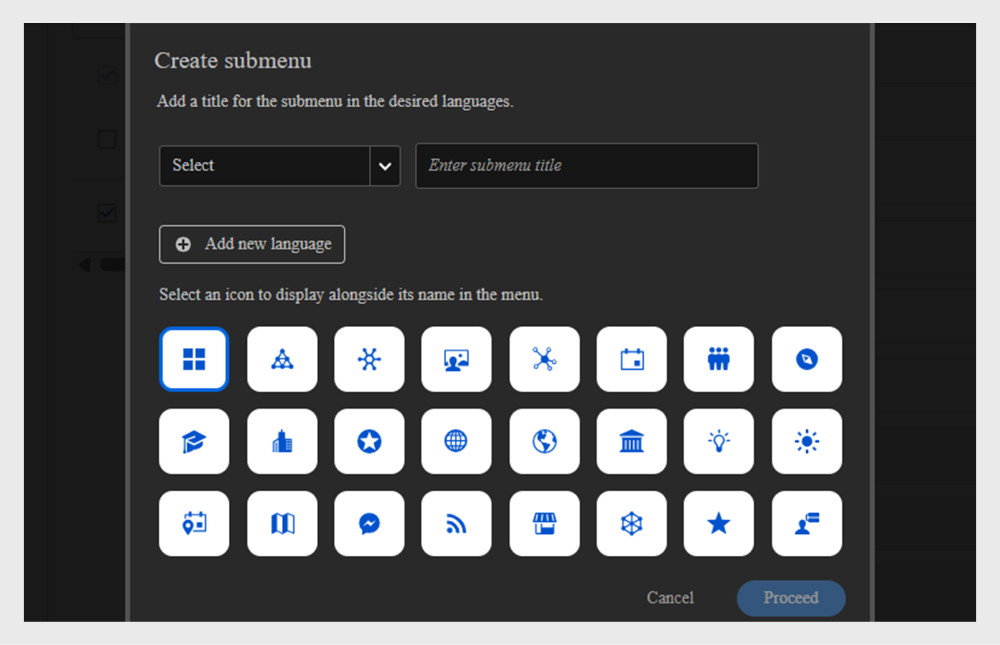

# Menü erstellen

Als Administrator bei einem Finanzunternehmen mit zwei Hauptteams, Sales und Customer Success Manager (CSM), sollten Sie separate Menüs mit den jeweiligen Seiten erstellen. Auf diese Weise können Teilnehmer Kurse, die für ihre Rollen relevant sind, ganz einfach in ihrem eigenen Menü finden.

Standardmäßig können Administratoren das Standardmenü auf der Seite **[!UICONTROL Menü]** sehen, das nicht gelöscht werden kann. Dieses Menü enthält alle integrierten Seiten, die derzeit in der Teilnehmer-App sichtbar sind.

So erstellen Sie ein Menü:

1. Melden Sie sich bei Adobe Learning Manager als Administrator an.
2. Wählen Sie im linken Navigationsbereich **[!UICONTROL Branding]** aus.
3. Wählen Sie **[!UICONTROL Menü]** und anschließend **[!UICONTROL Erstellen]** aus.

   
   _Menübildschirm mit Optionen zum Anzeigen, Organisieren und Erstellen benutzerdefinierter Menüs für verschiedene Teilnehmergruppen_

4. Geben Sie den **[!UICONTROL Menünamen]** ein (z. B. Produktschulung), und wählen Sie die Benutzergruppe unter der Option **[!UICONTROL Sichtbar für]** aus.

   
   _Menübildschirm erstellen, auf dem Administratoren einen Menünamen für die interne Verwendung eingeben und Benutzergruppen angeben können, um die Menüsichtbarkeit zu steuern_

5. Im Folgenden sind die im Menü verfügbaren Seiten aufgeführt:
   * **[!UICONTROL Integrierte Seiten]**: Dies sind die Standardseiten, die in Adobe Learning Manager enthalten sind, z. B. Startseite, &quot;Eigenes Lernen&quot; und &quot;Katalog&quot;. Administratoren können die integrierten Seiten nicht aus dem Menü entfernen. Sie können die Seiten aus dem Menü ausblenden.
   * **[!UICONTROL Benutzerdefinierte Seiten]**: Dies sind vom Administrator erstellte Seiten, die Experience Builder verwenden. Mit benutzerdefinierten Seiten können Unternehmen markenspezifische, rollenspezifische oder ereignisbasierte Erlebnisse entwerfen, indem sie Widgets, Layouts und Menüs hinzufügen, die auf verschiedene Teilnehmergruppen zugeschnitten sind.
6. Wählen Sie **[!UICONTROL Ändern]** neben **[!UICONTROL Landingpage]**, um die Landingpage des Teilnehmers zu aktualisieren.

   
   _Menükonfigurationsbildschirm mit der Option, Seiten auszuwählen, um die Startseite der Teilnehmeroberfläche zu ändern_

7. Wählen Sie die benutzerdefinierte Seite aus der Option **[!UICONTROL Seiten auswählen]** aus. Administratoren müssen in der Lage sein, nur veröffentlichte benutzerdefinierte Seiten auszuwählen, nicht diejenigen im Entwurfsstatus.

   
   _Seite auswählen, wobei die Option hervorgehoben wird, die benutzerdefinierte Seite für Benutzergruppen einzuschließen und die Menüreihenfolge anzupassen_

8. Ordnen Sie die Seiten im Menü per Drag &amp; Drop neu an.
9. Wählen Sie **[!UICONTROL Vorschaumenü]**, um das Menü vor dem Speichern anzuzeigen.
10. Wählen Sie **[!UICONTROL Speichern]**.

Das erstellte Menü wird für die ausgewählten Teilnehmer angezeigt. Sie können über die Teilnehmer-Benutzeroberfläche auf die benutzerdefinierten Seiten zugreifen.

_Teilnehmer-Benutzeroberfläche, die die benutzerdefinierte Seite mit den Schulungsmodulen und der einfachen Navigation über das Seitenleistenmenü anzeigt_

## Untermenü erstellen

Administratoren können ein Untermenü innerhalb des Menüs erstellen und benutzerdefinierte Seiten hinzufügen. Untermenüs haben keine Landingpage.

Erstellen eines Untermenüs:

1. Wählen Sie auf der Seite **[!UICONTROL Menükonfiguration]** die Option **[!UICONTROL Untermenü]** erstellen.

   
   _Menükonfigurationsseiten, auf denen die Option Untermenü erstellen hervorgehoben wird, um Untermenüs für die Teilnehmer zu erstellen_

2. Wählen Sie die Sprache aus und geben Sie den Untermenütitel ein.
3. Wählen Sie ein Symbol aus, das neben dem Untermenü angezeigt werden soll.
4. Wählen Sie **[!UICONTROL Neue Sprache hinzufügen]**, um dasselbe Untermenü für verschiedene Gebietsschemas zu erstellen. Wenn Sie beispielsweise Englisch und Französisch hinzufügen, sehen Teilnehmer mit der gewählten Benutzeroberflächensprache Englisch das Untermenü Englisch, während Teilnehmer mit ausgewähltem Französisch das Untermenü Französisch sehen.

   
   _Untermenü-Eingabeaufforderung zeigt Optionen zur Auswahl des Untermenütitels, der Sprache und des Symbols für die Anzeige im Menü an_

5. **[!UICONTROL Fortfahren]** auswählen.
6. Ziehen Sie die Seiten per Drag &amp; Drop unter das Untermenü.

## Ausgeblendete Seiten einrichten

Mit der Option **[!UICONTROL Seiten ausblenden]** können Administratoren die Teilnehmer-Benutzeroberfläche sauber halten, indem sie weniger Seiten anzeigen. Administratoren können Seiten aus dem Menü ausblenden, sodass Teilnehmer sie nicht in der Teilnehmer-Benutzeroberfläche sehen, aber Teilnehmer können diese Seiten dennoch auf andere Weise erreichen. Beispielsweise kann die Katalogseite im Menü ausgeblendet werden, aber der Zugriff darauf erfolgt über die Teilnehmer-Startseite.

_Menükonfigurationsbildschirm mit ausgeblendeten Seiten wie Katalog, Soziales Lernen, Kenntnisse und Abzeichen_

>[!NOTE]
>
>Seiten in einem Untermenü können nicht direkt ausgeblendet werden. Um eine Seite auszublenden, ziehen Sie sie zunächst aus dem Untermenü und blenden sie dann aus.

## Nächste Schritte

Nachdem Sie Seiten, Widgets und Menüs eingerichtet haben, verbessern Sie die Lernerfahrung der Teilnehmer insgesamt, indem Sie Anpassungen mit JavaScript und CSS hinzufügen.

