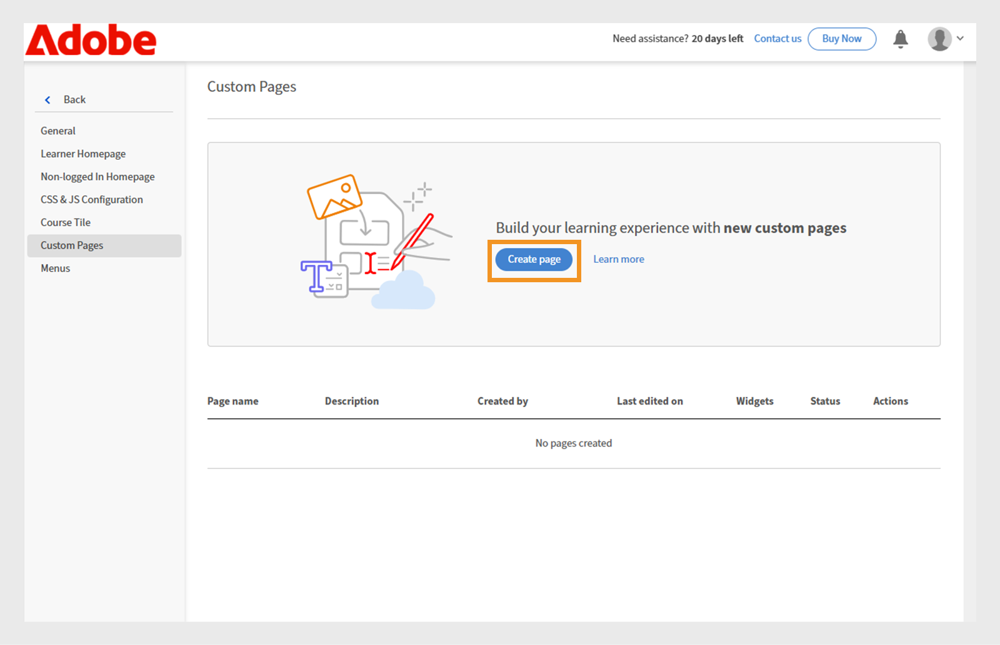
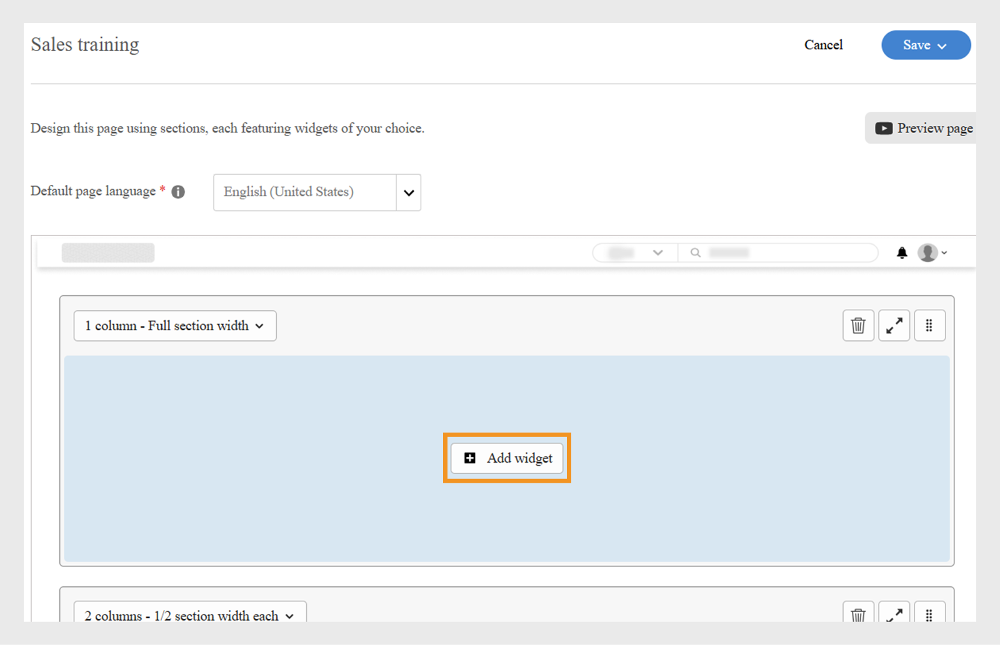
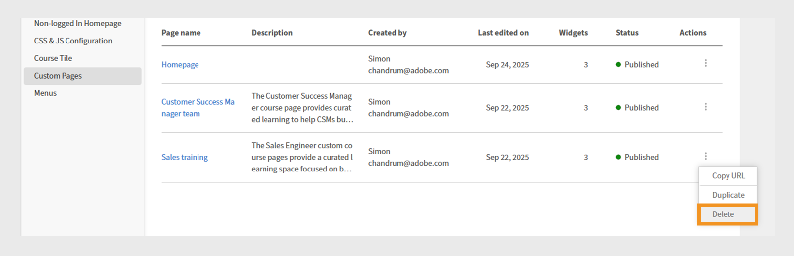

# Benutzerdefinierte Seite in Experience Builder erstellen

Als Administrator bei einem Finanzdienstleistungsunternehmen verwalten Sie zwei Teams: Vertrieb und Kundenerfolg. Jedes Team hat eigene Lernanforderungen, aber beide haben dasselbe Standard-Lernportal verwendet. Dies hat zu Verwirrung, Durcheinander und einem geringen Engagement der Lernenden geführt.
Mit Experience Builder in Adobe Learning Manager könnt ihr diese Herausforderung meistern, ohne in einen Headless-Build investieren zu müssen und ohne auf eine eigene Entwicklerlösung warten zu müssen. Mit Seiten, Widgets und Menüs kannst du rollenspezifische Markenportale in nur wenigen Schritten entwerfen, ohne programmieren zu müssen.

So erstellen Sie eine benutzerdefinierte Seite für das Sales Engineering-Team in Adobe Learning Manager:

1. Melden Sie sich bei Adobe Learning Manager als Administrator an.
2. Wählen Sie im linken Navigationsbereich **[!UICONTROL Branding]** aus.
3. Wählen Sie **[!UICONTROL Benutzerdefinierte Seiten]** aus.
4. Wählen Sie **[!UICONTROL Seite erstellen]** aus.

   
   _Bildschirm &quot;Benutzerdefinierte Seiten&quot; mit der Option &quot;Seite erstellen&quot; zum Entwerfen neuer benutzerdefinierter Lernerlebnisse_

5. Geben Sie den **[!UICONTROL Seitenname]** ein (z. B. Sales training for Sales team).
6. Geben Sie die **[!UICONTROL Seitenbeschreibung]** ein.

   
   _Einrichtung der Vertriebs-Schulungsseite in Adobe Learning Manager mit Feldern für den Seitennamen, die Beschreibung, den Typ, die URL und die Symbolkonfiguration zum Erstellen eines zielgerichteten Vertriebs-Schulungsportals_

7. Wählen Sie einen der folgenden Seitentypen aus:

   * **[!UICONTROL Mithilfe von ALM-Widgets erstellen]**: Der Administrator kann eine Seite mithilfe der vorhandenen Adobe Learning Manager-Widgets erstellen. Geben Sie die benutzerdefinierte Zeichenfolge in das Feld Seiten-URL ein. Diese Zeichenfolge wird an die URL Ihrer benutzerdefinierten Seite angehängt.
   * **[!UICONTROL Externe Seite]**: Der Administrator kann eine URL für die externe Seite hinzufügen. Wenn Sie als Seitentyp &quot;external&quot; auswählen, geben Sie die URL der externen Seite in das Feld &quot;Seiten-URL&quot; ein.

8. Wählen Sie das Symbol **[!UICONTROL Ändern]** aus, um das Symbol der Seite zu ändern.
9. Wählen Sie **[!UICONTROL Neue Sprache hinzufügen]**, um die Standardsprache für die Seite hinzuzufügen.
10. Wählen Sie **[!UICONTROL Speichern]**.

Die Seite wurde erstellt und als Entwurf im Abschnitt &quot;Benutzerdefinierte Seiten&quot; gespeichert. Administratoren können die entworfenen Seiten mithilfe von Widgets bearbeiten und entwerfen.

Im nächsten Schritt fügen Sie der benutzerdefinierten Seite ein Layout hinzu, in dem Sie Widgets hinzufügen und konfigurieren können.

## Seitenlayout in Experience Builder

Entwerfen Sie Ihre Seite, indem Sie das entsprechende Abschnittslayout aus dem Dropdownmenü auswählen. Die maximale Breite für jedes Layout beträgt 1212 Pixel. Wählen Sie aus den folgenden Abschnittsoptionen je nach Anzahl und gewünschter Größe der hinzuzufügenden Widgets:

* **[!UICONTROL 1 Spalte - Vollständige Abschnittsbreite]**: Der Inhalt erstreckt sich über die gesamte Abschnittsbreite und bietet so maximalen Platz.
* **[!UICONTROL 2 Spalten - 1/2 Abschnittsbreite je]**: Der Abschnitt ist gleichmäßig in zwei Spalten gleicher Breite aufgeteilt.
* **[!UICONTROL 2 Spalten - 2/3 und 1/3 Abschnittsbreite]**: Der Hauptinhalt nimmt zwei Drittel der Breite ein, der Seiteninhalt ein Drittel.
* **[!UICONTROL 2 Spalten - 1/3 und 2/3 Abschnittsbreite]**: Der Seiteninhalt benötigt ein Drittel, der Hauptinhalt zwei Drittel des Abschnitts.
* **[!UICONTROL 3 Spalten - 1/3 Abschnittsbreite jeweils]**: Der Abschnitt teilt sich in drei Spalten gleicher Breite auf.

>[!NOTE]
>
>Maximal 10 Widgets können in allen Layouts vertikal hinzugefügt werden, mit Ausnahme des Layouts 1 Spalte - Voller Abschnitt.

So wählen Sie das Layout für die Schulungsseite Vertrieb in Experience Builder aus:

1. Melden Sie sich bei Adobe Learning Manager als Administrator an.
2. Wählen Sie im linken Navigationsbereich **[!UICONTROL Branding]** aus.
3. Wählen Sie **[!UICONTROL Benutzerdefinierte Seiten]** aus, und wählen Sie dann die gewünschte Seite aus.
4. Wählen Sie **[!UICONTROL Seitendesign]** aus.
5. Wählen Sie **[!UICONTROL Bearbeiten]**.

   
   _Der Bildschirm zum Bearbeiten des Seitenentwurfs für eine benutzerdefinierte Seite der Verkaufsschulung, in dem die Schaltfläche &quot;Bearbeiten&quot; zum Hinzufügen von Seitenabschnitten, Widgets und Layouts hervorgehoben wird_

6. Wählen Sie die Optionen aus der Dropdown-Liste **[!UICONTROL Abschnittslayout auswählen]** aus.

   
   _Das Dialogfeld für die Auswahl des Abschnittslayouts ermöglicht es Administratoren, eine einspaltige oder mehrspaltige Widgetanordnung für ein benutzerdefiniertes Seitendesign auszuwählen_

7. **[!UICONTROL Fortfahren]** auswählen.

Das hinzugefügte Layout verfügt über die folgenden Optionen:

* **[!UICONTROL Zeile löschen]**: Entfernen Sie die Zeile aus dem Layout.
* **[!UICONTROL Bildschirmbreite anpassen]**: Passen Sie das Layout so an, dass es automatisch an Ihren Bildschirm angepasst wird, um eine bessere Sichtbarkeit zu erzielen.
* **[!UICONTROL Anordnung ändern]**: Ändern Sie die Reihenfolge der Layouts, indem Sie sie per Drag &amp; Drop an die gewünschte Position ziehen.

_Seitenlayout mit den Layoutoptionen zum Neuordnen, Erweitern oder Löschen des Abschnitts_

Der nächste Schritt besteht darin, Widgets auf der benutzerdefinierten Seite hinzuzufügen und zu konfigurieren.

## Widget hinzufügen und konfigurieren

Fügen Sie die erforderlichen Widgets entsprechend den Anforderungen zu den benutzerdefinierten Seiten der Verkaufsschulung hinzu.

So konfigurieren Sie ein Widget auf der benutzerdefinierten Seite &quot;Vertriebsschulung&quot;:

1. Wählen Sie im Layout **[!UICONTROL Widget hinzufügen]** aus.

   
   _Der Seitenentwurfsbildschirm ermöglicht es Administratoren, Widgets auszuwählen und hinzuzufügen, um ihre Kursseiten anzupassen_

2. Wählen Sie das **[!UICONTROL Inhaltsfeld-Widget]** aus, und wählen Sie dann **[!UICONTROL Weiter]**.

   
   _Bildschirm zur Widgetauswahl, auf dem das Inhaltsfeld-Widget zur Anzeige benutzerdefinierter Bilder, Texte und Aktionsschaltflächen hervorgehoben wird, um die Interaktion der Teilnehmer zu verbessern_

3. Geben Sie **[!UICONTROL Titel]** und **[!UICONTROL Beschreibung]** ein.
4. Geben Sie den Text in die **[!UICONTROL Aktionsschaltflächenbezeichnung]** ein und geben Sie einen Link an.
5. Konfigurieren Sie die restlichen Optionen. In diesem [Abschnitt](/help/migrated/administrators/feature-summary/experience-builder/add-a-widget.md#content-box-widget) erfahren Sie mehr über das **[!UICONTROL Inhaltsfeld-Widget]**.

   
   _Bildschirm für Inhaltsfeld-Widgets mit den Optionen zum Konfigurieren des Widgets_

6. Geben Sie den Titel, die Beschreibung und die Beschriftung der Aktionsschaltfläche im Konfigurationsbildschirm **[!UICONTROL Inhaltsfeld-Widget]** für Vertriebsingenieure ein.
7. Wählen Sie **[!UICONTROL Widget hinzufügen]**.
8. Wählen Sie **[!UICONTROL Speichern]** aus und wählen Sie aus den folgenden Optionen:
a. **[!UICONTROL Als Entwurf speichern]**: Die Seite wird als Entwurf gespeichert. Der Administrator kann die Seite später bearbeiten.
b. **[!UICONTROL Speichern &amp; Publish]**: Die Seite wird veröffentlicht, und der Administrator kann diese Seite dem Menü hinzufügen.

   
   _Speicheroptionen ermöglichen es Administratoren, zwischen dem Speichern einer Seite als Entwurf für die zukünftige Bearbeitung oder dem Veröffentlichen für den Teilnehmerzugriff zu wählen_

Die Seite kann als Entwurf gespeichert oder veröffentlicht werden. Administratoren können Entwürfe vor der Veröffentlichung bearbeiten und veröffentlichte Seiten aktualisieren und erneut veröffentlichen.

Führen Sie dieselben Schritte aus, um Seiten für das Customer Success Manager-Team zu erstellen.

## Seitenvorschau

Vorschau der Seiten:

1. Melden Sie sich bei Adobe Learning Manager als Administrator an.
2. Wählen Sie im linken Navigationsbereich **[!UICONTROL Branding]** aus.
3. Wählen Sie **[!UICONTROL Benutzerdefinierte Seiten]** aus.
4. Wählen Sie die gewünschte Seite aus, und wählen Sie dann **[!UICONTROL Seitendesign]**.
5. Wählen Sie **[!UICONTROL Bearbeiten]** aus, und wählen Sie dann **[!UICONTROL Vorschauseite]** aus, um die Vorschau des Portals anzuzeigen.

   
   _Seitenvorschau, die ein benutzerdefiniertes Seitenlayout mit einem Banner zeigt, Kursvorstellungen_

6. Wählen Sie Inspect-Modus , um die Höhe und Breite des Widgets anzuzeigen.

   
   _Seitenvorschaubildschirm in Experience Builder mit hervorgehobenem Umschalter für den Inspect-Modus, sodass Administratoren die Widgets überprüfen und überprüfen können_

## Seiten in einer anderen Sprache erstellen

Administratoren können mehrere benutzerdefinierte Seiten für Gebietsschemas erstellen, indem sie beim Erstellen der Seite unter &quot;Neue Sprache hinzufügen&quot; die erforderlichen Sprachen auswählen. Wenn mehrere Sprachen hinzugefügt werden, müssen die Widget-Details für jede Sprache auf der entsprechenden Registerkarte, die sich neben der Standardsprachenregisterkarte befindet, separat konfiguriert werden.

_Administratoren können neben der Standardsprache Widget-Details für zusätzliche Sprachen, z. B. Französisch, hinzufügen_

## Verwalten des Lebenszyklus von Seiten

Administratoren können den Abschnitt Benutzerdefinierte Seiten verwenden, um die Seiten zu bearbeiten, zu löschen und zu duplizieren.

### Seite bearbeiten.

Bearbeiten der benutzerdefinierten Seiten:

1. Melden Sie sich bei Adobe Learning Manager als Administrator an.
2. Wählen Sie im linken Navigationsbereich Branding aus.
3. Wählen Sie &quot;Benutzerdefinierte Seiten&quot;.
4. Wählen Sie die gewünschte Seite aus und wählen Sie dann Bearbeiten.
5. Wählen Sie „Speichern“.

Die Seite wird mit den Änderungen aktualisiert.

_Bearbeiten Sie die benutzerdefinierte Seite, sodass Administratoren den Seitennamen, die Beschreibung und den Typ aktualisieren können_

### Seite löschen.

Löschen der Seite:

1. Melden Sie sich bei Adobe Learning Manager als Administrator an.
2. Wählen Sie im linken Navigationsbereich Branding aus.
3. Wählen Sie &quot;Benutzerdefinierte Seiten&quot;.
4. Wählen Sie die gewünschte Seite aus.
5. Wählen Sie Aktion und dann Löschen.

_Bildschirm für benutzerdefinierte Seiten mit Optionen zum Löschen benutzerdefinierter Seiten, die für die Produktschulung erstellt wurden_

### Seite duplizieren.

So duplizieren Sie die Seite:

1. Melden Sie sich bei Adobe Learning Manager als Administrator an.
2. Wählen Sie im linken Navigationsbereich Branding aus.
3. Wählen Sie &quot;Benutzerdefinierte Seiten&quot;.
4. Wählen Sie die gewünschte Seite aus.
5. Wählen Sie Aktion und dann Duplizieren.

_Bildschirm für benutzerdefinierte Seiten mit Optionen zum Duplizieren der für die Produktschulung erstellten benutzerdefinierten Seiten_

## Nächste Schritte

Nachdem Sie die Seite erstellt haben, fügen Sie Widgets auf den benutzerdefinierten Seiten entsprechend Ihren Schulungsanforderungen hinzu und konfigurieren sie.
