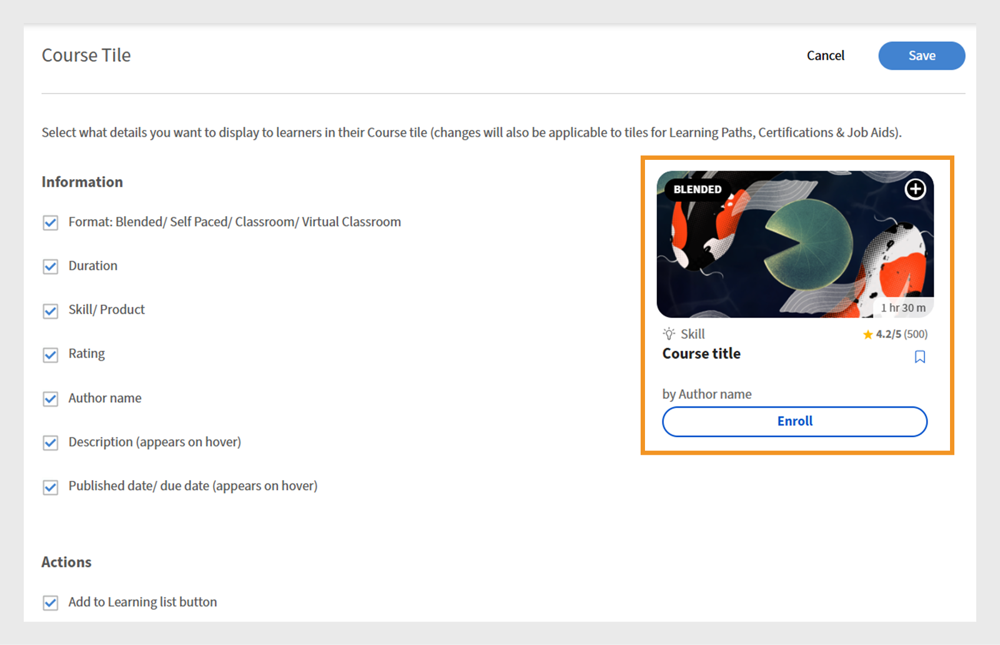
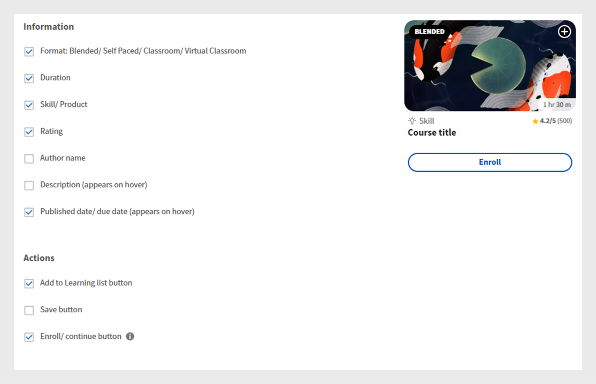

# Experience Builder anpassen

## Footer anpassen

Die Fußzeile wird am unteren Rand der Teilnehmeroberfläche angezeigt und zeigt in der Regel Standardinformationen an, die in den Administratoreinstellungen konfiguriert sind. Administratoren können dies durch eine benutzerdefinierte Fußzeile ersetzen, um ein Markenerlebnis zu erstellen. Mithilfe von HTML und CSS können sie Design, Layout und Inhalt der Fußzeile entsprechend den organisatorischen Anforderungen definieren.

Als Administrator eines Finanzunternehmens können Sie die Fußzeile mit der benutzerdefinierten Option konfigurieren. Mit dieser Option können Sie Ihre eigene HTML und CSS hinzufügen, sodass Sie beim Entwerfen der Fußzeile volle Flexibilität haben.

Anpassen der Fußzeile:

1. Melden Sie sich bei Adobe Learning Manager als Administrator an.
2. Wählen Sie **[!UICONTROL Branding]** und anschließend **[!UICONTROL Allgemein]** aus.
3. Wählen Sie die Option **[!UICONTROL Bearbeiten]** neben der Option **[!UICONTROL Fußzeilenanpassung]**.

   
   _Bildschirm &quot;Allgemeine Einstellungen&quot; in Adobe Learning Manager mit Optionen zum Aktivieren der Anpassung der Fußzeile_

4. Wählen Sie die Umschaltfläche aus, um die **[!UICONTROL Fußzeilenanpassung]** zu aktivieren.

   
   _Einstellungen für die Fußzeilenanpassung in Adobe Learning Manager, die den Schalter zum Aktivieren der benutzerdefinierten Fußzeile und der Felder zum Hinzufügen von HTML oder CSS für personalisiertes Branding anzeigen_

5. Geben Sie Ihre **[!UICONTROL HTML]** und **[!UICONTROL CSS]** auf den entsprechenden Registerkarten ein.

   
   _Bildschirm zur Anpassung der Fußzeile in Adobe Learning Manager, der einen benutzerdefinierten HTML-Abschnitt zum Hinzufügen, Bearbeiten oder Formatieren der Fußzeile der Teilnehmeroberfläche anzeigt_

6. Wählen Sie **[!UICONTROL Vorschau]**, um die angepasste Fußzeile anzuzeigen, bevor Sie sie speichern.

   
   _Vorschau einer angepassten Fußzeile der Teilnehmeroberfläche in Adobe Learning Manager mit kategorisierten Links_

7. Wählen Sie **[!UICONTROL Speichern]**.

Die angepasste Fußzeile wird allen Teilnehmern angezeigt.

## Kurskacheln anpassen

In einem Finanzunternehmen können Administratoren Kurskacheln einrichten, um zu entscheiden, welche Details die Teilnehmer sehen. Sie können beispielsweise die Kursbeschreibung und den Namen der Kenntnisse für die Compliance-Schulung anzeigen, aber Bewertungen oder den Namen des Autors ausblenden, um sich auf obligatorische Anforderungen zu konzentrieren.

So passen Sie die Kurskacheln an:

1. Melden Sie sich bei Adobe Learning Manager als Administrator an.
2. Wählen Sie **[!UICONTROL Branding]** und anschließend **[!UICONTROL Kurskachel]** aus.
3. Wählen Sie **[!UICONTROL Bearbeiten]**.

   
   _Einstellungsbildschirm für Kurskacheln in Adobe Learning Manager mit der Option &quot;Bearbeiten&quot; zum Anpassen der Kachel_

4. Wählen Sie die folgenden Optionen, um Details zu den Kursinformationen ein- oder auszublenden:

   a. **[!UICONTROL Format]**: Gemischt/Selbststudium/Klassenzimmer/Virtuelles Klassenzimmer: Typ des Lernobjekts.
b. **[!UICONTROL Dauer]**: Dauer des Lernobjekts.
c. **[!UICONTROL Kenntnisse/Produkt]**: Zeigen Sie die wichtigsten Kenntnisse oder das Produkt an, die bzw. das der Kurs abdeckt.
d. **[!UICONTROL Bewertung]**: Zeigen Sie die Teilnehmerbewertung des Kurses an.
e. **[!UICONTROL Autorenname]**: Zeigt den Namen des Kursverfassers an.
f. **[!UICONTROL Beschreibung (erscheint beim Hovern)]**: Zeigt eine kurze Zusammenfassung des Kurses an, wenn Teilnehmer den Mauszeiger über die Karte bewegen.
g. **[!UICONTROL Veröffentlichungsdatum/ Fälligkeitsdatum (wird beim Zeigen angezeigt)]**: Zeigt entweder an, wann der Kurs veröffentlicht wurde, oder den Termin für den Abschluss an.

5. Wählen Sie die folgenden Optionen aus, um Details zu Kursaktionen ein- oder auszublenden:

   a. **[!UICONTROL Schaltfläche &quot;Zur Lernliste hinzufügen&quot;]**: Ermöglichen Sie es Teilnehmern, den Kurs zur späteren Referenz in ihrer persönlichen Lernliste zu speichern.
b. **[!UICONTROL Schaltfläche &quot;Speichern&quot;]**: Speichert alle Änderungen, die an den Kurseinstellungen oder -voreinstellungen vorgenommen wurden.
c. **[!UICONTROL Schaltfläche &quot;Registrieren/Fortfahren&quot;]**: Ermöglicht es Teilnehmern, sich entweder für einen neuen Kurs zu registrieren oder einen bereits begonnenen Kurs fortzusetzen. Wenn Sie diese Option ausblenden, werden auch die daneben angezeigten Aktionen &quot;Nicht empfehlen&quot; und &quot;Herunterladen&quot; entfernt.

   
   _Konfigurationsbildschirm für Kurskacheln in Adobe Learning Manager, auf dem Administratoren die Informationen und Aktionen auswählen, die für Teilnehmer angezeigt werden sollen_

6. Eine Vorschau der Kurskachel wird auf der rechten Seite des Bildschirms angezeigt.

   
   _Konfigurationsbildschirm für Kurskacheln in Adobe Learning Manager, wobei die Vorschau der Kurskachel hervorgehoben wird_

7. Wählen Sie **Speichern**.

Die angepasste Kurskachel wird allen Teilnehmern angezeigt.

**Vor der Anpassung**


_Kurskachel in Adobe Learning Manager vor der Anpassung_

**Nach der Anpassung**


_Kurskachel in Adobe Learning Manager nach Anpassung_

## Anpassen mit JavaScript und CSS

Als Administrator eines Finanzunternehmens können Sie die Teilnehmer-App anpassen, indem Sie CSS und JavaScript so injizieren, dass sie dem Branding und den gesetzlichen Vorgaben Ihres Unternehmens entsprechen. So haben Sie die volle Kontrolle über Erscheinungsbild, Layout und interaktive Funktionen der App.

Anpassen der Teilnehmer-Benutzeroberfläche mit CSS und JS:

1. Melden Sie sich bei Adobe Learning Manager als Administrator an.
2. Wählen Sie **[!UICONTROL Branding]** und anschließend **[!UICONTROL CSS- und JS-Konfiguration]** aus.
3. Wählen Sie **[!UICONTROL Bearbeiten]**.
4. Geben Sie Ihr benutzerdefiniertes CSS und JS in die entsprechenden Registerkarten ein.

   
   _Bildschirm &quot;CSS- und JS-Konfiguration&quot; in Adobe Learning Manager, auf dem Administratoren benutzerdefinierte CSS- und JS-Optionen hinzufügen können_

5. Wählen Sie „Speichern“.

Die Anpassung wird für alle Teilnehmer angezeigt.

**Vor der Anpassung**

Das Menü für die Teilnehmer-Startseite basiert auf dem Standarddesign von Adobe Learning Manager.


_Adobe Learning Manager-Teilnehmer-Startseite vor der Anpassung_

**Nach der Anpassung**

Nachdem Sie die folgenden CSS und JS hinzugefügt haben, wurde das Menü der Teilnehmer-Startseite basierend auf den Anpassungen aktualisiert.

Beispiel-CSS:

```
p{
display:block;
}

.withExtraMargin{
margin-right: 100px!important;
}
.alm-footer-extraMargin{
margin-top:0;
}

.alm-layout-almLayoutContainer{
margin: 0;
    margin-bottom: 5rem;
}
#page-756 #category-970151 .alm-category-card-cardLink
{
    height: 400px;

}
#page-756 #category-970151 .alm-category-card-header
{
height: 240px!important;
}
#page-656 .alm-category-card-cardLink{
    height: 380px;
background: white;
}
#page-656 .alm-category-card-header{
height: 200px!important;
}

#page-746 #html-636797 {
    background-color: #f7f9fc;
}

#page-746 .alm-layout-almLayoutContainer{
row-gap:0;
margin-bottom:0;
}

.alm-category-card-cardLink{
transition: border .3s ease;
}
.navText{
       font-size: 16px;
    cursor: pointer;
}
.submenuDownCaret{
display:none;}
.alm-catalog-container-pageContainer{
max-width: 1720px;
    width: 100%;
    padding: 0 40px;
    padding: 0 40px;
}


.pagenavbarcontainer.newNavbarContainer{
width: 1230px;
    margin: 0 auto;
}
div[automationid="learner-menu-inside-header"]{
margin-right:100px!important;
}
#searchScope,.searchSeparator,#searchInDropdown{
display:none!important;
}
#right-navbar{
    margin-right: 0;
}
#companyLogoImg{
cursor:pointer;
max-width:190px;
}
.alm-catalog-container-filtersContainer{
width:340px;
}
.alm-training-card-v2-imageFlipContainer{
border:none;
}
.newSearchBoxContainer{
border-radius: 5px !important;
    border-width: 2px !important;
    border-color: rgb(5, 32, 34) !important;
}
.searchBoxFlex{
width:250px!important;
flex-direction: row-reverse;
    padding-right: 10px;
}
.searchPlaceholderIcon svg{
    height: 16px;
    width: 16px;
}
.searchPlaceholderIcon svg path{
fill: black;
}
#page-656 .alm-layout-almLayoutContainer {
    padding-bottom: 5rem;
margin-bottom:0!important;
}
#page-656 .alm-strip-widget-header-stripHeaderContainer{
display:none;
}
#page-656 .content-wrapper{
padding-bottom:50px;
}
.myspan{
position: absolute;
    bottom: 10px;
    display: block;
    width: 85%;
    margin-left: 20px;
    margin-right: 20px;
    border-top: 1px solid #efefef !important;
    color: #5a697c !important;
    text-align: right;
    padding-top: 5px;
}
.alm-app-wrapperComponent{
padding-bottom:100px;}


@media (max-width: 768px) {
#page-656 .alm-category-widget-cardRow{
   flex-direction: column;
gap: 40px;
 }
#page-656 .alm-category-widget-stripCardContainerRow{
    width: 100%;
    display: flex;
    justify-content: center;
  }
}

@media (max-width: 768px) {
    .container2-right {
        display: none!important;
    }
.container-1 .content-wrapper{
    padding: 0 20px!important;
 }
}
```

JS-Beispiel:

```
console.error("Hello Error")

setTimeout(() =>{
// Step 1: Check if #category-284977 is present
const categoryElement = document.querySelector('#category-284977');

if (categoryElement) {
  // Step 2: Find all elements with .alm-category-card-cardLink
  const cardLinks = categoryElement.querySelectorAll('.alm-category-card-cardLink');

  // Step 3: Loop over them and append span with random calculation
  cardLinks.forEach((link, index) => {
    const span = document.createElement('span');


    // Calculate number = (index+1) * 5
    let number = (index + 1) * 5;
if(index === 2){
number = number +2;
}
if(index == 3){
number = number - 7;
}

    span.textContent = `${number} courses`;
    span.classList.add('myspan');
    link.appendChild(span);
  });
}

},2000)
```


_Adobe Learning Manager-Teilnehmer-Startseite nach der Anpassung_

## Anpassen eines Widgets

Administratoren können Widgets auf benutzerdefinierten Seiten anpassen, indem sie CSS-Klassen anwenden. Beispielsweise können sie den Text in einem Inhaltsfeld-Widget ausrichten oder den Abstand zwischen den Kurskacheln im Kurs- und Pfade-Widget anpassen.

>[!TIP]
>
>Inspect zeigt die Teilnehmerseite an, um die Stile zu identifizieren, die Sie ändern möchten. Kopieren Sie die entsprechenden CSS-Klassen und fügen Sie sie auf der Seite &quot;CSS &amp; JS-Konfiguration&quot; ein, um Ihre Anpassungen anzuwenden.

**Vor der Anpassung**

Der folgende Bildschirm ist die Schulungsseite für Vertriebsingenieure, bevor Sie die CSS-Anpassung hinzufügen.


_Sales Engineer-Teilnehmerseite vor der Anpassung_

**Nach der Anpassung**

Nachdem Sie die folgenden CSS-Klassen hinzugefügt haben, wird die Teilnehmerseite entsprechend den in diesen Klassen definierten Stilen aktualisiert. Basierend auf dem CSS wurde der Text im Inhaltsfeld-Widget linksbündig ausgerichtet und die Kurskacheln weisen jetzt einen vergrößerten Abstand zwischen ihnen auf.

```
.alm-custom-content-box-center {
    align-items: baseline;
    text-align: initial;
}
.alm-training-card-v2-imageContainer {
    border: 14px solid var(--prime-color-white);
    border-radius: -1px;
    height: 106%;
    position: relative;
    transition: all .1s ease-in-out;
}
.alm-course-path-widget-cardRow {
    display: flex;
    gap: 135px;
    margin: 0 0 21px;
    padding: 10px;
}
```


_Sales Engineer-Teilnehmerseite nach Anpassung_

### Vordefinierte CSS-Klassen für Widgets

Im Folgenden finden Sie einige vordefinierte CSS-Klassen, die für Widgets verfügbar sind.

| Widget-Name | Container-CSS |
|---|---|
| Kalender | alm-calendar-widget-container |
| Kategorie | alm-category-widget-container |
| Kategoriekarten | alm-category-card-container |
| Compliance | alm-compliance-container |
| Kurs und Pfade | alm-course-path-widget-container |
| LO-Karten für Kurse und Pfade | alm-training-card-v2-card |
| Inhaltsbox | alm-custom-content-box-container |
| Gamification | alm-leaderboard-container |
| Soziales Lernen | alm-social-learning-container |


