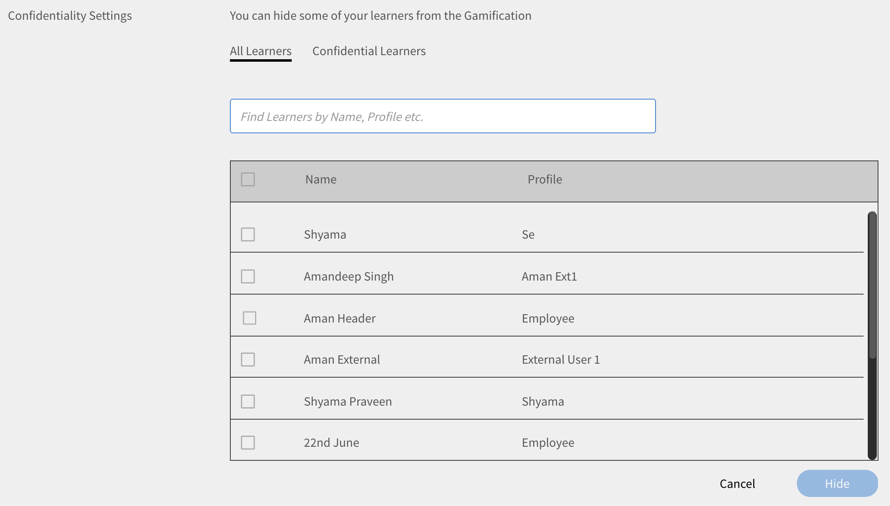
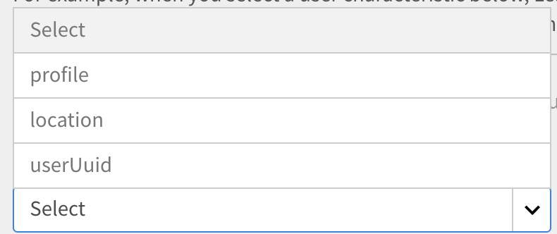

# Gamification

Gamification ist der Einsatz von Spieldenken und Spielmechanik in Nicht-Spiel-Kontexten, um Benutzer beim Lernen in Ertragspunkte einzubinden.

## Übersicht {#overview}

Mit dem Lern-Manager können Sie eine strukturelle Gamification-Ebene auf den Inhalt anwenden, um Teilnehmer zu motivieren, ihre Lernziele zu erreichen. Es ermöglicht den Teilnehmern, Punkte für verschiedene Lernaktivitäten zu sammeln und Bronze-, Silber-, Gold- und Platinwerte zu erreichen.

Standardmäßig sind einige Gamification-Punkte und -Daten für Benutzer verfügbar, um das Muster zu verstehen. Sie können die Punkte entsprechend ändern.

<!--A sample illustration is provided below that shows all the tasks and points.

-->

## Gamification-Einstellungen {#gamificationsettings}

Führen Sie die folgenden Schritte aus, um auf die Einstellungen zuzugreifen:

1. Melden Sie sich als Administrator an und klicken Sie im linken Bereich auf **[!UICONTROL Gamification]**.
1. Wenn Sie ein neues Learning Manager-Konto erstellen, ist Gamification standardmäßig deaktiviert. Klicken Sie zum Aktivieren auf **[!UICONTROL Aktivieren]** oben rechts auf der Seite.

## Administratoraktionen {#administratoractions}

Der Administrator kann eine Liste vertraulicher Benutzer erstellen, Gamification-Punkte zurücksetzen und die Gamification-Funktion für Teilnehmer deaktivieren/aktivieren. Klicken Sie auf die Dropdown-Liste Aktionen in der oberen rechten Ecke der Seite, um die Aktionen anzuzeigen, wie in der Abbildung unten gezeigt.

*Gamification-Optionen für einen Administrator*

## Vertraulichkeitseinstellungen {#confidentialitysettings}

Bei Bedarf können Sie einige Benutzer mit höherer Verwaltung als vertrauliche Benutzer festlegen. Die Gamification-Aktivitäten vertraulicher Benutzer sind für andere Teilnehmer im Leaderboard nicht sichtbar.

Vertraulichkeitseinstellungen können sowohl für interne als auch für externe Benutzer angewendet werden.

1. Klicken **[!UICONTROL Gamification]** > **[!UICONTROL Einstellungen]** > **[!UICONTROL Vertraulichkeitseinstellungen]**.

*Vertraulichkeitseinstellungen anzeigen*

1. Klicken Sie in der Liste der Benutzer auf das Kontrollkästchen neben dem Benutzernamen und klicken Sie auf Ausblenden , um den Benutzer als vertraulichen Benutzer festzulegen.

   >[!NOTE]
   >
   >Sie können die vertraulichen Benutzer in der Liste durch das Häkchen im Kontrollkästchen neben dem Benutzernamen identifizieren.

1. Klicken Sie auf die Registerkarte Vertrauliche Benutzer , um die Liste der vertraulichen Benutzer anzuzeigen. Standardmäßig sind sie nicht sichtbar. Klicken Sie auf den Dropdown-Pfeil, um die Liste anzuzeigen.
1. Aktivieren Sie das Kontrollkästchen neben dem Benutzernamen in der Liste der vertraulichen Benutzer und klicken Sie auf Hinzufügen , um die Benutzer aus der Liste der vertraulichen Benutzer zu entfernen.

## Gamification zurücksetzen {#resetgamification}

Sie können die vom Teilnehmer gesammelten Gamification-Punkte zurücksetzen und auch die Konfigurationseinstellungen zurücksetzen. Wenn Sie die Punktzahl der Benutzer zurücksetzen, werden alle Punkte, die die Benutzer gesammelt haben, gelöscht und auf null zurückgesetzt. Wenn Sie die Benutzerpunktzahlen und Konfigurationseinstellungen zurücksetzen, werden alle Standardpunkte, die den Ebenen und Aufgaben zugewiesen sind, auf null zurückgesetzt.

Die Einstellungen zum Zurücksetzen der Gamification können sowohl für interne als auch für externe Benutzer angewendet werden.

Um die Teilnehmerpunktzahl und Konfiguration zurückzusetzen, klicken Sie auf &quot;Gamification zurücksetzen&quot; und wählen Sie die gewünschte Option aus. Sie können zwischen &quot;Nur Teilnehmerpunktzahl zurücksetzen&quot; und &quot;Teilnehmerpunktzahl zurücksetzen&quot; und &quot;Konfigurationseinstellungen&quot; wählen. Klicken Sie nach der Auswahl auf &quot;OK&quot;.

*Gamification-Punkte zurücksetzen*

## Gamification deaktivieren {#disablegamification}

Klicken [!UICONTROL **Gamification**] > [!UICONTROL **Gamification-Funktion**]. Auf diese Weise können Sie die Gamification-Funktion und das Leaderboard separat für Ihre Teilnehmer aktivieren. Wählen Sie zwischen &quot;Für interne Teilnehmer aktivieren&quot; und &quot;Für externe Teilnehmer aktivieren&quot; gemäß den Anforderungen aus und klicken Sie auf &quot;OK&quot;. Alle Punkte bleiben erhalten, wenn Sie die Gamification erneut aktivieren.

*Gamification deaktivieren*

Sie können Gamification sowohl für interne als auch für externe Benutzer deaktivieren.

## Punkte einrichten. {#setuppoints}

Administratoren können Gamification-Punkte für Teilnehmer einrichten, indem sie die folgenden Schritte ausführen:

1. Klicken **[!UICONTROL Gamification]** nachdem Sie sich als Administrator angemeldet haben.\
   Es erscheint eine Seite mit einer Liste der Bronze-, Silber-, Gold- und Platin-Stufen und den für jede Stufe erforderlichen Punkten. Eine Liste der Aufgaben und der entsprechenden Punkte werden angezeigt.
1. Klicken Sie auf das Bearbeitungssymbol neben jeder Aufgabe, um die Punkte einzurichten.
1. Ändern Sie die Häufigkeit des Auftretens von Aufgaben, z. B. das Abschließen einer bestimmten Anzahl von Kursen pro Monat, Quartal oder Jahr.
1. Klicken **[!UICONTROL Speichern]**.

## Aufgaben {#tasks}

Es gibt fünf Gamification-Aufgaben für Teilnehmer, für die der Administrator Punkte festlegen kann. Eine Abbildung, die alle Aufgaben und Punkte der Teilnehmer darstellt, ist unten dargestellt:

>[!NOTE]
>
>Gamification-Punkte für Teilnehmer innerhalb einer bestimmten Aufgabe werden nicht kumuliert. Aber die Punkte werden dem Teilnehmerkonto kumulativ hinzugefügt, wenn die Teilnehmer diese Punkte über verschiedene Aufgaben hinweg erhalten.

Beim Zuweisen von Kursen zu Punkten muss der Administrator sicherstellen, dass die Teilnehmer die Punkte schrittweise erhalten.

**Für schnelle Teilnehmer**

Diese Aufgabe ist relevant, wenn ein Teilnehmer eine bestimmte Anzahl von Kursen innerhalb eines Monats/Quartals/Jahres abschließt. Diese Aufgabe ist es, schnelle Teilnehmer zu ermutigen.

Sie können die folgenden möglichen Szenarien sehen:

1. Wenn Teilnehmer innerhalb eines Monats/Quartals/Jahres zwei Kurse absolvieren, erhalten sie 20 Punkte.
1. Wenn Teilnehmer innerhalb eines Monats/Quartals/Jahres vier Kurse absolvieren, erhalten sie 100 Punkte.
1. Wenn die Teilnehmer acht Kurse absolvieren, erhalten sie 300 Punkte.
1. Wenn Teilnehmer zehn Kurse abschließen, erhalten sie 500 Punkte.

>[!NOTE]
>
>Der Administrator kann den Zeitraum und die Anzahl der Kurse ändern, die absolviert werden müssen, um die entsprechenden Punkte zu erhalten.

Innerhalb einer Aufgabe werden den Teilnehmern keine Punkte kumulativ zugewiesen. Beispiel: Angenommen, ein Teilnehmer hat einige Kurse abgeschlossen und 20 Punkte erhalten. Wenn Teilnehmer vier Kurse absolvieren, erhalten sie 100 Punkte, aber die vorhandenen 20 Punkte werden nicht berücksichtigt.

**Für selbstständige Teilnehmer (a)**

Diese Aufgabe ist für Teilnehmer relevant, die sich für die vorgeschriebene Anzahl von Kursen registrieren und diese innerhalb eines Monats/Quartals/Jahres abschließen. In diesem Fall kann der Administrator diese Aufgabe aktivieren, um Punkte zuzuweisen und sie zu ermutigen.

Mögliche Szenarien:

1. Wenn Teilnehmer sich innerhalb eines Monats/Quartals/Jahres für einen Kurs registrieren, erhalten sie 50 Punkte.
1. Wenn Teilnehmer sich innerhalb eines Monats/Quartals/Jahres für zwei Kurse registrieren, erhalten sie 150 Punkte.

>[!NOTE]
>
>Der Administrator kann den Zeitraum und die Anzahl der Kurse ändern.

**Für selbstständige Teilnehmer (b)**

Diese Aufgabe ist für Teilnehmer relevant, die sich in einem Monat/Quartal/Jahr für mehr Kurse registriert und mehr Kurse abgeschlossen haben, als für deren Abschluss erforderlich sind. In solchen Fällen kann der Administrator diese Aufgabe aktivieren, um Punkte zuzuweisen und sie zu ermutigen.

Mögliche Szenarien für die Registrierung von Teilnehmern für Kurse zusätzlich zu den ihnen zugeteilten Kursen:

1. Wenn Teilnehmer sich innerhalb eines Monats/Quartals/Jahres für einen Kurs registrieren, erhalten sie 20 Punkte.
1. Wenn Teilnehmer sich innerhalb eines Monats/Quartals/Jahres für zwei Kurse registrieren, erhalten sie 100 Punkte.
1. Wenn Teilnehmer sich innerhalb eines Monats/Quartals/Jahres für drei Kurse registrieren, erhalten sie 300 Punkte.
1. Wenn Teilnehmer sich innerhalb eines Monats/Quartals/Jahres für vier Kurse registrieren, erhalten sie 500 Punkte.

>[!NOTE]
>
>Der Administrator kann den Zeitraum und die Anzahl der Kurse ändern. Beispielsweise kann das dritte Szenario auf fünf Kurse statt auf drei geändert werden, um 80 Punkte zu erhalten.

**Für Weiterbildung (a)**

Diese Aufgabe ist für Teilnehmer relevant, die eine bestimmte Anzahl von Kompetenzen erwerben. Der Administrator kann diese Aufgabe wählen, um Teilnehmer zu ermutigen, so viele Kompetenzen wie möglich zu erwerben.

Mögliche Szenarien für die Kompetenzverbesserung:

1. Wenn der Teilnehmer eine Kompetenz erlangt, erhält er 100 Punkte.
1. Wenn ein Teilnehmer zwei Kompetenzen erlangt, erhält er 300 Punkte.
1. Wenn ein Teilnehmer drei Kompetenzen erhält, erhält er 600 Punkte.
1. Wenn ein Teilnehmer vier Kompetenzen erreicht, erhält er 900 Punkte.

>[!NOTE]
>
>Der Zeitraum gilt nicht für diese Aufgabe. Der Administrator kann die Anzahl der Kurse für jedes Szenario ändern.

**Für Weiterbildung (b)**

Diese Aufgabe ist für alle Teilnehmer relevant, die eine höhere Stufe innerhalb einer Kompetenz absolvieren.

Mögliche Szenarien für die Weiterbildung in Stufen innerhalb einer bestimmten Kompetenz:

1. Wenn die Teilnehmer eine Stufe erreichen, erhalten sie 100 Punkte.
1. Wenn Teilnehmer zwei Stufen erreichen, erhalten sie 200 Punkte.
1. Wenn die Teilnehmer drei Stufen erreichen, erhalten sie 500 Punkte.

>[!NOTE]
>
>Der Zeitraum ist für diese Aufgabe nicht relevant. Wenn die Teilnehmer eine höhere Stufe und dann eine niedrigere Stufe einer Kompetenz erreichen, erhalten sie nur Punkte für die höhere Stufe.

**Punkte für frühzeitigen Abschluss**

Diese Aufgabe ist für Teilnehmer relevant, die als erste N Teilnehmer den Kurs abschließen.

Mögliche Szenarien:\
Wenn ein Teilnehmer einer der ersten 10 Teilnehmer wird, die den Kurs abschließen, erhält er 100 Punkte.

**Punkte für rechtzeitigen Abschluss**

Diese Aufgabe ist für Teilnehmer relevant, die einen Kurs innerhalb einer festgelegten Anzahl von Tagen nach der Registrierung für den Kurs abschließen.

Mögliche Szenarien:\
Wenn Teilnehmer einen Kurs innerhalb von 10 Tagen nach Kursbeginn abschließen, erhalten sie 100 Punkte.

## Gamification für Gruppen {#grouplevelgamification}

Administratoren können den Umfang der Gamification definieren, indem sie die Bereichseinstellungen ändern. Sie können die Gamification selektiv für Benutzer, Gruppen oder Standorte mit ähnlichem Profil aktivieren.

1. Klicken Sie in der Administratoranmeldung auf **[!UICONTROL Gamification]** im linken Bereich.
1. Öffnen **[!UICONTROL Gamifications]** > **[!UICONTROL Einstellungen]** > **[!UICONTROL Bereichseinstellungen]**. Die [!UICONTROL Gamification-Bereichseinstellungen] &quot; wird angezeigt.

   

   *Dialogfeld &quot;Gamification-Bereichseinstellungen&quot; anzeigen*

1. Klicken Sie auf die Option **[!UICONTROL Bereichseinstellungen aktivieren]**.

1. Wählen Sie das Benutzermerkmal aus der Dropdownliste aus.

   <!---->

1. Wählen Sie den Wert aus, der dem von Ihnen gewählten Benutzermerkmal entspricht. Wenn Sie beispielsweise Benutzermerkmal als Profil ausgewählt haben, müssen Sie den Wert aus der Dropdown-Liste auswählen. In der Abbildung unten sehen Sie Referenzbeispiele für Profilwerte.

   <!---->

1. Klicken **[!UICONTROL Speichern].**
