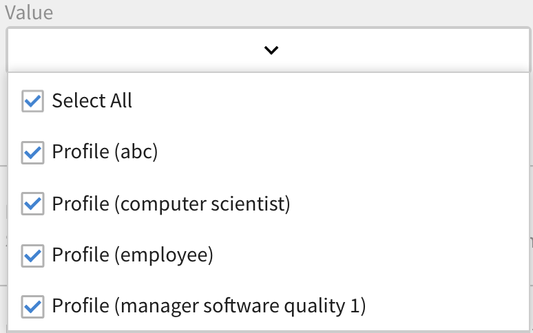

# Gamification

Gamification bedeutet, spieltypische Ideen und Prozesse in einen spielfremden Kontext einzubetten. So werden die Teilnehmenden animiert, durch Lernen Punkte zu sammeln.

## Übersicht {#overview}

Mit Learning Manager können Sie eine strukturelle Gamification-Ebene auf den Inhalt anwenden, um Teilnehmende zu motivieren, ihre Lernziele zu erreichen. So können die Teilnehmenden Punkte für verschiedene Lernaktivitäten sammeln und die Bronze-, Silber-, Gold- und Platinstufe erreichen.

In der Voreinstellung sind einige Gamification-Punkte und -Daten für Benutzer verfügbar, um das Prinzip zu verdeutlichen. Sie können die Punkte entsprechend ändern.

<!--A sample illustration is provided below that shows all the tasks and points.

-->

## Gamification-Einstellungen {#gamificationsettings}

Führen Sie die folgenden Schritte aus, um auf die Einstellungen zuzugreifen:

1. Melden Sie sich als Administrator an und klicken Sie im linken Bereich auf **[!UICONTROL Gamification]**.
1. Wenn Sie ein neues Learning Manager-Konto erstellen, ist Gamification standardmäßig deaktiviert. Klicken Sie zum Aktivieren oben rechts auf der Seite auf **[!UICONTROL Aktivieren]**.

## Aktionen von Administratoren {#administratoractions}

Administratoren können eine Liste von vertraulichen Benutzern erstellen, die Gamification-Punkte zurücksetzen und die Gamification-Funktion für Teilnehmer aktivieren/deaktivieren. Klicken Sie auf die Dropdown-Liste „Aktionen“ in der rechten oberen Ecke der Seite, um die Aktionen aufzurufen, wie in der Abbildung unten gezeigt.

*Gamification-Optionen für einen Administrator*

## Vertraulichkeitseinstellungen {#confidentialitysettings}

Falls erforderlich, können Sie einige Führungskräfte als vertrauliche Benutzer einstellen. Die Gamification-Aktivitäten vertraulicher Benutzer sind für andere Teilnehmer nicht im Leaderboard sichtbar.

Vertraulichkeitseinstellungen können für interne und externe Benutzer angewendet werden.

1. Klicken **[!UICONTROL Gamification]** > **[!UICONTROL Einstellungen]** > **[!UICONTROL Vertraulichkeitseinstellungen]**.

*Vertraulichkeitseinstellungen anzeigen*

1. Klicken Sie in der Benutzerliste das Kontrollkästchen neben dem Benutzernamen an und klicken Sie auf „Ausblenden“, um den Benutzer als vertraulichen Benutzer einzustellen.

   >[!NOTE]
   >
   >Sie können die vertraulichen Benutzer in der Liste durch das Häkchen im Kontrollkästchen neben dem Benutzernamen identifizieren.

1. Klicken Sie auf die Registerkarte „Vertrauliche Benutzer“, um eine Liste der vertraulichen Benutzer abzurufen. Diese sind standardmäßig nicht sichtbar. Klicken Sie auf das Dropdown-Pfeilsymbol, um die Liste anzuzeigen.
1. Klicken Sie auf das Kontrollkästchen beim Benutzernamen in der Liste der vertraulichen Benutzer und klicken Sie auf „Hinzufügen“, um Benutzernamen aus der Liste der vertraulichen Benutzer zu entfernen.

## Gamification zurücksetzen {#resetgamification}

Sie können die vom Teilnehmer gesammelten Gamification-Punkte und sowie die Konfigurationseinstellungen zurücksetzen. Wenn Sie die Punktzahlen der Benutzer zurücksetzen, werden alle Punkte, die von Benutzern gesammelt wurden, gelöscht und auf Null zurückgesetzt. Wenn Sie Benutzerpunktzahlen und Konfigurationseinstellungen zurücksetzen, werden alle Punkte, die standardmäßig den Stufen und Aufgaben zugewiesen waren, auf Null zurückgesetzt.

Die Einstellungen zum Zurücksetzen der Gamification können sowohl für interne als auch für externe Benutzer angewendet werden.

Um die Teilnehmerpunktzahl und Konfiguration zurückzusetzen, klicken Sie auf „Gamification zurücksetzen“ gemäß Ihren Anforderungen auf eine Option. Sie können zwischen „Nur Teilnehmerpunktzahl“ und „Teilnehmerpunktzahlzurücksetzen“ und „Konfigurationseinstellungen“ wählen. Nachdem Sie gewählt haben, klicken Sie auf „OK“.

*Gamification-Punkte zurücksetzen*

## Gamification deaktivieren {#disablegamification}

Klicken [!UICONTROL **Gamification**] > **[!UICONTROL Einstellungen]** > [!UICONTROL **Gamification-Funktion**]. Dies ermöglicht es Ihnen, die Gamification-Funktion und das Leaderboard separat für Ihre Teilnehmer zu aktivieren. Wählen Sie zwischen „für interne Teilnehmer aktivieren“ und „Für externe Teilnehmer aktivieren“ und klicken Sie auf „OK“. Alle Punkte werden beibehalten, wenn Sie die Gamification wieder aktivieren.

*Gamification deaktivieren*

Sie können Lernprogrammen für interne und externe Benutzer deaktivieren.

## Punkte einrichten {#setuppoints}

Administratoren können Gamification-Punkte für Teilnehmer festsetzen, indem sie die folgenden Schritte ausführen:

1. Klicken **[!UICONTROL Gamification]** nachdem Sie sich als Administrator angemeldet haben.\
   Es erscheint eine Seite mit einer Liste der Bronze-, Silber-, Gold- und Platin-Stufen und den für jede Stufe erforderlichen Punkten. Eine Liste mit Aufgaben und entsprechenden Punkten wird angezeigt.
1. Klicken Sie auf das Symbol „Bearbeiten“ neben jeder Aufgabe, um die Punkte festzusetzen.
1. Ändern Sie die Häufigkeit des Auftretens von Aufgaben, wie zum Beispiel, dass eine bestimmte Anzahl an Kursen pro Monat , Quartal oder Jahr absolviert werden muss.
1. Klicken Sie auf **[!UICONTROL Speichern]**.

## Aufgaben {#tasks}

Es gibt fünf Gamification-Aufgaben für Teilnehmer, für die der Administrator Punkte festlegen kann. Eine Abbildung mit allen Teilnehmeraufgaben und Punkten sehen Sie unten:

>[!NOTE]
>
>Gamification-Punkte für Teilnehmer innerhalb einer bestimmten Aufgabe werden nicht kumuliert. Aber die Punkte werden dem Teilnehmerkonto kumulativ hinzugefügt, wenn die Teilnehmer diese Punkte über verschiedene Aufgaben hinweg erhalten.

Beim Zuweisen von Punkten und Kursen muss der Administrator sicherstellen, dass die Teilnehmer nach und nach mehr Punkte sammeln können.

**Für schnelle Teilnehmer**

Diese Aufgabe ist für Teilnehmer relevant, die eine bestimmte Anzahl von Kursen in einem Monat/Quartal/Jahr abgeschlossen haben. Diese Aufgabe soll schnelle Teilnehmer motivieren.

Sie können die folgenden möglichen Szenarien sehen:

1. Wenn Teilnehmer innerhalb eines Monats/Quartals/Jahres zwei Kurse absolvieren, erhalten sie 20 Punkte.
1. Wenn Teilnehmer innerhalb eines Monats/Quartals/Jahres vier Kurse absolvieren, erhalten sie 100 Punkte.
1. Wenn Teilnehmer acht Kurse absolvieren, erhalten sie 300 Punkte.
1. Wenn die Teilnehmer zehn Kurse abschließen, erhalten sie 500 Punkte.

>[!NOTE]
>
>Der Administrator kann die Zeitspanne und die Anzahl der Kurse ändern, die absolviert werden müssen, um die entsprechenden Punkte zu erhalten.

Innerhalb einer Aufgabe werden die Punkte für die Teilnehmer nicht kumulativ vergeben. Ein Teilnehmer absolviert zum Beispiel einige Kurse und erhält 20 Punkte. Wenn der Teilnehmer vier Kurse absolviert, erhält er 100 Punkte, aber die vorhandenen 20 Punkte werden nicht berücksichtigt.

**Für selbständige Teilnehmer (a)**

Diese Aufgabe ist für Teilnehmer relevant, die sich für die vorgeschriebene Anzahl von Kursen registrieren und diese innerhalb eines Monats/Quartals/Jahres abschließen. In diesem Fall kann der Administrator diese Aufgabe aktivieren, um Punkte zuzuweisen und sie zu ermutigen.

Mögliche Szenarien:

1. Wenn Teilnehmer sich innerhalb eines Monats/Quartals/Jahres für einen Kurs registrieren, erhalten sie 50 Punkte.
1. Wenn Teilnehmer sich innerhalb eines Monats/Quartals/Jahres für zwei Kurse registrieren, erhalten sie 150 Punkte.

>[!NOTE]
>
>Der Administrator kann den Zeitraum und die Anzahl der Kurse ändern.

**Für selbständige Teilnehmer (b)**

Diese Aufgabe ist für Teilnehmer relevant, die sich in einem Monat/Quartal/Jahr für mehr als die vorgeschriebene Anzahl von Kursen registriert und diese abgeschlossen haben.  In diesem Fall kann der Administrator die Aufgabe so einrichten, dass zur Motivation Punkte vergeben werden.

Mögliche Szenarien für die Registrierung von Teilnehmern für Kurse zusätzlich zu den ihnen zugeteilten Kursen:

1. Wenn Teilnehmer sich innerhalb eines Monats/Quartals/Jahres für einen Kurs registrieren, erhalten sie 20 Punkte.
1. Wenn Teilnehmer sich innerhalb eines Monats/Quartals/Jahres für zwei Kurse registrieren, erhalten sie 100 Punkte.
1. Wenn Teilnehmer sich innerhalb eines Monats/Quartals/Jahres für drei Kurse registrieren, erhalten sie 300 Punkte.
1. Wenn Teilnehmer sich innerhalb eines Monats/Quartals/Jahres für vier Kurse registrieren, erhalten sie 500 Punkte.

>[!NOTE]
>
>Der Administrator kann den Zeitraum und die Anzahl der Kurse ändern. Das dritte Szenario kann zum Beispiel auf fünf Kurse statt auf drei geändert werden, für die der Teilnehmer dann 80 Punkte erhält.

**Zur Kompetenzverbesserung (a)**

Diese Aufgabe ist für Teilnehmer relevant, die eine bestimmte Anzahl von Kompetenzen erwerben sollen. Der Administrator kann diese Aufgabe wählen, um Teilnehmer dazu zu motivieren, so viele Kompetenzen wie möglich zu erlangen.

Mögliche Szenarien der Kompetenzverbesserung:

1. Wenn der Teilnehmer eine Kompetenz erlangt, erhält er 100 Punkte.
1. Wenn ein Teilnehmer zwei Kompetenzen erlangt, erhält er 300 Punkte.
1. Wenn ein Teilnehmer drei Kompetenzen erhält, erhält er 600 Punkte.
1. Wenn ein Teilnehmer vier Kompetenzen erreicht, erhält er 900 Punkte.

>[!NOTE]
>
>Der Zeitraum gilt nicht für diese Aufgabe. Der Administrator kann die Anzahl der Kurse für jedes Szenario ändern.

**Zur Kompetenzverbesserung (b)**

Diese Aufgabe ist für die Teilnehmer relevant, die innerhalb einer Kompetenz höhere Stufen erreichen sollen.

Mögliche Szenarien zu den Stufen der Kompetenzverbesserung innerhalb einer bestimmten Kompetenz:

1. Wenn die Teilnehmer eine Stufe erreichen, erhalten sie 100 Punkte.
1. Wenn Teilnehmer zwei Stufen erreichen, erhalten sie 200 Punkte.
1. Wenn die Teilnehmer drei Stufen erreichen, erhalten sie 500 Punkte.

>[!NOTE]
>
>Der Zeitraum ist für diese Aufgabe nicht relevant. Wenn der Teilnehmer eine höhere Stufe und danach eine niedrigere Stufe einer Fähigkeit erreicht, dann erhält er nur Punkte für die höhere Stufe.

**Punkte für frühzeitigen Abschluss**

Diese Aufgabe ist für die Teilnehmer relevant, die unter den ersten n Teilnehmern sind, die den Kurs abschließen.

Mögliche Szenarien:\
Wenn ein Teilnehmer einer der ersten 10 Teilnehmer wird, die den Kurs abschließen, erhält er 100 Punkte.

**Punkte für termingerechten Abschluss**

Diese Aufgabe ist für Teilnehmer relevant, die einen Kurs innerhalb einer festgelegten Anzahl von Tagen nach der Registrierung für den Kurs abschließen.

Mögliche Szenarien:\
Wenn Teilnehmer einen Kurs innerhalb von 10 Tagen nach Kursbeginn abschließen, erhalten sie 100 Punkte.

## Gamification für Gruppen {#grouplevelgamification}

Administratoren können den Umfang der Gamification definieren, indem sie die Bereichseinstellungen ändern. Sie können die Gamification selektiv für Benutzer, Gruppen oder Standorte mit ähnlichem Profil aktivieren.

1. Klicken Sie in der Administratoranmeldung auf **[!UICONTROL Gamification]** im linken Bereich.
1. Öffnen **[!UICONTROL Gamifications]** > **[!UICONTROL Einstellungen]** > **[!UICONTROL Bereichseinstellungen]**. Die [!UICONTROL Gamification-Bereichseinstellungen] &quot; wird angezeigt.

   

   *Dialogfeld &quot;Gamification-Bereichseinstellungen&quot; anzeigen*

1. Klicken Sie auf die Option **[!UICONTROL Bereichseinstellungen aktivieren]**.

1. Wählen Sie das Benutzermerkmal aus der Dropdownliste aus.

   <!---->

1. Wählen Sie den Wert entsprechend dem Benutzermerkmal aus, das Sie ausgewählt haben. Wenn Sie beispielsweise „Benutzermerkmal“ als Profil ausgewählt haben, müssen Sie den Wert aus der Dropdownliste auswählen. Beispielprofilwerte werden im nachfolgenden Screenshot auf dem Bildschirm zu Referenzzwecken angezeigt.

   <!---->

1. Klicken **[!UICONTROL Speichern].**
