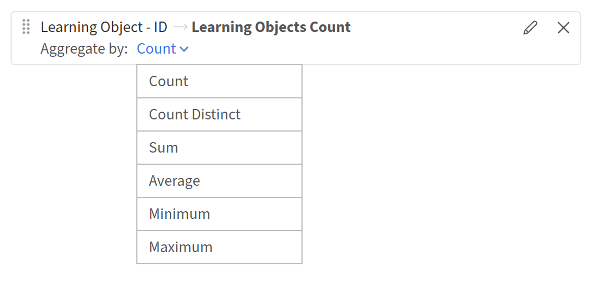
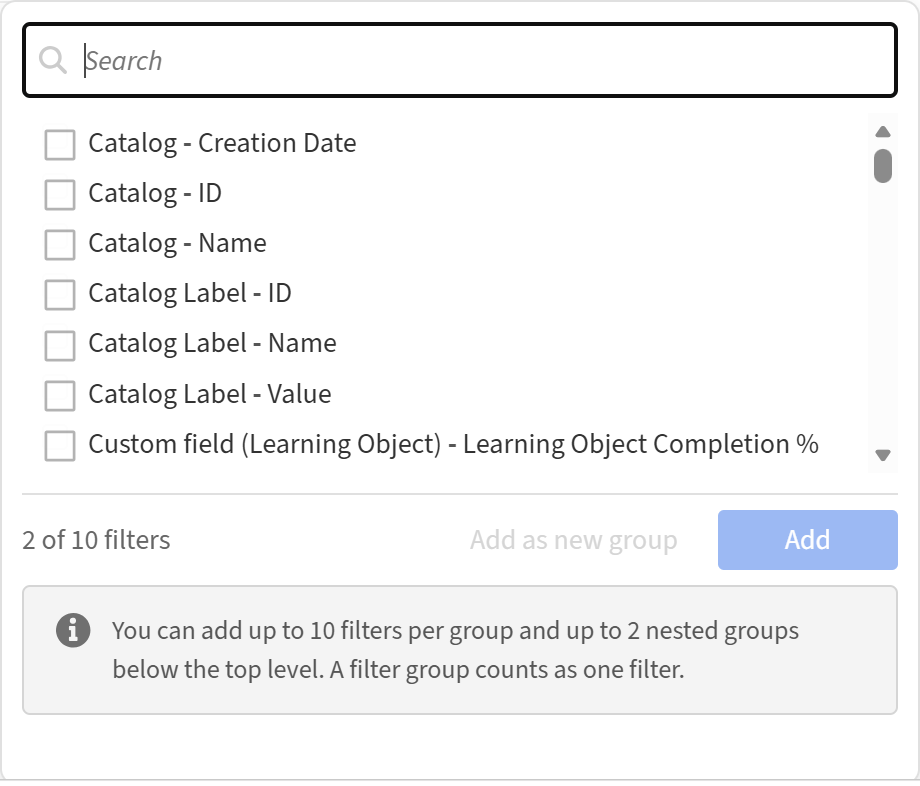
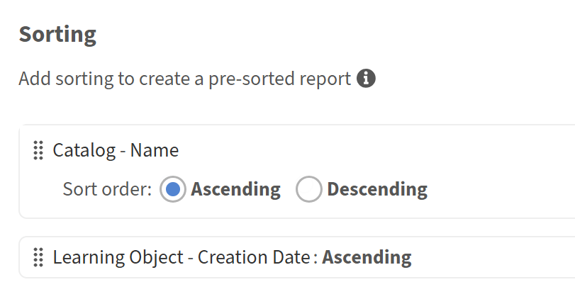

# Erste Schritte mit Report Builder

## Übersicht

Report Builder umfasst 15 vorgefertigte Vorlagen, die für die gängigsten Nutzungsszenarien in Bezug auf Lerndatenberichte entwickelt wurden. Jede Vorlage ist eine gebrauchsfertige Berichtskonfiguration mit Spalten, Filtern, Einstellungen für einzelne Gruppen und bereits angewendeter Sortierung. Vorlagen sind schreibgeschützt. Sie können sie in der Vorschau anzeigen oder duplizieren, um eine bearbeitbare Kopie zu erstellen.

## Vorlagen

Vorlagen sind gebrauchsfertige Berichtskonfigurationen, die von Adobe Learning Manager bereitgestellt werden. Jede Vorlage ist für einen bestimmten Anwendungsfall konzipiert, z. B. Registrierung und Abschlussverfolgung, Compliance-Berichte oder die Leistung von Kursleitern. Vorlagen werden unter der Registerkarte **Vorlagen** im Report Builder angezeigt. Jede Vorlage wird aus einem oder mehreren Datasets erstellt und erzeugt einen bestimmten Ausgabetyp. Um eine Vorlage anzupassen, wählen Sie **Duplizieren**, um eine bearbeitbare Kopie auf der Registerkarte **Berichte** zu erstellen, während das Original unverändert bleibt.

## Vorlagenkatalog

### Teilnehmertranskript

**Kategorie:** Transkripte, Abschluss- und Fortschrittsverfolgung

**Beschreibung:** Vollständiger Lernverlauf für jeden Teilnehmer, in dem alle Registrierungen, Status, Punktzahlen, Termine und die für alle Lernobjekttypen aufgewendete Zeit angezeigt werden.

**Verwenden Sie, wenn:** Sie einen vollständigen, revisionsfähigen Export der Teilnehmeraktivität für Compliance-Audits, Teilnehmer-Support-Fälle oder die Integration von ALM-Daten in ein externes System benötigen.

**Zielgruppen:** Kundenschulungen, Partnerschulungen, Mitarbeiterschulungen, Verkaufsförderung.

**Verwendete Datasets:** Benutzer, Lernobjekt, Transkript (Lernobjekt)

**Schlüsselspalten:** Benutzer-ID, Benutzername, Benutzer-E-Mail-Adresse, Name des Managers, Benutzerstatus, Name des Lernobjekts, Typ des Lernobjekts, Registrierungsdatum, Status, Fortschritt in Prozent, höchste Benutzerpunktzahl, Abschlussdatum, Überfällig, Zeitaufwand (Minuten)

**Filter angewendet:** Registrierungsdatum innerhalb des letzten Jahres; Catalog = Standardkatalog

### Übersicht über den Teilnehmerfortschritt

**Kategorie:** Transkripte, Abschluss- und Fortschrittsverfolgung

**Beschreibung:** Verfolgt den Fortschritt jedes Teilnehmers anhand der zugewiesenen Lernpfade und Kurse, einschließlich der Hierarchiezuordnung über die übergeordnete LO-ID.

**Verwenden Sie, wenn:** Sie sehen möchten, wo sich jeder Teilnehmer innerhalb eines Lernpfads befindet -* wer in Bearbeitung ist, wer überfällig ist und wer Gefahr läuft, eine Frist zu verpassen.

**Zielgruppen:** Kundenschulungen, Partnerschulungen, Mitarbeiterschulungen, Verkaufsförderung.

**Verwendete Datasets:** Benutzer, Lernobjekt, Transkript (Lernobjekt)

**Schlüsselspalten:** Benutzer-ID, Benutzername, Benutzer-E-Mail, Name des Managers, Lernobjekt-ID, Name des Lernobjekts, Typ des Lernobjekts, ID des übergeordneten Lernobjekts, Registrierungsdatum, Abschlussdatum, Status, Fortschritt in Prozent, Überfällig, Startdatum, Abschlussdatum

**Filter angewendet:** Registrierungsdatum innerhalb des letzten Jahres; Lernobjekttyp = Lernpfad oder Kurs; Catalog = Standardkatalog

### Dashboard für aktive Teilnehmer

**Kategorie:** Interaktion mit Teilnehmern und Nutzung der Plattform

**Beschreibung:** Monatliche Zusammenfassung der Plattforminteraktion pro Teilnehmer, die Kurse, auf die zugegriffen wurde, Abschlüsse und die insgesamt aufgewendete Zeit anzeigt.

**Verwenden Sie, wenn:** Sie möchten Ihre am stärksten und am wenigsten engagierten Teilnehmer im vergangenen Jahr identifizieren und sehen, wie sich die Interaktion Monat für Monat entwickelt.

**Zielgruppen:** Kundenschulungen, Partnerschulungen, Mitarbeiterschulungen, Verkaufsförderung.

**Verwendete Datasets:** Benutzer, Transkript (Lernobjekt)

**Schlüsselspalten:** Benutzer-ID, Benutzername, Benutzer-E-Mail-Adresse, Name des Managers, Benutzerstatus, Datum des letzten Zugriffs (Monat), Zugriff auf eindeutige Kurse, abgeschlossene Registrierungen, Gesamtzeit (Minuten)

**Filter angewendet:** Datum des letzten Zugriffs des Benutzers innerhalb des letzten Jahres; Benutzerstatus = Aktiv; Catalog = Standardkatalog

**Gruppe nach:** Benutzerfelder + Monat des letzten Zugriffsdatums

**Aggregate:** Eindeutige Anzahl für Lernobjekt-ID (Zugriff auf eindeutige Kurse), Anzahl, wenn Status = Abgeschlossen (abgeschlossene Registrierungen), Summe für aufgewendete Zeit (aufgewendete Gesamtzeit)

### Bericht über inaktive Teilnehmer

**Kategorie:** Interaktion mit Teilnehmern und Nutzung der Plattform

**Beschreibung:** Identifiziert aktive Benutzer ohne Plattformzugriff im letzten Jahr und zeigt ihre letzten Anmelde- und Abschlussdaten an.

**Verwenden Sie, wenn:** Sie nach inaktiven Konten für Kampagnen zur erneuten Interaktion, Lizenzüberprüfungen oder Kontobereinigungen suchen müssen.

**Zielgruppen:** Kundenschulungen, Partnerschulungen, Mitarbeiterschulungen, Verkaufsförderung.

**Verwendete Datasets:** Benutzer, Transkript (Lernobjekt)

**Schlüsselspalten:** Benutzer-ID, Benutzername, Benutzer-E-Mail-Adresse, Name des Managers, Erstellungsdatum des Benutzers, Datum des letzten Zugriffs des Benutzers, Datum der letzten Registrierung, Datum des letzten Abschlusses

**Filter angewendet:** Datum des letzten Zugriffs des Benutzers NICHT innerhalb des letzten Jahres; Benutzerstatus = Aktiv; Catalog = Standardkatalog

**Gruppe nach:** Benutzer-ID, Benutzername, Benutzer-E-Mail-Adresse, Name des Managers, Erstellungsdatum des Benutzers, Datum des letzten Zugriffs auf den Benutzer

**Aggregate:** Max. am Registrierungsdatum (letztes Registrierungsdatum), Max. am Abschlussdatum (letztes Abschlussdatum)

### Akzeptanz neuer Teilnehmer

**Kategorie:** Interaktion mit Teilnehmern und Nutzung der Plattform

**Beschreibung:** Verfolgt die Onboarding-Interaktion der im letzten Jahr erstellten Benutzer, z. B. Erstregistrierungen, Abschlüsse und Gesamtzahl der Kurse, auf die zugegriffen wurde.

**Verwenden Sie, wenn:** Sie messen möchten, wie schnell neue Benutzer von der Kontoerstellung zur ersten Registrierung und zum ersten Abschluss wechseln, eine wichtige Onboarding-Integritätsmetrik.

**Zielgruppen:** Kundenschulungen, Partnerschulungen, Mitarbeiterschulungen, Verkaufsförderung.

**Verwendete Datasets:** Benutzer, Transkript (Lernobjekt)

**Schlüsselspalten:** Benutzer-ID, Benutzername, Benutzer-E-Mail-Adresse, Name des Managers, Erstellungsdatum des Benutzers, Datum des letzten Zugriffs des Benutzers, Datum der ersten Registrierung, Datum des ersten Abschlusses, Gesamtzahl der Kurse, auf die zugegriffen wurde, Abgeschlossene Kurse

**Angewendete Filter:** Erstellungsdatum des Benutzers innerhalb des letzten Jahres; Benutzerstatus = Aktiv; Catalog = Standardkatalog

>[!NOTE]
>
>Diese Vorlage verwendet eine linke Verknüpfung zwischen Benutzer- und Transkript-Datasets, sodass Benutzer ohne Registrierung weiterhin im Bericht angezeigt werden. Dies ermöglicht es, neue Benutzer zu identifizieren, die noch nicht ihre Lernreise begonnen haben.

**Gruppe nach:** Benutzer-ID, Benutzername, Benutzer-E-Mail-Adresse, Name des Managers, Erstellungsdatum des Benutzers, Datum des letzten Zugriffs auf den Benutzer

**Aggregate:** Min. am Registrierungsdatum (Erstes Registrierungsdatum), Min. am Abschlussdatum (Erstes Abschlussdatum), Eindeutige Anzahl für Lernobjekt-ID (Gesamtzahl der Kurse, auf die zugegriffen wird), Anzahl, wenn Status = Abgeschlossen (Abgeschlossene Kurse)

### Lernen nach Benutzergruppe

**Kategorie:** Benutzer, Gruppen und Organisationsstruktur

**Beschreibung:** Vergleicht die Lernaktivität über die Organisationssegmente hinweg - aktive Teilnehmer, Kurse, auf die zugegriffen wurde, Abschlüsse und aufgewendete Zeit pro Gruppe.

**Verwenden Sie diese Option, wenn:** Sie die Interaktion abteilungsübergreifend, für Job-Funktionen oder für jede aktive, feldbasierte Benutzergruppe überprüfen möchten.

**Zielgruppen:** Kundenschulungen, Partnerschulungen, Mitarbeiterschulungen, Verkaufsförderung.

**Verwendete Datasets:** Benutzergruppe (aktives Feld), Transkript (Lernobjekt)

**Schlüsselspalten:** Benutzergruppen-ID, Name der Benutzergruppe, Mitgliederanzahl, Aktive Teilnehmer, Gesamtzahl der aufgerufenen eindeutigen Kurse, Abgeschlossene Registrierungen, Gesamtdauer (Minuten)

**Filter angewendet:** Registrierungsdatum innerhalb des letzten Jahres; catalog = Default Catalog; Benutzergruppe (aktives Feld) Name = Profil (aktives Feld)

**Gruppe nach:** Benutzergruppen-ID, Benutzergruppenname, Mitgliederanzahl

**Aggregate:** Eindeutige Anzahl für Benutzer-ID (aktive Teilnehmer), Eindeutige Anzahl für Lernobjekt-ID (Gesamtzahl der aufgerufenen eindeutigen Kurse), Anzahl, wenn Status = Abgeschlossen (abgeschlossene Registrierungen), Summe der aufgewendeten Zeit (Aufgewandte Gesamtzeit)

### Lernen nach Standort

**Kategorie:** Benutzer, Gruppen und Organisationsstruktur

**Beschreibung:** Vergleicht die Lernaktivität über verschiedene geografische Standorte hinweg - aktive Teilnehmer, Kurse, auf die zugegriffen wurde, Abschlüsse und aufgewendete Zeit pro Standort.

**Verwenden Sie Folgendes, wenn:** Sie müssen den Lernzustand über mehrere Regionen hinweg ohne manuelle Daten-Slicing-Tests vergleichen. Nützlich für globale Organisationen mit geografisch verteilten Teilnehmern.

**Zielgruppen:** Kundenschulungen, Partnerschulungen, Mitarbeiterschulungen, Verkaufsförderung.

**Verwendete Datasets:** Benutzergruppe (aktives Feld), Transkript (Lernobjekt)

**Schlüsselspalten:** Benutzergruppen-ID, Name der Benutzergruppe, Mitgliederanzahl, Aktive Teilnehmer, Gesamtzahl der aufgerufenen eindeutigen Kurse, Abgeschlossene Registrierungen, Gesamtdauer (Minuten)

**Filter angewendet:** Registrierungsdatum innerhalb des letzten Jahres; catalog = Default Catalog; Der Name der Benutzergruppe (aktives Feld) enthält &quot;Speicherort&quot;.

**Gruppe nach:** Benutzergruppen-ID, Benutzergruppenname, Mitgliederanzahl

**Aggregate:** Eindeutige Anzahl für Benutzer-ID (aktive Teilnehmer), Eindeutige Anzahl für Lernobjekt-ID (Gesamtzahl der aufgerufenen eindeutigen Kurse), Anzahl, wenn Status = Abgeschlossen (abgeschlossene Registrierungen), Summe der aufgewendeten Zeit (Aufgewandte Gesamtzeit)

### Learning by Manager

**Kategorie:** Benutzer, Gruppen und Organisationsstruktur

**Beschreibung:** fasst die Lernleistung der gesamten Teamhierarchie jedes Managers zusammen - aktive Teilnehmer, Abschlüsse und aufgewendete Zeit.

**Verwenden Sie, wenn:** Sie die Teaminteraktionen zwischen Managern vergleichen und Teams mit geringen Abschlussraten oder Zeitaufwand im Verhältnis zur Teamgröße identifizieren möchten.

**Zielgruppen:** Mitarbeiterschulung, Verkaufsförderung.

**Verwendete Datasets:** Benutzergruppe (Team), Transkript (Lernobjekt)

**Schlüsselspalten:** Manager-ID, Managername, Manager-E-Mail, Mitgliederzahl (gesamtes Team), Aktive Teilnehmer, Gesamtzahl der aufgerufenen eindeutigen Kurse, Abgeschlossene Registrierungen, Gesamtdauer (Minuten)

**Filter angewendet:** Registrierungsdatum innerhalb des letzten Jahres; Catalog = Standardkatalog

**Gruppe nach:** Eigentümer-ID (Manager-ID), Name des Eigentümers, E-Mail-Adresse des Eigentümers, Mitgliederzahl

**Aggregate:** Eindeutige Anzahl für Benutzer-ID (aktive Teilnehmer), Eindeutige Anzahl für Lernobjekt-ID (Gesamtzahl der aufgerufenen eindeutigen Kurse), Anzahl, wenn Status = Abgeschlossen (abgeschlossene Registrierungen), Summe der aufgewendeten Zeit (Aufgewandte Gesamtzeit)

>[!NOTE]
>
>Diese Vorlage verwendet den Dataset &quot;Benutzergruppe (Team)&quot;, der die gesamte Team-Hierarchie unter jedem Manager erfasst. Es ist kein zusätzlicher Benutzergruppenfilter erforderlich.

### Registrierungszusammenfassung

**Kategorie:** Transkripte, Abschluss- und Fortschrittsverfolgung

**Beschreibung:** Die Anzahl der Registrierungen auf Kursebene wird für jedes Lernobjekt nach Status - abgeschlossen, in Bearbeitung und nicht gestartet - aufgeschlüsselt.

**Verwenden Sie Folgendes, wenn:** Sie für jeden Kurs eine kurze Ansicht des Registrierungstrichters wünschen: wie viele Teilnehmer begonnen haben, wie viele in Bearbeitung sind und wie viele bereits abgeschlossen sind.

**Zielgruppen:** Kundenschulungen, Partnerschulungen, Mitarbeiterschulungen, Verkaufsförderung.

**Verwendete Datasets:** Lernobjekt, Transkript (Lernobjekt)

**Schlüsselspalten:** Lernobjekt-ID, Lernobjektname, Lernobjekttyp, Lernobjektstatus, Gesamtzahl der registrierten Teilnehmer, abgeschlossene Registrierungen, In Bearbeitung befindliche Registrierungen, nicht gestartete Registrierungen

**Filter angewendet:** Registrierungsdatum innerhalb des letzten Jahres; Catalog = Standardkatalog

**Gruppe nach:** Lernobjekt-ID, Name, Typ, Status

**Aggregate:** Anzahl eindeutig für Benutzer-ID (insgesamt registrierte Teilnehmer), Anzahl, wenn Status = Abgeschlossen, Anzahl, wenn Status = In Bearbeitung, Anzahl, wenn Status = Nicht gestartet

### Trendanalyse für Registrierung

**Kategorie:** Transkripte, Abschluss- und Fortschrittsverfolgung

**Beschreibung:** Anzahl der monatlichen Registrierungen und Abschlüsse pro Lernobjekt, die zeigt, wie sich die Teilnehmeraufnahme im Laufe der Zeit entwickelt.

**Verwenden Sie Folgendes, wenn:** Sie sehen möchten, wann die Registrierung für jeden Kurs sprunghaft ansteigt und nachlässt und ob Abschlüsse auf Registrierungen im selben Monat folgen.

**Zielgruppen:** Kundenschulungen, Partnerschulungen, Mitarbeiterschulungen, Verkaufsförderung.

**Verwendete Datasets:** Lernobjekt, Transkript (Lernobjekt)

**Schlüsselspalten:** Name des Lernobjekts, Typ des Lernobjekts, Registrierungsdatum (Monat), Gesamtzahl der registrierten Teilnehmer, abgeschlossene Registrierungen

**Filter angewendet:** Registrierungsdatum innerhalb des letzten Jahres; Catalog = Standardkatalog

**Gruppe nach:** Lernobjektname, Lernobjekttyp, Monat des Registrierungsdatums

**Aggregate:** Eindeutige Anzahl für Benutzer-ID (insgesamt registrierte Teilnehmer), Anzahl, wenn Status = Abgeschlossen (abgeschlossene Registrierungen)

### Kursabschlussbericht

**Kategorie:** Transkripte, Abschluss- und Fortschrittsverfolgung

**Beschreibung:** Aufschlüsselung des Abschlusses pro Kurs mit Statuszählungen, dem Datum des letzten Abschlusses, dem durchschnittlichen Fortschritt und der durchschnittlichen aufgewendeten Zeit.

**Verwenden Sie diese Option, wenn:** Sie nicht leistungsfähige Inhalte identifizieren möchten - Kurse mit hoher Registrierung, aber geringem Abschluss oder Kurse, bei denen der durchschnittliche Fortschritt gering ist (was auf eine vorzeitige Beendigung hinweist).

**Zielgruppen:** Kundenschulungen, Partnerschulungen, Mitarbeiterschulungen, Verkaufsförderung.

**Verwendete Datasets:** Lernobjekt, Transkript (Lernobjekt)

**Schlüsselspalten:** Lernobjekt-ID, Lernobjektname, Lernobjekttyp, Lernobjektstatus, Gesamtzahl der registrierten Teilnehmer, Abgeschlossene Registrierungen, In Bearbeitung befindliche Registrierungen, Nicht gestartete Registrierungen, Datum des letzten Abschlusses, Durchschnittlicher Fortschritt %, Durchschnittliche Zeit (Minuten)

**Filter angewendet:** Registrierungsdatum innerhalb des letzten Jahres; Catalog = Standardkatalog

**Gruppe nach:** Lernobjekt-ID, Name, Typ, Status

**Aggregate:** Anzahl eindeutig für Benutzer-ID, Anzahl, wenn Status = Abgeschlossen/In Bearbeitung/Nicht gestartet, Maximum am Abschlussdatum, Durchschnitt für Fortschritt in Prozent, Durchschnitt für Zeit, die verbraucht wurde

### Trend Dashboard zum Abschluss

**Kategorie:** Transkripte, Abschluss- und Fortschrittsverfolgung

**Beschreibung:** Die Anzahl der monatlichen Abschlüsse pro Lernobjekt, mit durchschnittlichem Zeitaufwand und Fortschritt, beschränkt auf abgeschlossene Registrierungen.

**Verwenden Sie diese Option, wenn:** Sie verfolgen möchten, ob die Abschlussraten von Monat zu Monat steigen und ob Teilnehmer, die dies abschließen, dies gründlich erledigen oder sich schnell durchsetzen.

**Zielgruppen:** Kundenschulungen, Partnerschulungen, Mitarbeiterschulungen, Verkaufsförderung.

**Verwendete Datasets:** Lernobjekt, Transkript (Lernobjekt)

**Schlüsselspalten:** Name des Lernobjekts, Typ des Lernobjekts, Abschlussdatum (Monat), Gesamtzahl abgeschlossener Teilnehmer, durchschnittliche Zeit (Minuten), durchschnittlicher Fortschritt %

**Filter angewendet:** Abschlussdatum innerhalb des letzten Jahres; Status = Abgeschlossen; Catalog = Standardkatalog

**Gruppe nach:** Lernobjektname, Lernobjekttyp, Abschlussmonat

**Aggregate:** Anzahl eindeutig für Benutzer-ID (Gesamtzahl abgeschlossener Teilnehmer), Durchschnitt für aufgewendete Zeit, Durchschnitt für Fortschritt in Prozent

>[!NOTE]
>
>Diese Vorlage wird vor der Gruppierung auf den Status Abgeschlossen gefiltert, wodurch sichergestellt wird, dass nur Datensätze mit einem gültigen Abschlussdatum enthalten sind und dass Nulldaten den monatlichen Trend nicht verzerren.

### Zeit bis zum Abschluss

**Kategorie:** Transkripte, Abschluss- und Fortschrittsverfolgung

**Beschreibung:** Misst die tatsächlich aufgewendete Zeit für den Abschluss jedes Kurses, den Durchschnitt, das Minimum und das Maximum im Vergleich zur entworfenen Dauer.

**Verwenden Sie diese Option, wenn:** Sie Kurse identifizieren möchten, bei denen die Teilnehmer deutlich länger oder kürzer als erwartet dauern, bis sie abgeschlossen sind. Dies kann auf Probleme mit der Inhaltslänge oder auf Schwierigkeiten hinweisen.

**Zielgruppen:** Kundenschulungen, Partnerschulungen, Mitarbeiterschulungen, Verkaufsförderung.

**Verwendete Datasets:** Lernobjekt, Transkript (Lernobjekt)

**Schlüsselspalten:** Lernobjekt-ID, Lernobjektname, Lernobjekttyp, Dauer (Minuten, Entwurf), Gesamtzahl abgeschlossener Teilnehmer, Durchschnittliche aufgewendete Zeit (Minuten), Mindestdauer (Minuten), Maximale aufgewendete Zeit (Minuten)

**Filter angewendet:** Abschlussdatum innerhalb des letzten Jahres; Status = Abgeschlossen; Catalog = Standardkatalog

**Gruppe nach:** Lernobjekt-ID, Name, Typ, Dauer (Minuten)

**Aggregate:** Anzahl eindeutig für Benutzer-ID, Durchschnitt/Min/Max für aufgewendete Zeit

**Hinweis:** Die Dauer (die entworfene Kurslänge) ist in &quot;Gruppieren nach&quot; enthalten, sodass sie in derselben Zeile wie die tatsächlich aufgewendete Zeit angezeigt wird. Dies ermöglicht einen direkten Vergleich ohne ein berechnetes Feld. Eine große Lücke zwischen Min. und Max. aufgewendeter Zeit deutet auf inkonsistente Lernerlebnisse hin.

### Überfällige Lernzuweisungen

**Kategorie:** Compliance und Zertifizierung

**Beschreibung:** Führt aktive Benutzer mit überfälligen obligatorischen Registrierungen auf, wobei Fristablauf, aktueller Status und Fortschritt für jeden Benutzer angezeigt werden.

**Verwenden Sie diese Option, wenn:** Sie eine verwertbare Liste von nicht-kompatiblen Teilnehmern benötigen, um zu Managern zu eskalieren oder Workflows für die erneute Registrierung auszulösen.

**Zielgruppen:** Partnerschulungen, Mitarbeiterschulungen, Verkaufsförderung.

**Verwendete Datasets:** Benutzer, Benutzergruppe (aktives Feld), Lernobjekt, Transkript (Lernobjekt)

**Schlüsselspalten:** Benutzer-ID, Benutzername, Benutzer-E-Mail-Adresse, Name des Managers, Name der Benutzergruppe (aktives Feld), Lernobjekt-ID, Name des Lernobjekts, Typ des Lernobjekts, Registrierungsdatum, Abschlussdatum, Status, Fortschritt in Prozent, Überfällig

**Angewendete Filter:** Überfällig = Ja; Status = In Bearbeitung ODER nicht gestartet; Ausfülltermin innerhalb des letzten Jahres; catalog = Default Catalog; Benutzerstatus = Aktiv; Benutzergruppe (aktives Feld) Name = Profil (aktives Feld)

**Keine Gruppe angewendet** Die Ausgabe beträgt eine Zeile pro überfälliger Registrierung, wobei die vollständigen Teilnehmer- und Kursdetails für eine Eskalation beibehalten werden.

>[!NOTE]
>
>Der Statusfilter (In Bearbeitung ODER nicht gestartet) dient als Absicherung, um alle Datensätze auszuschließen, die trotz Abschluss fälschlicherweise als überfällig markiert wurden.

### Pflichtschulungsstatus

**Kategorie:** Compliance und Zertifizierung

**Beschreibung:** Vollständige Kompatibilitätsansicht aller Registrierungen mit einer Abschlussfrist, wobei alle Status enthalten sind und nicht nur überfällig sind.

**Verwenden Sie, wenn:** Sie benötigen ein vollständiges Bild zur Compliance, anstatt nur Verstöße zu zeigen, um beispielsweise die obligatorischen Gesamtschulungsabschlussraten an Führungskräfte zu melden.

**Zielgruppen:** Mitarbeiterschulung, Verkaufsförderung.

**Verwendete Datasets:** Benutzer, Benutzergruppe (aktives Feld), Lernobjekt, Transkript (Lernobjekt)

**Schlüsselspalten:** Benutzer-ID, Benutzername, Benutzer-E-Mail, Name des Managers, Name der Benutzergruppe (aktives Feld), Lernobjekt-ID, Name des Lernobjekts, Typ des Lernobjekts, Registrierungsdatum, Abschlussdatum, Abschlussdatum, Status, Fortschritt in Prozent, Überfällig

**Filter angewendet:** Ausfülltermin ist nicht leer; Registrierungsdatum innerhalb des letzten Jahres; catalog = Default Catalog; Benutzerstatus = Aktiv; Benutzergruppe (aktives Feld) Name = Profil (aktives Feld)

**Keine Gruppe angewendet** Alle Status eingeschlossen (abgeschlossen, in Bearbeitung, nicht gestartet, überfällig), wodurch ein vollständiges Bild der Konformität entsteht.

**Hinweis:** Das Filtern nach &quot;Abschlussdatum ist nicht leer&quot; ist die Schlüssellogik, die obligatorische Schulungen für alle Kurstypen einheitlich identifiziert, unabhängig davon, wie der obligatorische Status konfiguriert ist.

## Schnellverweis auf Vorlage

| **#** | **Vorlagenname** | **Kategorie** | **Internes EDU** | **Extern (Kunde/Partner) edu** |
|--------|------------------------------|-------------------------------------|------------------|-------------------------------------|
| 1 | Teilnehmertranskript | Transkripte, Abschluss und Fortschritt | ✓ | ✓ |
| 2 | Übersicht über den Teilnehmerfortschritt | Transkripte, Abschluss und Fortschritt | ✓ | ✓ |
| 3 | Dashboard für aktive Teilnehmer | Engagement und Plattformnutzung von Teilnehmenden | ✓ | ✓ |
| 4 | Bericht über inaktive Teilnehmer | Engagement und Plattformnutzung von Teilnehmenden | ✓ | ✓ |
| 5 | Akzeptanz neuer Teilnehmer | Engagement und Plattformnutzung von Teilnehmenden | ✓ | ✓ |
| 6 | Lernen nach Benutzergruppe | Benutzer, Gruppen und Organisationsstruktur | ✓ | ✓ |
| 7 | Lernen nach Standort | Benutzer, Gruppen und Organisationsstruktur | ✓ | ✓ |
| 8 | Learning by Manager | Benutzer, Gruppen und Organisationsstruktur | ✓ | ✗ |
| 9 | Registrierungszusammenfassung | Transkripte, Abschluss und Fortschritt | ✓ | ✓ |
| 10 | Trendanalyse für Registrierung | Transkripte, Abschluss und Fortschritt | ✓ | ✓ |
| 11 | Kursabschlussbericht | Transkripte, Abschluss und Fortschritt | ✓ | ✓ |
| 12 | Trend Dashboard zum Abschluss | Transkripte, Abschluss und Fortschritt | ✓ | ✓ |
| 13 | Zeit bis zum Abschluss | Transkripte, Abschluss und Fortschritt | ✓ | ✓ |
| 14 | Überfällige Lernzuweisungen | Vorgabeneinhaltung und Zertifizierung | ✓ | ✓ |
| 15 | Pflichtschulungsstatus | Vorgabeneinhaltung und Zertifizierung | ✓ | ✗ |

## Verwenden einer Report Builder-Vorlage

Richten Sie in Adobe Learning Manager Report Builder schnell eine vordefinierte Vorlage für häufige Nutzungsszenarien für das Reporting ein.

1. Melden Sie sich bei Adobe Learning Manager als Administrator an.
2. Wählen Sie im linken Fensterbereich **Berichte** und anschließend **Report Builder** aus.

3. Wählen Sie die Registerkarte **Vorlagen** aus.
4. Durchsuchen Sie die verfügbaren Vorlagen. Jede Vorlage wird nach ihrem Anwendungsfall benannt.

   

5. Wählen Sie einen Vorlagennamen aus, um die schreibgeschützte Vorschau zu öffnen. Wählen Sie für dieses Beispiel die Vorlage &quot;**Compliance %&quot; für das Team &quot;**&quot; des Benutzers. Überprüfen Sie die Spalten, angewendeten Filter und die Sortierreihenfolge.
6. Wählen Sie **Duplicate**.

   

Wenn Sie eine Vorlage duplizieren, öffnet der Report Builder eine bearbeitbare Kopie mit der bereits vorhandenen Vorlagenkonfiguration. Der Name, die Beschreibung, die Spalten, die Filter und die Sortierung des Berichts können vor dem Speichern bearbeitet werden.

## Benennen und Beschreiben des Berichts

1. Ersetzen Sie im Feld **Name** den Standardnamen (z. B. *Kopie von Compliance % für das Team des Benutzers*) durch einen eindeutigen Namen für Ihren Bericht. Ein Name ist erforderlich.
2. Geben Sie im Feld **Beschreibung** eine kurze Zusammenfassung des Inhalts des Berichts ein. Dies hilft anderen Administratoren, den Zweck des Berichts beim Anzeigen oder Bearbeiten zu verstehen.

## Spalten hinzufügen und konfigurieren

Der Abschnitt **Spalten** verfügt über zwei Bereiche: **Spalten** links auswählen und **Ausgewählte Spalten** rechts auswählen.

### Hinzufügen einer Spalte

1. Erweitern Sie im Bereich **Spalten** auswählen ein Dataset, indem Sie seinen Namen auswählen. Beispiel: **Katalog** oder **Gruppe aktiver Feldbenutzer**.
2. Wählen Sie das Symbol **+** neben der Spalte aus, die Sie hinzufügen möchten. Die Spalte wird im Bereich **Ausgewählte Spalten** auf der rechten Seite angezeigt.

   

3. Um dieselbe Spalte mehrmals hinzuzufügen. Sie können beispielsweise zwei verschiedene Aggregate auf ein und dasselbe Feld anwenden. Wählen Sie **+** erneut für diese Spalte aus.

### Neuordnen von Spalten

Ziehen Sie den Griff links neben einer beliebigen Spaltenzeile im Bedienfeld &quot;**Ausgewählte Spalten**&quot;, um sie an eine andere Position zu verschieben. Die Spaltenreihenfolge im Bereich stimmt mit der im heruntergeladenen Bericht überein.

### Umbenennen einer Spalte

1. Wählen Sie das Symbol **Bearbeiten** (Bleistift) in einer Spaltenzeile aus.

   

2. Geben Sie einen Alias ein. Der Alias wird im heruntergeladenen Bericht als Spaltenüberschrift anstelle des Standardfeldnamens angezeigt.

   

### Entfernen einer Spalte

Wählen Sie das Symbol **x** in einer Spaltenzeile aus, um sie aus dem Bericht zu entfernen.

## Gruppe anwenden nach

Das Steuerelement **Gruppe nach** wird oben im Bereich **Ausgewählte Spalten** angezeigt.

1. Wählen Sie **Gruppieren nach: Wählen Sie** aus.

   

2. Wählen Sie die Spalten aus, nach denen gruppiert werden soll. Sie können mehrere auswählen. Im Screenshot ist der Bericht nach Benutzergruppe (Team) - Name und Benutzergruppe (Team) - Name des Eigentümers gruppiert.
3. Jede ausgewählte Gruppe-für-Spalte wird als Tag unter dem Steuerelement **Gruppe nach** angezeigt. Um eine Gruppe nach Spalte zu entfernen, wählen Sie im Tag **x** aus.

>[!NOTE]
>
>Wenn group by angewendet wird, muss auf jede Spalte, die keine group by -Spalte ist, eine Aggregatfunktion angewendet werden. Eine Spalte ohne Aggregat verursacht einen Fehler.

### Anwenden von Aggregaten auf Spalten

1. Wählen Sie in einer beliebigen Spalte, die nicht gruppiert ist, im Bereich **Ausgewählte Spalten** die Option **Aggregieren nach** aus.
2. Wählen Sie eine Funktion aus der Dropdown-Liste aus. Im Screenshot verwendet **Lernobjektzählung** **Anzahl Distinct**, alimiert als count_of_courses.

   

Verfügbare Aggregatfunktionen:

| **Funktion** | **Zurückgegebene Werte** |
|--------------------|---------------------------------------------|
| **Anzahl** | Gesamtanzahl der Zeilen in der Gruppe |
| **Unterschied zählen** | Anzahl der eindeutigen Werte in der Gruppe |
| **Anzahl, wenn** | Anzahl der Zeilen, die einem von Ihnen angegebenen Wert entsprechen |
| **Summe** | Summe eines numerischen Felds in der Gruppe |
| **Min.** | Niedrigster Wert in der Gruppe |
| **Max** | Höchster Wert in der Gruppe |
| **Durchschnitt** | Mittlerer Wert innerhalb der Gruppe |

## Filter anwenden

Der Abschnitt **Filter** befindet sich unter dem Abschnitt **Spalten**. Filter beschränken, welche Zeilen im Bericht angezeigt werden.

1. Um einen Filter hinzuzufügen, wählen Sie das Symbol **+** rechts neben dem Abschnitt &quot;Filter&quot; aus.
2. Wählen Sie das Feld aus, nach dem gefiltert werden soll.

   

3. Wählen Sie einen Operator und geben Sie einen Wert ein bzw. wählen Sie einen Wert.

Um einen vorhandenen Filter zu bearbeiten, wählen Sie das Symbol **Stift** in der Filterzeile aus. Um eine verschachtelte Filtergruppe hinzuzufügen, wählen Sie das **+**-Symbol mit Klammern rechts neben einer Filterzeile aus.

## **Sortierung konfigurieren**

Der Abschnitt **Sortieren** befindet sich unter dem Abschnitt **Filter**.

1. Wählen Sie **+ Sortierung hinzufügen**, um eine Sortierung hinzuzufügen.
2. Wählen Sie die Spalte aus, nach der sortiert werden soll, und wählen Sie **Aufsteigend** oder **Absteigend** aus.

   

3. Wiederhole den Vorgang, um eine zweite Sortierfolge hinzuzufügen. Ziehen Sie den Griff links neben jeder Sortierzeile, um die Priorität zu ändern.

>[!TIP]
>
>Wenden Sie immer mindestens eine Sortierung an. Ohne Sortierung kann die Zeilenreihenfolge bei den Downloads desselben Berichts abweichen.

## Bericht speichern

Wählen Sie in der oberen rechten Ecke **Bericht speichern** aus. Der Bericht wird auf der Registerkarte **Berichte** gespeichert und kann jetzt heruntergeladen werden.

## Best Practices

* Verwenden Sie Aliase in jeder Spalte, damit der heruntergeladene Bericht sinnvolle Kopfzeilen anstelle von Feldnamen wie Lernobjekt-/Lernobjekt-ID enthält.
* Verwenden Sie **Count Distinct** anstelle von **Count**, wenn Sie eindeutige Datensätze wünschen, z. B. eindeutige Kurse pro Katalog anstelle von Gesamtzeilen.

* Sortieren Sie sie vor dem Speichern, insbesondere für Berichte, die Sie freigeben oder abonnieren.
* Halten Sie die Beschreibung auf dem neuesten Stand. Andere Administratoren verlassen sich darauf, dass sie den Umfang des Berichts verstehen, ohne ihn zu öffnen.
