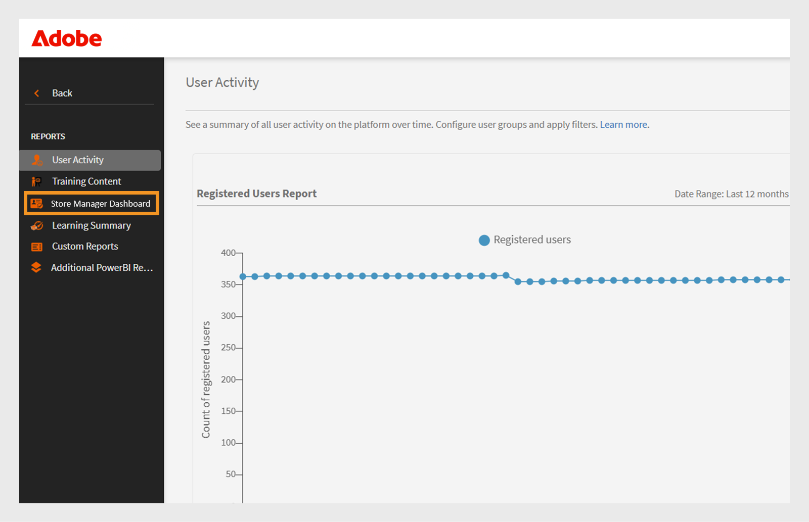

# Dashboard für den Gruppenerfolg

## Übersicht über das Group Success Dashboard

Das Group Success Dashboard (GSD) in Adobe Learning Manager ermöglicht es Administratoren und Managern, den Fortschritt der Teilnehmer nahezu in Echtzeit zu überwachen (60 Minuten Verzögerung von der Registrierung, dem Fortschritt oder dem Abschluss bis hin zur Anzeige im Dashboard). Dies geschieht abteilungsübergreifend oder für Benutzergruppen. Es unterstützt die proaktive Verfolgung von Kursabschluss, Registrierung und ausstehenden Aktionen und erleichtert so die Verwaltung des Lernprozesses für Teams. In diesem [Artikel](/help/migrated/administrators/feature-summary/add-users-user-groups.md) erfahren Sie mehr über Benutzergruppen.

## Wichtige Nutzungsszenarien

Das Gruppen-Erfolgs-Dashboard bietet Folgendes:

* **Vereinfacht die Verfolgung des Teilnehmerfortschritts**: Das Gruppen-Erfolgs-Dashboard bietet eine benutzerfreundliche Echtzeit-Ansicht der Teilnehmerdaten, wodurch die Notwendigkeit Excel-basierter Transkripte reduziert wird. Manager und Administratoren können die Registrierungen von Teilnehmern und den Kursfortschritt schnell anzeigen, um wichtige Szenarien zu unterstützen, wie z. B.:

   * **Bereitschaft zur Leistungsüberprüfung**: Manager können den Kursfortschritt für Teammitglieder im Vorfeld von Bewertungszyklen bewerten.
   * **Konformitätsüberwachung**: Ermitteln Sie Teilnehmer, die keine obligatorischen Schulungen abgeschlossen haben.
   * **Verfolgung auf Teamebene**: Franchise-, Filial- oder regionale Manager können sicherstellen, dass ihre Teams die erforderlichen Schulungen pünktlich abschließen.

* **Erleichtert die Teamverwaltung**: Das Group Success Dashboard ist nützlich für Manager mit kleinen Teams (unter 50 Personen), wie Filialleiter, Franchise-Manager, Händler-Manager oder interne Teams. Sie bietet eine Teamansicht und ermöglicht es Managern, schnell zu überprüfen, ob ihr Team die erforderlichen Kurse absolviert hat, um die Geschäftsziele zu erreichen.

## So verwenden Sie das Group Success Dashboard

Ein Administrator kann die Dashboards aktivieren und erstellen, indem er ihnen einen Namen gibt, Benutzergruppen und die Kurse oder Lernpfade auswählt. Die Dashboards können für andere Administratoren oder Manager freigegeben werden.

### Aktivieren Sie das Dashboard für den Gruppenerfolg.

Der Administrator muss das Gruppen-Erfolgs-Dashboard für das Konto aktivieren. Führen Sie die folgenden Schritte aus, um das Group Success Dashboard zu aktivieren:

1. Melden Sie sich als Administrator an.
2. Wählen Sie **[!UICONTROL Einstellungen]** und anschließend **[!UICONTROL Berichte]** aus.
3. Wählen Sie den Schalter **[!UICONTROL Dashboard-Sichtbarkeit]**.
4. Geben Sie den Dashboard-Namen ein (z. B. **[!UICONTROL Store Manager Dashboard]**).
   
   _Felder für Dashboardname, Benutzergruppe und Lernpfadauswahl_
5. Wählen Sie **[!UICONTROL Übersichtssichtbarkeit]**, um den Übersichtsabschnitt im Dashboard zu aktivieren. In diesem Abschnitt können Sie den Fortschritt von bis zu 50 Teilnehmern anzeigen.
6. Wählen Sie im Abschnitt **[!UICONTROL Teilnehmertranskript]** die erforderlichen Spalten aus, die Sie anzeigen möchten.

   * Teilnehmer
   * Pfade und Kurse
   * Status
   * Registrierungsdatum
   * Datum des letzten Zugriffs
   * Abschlussdatum

Nach dem Aktivieren dieser Funktion können Administratoren das Group Success Dashboard im Abschnitt **[!UICONTROL Berichte]** anzeigen.

### Erstellen eines Dashboards für den Gruppenerfolg

Administratoren können bis zu 100 Dashboards erstellen, um den Fortschritt der Teilnehmer anzuzeigen. Um ein Dashboard zu erstellen, führen Sie die folgenden Schritte aus:

1. Melden Sie sich als Administrator an und wählen Sie die Seite **[!UICONTROL Berichte]** aus.

   
   _Berichte auf der Administrator-Startseite auswählen_

2. Wählen Sie das Gruppen-Erfolgs-Dashboard aus. Der Name des Dashboards ist **[!UICONTROL Store Manager-Dashboard]**.

   
   _Store Manager-Dashboard auswählen_

   >[!NOTE]
   >
   >Der Name, den Sie beim Aktivieren des Group Success Dashboard festgelegt haben, wird als Dashboard-Name angezeigt.

3. Wählen Sie **[!UICONTROL Neues Dashboard erstellen]** aus der Dropdown-Liste Dashboard auswählen aus.

   
   _Wählen Sie die Option zum Erstellen einer GSD aus_

4. Geben Sie den Namen des Dashboards ein.
5. Wählen Sie eine Benutzergruppe aus, die im Dashboard angezeigt werden soll.
6. Suchen Sie die Kurse oder Lernpfade und wählen Sie sie aus den Ergebnissen aus.

   
   _Benutzergruppe und Kurse auswählen_

7. Wählen Sie **[!UICONTROL Dashboard erstellen]**.

Erstellen Sie für größere Teams ein Dashboard, indem Sie auf der Registerkarte **[!UICONTROL Teilnehmertranskript]** die Benutzergruppe **Standardkatalog** und **Alle Teilnehmer** auswählen. Dies umfasst alle Kurse und Teilnehmer in der Ansicht **[!UICONTROL Teilnehmertranskript]**, sodass es einfacher ist, nach dem Fortschritt jedes Teilnehmers zu suchen und ihn zu verfolgen.

### Das Dashboard für den Gruppenerfolg anzeigen

Nach dem Erstellen eines Dashboards kann der Administrator das Dashboard wie folgt anzeigen:

1. Melden Sie sich als Administrator an.
2. Wählen Sie **[!UICONTROL Berichte]** und anschließend **[!UICONTROL Dashboard für den Gruppenerfolg]**.
Der Name des Dashboards lautet Store Manager Dashboard.
3. Wählen Sie im Abschnitt **[!UICONTROL Ihre Dashboards]** das erstellte Dashboard aus der Dropdown-Liste **[!UICONTROL Dashboard auswählen]** aus.
4. Das Dashboard ist unterteilt in:
   * **[!UICONTROL Übersicht]**: Sie können den Fortschritt der Teilnehmer bei einzelnen Kursen oder Lernpfaden schnell anzeigen. Sie können den Fortschritt mit bis zu 50 Kursen oder Lernpfaden und 50 Teilnehmern gleichzeitig anzeigen. Wenn Sie den Fortschritt eines bestimmten Teilnehmers überprüfen möchten, wählen Sie den Abschnitt **[!UICONTROL Teilnehmertranskript]** aus.

   
   _Lernstatus der Teilnehmer im Team des Filialleiters_

   * **[!UICONTROL Teilnehmertranskript]**: Zeigen Sie den Teilnehmerfortschritt an, indem Sie einen bestimmten Teilnehmer oder Kurs auswählen. Suchen Sie im Dashboard nach einem Teilnehmer, um dessen Lernfortschritt zu überprüfen. Wenn Sie das Dashboard mithilfe des Standardkatalogs erstellt und alle Teilnehmer einbezogen haben, können Sie nach jedem Teilnehmer suchen, um dessen Fortschritt einfach zu überprüfen.

   
   _Detaillierte Teilnehmertranskriptansicht mit Spalten für Registrierung und Abschluss_

>[!NOTE]
>
>Um das detaillierte Teilnehmertranskript herunterzuladen, wählen Sie **[!UICONTROL Zum Bericht wechseln]** auf der Registerkarte **[!UICONTROL Teilnehmertranskript]**.

### Freigeben des Dashboards für den Gruppenerfolg

Administratoren können Dashboards mit anderen Administratoren oder Managern teilen. Führen Sie die Schritte aus, um ein Dashboard freizugeben:

1. Wählen Sie **[!UICONTROL Berichte]** und anschließend **[!UICONTROL Dashboard für den Gruppenerfolg]**. Der Name des Dashboards ist **[!UICONTROL Store Manager-Dashboard]**.
2. Wählen Sie **[!UICONTROL Freigeben]** in der Option **[!UICONTROL Ihre Dashboards]**.

   
   _Schaltfläche &quot;Freigeben&quot; auswählen_

3. Suchen Sie anhand des Namens nach Benutzern oder Benutzergruppen und wählen Sie diese aus.

   
   _Dashboard für Benutzer oder Benutzergruppen freigeben_

4. Wählen Sie **[!UICONTROL Weiter]**, um das Dashboard freizugeben.

Sie können die freigegebenen Dashboard-Details unter **[!UICONTROL Berichte]** sehen, **[!UICONTROL Dashboard für den Gruppenerfolg]** (Store Manager-Dashboard) auswählen und dann **[!UICONTROL Freigegebene Dashboards]** auswählen.

_Freigegebenes Dashboard anzeigen_

>[!NOTE]
>
>Der Manager oder benutzerdefinierte Administrator kann die aktivierten Kataloge nur im vom Administrator freigegebenen Gruppen-Erfolgs-Dashboard sehen.

### Einschränkungen des Gruppen-Erfolgs-Dashboards

Im Folgenden sind die Einschränkungen des Group Success Dashboard aufgeführt:

* Wiederkehrende Zertifikate werden im Dashboard nicht unterstützt.
* In der Spalte **[!UICONTROL Datum des letzten Zugriffs]** auf der Registerkarte **[!UICONTROL Teilnehmertranskript]** werden derzeit Daten für Lernpfade und Zertifizierungen angezeigt. Der Support für Kurse ist für ein zukünftiges Update geplant.

## Auswählen von Teilnehmern über mehrere Benutzergruppen hinweg

Wenn Sie mehr als eine Benutzergruppe auswählen, verwendet Adobe Learning Manager bestimmte Regeln, um zu bestimmen, welche Teilnehmer einbezogen werden sollen:

* **Benutzergruppen mit demselben aktiven Feld**: Wenn die Benutzergruppen dasselbe Feld verwenden (z. B. Speicherort), enthält das System alle Teilnehmer aus beiden Gruppen. Es kombiniert die Werte. Beispiel: **Location = Bangalore** und **Location = Chennai**. Es enthält Teilnehmer aus beiden Standorten.
* **Benutzergruppen mit unterschiedlichen aktiven Feldern**: Wenn die Benutzergruppen unterschiedliche Felder verwenden (z. B. Speicherort und Rolle), enthält das System nur Teilnehmer, die alle Bedingungen erfüllen. Beispiel: **Standort = Bangalore oder Chennai** und **Rolle = Manager**. Es umfasst nur Teilnehmer, die die Managerrolle haben und in Bangalore oder Chennai ansässig sind.

**Zusammenfassung:**

* Gleiches aktives Feld: Teilnehmer werden kombiniert (ODER-Logik)
* Verschiedene aktive Felder: Teilnehmer müssen alle Kriterien erfüllen (UND-Logik)

Mit diesem Ansatz können Sie die richtigen Teilnehmer basierend auf Ihren ausgewählten Bedingungen ansprechen.
