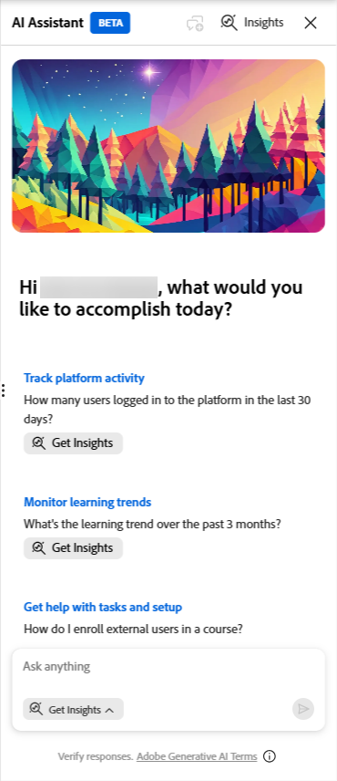
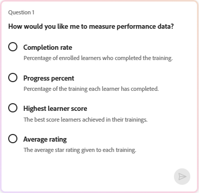
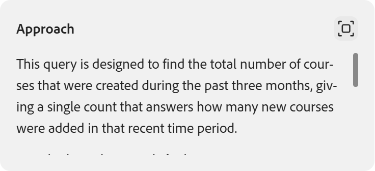

# Was ist der Insights Agent?

Insights Agent ist eine KI-gestützte Funktion in Adobe Learning Manager, mit der Administratoren Lerndaten in natürlicher Sprache abfragen können. Anstatt Berichte herunterzuladen und Tabellenkalkulationen zu bearbeiten, geben Sie eine Frage ein, z. B. &quot;Wie viele Kurse wurden in den letzten 3 Monaten in einem Konto erstellt? Gebt mir einen Monatsbericht.&quot;, und der Insights Agent ruft die Daten ab und stellt sie direkt vor. Sie können die Ergebnisse als Text, Aufzählungszeichen oder Tabellen anzeigen oder als CSV-Datei herunterladen.

Der Insights Agent ist darauf ausgelegt, die Schritte zwischen dem Erhalten einer Datenfrage und dem Erhalten einer Antwort zu reduzieren. Administratoren, die sich derzeit auf Excel Pivots, BI-Teams oder mehrere kombinierte Berichte verlassen, können Insights Agent verwenden, um Antworten schneller zu erhalten.

## Funktionen von Insights Agent.

Sie können den Insights Agent für Folgendes verwenden:

- Überprüfen Sie die Abschlusskennzahlen und Compliance-Kennzahlen nach Region, Abteilung oder Benutzergruppe
- Analysieren von Anmeldetrends für mehrere Kurse oder Lernpfade
- Fortschrittsdaten für einen bestimmten Kurs oder Lernpfad anzeigen

Jede Abfrage gibt eine formatierte Tabelle oder eine herunterladbare CSV-Datei zurück, zusammen mit einer Erläuterung in verständlicher Sprache, wie die Ergebnisse berechnet wurden.

## Was Data Insights Agent nicht unterstützt

Die folgenden Datentypen sind derzeit außerhalb des Gültigkeitsbereichs des Insights Agent:

- Feedback- und Umfragedaten
- Gamification-Punkte und -Abzeichen
- Prüfverlauf und Änderungsprotokolle

Abfragen, die auf diese Datentypen verweisen, geben keine Ergebnisse zurück. Beispiel: &quot;Wie viele Gamification-Punkte wurden im letzten Quartal vergeben?&quot; oder &quot;Welche Teilnehmer haben ein Compliance-Abzeichen erworben?&quot; gibt einen Fehler oder unvollständige Daten zurück.

## Funktionsweise des Insights Agent

Wenn Sie eine Frage eingeben, verarbeitet der Insights Agent sie in vier Schritten:

1. **Interpretation**: Der Agent analysiert Ihre Frage, um festzustellen, welche Daten benötigt werden. Wenn ein Teil der Frage nicht eindeutig ist, stellt Ihnen der Support-Mitarbeiter eine klärende Frage, bevor Sie fortfahren.

2. **Ansatz**: Der Support-Mitarbeiter beschreibt die Schritte, die er unternommen hat, um Ihre Antwort zu finden. In diesem Abschnitt können Sie überprüfen, ob die Daten wie beabsichtigt abgerufen wurden, insbesondere bei komplexen Abfragen.

3. **Ergebnisse**: Der Agent stellt Ihre Daten je nach Art der Ergebnisse als Text, Aufzählungszeichen oder Tabelle dar. Die Ergebnisse enthalten eine Zusammenfassung in verständlicher Sprache. Wenn Ergebnisse 50 Zeilen oder weniger enthalten, enthält die Zusammenfassung analytische Erkenntnisse über die Daten. Wenn Ergebnisse mehr als 50 Zeilen enthalten, stellt die Zusammenfassung Statistiken auf Spaltenebene bereit.

4. **Download**: Sie können die Ergebnisse als CSV-Datei herunterladen. Umfangreiche Berichte können zusätzliche Zeit in Anspruch nehmen. Der Agent benachrichtigt Sie, wenn die Datei fertig ist.

Der Abschnitt **Ansatz** ist besonders für komplexe Abfragen nützlich. Hier wird die vom Agent verwendete Logik angezeigt, ähnlich der, die ein BI-Analyst erklären würde, wenn er die Abfrage manuell ausgeführt hätte. Wenn Sie den Ansatz überprüfen, können Sie überprüfen, ob die Ausgabe zuverlässig ist, bevor Sie darauf reagieren.

## Stellen von Fragen mit dem Insights Agent

Verwenden Sie den Insights Agent in Adobe Learning Manager, um Lerndaten mit Fragen in verständlicher Sprache abzufragen und Ergebnisse als Text, Tabellen oder herunterladbare CSV-Dateien zu erhalten.

Der Insights Agent steht Administratoren im Bereich &quot;AI Assistant&quot; im Learning Manager zur Verfügung. Die Größe des Bedienfelds kann geändert werden. Sie können sie erweitern, um die Ergebnisse leichter lesbar zu machen. Standardmäßig ist der Modus **Erkenntnisse abrufen** beim Öffnen des Bereichs ausgewählt. Ein separater **Learn**-Modus ist auch für Fragen zur Verwendung des Produkts verfügbar. Im Modus **Training** werden Fragen zur Verwendung des Lern-Managers beantwortet. Beispiel: &quot;Wie erstelle ich einen Lernpfad?&quot; Es werden keine Teilnehmerdaten abgefragt.

### Eine Frage stellen

Wenn standardmäßig der Modus **Erkenntnisse abrufen** ausgewählt ist, können Sie sofort mit der Abfrage von Lerndaten beginnen, ohne den Modus jedes Mal anpassen zu müssen, wenn Sie auf den Assistenten zugreifen. Wenn Sie jedoch jemals zum Modus **Lernen** für Anleitungsfragen wechseln, müssen Sie **Erkenntnisse abrufen** erneut auswählen, bevor Sie eine Abfrage senden.

1. Wählen Sie das AI-Assistentensymbol im Learning Manager aus, um das Assistentenfenster zu öffnen. Die Option **Erkenntnisse abrufen** ist standardmäßig bereits ausgewählt.

   

2. Geben Sie Ihre Frage in das Textfeld ein. Verwende reine Sprache. Beispiel: **Wie viele Kurse wurden in den letzten drei Monaten erstellt?**

3. Wählen Sie **Senden** aus oder drücken Sie die **Eingabetaste**, um Ihre Frage zu senden.

### Überprüfen Sie die Antwort

Nachdem Sie Ihre Frage eingereicht haben, verarbeitet Insights Agent Ihre Anfrage und gibt eine Antwort mit bis zu vier Teilen zurück:

1. **Verzicht (falls erforderlich):** Wenn Ihre Frage einen mehrdeutigen Begriff enthält, wie z. B. &quot;Lernaktivität&quot; oder &quot;Leistung&quot; oder &quot;Geben Sie mir Leistungsdaten aus den letzten drei Monaten&quot;, zeigt der Assistent eine Liste von Optionen an und fordert Sie auf, eine Option auszuwählen, bevor der Vorgang fortgesetzt wird. Wählen Sie die Option, die am besten zu dem passt, was Sie suchen. Nach der ersten Frage können Sie keine weiteren Anweisungen mehr eingeben. Die Auswahl aus den angegebenen Optionen ist die einzige verfügbare Interaktion, bis Sie eine neue Abfrage über die Abfrageoberfläche starten. Sie können auf eine Zweideutigkeit nur reagieren, indem Sie aus den bereitgestellten Optionen auswählen. Freitext-Follow-up ist in dieser Version nicht verfügbar.

   

2. **Ansatz:** Im Abschnitt **Ansatz** werden die Schritte beschrieben, die der Agent zum Abrufen Ihrer Daten ausgeführt hat. Es wird als bildlauffähiges Bedienfeld unter der Frage angezeigt. Klicken Sie auf das Erweiterungssymbol, um den vollständigen Ansatz anzuzeigen. Wenn Sie diesen Abschnitt lesen, können Sie leichter überprüfen, ob die Logik mit Ihrer Absicht übereinstimmt, insbesondere bei komplexen Abfragen. Wenn Sie beispielsweise &quot;alle Teilnehmer im letzten Jahr registriert&quot; fragen, gibt der Agent möglicherweise die letzte Registrierung jedes Teilnehmers zurück und nicht jeden Registrierungsdatensatz. Im Abschnitt **Ansatz** werden die Entscheidungen erläutert, die der Agent beim Abrufen Ihrer Daten getroffen hat. Wenn die Logik nicht Ihrer Absicht entspricht, starten Sie eine neue Abfrage mit spezifischeren Begriffen.

   

3. **Ergebnisse:** Der Insights Agent generiert Ergebnisse als Text oder als Tabelle. Bei Datenpunkten, die am besten in Tabellenformat interpretiert werden, gibt der Insights Agent eine Tabelle zurück. Der Insights Agent generiert keine Diagramme oder Grafen. Um die Daten zu visualisieren, laden Sie die CSV-Datei herunter und öffnen Sie sie in Ihrem bevorzugten Tool. Die Ergebnisse enthalten eine Zusammenfassung in verständlicher Sprache. Wenn Ergebnisse 50 Zeilen oder weniger enthalten, enthält die Zusammenfassung analytische Erkenntnisse über die Daten. Wenn Ergebnisse mehr als 50 Zeilen enthalten, stellt die Zusammenfassung Statistiken auf Spaltenebene bereit. Beispiel: &quot;Für welche Kurse sind nicht weniger als 5 Registrierungen möglich, die im letzten 1 Jahr erstellt wurden, und wer sind die Autoren?&quot;

   

Die Antwort enthält die folgende Zusammenfassung:

***Übersicht***

- *Übereinstimmende Kurse: 102*
- *Bereich der Registrierungsanzahl: 24 bis 2019*
- *Durchschnittliche Registrierungen pro abgeglichenem Kurs: 589,6*
- *Mediane Registrierungen pro abgeglichenem Kurs: 553,5*

*Ein Download-Link für den vollständigen Bericht wird bereitgestellt, sobald der Export fertig ist.*

>[!NOTE]
>
>Das Format der Zusammenfassung variiert je nach Art der Daten. Im Folgenden finden Sie ein Beispiel für eine zusammenfassende Antwort. Die tatsächliche Zusammenfassung hängt von der Abfrage ab.

>[!NOTE]
>
>Insights Agent ist wahrscheinlich. Wenn Sie dieselbe Abfrage zweimal ausführen, kann sich die Antwortsätze oder die Reihenfolge der Ergebnisse geringfügig unterscheiden.

### Bericht herunterladen

Wählen Sie **Bericht herunterladen**, um Ihre Ergebnisse als CSV-Datei zu exportieren. Bei großen Ergebnismengen kann der Download mehr Zeit in Anspruch nehmen. Der Agent zeigt eine Meldung an, wenn die Datei fertig ist. Sie erhalten auch eine Benachrichtigung.

## Neue Abfrage starten

Jede Sitzung des Insights Agent behandelt jeweils eine Frage. Nachdem Sie Ihre Ergebnisse überprüft haben, wählen Sie **Neue Frage** aus, um eine andere Frage zu stellen. Sie können **Neuer Chat** jederzeit auswählen, auch bevor Sie eine Antwort erhalten haben, wenn Sie die aktuelle Abfrage beenden und neu starten möchten. Sie können keine Anschlussfrage in derselben Sitzung eingeben oder den Agenten bitten, die zurückgegebenen Ergebnisse zu verfeinern oder zu erweitern.

>[!TIP]
>
>Wenn Sie verwandte Daten untersuchen möchten, starten Sie eine neue Abfrage, die das enthält, was Sie zuvor gelernt haben. Nachdem Sie beispielsweise die Registrierungssummen nach Region sortiert sehen, starten Sie eine neue Abfrage, um tiefer in Regionen mit geringer Leistung einzutauchen.

## Feedback geben

Wählen Sie nach jeder Antwort das Symbol für die Daumen hoch oder Daumen runter , um das Ergebnis zu bewerten. Sie können auch angeben, ob die Ausgabe ungenau war, schwer zu verstehen war oder zu lange gedauert hat, um zurückzukehren. Dieses Feedback trägt dazu bei, den Agenten im Laufe der Zeit zu verbessern.

## Best Practices

- Beginnen Sie mit einer spezifischen Frage und nicht mit einer allgemeinen. &quot;Wie hoch ist die Abschlussquote für den Kurs &quot;Sicherheitsschulung&quot; in der Benutzergruppe Nordamerika?&quot; gibt mehr nützliche Ergebnisse zurück als \&quot;Abschlussdaten anzeigen&quot;.
- Verwenden Sie beim Benennen von Inhalten und Teilnehmergruppen exakte Adobe Learning Manager-Begriffe. In der Anleitung zum Schreiben von Abfragen sind die richtigen Begriffe aufgeführt.
- Wenn der Agent eine klärende Frage stellt, behandeln Sie sie als Signal, um Ihre ursprüngliche Frage beim nächsten Mal zu verfeinern. Je konkreter Ihre Frage ist, desto weniger Klarstellungen sind erforderlich.
- Überprüfen Sie den Abschnitt **Ansatz**, bevor Sie auf Ergebnisse reagieren, um zu bestätigen, dass die Logik des Agents mit Ihrer Absicht übereinstimmt.
- **Geben Sie an, ob Teilnehmer auf Warteliste aufgenommen werden sollen.** Standardmäßig werden bei Abfragen der Registrierungsanzahl nur Teilnehmer mit einer aktiven, bestätigten Registrierung zurückgegeben. Teilnehmer auf der Warteliste sind ausgeschlossen, entsprechend der Liste der registrierten Teilnehmer, die auf der Seite &quot;Kurs&quot; oder &quot;Lernpfad&quot; verfügbar ist. Wenn die Teilnehmer auf der Warteliste in die Anzahl aufgenommen werden sollen, sagen Sie dies explizit in Ihrer Abfrage. Beispiel: &quot;Wie viele Teilnehmer sind direkt für den Kurs &quot;Sicherheitsschulung&quot; registriert, einschließlich Teilnehmer auf der Warteliste?&quot; Im Abschnitt Ansatz wird angegeben, ob auf die Warteliste gesetzte Teilnehmer in die Ergebnisse aufgenommen wurden.
<!--
- **Specify whether to include or exclude waitlisted learners**. By default, enrollment count queries include learners who are on a waitlist alongside active, confirmed enrollments. If you need only active participants, explicitly exclude waitlisted learners in your query. For example: "How many learners are directly enrolled in the Safety Training course, excluding waitlisted learners?" The agent will disclose in the Approach section that the exclusion was applied. Without this instruction, enrollment totals may include a significant proportion of waitlisted learners who have not yet started the content.
-->
- **Anzahl der direkten und indirekten Registrierungen**: Wenn Sie Registrierungs- oder Abschlussdaten für einen Kurs oder Lernpfad abfragen, unterscheidet der Insights Agent zwischen direkten Registrierungen (Teilnehmer, die speziell für diesen Kurs oder Lernpfad registriert sind) und indirekten Registrierungen (Teilnehmer, die denselben Inhalt als Teil eines Lernpfads oder einer Zertifizierung aufgerufen haben). Wenn Sie explizit nach direkten oder indirekten Registrierungen fragen, gibt der Agent für jeden Typ die richtige Anzahl zurück. Wenn in der Abfrage keine direkte oder indirekte Zahl angegeben wird, gibt der Agent möglicherweise eine kombinierte Zahl zurück. Um getrennte Zählungen zu erhalten, fügen Sie die Unterscheidung explizit in Ihre Abfrage ein. Beispiel: &quot;Wie viele Teilnehmer sind direkt oder indirekt beim Kurs &quot;Sicherheitsschulung&quot; angemeldet?&quot;

## Unterschiede zwischen Insights Agent und Report Builder

Beide Funktionen verwenden dieselben zugrunde liegenden Lerndaten, funktionieren jedoch unterschiedlich. Insights Agent ist gesprächig. Sie beschreiben, was Sie wollen, und der Agent ruft es ab. Report Builder ist strukturiert. Sie wählen Datensätze, Spalten und Filter aus, um wiederverwendbare Berichte zu erstellen.

| **Anwendungsfall** | **Empfehlung** |
|---|---|
| Eine kurze Datenfrage stellen | Agent für Einblicke |
| Durchsuchen von Daten, ohne das Schema zu kennen | Agent für Einblicke |
| Erstellen strukturierter, wiederholbarer Berichte | Berichtsgenerator |
| Kombinieren mehrerer Datensätze mit benutzerdefinierten Joins | Berichtsgenerator |
| Berichtsabonnements planen | Berichtsgenerator |
| Datasets mit benutzerdefinierten Joins oder erweiterter Datenmodellierung kombinieren | Berichtsgenerator |

## Erstellen effektiver Abfragen für den Insights Agent

Die Qualität der Abfrage wirkt sich direkt auf die Qualität der Ergebnisse aus, die der Insights Agent zurückgibt. Eine wohlgeformte Abfrage umfasst drei Bestandteile: Kontext, z. B. welcher Inhalt und welche Teilnehmer, Umfang, z. B. Status, Zeitbereich und Benutzerstatus, und Spalten, z. B. die exakten Felder, die Sie in der Ausgabe haben möchten. Erfahren Sie, wie Sie die richtige Terminologie, Abfragestruktur und Beispielabfragen als Ausgangspunkt verwenden.

### Die dreiteilige Abfrageformel

Jede effektive Insights Agent Abfrage enthält diese drei Komponenten:

| **Komponente** | **Was könnte bedeuten** | **Beispiel** |
|---|---|---|
| **Kontext** | Inhalt und Teilnehmer, nach denen Sie fragen | &quot;...den Lernpfad Neueinstellungen-Onboarding für Sales Associate-Teilnehmer an Ort 101...&quot; |
| **Umfang** | Registrierungsstatus, Zeitbereich und Benutzerstatus | &quot;...die in den letzten 90 Tagen eingeschrieben, aber noch nicht abgeschlossen sind...&quot; |
| **Spalten** | Jedes gewünschte Feld in der Ausgabe | &quot;...Name, E-Mail-Adresse, Standort und Registrierungsdatum anzeigen&quot; |

Das Fehlen einer dieser Komponenten kann zu unklaren Ergebnissen oder einer klärenden Frage des Wirkstoffs führen.

### Verwenden der korrekten ALM-Begriffe

Der Insights Agent stimmt Ihre Anfrage mit dem Datenmodell von Adobe Learning Manager überein. Die Verwendung des falschen Begriffs kann falsche oder keine Ergebnisse zurückgeben. Verwenden Sie die Begriffe in der linken Spalte unten.

| **Diesen Begriff verwenden** | **Nicht dieser** |
|---|---|
| **Lernpfad** | Programm/Track/Lehrplan |
| **Kurs** | Modul / Klasse / Unterricht |
| **Zertifizierung** | Abzeichen/Zertifikat |
| **Teilnehmer** | Student/Mitarbeiter |
| **Sitzung** | Klassen-/geplante Termine |
| **Benutzergruppe** | Team / Abteilung / Kohorte |
| **Aktives Feld** | Benutzerdefiniertes Feld/Attribut |
| **Registrierung** | Registrierung/Zuweisung |
| **Abschluss** | Fertig / fertig / bestanden |
| **Katalogbeschriftung** | Kategorie/Tag-Gruppe |

Bei Insights Agent wird nicht zwischen Groß- und Kleinschreibung unterschieden, aber die exakte Terminologieabstimmung verbessert die Genauigkeit.

### Fragen Sie mithilfe der benutzerdefinierten Terminologie Ihres Unternehmens nach.

Wenn Ihr Administrator Standardbegriffe mithilfe der Produktterminologie in **Einstellungen > Allgemein** umbenannt hat, erkennt der Insights Agent die benutzerdefinierten Begriffe Ihres Unternehmens anstelle der oben aufgeführten Standardbegriffe. Wenn Ihre Organisation beispielsweise **Kurs** in **Kapitel** umbenannt hat, können Sie fragen: &quot;Wie viele Kapitel wurden im letzten Monat abgeschlossen?&quot; und Insights Agent versteht die Frage und kennzeichnet die Ergebnisse mit **Kapiteln** in den Antwort- und Spaltenüberschriften.

Benutzerdefinierte Terminologie wird überall im Insights Agent-Chatfenster verwendet, einschließlich der Interpretation Ihrer Anfrage, der Erläuterung des Ansatzes, der Zusammenfassung der Ergebnisse sowie der Tabellen- oder Spaltenüberschriften, die im Chat angezeigt werden. **Die heruntergeladene CSV-Datei enthält keine benutzerdefinierte Terminologie.** Die Spaltenüberschriften und der Inhalt in der exportierten Datei verwenden die Adobe Learning Manager-Standardbegriffe, unabhängig davon, wie Ihr Unternehmen sie angepasst hat.

- Der Insights Agent erkennt sowohl die Singular- als auch die Pluralform eines benutzerdefinierten Begriffs, wie er in der CSV-Datei für die Produktterminologie konfiguriert ist.
- Sie können den Adobe Learning Manager-Standardbegriff in Ihrer Abfrage weiterhin verwenden, selbst wenn Ihr Unternehmen ihn angepasst hat. Der Insights Agent erkennt den Standardbegriff und antwortet mit dem benutzerdefinierten Begriff Ihres Unternehmens. Wenn Ihre Organisation beispielsweise **Kurs** in **Kapitel** umbenannt hat, können Sie trotzdem fragen: &quot;Wie viele Kapitel wurden im letzten Monat abgeschlossen?&quot; mit dem Originalbegriff ein. Der Insights Agent versteht die Frage und antwortet mit dem benutzerdefinierten Begriff **Kapitel** Ihres Unternehmens in der Antwort.
- Wenn Ihre Anfrage einen falsch geschriebenen oder nicht erkannten Begriff enthält, stellt der Insights Agent eine klärende Frage und schlägt Ihnen den bzw. die Begriffe vor, die Ihrem Konto am nächsten kommen.
- Wenn Ihr Administrator die benutzerdefinierte Terminologie zurücksetzt, erkennt Insights Agent die zuvor benutzerdefinierten Begriffe nicht mehr und kehrt zu den Standardbegriffen zurück.

>[!NOTE]
>
>Die Unterstützung benutzerdefinierter Terminologie erstreckt sich nicht auf Module und Registerkarten, die der Insights Agent derzeit nicht abfragt, wie Soziales Lernen, Arbeitshilfen, Diskussionsforum, Gamification und Ankündigungen.

<!--
### Query using your organization's custom terminology

If your administrator has renamed standard terms using **Product Terminology** in **Settings** > **General**, Insights Agent recognizes your organization's custom terms in place of the defaults listed above. For example, if your organization renamed **Module** to **Training**, you can ask "How many Trainings were completed last month?" and Insights Agent understands the question and labels the results using **Training** in the response and column headers.

- Insights Agent recognizes both the singular and plural forms of a custom term, as configured in the Product Terminology CSV file.
- You can still use the default Adobe Learning Manager term in your query even after your organization customizes it. Insights Agent recognizes the default term and responds using your organization's custom term.
- If your query includes a misspelled or unrecognized term, Insights Agent asks a clarifying question and suggests the closest matching term available in your account.
- If your administrator resets the custom terminology, Insights Agent no longer recognizes the previously customized terms and reverts to the default terms.

>[!NOTE]
>
>Custom terminology support does not extend to modules and tabs that Insights Agent does not currently query, such as Social Learning, Job Aids, Discussion Forum, Gamification, and Announcements.
-->

### Inhalte verankern.

Durch die Bereitstellung eines Inhaltsankers weiß der Agent, welche Lernobjekte er sich ansehen soll. Sie können mit einer der folgenden Methoden verankern:

| **Ankertyp** | **Beispiel** |
|---|---|
| Name | &quot;...den Lernpfad &quot;Neuer Mitarbeiter beim Onboarding&quot; |
| Katalog | &quot;...alle Lernpfade im Onboarding-Katalog&quot; |
| Katalogbeschriftung | &quot;...Alle Kurse, bei denen die Katalogbeschriftung Region = Nord ist&quot; |
| Tag | &quot;...alle Kurse mit dem Tag &quot;Compliance&quot; |
| Kenntnisse | &quot;...alle Kurse, die den Kenntnissen des Kundendienstes zugeordnet sind.&quot; |
| Konformitätskennzeichnung | &quot;...alle Zertifizierungen mit Konformitätszeichen&quot; |
| Inhaltstyp | &quot;...alle veröffentlichten Kurse&quot; / &quot;...alle Zertifizierungen&quot; |

### Verankern Sie die Teilnehmer

Wenn sich eine Abfrage auf einen Teilnehmer bezieht, verwenden Sie eine der folgenden Methoden:

- **Wert für aktives Feld** — &quot;Teilnehmer, bei denen die Position des aktiven Felds &quot;Tätigkeit: Titel = Vertriebsmitarbeiter&quot; oder &quot;Teilnehmer, bei denen die Position des aktiven Felds &quot;101&quot; ist&quot;
- **Benutzergruppe** — &quot;Teilnehmer in der Benutzergruppe &quot;Sales Associates&quot;
- **Sitzung** — &quot;Teilnehmer, die sich für die Sitzung am 15. Juni des Workplace Safety-Kurses registriert haben&quot;

### Umfang definieren

Das Auslassen von Details zum Anwendungsbereich kann zu umfassenderen Ergebnissen führen als beabsichtigt.

| **Bereichstyp** | **Optionen** |
|---|---|
| Registrierungsstatus | Registriert/Abgeschlossen/Nicht registriert/Überfällig |
| Zeitbereich | alle Zeit / letzte 30 Tage / letzte 90 Tage / bestimmter Datumsbereich |
| Benutzerstatus | Nur aktive Benutzer (Standard) / &quot;Gelöschte Benutzer einschließen&quot; für inaktive hinzufügen |

### Jede Ausgabespalte benennen

Wenn Sie keine Spalten angeben, wählt der Insights Agent diese für Sie aus. Benennen Sie jedes Feld, das in der Ausgabe enthalten sein soll.

| **Vage** | **Spezifisch** |
|---|---|
| &quot;Positionsnummern anzeigen&quot; | &quot;Für jeden Standort: Gesamtzahl der Teilnehmer, registrierte Anzahl, nicht registrierte Anzahl&quot; |
| &quot;Abschlussraten anzeigen&quot; | &quot;Für jeden Lernpfad: Name, insgesamt registriert, insgesamt abgeschlossen, Abschluss %&quot; |
| &quot;Zeigen Sie mir, wer versagt hat&quot; | &quot;Namen, E-Mail-Adresse, Kursnamen und Abschlussstatus für Teilnehmer anzeigen, die einen Fehler gemacht haben&quot; |

### Beispielabfragen

Nutze sie als Ausgangspunkt. Passen Sie sie an, indem Sie die für Ihr Konto gültigen Inhaltsnamen, Benutzergruppen und Zeitbereiche ersetzen.

**Abschluss und Konformität**

- &quot;Wie hoch ist die Abschlussquote für den Kurs &quot;Sicherheitsschulung&quot; in der Benutzergruppe Nordamerika?&quot;
- &quot;Zeigen Sie die Abschlussrate nach Benutzergruppe für alle Compliance-Kurse an. Geben Sie den Namen der Benutzergruppe, die Gesamtzahl der registrierten Benutzer, die Gesamtzahl der abgeschlossenen Benutzer und den Abschluss in % an.&quot;
- &quot;Wie hoch ist die Konformitätsrate für alle Teilnehmer, bei denen der aktive Bereich &quot;Stellenbezeichnung = VP&quot; lautet?&quot;

**Registrierungsanalyse**

- &quot;Wie viele Teilnehmer sind für den Lernpfad Neueinstellungen-Onboarding registriert, aufgeschlüsselt nach Standort?&quot;
- &quot;Registrierungen nach Region für die letzten 90 Tage anzeigen. Geben Sie den Namen der Region und die Anzahl der Registrierungen an.&quot;
- &quot;Führen Sie alle Teilnehmer auf, die für den Kurs zur Arbeitsplatzsicherheit registriert, aber noch nicht abgeschlossen sind, und geben Sie Name, E-Mail-Adresse und Registrierungsdatum an.&quot;

**Programm- und Kursfortschritt**

- &quot;Wie sieht die Aufschlüsselung des Abschlussstatus für den Lernpfad Leadership Development aus? Zähler für abgeschlossene, laufende und nicht gestartete Dateien anzeigen.&quot;
- &quot;Wie viele Teilnehmer haben im letzten Monat den Kurs zum Datenschutz abgeschlossen?&quot;

**Organisationsansichten**

- &quot;Zeigen Sie die Abschlussrate für alle Zertifizierungen mit Konformitätsbezeichnung, gruppiert nach Abteilung, an. Geben Sie den Abteilungsnamen, die Gesamtzahl der registrierten Abteilungen und den Abschluss in % an.&quot;
- &quot;Wie ist die Anzahl der Anmeldungen in den letzten 30 Tagen nach Region aufgeteilt?&quot;

### Häufige Fehler, die vermieden werden sollten

| **Vermeiden** | **Führen Sie diesen Schritt stattdessen durch** |
|---|---|
| Kein Inhaltsanker (&quot;alles anzeigen&quot;) | Benennen des spezifischen Pfads, Kurses, Katalogs, Tags oder der Kenntnisse |
| Vage Metrik (&quot;Warum sind die Abschlüsse niedrig?&quot;) | Eine messbare Frage stellen: &quot;Bei welchen Lernpfaden liegt die Abschlussrate unter 30 %, nach Ort?&quot; |
| Benutzerstatus wird nicht angegeben | Fügen Sie &quot;Nur aktive Benutzer&quot; oder &quot;Gelöschte Benutzer einschließen&quot; explizit hinzu |
| Prognosen anfordern | Fragt, was die aktuellen Daten zeigen, und nicht, was passieren wird |
| Fragen zu nicht unterstützten Daten (Feedback, Kenntnisse, Abzeichen) | Vorhandene Berichte im Abschnitt &quot;Berichte&quot; verwenden |
| Mehrere Fragen in einer Abfrage stellen (&quot;Registrierungen nach Region anzeigen und auch auflisten, wer die Sicherheitsschulung nicht abgeschlossen hat&quot;) | Stellen Sie eine fokussierte Frage pro Abfrage. Der Agent kann nur einen Teil einer zusammengesetzten Abfrage beantworten, ohne dass sichergestellt ist, dass der Rest beantwortet wird. |

## Einschränkungen in der Version

**In nicht-lateinischen Skripten eingereichte Abfragen werden nicht unterstützt**

Der Insights Agent unterstützt Anfragen in englischer und lateinischer Sprache, z. B. Französisch und Spanisch. Abfragen, die mit nicht-lateinischen Schriften (z. B. Japanisch, Chinesisch, Arabisch, Koreanisch, Hindi und Russisch) eingereicht werden, werden nicht verarbeitet. Der Agent zeigt eine Meldung an, dass die Abfrage nicht abgeschlossen werden konnte. Wenn Sie eine Abfrage in einer dieser Sprachen senden, starten Sie eine neue Abfrage und setzen sie in Englisch um.
