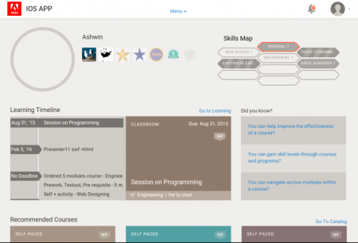

# Benutzer von iPad- und Android-Tablets

In der Learning Manager-App auf iPad- oder Google Nexus 9-Android-Tablet sehen Sie nach der Anmeldung als Teilnehmer Folgendes **Startseite** angezeigt:

*Der Startbildschirm der App*

Um zu den Lern- und Katalogfunktionen zu navigieren, tippen Sie auf das **Menü** &quot; und wählen Sie die entsprechende Option aus.

<!---->

## Offline auf die App zugreifen {#accesstheappoffline}

Sie können offline auf die Learning Manager-App in iPad und Google Nexus 9 Android-Tablets zugreifen. Laden Sie Kurse herunter, absolvieren Sie sie im Offline-Modus und synchronisieren Sie den Inhalt mit der Online-App, wenn Sie eine Verbindung zum Netzwerk herstellen.

1. Tippen **Menü** oben und tippen Sie auf **Lernressourcen** aus. Eine Liste aller verfügbaren Kurse wird in Kacheln angezeigt.
1. Tippen Sie auf das Downloadsymbol unten auf jeder Lernobjektkachel, um die Lerninhalte herunterzuladen.

   <!---->

1. Wenn Sie online sind, wird in einer Leiste oben in der App eine Eingabeaufforderung angezeigt, um zu überprüfen, ob Sie Ihre Inhalte online synchronisieren möchten. Tippen Sie auf den roten Balken, wenn Ihre Antwort &quot;Ja&quot; ist. Ein grüner Balken zeigt an, dass Ihre Inhalte mit der Online-App synchronisiert sind.

<!--## Track device storage {#trackdevicestorage}

You can monitor your device storage periodically.

Tap the profile icon at the upper-right corner of the app and tap **Device Storage** menu option.

An app storage information dialog appears as shown below.

Using the app storage information, you can check the total space of device, app and the downloaded courses. This information enables you to download courses accordingly. To delete the downloaded courses in the device, tap X icon adjacent to each course name.-->
