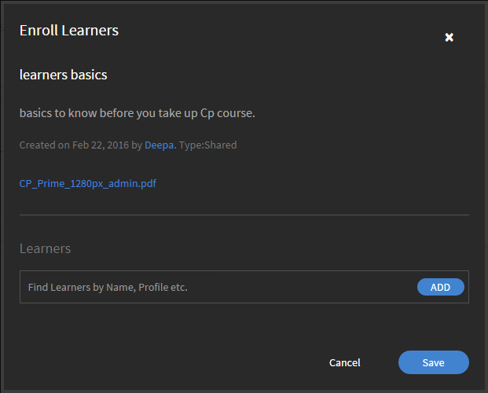

# Arbeitshilfen

Arbeitshilfen für Administratoren in Learning Manager.

Die Arbeitshilfen sind ein Repository mit Schulungsinhalten, das den Teilnehmern ohne Registrierung oder Abschlusskriterien zur Verfügung steht. Die Teilnehmer können auf diese Arbeitshilfen zurückgreifen, wenn sie bei Aktivitäten oder Aufgaben im Unternehmen Unterstützung benötigen.

Arbeitshilfen können unabhängig oder zusammen mit Kursen in Learning Manager genutzt werden.

Administratoren in einem Unternehmen können die Zuweisung von Arbeitshilfen zu Teilnehmern verwalten sowie Arbeitshilfen zurücknehmen oder erneut veröffentlichen.

## Arbeitshilfen zurücknehmen/erneut veröffentlichen {#withdrawrepublishjobaids}

Klicken Sie unter Administratoranmeldung im linken Bereich auf **[!UICONTROL Arbeitshilfen]**, um auf Arbeitshilfen zuzugreifen.

Sie können eine veröffentlichte Arbeitshilfe zurückziehen, indem Sie auf das Symbol &quot;Einstellungen&quot; neben der Arbeitshilfe klicken und **[!UICONTROL Zurücknehmen]** auswählen.

*Arbeitshilfen verwalten*

Durch Klicken auf die Registerkarte „Zurückgenommen“ können Sie zurückgenommene Arbeitshilfen anzeigen. Um zurückgenommene Arbeitshilfen erneut zu veröffentlichen, klicken Sie auf das Symbol „Einstellungen“ und wählen Sie „Veröffentlichen“. Klicken Sie in den Einstellungen auf „Vorschau“, um eine Vorschau der Arbeitshilfe im Player anzuzeigen.

## Arbeitshilfen-Zuweisungen verwalten {#managejobaidassignments}

1. Klicken Sie auf der Registerkarte Veröffentlicht auf das Symbol &quot;Einstellungen&quot; neben einer Arbeitshilfe.

1. Klicken Sie auf **[!UICONTROL Zuweisung verwalten]**.

   Das Popupdialogfeld **[!UICONTROL Teilnehmer registrieren]** wird angezeigt.

   

   *Dialogfeld &quot;Teilnehmer registrieren&quot; anzeigen*

1. Beginnen Sie, im Feld **[!UICONTROL Teilnehmer]** den Namen der Teilnehmer einzugeben, und wählen Sie die Teilnehmer aus der Dropdownliste aus. Sie können Teilnehmer auch anhand ihrer Namen, Profile usw. finden.
1. Klicken Sie auf **[!UICONTROL Hinzufügen].**.
1. Klicken Sie auf **[!UICONTROL Speichern]**.

## Häufig gestellte Fragen {#frequentlyaskedquestions}

+++Wie kann ich Arbeitshilfeberichte exportieren?

Klicken Sie in der oberen rechten Ecke des Bildschirms auf **[!UICONTROL Aktionen]** > **[!UICONTROL Bericht exportieren]**.

+++

+++Wie kann ich Arbeitshilfezuweisungen verwalten?

Klicken Sie auf der Registerkarte **[!UICONTROL Veröffentlicht]** auf das Symbol &quot;Einstellungen&quot; neben einer Arbeitshilfe. Fügen Sie einen Teilnehmer hinzu und klicken Sie auf **[!UICONTROL Hinzufügen]**.

+++

+++Wie kann ich eine Arbeitshilfe zurücknehmen?

Klicken Sie auf der Registerkarte **[!UICONTROL Veröffentlicht]** auf das Symbol &quot;Einstellungen&quot; neben einer Arbeitshilfe. Klicken Sie auf **[!UICONTROL Zurücknehmen]**. Die Arbeitshilfe wird jetzt nicht mehr auf der Registerkarte „Veröffentlicht“ angezeigt. Um die zurückgenommene Arbeitshilfe anzuzeigen, klicken Sie auf die Registerkarte „Zurückgenommen“.

+++
