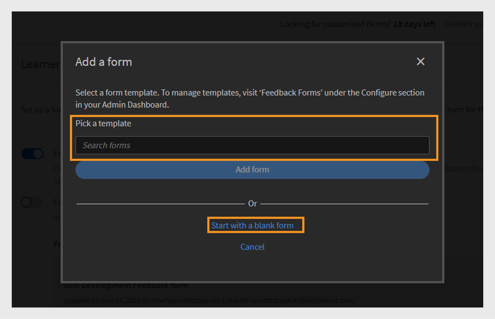

# L1-Feedbackformular

>[!IMPORTANT]
>
>Die erweiterte L1-Feedback-Funktion wird für ausgewählte Kunden bereitgestellt. Wenn Sie diese Funktion nicht in Ihrem Konto sehen, lesen Sie [L1- und L3-Feedback hinzufügen](/help/migrated/administrators/feature-summary/courses.md#add-l1-and-l3-feedback), um weitere Informationen über die vorhandene Feedbackfunktion zu erhalten.
>
>Wenden Sie sich an Ihr Customer Success Manager (CSM)-Team, um das neue Feedback-System zu aktivieren und Informationen zum Migrationszeitplan zu erhalten.

Mit der Feedback-Funktion für Stufe 1 (L1) in Adobe Learning Manager können Teilnehmer ihr Feedback nach Abschluss eines Kurses oder Lernpfads teilen. Dieses Feedback hilft Administratoren, die Qualität des Kurses, die Effektivität der Kursleiter und das allgemeine Lernerlebnis zu bewerten.

Administratoren können jetzt mehrere wiederverwendbare Feedbackformulare erstellen und verwalten und sie bestimmten Kursen und Lernpfaden zuweisen.

Die Funktion bietet mehr Flexibilität, da Administratoren Folgendes tun können:

* Wiederverwendbare Feedbackformulare erstellen
* Feedback für verschiedene Kurse oder Lernpfade anpassen
* Weisen Sie nach Bedarf maßgeschneiderte Formulare zu

Der **[!UICONTROL L1-Feedbackbericht]** und der **[!UICONTROL Feedbackbericht]** (benutzerdefinierter Bericht) enthalten jetzt zwei neue Spalten: Name des Feedbackformulars und Version des Feedbacks. Diese Spalten enthalten Details zu den verwendeten Feedback-Formularen.

## L1-Feedbackformular erstellen

Administratoren können mehrere L1-Feedback-Formulare auf Kontoebene erstellen und einem Kurs, einem Lernpfad oder einer Zertifizierung das richtige Formular zuweisen.

So erstellen Sie ein L1-Feedbackformular:

1. Melden Sie sich bei Adobe Learning Manager als Administrator an.
2. Wählen Sie **[!UICONTROL Feedbackformulare]** aus.

   
   _Administrator-Homepage zeigt die Option &quot;Feedbackformulare&quot; zum Erstellen und Verwalten von Feedbackformularen an_
3. Wählen Sie **[!UICONTROL Formular hinzufügen]** aus.

   
   _Bildschirm &quot;Feedbackformulare&quot; mit der Schaltfläche &quot;Formular hinzufügen&quot; zum Erstellen der Feedbackformulare_
4. Wählen Sie die **[!UICONTROL Standardvorlagensprache]** aus, und wählen Sie dann **[!UICONTROL Speichern]** aus.

   
   _Neue Vorlagenaufforderung hinzufügen, die die Option zur Auswahl der Standardsprache anzeigt_
5. Geben Sie den Titel und die Beschreibung des Formulars ein.

   
   _Feedback-Formularseite hinzufügen, auf der die Option angezeigt wird, geben Sie den Formulartitel und die Formularbeschreibung ein._
6. Wählen Sie im Menü **[!UICONTROL Frage hinzufügen]** einen der folgenden Fragentypen aus:

   a. **[!UICONTROL Freier Text]**: Ermöglicht es Teilnehmern, Antworten in ihren eigenen Worten zu geben.

   * Geben Sie Ihre Frage in das Textfeld **[!UICONTROL Frage]** ein.
   * Um die Frage als obligatorisch festzulegen, wählen Sie den Schalter **[!UICONTROL Obligatorisch]**.
     
     _Freitextfrage zum Feedbackformular hinzufügen_

   b. **[!UICONTROL Numerische Skalierung/NPS]**: Die Teilnehmer können ihre Kurszufriedenheit oder Wahrscheinlichkeit bewerten, den Kurs mithilfe einer numerischen Skalierung (in der Regel 1 bis 10) zu empfehlen.

   * Geben Sie Ihre Frage in das Textfeld **[!UICONTROL Frage]** ein.
   * Wählen Sie den Bewertungsbereich (1 bis 10) aus.
   * Um die Frage als obligatorisch festzulegen, wählen Sie den Schalter **[!UICONTROL Obligatorisch]**.
     \
     _Dem Feedbackformular eine Frage zur numerischen/NPS-Skalierung hinzufügen_

   c. **[!UICONTROL Likert-Skala]**: Teilnehmer können angeben, wie sehr sie einer Anweisung zustimmen, von &quot;Strongly Disagree&quot; bis &quot;Strongly Agree&quot;.

   * Geben Sie Ihre Frage in das Textfeld **[!UICONTROL Frage]** ein.
   * Um die Frage als obligatorisch festzulegen, wählen Sie den Schalter **[!UICONTROL Obligatorisch]**.
     
     _Likert-Skalierungsfrage zum Feedbackformular hinzufügen_

   d. **[!UICONTROL Kurseffektivitätsergebnis]**: Eine Skala, um zu messen, wie effektiv ein Kurs die Teilnehmer mithilfe eines relativen Bewertungssystems beeinflusst.

   * Dem Feedbackformular wird eine vordefinierte Frage mit einer Likert-Skala von 1 bis 10 hinzugefügt.
   * Sie können nur eine **[!UICONTROL Frage zur Bewertung der Kurseffektivität]** hinzufügen, die nicht bearbeitet werden kann.
     
     _Frage zum Punktwert für die Kurseffektivität zum Feedbackformular hinzufügen_
7. Wählen Sie **[!UICONTROL Speichern]**. Sie können die erstellten Formulare im Abschnitt Feedback-Forms anzeigen.

### Vorschau des Feedback-Formulars

Sie können eine Vorschau des Feedbackformulars anzeigen, indem Sie Vorschau in Englisch (USA) auswählen. Wenn Sie das Formular in mehreren Sprachen erstellt haben, können Sie es auch in den jeweiligen Sprachen in der Vorschau anzeigen. In diesem [Abschnitt](/help/migrated/administrators/feature-summary/l1-feedback-form.md#add-feedback-forms-in-other-languages) erfahren Sie, wie Sie Feedback-Formulare in anderen Sprachen hinzufügen.

_Bildschirm &quot;Feedbackformulare&quot; mit der Option &quot;Vorschau&quot;, um das Feedbackformular in der Standardsprache anzuzeigen_

### Feedback-Formulare in anderen Sprachen hinzufügen

Erstellen Sie Übersetzungen für die Fragen im Feedback-Formular in mehreren Sprachen. Sie können Fragen jedoch nur in der Standardsprache (z. B. Englisch) hinzufügen oder entfernen. Für andere Sprachen können Sie nur die Fragen übersetzen, die ursprünglich in der Standardsprache hinzugefügt wurden. Es ist nicht möglich, Fragen direkt in den übersetzten Versionen hinzuzufügen oder zu entfernen.

1. Wählen Sie im Feedbackformular **[!UICONTROL Neue Sprache hinzufügen]** aus.

   
   _Dem Feedbackformular eine neue Sprachversion hinzufügen_
2. Wählen Sie die gewünschte Sprache aus und wählen Sie **[!UICONTROL Speichern]**.
3. Navigieren Sie zur Registerkarte für die hinzugefügte Sprache.
4. Wählen Sie **[!UICONTROL Übersetzen]** neben jeder Frage aus, um Ihre Übersetzung hinzuzufügen.

   
   _Feedback-Formularbildschirm mit der Option &quot;Übersetzen&quot; zum Übersetzen der Fragen in die jeweiligen Sprachen_

   >[!NOTE]
   >
   >Die Frage zum Punktwert für die Kurseffektivität wird automatisch übersetzt.

5. Wählen Sie nach dem Hinzufügen der Übersetzungen **[!UICONTROL Speichern]**.

## Feedbackformular als Standard festlegen

Administratoren können standardmäßige Feedbackformulare für Kurse zum Selbststudium, zum Klassenzimmer, zum virtuellen Klassenzimmer und zu gemischten Kursen einrichten. Nach der Konfiguration wird dieses Standardformular den Teilnehmern nach Abschluss eines Kurses automatisch angezeigt. Dieses Standardformular wird auf alle Kurse angewendet, es sei denn, der Administrator weist für bestimmte Kurse ein anderes Feedbackformular zu.

_Bildschirm für Feedbackformulare wird angezeigt, um das Standard-Feedbackformular festzulegen_

## Konfigurieren der Einstellungen für Teilnehmer-Feedback

Administratoren können die folgenden Einstellungen im Abschnitt &quot;Teilnehmerfeedback&quot; konfigurieren:

* **[!UICONTROL Formular aktivieren, um das Feedback der Teilnehmer für diesen Kurs zu erfassen]**: Aktivieren Sie diese Option, um Feedback von Teilnehmern für den Kurs zu erfassen. Wenn diese Option aktiviert ist, werden die Teilnehmer aufgefordert, nach Abschluss des Kurses Feedback abzugeben.
* **[!UICONTROL Formulareinstellung]**: Wenn diese Option aktiviert ist, wird das Feedback-Formular automatisch für Teilnehmer geöffnet, unmittelbar nachdem sie den Kurs abgeschlossen haben, was das Sammeln von zeitnahem Feedback vereinfacht.

_Bildschirm &quot;Teilnehmerfeedback&quot; mit den Einstellungen für Teilnehmerfeedback_

>[!NOTE]
>
>Kursinstanzen verwenden das standardmäßige Feedbackformular aus der Kursebene. Wenn Sie neue Instanzen erstellen, verwenden diese auch die Standardform auf Kursebene und nicht die auf Kontoebene.

### Ändern der Standardform für Feedback zu Kursen

Das standardmäßige Feedbackformular gilt für alle Kurse. Als Administrator können Sie entweder ein neues Formular erstellen oder eines aus der vorhandenen Liste auswählen. Um die standardmäßigen Feedbackformulare zu ändern, muss das Teilnehmer-Feedback für diesen Kurs aktiviert sein.

So ändern Sie das Standard-Feedbackformular:

1. Wählen Sie auf der Administrator-Startseite **[!UICONTROL Kurse]** aus.
2. Wählen Sie einen beliebigen Kurs im Abschnitt **[!UICONTROL Kurs]** aus.
3. Wählen Sie **[!UICONTROL Kurs anzeigen]** aus, und wählen Sie dann **[!UICONTROL Teilnehmerfeedback]** aus.

   
   _Teilnehmer-Feedback-Bildschirme zeigen die Option Bearbeiten zum Ändern des Formulars an_
4. Wählen Sie im Abschnitt **[!UICONTROL Teilnehmerfeedback]** die Option **[!UICONTROL Bearbeiten]** aus.
5. Wählen Sie **[!UICONTROL Formular ändern]** aus.

   
   _Teilnehmer-Feedback-Bildschirme zeigen die Option &quot;Formular ändern&quot; an, um das Feedback-Formular für den Kurs zu ändern_
6. Wählen Sie ein anderes Feedbackformular aus dem Menü aus oder wählen Sie **[!UICONTROL Mit einem leeren Formular beginnen]**, um ein neues zu erstellen.

   
   _Einen Formularbildschirm hinzufügen, auf dem die Option angezeigt wird, aus der verfügbaren Vorlage auszuwählen oder ein neues Formular zu erstellen_
7. Wählen Sie **[!UICONTROL Speichern]**, um Ihre Änderungen zu übernehmen.

Wenn ein Kurs das Standard-Feedbackformular verwendet und das Standardformular auf Kontoebene aktualisiert wird, werden in allen diesen Kursen automatisch die neuen Formulare angezeigt. Wenn ein Administrator jedoch das Formular ändert oder ein neues Formular auf Kursebene zuweist, haben zukünftige Änderungen am Standardformular keine Auswirkungen auf das Feedbackformular für diesen Kurs.

Die Instanz verwendet standardmäßig das Feedbackformular auf Kursebene. Wenn ein Administrator das Feedback-Formular auf Kursebene ändert, wirkt sich dies nicht auf das Formular aus, das bereits auf Instanzebene festgelegt wurde. Für jede neue Instanz, die nach der Änderung erstellt wird, wird jedoch standardmäßig das aktualisierte Feedback-Formular für Kursebene verwendet.

Führen Sie dieselben Schritte aus, um die Standard-Feedbackformulare für einen Lernpfad zu ändern.

>[!NOTE]
>
>Wenn Sie das Formular nicht ändern, verwendet der Kurs das standardmäßige Feedbackformular.

