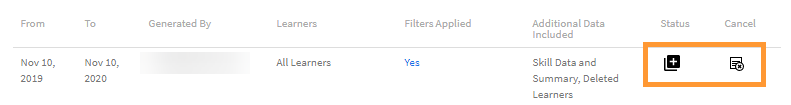

# Teilnehmertranskripte

Laden Sie Teilnehmertranskripte herunter und verwalten Sie Berichte mit Learning Manager.

Mit Adobe Learning Manager können die Administratoren eines Unternehmens die Transkripte erstellen, die mit den Teilnehmenden verknüpft sind.

## Teilnehmertranskripte erstellen {#generatelearnertranscripts}

1. Um Protokolle für Teilnehmer zu generieren, klicke **[!UICONTROL links im Bedienfeld &quot;Administratoranmeldung&quot; auf &quot;Berichte]** &quot;.

   Der Administrator navigiere auf **[!UICONTROL der**[!UICONTROL  Seite Berichte ]**zur Registerkarte &quot;Benutzerdefinierte Berichte]** > **[!UICONTROL Excel-Berichte]**&quot;.

1. Klicke auf den Link **[!UICONTROL Teilnehmerprotokolle]**.

   Die **[!UICONTROL Seite &quot;Verlauf des Teilnehmerprotokolls]** &quot; wird mit der Meldung angezeigt: **Noch wurden keine Teilnehmer-Protokolle erstellt** oder eine Liste der Downloads, die nach der Implementierung der Verlaufsseite für Lernprotokolle ausgelöst wurden.

   <!---->

   Ein Dialogfeld „Teilnehmertranskripte“ wird angezeigt. Wählen Sie den Datumsbereich, für den Sie das Transkript benötigen.

   >[!NOTE]
   >
   >Standardmäßig ist ab dem Startdatum das Anmeldedatum des Teilnehmers und das Datum immer der aktuelle Tag. Sie können nur das Startdatum ändern, ab dem Sie die Daten benötigen.

1. Wähle die Namen der Teilnehmer im **[!UICONTROL Feld Teilnehmer]** auswählen aus, und klicke auf &quot;Generieren]&quot;**[!UICONTROL .**
1. Sie können einen einzelnen Teilnehmer oder Gruppen von Teilnehmern auswählen. Klicken Sie auf **[!UICONTROL Weitere Teilnehmer hinzufügen]**, um weitere Teilnehmer hinzuzufügen.

   

   *Weitere Teilnehmer hinzufügen*

1. Sie können bestimmte Kataloge auswählen, indem sie das Häkchen aktivieren. Das Transkript wird nur für die angegebenen Kataloge heruntergeladen. Um bestimmte Kataloge auszuwählen, wähle den Katalog aus der **[!UICONTROL Dropdown-Liste Kataloge]** auswählen.

   

1. Beim Exportieren von Teilnehmer-Transkripten gibt es die Option **[!UICONTROL Registrierungsstatus]**. Dieses Dropdown-Menü enthält die folgenden Optionen:

   * Alles auswählen
   * Abgeschlossen
   * Wird ausgeführt
   * Nicht begonnen
   * Registrierung aufgehoben

   

   *Katalog auswählen*

1. Sie können auch Protokolle für Teilnehmer herunterladen, die von einem Konto gelöscht wurden.

   Um Teilnehmerprotokolle gelöschter Benutzer herunterzuladen, klicke auf den **[!UICONTROL Pfeil &quot;Erweiterte Optionen]** &quot; und aktiviere das Häkchen **[!UICONTROL &quot;Daten gelöschter]** Teilnehmer einbeziehen&quot;.

   

   *Teilnehmerprotokolle gelöschter Teilnehmer herunterladen*

1. Du kannst die Informationen auf Modulebene im Teilnehmerprotokoll herunterladen, indem du das Kontrollkästchen &quot;**[!UICONTROL Informationen]** auf Modulebene aktivieren&quot; aktiviert. In diesem Fall werden Modulnamen und die für jedes Modul aufgewendete Zeit als Teil des Transkripts abgerufen, wenn diese Option aktiviert ist.
1. Du kannst Kompetenzdaten und Übersichtsblätter herunterladen, indem du das Kontrollkästchen &quot;**[!UICONTROL Kompetenzdaten und Übersichtsblätter]** einbeziehen&quot; aktiviert.

   Protokolle werden als .zip-Dateien auf deinem Computer generiert und heruntergeladen, wenn die Skills-Daten nicht enthalten sind. Wenn das Kontrollkästchen „Daten für Kenntnisse“ aktiviert ist, werden Transkripte generiert und XLS-Dateien heruntergeladen.

## Teilnehmertranskript durch Kopieren und Einfügen erstellen

Das Abrufen von Teilnehmertranskripten ist ein langwieriger Vorgang, da er nur einzeln für einen Teilnehmer bzw. eine Benutzergruppe durchgeführt werden kann. Mit der Funktion zum Kopieren und Einfügen können Sie die gesamte Liste der Teilnehmer-E-Mail-IDs gleichzeitig kopieren und einfügen.

1. Melde dich als Administrator ]**oder**[!UICONTROL  Manager ]**an**[!UICONTROL .
1. Gehe zu **[!UICONTROL Reports]** unter **[!UICONTROL Verwalten]**, es lädt die **[!UICONTROL Seite &quot;Benutzeraktivität]** &quot;.
1. Klicke links im Bedienfeld &quot;Benutzerdefinierte Berichte&quot; auf **[!UICONTROL &quot;Benutzerdefinierte Berichte]**&quot;, und wähle aus der Liste &quot;Teilnehmerprotokolle ]**&quot;**[!UICONTROL  aus.
1. Klicke oben links auf der **[!UICONTROL Seite Transkripts]** für Teilnehmer auf **[!UICONTROL &quot;Neu]** generieren&quot;.
1. Wähle die gewünschten Datumsangaben aus, indem du im **[!UICONTROL Dropdown-Menü &quot;Datumsbereich]** auswählen&quot; klickst. Klicke auf **[!UICONTROL die Registerkarte &quot;E-Mail-IDs]** &quot;, um die kopierte Liste der eindeutigen E-Mail-IDs einzugeben.

   

   *E-Mail-IDs per Copy-Paste einfügen*

1. Mit **[!UICONTROL &quot;E-Mail-Id überprüfen]** &quot; kannst du überprüfen, ob die eingegebene ID korrekt ist.

   

   *E-Mail-IDs validieren*

   Wenn die eingegebene E-Mail-ID falsch ist, wird sie wie oben beschrieben zusammen mit einer Validierungsnachricht rot hervorgehoben.

   **[!UICONTROL Die Schaltfläche &quot;Generieren]** &quot; ist nur verfügbar, wenn alle eingegebenen E-Mail-IDs korrekt sind.

   

   *Teilnehmer-Transkripten generieren*

1. Klicke auf **[!UICONTROL &quot;Generieren]** &quot;, um für alle genannten E-Mail-IDs Protokolle für Teilnehmer zu generieren. Sie erhalten eine Bestätigungsmeldung wie unten beschrieben, in der die Berichterstellung bestätigt wird.

   

   *Bestätigungsmeldung zum generierten Bericht*

   Die Erstellung von Teilnehmer-Transkripten kann für E-Mail-IDs kombiniert werden, die sowohl unter &quot;Benutzer ]****[!UICONTROL &quot; als auch **[!UICONTROL &quot;E-Mail-IDs]**&quot; eingegeben werden.

## Downloadverlauf der Teilnehmertranskripte {#ltdownload}

Auf der Download-Seite für das **[!UICONTROL Teilnehmer-Transkript]** wird der Dialog &quot;Teilnehmerprotokolle&quot; angezeigt, um einen Bericht zu generieren, wenn du auf die **[!UICONTROL Schaltfläche &quot;Neu]** generieren&quot; klickst.

*Bericht aller Teilnehmer-Protokolle erstellen*

Klicken Sie auf **[!UICONTROL Erweiterte Optionen]** und erweitern Sie das Bedienfeld.

Wählen Sie die Benutzer und den Katalog aus, zu dem sie gehören. Nach dem Klicken auf die Schaltfläche **[!UICONTROL Generieren]** wird ein Dialogfeld angezeigt, in dem die zum Herunterladen des Berichts benötigte ungefähre Zeit angegeben ist. Um den Bericht zu erstellen, klicken Sie auf **[!UICONTROL Generieren]**.

*Schaltfläche &quot;Generieren&quot; auswählen*

Das Transkript wird im Hintergrund generiert und Sie können Ihre Aufgaben in Learning Manager fortsetzen. Sobald das Transkript erstellt wurde, können Sie das Transkript aus der Liste herunterladen.

Als Administrator kannst du alle Protokolle anzeigen, die von allen im System generiert werden.

*Download-Historie anzeigen*

In der Download-Liste werden die folgenden Attribute angezeigt:

* **Teilnehmer:** Die Teilnehmer/Teilnehmergruppen, deren Protokolle heruntergeladen werden sollen.
* **Zusätzliche Daten enthalten:** Abhängig von den zusätzlichen Daten, die der Administrator über die Option „Erweitert“ im Modul „Lernprotokoll hinzufügen“ herunterladen möchte
* **Status:** Heruntergeladen, in der Warteschlange oder in Bearbeitung.
* **Von** und **Bis**: Zeitspanne für die herunterzuladenden Transkripte.
* **Angewendete Filter:** Ob Sie die Filter für den Registrierungsstatus angewendet haben.
* **Generiert durch:** Die Benutzer-ID des Learning Manager-Anwenders, der den Download angefordert hat.
* **Status:** Heruntergeladen, in der Warteschlange oder in Bearbeitung.

Sie können den Download jederzeit abbrechen. Wenn ein Auftrag vom Administrator abgebrochen wird, sendet Learning Manager eine In-App-Benachrichtigung an den Benutzer, der das Teilnehmertranskript ausgelöst hat.

*Download-Warteschlange für Das Teilnehmerprotokoll*

Du kannst **den Download jederzeit kündigen** . Wenn eine Stelle gekündigt wird, sendet Learning Manager eine In-App-Benachrichtigung an den Benutzer, der den Job gekündigt hat.

## Daten gelöschter Teilnehmer {#dataofdeletedlearners}

Sie können die Daten gelöschter Teilnehmer in die Teilnehmertranskriptliste aufnehmen. Aktiviere im Dialogfeld &quot;Teilnehmerprotokolle&quot; die Option **[!UICONTROL &quot;Daten gelöschter Teilnehmer]** einbeziehen&quot;.

Nachdem Sie die Option aktiviert und auf **[!UICONTROL Generieren]** geklickt haben, werden die Datenfunktionen der gelöschten Teilnehmer auf der Download-Seite des Teilnehmertranskripts wie folgt angezeigt:

*Daten gelöschter Learber anzeigen*

## Anpassen der Spalten {#customize-columns-lt}

Ein Administrator kann die in einem Teilnehmertranskriptbericht exportierten Spalten anpassen. Administratoren, benutzerdefinierte Administratoren und Manager können die Spalten konfigurieren, bevor sie den Bericht exportieren.

Klicke im **[!UICONTROL Dialogfeld &quot;Teilnehmerprotokolle]** &quot; auf &quot; **[!UICONTROL Erweiterte Optionen&quot;]**. Wähle im **[!UICONTROL Abschnitt Exportformat]** konfigurieren die Spalten aus, die du exportieren möchtest.

*Spalten für den Export anpassen*

Die Anpassung ist nur zulässig, wenn ein Benutzer das Teilnehmertranskript im CSV-Format herunterlädt. Beim Herunterladen im XLSX-Format wird die Auswahl der Spaltenvoreinstellung nicht berücksichtigt und alle Standardspalten werden exportiert.

## Inhalt der Teilnehmertranskriptdatei {#learnertranscriptfilecontent}

Eine typische Teilnehmertranskriptdatei besteht aus sechs Excel-Arbeitsblättern in einer einzelnen Datei. Die Protokolle der Teilnehmer geben einen allgemeinen Einblick in Daten, darunter die Anzahl der beteiligten Teilnehmer pro Kurs, ihre Fähigkeiten, den Abschlussanteil basierend auf Kurs oder Teilnehmer und ein Compliance-Dashboard. Im Folgenden finden Sie die Dashboards, die in den Teilnehmertranskripten verfügbar sind:

**Teilnehmertranskript**

Im Teilnehmertranskript-Arbeitsblatt werden zusammen mit Profildetails über den Teilnehmer, ein Lernobjekt mit Details zur Nutzung bereitgestellt, z. B. Registrierungsdatum, Startdatum, erreichte Stufe, erzielte Quizpunkzahl und so weiter. Wenn Kurse Teil eines Lernprogramms sind, werden sie abgesehen von den Angaben zur Kursnutzung separat aufgeführt.

**1 - Dashboard für Lernaktivitäten**

In diesem LO-speziefischen Dashboard können Sie die Anzahl der Teilnehmer für einen Kurs, jedes Lernprogramm oder jede Zertifizierung anzeigen. Sie können das Arbeitsblatt zum Fortschritt für Teilnehmer für ein bestimmtes Lernobjekt anzeigen. Dieses Blatt zeigt Daten wie die Anzahl der Teilnehmer, die den Kurs oder das Lernprogramm abgeschlossen haben, Teilnehmer, die noch nicht fertig sind und die Ablaufdaten für die Teilnehmer.

Der Fortschritt der Benutzer für den jeweiligen Kurs wird anhand der Eingabefelder berechnet, in denen Sie das Fälligkeitsdatum und Prozent-Schwellenwerte für den Fortschritt angeben. Wenn Sie beispielsweise in den Eingabefeldern Werte von 7 Tagen und 70 % angeben, wird der Fortschritt für Kurse angezeigt, die in 7 Tagen fällig sind und von denen bereits mehr als 70 % absolviert sind. Sie können auch den Zeitraum für dieses Blatt ändern, wobei die geänderten Daten automatisch in diesem Dashboard angezeigt werden.

**2 - Dashboard für Lernaktivitäten**

Dieses Lern-Dashboard zeigt Daten für einen bestimmten Benutzer. Über dieses Dashboard können Sie Kurse, Lernprogramme oder Zertifizierungen sehen, bei denen sich ein bestimmter Benutzer registriert hat. Die Tabelle enthält außerdem Daten zu Lernobjekten, welche die Benutzer abgeschlossen haben, zu laufenden Lernobjekten und zu bevorstehenden Terminen für den Benutzer.

Der Fortschritt der Benutzer für den jeweiligen Kurs wird anhand Ihrer Eingaben berechnet, d. h. der Werte für Fälligkeitsdatum und prozentualen Fortschritt. Wenn Sie beispielsweise in den Eingabefeldern Werte von 7 Tagen und 70 % angeben, wird der Fortschrift der Benutzer für verschiedene Kurse angezeigt, die in 7 Tagen fällig sind und von denen bereits mehr als 70 % absolviert sind.

**Kenntnisse**

Auf dem Blatt „Kenntnisse“ finden Sie Kenntnisnahme, Kenntnisstufe, erforderliche Punkte, erzielte Punktzahl, abgeschlossener Prozentwert und andere Profildetails. Nachfolgend sehen Sie ein Beispiel für eine Momentaufnahme als Referenz.

*Beispiel für das Excel-Tabellenblatt &quot;Skills&quot;*

**1 - Dashboard für Kenntnisse**

In diesem Dashboard können Sie sehen, ob Ihr Unternehmen mit diversen Kenntnissen ausgestattet ist. Für bestimmte Kenntnisse können Sie überprüfen, wie viele Benutzer diese Kenntnisse besitzen sollten und wie viele sie tatsächlich besitzen. Außerdem gibt dieses Dashboard an, welche Benutzer ihre Kenntnisse möglicherweise auffrischen müssen. Dieser Wert wird anhand des Werts berechnet, den Sie in das Eingabefeld eingeben. Wenn Sie beispielsweise einen Wert von 50 Tagen eingeben, liefert das Dashboard Daten zu Benutzern, deren Kenntnisse möglicherweise nach 50 Tagen aufgefrischt werden müssen.

**2 - Dashboard für Kenntnisse**

Dieses Dashboard für Kenntnisse ist stärker benutzerspezifisch. Sie können einen bestimmten Benutzer oder mehrere Benutzer filtern und ihre Kenntnisstufe als Dashboard anzeigen. Mit diesem Blatt können Manager und Administratoren verfolgen, wie viele Kenntnisse jeder Teilnehmer hat im Vergleich dazu, wie viele Kenntnisse jeder Teilnehmer haben sollte. Das Dashboard „Kenntnisse“ gibt auch Aufschluss darüber, welche Teilnehmer ihre Kenntnisse auffrischen müssen. Die Auffrischungsliste der Teilnehmer wird anhand der Anzahl von Tagen berechnet, die Sie in das Eingabefeld eingeben.

**Kompatibilitäts-Dashboard**

Das Kompatibilitäts-Dashboard besteht aus zwei Teilen - Kompatibilitätsbericht pro Benutzer und Kompatibilitätsbericht pro Schulungen. Für den benutzerbasierten Bericht können Sie das Kompatibilitäts-Dashboard verwenden, um Benutzer nachzuverfolgen, die bevorstehende Termine für wichtige Kompatibilitätsinitiativen haben. Für den schulungsbasierten Bericht können Sie nach Lernprogramm oder Zertifizierung filtern.

Für beide Kompatibilitätsberichte können Sie nach dem Fälligkeitsdatum filtern, um die entsprechenden Daten anzuzeigen.

### Zeit- und Datumsspalten im Transkript {#datetime}

Bei den Werten in den folgenden Spalten sind die Minuten auf die nächste Minute und die Sekunden auf 00 gerundet:

* Registrierungsdatum (UTC-Zeitzone)
* Startdatum (UTC-Zeitzone)
* Abschlussdatum (UTC-Zeitzone)

*Zeit- und Datumsspalten im Excel-Tabellenblatt*

### Spalten „Dauer des Moduls“ und „ID“ im Transkript {#moduledurationandidcolumnsinthetranscript}

Im Teilnehmer-Transkript werden auch die Spalten **[!UICONTROL &quot;Moduldauer]** &quot; und **[!UICONTROL &quot;ID]**&quot; angezeigt.

*Moduldauer und ID-Spalten im Transkript*

### SONSTIGE Spalten im Transkript {#ModuledurationandIDcolumnsinthetranscript-1}

| **Spalte** | **Beschreibung** |
|---|---|
| Nachher | Anzahl der Teilnehmer, die die Kenntnisse vor der eingegebenen Anzahl (Wert) an Tagen erreicht haben, die aktualisiert werden muss |
| Kenntnisse | Die Namen der Kenntnisse, die Teilnehmern zugewiesen sind |
| Managername | Der Name des Managers, zu dessen Mitarbeitern Kenntnis-Engagementdaten in der Zusammenfassungstabelle „Kenntnisse“ angezeigt werden sollen |
| Zeilenbeschriftungen | Der Name des Teilnehmers mit der zugewiesenen Liste der Kenntnisse |
| Anzahl der Kenntnisse, die jeder Benutzer haben sollte | Anzahl der Kenntnisse, die dem Teilnehmer zugewiesen wurden |
| Anzahl der Kenntnisse, die jeder Benutzer hat | Anzahl der Kenntnisse, die vom Teilnehmer erreicht wurden |
| Anzahl der Kenntnisse, die aktualisiert werden müssen | Anzahl der Teilnehmer, deren Kenntnisse aufgefrischt werden müssen |
| Prozentsatz der Kompatibilität | Der Prozentsatz des Fortschritts bezüglich der zugewiesenen Kenntnisse |
| Eingebetteter Pfad | In diesen Zeilen wird der Name des eingebetteten Lernprogramms angezeigt. |
| ID für eingebetteten Pfad | In diesen Zeilen werden die IDs des eingebetteten Lernprogramms angezeigt. |
| Sprache des eingebetteten Pfads | In diesen Zeilen wird die Sprache angezeigt, in der das Lernprogramm erstellt wurde. |
