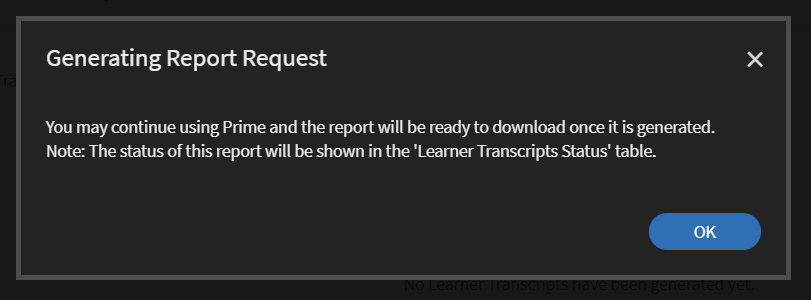

# Teilnehmertranskripte

Laden Sie Teilnehmertranskripte herunter und verwalten Sie Berichte mit Learning Manager.

Mit Adobe Learning Manager können die Administratoren eines Unternehmens die Transkripte erstellen, die mit den Teilnehmenden verknüpft sind.

## Teilnehmertranskripte erstellen {#generatelearnertranscripts}

1. Um Teilnehmertranskripte zu erstellen, klicken Sie auf **[!UICONTROL Berichte]** im linken Bereich in der Administratoranmeldung.

   Der Administrator navigiert auf der Seite **[!UICONTROL Berichte]** zur Registerkarte **[!UICONTROL Benutzerdefinierte Berichte]** > **[!UICONTROL Excel-Berichte]**.

1. Klicken Sie auf den Link **[!UICONTROL Teilnehmertranskripte]**.

   Die Verlaufsseite **[!UICONTROL Teilnehmertranskript]** wird mit der Meldung angezeigt: **Es wurden noch keine Teilnehmertranskripte generiert** oder mit einer Liste von Downloads, die nach der Implementierung der Lernobjektverlaufsseite ausgelöst wurden.

   <!---->

   Ein Dialogfeld „Teilnehmertranskripte“ wird angezeigt. Wählen Sie den Datumsbereich, für den Sie das Transkript benötigen.

   >[!NOTE]
   >
   >Standardmäßig ist das Anfangsdatum das Registrierungsdatum des Teilnehmers und das Enddatum immer das aktuelle Datum. Sie können nur das Startdatum ändern, ab dem Sie die Daten benötigen.

1. Wählen Sie die Namen der Teilnehmer aus dem Feld **[!UICONTROL Teilnehmer auswählen]** aus, und klicken Sie auf **[!UICONTROL Generieren].**
1. Sie können einen einzelnen Teilnehmer oder Gruppen von Teilnehmern auswählen. Klicken Sie auf **[!UICONTROL Weitere Teilnehmer hinzufügen]**, um weitere Teilnehmer hinzuzufügen.

   

   *Weitere Teilnehmer hinzufügen*

1. Sie können bestimmte Kataloge auswählen, indem Sie das Kontrollkästchen aktivieren. Das Transkript wird nur für die angegebenen Kataloge heruntergeladen. Sie können bestimmte Kataloge auswählen, indem Sie den Katalog aus der Dropdown-Liste **[!UICONTROL Kataloge auswählen]** auswählen.

   

1. Beim Exportieren von Teilnehmertranskripten gibt es die Option **[!UICONTROL Registrierungsstatus]**. Dieses Dropdown-Menü enthält die folgenden Optionen:

   * Alles auswählen
   * Abgeschlossen
   * Wird ausgeführt
   * Nicht begonnen
   * Registrierung aufgehoben

   

   *Katalog auswählen*

1. Sie können auch Transkripte für Teilnehmer herunterladen, die aus einem Konto gelöscht wurden.

   Um Teilnehmertranskripte gelöschter Benutzer herunterzuladen, klicken Sie auf den Pfeil **[!UICONTROL Erweiterte Optionen]** und aktivieren Sie das Kontrollkästchen **[!UICONTROL Daten gelöschter Teilnehmer einschließen]**.

   

   *Teilnehmertranskripte gelöschter Teilnehmer herunterladen*

1. Sie können Informationen zur Modulstufe im Teilnehmertranskript herunterladen, indem Sie das Kontrollkästchen &quot;**[!UICONTROL Informationen zur Modulstufe aktivieren]**&quot; aktivieren. In diesem Fall werden Modulnamen und die für jedes Modul aufgewendete Zeit als Teil des Transkripts abgerufen, wenn diese Option aktiviert ist.
1. Sie können Fertigkeitsdaten und Zusammenfassungsblätter herunterladen, indem Sie das Kontrollkästchen &quot;**[!UICONTROL Fertigkeitsdaten und Zusammenfassungsblätter einschließen]**&quot; aktivieren.

   Transkripte werden generiert und als ZIP-Dateien auf Ihren Computer heruntergeladen, wenn die Kenntnisdaten nicht enthalten sind. Wenn das Kontrollkästchen „Daten für Kenntnisse“ aktiviert ist, werden Transkripte generiert und XLS-Dateien heruntergeladen.

## Teilnehmertranskript durch Kopieren und Einfügen erstellen

Das Abrufen von Teilnehmertranskripten ist ein langwieriger Vorgang, da er nur einzeln für einen Teilnehmer bzw. eine Benutzergruppe durchgeführt werden kann. Mit der Funktion zum Kopieren und Einfügen können Sie die gesamte Liste der Teilnehmer-E-Mail-IDs gleichzeitig kopieren und einfügen.

1. Melden Sie sich als **[!UICONTROL Administrator]** oder **[!UICONTROL Manager]** an.
1. Wechseln Sie unter **[!UICONTROL Verwalten]** zu **[!UICONTROL Berichte]**. Die Seite **[!UICONTROL Benutzeraktivität]** wird geladen.
1. Klicken Sie im linken Bereich auf **[!UICONTROL Benutzerdefinierte Berichte]** und wählen Sie **[!UICONTROL Teilnehmertranskripte]** aus der Liste aus.
1. Klicken Sie auf der Seite **[!UICONTROL Teilnehmertranskripte]** auf die Schaltfläche **[!UICONTROL Neu generieren]** in der oberen linken Ecke.
1. Wählen Sie die gewünschten Daten aus, indem Sie in der Dropdownliste auf **[!UICONTROL Datumsbereich auswählen]** klicken. Klicken Sie auf die Registerkarte **[!UICONTROL E-Mail-IDs]**, um die kopierte Liste der eindeutigen E-Mail-IDs einzugeben.

   

   *E-Mail-IDs kopieren und einfügen*

1. Überprüfen Sie mit **[!UICONTROL E-Mail-IDs validieren]**, ob die eingegebene ID korrekt ist.

   

   *E-Mail-IDs validieren*

   Wenn die eingegebene E-Mail-ID falsch ist, wird sie wie oben beschrieben zusammen mit einer Validierungsnachricht rot hervorgehoben.

   Die Schaltfläche **[!UICONTROL Generieren]** ist nur verfügbar, wenn alle eingegebenen E-Mail-IDs korrekt sind.

   

   *Teilnehmertranskripte generieren*

1. Klicken Sie auf die Schaltfläche **[!UICONTROL Generieren]**, um Teilnehmertranskripte für alle genannten E-Mail-IDs zu generieren. Sie erhalten eine Bestätigungsmeldung wie unten beschrieben, in der die Berichterstellung bestätigt wird.

   

   *Bestätigungsmeldung des generierten Berichts*

   Das Generieren von Teilnehmertranskripten kann für E-Mail-IDs kombiniert werden, die sowohl auf der Registerkarte **[!UICONTROL Benutzer]** als auch **[!UICONTROL E-Mail-IDs]** eingegeben wurden.

## Downloadverlauf der Teilnehmertranskripte {#ltdownload}

Wenn Sie auf der Downloadseite **[!UICONTROL Teilnehmertranskript]** auf die Schaltfläche **[!UICONTROL Neu generieren]** klicken, um einen Bericht zu erstellen, wird das Dialogfeld &quot;Teilnehmertranskripte&quot; angezeigt.

*Bericht aller Teilnehmertranskripte generieren*

Klicken Sie auf **[!UICONTROL Erweiterte Optionen]** und erweitern Sie das Bedienfeld.

Wählen Sie die Benutzer und den Katalog aus, zu dem sie gehören. Nach dem Klicken auf die Schaltfläche **[!UICONTROL Generieren]** wird ein Dialogfeld angezeigt, in dem die zum Herunterladen des Berichts benötigte ungefähre Zeit angegeben ist. Um den Bericht zu erstellen, klicken Sie auf **[!UICONTROL Generieren]**.

*Schaltfläche &quot;Generieren&quot; auswählen*

Das Transkript wird im Hintergrund generiert und Sie können Ihre Aufgaben in Learning Manager fortsetzen. Sobald das Transkript erstellt wurde, können Sie das Transkript aus der Liste herunterladen.

Als Administrator können Sie alle Transkripte anzeigen, die von einem Benutzer im System generiert werden.

*Downloadverlauf anzeigen*

In der Download-Liste werden die folgenden Attribute angezeigt:

* **Teilnehmer:** Teilnehmer/Teilnehmergruppen, deren Transkripte heruntergeladen werden sollen.
* **Zusätzliche Daten enthalten:** Abhängig von den zusätzlichen Daten, die der Administrator über die Option „Erweitert“ im Modul „Lernprotokoll hinzufügen“ herunterladen möchte
* **Status:** Heruntergeladen, in der Warteschlange oder in Bearbeitung.
* **Von** und **Bis**: Zeitspanne für die herunterzuladenden Transkripte.
* **Angewendete Filter:** Ob Sie die Filter für den Registrierungsstatus angewendet haben.
* **Generiert von:** Die Benutzer-ID des Learning Manager-Benutzers, der den Download angefordert hat.
* **Status:** Heruntergeladen, in der Warteschlange oder in Bearbeitung.

Sie können den Download jederzeit abbrechen. Wenn ein Auftrag vom Administrator abgebrochen wird, sendet Learning Manager eine In-App-Benachrichtigung an den Benutzer, der das Teilnehmertranskript ausgelöst hat.

*Warteschlange für den Download des Teilnehmertranskripts*

Sie können den Download jederzeit **abbrechen**. Wenn ein Auftrag abgebrochen wird, sendet der Lern-Manager eine In-App-Benachrichtigung an den Benutzer, der den Auftrag abgebrochen hat.

## Daten gelöschter Teilnehmer {#dataofdeletedlearners}

Sie können die Daten gelöschter Teilnehmer in die Teilnehmertranskriptliste aufnehmen. Aktivieren Sie im Dialogfeld &quot;Teilnehmertranskripte&quot; die Option **[!UICONTROL Daten gelöschter Teilnehmer einschließen]**.

Nachdem Sie die Option aktiviert und auf **[!UICONTROL Generieren]** geklickt haben, werden die Datenfunktionen der gelöschten Teilnehmer auf der Download-Seite des Teilnehmertranskripts wie folgt angezeigt:

*Daten gelöschter Teilnehmer anzeigen*

## Anpassen der Spalten {#customize-columns-lt}

Ein Administrator kann die in einem Teilnehmertranskriptbericht exportierten Spalten anpassen. Administratoren, benutzerdefinierte Administratoren und Manager können die Spalten konfigurieren, bevor sie den Bericht exportieren.

Klicken Sie im Dialogfeld **[!UICONTROL Teilnehmertranskripte]** auf **[!UICONTROL Erweiterte Optionen]**. Wählen Sie im Abschnitt **[!UICONTROL Exportformat konfigurieren]** die Spalten aus, die Sie exportieren möchten.

*Spalten für den Export anpassen*

Die Anpassung ist nur zulässig, wenn ein Benutzer das Teilnehmertranskript im CSV-Format herunterlädt. Beim Herunterladen im XLSX-Format wird die Auswahl der Spaltenvoreinstellung nicht berücksichtigt und alle Standardspalten werden exportiert.

## Inhalt der Teilnehmertranskriptdatei {#learnertranscriptfilecontent}

Eine typische Teilnehmertranskriptdatei besteht aus sechs Excel-Arbeitsblättern in einer einzelnen Datei. Die Teilnehmertranskriptblätter bieten einen Gesamteinblick in die Daten, einschließlich der Anzahl der beteiligten Teilnehmer pro Kurs, ihrer Kenntnisse, des auf dem Kurs oder Teilnehmer basierenden Abschlusswerts und eines Compliance-Dashboards. Im Folgenden finden Sie die Dashboards, die in den Teilnehmertranskripten verfügbar sind:

**Teilnehmertranskript**

Im Teilnehmertranskript-Arbeitsblatt werden zusammen mit Profildetails über den Teilnehmer, ein Lernobjekt mit Details zur Nutzung bereitgestellt, z. B. Registrierungsdatum, Startdatum, erreichte Stufe, erzielte Quizpunkzahl und so weiter. Wenn Kurse Teil eines Lernprogramms sind, werden sie getrennt von den Details zur individuellen Kursnutzung aufgelistet.

**1 - Dashboard für Lernaktivitäten**

In diesem LO-speziefischen Dashboard können Sie die Anzahl der Teilnehmer für einen Kurs, jedes Lernprogramm oder jede Zertifizierung anzeigen. Sie können das Arbeitsblatt zum Fortschritt für Teilnehmer für ein bestimmtes Lernobjekt anzeigen. Dieses Blatt zeigt Daten wie die Anzahl der Teilnehmer, die den Kurs oder das Lernprogramm abgeschlossen haben, Teilnehmer, die noch nicht fertig sind und die Ablaufdaten für die Teilnehmer.

Der Fortschritt der Benutzer für den jeweiligen Kurs wird anhand der Eingabefelder berechnet, in denen Sie das Fälligkeitsdatum und Prozent-Schwellenwerte für den Fortschritt angeben. Wenn Sie beispielsweise in den Eingabefeldern Werte von 7 Tagen und 70 % angeben, wird der Fortschritt für Kurse angezeigt, die in 7 Tagen fällig sind und von denen bereits mehr als 70 % absolviert sind. Sie können auch den Zeitraum für dieses Blatt ändern, wobei die geänderten Daten automatisch in diesem Dashboard angezeigt werden.

**2 - Dashboard für Lernaktivitäten**

Dieses Lern-Dashboard zeigt Daten für einen bestimmten Benutzer. Über dieses Dashboard können Sie Kurse, Lernprogramme oder Zertifizierungen sehen, bei denen sich ein bestimmter Benutzer registriert hat. Die Tabelle enthält außerdem Daten zu Lernobjekten, welche die Benutzer abgeschlossen haben, zu laufenden Lernobjekten und zu bevorstehenden Terminen für den Benutzer.

Der Fortschritt der Benutzer für den jeweiligen Kurs wird anhand Ihrer Eingaben berechnet, d. h. der Werte für Fälligkeitsdatum und prozentualen Fortschritt. Wenn Sie beispielsweise in den Eingabefeldern Werte von 7 Tagen und 70 % angeben, wird der Fortschrift der Benutzer für verschiedene Kurse angezeigt, die in 7 Tagen fällig sind und von denen bereits mehr als 70 % absolviert sind.

**Kenntnisse**

Auf dem Blatt „Kenntnisse“ finden Sie Kenntnisnahme, Kenntnisstufe, erforderliche Punkte, erzielte Punktzahl, abgeschlossener Prozentwert und andere Profildetails. Nachfolgend sehen Sie ein Beispiel für eine Momentaufnahme als Referenz.

*Beispiel für das Excel-Arbeitsblatt zu Kenntnissen*

**1 - Dashboard für Kenntnisse**

In diesem Dashboard können Sie sehen, ob Ihr Unternehmen mit diversen Kenntnissen ausgestattet ist. Für bestimmte Kenntnisse können Sie überprüfen, wie viele Benutzer diese Kenntnisse besitzen sollten und wie viele sie tatsächlich besitzen. Außerdem gibt dieses Dashboard an, welche Benutzer ihre Kenntnisse möglicherweise auffrischen müssen. Dieser Wert wird anhand des Werts berechnet, den Sie in das Eingabefeld eingeben. Wenn Sie beispielsweise einen Wert von 50 Tagen eingeben, liefert das Dashboard Daten zu Benutzern, deren Kenntnisse möglicherweise nach 50 Tagen aufgefrischt werden müssen.

**2 - Dashboard für Kenntnisse**

Dieses Dashboard für Kenntnisse ist stärker benutzerspezifisch. Sie können einen bestimmten Benutzer oder mehrere Benutzer filtern und ihre Kenntnisstufe als Dashboard anzeigen. Mit diesem Blatt können Manager und Administratoren verfolgen, wie viele Kenntnisse jeder Teilnehmer hat im Vergleich dazu, wie viele Kenntnisse jeder Teilnehmer haben sollte. Das Dashboard „Kenntnisse“ gibt auch Aufschluss darüber, welche Teilnehmer ihre Kenntnisse auffrischen müssen. Die Auffrischungsliste der Teilnehmer wird anhand der Anzahl von Tagen berechnet, die Sie in das Eingabefeld eingeben.

**Kompatibilitäts-Dashboard**

Das Kompatibilitäts-Dashboard besteht aus zwei Teilen - Kompatibilitätsbericht pro Benutzer und Kompatibilitätsbericht pro Schulungen. Für den benutzerbasierten Bericht können Sie das Kompatibilitäts-Dashboard verwenden, um Benutzer nachzuverfolgen, die bevorstehende Termine für wichtige Kompatibilitätsinitiativen haben. Für den schulungsbasierten Bericht können Sie nach Lernprogramm oder Zertifizierung filtern.

Für beide Kompatibilitätsberichte können Sie nach dem Fälligkeitsdatum filtern, um die entsprechenden Daten anzuzeigen.

### Zeit- und Datumsspalten im Transkript {#datetime}

Bei den Werten in den folgenden Spalten sind die Minuten auf die nächste Minute und die Sekunden auf 00 gerundet:

* Registrierungsdatum (UTC-Zeitzone)
* Startdatum (UTC-Zeitzone)
* Abschlussdatum (UTC-Zeitzone)

*Zeit- und Datumsspalten im Excel-Arbeitsblatt*

### Spalten „Dauer des Moduls“ und „ID“ im Transkript {#moduledurationandidcolumnsinthetranscript}

Das Teilnehmertranskript zeigt auch die Spalten **[!UICONTROL Dauer des Moduls]** und **[!UICONTROL ID]** an.

*Spalten für Moduldauer und ID im Transkript*

### SONSTIGE Spalten im Transkript {#ModuledurationandIDcolumnsinthetranscript-1}

| **Spalte** | **Beschreibung** |
|---|---|
| Nachher | Anzahl der Teilnehmer, die die Kenntnisse vor der eingegebenen Anzahl (Wert) an Tagen erreicht haben, die aktualisiert werden muss |
| Kenntnisse | Die Namen der Kenntnisse, die Teilnehmern zugewiesen sind |
| Managername | Der Name des Managers, zu dessen Mitarbeitern Kenntnis-Engagementdaten in der Zusammenfassungstabelle „Kenntnisse“ angezeigt werden sollen |
| Zeilenbeschriftungen | Der Name des Teilnehmers mit der zugewiesenen Liste der Kenntnisse |
| Anzahl der Kenntnisse, die jeder Benutzer haben sollte | Anzahl der Kenntnisse, die dem Teilnehmer zugewiesen wurden |
| Anzahl der Kenntnisse, die jeder Benutzer hat | Anzahl der Kenntnisse, die vom Teilnehmer erreicht wurden |
| Anzahl der Kenntnisse, die aktualisiert werden müssen | Anzahl der Teilnehmer, deren Kenntnisse aufgefrischt werden müssen |
| Prozentsatz der Kompatibilität | Der Prozentsatz des Fortschritts bezüglich der zugewiesenen Kenntnisse |
| Eingebetteter Pfad | In diesen Zeilen wird der Name des eingebetteten Lernprogramms angezeigt. |
| ID für eingebetteten Pfad | In diesen Zeilen werden die IDs des eingebetteten Lernprogramms angezeigt |
| Sprache des eingebetteten Pfads | In diesen Zeilen wird die Sprache angezeigt, in der das Lernprogramm erstellt wurde. |
