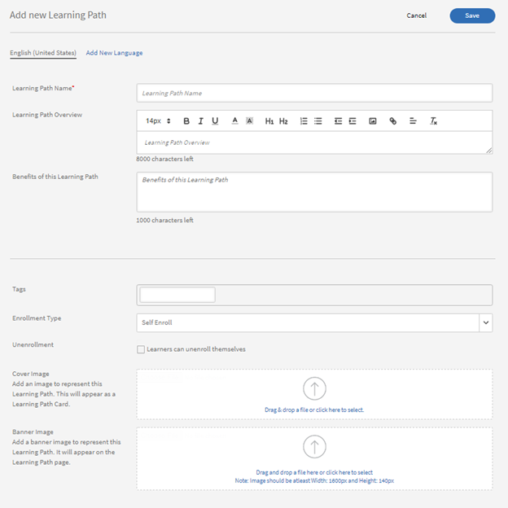
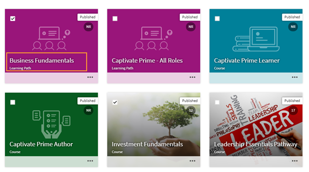
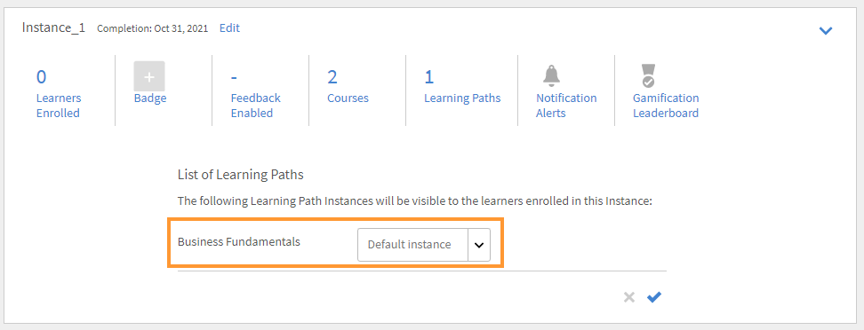

# Lernpläne

## Was ist ein Lernplan?

Häufig sind Administratoren daran interessiert, einen detaillierten Lehrplan zu erstellen, der tiefgründige Kenntnisse über ein bestimmtes Thema oder einen Fachbereich bietet. Es kann sich auch um eine Abfolge von Schulungen handeln, die die Mitarbeiter oder Kunden abschließen sollen. Dies erfordert die Bündelung einer Reihe von Kursen und Programmen, um ein vollständiges Schulungspaket zu erstellen.

Hier kommt der Lernplan ins Spiel. Ein Lernplan ist eine Reise, die ein Teilnehmer durchlaufen muss, um ein Thema im Laufe der Zeit zu meistern. Die Teilnehmer haben die Kontrolle über ihre Schulungserfahrung und können mit größerer Effektivität Kenntnisse auf selbstständige Weise erwerben und behalten.

Wenn ein Unternehmen beispielsweise neue Mitarbeiter einbaut, führt es Schulungen zu Richtlinien und Verfahren, Kultur, Geschichte usw. durch. Ein Lernplan richtet die Kurse entsprechend den Bedürfnissen der Mitarbeiter ein, damit Mitarbeiter sich gemäß dem Lernplan für die Kurse registrieren können. Sie wählen die Kurse aus und können Benutzer für diesen Plan registrieren, damit sie von Kurs zu Kurs weiterarbeiten können.

## Erstellen und Konfigurieren von Lernpfaden

In dieser Schulung erfahren Sie, wie Sie einen Lernpfad erstellen, ihm einen Kurs hinzufügen, einen Lernpfad veröffentlichen und einstellen und Instanzen in einem Lernpfad konfigurieren.

Wenn Sie die Schulung nicht starten können, schreiben Sie an <almacademy@adobe.com>.

## Vorteile eines Lernplans

Lernpläne machen die Bereitstellung eines Schulungsprogramms bequem und einfach. Im Folgenden finden Sie einige der wichtigsten Vorteile eines Lernplans:

1. Sie können Kenntnisse und Kenntnisstufen direkt Lehrplänen zuweisen. Sie müssen keine Credits für Kenntnisse abgleichen. Sobald der Teilnehmer einen Lernplan abgeschlossen hat, erreicht er die erwähnte Kenntnisstufe.
1. Möglichkeit, einen vorhandenen Lernplan in einen neuen Lernplan einzubetten. Die Funktion des Einbettens ist nur für eine Ebene des Einbettens verfügbar. Daher kann ein Lernplan, der bereits einen eingebetteten Plan enthält, nicht in einen neuen Plan eingebettet werden.
1. Möglichkeit, Voraussetzungen, Arbeitshilfen und Ressourcen auf Lernplanebene hinzuzufügen.
1. Möglichkeit, Abschnitte zu erstellen. Jeder Abschnitt kann einen Titel haben.
1. Möglichkeit, Abschnitte obligatorisch zu machen und Abschlusskriterien festzulegen.

## Hinzufügen eines Lernplans in Learning Manager

Klicken Sie im Lern-Manager in der Admin-App auf **[!UICONTROL Lernpfad]** im linken Bereich.

Klicken Sie auf der Seite **[!UICONTROL Lernplan]** auf **[!UICONTROL Hinzufügen]**. Geben Sie die folgenden Details ein.

*Neuen Lernpfad hinzufügen*

Wählen Sie in der Option **Registrierungstyp** die Option **Selbstregistrierung** oder **Administratorregistrierung** aus.

>[!NOTE]
>
>Wenn Sie die Option **Admin Enroll** auswählen, werden den Teilnehmern nur vom Manager nominierte oder vom Manager genehmigte Kurse angezeigt. Teilnehmer können den Lernpfad im Abschnitt &quot;Empfehlungen&quot; nicht sehen.

Nachdem Sie den Lernplan erstellt haben, wählen Sie den neu erstellten Lernplan aus und fügen Sie die Kurse in dem Plan hinzu.

Sie können Kenntnisse hinzufügen und dem Lernplan ein Abzeichen zuweisen. Um eine Kenntnis hinzuzufügen, wählen Sie die erforderliche Kenntnis bzw. die erforderlichen Kenntnisse aus der Dropdownliste **[!UICONTROL Kenntnisse wählen]** aus. Wählen Sie auch die Ebene für die Kenntnis bzw. Kenntnisse aus.

*Kenntnisse hinzufügen*

Weisen Sie dem Lernplan ein Abzeichen zu. Wählen Sie ein Abzeichen aus der Liste der verfügbaren Abzeichen aus.

Wählen Sie die Produkt-, Rollen- und Rollenebene im Abschnitt **[!UICONTROL Für]** empfehlen aus, um diesen Lernpfad den Benutzern vorzuschlagen, die Interesse an diesen Produkten und Rollen bekundet haben.

*Empfehlung*

Wählen Sie nach Bedarf den gewünschten Abfolgetyp für die Abschnitte und Schulungen, d. h. „Geordnet“ oder „Nicht geordnet“.

Wenn Sie „Geordnet“ auswählen, erscheinen die Kurse in der Reihenfolge, in der Sie diese erstellt haben. Wenn Sie „Nicht geordnet“ auswählen, wird für die Kurse keine Reihenfolge festgesetzt. Die Teilnehmer können die Kurse dann in beliebiger Reihenfolge ausführen.

Um einen Kurs im Lernplan hinzuzufügen, klicken Sie auf **[!UICONTROL Kurse oder Lernpläne hinzufügen]**.

Wählen Sie im angezeigten Dialogfeld die Schulung aus, die Sie dem Lernplan hinzufügen möchten.

*Schulung zum Lernpfad hinzufügen*

Sie können die Kurse weiter nach den zugewiesenen Kenntnissen, dem Änderungsdatum und der Kurseffektivität sortieren.

Nachdem Sie die Kurse oder den Lernplan ausgewählt haben, klicken Sie auf **[!UICONTROL Speichern]**.

Im Lernplan können Sie Folgendes durchführen:

**Abschnitt erstellen und konfigurieren:** Ein Abschnitt wird erstellt, um mehrere Schulungskurse zu gruppieren, mit denen ein Bereich oder ein wesentlicher Teil der Schulung abgeschlossen wird. Jeder Abschnitt kann einen Titel haben. Jeder Abschnitt kann auch als obligatorisch mit spezifischen Abschlussanforderungen gekennzeichnet werden.

**Die Kurse in jedem Abschnitt als obligatorisch definieren:** Aktivieren oder deaktivieren Sie das Kontrollkästchen „Obligatorisch“, wenn Sie die Schulungen in dem Lernplan als obligatorisch definieren möchten bzw. nicht möchten. Wenn Sie das Kontrollkästchen aktivieren, können Sie entweder alle Schulungen als obligatorisch definieren oder einige Schulungen als obligatorisch definieren.

*Die Kurse in jedem Abschnitt als obligatorisch festlegen*

**Reihenfolge ändern:** Sie können die Kurse nach oben oder unten verschieben und damit ihre Reihenfolge ändern.

*Reihenfolge der Schulung ändern*

**Kurs entfernen:** Klicken Sie auf der Kurskarte auf das X und entfernen Sie den Kurs damit aus dem Lernplan.

*Kurs aus dem Lernpfad entfernen*

Nachdem Sie die Änderungen vorgenommen haben, klicken Sie auf &quot;Publish&quot;, um den Lernpfad zu veröffentlichen.

## Verschachtelter oder erweiterter Lernpfad

Ein verschachtelter oder verbesserter Lernpfad ist ein Lernpfad, der mehrere Lernpfade enthält. Um einen Lernpfad einzufügen, folgen Sie demselben Vorgang wie das Hinzufügen eines Kurses innerhalb eines Lernpfads.

*Verschachtelter oder verbesserter Lernpfad*

## Lernplaneinstellungen

Im Bereich „Einstellungen“ können Sie die Voraussetzungen und Arbeitshilfen hinzufügen, die ein Teilnehmer absolvieren muss, bevor er den Lernplan starten kann. Sie können auch Ressourcen hinzufügen, die für den Teilnehmer hilfreich sind.

*Einstellungen eines Lernpfads ändern*

## Instanzen

Die Lernplaninstanzen zeigen die zusätzliche Kachel **[!UICONTROL Lernpläne]** an. Die Kachel zeigt die Anzahl der Lernprogramme an, die zu einem Lernplan hinzugefügt wurden.

In der Kachel **Kurse** sehen Sie die Kursinstanzen, die für die Teilnehmer sichtbar sind, die für diese Instanz registriert sind.

Das Kontrollkästchen **[!UICONTROL Machen Sie es für Teilnehmer möglich, auf Instanzen zuzugreifen (Flexibler Lernplan)]** gilt nur für Kurse. Mit dieser Option können Teilnehmer ihre Instanzen im Lernpfad wechseln. Alle untergeordneten Lernpläne erhalten eine Option zum Zuordnen einer Lernprogramminstanz zu Lernplänen. Standardmäßig ist die Zuordnung auf „Standardinstanz“ festgelegt.

*Lernpfadinstanzen*

Teilnehmer können für einen Kurs über einen Lernplan oder von einem Administrator registriert werden, selbst wenn der Kurs flexibel ist und der Teilnehmer eine Sitzung auswählen muss. In diesen Fällen ermöglicht das System Teilnehmern die Registrierung, selbst wenn das Sitzlimit erreicht ist, aber sie können den Kurs nicht starten, bis eine Lizenz verfügbar ist.

Die Wartelistenfunktion gilt nur, wenn sich die Teilnehmer selbst registrieren. Wenn eine Sitzung die Höchstzahl an Lizenzen erreicht, kann der Kursleiter die Liste der auf die Warteliste gesetzten Teilnehmer anzeigen. Wenn Plätze verfügbar werden, kann der Kursleiter Teilnehmer auf die Warteliste setzen, bis die Sitzung wieder voll einsatzfähig ist.

## Benachrichtigungen

Es gibt drei Optionen:

1. **[!UICONTROL Alle Qualifikationsstufen Kurse und Lernpfade (standardmäßig ausgewählt)]:** Der Teilnehmer erhält Benachrichtigungen für alle unvollständigen Kurse, unabhängig von der Ebene in einem Lernpfad.
1. **[!UICONTROL Stammlernpfad]:** Der Teilnehmer erhält Benachrichtigungen für alle unvollständigen Kurse, die zu einem übergeordneten Lernpfad gehören.
1. **[!UICONTROL Lernpfad + nur untergeordnete Elemente der ersten Kenntnisstufe]:** Der Teilnehmer erhält Benachrichtigungen über alle unvollständigen Kurse, die ein erstes untergeordnetes Element eines übergeordneten Lernpfads sind.

Die Benachrichtigungserinnerungen werden basierend auf der Option ausgelöst. Standardmäßig ist die Option **[!UICONTROL Alle Kursebenen und Lernpfade]** für eine Instanz aktiviert.

## Abonnements

Sie können die einzelnen Lernpfade abonnieren, um umfassende Daten einschließlich Quizpunktzahlen und Teilnehmerstatus direkt in Ihrem Posteingang zu erhalten.

Führen Sie die folgenden Schritte aus:

1. Navigieren Sie zu einem beliebigen Lernpfad > Abonnements.
1. Wählen Sie Weitere hinzufügen.
1. Wählen Sie die Details aus und geben Sie die E-Mail-ID ein, die die Berichte erhalten soll.

*Einzeln-Lernpfad abonnieren*

## Wichtiger Hinweis

Beachten Sie, dass die bisherige Funktion „Lernprogramme“ unmittelbar nach der Veröffentlichung in „Lernplan“ umbenannt wird. Wenn Sie es weiterhin als Lernprogramme anrufen möchten, empfehlen wir Ihnen, die Funktion &quot;Terminologien&quot; zu verwenden, um die erforderliche Terminologie anzuwenden. Auf diese Weise können Sie weiterhin den Begriff „Lernprogramm“ verwenden.

Lernpläne bieten Ihnen eine Reihe von Funktionen. Einige davon sind unmittelbar nach der Veröffentlichung verfügbar. Administratoren/Autoren können sie direkt verwenden. Erweiterte Funktionen wie &quot;Abschnitte&quot;, &quot;Lernpfad in einem anderen Pfad hinzufügen&quot; usw. sind deaktiviert und können durch Aktivieren des unten genannten Kontrollkästchens aktiviert werden.

Teilnehmer können weiterhin Lernprogramme nutzen (jetzt als „Lernpläne“ bezeichnet) und Autoren/Administratoren können sie auch weiterhin erstellen. Um die oben genannten erweiterten Funktionen des Lernplans zu nutzen, sollte der Administrator die entsprechende Einstellung wie unten beschrieben aktivieren. Sobald diese Option aktiviert ist, stehen alle neuen erweiterten Funktionen von „Lernplan“ zur Verfügung.

Die Seite **[!UICONTROL Einstellungen]** > **[!UICONTROL Allgemein]** verfügt über eine neue Option zum Aktivieren von Lernpfaden. Wenn diese Option aktiviert ist, können Sie Kurse und Lernprogramme in einem Lernplan hinzufügen. Sie können die Option nicht mehr ändern, nachdem sie aktiviert wurde.

<!--
 ## Other Learning Path-related details 

### Learning Path option is disabled/unchecked in Admin Settings

**Accounts using Native Web apps**

**Learners**

* By default, learners will notice a change in terminology from "Learning Program" to Learning Path". This has been done to make the interface more intuitive. If you do not want this change, refer to the below points.  

* This change however will not be reflected in the UI if you have already used the 'Custom Terminology" function to replace the terminology "Learning Programs" with some custom text. 
* In case you had not used the Custom Terminology function yet but now wish to retain "Learning Programs" as the terminology, you can do so via the 'Custom Terminology' feature post the release.

* The overall cosmetic look and feel of erstwhile 'Learning Programs' will get updated to a more visually rich look and feel.

**Authors and Admins**

* The terminology within the Admin/Author apps is the same as that of learners.
* The UI for Authors and Admins to create, update the erstwhile 'Learning Program' objects will now be updated to the new UI. There is no loss of functionality, just that the User Interface to do the operation will be much more intuitive. These UI changes will reflect in your account, even if you have chosen not to enable 'Extended Features of Learning Path', with no loss in functionality. 

* Note that any existing Learning Program objects will not change so there is no impact on learners (other than the terminology point noted above). Authors/Admins might notice a default grouping called "Section" within their existing objects, which would be of no material impact as far as functionality goes. Authors/Admins will also see added functionalities like Skills, Job Aids etc. But as you haven't used it yet, it will not create any impact on the learner side till you actually start using it.

**Reporting**

* If you do not enable the option, Learning Path , there are no changes in the Learner Transcript report structure due to Learning Path. But as communicated in earlier notice (refer to the table shared in earlier communication); one new column will get added to the extreme right of the Learner Transcript immediately after the release.

**Accounts using Headless LMS**

**Learners**

* There are no changes for learners in headless interface. APIs as well that are used to generate the reports does not have immediate changes. 

**Authors and Admins**

* Same changes as that of Authors/Admins stated above.

**Reporting**

* Same changes as that of Reporting stated above.

### Learning Paths option is enabled/checked in Admin Settings

**Accounts using Native Web apps**

**Learners**

* Same changes as that of Learners when the option is disabled.
* As you start using the extended functionality of Learning Paths, Learners will benefit from seeing more elaborate paths with embedded paths and sections, Skills and badges being earned on path completion, resources at path level, and other benefits.

**Authors and Admins**

* Same changes as that of Authors and Admins when the option is disabled.

* Users will get more functionality in crafting elaborate paths. You can define Skill-Levels that would automatically be achieved by a learner on completion of path (not have to focus on the arithmetic of Credits for the levels). Resources can be added at the path level (Not possible as of today). Sections can be created with each section having the ability to have X of Y options. One can embed a Learning Path within another Learning Path (one level of hierarchy supported)

**Reporting**

* A few new columns will get added to the 'Learner Transcript' and 'Content Report' structures to incorporate the new feature of embedding of paths within paths. This may impact integration code that you may have written to export this data to your custom data warehouse/DB outside Learning Manager. This information is communicated in the table provided in earlier communication.

**Accounts using Headless LMS**

**Learners**

* There is no change for your learners, unless you make changes to your headless LMS implementation, as the APIs on which you have built your headless interface will not be changing.
* If you do start using the extended features of Learning Paths by creating new Learning Paths, however you will have to make changes to the headless LMS implementation to reflect those on your learner app. The Learning Manager APIs will allow you to do that.

**Authors and Admins**

* Same changes as that of Authors/Admins stated above.

**Reporting**

* Same changes as that of Reporting stated above. 
-->
