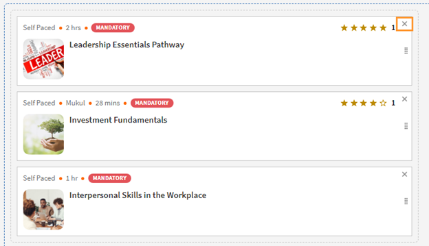

# Lernpläne

## Was ist ein Lernplan?

Oft sind Administratoren daran interessiert, einen detaillierten Lehrplan zu erstellen, der detaillierte Kenntnisse zu einem bestimmten Thema oder einem Fachgebiet bietet. Es kann sich auch um eine Reihe von Schulungen handeln, die von den Mitarbeitern oder Kunden erwartet werden. Dies erfordert die Bündelung einer Reihe von Kursen und Programmen, um ein vollständiges Schulungspaket zu erstellen.

Hier kommt der Lernpfad ins Spiel. Ein Lernpfad ist eine Reise, die ein Teilnehmer durchlaufen muss, um ein Thema im Laufe der Zeit zu meistern. Die Teilnehmer haben die Kontrolle über ihre Schulungserfahrung und können mit größerer Effektivität Kenntnisse auf selbstständige Weise erwerben und behalten.

Wenn ein Unternehmen beispielsweise neue Mitarbeiter einbaut, führt es Schulungen zu Richtlinien und Verfahren, Kultur, Geschichte usw. durch. Ein Lernplan richtet die Kurse entsprechend den Bedürfnissen der Mitarbeiter ein, damit Mitarbeiter sich gemäß dem Lernplan für die Kurse registrieren können. und Sie können Benutzer für diesen Pfad registrieren, damit sie von Kurs zu Kurs fortschreiten können.

## Erstellen und Konfigurieren von Lernpfaden

In dieser Schulung erfahren Sie, wie Sie einen Lernpfad erstellen, ihm einen Kurs hinzufügen, einen Lernpfad veröffentlichen und einstellen und Instanzen in einem Lernpfad konfigurieren.

Wenn Sie die Schulung nicht starten können, schreiben Sie an <almacademy@adobe.com>.

## Vorteile eines Lernplans

Lernpläne machen die Bereitstellung eines Schulungsprogramms bequem und einfach. Im Folgenden finden Sie einige der wichtigsten Vorteile eines Lernplans:

1. Sie können Kenntnisse und Kenntnisstufen direkt Lehrplänen zuweisen. Es ist keine Zuordnung von Kenntniskrediten erforderlich. Sobald der Teilnehmer einen Lernpfad abgeschlossen hat, erreicht er die erwähnte Kenntnisstufe.
1. Möglichkeit, einen vorhandenen Lernplan in einen neuen Lernplan einzubetten. Die Einbettungsfunktion ist nur für eine Einbettungsebene verfügbar. Daher kann ein Lernpfad, der bereits einen eingebetteten Pfad enthält, nicht in einen neuen Pfad eingebettet werden.
1. Möglichkeit, Voraussetzungen, Arbeitshilfen und Ressourcen auf Lernplanebene hinzuzufügen.
1. Möglichkeit, Abschnitte zu erstellen. Jeder Abschnitt kann einen Titel haben.
1. Möglichkeit, Abschnitte obligatorisch zu machen und Abschlusskriterien festzulegen.

## Hinzufügen eines Lernpfads im Lern-Manager

Klicken Sie im Lern-Manager in der Admin-App auf **[!UICONTROL Lernpfad]** im linken Bereich.

Im Dialogfeld &quot; **[!UICONTROL Lernpfad]** klicken Sie auf **[!UICONTROL Hinzufügen]**. Geben Sie die folgenden Details ein.

*Neuen Lernpfad hinzufügen*

Im Dialogfeld &quot; **Registrierungstyp** wählen Sie **Selbstregistrierung** oder **Registrierung durch Administrator**.

>[!NOTE]
>
>Wenn Sie die Option **Registrierung durch Administrator** können Teilnehmer nur Kurse sehen, die vom Manager nominiert oder vom Manager genehmigt wurden. Teilnehmer können den Lernpfad im Abschnitt &quot;Empfehlungen&quot; nicht sehen.

Nachdem Sie den Lernplan erstellt haben, wählen Sie den neu erstellten Lernplan aus und fügen Sie die Kurse in dem Plan hinzu.

Sie können Kenntnisse hinzufügen und dem Lernplan ein Abzeichen zuweisen. Um Kenntnisse hinzuzufügen, wählen Sie die erforderlichen Kenntnisse aus der Liste &quot; **[!UICONTROL Kenntnisse auswählen]** Dropdown-Liste. Wählen Sie auch die Ebene für die Kenntnis bzw. Kenntnisse aus.

*Kenntnisse hinzufügen*

Weisen Sie dem Lernplan ein Abzeichen zu. Wählen Sie ein Abzeichen aus der Liste der verfügbaren Abzeichen aus.

Wählen Sie die Produkt-, Rollen- und Rollenebene im Dialogfeld &quot; **[!UICONTROL Für]** , um den Benutzern, die Interesse an diesen Produkten und Rollen bekundet haben, diesen Lernpfad vorzuschlagen.

*Empfehlung*

Wählen Sie den Sequenzierungstyp für die Abschnitte und die Schulung &quot;Geordnet&quot; oder &quot;Ungeordnet&quot;.

Wenn Sie „Geordnet“ auswählen, erscheinen die Kurse in der Reihenfolge, in der Sie diese erstellt haben. Wenn Sie „Nicht geordnet“ auswählen, wird für die Kurse keine Reihenfolge festgesetzt. Die Teilnehmer können die Kurse dann in beliebiger Reihenfolge ausführen.

Um einen Kurs dem Lernpfad hinzuzufügen, klicken Sie auf **[!UICONTROL Kurse oder Lernpfade hinzufügen]**.

Wählen Sie im angezeigten Dialogfeld die Schulung aus, die Sie dem Lernplan hinzufügen möchten.

*Schulung zum Lernpfad hinzufügen*

Sie können die Kurse weiter nach den zugewiesenen Kenntnissen, dem Änderungsdatum und der Kurseffektivität sortieren.

Nachdem Sie die Kurse oder den Lernpfad ausgewählt haben, klicken Sie auf **[!UICONTROL Speichern]**.

Im Lernplan können Sie Folgendes durchführen:

**Erstellen und konfigurieren Sie einen Abschnitt:** Ein Abschnitt wird erstellt, um mehrere Schulungskurse zu gruppieren, die einen Bereich oder einen wesentlichen Bestandteil der Schulung abschließen. Jeder Abschnitt kann einen Titel haben. Jeder Abschnitt kann auch als obligatorisch mit spezifischen Abschlussanforderungen gekennzeichnet werden.

**Machen Sie die Kurse in jedem Abschnitt obligatorisch:** Aktivieren oder deaktivieren Sie das Kontrollkästchen Obligatorisch , wenn Sie die Schulungen im Lernpfad als obligatorisch festlegen möchten/nicht möchten. Wenn Sie das Kontrollkästchen aktivieren, können Sie entweder alle Schulungen oder einige der Schulungen als obligatorisch festlegen.

*Machen Sie die Kurse in jedem Abschnitt obligatorisch*

**Reihenfolge ändern:** Sie können die Kurse nach oben oder unten verschieben und ihre Reihenfolge ändern.

*Reihenfolge der Schulung ändern*

**Kurs entfernen:** Klicken Sie auf der Kurskarte auf X und entfernen Sie den Kurs aus dem Lernpfad.

*Entfernen eines Kurses aus dem Lernpfad*

Nachdem Sie die Änderungen vorgenommen haben, klicken Sie auf &quot;Veröffentlichen&quot;, um den Lernpfad zu veröffentlichen.

## Verschachtelter Lernplan

Sie können einen Lernplan in einen Lernplan einfügen, aber Sie können höchstens einen Lernplan darin verschachteln.

Fügen Sie den Lernplan wie einen Kurs ein.

*Hinzufügen eines Lernpfads innerhalb eines Lernpfads*

## Lernplaneinstellungen

Im Bereich „Einstellungen“ können Sie die Voraussetzungen und Arbeitshilfen hinzufügen, die ein Teilnehmer absolvieren muss, bevor er den Lernplan starten kann. Sie können auch Ressourcen hinzufügen, die für den Teilnehmer hilfreich sind.

*Ändern der Einstellungen eines Lernpfads*

## Instanzen

Die Lernplaninstanzen zeigen die zusätzliche Kachel **[!UICONTROL Lernpläne]** an. Die Kachel zeigt die Anzahl der Lernprogramme an, die zu einem Lernplan hinzugefügt wurden.

Im Dialogfeld &quot; **Kurse** können Sie die Kursinstanzen sehen, die für die Teilnehmer sichtbar sind, die bei dieser Instanz registriert sind.

Die **[!UICONTROL Teilnehmern das Auswählen von Instanzen ermöglichen (flexibler Lernpfad)]** Das Kontrollkästchen gilt nur für Kurse. Alle untergeordneten Lernpfade erhalten eine Option, um eine Lernprogramminstanz dem Lernpfad zuzuordnen. Standardmäßig ist die Zuordnung auf „Standardinstanz“ festgelegt.

*Instanzen von Lernpfaden*

## Benachrichtigungen

Es gibt drei Optionen:

1. **[!UICONTROL Alle Qualifikationsstufen Kurse und Lernpfade (standardmäßig ausgewählt)]:** Der Teilnehmer erhält Benachrichtigungen für unvollständige Kurse, unabhängig von der Ebene in einem Lernpfad.
1. **[!UICONTROL Stammlernpfad]:** Der Teilnehmer erhält Benachrichtigungen für alle unvollständigen Kurse, die zu einem übergeordneten Lernpfad gehören.
1. **[!UICONTROL Lernpfad + nur die ersten untergeordneten Kenntnisstufen]:** Der Teilnehmer erhält Benachrichtigungen über alle unvollständigen Kurse, die ein erstes untergeordnetes Element eines übergeordneten Lernpfads sind.

Die Benachrichtigungserinnerungen werden basierend auf der Option ausgelöst. Standardmäßig ist die Option **[!UICONTROL Alle Stufen von Kursen und Lernpfaden]** für eine Instanz aktiviert ist.

## Abonnements

Sie können die einzelnen Lernpfade abonnieren, um umfassende Daten einschließlich Quizpunktzahlen und Teilnehmerstatus direkt in Ihrem Posteingang zu erhalten.

Führen Sie die folgenden Schritte aus:

1. Navigieren Sie zu einem beliebigen Lernpfad > Abonnements.
1. Wählen Sie Weitere hinzufügen.
1. Wählen Sie die Details aus und geben Sie die E-Mail-ID ein, die die Berichte erhalten soll.

*Abonnieren Sie einen individuellen Lernpfad*

## Wichtiger Hinweis

Bitte beachten Sie, dass die vorhandene Funktion von Lernprogrammen unmittelbar nach der Veröffentlichung in Lernpfad umbenannt wird. Wenn Sie es weiterhin als Lernprogramme anrufen möchten, empfehlen wir Ihnen, die Funktion &quot;Terminologien&quot; zu verwenden, um die erforderliche Terminologie anzuwenden. Auf diese Weise können Sie weiterhin den Begriff „Lernprogramm“ verwenden.

Lernpläne bieten Ihnen eine Reihe von Funktionen. Einige davon sind unmittelbar nach der Veröffentlichung verfügbar. Administratoren/Autoren können sie direkt verwenden. Erweiterte Funktionen wie &quot;Abschnitte&quot;, &quot;Hinzufügen eines Lernpfads in einem anderen Pfad&quot; usw. deaktiviert sind und aktiviert werden können, indem Sie das unten genannte Kontrollkästchen aktivieren.

Teilnehmer können weiterhin Lernprogramme (jetzt &quot;Lernpfade&quot; genannt) nutzen und Autoren/Administratoren können sie auch weiterhin erstellen. Um die erweiterten Funktionen des oben genannten Lernpfads zu nutzen, sollte der Administrator die Einstellung wie unten erwähnt aktivieren. Nach der Aktivierung stehen alle neuen erweiterten Funktionen des Lernplans zur Verfügung.

Die **[!UICONTROL Einstellungen]** > **[!UICONTROL Allgemein]** eine neue Option zum Aktivieren von Lernpfaden. Wenn diese Option aktiviert ist, können Sie Kurse und Lernprogramme in einem Lernplan hinzufügen. Sie können die Option nicht mehr ändern, nachdem sie aktiviert wurde.

<!-- ## Other Learning Path-related details 

### Learning Path option is disabled/unchecked in Admin Settings

**Accounts using Native Web apps**

**Learners**

* By default, learners will notice a change in terminology from "Learning Program" to Learning Path". This has been done to make the interface more intuitive. If you do not want this change, refer to the below points.  

* This change however will not be reflected in the UI if you have already used the 'Custom Terminology" function to replace the terminology "Learning Programs" with some custom text. 
* In case you had not used the Custom Terminology function yet but now wish to retain "Learning Programs" as the terminology, you can do so via the 'Custom Terminology' feature post the release.

* The overall cosmetic look and feel of erstwhile 'Learning Programs' will get updated to a more visually rich look and feel.

**Authors and Admins**

* The terminology within the Admin/Author apps is the same as that of learners.
* The UI for Authors and Admins to create, update the erstwhile 'Learning Program' objects will now be updated to the new UI. There is no loss of functionality, just that the User Interface to do the operation will be much more intuitive. These UI changes will reflect in your account, even if you have chosen not to enable 'Extended Features of Learning Path', with no loss in functionality. 

* Note that any existing Learning Program objects will not change so there is no impact on learners (other than the terminology point noted above). Authors/Admins might notice a default grouping called "Section" within their existing objects, which would be of no material impact as far as functionality goes. Authors/Admins will also see added functionalities like Skills, Job Aids etc. But as you haven't used it yet, it will not create any impact on the learner side till you actually start using it.

**Reporting**

* If you do not enable the option, Learning Path , there are no changes in the Learner Transcript report structure due to Learning Path. But as communicated in earlier notice (refer to the table shared in earlier communication); one new column will get added to the extreme right of the Learner Transcript immediately after the release.

**Accounts using Headless LMS**

**Learners**

* There are no changes for learners in headless interface. APIs as well that are used to generate the reports does not have immediate changes. 

**Authors and Admins**

* Same changes as that of Authors/Admins stated above.

**Reporting**

* Same changes as that of Reporting stated above.

### Learning Paths option is enabled/checked in Admin Settings

**Accounts using Native Web apps**

**Learners**

* Same changes as that of Learners when the option is disabled.
* As you start using the extended functionality of Learning Paths, Learners will benefit from seeing more elaborate paths with embedded paths and sections, Skills and badges being earned on path completion, resources at path level, and other benefits.

**Authors and Admins**

* Same changes as that of Authors and Admins when the option is disabled.

* Users will get more functionality in crafting elaborate paths. You can define Skill-Levels that would automatically be achieved by a learner on completion of path (not have to focus on the arithmetic of Credits for the levels). Resources can be added at the path level (Not possible as of today). Sections can be created with each section having the ability to have X of Y options. One can embed a Learning Path within another Learning Path (one level of hierarchy supported)

**Reporting**

* A few new columns will get added to the 'Learner Transcript' and 'Content Report' structures to incorporate the new feature of embedding of paths within paths. This may impact integration code that you may have written to export this data to your custom data warehouse/DB outside Learning Manager. This information is communicated in the table provided in earlier communication.

**Accounts using Headless LMS**

**Learners**

* There is no change for your learners, unless you make changes to your headless LMS implementation, as the APIs on which you have built your headless interface will not be changing.
* If you do start using the extended features of Learning Paths by creating new Learning Paths, however you will have to make changes to the headless LMS implementation to reflect those on your learner app. The Learning Manager APIs will allow you to do that.

**Authors and Admins**

* Same changes as that of Authors/Admins stated above.

**Reporting**

* Same changes as that of Reporting stated above. -->
