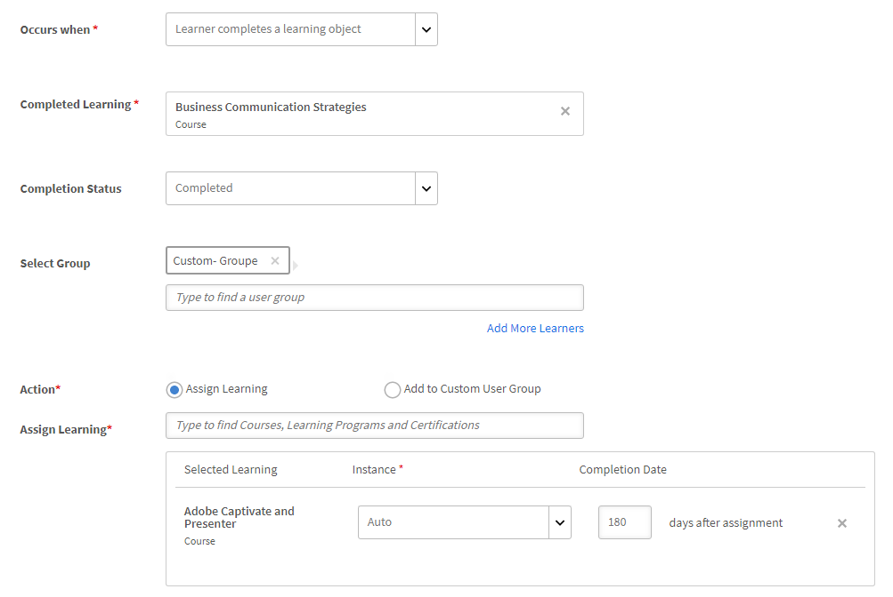
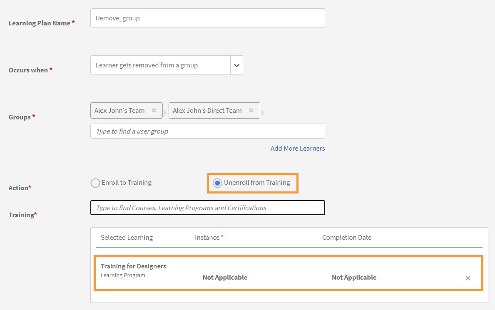
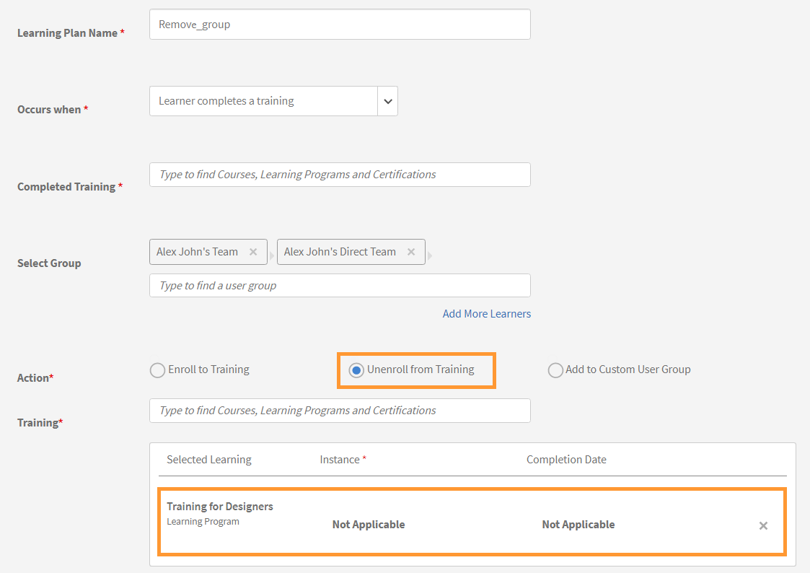

# Lernpläne

Erstellen von Lernplänen für Administratoren im Learning Manager.

## Übersicht {#overview}

Ein Lernplan ist eine Reihe von Regeln, die Teilnehmer zu bestimmten Schulungen auf der Grundlage bestimmter Kriterien registrieren.

Ein Lernplan ermöglicht es einem Administrator, Kurse, Lernprogramme oder Zertifizierungen automatisch zuzuweisen, basierend auf dem Auftreten bestimmter Ereignisse wie dem Einsteigen eines neuen Mitarbeiters oder der Änderung der Bezeichnung oder des Standorts des Mitarbeiters.

Wenn beispielsweise ein Mitarbeiter einer Organisation beitritt, wird das Programm zur Orientierung neuer Mitarbeiter dem Mitarbeiter automatisch zugewiesen. Wenn ein Mitarbeiter zum Manager befördert wird, wird dem Mitarbeiter automatisch ein neues Manager-Orientierungsprogramm zugewiesen.

Sie können Teilnehmer anhand eines vordefinierten Satzes von Ereignissen automatisch für beliebige Kurse und Lernprogramme registrieren. Sie können Lernpfade für die Teilnehmer erstellen, indem Sie automatisch eine Anschluss-Lernaktivität zuweisen, nachdem ein Teilnehmer eine Qualifikation, einen Kurs oder ein Lernprogramm abgeschlossen hat.

## Lernpläne erstellen {#createlearningplans}

Um einen Lernplan zu erstellen, müssen Sie sich als Administrator anmelden.

1. Klicken Sie im linken Teilfenster auf **[!UICONTROL Lernpläne]**. Wenn bereits Ereignisse vorhanden sind, werden sie auf der Seite aufgelistet. Wenn Sie jedoch die Lernplanfunktion zum ersten Mal einrichten, fahren Sie mit dem nächsten Schritt fort.
1. Klicken Sie oben rechts auf der Seite auf **[!UICONTROL Hinzufügen]**. Im Dialogfeld &quot; **[!UICONTROL Lernplan hinzufügen]** den Namen des Lernplans ein, den ein Mitarbeiter annehmen muss.

   

1. Im Dialogfeld &quot; **[!UICONTROL Tritt auf, wenn]** das gewünschte Ereignis aus. Die Optionen bestimmen, wann ein Teilnehmer den Kurs besucht. Wählen Sie nach Auswahl des Ereignistyps die entsprechende Schulung, Kurse, das Lernprogramm oder die Zertifizierung aus.

   **Hinweis:** Sowohl Administratoren als auch Autoren können Ereignisse für die automatische Registrierung erstellen.

   Die Ereignisse sind:

   **1 - Ein neuer Teilnehmer wird hinzugefügt:** Wenn ein neuer Benutzer oder ein Mitarbeiter der Organisation beitritt.

   

   **2 - Teilnehmer wird einer Gruppe hinzugefügt:** Wenn ein neuer Benutzer oder ein Mitarbeiter einer Gruppe beitritt.  Geben Sie die Benutzergruppe aus der Dropdownliste, für die dieses Ereignis gilt, ein. Sie können mehrere Gruppen auswählen. Außerdem können Sie dieses Ereignis allen vorhandenen Mitgliedern dieser Gruppen zuweisen, indem Sie die Option auswählen.

   

   Dieser Lernplan ist speziell für ***Benutzerdefiniert - Gruppe*** -Benutzer. Geben Sie den Namen der Gruppe in das Feld ein und wählen Sie die Gruppe oder Gruppen mithilfe der Type-Ahead-Suche aus.

   **3 - Teilnehmer schließt ein Lernobjekt ab:** Das Ereignis wird ausgelöst, wenn ein Teilnehmer Lernobjekte wie Kurse, Lernprogramme usw. abschließt. Wählen Sie das Lernobjekt aus, für das dieses Ereignis gilt. Wählen Sie den Abschlussstatus für das Ereignis aus. Optional können Sie auch die Benutzergruppe auswählen, zu der dieser Teilnehmer gehört. Geben Sie die Anzahl der Tage nach Abschluss des Lernobjekts ein, um dieses Ereignis auszulösen. Wählen Sie die Option aus, wenn dieses Ereignis vorhandenen Benutzern zugewiesen werden soll, die dieses Lernobjekt bereits abgeschlossen haben.

   

   **4 - Der Teilnehmer erreicht eine Kenntnisstufe:** Geben Sie den Namen der Qualifikation ein und wählen Sie die Qualifikationsstufe aus. Sie können auch die Benutzergruppe auswählen, zu der dieser Teilnehmer gehört. Dies ist optional. Geben Sie die Anzahl der Tage nach dem Erwerb der Kenntnisse ein, wird dieses Ereignis ausgelöst. Wählen Sie die Option, wenn Sie dieses Ereignis vorhandenen Teilnehmern zuweisen möchten, die diese Qualifikation bereits erreicht haben.

   

   Legen Sie außerdem die Anzahl der Tage fest, nach denen der Lernplan den Teilnehmern zugewiesen werden muss.

   

   **5 - An einem bestimmten Datum:** Wenn die Ereignisse an einem bestimmten Datum auftreten müssen. Wählen Sie das Datum aus, an dem das Ereignis zugewiesen werden muss. Wählen Sie die Benutzergruppen, für die das Ereignis automatisch zugewiesen werden muss. Wählen Sie die Instanzen aus, die zugewiesen werden müssen, und geben Sie optional ein, nach wie vielen Tagen das Ereignis ausgelöst werden muss.

   

1. Für alle Ereignisse können Sie die Instanz aus der Dropdown-Liste **[!UICONTROL Instanz]** Dropdown-Liste. Sie können für jedes Ereignis auch Instanzen des zugewiesenen Teilnehmers auswählen.

   

   Im Lern-Manager erstellt ein Lernplan seine eigene Instanz, &quot;Auto&quot;. Wenn Sie eine Gruppe auswählen, z. B. &quot;Alle Teilnehmer&quot;, werden standardmäßig alle Teilnehmer im Lernplan für die Instanz &quot;Auto&quot; registriert.

   Wenn Sie den Lernplan speichern, wird die Instanz &quot;Automatisch&quot; als Option in der **[!UICONTROL Instanz auswählen]** im Abschnitt &quot;Teilnehmer&quot; eines Kurses.

1. Klicken Sie zum Speichern des Lernplans auf **[!UICONTROL Speichern]**.

## Registrierung für Schulung widerrufen {#unenroll-training}

Beim Hinzufügen eines Lernplans kann ein Administrator die Registrierung von Benutzern für bestimmte Schulungen basierend auf bestimmten Triggern aufheben.

Klicken Sie in der Admin-App auf **[!UICONTROL Lernpläne]** > **[!UICONTROL Hinzufügen]**.

In den folgenden Abschnitten werden die Auslöser dargestellt, in denen die Option **[!UICONTROL Registrierung für Schulung widerrufen]** wurde hinzugefügt.

## Teilnehmer wird aus einer Gruppe entfernt {#learnergetsremovedfromagroup}

1. Fügen Sie eine oder mehrere Benutzergruppen hinzu. Wenn mehrere Gruppen ausgewählt sind, wird der Plan ausgelöst, wenn ein Teilnehmer aus einer der genannten Gruppen entfernt wird.
1. Wählen Sie die Aktion als **[!UICONTROL Registrierung für Schulung widerrufen]**.

   1. Der Administrator kann die Schulungen auswählen, für die die Registrierung des Benutzers widerrufen wird, wenn er aus der Benutzergruppe entfernt wird.
   1. Das Instanz- und Abschlussdatum gelten in diesem Szenario nicht.

## Teilnehmer hat eine Schulung abgeschlossen {#learnercompletesatraining}

1. Fügen Sie eine oder mehrere Benutzergruppen hinzu. Wenn mehrere Gruppen ausgewählt sind, wird der Plan ausgelöst, wenn ein Teilnehmer die angegebene Schulung abschließt.
1. Wählen Sie die Aktion als **[!UICONTROL Registrierung für Schulung widerrufen]**.

   1. Der Administrator kann die Schulungen auswählen, für die die Registrierung des Benutzers widerrufen wird, wenn er der Benutzergruppe hinzugefügt wird.
   1. Das Instanz- und Abschlussdatum gelten in diesem Fall nicht.

## Teilnehmer wird zu einer Gruppe hinzugefügt {#learnergetsaddedtoagroup}

1. Fügen Sie eine oder mehrere Benutzergruppen hinzu. Wenn mehrere Gruppen ausgewählt sind, wird der Plan ausgelöst, wenn ein Teilnehmer einer der genannten Gruppen hinzugefügt wird.
1. Wählen Sie die Aktion Registrierung für Schulung widerrufen.

   1. Der Administrator kann die Schulungen auswählen, für die die Registrierung des Benutzers widerrufen wird, wenn er der Benutzergruppe hinzugefügt wird.
   1. Das Instanz- und Abschlussdatum gelten in diesem Fall nicht.

## Teilnehmer erreicht Kenntnisstufe {#learnerachievesaskilllevel}

1. Geben Sie die zu erreichende Kenntnis an.
1. Fügen Sie eine oder mehrere Benutzergruppen hinzu. Wenn mehrere Gruppen ausgewählt sind, wird der Plan ausgelöst, wenn ein Teilnehmer die ausgewählte Kenntnis erworben hat.

## An einem bestimmten Datum {#onaspecificdate}

1. Wählen Sie das Datum aus, an dem die Registrierung von Teilnehmern aufgehoben werden soll.
1. Fügen Sie eine oder mehrere Benutzergruppen hinzu. Wenn mehrere Gruppen ausgewählt sind, wird der Plan am Tag ausgelöst und die Registrierung der Benutzer widerrufen, die Teil der ausgewählten Gruppen sind.
1. Wählen Sie die Aktion Registrierung für Schulung widerrufen.

   1. Der Administrator kann die Schulungen auswählen, für die die Registrierung des Benutzers am angegebenen Datum widerrufen wird.
   1. Das Instanz- und Abschlussdatum gelten in diesem Fall nicht.

## Lernplan bearbeiten {#editalearningplan}

Nach dem Erstellen eines Lernplans kann der Administrator den Lernplan jederzeit bearbeiten/aktualisieren. Klicken Sie zum Bearbeiten auf den Namen des Lernplans und ändern Sie die Werte im Dialogfeld &quot; **[!UICONTROL Lernplan bearbeiten]** ein Popup-Dialogfeld angezeigt. Klicken **[!UICONTROL Speichern]**.

## Lernplan aktivieren {#enablealearningplan}

Standardmäßig sind alle neuen Lernpläne, die Sie erstellt haben, deaktiviert. Sie müssen einen Plan aktivieren, dem ein Teilnehmer zugewiesen werden soll. Wenn Sie das Kontrollkästchen aktivieren **[!UICONTROL Aktuelle Teilnehmer]**, wird das Ereignis von selbst aktiviert.

Um einen Lernplan zu aktivieren,

1. Wählen Sie aus der Liste der Lernpläne den Plan aus, den Sie aktivieren möchten.

   

1. Klicken Sie oben rechts auf der Seite auf **[!UICONTROL Aktionen]** > **[!UICONTROL Aktivieren]**. Dadurch wird der Lernplan aktiviert.

## Lernplan löschen {#deletealearningplan}

Um einen Lernplan zu löschen,

1. Wählen Sie aus der Liste der Lernpläne den Plan aus, den Sie löschen möchten.
1. Klicken Sie oben rechts auf der Seite auf **[!UICONTROL Aktionen]** > **[!UICONTROL Löschen]**.

## Lernplan deaktivieren {#disablealearningplan}

Um einen Lernplan zu deaktivieren,

1. Klicken Sie auf die Registerkarte **[!UICONTROL Aktiviert]**.
1. Wählen Sie in der Liste der Lernpläne den Plan aus, den Sie deaktivieren möchten.
1. Klicken Sie oben rechts auf der Seite auf **[!UICONTROL Aktionen]** > **[!UICONTROL Deaktivieren]**. Dadurch wird der Plan in den **[!UICONTROL Deaktiviert]** &quot; ändern.

## Lernplan filtern {#filteralearningplan}

Sie können Lernpläne nach der Art des Ereignisses filtern, das beim Erstellen eines Lernplans verwendet wurde. Klicken **[!UICONTROL Typ]** und wählen Sie eine beliebige Option aus, um Lernpläne anzuzeigen, die der Auswahl entsprechen.

## Häufig gestellte Fragen {#frequentlyaskedquestions}

1. Wie richte ich den Learning Manager ein, um die automatische Registrierung für die Aufnahme neuer Mitarbeiter zu konfigurieren?

   Im Dialogfeld &quot; **[!UICONTROL Tritt auf, wenn]** aus, wählen Sie die Option **[!UICONTROL Neuer Teilnehmer wird hinzugefügt]**. Weisen Sie dann die Lernobjekte, die Instanz und das Abschlussdatum für den Teilnehmer zu. Sowohl Administratoren als auch Autoren können Ereignisse für die automatische Registrierung erstellen. Aktivieren Sie das Ereignis, nachdem Sie es erstellt haben.

1. Wie richte ich einen Lernplan/eine automatische Registrierung für den Unterricht und den virtuellen Unterrichtskurs ein?

   Es wird empfohlen, die Kursinstanz mit den erforderlichen Sitzungsdetails einzurichten. Richten Sie dann einen Lernplan ein und ordnen Sie ihn der bereits erstellten Kursinstanz zu.

1. Wie kann ich die Liste der Teilnehmer anzeigen, die bei einem bestimmten Lernplan registriert sind?

   Wenn die Instanz Auto erstellt wird, klicken Sie auf **[!UICONTROL Kurs]** > **[!UICONTROL Teilnehmer]**, und wählen Sie die gewünschte Instanz aus der Dropdown-Liste **[!UICONTROL Instanz]** Dropdown-Liste.
