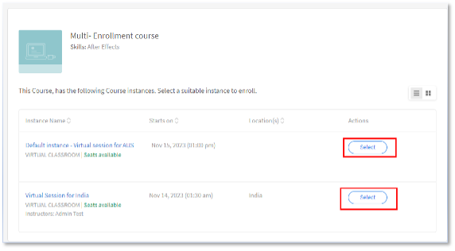

# Mehrere Registrierungen in Adobe Learning Manager

Im Adobe Learning Manager kann jeder Kurs verschiedene Instanzen haben. Als Kontoadministrator(in) ist es eine Ihrer Hauptaufgaben, verschiedene Instanzen von VILT-Sitzungen in verschiedenen Zeitzonen zu erstellen und möglicherweise Sitzungen für bestimmte Benutzer(innen)gruppen zu erstellen.

Wenn vor der Version vom Juli 2023 ein(e) Administrator(in) Teilnehmende registrierte, konnten sie nur bei einer einzigen Instanz registriert werden. Wenn Teilnehmende einen Kurs in verschiedenen Instanzen absolvieren möchte, erstellt die/der Administrator(in) viele Kurse, einen für jede Instanz.

Die Funktion für mehrere Registrierungen in Adobe Learning Manager hilft Administrator(innen), solche Szenarien zu vermeiden.

## Was ist Mehrfachregistrierung?

Mehrere Registrierungen registrieren Teilnehmende mehrmals in einem Kurs über verschiedene verfügbare Instanzen.  Ein Teilnehmer kann sich in mehreren Kursinstanzen registrieren, unabhängig davon, in welchem Status er sich registriert, abgeschlossen oder noch nicht gestartet hat. Wenn Autor(inn)en die Option [!UICONTROL Mehrfachregistrierung] umschalten, kann sich ein(e) Teilnehmende(r) für mehrere Instanzen des Kurses registrieren.

*Starten der Mehrfachregistrierung über die Einstellungen*

Der Fortschritt jeder Instanz kann einzeln verfolgt werden, und ein Bericht kann exportiert werden, um den Fortschritt jeder Instanz zu verfolgen.

## Wichtige Aspekte

* Eine Mehrfachregistrierung ist nur bei einem Kurs mit mehreren Instanzen möglich.
* Sobald die Option für Mehrfachregistrierungen aktiviert ist und Benutzende in mehreren Instanzen registriert sind, werden neue Zeilen für jeden Kurs im Teilnehmertranskriptbericht erstellt (eine Zeile für jede Instanz und jede(n) Teilnehmende(n)).
* Wenn die Berichtsautomatisierung eingerichtet ist, die nur eine Zeile pro Kurs vorwegnimmt, müssen Sie die erforderlichen Anpassungen an der Berichtsautomatisierung vornehmen, bevor Sie die Funktion zur Mehrfachregistrierung aktivieren.

## Aktivieren der Mehrfachregistrierung

1. Melden Sie sich bei Ihrem Adobe Learning Manager-Konto als Autor an.
1. Wählen Sie den Kurs aus, für den sich die Teilnehmer mehrmals registrieren sollen.
1. Wählen Sie im linken Bereich **[!UICONTROL Einstellungen]** > **[!UICONTROL Bearbeiten]** > **[!UICONTROL Instanzkonfiguration]** > **[!UICONTROL Mehrfache Registrierung aktivieren]**.

*Aktivieren Sie die Mehrfacheinschreibung.*

>[!NOTE]
>
>Als Autor können Sie nicht gleichzeitig den Instanzwechsel und die Mehrfacheinschreibung aktivieren.

## Teilnehmendenansicht

Mehrfachregistrierungen sind hilfreich, wenn Teilnehmende sich für einen Klassenzimmer- oder VC-Kurs registrieren oder einen Kurs erneut abschließen möchte, bevor sie zu einem anderen Kurs wechseln.

Für Teilnehmende, die sich nicht registriert haben und einen Kurs auswählen, wird der Bildschirm unter dem Kurs mit mehreren Instanzen angezeigt. Dann können sie jede Instanz auswählen und sich registrieren.

*Instanzen anzeigen*

Nach der Registrierung für eine Instanz können sie sich für andere Instanzen registrieren, indem sie im rechten Bereich die Option Alle Instanzen anzeigen auswählen.

*Bei einer Instanz registrieren*

Der Fortschritt jeder Instanz kann wie folgt verfolgt werden:

*Status jeder Instanz verfolgen.*

## Änderungen an Mehrfachregistrierungen im Administrator

**Registrierung:**

Während der Registrierung der Teilnehmenden können Sie das folgende Kontrollkästchen aktivieren:

*&quot;Ausgewählte Teilnehmer sind möglicherweise bereits bei anderen Instanzen dieses Kurses registriert. Ermöglichen Sie diesen Teilnehmenden, auch bei der Instanz registriert zu sein ...“*

*Registrierungsoption für Administratoren*

Wenn der Teilnehmer bereits in einer Instanz registriert ist und Sie als Administrator versuchen, den Teilnehmer in einer anderen Kursinstanz zu registrieren, wählen Sie &quot;Ja&quot;.

## Berichte

Für Teilnehmende, die für zwei Instanzen desselben Kurses registriert sind, werden für jede Kursinstanz zwei Zeilen erstellt. Der Bericht zeigt auch den Fortschritt der Instanzen an.
