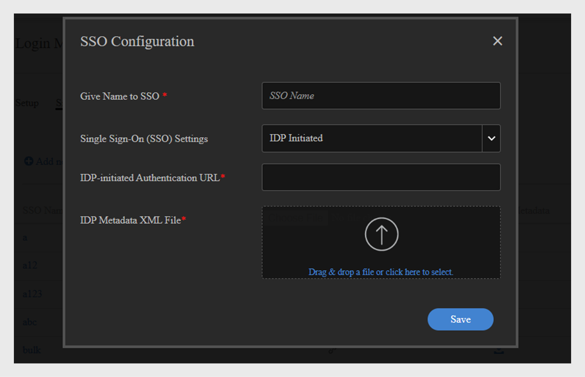

# Mehrere SSO-Anmeldungen {#multiple-sso-logins}

Ein Administrator kann mehrere Anmeldemethoden für interne und externe Benutzer konfigurieren. Adobe Learning Manager unterstützt mehrere SSO-Anmeldungen, mit denen Administratoren die Anmeldemethode je nach ihren Anforderungen und Anwendungsfällen konfigurieren können.

Ziel ist es, Administratoren die Konfiguration unterschiedlicher SSO-Methoden für verschiedene Benutzergruppen, beispielsweise je nach Standort oder Organisation, zu ermöglichen.

Einem Konto können bis zu 20 SSO-Konfigurationen hinzugefügt werden. Diese können verwendet werden, um SSO für interne und externe Benutzer einzurichten.

>[!NOTE]
>
>Beim Aktivieren von Multi-SSO können Sie Werte oder Benutzergruppen im Selbstregistrierungsprofil auswählen. Wenn Sie einen Wert auswählen, wird eine Benutzergruppe mit null Benutzern erstellt. Eine solche Benutzergruppe hat keinen Benutzer. Wenn die nächste CSV-Datei importiert wird, wird diese Benutzergruppe entfernt.

## Aktivieren mehrerer SSO-Methoden

Um mehrere SSO zu aktivieren, wählen Sie **Einstellungen** > **Anmeldungsmethoden**.

Aktivieren Sie auf der Einrichtungsseite das Kontrollkästchen &#39;**[!UICONTROL Mehrere Single Sign-On (SSO) aktivieren]**&#39; für interne oder externe Benutzer.

Wenn Multi-SSO aktiviert ist, wird die für &quot;Standardanmeldemethode&quot; ausgewählte Anmeldungsmethode zum Standardanmeldetyp für Benutzergruppen/Profile, die nicht mit einer SSO-Konfiguration verknüpft sind. Die Standardanmeldung kann als Adobe ID, SSO oder ALM ID (externe Benutzer) festgelegt werden.

>[!NOTE]
>
>Administratoren und benutzerdefinierte Administratoren mit den erforderlichen Berechtigungen können diese Schritte ausführen.

Zum Konfigurieren eines SSO führen Sie die folgenden Schritte aus:

1. Klicken Sie auf Single Sign-on (SSO) konfigurieren.
1. Klicken Sie auf Neue SSO-Konfiguration hinzufügen .\
   
1. Fügen Sie im Dialogfeld „SSO-Konfiguration“ Folgendes hinzu:

   * Geben Sie den Namen der SSO-Methode ein.
   * Wählen Sie den SSO-Typ aus: IdP-initiiert oder SP-initiiert.

      * Wenn Sie &quot;IdP initiiert&quot; ausgewählt haben, geben Sie die IdP-URL ein. Diese URL wird als eindeutiger Bezeichner für Ihre Anwendung verwendet. Sie erhalten sie von Ihrem IdP-Dienstanbieter. Dies ist die URL, zu der alle Adobe Learning Manager-Benutzer nach der Anmeldung umgeleitet werden.
      * Laden Sie die XML-Datei mit den IdP-Metadaten von Ihrem IdP-Anbieter hoch. Diese Datei enthält Informationen zum IdP, mit denen Adobe Learning Manager SAML-Assertions von diesem akzeptieren kann.
      * Wenn Sie SP initiiert ausgewählt haben, geben Sie die Entitäts-ID ein. Die Entitäts-ID ist eine URL, die vom Dienstanbieter (Service Provider, SP) bereitgestellt wird.
      * Geben Sie die SP-Anmelde-URL ein. Diese URL wird von den Benutzern verwendet, um sich bei der Anwendung anzumelden.

1. Die SSO-Konfiguration wird der Liste hinzugefügt.

## Einrichten von SSO für interne Benutzer

### Benutzer aus einer CSV-Datei

Führen Sie die nachfolgenden Schritte aus:

1. Importieren Sie die CSV-Datei, die die aktiven Felder und deren Werte enthält.
1. Klicken Sie auf Einstellungen > Anmeldemethoden.
1. Aktivieren Sie das Kontrollkästchen **[!UICONTROL Multiple Single Sign-On (SSO) aktivieren]** für die Anmeldung.
1. Ordnen Sie die SSO-Konfigurationen den Werten des aktiven Felds zu.
1. Speichern Sie die Einstellungen. Importieren Sie die CSV-Datei erneut.

### Einzelner Benutzer

Führen Sie die nachfolgenden Schritte aus:

1. Klicken Sie auf Einstellungen > Anmeldemethoden.
1. Aktivieren Sie das Kontrollkästchen **[!UICONTROL Multiple Single Sign-On (SSO) aktivieren]** für die Anmeldung.
1. Wählen Sie ein aktives Feld für ein SSO aus.
1. Verknüpfen Sie die SSO-Konfigurationen mit den Werten des Felds.
1. Speichern Sie die Einstellungen. Fügen Sie einen einzelnen Benutzer hinzu und weisen Sie einen Wert für das aktive Feld zu.

### Selbstregistrierte Benutzer

Führen Sie die nachfolgenden Schritte aus:

1. Klicken Sie auf Einstellungen > Anmeldemethoden.
1. Aktivieren Sie das Kontrollkästchen **[!UICONTROL Multiple Single Sign-On (SSO) aktivieren]** für die Anmeldung.
1. Verknüpfen Sie die SSO-Konfigurationen mit den Werten des Felds.
1. Speichern Sie die Einstellungen. Fügen Sie einen einzelnen Benutzer hinzu und weisen Sie einen Wert für das aktive Feld zu.
1. Selbstregistrierungsprofil hinzufügen
1. Wählen Sie einen Wert für das konfigurierte SSO-Feld aus.

Nach dem Speichern der Profileinstellungen leitet die kopierte URL die Benutzer zu dem SSO weiter, das mit dem für das Profil ausgewählten Wert verknüpft ist.

### Einrichten von SSO für externe Benutzer

Führen Sie die nachfolgenden Schritte aus:

1. Erstellen Sie ein externes Profil.
1. Klicken Sie auf Einstellungen > Anmeldemethoden.
1. Aktivieren Sie das Kontrollkästchen **[!UICONTROL Multiple Single Sign-On (SSO) aktivieren]** für die Anmeldung.
1. Verknüpfen Sie die SSO-Konfiguration mit dem erstellten externen Profil.
1. Speichern Sie die Einstellungen.

Nach dem Speichern der Profileinstellungen werden die Benutzer nach dem Speichern über die URL des externen Profils zu dem SSO umgeleitet, das mit dem Profil verknüpft ist.

## Häufig gestellte Fragen

+++ Wer kann mehrere SSOs für Benutzer aktivieren?

Sowohl der Administrator als auch der benutzerdefinierte Administrator können mehrere SSO-Methoden aktivieren.
+++

+++Kann ich ein vorhandenes oder ein neues aktives Feld mit einem Wert verwenden?

Ja, Sie können ein vorhandenes oder ein neues aktives Feld mit einem einzelnen Wert verwenden, um mehrere SSO-Methoden einzurichten.
+++

+++Wenn eine CSV-Datei deaktivierte Felder enthält, schlägt die Einrichtung mehrerer SSOs fehl?

Nein, dies hat keine Auswirkungen auf die Einrichtung der SSO-Methoden. Benutzer werden zu einer bereits konfigurierten SSO-Methode umgeleitet.
+++

+++Kann ein Administrator dem aktiven Feld auf der Seite beim Einrichten von Multi-SSO neue Werte hinzufügen?

Ja, ein Administrator kann den aktiven Feldern neue Werte hinzufügen.
+++

+++Kann ich mit SSO verknüpfte Felder deaktivieren oder löschen?

Ja, Sie können mit SSO verknüpfte Felder deaktivieren oder löschen, bis Sie die Verknüpfung der Felder auf der SSO-Einrichtungsseite aufheben.
+++
