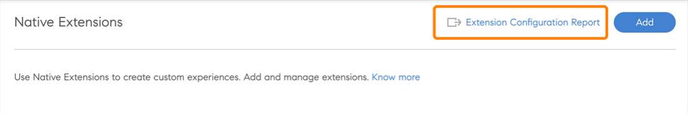

# Native Erweiterbarkeit.

Sie können benutzerdefinierte Erlebnisse in der nativen Version von Adobe Learning Manager einrichten, sodass Sie Headless nicht für weniger komplizierte Fälle verwenden können. Sie können auch benutzerdefinierte Apps erstellen und sie an verschiedenen Punkten in der nativen Version der Workflows für Teilnehmer, Manager, Administrator, Autor oder Kursleiter platzieren.

Adobe Learning Manager unterstützt 15 Aufrufpunkte in der Admin-, Autor-, Teilnehmer-, Manager- und Kursleiter-App.

## Erweiterung erstellen

1. Wählen Sie als Administrator im linken Bereich **[!UICONTROL Native Erweiterungen]**.
1. Wählen Sie Erweiterung hinzufügen.
1. Geben Sie den Namen der Erweiterung in das Feld &quot; **[!UICONTROL Name]** ein.
1. Geben Sie die Beschreibung der Erweiterung in das Feld **[!UICONTROL Beschreibung]** ein.
1. Wählen Sie einen Aufrufpunkt aus. Ein Aufrufpunkt ist eine beliebige Stelle im Adobe Learning Manager, an der ein Link oder eine Schaltfläche in einer benutzerdefinierten App eingefügt werden kann. Die folgenden Aufrufpunkte sind verfügbar:

   Wählen Sie für dieses Beispiel **[!UICONTROL Administrator]**, **[!UICONTROL Autor: Kurs]**, **[!UICONTROL Lernpfad]** - **[!UICONTROL Instanzen]** - **[!UICONTROL Instanzzeile]**.

   
   *Aufrufpunkt auswählen*

1. Geben Sie die Erweiterungsbeschriftung ein, die auf der Benutzeroberfläche im Dialogfeld &quot; **[!UICONTROL Erweiterungsbeschriftung]** ein.
1. Geben Sie die URL, unter der Sie die Erweiterung hosten möchten, in das Feld &quot; **[!UICONTROL URL]** ein.
1. Wählen Sie in der Dropdown-Liste Öffnen in aus, ob die Erweiterung in einem modalen oder in einem neuen Register gestartet werden soll.
1. Wählen Sie die Größe des Modals aus. Die Optionen stehen zur Verfügung, wenn Sie *In-App* im vorherigen Schritt.

   Um die Barrierefreiheit im Popup beizubehalten, muss die Erweiterungs-App an das Ereignis gesendet werden, sobald sie sich auf dem letzten fokussierbaren Element auf ihrer Website befinden, und dann wählt der Benutzer die TAB-TASTE aus. Dies wird benötigt, um den Fokus im Popup-Fenster zu halten und die Barrierefreiheit zu unterstützen.

   ```
   window.parent.postMessage({*}
   
   { type: 'ALM_EXTENSION_APP', eventType: 'trapFocusInModal' }
   
   ,{}'');
   ```

1. Legen Sie den Geltungsbereich der Erweiterung fest. Die folgenden Bereiche sind verfügbar:

   * **[!UICONTROL Alle Kurse, Lernpfade und Zertifizierungen]**: Diese Erweiterung ist für alle Kurse, Lernpfade und Zertifizierungen aktiviert. Zusammen mit Administratoren können Autoren sie für einige Kurse, Lernpläne und Zertifizierungen deaktivieren.
   * **[!UICONTROL Ausgewählte Kurse, Lernpfade und Zertifizierungen]**: Diese Erweiterung ist für alle Kurse, Lernpfade und Zertifizierungen deaktiviert. Zusammen mit Administratoren können Autoren sie für einige Kurse, Lernpfade und Zertifizierungen aktivieren.

1. Wählen Sie das **[!UICONTROL Aktivieren]** , um die Erweiterung zu aktivieren. Sobald die Erweiterung aktiv ist, wird sie entsprechend dem Gültigkeitsbereich am angegebenen Aufrufpunkt angezeigt.
1. Auswählen **[!UICONTROL Speichern]** oben rechts auf der Seite, um die Erweiterung zu erstellen.

## Auf die Erweiterung als Administrator zugreifen

1. Wählen Sie als Administrator **[!UICONTROL Lernpfade]** in der linken Symbolleiste.
1. Kurs auswählen > **[!UICONTROL Lernpfad anzeigen]**.
1. Auswählen **[!UICONTROL Instanzen]** im linken Bereich.
1. Auswählen **[!UICONTROL Mehr]** im Abschnitt &quot;Instanzen&quot;. Die Erweiterung wird im Abschnitt &quot;Instanzen&quot; angezeigt.

   
   *Erweiterung auswählen*

   Wenn Sie die Erweiterung auswählen, wird sie im modalen Format angezeigt.

## Auf die Erweiterung als Autor zugreifen

1. Wählen Sie als Administrator **[!UICONTROL Lernpfade]** in der linken Symbolleiste.
1. Kurs auswählen > **[!UICONTROL Lernpfad anzeigen]**.
1. Auswählen **[!UICONTROL Instanzen]** im linken Bereich.
1. Auswählen **[!UICONTROL Mehr]** im Abschnitt &quot;Instanzen&quot;. Die Erweiterung wird im Abschnitt &quot;Instanzen&quot; angezeigt.

   
   *Als Autor auf die Erweiterung zugreifen*

   Wenn Sie die Erweiterung auswählen, wird sie im modalen Format angezeigt.

## Alle Erweiterungen anzeigen

Als Administrator können Sie alle Erweiterungen auf der Seite Native Erweiterungen anzeigen. Um die Liste anzuzeigen, wählen Sie Native Erweiterungen im linken Bereich der App aus.


*Alle Erweiterungen anzeigen*

## Aktivieren oder Deaktivieren von Erweiterungen

Als Autor können Sie auf der Seite &quot;Einstellungen&quot; eines Kurses eine Erweiterung für einen Kurs, eine Zertifizierung oder einen Lernpfad aktivieren oder deaktivieren.


*Aktivieren einer Erweiterung*

## Freigeben eines Zugriffschlüssels

Sie müssen den Schlüssel Zugriff freigeben, wenn Sie eine Registrierungserweiterung konfigurieren.

Dies ist wichtig, da die Authentifizierung für die Registrierung fehlschlägt, wenn dieser Schlüssel nicht generiert und in allen geteilt wird und die Teilnehmer sich nicht für die Kurse selbst registrieren können.

Der Zugriffsschlüssel muss für die Registrierung für einen Kurs oder einen Lernpfad und für Zertifikate gemeinsam genutzt werden.

Generieren Sie auf der Registerkarte &quot;Einstellungen&quot; den Schlüssel.


*Freigeben des Zugriffsschlüssels*

## Erweiterungsbericht herunterladen

Es gibt zwei Möglichkeiten, diesen Bericht herunterzuladen.

**Erweiterungskonfigurationsbericht**

1. Wählen Sie auf der Seite Native Erweiterungen **[!UICONTROL Erweiterungskonfigurationsbericht]**.

   
   *Erweiterungsbericht herunterladen*

   Der Bericht wird generiert.

1. Wählen Sie OK.

   
   *Bericht generieren*

   Der Bericht enthält die folgenden Felder:

   * Erweiterungsname
   * Aufrufpunkt
   * Bezeichnung
   * In URL öffnen
   * Umfang
   * Aktivieren
   * Eindeutige LO-ID
   * Schulungs-ID
   * Schulungstyp
   * Schulungsname

**Berichtsseite**

1. In **[!UICONTROL Berichte]** > **[!UICONTROL Benutzerdefinierte Berichte]**&quot; die Option **[!UICONTROL Erweiterungskonfigurationsbericht]**.

   
   *Bericht von der Seite &quot;Berichte&quot; herunterladen*

Der Status muss im Bereich liegen. **0 - 4294967295**, während Sie den Registrierungsstatus konfigurieren.
