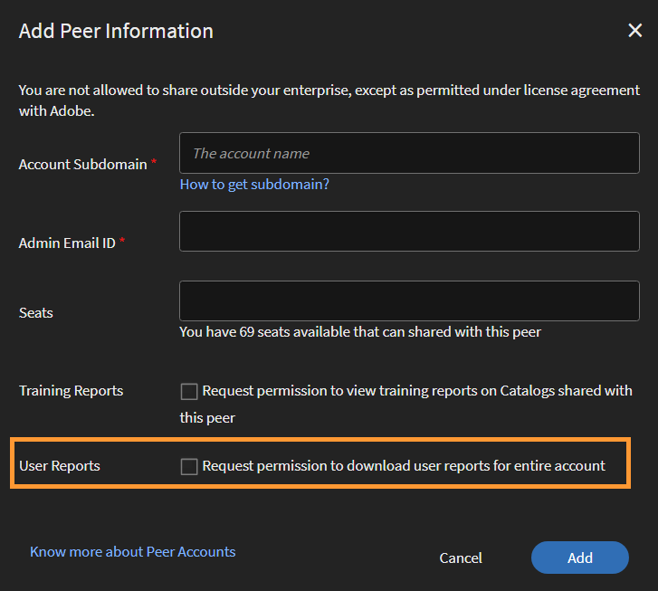

# Peer-Konten

In diesem Artikel erfahren Sie, wie Sie Peer-Konten in Learning Manager erstellen und verwalten.

Learning Manager bietet jetzt die Möglichkeit, erworbene Lizenzen mithilfe der Peer-Konten-Funktion freizugeben. Mit Peer-Konten in Learning Manager kann ein Administrator die erworbenen Lizenzen mit den Peer-Konten, die mit dem Administrator verknüpft sind, freigeben. Darüber hinaus kann der Administrator, der die Freigabe von Lizenzen initiiert hat, die Berichte der Peer-Konen anzeigen.

## Peer-Konto hinzufügen {#addapeeraccount}

1. Klicken Sie im Administrator-Dashboard auf **[!UICONTROL Einstellungen]** > **[!UICONTROL Peer-Konten]**.
1. Klicken Sie in der oberen rechten Ecke auf **[!UICONTROL Hinzufügen]**.

   

   *Peer-Konto hinzufügen*

1. Geben Sie im Feld **[!UICONTROL Konto-Unterdomäne]** die Unterdomäne an, mit der Sie ein Peer-Konto einrichten möchten.

   

   *Unterdomäne hinzufügen*

>[!NOTE]
>
>Um die Unterdomäne eines anderen Kontos zu finden, überprüfen Sie die URL des Kontos. Die Unterdomäne wird vor der Hauptdomäne angezeigt und hilft bei der Identifizierung des spezifischen Kontos.
>
>Beispiel:
>
>In der URL [https://www.learningmanager.com/accountname](https://www.learningmanager.com/accountname) lautet die Unterdomäne **Kontoname**.
>
>In der URL [https://www.accountname.learningmanager.com](https://www.accountname.learningmanager.com) ist die Unterdomäne auch **Kontoname**.
>
>Die Unterdomäne ist für jedes Konto eindeutig und wird für den Zugriff auf die entsprechende Lernmanagerinstanz verwendet.

1. Geben Sie die E-Mail-ID des Administrators ein, der entweder die Peer-Konto-Anforderungen annimmt oder ablehnt.
1. Geben Sie die Anzahl der Lizenzen ein, die Sie mit Ihren Peers teilen möchten. Wenn Sie Lizenzen für das Peer-Konto freigeben, wechselt das Peer-Konto in den Status Aktiv mit den empfangenen Lizenzen oder mit den eigenen erworbenen Lizenzen des Peers.

   Wenn Sie eine Zahl eingeben, die größer ist als die Anzahl der verfügbaren Lizenzen ist, zeigt das System eine Warnmeldung an.

1. Aktivieren Sie das Kontrollkästchen, wenn Sie die Einschreibungsberichte und freigegebenen Katalogberichte Ihrer Peers anzeigen möchten.
1. Klicken Sie auf „Hinzufügen“, um das Peerkonto hinzuzufügen.

   Wenn ein Administrator Lizenzen mit einem Peer teilt, kann der Peer sie nicht mit jemand anderem teilen. Allerdings kann der Peer Lizenzen separat erwerben und sie teilen.

## Anzeigen von Berichten, die mit Peer-Konten verknüpft sind {#viewreportsassociatedwithpeeraccounts}

Nachdem Sie ein Peerkonto erstellt haben, können Sie die Berichte für die Peer-Konten erstellen. Wenn Sie die Peer-Konto-Anforderung als Administrator initiieren, können Sie die Berichte für das Peer-Konto anzeigen.

Wenn der Peer auch die Administratorberichte anzeigen möchte, muss der Peer eine separate Peer-Kontoanforderung an den Administrator senden.

Um zu erfahren, wie Sie die freigegebenen Kataloge für das Peer-Konto generieren und anzeigen, lesen Sie [Anzeigen von Peer-Berichten](reports.md#main-pars_header_894271250).

## Peer-Konten löschen {#deletingpeeraccounts}

Wenn Sie keine weiteren Lizenzen oder Käufe mit einem Konto teilen möchten, können Sie das Peer-Konto löschen.

1. Klicken Sie in Learning Manager auf „Einstellungen“ > „Administrator-Dashboard“ > „Peer-Konten“.
1. Wählen Sie das Peer-Konto bzw. die Peer-Konten aus, die Sie löschen möchten.
1. Führen Sie einen der folgenden Schritte aus:

   * Klicken Sie in der rechten oberen Ecke der Seite auf „Löschen“.
   * Klicken Sie auf das Symbol &quot;Löschen&quot; neben dem Peer-Konto, das Sie löschen möchten.

   Nachdem ein Peer-Konto gelöscht wurde, sind die Lizenzen nicht mehr verfügbar. Wenn das Peer-Konto nur empfangene Lizenzen und keine erworbenen Lizenzen hatte, wird das Konto in den inaktiven Status versetzt.

## Benutzerbericht für Peer-Konten {#download-peer-account}

Der Administrator kann den Benutzerbericht des Peer-Kontos anzeigen. Der übergeordnete Kontoadministrator kann den Zugriff auf den Bericht anfordern. Sobald der Peer-Konto-Administrator dies akzeptiert hat, kann der übergeordnete Administrator die Anzahl der registrierten Benutzer im Peer-Konto anzeigen und den Benutzerbericht für ein Peer-Konto herunterladen.

1. Klicken Sie auf der Seite „Peer-Konten“ auf **[!UICONTROL Hinzufügen]**.
1. Aktivieren Sie die Option **[!UICONTROL Berechtigung zum Herunterladen von Benutzerberichten für das gesamte Konto anfordern]**.

*Benutzerbericht eines Peer-Kontos anzeigen*

Klicken Sie auf **[!UICONTROL Herunterladen]**, um die Berichte für Peer-Konten herunterzuladen.

## Häufig gestellte Fragen {#frequentlyaskedquestions}

+++Wie können Lizenzen zwischen Konten geteilt werden?

Wenn Sie ein Peer-Konto hinzufügen, geben Sie die Anzahl der Lizenzen an, die Sie mit einem anderen Peer-Konto teilen können.

*Lizenzen zwischen Konten teilen*
+++
