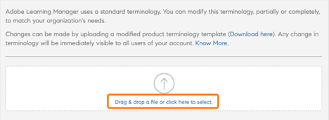

# Produktterminologie

>[!IMPORTANT]
>
>Die Produktterminologie ist nur für die englische Version von Adobe Learning Manager verfügbar.

## Was ist Produktterminologie in Adobe Learning Manager?

Adobe Learning Manager verwendet einen Terminologie-Standardsatz auf der Benutzeroberfläche. Als Administrator(in) können Sie die Terminologie den Anforderungen Ihres Unternehmens anpassen.

Mithilfe der Produktterminologie-Funktion können Sie diese Begriffe umbenennen und den Lernstandards Ihres Unternehmens entsprechen.

## CSV-Terminologiedatei herunterladen

Führen Sie die untengenannten Schritte aus, um die Terminologie zu ändern:

1. Wählen Sie als Administrator **[!UICONTROL Einstellungen]** > **[!UICONTROL Allgemein]**.
1. Im Dialogfeld &quot; **[!UICONTROL Produktterminologie]**&quot; die Option **[!UICONTROL Bearbeiten]**.

   
   _Produktterminologie_

1. Auswählen **[!UICONTROL Hier herunterladen]** und laden Sie die Vorlage der Begriffe herunter.

   
   _Vorlage herunterladen_

## Terminologie ändern

1. Ändern Sie nach dem Herunterladen der CSV-Datei die erforderliche Terminologie in der zweiten Spalte. Sie können zum Beispiel &quot;Modul&quot; in &quot;Schulung&quot; oder &quot;Leaderboard&quot; in &quot;Rangliste&quot; ändern.

   
   _CSV bearbeiten_

1. Speichern Sie die Änderungen.

## Aktualisieren der hochgeladenen CSV-Datei

1. Im Dialogfeld &quot; **[!UICONTROL Produktterminologie]** den Link zum Hochladen der CSV-Datei aus.

   
   _CSV hochladen_

1. Aktualisieren Sie die hochgeladene CSV-Datei.
1. Wählen Sie **[!UICONTROL Speichern]**.

Die Änderungen in der Terminologie spiegeln jetzt eine(n) Autor(in), Teilnehmende(n), Manager(in), Kursleiter(in) oder benutzerdefinierte(n) Administrator(in) für dieses Konto wider.

## Terminologie zurücksetzen

Nachdem Sie die CSV-Datei mit der neuen Terminologie hochgeladen haben, können Sie die Standardterminologie zurücksetzen.

**[!UICONTROL Produktterminologie zurücksetzen]** auswählen.

_Produktterminologie zurücksetzen_

Wenn Sie auf den Link klicken, wird eine Popup-Nachricht zur Bestätigung angezeigt.

_Bestätigungsmeldung_

Die Terminologie wird auf ihren ursprünglichen Namen zurückgesetzt.

## Was nicht geändert wird

Die Terminologieänderungen gelten nicht für:

* E-Mail-Vorlagen (**[!UICONTROL Administrator]** > **[!UICONTROL E-Mail-Vorlagen]**)
* Berichte (**[!UICONTROL Administrator]** > **[!UICONTROL Berichte]**)

